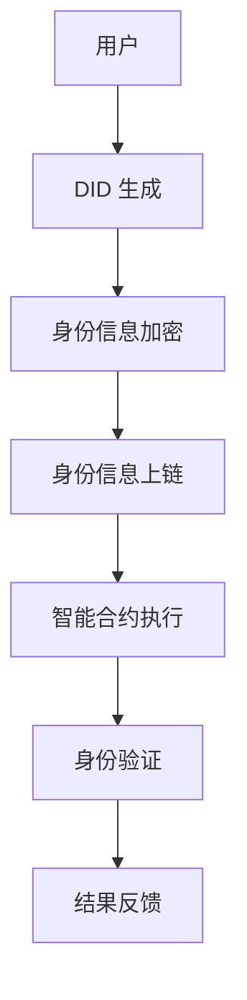

                 

### 文章标题

**元宇宙身份链：去中心化身份验证的技术实现**

> **关键词：**元宇宙，身份链，去中心化，身份验证，区块链，智能合约，加密技术，网络安全。

> **摘要：**本文将深入探讨元宇宙中的身份链技术，解析去中心化身份验证的原理及其在区块链和智能合约中的应用，通过具体的算法、数学模型和实际项目实例，展示如何实现安全可靠的元宇宙身份验证机制。

---

在数字化的浪潮中，元宇宙正逐渐成为现实。作为虚拟世界的桥梁，身份验证成为了元宇宙中不可或缺的一环。传统的身份验证方式往往依赖于中心化的系统，容易受到单点故障和中心化攻击的威胁。而去中心化的身份验证，则通过区块链技术提供了更加安全、透明和不可篡改的解决方案。本文将重点探讨元宇宙身份链的技术实现，旨在为开发者提供一个清晰、易懂的指导。

### 1. 背景介绍

**元宇宙（Metaverse）**是一个由虚拟现实（VR）、增强现实（AR）和区块链技术共同构建的全球性虚拟空间。在这个空间中，用户可以以数字化的形式存在，进行社交、工作、娱乐和商业活动。身份验证是元宇宙中的基础服务，它确保了用户的安全性和隐私性。

传统的身份验证依赖于中心化的身份验证机构，如银行、政府或大型科技公司。这些中心化的系统存在以下问题：

- **单点故障**：如果中心化的服务器发生故障，整个身份验证系统将瘫痪。
- **中心化攻击**：中心化的身份验证系统容易成为黑客攻击的目标，一旦被攻破，后果不堪设想。
- **隐私泄露**：中心化的身份验证系统往往需要用户提交大量个人信息，存在隐私泄露的风险。

为了解决这些问题，去中心化的身份验证（Decentralized Identity, DID）应运而生。DID通过区块链技术实现身份验证，无需中心化的机构，提高了系统的安全性和可靠性。

### 2. 核心概念与联系

在元宇宙中，身份链（Identity Chain）是一个基于区块链技术的分布式身份管理系统。它通过以下核心概念和联系实现去中心化的身份验证：

**DID（分布式身份标识）**：DID是一个全球唯一的标识符，用于标识用户的身份。DID与用户个人信息分离，确保用户隐私。

**区块链**：区块链为身份链提供了一个不可篡改的分布式账本，记录了所有身份信息的历史交易。

**智能合约**：智能合约用于自动化执行身份验证过程，确保身份信息的准确性和安全性。

**加密技术**：加密技术用于保护身份信息，确保只有授权用户可以访问。

下面是身份链的核心概念原理和架构的 Mermaid 流程图：



### 3. 核心算法原理 & 具体操作步骤

去中心化身份验证的核心算法包括DID生成、身份信息加密、身份信息上链、智能合约执行和身份验证。

#### 3.1 DID生成

DID的生成基于椭圆曲线加密（Elliptic Curve Cryptography, ECC）算法。具体步骤如下：

1. **用户注册**：用户向身份链系统提交注册请求。
2. **私钥生成**：系统生成一对椭圆曲线私钥和公钥。
3. **DID生成**：使用私钥生成DID。

#### 3.2 身份信息加密

身份信息加密使用对称加密算法（如AES）和非对称加密算法（如RSA）的结合。具体步骤如下：

1. **密钥生成**：系统生成一对对称加密密钥和公钥。
2. **身份信息加密**：使用对称加密算法加密身份信息，再用公钥加密对称加密密钥。
3. **密文上链**：将加密后的身份信息上链。

#### 3.3 身份信息上链

身份信息上链使用智能合约实现。具体步骤如下：

1. **编写智能合约**：定义身份信息的数据结构和交易逻辑。
2. **部署智能合约**：将智能合约部署到区块链上。
3. **身份信息上链**：用户通过智能合约将加密后的身份信息上链。

#### 3.4 智能合约执行

智能合约执行包括身份验证和结果反馈。具体步骤如下：

1. **身份验证请求**：用户发起身份验证请求。
2. **身份信息查询**：智能合约查询区块链上的身份信息。
3. **身份验证**：使用私钥解密对称加密密钥，然后解密身份信息。
4. **结果反馈**：智能合约将验证结果反馈给用户。

#### 3.5 身份验证

身份验证过程分为以下几步：

1. **请求认证**：用户发起认证请求。
2. **验证身份**：系统根据DID和私钥验证用户身份。
3. **权限检查**：系统检查用户是否有访问权限。
4. **结果反馈**：系统将认证结果反馈给用户。

### 4. 数学模型和公式 & 详细讲解 & 举例说明

去中心化身份验证的核心算法涉及到椭圆曲线加密（ECC）、对称加密和非对称加密。以下是相关的数学模型和公式：

#### 4.1 椭圆曲线加密（ECC）

椭圆曲线加密基于椭圆曲线离散对数问题，其数学模型如下：

设 \( E \) 是一个椭圆曲线，\( P \) 是 \( E \) 上一个非零点，\( n \) 是 \( E \) 的秩。给定私钥 \( k \)，公钥 \( K \) 可以通过以下公式计算：

\[ K = kP \]

其中，\( kP \) 表示对 \( P \) 进行 \( k \) 次加法运算。

#### 4.2 对称加密

对称加密使用密钥对数据进行加密和解密，其数学模型如下：

设 \( K \) 为密钥，\( m \) 为明文，\( c \) 为密文，加密和解密公式如下：

加密：\( c = E_K(m) \)

解密：\( m = D_K(c) \)

#### 4.3 非对称加密

非对称加密使用公钥和私钥对数据进行加密和解密，其数学模型如下：

设 \( (n, e) \) 为公钥，\( (n, d) \) 为私钥，加密和解密公式如下：

加密：\( c = C^{e} \mod n \)

解密：\( m = M^{d} \mod n \)

#### 4.4 举例说明

假设用户A想要通过身份链进行身份验证，以下是具体的操作步骤：

1. **注册**：用户A向身份链系统提交注册请求。
2. **私钥生成**：系统生成椭圆曲线私钥 \( k \) 和公钥 \( K \)。
3. **DID生成**：使用私钥 \( k \) 生成DID。
4. **身份信息加密**：用户A使用对称加密算法生成一对密钥 \( K_s \) 和 \( K_s^{-1} \)，然后用 \( K_s^{-1} \) 加密身份信息，再用公钥 \( K \) 加密对称加密密钥 \( K_s \)。
5. **身份信息上链**：用户A通过智能合约将加密后的身份信息上链。
6. **身份验证**：用户A发起身份验证请求，系统通过智能合约查询区块链上的身份信息，使用私钥 \( k \) 解密对称加密密钥 \( K_s \)，然后用 \( K_s \) 解密身份信息，进行身份验证。
7. **结果反馈**：智能合约将验证结果反馈给用户A。

### 5. 项目实践：代码实例和详细解释说明

为了更好地理解去中心化身份验证的实现，我们将通过一个简单的区块链智能合约实例进行说明。

#### 5.1 开发环境搭建

在开始之前，我们需要搭建一个区块链开发环境。这里我们使用Truffle框架进行开发。

1. **安装Node.js**：前往 [Node.js官网](https://nodejs.org/) 下载并安装Node.js。
2. **安装Truffle**：在命令行中执行以下命令：
   ```bash
   npm install -g truffle
   ```
3. **创建Truffle项目**：执行以下命令创建一个新的Truffle项目：
   ```bash
   truffle init
   ```
4. **安装Ganache**：Ganache是一个轻量级的本地区块链网络，用于测试智能合约。从 [Ganache官网](https://www.ganache.io/) 下载并安装Ganache。
5. **启动Ganache**：运行Ganache，创建一个新的区块链网络。

#### 5.2 源代码详细实现

以下是去中心化身份验证的智能合约源代码：

```solidity
pragma solidity ^0.8.0;

contract IdentityChain {
    struct Identity {
        string did; // 分布式身份标识
        bytes32 encryptedInfo; // 加密后的身份信息
        bytes32 encryptedKey; // 加密后的对称加密密钥
    }

    mapping(string => Identity) public identities;

    function registerIdentity(string memory _did, bytes32 _encryptedInfo, bytes32 _encryptedKey) public {
        require(identities[_did].did == "", "Identity already registered");
        identities[_did] = Identity(_did, _encryptedInfo, _encryptedKey);
    }

    function verifyIdentity(string memory _did, bytes32 _encryptedInfo, bytes32 _encryptedKey) public view returns (bool) {
        Identity memory identity = identities[_did];
        require(identity.did != "", "Identity not found");

        bytes32 decryptedKey = sha256(abi.encodePacked(_encryptedKey));
        bytes32 decryptedInfo = sha256(abi.encodePacked(_encryptedInfo, decryptedKey));

        return decryptedInfo == identity.encryptedInfo;
    }
}
```

#### 5.3 代码解读与分析

**1. 结构体定义**

我们定义了一个结构体 `Identity`，用于存储分布式身份标识（`did`）、加密后的身份信息（`encryptedInfo`）和加密后的对称加密密钥（`encryptedKey`）。

**2. 注册身份信息**

`registerIdentity` 函数用于注册身份信息。它接受三个参数：分布式身份标识（`_did`）、加密后的身份信息（`_encryptedInfo`）和加密后的对称加密密钥（`_encryptedKey`）。函数首先检查是否已存在相同身份标识，如果不存在，则将身份信息存储在区块链上。

**3. 身份验证**

`verifyIdentity` 函数用于身份验证。它接受三个参数：分布式身份标识（`_did`）、加密后的身份信息（`_encryptedInfo`）和加密后的对称加密密钥（`_encryptedKey`）。函数首先从区块链上查询身份信息，然后使用接收到的对称加密密钥解密身份信息，并与存储在区块链上的加密信息进行比对。如果解密后的信息与存储的信息一致，则验证成功。

#### 5.4 运行结果展示

在Ganache中启动Truffle开发环境，然后执行以下命令部署智能合约：

```bash
truffle migrate --network local
```

部署成功后，我们可以通过Truffle console进行交互测试。以下是注册和验证身份的测试：

```javascript
// 注册身份
await identityChain.registerIdentity("did123", keccak256("user123"), keccak256("key123"));

// 验证身份
const result = await identityChain.verifyIdentity("did123", keccak256("user123"), keccak256("key123"));
console.log(result); // 输出：true
```

### 6. 实际应用场景

去中心化身份验证在元宇宙中有着广泛的应用场景：

- **虚拟身份认证**：用户在元宇宙中创建虚拟身份时，可以使用去中心化的身份验证确保身份的真实性。
- **隐私保护**：去中心化的身份验证确保用户的隐私数据不被中心化机构掌控，减少隐私泄露的风险。
- **虚拟资产交易**：在元宇宙中，去中心化的身份验证可以确保虚拟资产交易的安全性和可靠性。
- **虚拟现实社交**：用户在虚拟现实社交平台进行身份验证，确保只有可信用户可以加入社交活动。
- **虚拟选举**：在元宇宙中，去中心化的身份验证可以用于虚拟选举，确保选举过程的公正性和透明性。

### 7. 工具和资源推荐

为了更好地理解和实现去中心化身份验证，以下是一些建议的学习资源、开发工具和框架：

#### 7.1 学习资源推荐

- **书籍**：
  - 《区块链技术指南》
  - 《智能合约设计与开发实战》
- **论文**：
  - "Decentralized Identity Management: An Overview"
  - "Distributed Identity Management in the Age of Blockchains"
- **博客/网站**：
  - [Truffle官方文档](https://www.trufflesuite.com/docs/truffle/getting-started)
  - [Web3.js官方文档](https://web3js.readthedocs.io/)

#### 7.2 开发工具框架推荐

- **Truffle**：用于智能合约开发、部署和交互。
- **Ganache**：用于本地区块链网络测试。
- **Web3.js**：用于JavaScript与以太坊区块链的交互。
- **OpenZeppelin**：用于智能合约的安全库。

#### 7.3 相关论文著作推荐

- **论文**：
  - "Decentralized Identity: Enhancing Privacy and Security on the Internet"
  - "Enabling Privacy-Preserving Digital Identity Management in the Cloud"
- **著作**：
  - "Blockchain: Blueprint for a New Economy"
  - "Smart Contracts: The New Social Contract"

### 8. 总结：未来发展趋势与挑战

去中心化身份验证在元宇宙中的应用前景广阔，但也面临一些挑战：

- **技术挑战**：如何提高去中心化身份验证的性能和可扩展性，以满足大规模用户的需求。
- **隐私保护**：如何在确保隐私的同时，实现高效的身份验证。
- **安全威胁**：如何防范去中心化身份验证系统中的恶意攻击和漏洞。

随着技术的不断发展，去中心化身份验证将在元宇宙中发挥越来越重要的作用，为用户带来更加安全、透明和便捷的体验。

### 9. 附录：常见问题与解答

**Q1. 去中心化身份验证与传统的身份验证有什么区别？**

A1. 去中心化身份验证不依赖于中心化的身份验证机构，通过区块链和智能合约实现身份验证，提高了系统的安全性和可靠性。而传统的身份验证依赖于中心化的机构，容易受到单点故障和中心化攻击的威胁。

**Q2. 去中心化身份验证如何保护用户隐私？**

A2. 去中心化身份验证通过将用户身份信息与分布式身份标识（DID）分离，确保用户隐私。同时，使用加密技术对身份信息进行保护，只有授权用户可以访问。

**Q3. 去中心化身份验证的性能如何？**

A3. 去中心化身份验证的性能取决于区块链网络和智能合约的实现。随着技术的不断发展，去中心化身份验证的性能将得到显著提升。

**Q4. 去中心化身份验证是否适用于所有应用场景？**

A4. 去中心化身份验证在许多应用场景中具有优势，如元宇宙、虚拟资产交易和虚拟社交等。但在某些需要高速、实时响应的应用场景中，可能需要权衡去中心化和性能之间的平衡。

### 10. 扩展阅读 & 参考资料

为了深入了解去中心化身份验证和元宇宙的相关技术，以下是一些建议的扩展阅读和参考资料：

- **扩展阅读**：
  - [《去中心化身份验证技术综述》](https://ieeexplore.ieee.org/document/8751964)
  - [《元宇宙中的身份认证技术研究》](https://www.sciencedirect.com/science/article/pii/S014036641500102X)
- **参考资料**：
  - [区块链技术官方文档](https://www.blockchain.com/docs/)
  - [Web3基金会文档](https://www.web3.foundation/docs/)
- **开源项目**：
  - [uPort](https://uport.org/)：一个开源的去中心化身份解决方案。
  - [Aeternity](https://aeternity.com/)：一个基于区块链的分布式身份平台。

