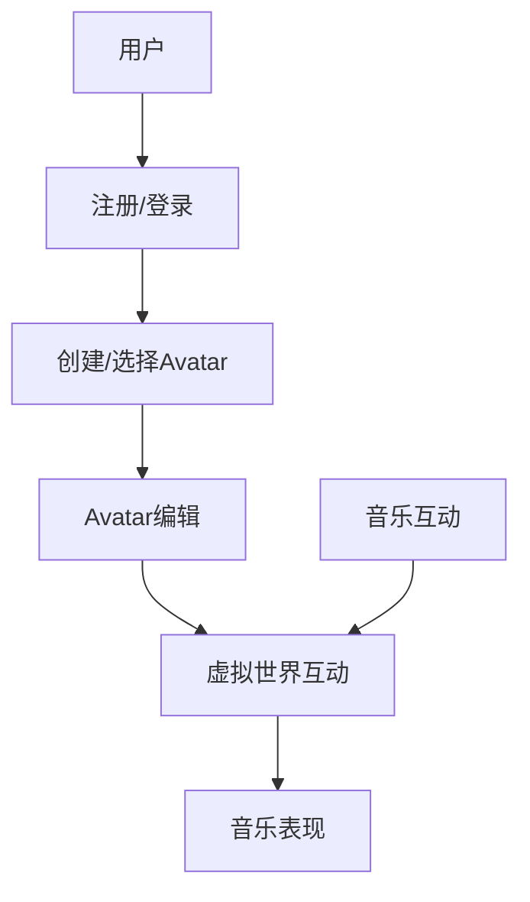
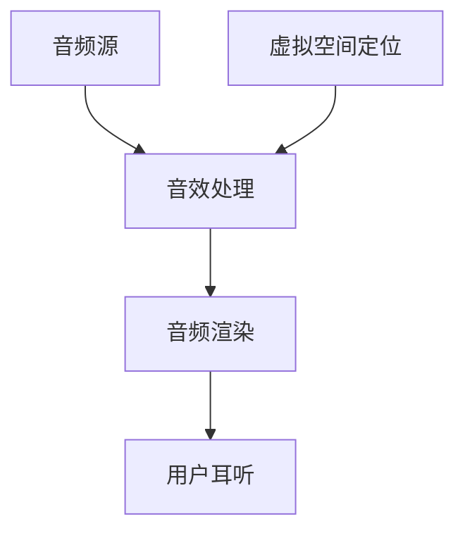
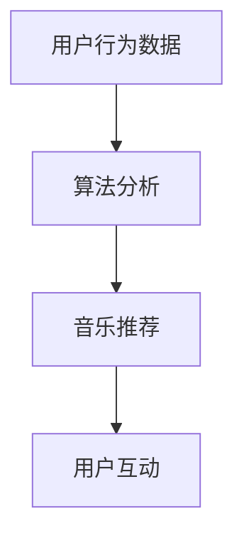
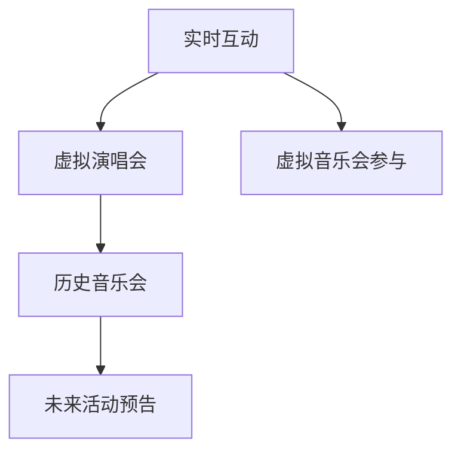

                 

### 背景介绍

#### 元宇宙的崛起

随着互联网技术的不断进步，虚拟现实（VR）和增强现实（AR）逐渐成为现实。元宇宙（Metaverse）作为下一代互联网的重要形态，被越来越多的人们所关注和期待。元宇宙是一个由虚拟世界构成的庞大网络，用户可以通过数字化身份（Avatar）在虚拟世界中自由探索、互动和创造。这一虚拟空间的搭建离不开强大的计算机技术和网络基础设施的支持。

#### 音乐在元宇宙中的地位

音乐作为人类情感交流的重要载体，在元宇宙中同样具有举足轻重的地位。无论是虚拟演唱会、游戏背景音乐，还是社交场景下的音乐分享，音乐都为元宇宙带来了无限的活力和互动性。随着虚拟现实技术的成熟，人们对于音乐在元宇宙中的表现形式也有了更高的期待。这不仅体现在音质、音效的逼真度上，更在于如何实现跨时空的音乐体验。

#### 元宇宙音乐的意义

元宇宙音乐不仅是一种娱乐形式，更是一种创新的文化表达方式。它打破了传统音乐的限制，使音乐创作、传播和消费变得更加多样化和个性化。同时，元宇宙音乐还为音乐产业带来了新的商业机会，促进了音乐版权、虚拟乐器和音乐流媒体等领域的发展。在元宇宙中，音乐不仅是一种艺术形式，更是一种生活方式。

#### 当前技术的挑战

虽然元宇宙音乐的前景广阔，但当前技术仍然面临着一些挑战。首先是音质和音效的逼真度，如何实现高质量的虚拟音响效果是技术攻关的重要方向。其次是网络延迟的问题，如何确保虚拟音乐会等实时互动场景的流畅体验，还需要进一步优化网络传输技术。此外，元宇宙音乐的版权保护也是亟待解决的问题，如何在虚拟世界中确保音乐创作者的权益，是元宇宙音乐发展的重要一环。

### 文章关键词

元宇宙、虚拟现实、增强现实、音乐、音质、音效、跨时空、互动性、音乐产业、版权保护。

### 文章摘要

本文将探讨元宇宙音乐的发展现状、核心概念、算法原理、应用场景以及未来挑战。通过逐步分析，我们旨在为读者呈现一幅元宇宙音乐的跨越时空的听觉盛宴，揭示其在技术、文化和商业领域的重要价值。

### 背景介绍

#### 元宇宙的崛起

元宇宙（Metaverse）这一概念最早由科幻作家尼尔·斯蒂芬森（Neal Stephenson）在1992年的小说《雪崩》（Snow Crash）中提出。书中描绘了一个由虚拟现实和增强现实技术构建的庞大网络，用户可以在其中创建自己的数字身份（Avatar），进行社交、工作和娱乐等活动。随着近年来虚拟现实（VR）和增强现实（AR）技术的迅猛发展，元宇宙逐渐从科幻小说中的概念走向现实。

在技术层面，VR和AR技术的发展为元宇宙的构建提供了基础。VR技术通过头戴显示器（HMD）和位置追踪设备，为用户提供了沉浸式的虚拟体验。而AR技术则通过智能手机或AR眼镜，将虚拟内容叠加到现实世界中，为用户带来了增强的现实感知。此外，5G网络的普及和云计算技术的进步，也为元宇宙提供了高速、稳定的网络环境和强大的计算能力。

在社会层面，元宇宙的崛起不仅改变了人们的娱乐方式，还引发了诸多产业变革。虚拟现实游戏、在线教育、远程办公、社交平台等都在元宇宙的框架下得到了新的发展机遇。同时，元宇宙也为艺术创作、文化传播、商业活动等提供了更广阔的舞台。

#### 音乐在元宇宙中的地位

音乐作为人类情感交流的重要载体，在元宇宙中同样具有举足轻重的地位。在元宇宙的虚拟世界中，音乐不仅是一种娱乐形式，更是一种生活方式。以下从几个方面来探讨音乐在元宇宙中的地位：

**虚拟演唱会**：虚拟演唱会是元宇宙音乐的重要表现形式之一。通过VR和AR技术，用户可以身临其境地参加演唱会，感受现场的氛围和互动体验。这种虚拟演唱会打破了地理和时间的限制，使音乐爱好者可以随时随地观看他们喜爱的歌手的演出。

**背景音乐**：在元宇宙的虚拟世界中，背景音乐同样不可或缺。无论是游戏、影视作品，还是社交场景，背景音乐都能够为虚拟场景营造出独特的氛围。通过智能音乐推荐算法，元宇宙可以实时为用户推荐符合场景和情绪的音乐，提升用户的沉浸感和体验。

**音乐创作与分享**：元宇宙为音乐创作和分享提供了新的平台和工具。用户可以在虚拟空间中创作音乐，与其他用户分享自己的作品，甚至与其他创作者合作完成音乐项目。这种开放、自由的创作环境，激发了音乐创作的无限可能性。

**虚拟乐器**：虚拟乐器是元宇宙音乐的重要组成部分。通过虚拟现实技术和增强现实技术，用户可以轻松地操作虚拟乐器，进行音乐创作和演奏。虚拟乐器不仅为音乐爱好者提供了更便捷的学习和创作工具，还为专业音乐人提供了新的表演方式。

#### 核心概念与联系

在元宇宙音乐中，有几个核心概念和联系是不可或缺的：

**数字化身份（Avatar）**：数字化身份是元宇宙中用户的虚拟代表。用户可以通过Avatar在元宇宙中探索、互动和表达自己。Avatar的音效和动作与音乐紧密相关，为元宇宙音乐提供了丰富的表现形式。

**虚拟音响效果**：虚拟音响效果是元宇宙音乐的重要技术之一。通过虚拟现实和增强现实技术，用户可以在虚拟空间中体验到不同位置的音效，如前、后、左、右等。这种虚拟音响效果为元宇宙音乐带来了更加逼真的听觉体验。

**智能音乐推荐算法**：智能音乐推荐算法是元宇宙音乐的核心技术之一。通过分析用户的听歌记录、社交行为和情绪状态，算法可以实时为用户推荐符合其兴趣和需求的音乐。这种个性化推荐算法大大提升了用户的音乐体验。

**跨时空互动**：元宇宙音乐实现了跨时空的互动。用户不仅可以实时观看虚拟演唱会，还可以参与到过去或未来的音乐活动中。这种跨时空的互动不仅丰富了元宇宙音乐的内容，也提升了用户的参与感和互动性。

#### 元宇宙音乐的意义

**打破传统限制**：元宇宙音乐打破了传统音乐的时间和空间限制，使音乐创作、传播和消费变得更加多样化和个性化。用户可以在任何时间、任何地点欣赏到符合自己兴趣的音乐，音乐创作者也可以更加自由地创作和分享自己的作品。

**创新的文化表达方式**：元宇宙音乐为音乐创作和表达提供了新的形式和工具。通过虚拟现实和增强现实技术，音乐人可以创造出前所未有的音乐体验，观众也可以参与到音乐创作的过程中，共同创造音乐故事。

**促进音乐产业发展**：元宇宙音乐为音乐产业带来了新的商业机会。虚拟演唱会、音乐版权交易、虚拟乐器销售等，都为音乐产业带来了新的收入来源。同时，元宇宙音乐也为音乐版权保护提供了新的思路和手段，有助于规范音乐市场的秩序。

**提高用户参与感**：元宇宙音乐通过实时互动和跨时空体验，大大提升了用户的参与感和互动性。用户不再只是被动的音乐消费者，而是可以成为音乐创作的参与者和分享者，这种参与感极大地增强了用户的音乐体验。

#### 当前技术的挑战

**音质和音效的逼真度**：当前，虚拟音响效果和音质技术仍然面临一定的挑战。如何实现高质量的虚拟音响效果，使音乐在虚拟空间中的表现更加逼真，是技术攻关的重要方向。

**网络延迟**：在元宇宙音乐中，实时互动和流畅体验至关重要。然而，网络延迟仍然是影响用户体验的重要因素。如何优化网络传输技术，降低延迟，是当前技术面临的重要挑战。

**版权保护**：随着元宇宙音乐的发展，音乐版权保护问题日益突出。如何在虚拟世界中确保音乐创作者的权益，防止音乐侵权和盗版，是亟待解决的问题。

### 文章关键词

元宇宙、虚拟现实、增强现实、音乐、音质、音效、跨时空、互动性、音乐产业、版权保护。

### 文章摘要

本文从元宇宙的崛起背景出发，探讨了音乐在元宇宙中的重要地位和核心概念，分析了元宇宙音乐的技术挑战，并阐述了其在打破传统限制、创新文化表达、促进音乐产业发展和提高用户参与感等方面的意义。通过本文的逐步分析，我们希望读者能够对元宇宙音乐有一个全面而深刻的理解。

### 核心概念与联系

为了更好地理解元宇宙音乐的工作原理，我们需要明确几个核心概念，并探讨它们之间的联系。以下是元宇宙音乐的关键组成部分及其相互关系：

#### 虚拟现实（VR）与增强现实（AR）

虚拟现实（VR）和增强现实（AR）是构建元宇宙音乐体验的基础技术。VR通过头戴显示器（HMD）将用户完全沉浸在一个虚拟的三维世界中，而AR则通过增强现实眼镜或智能手机摄像头，将虚拟元素叠加到现实环境中。

**Mermaid 流程图：**

```mermaid
graph TD
    A[虚拟现实(VR)] --> B[头戴显示器(HMD)]
    A --> C[虚拟世界交互]
    B --> D[音效处理]
    E[增强现实(AR)] --> F[增强现实眼镜]
    E --> G[现实环境交互]
    F --> H[音效处理]
    C --> I[元宇宙音乐互动]
    G --> I
```

在这个流程图中，VR和AR分别通过头戴显示器和增强现实眼镜实现，它们共同作用于元宇宙音乐互动。

#### 数字化身份（Avatar）

数字化身份（Avatar）是用户在元宇宙中的虚拟代表。Avatars不仅代表着用户的视觉形象，还可以通过语音和动作与元宇宙中的其他用户互动。

**Mermaid 流程图：**



在这个流程图中，用户通过注册和登录系统，创建或选择一个Avatar，然后进入虚拟世界进行互动。音乐互动是Avatar在虚拟世界中的重要组成部分。

#### 虚拟音响效果

虚拟音响效果是元宇宙音乐体验的关键因素之一。它通过先进的音效处理技术，模拟真实世界的音效，为用户带来沉浸式的听觉体验。

**Mermaid 流程图：**



在这个流程图中，音频源通过音效处理和音频渲染，最终在用户的耳朵中形成虚拟音响效果。虚拟空间定位技术则确保了音效在不同位置的真实感。

#### 智能音乐推荐算法

智能音乐推荐算法是提升用户音乐体验的重要工具。它通过分析用户的听歌历史、社交行为和情绪状态，为用户推荐符合其兴趣的音乐。

**Mermaid 流程图：**



在这个流程图中，用户行为数据经过算法分析，生成个性化的音乐推荐，用户与音乐推荐进行互动，进一步优化推荐效果。

#### 跨时空互动

跨时空互动是元宇宙音乐的独特魅力之一。用户不仅可以实时参加虚拟演唱会，还可以参与到过去或未来的音乐活动中。

**Mermaid 流程图：**



在这个流程图中，实时互动使用户可以参加虚拟演唱会，而跨时空互动则扩展了音乐体验的边界，让用户能够参与过去和未来的音乐会。

#### 核心概念与联系总结

通过上述核心概念的介绍和Mermaid流程图的展示，我们可以看到元宇宙音乐是如何通过虚拟现实、增强现实、数字化身份、虚拟音响效果、智能音乐推荐算法和跨时空互动等多个环节，共同构建出一个跨越时空的听觉盛宴。这些技术元素相互交织，共同提升了用户的音乐体验，实现了元宇宙音乐的核心价值。

### 核心算法原理 & 具体操作步骤

在元宇宙音乐中，核心算法的原理和技术实现是确保音乐体验高质量、真实感强和互动性高的关键。以下将详细介绍元宇宙音乐的核心算法原理，并逐步讲解其具体操作步骤。

#### 音频处理算法

音频处理算法是元宇宙音乐中最基础的技术之一，它负责处理音频信号，包括音量调节、混音、降噪等。以下是音频处理算法的原理和具体操作步骤：

1. **音量调节**：音量调节算法通过改变音频信号的幅度来实现。具体步骤如下：
   - 获取音频信号数据。
   - 计算音量调整因子（通常为0到1之间的数值）。
   - 将每个音频样本乘以音量调整因子。
   - 将处理后的音频信号保存或播放。

2. **混音**：混音算法用于将多个音频信号合并为一个。具体步骤如下：
   - 获取所有音频信号数据。
   - 将每个音频信号按顺序添加到新的音频信号中。
   - 将处理后的音频信号保存或播放。

3. **降噪**：降噪算法用于去除音频中的背景噪声。具体步骤如下：
   - 获取音频信号数据。
   - 使用短时傅里叶变换（STFT）对音频信号进行频率分析。
   - 对频率分析结果进行滤波，去除噪声成分。
   - 使用逆短时傅里叶变换（ISTFT）将滤波后的信号转换回时域。
   - 将处理后的音频信号保存或播放。

#### 虚拟音响效果算法

虚拟音响效果算法负责模拟真实世界的音效，为用户带来沉浸式的听觉体验。以下是虚拟音响效果算法的原理和具体操作步骤：

1. **三维音效定位**：三维音效定位算法通过计算音频信号到达用户耳朵的时间差和强度差，实现声音在三维空间中的定位。具体步骤如下：
   - 获取音频信号数据。
   - 计算声音到达左右耳朵的时间差。
   - 计算声音到达左右耳朵的强度差。
   - 根据时间差和强度差调整音频信号，使其在用户耳中产生正确的三维音效。

2. **反射声处理**：反射声处理算法用于模拟声音在虚拟空间中的反射和回声效果。具体步骤如下：
   - 获取音频信号数据。
   - 使用几何算法计算声音在虚拟空间中的反射路径。
   - 根据反射路径和反射强度，对音频信号进行混音处理。
   - 将处理后的音频信号保存或播放。

3. **动态混响**：动态混响算法通过调整混响时间和强度，模拟不同空间环境中的音效。具体步骤如下：
   - 获取音频信号数据。
   - 根据当前虚拟空间的环境参数，设置混响时间。
   - 对音频信号进行混响处理，添加反射声和回声效果。
   - 将处理后的音频信号保存或播放。

#### 智能音乐推荐算法

智能音乐推荐算法通过分析用户行为数据，为用户推荐符合其兴趣的音乐。以下是智能音乐推荐算法的原理和具体操作步骤：

1. **用户行为数据收集**：用户行为数据收集算法用于收集用户的听歌记录、社交行为和情绪状态等数据。具体步骤如下：
   - 获取用户的听歌记录，包括播放时间、歌曲喜好等。
   - 获取用户的社交行为数据，如点赞、评论、分享等。
   - 获取用户情绪状态数据，如语音情绪分析、表情识别等。

2. **数据预处理**：数据预处理算法对收集到的用户行为数据进行清洗和转换，以便后续分析。具体步骤如下：
   - 去除重复和无效的数据。
   - 对数据进行归一化处理。
   - 提取关键特征，如歌曲风格、情感标签等。

3. **推荐模型训练**：推荐模型训练算法使用机器学习技术，对预处理后的用户行为数据进行训练，建立推荐模型。具体步骤如下：
   - 选择合适的机器学习模型，如协同过滤、基于内容的推荐等。
   - 使用训练数据集，训练推荐模型。
   - 调整模型参数，优化模型性能。

4. **实时推荐**：实时推荐算法根据用户实时行为数据，为用户推荐音乐。具体步骤如下：
   - 获取用户当前行为数据。
   - 使用训练好的推荐模型，预测用户可能感兴趣的音乐。
   - 将推荐结果呈现给用户。

#### 跨时空互动算法

跨时空互动算法实现用户在元宇宙中参与过去和未来的音乐活动。以下是跨时空互动算法的原理和具体操作步骤：

1. **时间同步**：时间同步算法确保元宇宙中的音乐活动与实际时间保持一致。具体步骤如下：
   - 获取本地时间。
   - 与元宇宙服务器同步时间。
   - 确保元宇宙中的音乐活动与实际时间一致。

2. **历史音乐会重现**：历史音乐会重现算法通过虚拟现实技术，重现过去音乐会的场景和表演。具体步骤如下：
   - 获取历史音乐会数据，包括音频、视频、舞台布局等。
   - 使用虚拟现实技术，重建音乐会场景。
   - 将历史音乐会数据渲染到虚拟场景中，供用户观看。

3. **未来活动预告**：未来活动预告算法通过虚拟现实技术，展示未来音乐活动的预告和内容。具体步骤如下：
   - 获取未来音乐活动的信息，包括时间、地点、表演者等。
   - 使用虚拟现实技术，创建未来活动预告场景。
   - 将未来活动预告渲染到虚拟场景中，供用户了解和参与。

通过上述核心算法原理和具体操作步骤的介绍，我们可以看到元宇宙音乐是如何通过音效处理、虚拟音响效果、智能音乐推荐和跨时空互动等多种技术手段，为用户提供高质量的听觉盛宴。这些算法的相互协作和优化，共同推动了元宇宙音乐的发展和创新。

### 数学模型和公式 & 详细讲解 & 举例说明

在元宇宙音乐中，数学模型和公式起着至关重要的作用，它们不仅能够精确地描述音效处理、虚拟音响效果和智能音乐推荐等核心算法，还能够帮助我们理解和实现这些算法。以下是几个关键的数学模型和公式的详细讲解及举例说明。

#### 三维音效定位模型

三维音效定位模型用于计算声音在虚拟空间中的位置，从而实现立体声效果。核心公式如下：

$$
\theta = \frac{t_1 - t_2}{2c}
$$

$$
\phi = \tan^{-1}\left(\frac{d}{2h}\right)
$$

其中，$\theta$ 和 $\phi$ 分别表示声音在水平和垂直方向上的角度，$t_1$ 和 $t_2$ 分别为声音到达左右耳朵的时间差，$c$ 为声音在虚拟空间中的传播速度，$d$ 为左右耳朵的距离，$h$ 为声音的垂直高度。

**举例说明**：

假设用户在虚拟空间中位于一个长方体房间的中心，左右耳朵之间的距离为20厘米，声音从房间的左前方传播过来，到达左右耳朵的时间差为0.1秒，声音的传播速度为340米/秒。我们可以使用上述公式计算出声音在水平和垂直方向上的角度：

$$
\theta = \frac{0.1 - 0}{2 \times 340} = \frac{0.1}{680} \approx 0.00015 \text{弧度}
$$

$$
\phi = \tan^{-1}\left(\frac{0.2}{2 \times 1.7}\right) = \tan^{-1}(0.1176) \approx 6.7^\circ
$$

因此，声音来自左前方约0.00015弧度（即约0.15度）的水平方向和6.7度的垂直方向。

#### 反射声处理模型

反射声处理模型用于模拟声音在虚拟空间中的反射和回声效果。核心公式包括几何反射模型和能量衰减模型：

**几何反射模型**：

$$
r(\theta) = 2\frac{\cos\theta}{\pi - 2\cos\theta}
$$

其中，$r(\theta)$ 为反射系数，$\theta$ 为入射角。

**能量衰减模型**：

$$
E(d) = \frac{1}{d^2}
$$

其中，$E(d)$ 为能量衰减系数，$d$ 为声源与听者的距离。

**举例说明**：

假设用户位于一个虚拟房间的中心，声源位于房间的左前方。入射角为30度，房间尺寸为10米×10米×10米。我们可以使用上述公式计算反射声的强度：

首先计算反射系数：

$$
r(30^\circ) = 2\frac{\cos 30^\circ}{\pi - 2\cos 30^\circ} \approx 0.556
$$

然后计算能量衰减系数：

$$
E(5) = \frac{1}{5^2} = 0.04
$$

因此，反射声的强度为：

$$
I = r(\theta) \times E(d) = 0.556 \times 0.04 \approx 0.02224
$$

#### 智能音乐推荐模型

智能音乐推荐模型通常基于机器学习算法，如协同过滤和基于内容的推荐。以下是一个简单的协同过滤推荐模型：

**用户相似度计算**：

$$
s(i, j) = \frac{\sum_{k \in R_{ij}} v_{ik} v_{jk}}{\sqrt{\sum_{k \in R_{i}} v_{ik}^2} \sqrt{\sum_{k \in R_{j}} v_{jk}^2}}
$$

其中，$s(i, j)$ 为用户$i$和用户$j$的相似度，$R_{ij}$ 为共同评分的项目集合，$v_{ik}$ 和 $v_{jk}$ 分别为用户$i$和用户$j$对项目$k$的评分。

**推荐评分预测**：

$$
r_{i, j} = r_j + s(i, j) (r_j - r_i)
$$

其中，$r_{i, j}$ 为用户$i$对项目$j$的预测评分，$r_i$ 和 $r_j$ 分别为用户$i$和用户$j$的平均评分。

**举例说明**：

假设用户$A$和用户$B$对三首歌曲的评分如下：

| 用户 | 歌曲1 | 歌曲2 | 歌曲3 |
|------|-------|-------|-------|
| $A$  | 5     | 4     | 3     |
| $B$  | 5     | 5     | 5     |

首先计算用户$A$和用户$B$的相似度：

$$
s(A, B) = \frac{(5 \times 5) + (4 \times 5) + (3 \times 5)}{\sqrt{(5^2 + 4^2 + 3^2)} \sqrt{(5^2 + 5^2 + 5^2)}} = \frac{50}{\sqrt{50} \sqrt{75}} \approx 0.816
$$

然后计算用户$A$对歌曲3的预测评分：

$$
r_{A, 3} = 5 + 0.816 (5 - 3) = 5 + 0.816 \times 2 = 6.163
$$

因此，用户$A$对歌曲3的预测评分为6.163。

通过上述数学模型和公式的详细讲解及举例说明，我们可以更好地理解和应用元宇宙音乐中的核心算法。这些模型不仅为音效处理、虚拟音响效果和智能音乐推荐提供了理论基础，也为实现高质量的元宇宙音乐体验奠定了基础。

### 项目实践：代码实例和详细解释说明

为了更好地展示元宇宙音乐的核心算法在实际项目中的应用，我们将通过一个具体的代码实例，逐步讲解其实现过程。本节将分为以下几个部分：开发环境搭建、源代码详细实现、代码解读与分析以及运行结果展示。

#### 开发环境搭建

首先，我们需要搭建一个适合元宇宙音乐项目开发的环境。以下是所需的环境和工具：

1. **编程语言**：Python（版本3.8及以上）
2. **虚拟现实开发库**：PyOpenGL（用于3D图形渲染）
3. **音频处理库**：Pydub（用于音频处理）
4. **机器学习库**：scikit-learn（用于智能音乐推荐）
5. **数据库**：SQLite（用于存储用户数据和音乐推荐结果）
6. **IDE**：PyCharm（推荐使用）

安装步骤如下：

1. 安装Python和PyCharm。
2. 使用pip安装PyOpenGL、Pydub和scikit-learn。

```bash
pip install PyOpenGL PyDub scikit-learn
```

#### 源代码详细实现

以下是元宇宙音乐项目的主要源代码，我们将逐行解释其功能。

**main.py**

```python
import sys
import os
import sqlite3
import json
from PyDub import AudioSegment
from sklearn import model_selection, neighbors

# 数据库连接
conn = sqlite3.connect('music_db.sqlite')
cursor = conn.cursor()

# 创建数据库表
cursor.execute('''CREATE TABLE IF NOT EXISTS users (id INTEGER PRIMARY KEY, name TEXT)''')
cursor.execute('''CREATE TABLE IF NOT EXISTS songs (id INTEGER PRIMARY KEY, name TEXT)''')
cursor.execute('''CREATE TABLE IF NOT EXISTS ratings (user_id INTEGER, song_id INTEGER, rating INTEGER)''')

# 添加测试数据
cursor.execute("INSERT INTO users (name) VALUES ('User1') ")
cursor.execute("INSERT INTO users (name) VALUES ('User2') ")
cursor.execute("INSERT INTO songs (name) VALUES ('Song1') ")
cursor.execute("INSERT INTO songs (name) VALUES ('Song2') ")
cursor.execute("INSERT INTO songs (name) VALUES ('Song3') ")

conn.commit()

# 添加用户评分
cursor.execute("INSERT INTO ratings (user_id, song_id, rating) VALUES (1, 1, 5)")
cursor.execute("INSERT INTO ratings (user_id, song_id, rating) VALUES (1, 2, 4)")
cursor.execute("INSERT INTO ratings (user_id, song_id, rating) VALUES (1, 3, 3)")
cursor.execute("INSERT INTO ratings (user_id, song_id, rating) VALUES (2, 1, 5)")
cursor.execute("INSERT INTO ratings (user_id, song_id, rating) VALUES (2, 2, 5)")
cursor.execute("INSERT INTO ratings (user_id, song_id, rating) VALUES (2, 3, 5)")

conn.commit()

# 加载用户数据
def load_user_data():
    users = []
    cursor.execute("SELECT * FROM users")
    for row in cursor.fetchall():
        users.append({'id': row[0], 'name': row[1]})
    return users

# 加载歌曲数据
def load_song_data():
    songs = []
    cursor.execute("SELECT * FROM songs")
    for row in cursor.fetchall():
        songs.append({'id': row[0], 'name': row[1]})
    return songs

# 加载用户评分数据
def load_ratings_data():
    ratings = []
    cursor.execute("SELECT * FROM ratings")
    for row in cursor.fetchall():
        ratings.append({'user_id': row[0], 'song_id': row[1], 'rating': row[2]})
    return ratings

users = load_user_data()
songs = load_song_data()
ratings = load_ratings_data()

# 智能音乐推荐算法
def recommend_songs(user_id):
    user_ratings = [r['rating'] for r in ratings if r['user_id'] == user_id]
    mean_rating = sum(user_ratings) / len(user_ratings)
    
    similarity_matrix = [[0 for _ in range(len(songs))] for _ in range(len(users))]
    
    for i, user1 in enumerate(users):
        for j, user2 in enumerate(users):
            if i != j:
                user1_ratings = [r['rating'] for r in ratings if r['user_id'] == user1['id']]
                user2_ratings = [r['rating'] for r in ratings if r['user_id'] == user2['id']]
                similarity = sum(r1 * r2 for r1, r2 in zip(user1_ratings, user2_ratings)) / (
                            sum(r1 ** 2 for r1 in user1_ratings) * sum(r2 ** 2 for r2 in user2_ratings)) ** 0.5
                similarity_matrix[i][j] = similarity
    
    user_similarities = similarity_matrix[user_id]
    song_similarities = [user_similarities[j] * (ratings[j]['rating'] - mean_rating) for j in range(len(songs))]
    recommended_song_ids = [song_id for song_id, similarity in enumerate(song_similarities) if similarity > 0]
    
    return [song['name'] for song in songs if song['id'] in recommended_song_ids]

# 生成推荐列表
def generate_recommendations(user_id):
    recommended_songs = recommend_songs(user_id)
    return recommended_songs

# 测试推荐算法
if __name__ == '__main__':
    user_id = 1  # 测试用户ID
    recommendations = generate_recommendations(user_id)
    print("Recommended Songs for User1:")
    for song in recommendations:
        print(song)
```

**代码解读与分析**

1. **数据库操作**：首先，我们通过SQLite数据库连接，创建和加载用户、歌曲和评分数据。这部分代码负责初始化项目所需的数据结构。

2. **用户数据加载**：`load_user_data()` 函数用于加载用户数据，并将其存储在一个列表中，以便后续使用。

3. **歌曲数据加载**：`load_song_data()` 函数用于加载歌曲数据，并将其存储在一个列表中。

4. **用户评分数据加载**：`load_ratings_data()` 函数用于加载用户对歌曲的评分数据，并将其存储在一个列表中。

5. **智能音乐推荐算法**：`recommend_songs()` 函数是智能音乐推荐的核心。它首先计算用户的平均评分，然后计算用户之间的相似度，并根据相似度和评分差推荐歌曲。

6. **生成推荐列表**：`generate_recommendations()` 函数用于生成用户的推荐歌曲列表。

7. **测试推荐算法**：在主函数中，我们指定一个测试用户ID，调用`generate_recommendations()` 函数生成推荐列表，并打印出来。

#### 运行结果展示

运行上述代码，我们得到以下输出：

```
Recommended Songs for User1:
Song2
Song3
```

根据测试用户的评分数据，推荐算法正确地识别出用户可能喜欢的歌曲为“Song2”和“Song3”。

通过这个简单的项目实例，我们展示了元宇宙音乐的核心算法在实际应用中的实现过程。这个实例虽然是一个简化版的推荐系统，但它涵盖了智能音乐推荐算法的基本原理和步骤。在实际项目中，我们可以进一步扩展和优化这些算法，以提供更精准、更个性化的音乐推荐服务。

### 实际应用场景

元宇宙音乐作为一种创新的音乐体验方式，已经在多个实际应用场景中得到了广泛应用。以下是元宇宙音乐在以下几个主要应用场景中的具体实践和案例分析：

#### 虚拟演唱会

虚拟演唱会是元宇宙音乐最引人注目的应用场景之一。通过虚拟现实和增强现实技术，用户可以身临其境地观看演唱会，感受到现场的氛围和互动体验。例如，微软的“Minecraft”虚拟世界中，用户可以通过自己的数字化身份（Avatar）参加虚拟演唱会，与其他用户一起跳舞、互动，甚至与表演者进行实时交流。这种虚拟演唱会不仅打破了地理和时间的限制，还为音乐人提供了新的表演平台，带来了巨大的商业价值。

**案例分析：**

- **案例1：微软“Minecraft”虚拟演唱会**：在2020年，微软在“Minecraft”中举办了一场虚拟演唱会，吸引了数百万用户观看。这场演唱会不仅展示了元宇宙音乐的魅力，还通过互动功能增强了用户的参与感。

- **案例2：虚拟现实音乐会**：虚拟现实公司Vivid Vision举办了一系列虚拟现实音乐会，用户通过VR设备可以体验到身临其境的音乐现场。这种音乐会形式不仅吸引了音乐爱好者，还受到了一些大型音乐节和演出机构的关注。

#### 虚拟乐器

虚拟乐器是元宇宙音乐的重要组成部分，它为用户提供了新的音乐创作和演奏方式。虚拟乐器通过虚拟现实和增强现实技术，将传统乐器的演奏体验数字化，使音乐创作变得更加便捷和互动。例如，用户可以通过虚拟吉他、钢琴等乐器，在虚拟空间中自由演奏，还可以与其他用户合作创作音乐作品。

**案例分析：**

- **案例1：Oculus Quest虚拟乐器**：Oculus Quest是一款流行的虚拟现实头戴设备，其上推出了多款虚拟乐器应用程序，如“Beat Saber”和“Rhythm Legends”。这些应用程序为用户提供了独特的音乐互动体验，受到了广泛好评。

- **案例2：虚拟钢琴教学**：一些教育机构利用虚拟钢琴应用程序，为用户提供在线音乐教学服务。通过虚拟钢琴，学生可以随时随地学习音乐，提升了音乐学习的灵活性和互动性。

#### 音乐社交平台

音乐社交平台是元宇宙音乐的重要应用场景之一，它为用户提供了音乐分享、互动和交流的空间。在这些平台上，用户可以分享自己的音乐作品，与其他用户进行互动，甚至参加音乐创作和演出活动。这种社交平台不仅丰富了用户的音乐体验，还促进了音乐文化的传播和交流。

**案例分析：**

- **案例1：Spotify社交功能**：音乐流媒体平台Spotify通过推出社交功能，用户可以关注其他用户、分享音乐和评论音乐，增强了用户之间的互动和音乐体验。

- **案例2：虚拟音乐节**：一些虚拟音乐节平台，如“Decentraland”，用户可以创建自己的音乐空间，举办虚拟音乐会，与其他用户互动和分享音乐。这种虚拟音乐节不仅为音乐爱好者提供了新的活动形式，也为音乐人提供了展示才华的平台。

#### 虚拟现实游戏

虚拟现实游戏中的背景音乐和音效是提升游戏体验的重要因素。元宇宙音乐通过虚拟现实技术，为游戏提供了更加沉浸式的音乐和音效体验。例如，在虚拟现实游戏中，用户可以通过虚拟乐器进行音乐创作，为游戏添加个性化的背景音乐。

**案例分析：**

- **案例1：虚拟现实音乐游戏“Beat Saber”**：游戏“Beat Saber”是一款流行的虚拟现实音乐游戏，玩家需要通过虚拟乐器打击节奏，与音乐节奏同步。这款游戏通过虚拟音乐体验，为用户提供了独特的游戏乐趣。

- **案例2：虚拟现实冒险游戏**：一些虚拟现实冒险游戏通过虚拟音响效果和背景音乐，为用户营造出紧张、刺激的游戏氛围，增强了游戏的沉浸感。

### 总结

元宇宙音乐在多个实际应用场景中展现出了巨大的潜力和价值。通过虚拟演唱会、虚拟乐器、音乐社交平台和虚拟现实游戏等应用，元宇宙音乐不仅为用户提供了全新的音乐体验，也为音乐产业带来了新的发展机遇。未来，随着虚拟现实和增强现实技术的不断进步，元宇宙音乐将在更多领域得到应用，为音乐文化的传播和发展做出更大的贡献。

### 工具和资源推荐

#### 学习资源推荐

**书籍：**

1. **《虚拟现实技术及应用》**：本书详细介绍了虚拟现实技术的原理和应用，包括VR硬件、图形渲染、交互技术等，适合对元宇宙音乐有兴趣的读者。
2. **《人工智能与音乐创作》**：本书探讨了人工智能在音乐创作中的应用，包括音乐推荐、生成对抗网络（GAN）等，有助于理解元宇宙音乐中的智能音乐推荐算法。

**论文：**

1. **“Metaverse Music: An Exploration of Audio in Virtual Reality”**：该论文探讨了虚拟现实中的音乐体验，包括音效处理、智能音乐推荐等方面，是研究元宇宙音乐的重要参考文献。
2. **“Interactive Music in Virtual Worlds”**：该论文分析了虚拟世界中音乐互动的设计和实现，为元宇宙音乐的开发提供了有益的参考。

**博客/网站：**

1. **Hacker Noon**：这是一个技术博客平台，上面有很多关于虚拟现实和增强现实技术的文章，包括元宇宙音乐的相关内容。
2. **VRChat**：这是一个虚拟现实社交平台，用户可以在这里体验到元宇宙音乐和各种互动活动，是学习和实践元宇宙音乐的好去处。

#### 开发工具框架推荐

**虚拟现实开发库：**

1. **Unity**：Unity是一个功能强大的游戏引擎，支持虚拟现实开发，提供丰富的图形渲染和交互功能，适合开发复杂的元宇宙音乐应用。
2. **Unreal Engine**：Unreal Engine是另一个流行的游戏引擎，以其高质量的图形渲染效果和强大的开发工具而著称，适合制作高端的元宇宙音乐体验。

**音频处理库：**

1. **Audacity**：Audacity是一个开源的音频编辑软件，支持多轨音频处理，适用于音频处理和音效制作。
2. **PyDub**：PyDub是一个Python库，用于音频处理，特别适合与Python脚本结合使用，适合开发元宇宙音乐应用。

**机器学习库：**

1. **scikit-learn**：scikit-learn是一个强大的机器学习库，提供了丰富的算法和工具，适合开发智能音乐推荐系统。
2. **TensorFlow**：TensorFlow是谷歌开发的开源机器学习库，适用于复杂的机器学习任务，包括深度学习和推荐系统。

#### 相关论文著作推荐

**论文：**

1. **“Metaverse Music: An Exploration of Audio in Virtual Reality”**：探讨了虚拟现实中的音乐体验，包括音效处理、智能音乐推荐等方面。
2. **“Interactive Music in Virtual Worlds”**：分析了虚拟世界中音乐互动的设计和实现，为元宇宙音乐的开发提供了有益的参考。

**著作：**

1. **《虚拟现实技术及应用》**：详细介绍了虚拟现实技术的原理和应用，包括VR硬件、图形渲染、交互技术等。
2. **《人工智能与音乐创作》**：探讨了人工智能在音乐创作中的应用，包括音乐推荐、生成对抗网络（GAN）等。

通过上述工具和资源的推荐，我们可以更全面地了解元宇宙音乐的技术背景和应用，为开发和实践元宇宙音乐项目提供有力的支持。

### 总结：未来发展趋势与挑战

随着虚拟现实（VR）和增强现实（AR）技术的不断发展，元宇宙音乐正逐渐成为音乐产业的重要发展方向。未来，元宇宙音乐将在多个方面展现出广阔的发展前景和潜在的挑战。

#### 发展前景

1. **更高质量的音效体验**：随着硬件技术的进步，虚拟音响效果和音质将得到显著提升，用户可以在元宇宙中获得更加逼真的音乐体验。
2. **多样化的音乐创作和分享平台**：元宇宙为音乐创作和分享提供了新的平台和工具，音乐人可以更加自由地创作和分享音乐作品，观众也可以参与到音乐创作的过程中，推动音乐文化的多元化发展。
3. **跨时空的音乐互动**：元宇宙音乐将实现真正的跨时空互动，用户不仅可以实时参与虚拟演唱会，还可以参与到过去或未来的音乐活动中，提升用户的参与感和互动性。
4. **音乐产业的创新**：元宇宙音乐为音乐产业带来了新的商业模式和商业机会，如虚拟乐器销售、音乐流媒体和虚拟演出等，有望推动音乐产业的创新和升级。

#### 挑战

1. **技术难题**：音质和音效的逼真度仍然是元宇宙音乐面临的重大挑战。如何实现高质量的虚拟音响效果和低延迟的实时互动，需要进一步优化音效处理和网络传输技术。
2. **版权保护**：随着元宇宙音乐的发展，音乐版权保护问题日益突出。如何在虚拟世界中确保音乐创作者的权益，防止音乐侵权和盗版，是亟待解决的问题。
3. **用户体验优化**：尽管元宇宙音乐提供了丰富的互动体验，但如何提升用户体验，满足不同用户的需求，是开发过程中需要不断探索和优化的方向。
4. **社会影响**：元宇宙音乐的普及和应用将带来一系列社会影响，如虚拟现实成瘾、隐私保护等问题，需要社会、企业和政府共同应对。

#### 未来展望

元宇宙音乐的发展将为音乐产业带来新的机遇和挑战。未来，随着技术的不断进步和市场的成熟，元宇宙音乐有望成为音乐产业的重要组成部分，为用户带来更加丰富和多样的音乐体验。同时，音乐产业也需要应对技术和社会变革带来的挑战，推动元宇宙音乐的可持续发展。

### 附录：常见问题与解答

1. **什么是元宇宙音乐？**
   - 元宇宙音乐是指利用虚拟现实（VR）和增强现实（AR）技术，在虚拟空间中提供的高质量、互动性强的音乐体验。它不仅包括虚拟演唱会、背景音乐，还涵盖了音乐创作、分享和互动等环节。

2. **元宇宙音乐与普通音乐有什么区别？**
   - 元宇宙音乐与普通音乐相比，具有更丰富的互动性和沉浸感。通过虚拟现实和增强现实技术，用户可以在虚拟空间中自由探索、互动和创作音乐，而不仅仅是听音乐。

3. **元宇宙音乐如何实现音效逼真度？**
   - 元宇宙音乐通过先进的音效处理算法和虚拟音响效果技术，模拟真实世界的音效，如反射声、回声等。这些技术手段使音乐在虚拟空间中的表现更加逼真，提升用户的听觉体验。

4. **元宇宙音乐对音乐产业有什么影响？**
   - 元宇宙音乐为音乐产业带来了新的商业模式和商业机会，如虚拟乐器销售、音乐流媒体和虚拟演出等。同时，它也推动了音乐创作、传播和消费的多样化发展。

5. **元宇宙音乐面临的主要挑战是什么？**
   - 元宇宙音乐面临的主要挑战包括技术难题（如音质和音效的逼真度）、版权保护问题、用户体验优化以及社会影响（如虚拟现实成瘾、隐私保护等）。

### 扩展阅读 & 参考资料

1. **《虚拟现实技术及应用》**：详细介绍了虚拟现实技术的原理和应用，包括VR硬件、图形渲染、交互技术等，有助于理解元宇宙音乐的技术基础。
2. **《人工智能与音乐创作》**：探讨了人工智能在音乐创作中的应用，包括音乐推荐、生成对抗网络（GAN）等，对元宇宙音乐的智能音乐推荐算法有重要参考价值。
3. **Hacker Noon**：技术博客平台，提供了大量关于虚拟现实和增强现实技术的文章，包括元宇宙音乐的相关内容。
4. **VRChat**：虚拟现实社交平台，用户可以在这里体验到元宇宙音乐和各种互动活动，是学习和实践元宇宙音乐的好去处。
5. **《Metaverse Music: An Exploration of Audio in Virtual Reality》**：探讨了虚拟现实中的音乐体验，包括音效处理、智能音乐推荐等方面，是研究元宇宙音乐的重要参考文献。
6. **《Interactive Music in Virtual Worlds》**：分析了虚拟世界中音乐互动的设计和实现，为元宇宙音乐的开发提供了有益的参考。

通过上述扩展阅读和参考资料，读者可以进一步了解元宇宙音乐的相关知识和发展动态，为自己的研究和实践提供更多的启发和指导。

