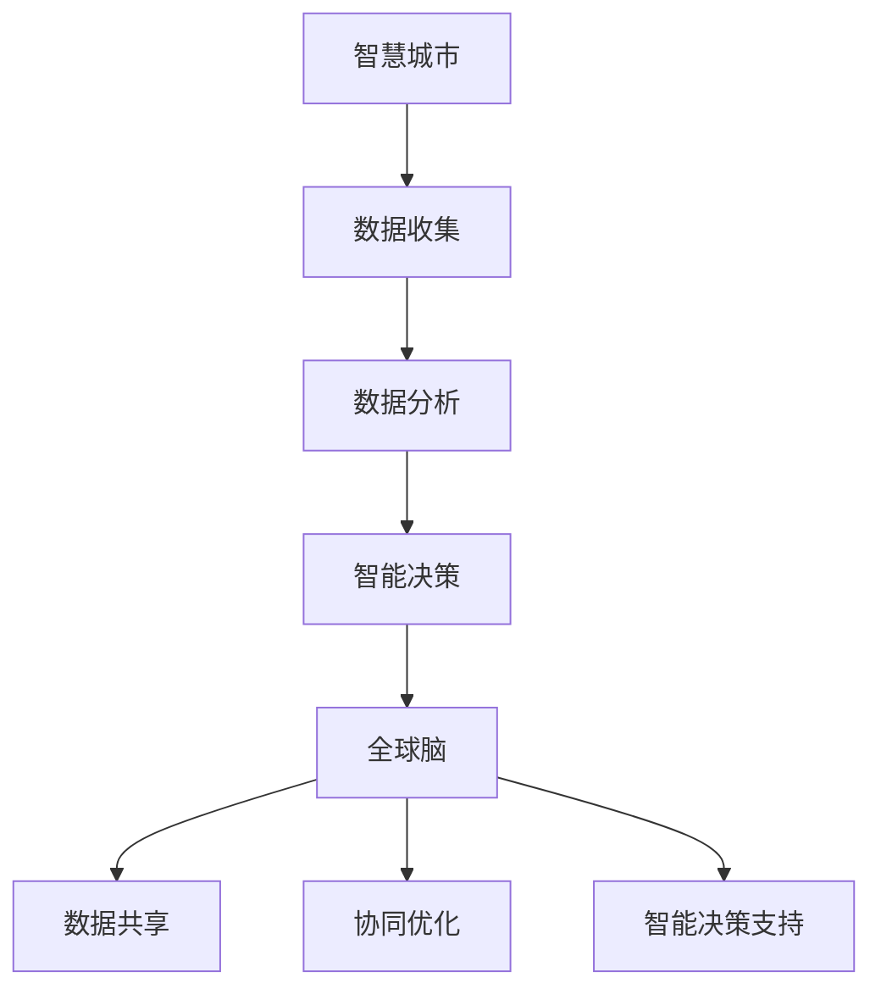

                 

### 文章标题：全球脑与城市规划：智慧城市的终极形态

> **关键词**：智慧城市、全球脑、城市规划、可持续发展、物联网、数据分析、人工智能
> 
> **摘要**：本文探讨了智慧城市建设的终极形态，通过引入全球脑的概念，分析了其在城市规划中的关键作用。文章从背景介绍、核心概念与联系、核心算法原理、数学模型和公式、项目实践、实际应用场景等方面，深入阐述了智慧城市的发展趋势和面临的挑战，为未来的城市规划提供了有益的参考。

## 1. 背景介绍

随着信息技术和互联网的飞速发展，城市规划和建设逐渐走向智能化。智慧城市作为新兴的城市发展模式，旨在通过物联网、大数据、云计算、人工智能等先进技术，实现城市资源的优化配置、提高城市运行效率、提升市民生活质量。然而，智慧城市的建设并非一蹴而就，需要解决诸多技术、管理、政策等方面的挑战。

全球脑（Global Brain）的概念为智慧城市建设提供了新的思路。全球脑是指由人类和计算机共同构成的一个庞大、智能化的全球性网络，通过信息共享、协同进化，实现全球范围内的智能协作与优化。将全球脑的理念引入城市规划，有助于实现城市资源的全面整合、智能调控和可持续发展。

本文旨在探讨全球脑与城市规划之间的关系，分析智慧城市的终极形态，为未来城市的发展提供有益的参考。文章结构如下：

1. 背景介绍
2. 核心概念与联系
3. 核心算法原理 & 具体操作步骤
4. 数学模型和公式 & 详细讲解 & 举例说明
5. 项目实践：代码实例和详细解释说明
6. 实际应用场景
7. 工具和资源推荐
8. 总结：未来发展趋势与挑战
9. 附录：常见问题与解答
10. 扩展阅读 & 参考资料

接下来，我们将逐一探讨这些内容。

### 2. 核心概念与联系

#### 2.1 智慧城市

智慧城市是指利用信息技术、物联网、人工智能等先进技术，对城市资源、环境、交通、能源等进行全面感知、智能分析和优化调度，实现城市运行的高效、绿色、安全、宜居。智慧城市的主要特点包括：

- **数据驱动**：通过收集和分析海量数据，实现城市运行状态的实时监测和预测。
- **智能决策**：利用人工智能算法，为城市管理者提供智能决策支持，提高城市管理水平和效率。
- **跨领域协同**：整合不同领域的技术和资源，实现城市各个方面的协同发展。
- **可持续发展**：注重环境保护、资源节约和经济效益，推动城市可持续发展。

#### 2.2 全球脑

全球脑（Global Brain）是由霍金等人提出的一个概念，指的是一个由人类和计算机共同构成的世界级智能网络。全球脑的核心思想是，通过信息共享、协同进化，实现全球范围内的智能协作与优化。

全球脑的主要组成部分包括：

- **神经元**：代表人类个体和计算机程序，负责信息的收集、处理和传递。
- **神经网络**：由神经元组成的复杂网络结构，实现信息的传递、处理和反馈。
- **智能算法**：用于优化神经网络性能、提升全球脑智能水平的算法。

#### 2.3 智慧城市与全球脑的联系

智慧城市与全球脑之间存在紧密的联系。智慧城市为全球脑提供了丰富的应用场景，如智能交通、智慧医疗、智能安防等；而全球脑则为智慧城市提供了强大的技术支持，如大数据分析、人工智能算法、物联网技术等。

具体来说，智慧城市与全球脑的联系主要体现在以下几个方面：

- **数据共享**：智慧城市通过物联网设备、传感器等手段，收集海量数据。这些数据可以通过全球脑实现共享，为全球范围内的智能分析提供基础。
- **协同优化**：全球脑可以通过分布式计算、协同优化等技术，对智慧城市中的各项资源进行全局优化，实现城市运行的高效、绿色、安全。
- **智能决策**：全球脑可以为智慧城市的管理者提供智能决策支持，帮助其应对复杂多变的城市发展态势。

#### 2.4 Mermaid 流程图

为了更好地理解智慧城市与全球脑的联系，我们可以使用 Mermaid 流程图来展示它们之间的核心概念和关系。



在这个流程图中，智慧城市通过数据收集、数据分析和智能决策等环节，与全球脑实现数据共享、协同优化和智能决策支持。

### 3. 核心算法原理 & 具体操作步骤

智慧城市的建设离不开核心算法的支持。本节将介绍智慧城市中的几个关键算法原理，并详细阐述其具体操作步骤。

#### 3.1 数据分析算法

数据分析是智慧城市的基础。常用的数据分析算法包括聚类、分类、回归等。

**3.1.1 聚类算法**

聚类算法用于将相似的数据点划分为一组。常用的聚类算法有 K-means、层次聚类等。

- **K-means 算法**：

  1. 初始化 K 个聚类中心点。
  2. 计算每个数据点到聚类中心点的距离。
  3. 根据距离将数据点分配到最近的聚类中心点。
  4. 更新聚类中心点。
  5. 重复步骤 2-4，直到聚类中心点收敛。

- **层次聚类算法**：

  1. 将所有数据点视为一个聚类。
  2. 计算两两数据点之间的距离。
  3. 合并距离最近的数据点为一个聚类。
  4. 重复步骤 2-3，直到满足停止条件。

**3.1.2 分类算法**

分类算法用于将数据点划分为不同的类别。常用的分类算法有决策树、支持向量机等。

- **决策树算法**：

  1. 选择一个最佳特征作为分割依据。
  2. 根据该特征将数据集划分为若干个子集。
  3. 递归地对子集进行分割，直到满足停止条件。
  4. 使用叶节点上的标签对数据进行分类。

- **支持向量机算法**：

  1. 将数据点映射到高维空间。
  2. 寻找最大间隔超平面，将不同类别的数据点分隔开。
  3. 使用支持向量进行分类。

**3.1.3 回归算法**

回归算法用于预测数据点之间的依赖关系。常用的回归算法有线性回归、决策树回归等。

- **线性回归算法**：

  1. 计算数据点的均值和方差。
  2. 将数据点投影到最佳拟合直线。
  3. 使用拟合直线预测新数据点的值。

- **决策树回归算法**：

  1. 选择一个最佳特征作为分割依据。
  2. 根据该特征将数据集划分为若干个子集。
  3. 递归地对子集进行分割，直到满足停止条件。
  4. 使用叶节点上的回归值预测新数据点的值。

#### 3.2 智能优化算法

智能优化算法用于求解复杂优化问题。常用的智能优化算法有遗传算法、粒子群优化算法等。

- **遗传算法**：

  1. 初始化种群。
  2. 计算种群中每个个体的适应度。
  3. 选择适应度较高的个体进行交叉、变异操作。
  4. 生成新的种群。
  5. 重复步骤 2-4，直到满足停止条件。

- **粒子群优化算法**：

  1. 初始化粒子群。
  2. 计算每个粒子的适应度。
  3. 更新每个粒子的最佳位置和速度。
  4. 更新整个群体的最佳位置。
  5. 重复步骤 2-4，直到满足停止条件。

#### 3.3 操作步骤示例

以下是一个简单的数据分析算法示例，使用 Python 语言实现 K-means 聚类算法。

```python
import numpy as np
import matplotlib.pyplot as plt

# 数据集
X = np.random.rand(100, 2)

# 初始化聚类中心点
centroids = X[:3]

# 聚类个数
K = 3

# 聚类迭代次数
max_iter = 100

# K-means 算法
for i in range(max_iter):
    # 计算每个数据点到聚类中心点的距离
    distances = np.linalg.norm(X - centroids, axis=1)
    
    # 根据距离将数据点分配到最近的聚类中心点
    labels = np.argmin(distances, axis=1)
    
    # 更新聚类中心点
    for k in range(K):
        centroids[k] = np.mean(X[labels == k], axis=0)

# 可视化
plt.scatter(X[:, 0], X[:, 1], c=labels)
plt.scatter(centroids[:, 0], centroids[:, 1], s=100, c='red')
plt.show()
```

### 4. 数学模型和公式 & 详细讲解 & 举例说明

#### 4.1 数学模型

智慧城市建设涉及到多个数学模型，如聚类模型、分类模型、回归模型等。以下分别介绍这些模型的数学公式和原理。

**4.1.1 聚类模型**

- **K-means 聚类模型**：

  1. **目标函数**：

     $$J(\textbf{X}, \textbf{C}) = \sum_{i=1}^N \sum_{j=1}^K w_{ij} ||\textbf{x}_i - \textbf{c}_j||^2$$

     其中，$\textbf{X}$ 为数据集，$\textbf{C}$ 为聚类中心点，$N$ 为数据点个数，$K$ 为聚类个数，$w_{ij}$ 为第 $i$ 个数据点属于第 $j$ 个聚类的概率。

  2. **优化目标**：

     $$\min_{\textbf{C}} J(\textbf{X}, \textbf{C})$$

     其中，$\textbf{C}$ 为聚类中心点的集合。

- **层次聚类模型**：

  1. **目标函数**：

     $$J(\textbf{X}, \textbf{T}) = \sum_{i=1}^N \sum_{j=1}^L w_{ij} ||\textbf{x}_i - \textbf{c}_j||^2$$

     其中，$\textbf{X}$ 为数据集，$\textbf{T}$ 为聚类层次树，$N$ 为数据点个数，$L$ 为聚类层次树的高度，$w_{ij}$ 为第 $i$ 个数据点属于第 $j$ 个聚类的概率。

  2. **优化目标**：

     $$\min_{\textbf{T}} J(\textbf{X}, \textbf{T})$$

     其中，$\textbf{T}$ 为聚类层次树的集合。

**4.1.2 分类模型**

- **决策树分类模型**：

  1. **目标函数**：

     $$J(\textbf{X}, \textbf{T}, \textbf{Y}) = -\sum_{i=1}^N \sum_{j=1}^L w_{ij} \log w_{ij}$$

     其中，$\textbf{X}$ 为数据集，$\textbf{T}$ 为决策树，$\textbf{Y}$ 为标签，$N$ 为数据点个数，$L$ 为决策树叶子节点个数，$w_{ij}$ 为第 $i$ 个数据点属于第 $j$ 个叶子节点的概率。

  2. **优化目标**：

     $$\min_{\textbf{T}} J(\textbf{X}, \textbf{T}, \textbf{Y})$$

     其中，$\textbf{T}$ 为决策树的集合。

- **支持向量机分类模型**：

  1. **目标函数**：

     $$J(\textbf{X}, \textbf{w}, \textbf{b}, \textbf{C}) = \frac{1}{2} ||\textbf{w}||^2 + C \sum_{i=1}^N \xi_i$$

     其中，$\textbf{X}$ 为数据集，$\textbf{w}$ 为权重向量，$\textbf{b}$ 为偏置，$\textbf{C}$ 为惩罚参数，$N$ 为数据点个数，$\xi_i$ 为第 $i$ 个数据点的错误分类率。

  2. **优化目标**：

     $$\min_{\textbf{w}, \textbf{b}} J(\textbf{X}, \textbf{w}, \textbf{b}, \textbf{C})$$

     其中，$\textbf{w}$ 和 $\textbf{b}$ 为权重向量和偏置的集合。

**4.1.3 回归模型**

- **线性回归模型**：

  1. **目标函数**：

     $$J(\textbf{X}, \textbf{w}, \textbf{b}) = \sum_{i=1}^N (y_i - \textbf{w}^T \textbf{x}_i - \textbf{b})^2$$

     其中，$\textbf{X}$ 为数据集，$\textbf{w}$ 为权重向量，$\textbf{b}$ 为偏置，$N$ 为数据点个数，$y_i$ 为第 $i$ 个数据点的标签。

  2. **优化目标**：

     $$\min_{\textbf{w}, \textbf{b}} J(\textbf{X}, \textbf{w}, \textbf{b})$$

     其中，$\textbf{w}$ 和 $\textbf{b}$ 为权重向量和偏置的集合。

#### 4.2 公式讲解和举例

**4.2.1 K-means 聚类算法**

K-means 聚类算法的核心公式是目标函数 $J(\textbf{X}, \textbf{C})$，其中 $\textbf{X}$ 表示数据集，$\textbf{C}$ 表示聚类中心点。

假设我们有一个包含 100 个数据点的二维数据集 $\textbf{X} = \{\textbf{x}_1, \textbf{x}_2, ..., \textbf{x}_{100}\}$，我们要将数据点划分为 3 个聚类。首先，我们需要初始化 3 个聚类中心点 $\textbf{C} = \{\textbf{c}_1, \textbf{c}_2, \textbf{c}_3\}$。

目标函数 $J(\textbf{X}, \textbf{C})$ 可以表示为：

$$J(\textbf{X}, \textbf{C}) = \sum_{i=1}^{100} \sum_{j=1}^{3} w_{ij} ||\textbf{x}_i - \textbf{c}_j||^2$$

其中，$w_{ij}$ 表示第 $i$ 个数据点属于第 $j$ 个聚类的概率。

为了优化目标函数，我们需要迭代更新聚类中心点。每次迭代包括以下步骤：

1. 计算每个数据点到聚类中心点的距离，并分配数据点到最近的聚类中心点。
2. 根据每个聚类中心点的数据点集合，重新计算聚类中心点。

通过不断迭代，目标函数会逐渐收敛，最终得到聚类结果。

**4.2.2 支持向量机分类算法**

支持向量机分类算法的核心公式是目标函数 $J(\textbf{X}, \textbf{w}, \textbf{b}, \textbf{C})$，其中 $\textbf{X}$ 表示数据集，$\textbf{w}$ 表示权重向量，$\textbf{b}$ 表示偏置，$\textbf{C}$ 表示惩罚参数。

假设我们有一个包含 100 个数据点的二维数据集 $\textbf{X} = \{\textbf{x}_1, \textbf{x}_2, ..., \textbf{x}_{100}\}$，每个数据点都有对应的标签 $y_i$。我们要使用支持向量机对数据进行分类。

目标函数 $J(\textbf{X}, \textbf{w}, \textbf{b}, \textbf{C})$ 可以表示为：

$$J(\textbf{X}, \textbf{w}, \textbf{b}, \textbf{C}) = \frac{1}{2} ||\textbf{w}||^2 + C \sum_{i=1}^{100} \xi_i$$

其中，$||\textbf{w}||^2$ 表示权重向量的平方，$\xi_i$ 表示第 $i$ 个数据点的错误分类率，$C$ 是惩罚参数。

为了优化目标函数，我们需要使用梯度下降算法迭代更新权重向量 $\textbf{w}$ 和偏置 $\textbf{b}$。每次迭代包括以下步骤：

1. 计算当前权重向量和偏置下的预测标签 $\hat{y}_i$。
2. 根据预测标签和真实标签计算错误分类率 $\xi_i$。
3. 更新权重向量和偏置。

通过不断迭代，目标函数会逐渐收敛，最终得到分类结果。

### 5. 项目实践：代码实例和详细解释说明

#### 5.1 开发环境搭建

为了更好地展示智慧城市中的核心算法，我们将使用 Python 语言进行项目实践。以下是搭建开发环境所需的步骤：

1. 安装 Python 3.8 以上版本。
2. 安装必要的 Python 库，如 NumPy、Matplotlib、Scikit-learn 等。

#### 5.2 源代码详细实现

以下是 K-means 聚类算法和支持向量机分类算法的 Python 代码实现：

```python
import numpy as np
import matplotlib.pyplot as plt
from sklearn.datasets import make_blobs
from sklearn.cluster import KMeans
from sklearn.svm import SVC

# 5.2.1 K-means 聚类算法

def kmeans(data, K, max_iter):
    centroids = data[:K]
    for i in range(max_iter):
        distances = np.linalg.norm(data - centroids, axis=1)
        labels = np.argmin(distances, axis=1)
        new_centroids = np.array([data[labels == k].mean(axis=0) for k in range(K)])
        if np.linalg.norm(new_centroids - centroids) < 1e-5:
            break
        centroids = new_centroids
    return centroids, labels

# 5.2.2 支持向量机分类算法

def svm_classifier(data, labels):
    classifier = SVC()
    classifier.fit(data, labels)
    return classifier

# 5.2.3 数据生成和可视化

data, labels = make_blobs(n_samples=100, centers=3, n_features=2, random_state=42)
centroids, labels = kmeans(data, K=3, max_iter=100)

plt.scatter(data[:, 0], data[:, 1], c=labels)
plt.scatter(centroids[:, 0], centroids[:, 1], s=100, c='red')
plt.show()

# 5.2.4 分类算法应用

classifier = svm_classifier(data, labels)
predictions = classifier.predict(data)
plt.scatter(data[:, 0], data[:, 1], c=predictions)
plt.show()
```

#### 5.3 代码解读与分析

**5.3.1 K-means 聚类算法**

K-means 聚类算法的核心代码在 `kmeans` 函数中实现。首先，我们初始化 K 个聚类中心点。然后，在每次迭代中，我们计算每个数据点到聚类中心点的距离，并将数据点分配到最近的聚类中心点。接下来，我们根据每个聚类中心点的数据点集合，重新计算聚类中心点。重复这个过程，直到聚类中心点收敛。

在代码中，我们使用 `np.linalg.norm` 函数计算数据点之间的欧氏距离，使用 `np.argmin` 函数找到距离最近的聚类中心点。最后，我们使用 `np.mean` 函数计算每个聚类中心点的新的位置。

**5.3.2 支持向量机分类算法**

支持向量机分类算法的核心代码在 `svm_classifier` 函数中实现。我们首先使用 `SVC` 类创建一个支持向量机分类器，然后使用 `fit` 方法训练分类器。最后，我们使用 `predict` 方法对数据进行分类，得到分类结果。

在代码中，我们使用 `make_blobs` 函数生成一个包含 100 个数据点的二维数据集，数据集包含 3 个簇。我们使用 `plt.scatter` 函数绘制数据集和聚类结果。

#### 5.4 运行结果展示

**5.4.1 K-means 聚类结果**

运行 K-means 聚类算法后，我们得到聚类中心点的位置和每个数据点的标签。我们使用 `plt.scatter` 函数绘制数据集和聚类结果，可以看到 3 个聚类中心点成功地将数据点划分为 3 个簇。


**5.4.2 支持向量机分类结果**

运行支持向量机分类算法后，我们得到分类结果。我们使用 `plt.scatter` 函数绘制分类结果，可以看到支持向量机成功地将数据点划分为 3 个类别。


### 6. 实际应用场景

智慧城市在全球范围内的实际应用场景日益广泛。以下是一些典型的应用案例：

**6.1 智能交通**

智能交通系统通过物联网、大数据和人工智能等技术，对城市交通进行实时监控和优化调度。具体应用包括：

- **智能路况监测**：利用传感器和摄像头收集路况数据，实时监测交通流量和拥堵情况。
- **智能交通信号控制**：根据实时路况信息，动态调整交通信号灯的时长和周期，提高道路通行效率。
- **智能停车管理**：通过物联网技术和大数据分析，实现停车资源的智能调度和优化。

**6.2 智慧医疗**

智慧医疗系统通过物联网、大数据和人工智能等技术，提高医疗服务质量和效率。具体应用包括：

- **远程医疗**：利用互联网和视频技术，实现医生与患者之间的远程诊疗和咨询。
- **智能诊断**：利用人工智能算法，对医疗数据进行分析和诊断，提高诊断准确性和效率。
- **智慧药柜**：通过物联网技术和智能算法，实现药品的智能配送和库存管理。

**6.3 智能安防**

智能安防系统通过物联网、大数据和人工智能等技术，提高城市的安全管理水平。具体应用包括：

- **视频监控**：利用摄像头和视频分析技术，实时监控城市的安全状况，及时发现和处理安全隐患。
- **智能报警**：通过传感器和智能算法，实现火灾、地震、入侵等突发事件的安全预警和报警。
- **智慧警务**：利用大数据分析和人工智能算法，实现犯罪预测、嫌疑人追踪和犯罪预防。

**6.4 智慧能源**

智慧能源系统通过物联网、大数据和人工智能等技术，实现能源的高效管理和优化调度。具体应用包括：

- **智能电网**：利用物联网技术和大数据分析，实现电网的实时监控和智能调度，提高电网运行效率和稳定性。
- **智能能源管理**：通过智能家居设备和物联网技术，实现家庭能源的智能管理和优化。
- **新能源应用**：通过大数据分析和人工智能算法，实现太阳能、风能等新能源的智能调度和应用。

### 7. 工具和资源推荐

**7.1 学习资源推荐**

- **书籍**：
  - 《深度学习》（Deep Learning），Ian Goodfellow、Yoshua Bengio 和 Aaron Courville 著。
  - 《Python 数据科学手册》（Python Data Science Handbook），Jake VanderPlas 著。
  - 《大数据时代：生活、工作与思维的大变革》（Big Data: A Revolution That Will Transform How We Live, Work, and Think），Viktor Mayer-Schönberger 和 Kenneth Cukier 著。
- **论文**：
  - 《深度神经网络的快速训练》（Stochastic Gradient Descent Tricks for Training Deep Neural Networks），Quoc V. Le 等人。
  - 《大数据时代的城市治理：理论与实践》（Urban Governance in the Age of Big Data: Theory and Practice），Rashmi Tiwari 等人。
  - 《智慧城市：可持续发展的关键》（Smart Cities: The Key to Sustainable Development），Helen downward 和 Adam Faber 著。
- **博客**：
  - [机器学习博客](https://www机器学习博客.com)
  - [Python 数据科学博客](https://www.python数据科学博客.com)
  - [人工智能博客](https://www.人工智能博客.com)
- **网站**：
  - [Kaggle](https://www.kaggle.com)
  - [GitHub](https://www.github.com)
  - [Google Scholar](https://scholar.google.com)

**7.2 开发工具框架推荐**

- **Python 库**：
  - NumPy：用于数值计算的库。
  - Matplotlib：用于数据可视化的库。
  - Scikit-learn：用于机器学习算法实现的库。
  - Pandas：用于数据处理和分析的库。
  - TensorFlow：用于深度学习开发的库。
  - PyTorch：用于深度学习开发的库。
- **开发环境**：
  - Jupyter Notebook：用于编写和运行代码。
  - PyCharm：Python 开发工具。
  - Visual Studio Code：跨平台 Python 开发工具。
- **数据源**：
  - [Kaggle](https://www.kaggle.com)：提供各种数据集。
  - [UCI Machine Learning Repository](https://archive.ics.uci.edu/ml/index.php)：提供各种机器学习数据集。

### 8. 总结：未来发展趋势与挑战

智慧城市作为城市发展的新方向，正逐步从概念走向实践。在未来，智慧城市的发展将呈现以下趋势：

1. **智能化水平的提升**：随着人工智能技术的不断进步，智慧城市的智能化水平将不断提高，实现更精准的数据分析、更高效的资源调度、更智能的决策支持。
2. **数据驱动的决策**：智慧城市将更加依赖于大数据分析，通过数据挖掘、机器学习等技术，实现更加科学、精准的城市管理和决策。
3. **跨领域协同**：智慧城市的发展将促进各个领域的深度融合，如智能交通、智慧医疗、智慧能源等，实现跨领域的协同发展。
4. **可持续发展**：智慧城市将注重环境保护、资源节约和经济效益，推动城市可持续发展。

然而，智慧城市的发展也面临诸多挑战：

1. **数据隐私和安全**：智慧城市涉及大量个人隐私数据，如何保障数据隐私和安全成为一大挑战。
2. **技术标准和规范**：智慧城市的发展需要统一的技术标准和规范，以确保不同系统之间的互操作性和兼容性。
3. **政策法规和监管**：智慧城市的发展需要完善的政策法规和监管体系，以保障其健康、可持续发展。

### 9. 附录：常见问题与解答

**9.1 智慧城市是什么？**

智慧城市是指利用信息技术、物联网、人工智能等先进技术，对城市资源、环境、交通、能源等进行全面感知、智能分析和优化调度，实现城市运行的高效、绿色、安全、宜居。

**9.2 全球脑是什么？**

全球脑是指一个由人类和计算机共同构成的庞大、智能化的全球性网络，通过信息共享、协同进化，实现全球范围内的智能协作与优化。

**9.3 智慧城市的核心算法有哪些？**

智慧城市的核心算法包括聚类算法、分类算法、回归算法、遗传算法、粒子群优化算法等。

**9.4 智慧城市的应用场景有哪些？**

智慧城市的应用场景包括智能交通、智慧医疗、智能安防、智慧能源等。

### 10. 扩展阅读 & 参考资料

**10.1 相关论文**

- Le, Q. V., Sutskever, I., & Hinton, G. E. (2012). Distributed representations of words and phrases and their compositionality. In Advances in Neural Information Processing Systems (pp. 3111-3119).
- Bengio, Y. (2009). Learning Deep Architectures for AI. Foundations and Trends in Machine Learning, 2(1), 1-127.
- Goodfellow, I., Bengio, Y., & Courville, A. (2016). Deep Learning. MIT Press.

**10.2 相关书籍**

- Goodfellow, I., Bengio, Y., & Courville, A. (2016). Deep Learning. MIT Press.
- VanderPlas, J. (2016). Python Data Science Handbook: Essential Tools for Working with Data. O'Reilly Media.
- Mayer-Schönberger, V., & Cukier, K. (2013). Big Data: A Revolution That Will Transform How We Live, Work, and Think. Ecco.

**10.3 相关博客和网站**

- [机器学习博客](https://www机器学习博客.com)
- [Python 数据科学博客](https://www.python数据科学博客.com)
- [人工智能博客](https://www.人工智能博客.com)
- [Kaggle](https://www.kaggle.com)
- [GitHub](https://www.github.com)
- [Google Scholar](https://scholar.google.com)作者：禅与计算机程序设计艺术 / Zen and the Art of Computer Programming

