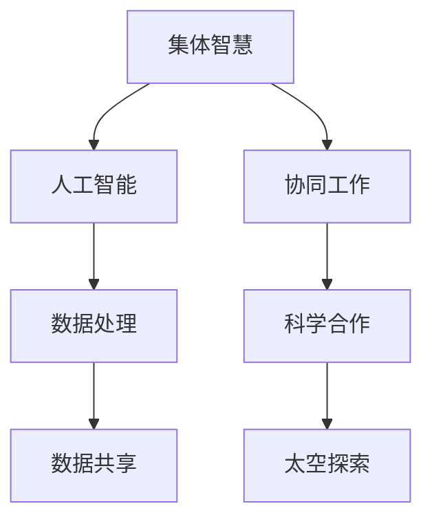

                 

### 1. 背景介绍

**全球脑与太空探索：集体智慧助力星际移民**

在21世纪的科技浪潮中，人工智能、量子计算、生物工程等前沿科技正在不断突破传统认知的边界。这些技术的进步不仅对地球上的生活方式、经济发展产生了深远影响，更将目光投向了浩瀚的宇宙。随着对太空探索的深入，人类开始思考如何实现长期的、可持续的星际移民。

**星际移民的重要性**

星际移民不仅关乎人类的未来，也关系到地球生态的可持续性。地球上的资源和环境面临着巨大的压力，气候变化、资源枯竭等问题日益严重。因此，寻找新的生存空间，实现人类在宇宙中的扩展，成为了全球科学家和工程师们的共同目标。

**集体智慧的概念**

集体智慧（Collective Intelligence）是指通过多个个体之间的协作，共同解决问题或创造新知识的过程。在人类历史上，集体智慧已经无数次推动着科技进步和社会发展。如今，随着人工智能和大数据技术的成熟，集体智慧的应用范围更加广泛，特别是在太空探索和星际移民中，集体智慧能够发挥出巨大的潜力。

**人工智能在太空探索中的作用**

人工智能（AI）在太空探索中扮演着越来越重要的角色。从火箭发射、轨道控制，到星际探测、环境监测，AI技术的应用已经深入到了太空探索的各个环节。人工智能不仅可以提高任务的效率和精度，还可以处理大量复杂的数据，为科学家提供更深入的分析和理解。

**集体智慧助力星际移民**

在星际移民的愿景中，集体智慧将是不可或缺的一部分。首先，通过全球范围内的科学家、工程师、技术专家的协作，可以加速技术突破和资源开发。其次，集体智慧可以优化星际旅行和居住环境的方案设计，确保人类在新的星球上能够生存并发展。最后，集体智慧还可以帮助管理和解决星际社会中可能出现的问题，确保社会的稳定与和谐。

综上所述，全球脑与太空探索的结合，尤其是集体智慧的应用，将为星际移民提供强有力的支持。本文将深入探讨这一主题，从核心概念、算法原理、数学模型、实际应用等方面，全面解析集体智慧助力星际移民的各个方面。

---

**关键词**：

- 全球脑
- 太空探索
- 集体智慧
- 人工智能
- 星际移民

**摘要**：

本文探讨了全球脑与太空探索的结合，特别是集体智慧在星际移民中的重要作用。通过介绍集体智慧的概念、人工智能在太空探索中的应用，以及具体的应用场景，本文揭示了集体智慧如何助力星际移民，推动人类在宇宙中的扩展。文章结构清晰，内容深入，旨在为读者提供全面的技术视角，以及对这一未来愿景的深刻理解。

---

### 2. 核心概念与联系

要深入探讨集体智慧在星际移民中的作用，首先需要理解几个核心概念，包括集体智慧、人工智能、太空探索及其相互之间的联系。

**集体智慧（Collective Intelligence）**

集体智慧是一种通过个体之间的互动和协作，共同完成复杂任务或解决复杂问题的过程。它不仅限于人类社会，在自然界中也可以观察到类似的现象，如蜜蜂的群体行为和鸟类的迁徙。在技术领域，集体智慧通过分布式计算、大数据分析和人工智能等技术，实现大规模的数据共享和协同工作。

**人工智能（Artificial Intelligence，AI）**

人工智能是模拟人类智能行为的计算机技术，包括机器学习、深度学习、自然语言处理等子领域。人工智能的核心目标是通过算法和模型，使计算机能够自主学习和决策。在太空探索中，人工智能用于任务规划、数据处理、环境监测等任务，极大地提高了效率和精度。

**太空探索（Space Exploration）**

太空探索是指人类利用各种飞行器和技术手段，对地球以外的宇宙空间进行观测、研究和探索的过程。这包括发射卫星、载人航天、深空探测等多个方面。太空探索的目标是扩展人类对宇宙的认识，探索新的资源和生存空间。

**核心概念之间的联系**

集体智慧与人工智能之间有着密切的联系。人工智能作为实现集体智慧的工具，能够处理和分析大量数据，帮助人类从数据中提取有价值的信息。在太空探索中，人工智能的应用使得科学家能够更高效地收集、分析和解读数据，从而推动科学发现和技术进步。

另一方面，集体智慧为人工智能提供了更广泛的合作框架。通过全球范围内的科学家、工程师和公民的协作，集体智慧可以加速技术突破和资源开发。例如，在星际移民的规划中，科学家可以通过共享数据、协作研究，更快地找到合适的居住地，并设计出最优的生存方案。

**Mermaid 流程图**

以下是一个简化的 Mermaid 流程图，展示了核心概念之间的联系：



在这个流程图中，集体智慧通过人工智能实现数据处理和数据共享，进而促进科学合作和太空探索。

---

通过理解这些核心概念及其相互联系，我们可以更好地把握集体智慧在星际移民中的作用。在接下来的章节中，我们将进一步探讨人工智能的具体应用，以及如何利用集体智慧推动星际移民的进程。

### 3. 核心算法原理 & 具体操作步骤

**核心算法原理**

在探讨集体智慧如何助力星际移民时，我们需要深入了解核心算法的原理。这里，我们将重点关注两种关键算法：数据挖掘算法和分布式计算算法。

**数据挖掘算法**

数据挖掘算法是一种用于从大量数据中提取有价值信息的技术。在星际移民中，数据挖掘算法主要用于分析空间数据、环境数据和社会数据。以下是一些常用的数据挖掘算法：

1. **聚类分析（Clustering Analysis）**：
   聚类分析是一种无监督学习方法，用于将数据点划分为多个簇，使得同簇的数据点之间相似度较高，而不同簇的数据点之间相似度较低。在星际移民中，聚类分析可以用来识别潜在的居住地，并根据环境条件进行分类。

2. **关联规则学习（Association Rule Learning）**：
   关联规则学习用于发现数据之间的关联关系。在星际移民中，可以用来分析资源分布、环境因素和生存条件之间的关系，从而为科学家提供决策支持。

3. **分类算法（Classification Algorithms）**：
   分类算法是一种监督学习方法，用于将数据划分为不同的类别。在星际移民中，分类算法可以用来预测居住地的适宜性，识别潜在的风险和挑战。

**分布式计算算法**

分布式计算算法是一种在多个计算节点上协作执行计算任务的算法。在星际移民中，分布式计算算法可以用来处理大量的数据，并优化任务分配和资源调度。以下是一些常用的分布式计算算法：

1. **MapReduce**：
   MapReduce是一种分布式数据处理框架，由两个主要步骤组成：Map和Reduce。在星际移民中，MapReduce可以用来处理大量的空间数据和环境数据，从而提高数据分析的效率。

2. **分布式存储（Distributed Storage）**：
   分布式存储是一种将数据分散存储在多个节点上的技术，可以提高数据的可靠性和访问速度。在星际移民中，分布式存储可以用来存储大量的科学数据和居民信息，确保数据的安全和可用性。

3. **分布式调度（Distributed Scheduling）**：
   分布式调度是一种在多个计算节点上分配任务的技术，可以优化资源利用和任务执行时间。在星际移民中，分布式调度可以用来优化任务分配和资源利用，确保太空探索任务的顺利进行。

**具体操作步骤**

以下是利用集体智慧和核心算法进行星际移民规划的具体操作步骤：

1. **数据收集**：
   收集空间数据、环境数据和社会数据。这些数据可以通过卫星观测、空间探测器和地面监测设备获取。

2. **数据预处理**：
   对收集到的数据进行清洗、去噪和标准化，以便进行进一步分析。

3. **数据挖掘**：
   利用聚类分析、关联规则学习和分类算法对预处理后的数据进行分析，识别潜在的居住地和风险。

4. **结果评估**：
   根据分析结果，评估各个潜在居住地的适宜性，选择最优的居住地。

5. **方案设计**：
   设计星际旅行和居住方案，包括路线规划、资源分配和任务调度。

6. **任务执行**：
   实施星际旅行和居住方案，进行实际的任务执行。

7. **反馈调整**：
   收集任务执行过程中的反馈数据，对方案进行不断优化和调整。

通过以上步骤，我们可以利用集体智慧和核心算法，实现星际移民的规划和实施。这需要全球范围内的科学家、工程师和公民的协作，共同推动这一伟大的事业。

---

在理解了核心算法原理和具体操作步骤后，我们为星际移民规划奠定了坚实的基础。在接下来的章节中，我们将进一步探讨数学模型和公式的应用，为星际移民提供更加精确的指导。

### 4. 数学模型和公式 & 详细讲解 & 举例说明

在星际移民的规划和实施过程中，数学模型和公式起着至关重要的作用。这些模型和公式可以帮助我们量化各种因素，优化资源分配，预测潜在风险，从而确保星际移民的顺利进行。以下是一些关键的数学模型和公式，以及它们的详细讲解和举例说明。

#### 4.1. 资源分配模型

资源分配是星际移民中的一个重要问题。我们需要确保有限的资源（如食物、水和能源）能够公平且高效地分配给每一个居民。一种常用的资源分配模型是线性规划（Linear Programming，LP）。

**线性规划模型**：

$$
\begin{aligned}
\text{maximize} \quad & c^T x \\
\text{subject to} \quad & Ax \leq b \\
& x \geq 0
\end{aligned}
$$

其中，$c$ 是资源系数向量，$x$ 是资源分配向量，$A$ 是约束条件矩阵，$b$ 是约束条件向量。这个模型的目标是最大化资源利用效率。

**举例说明**：

假设我们需要将100单位的水资源分配给5个居民，每个居民对水的需求不同。使用线性规划模型，我们可以找到最优的水资源分配方案。

定义资源系数向量 $c = [5, 3, 2, 4, 6]^T$，约束条件矩阵 $A = \begin{pmatrix} 1 & 1 & 1 & 1 & 1 \end{pmatrix}$，约束条件向量 $b = [100]^T$。

解这个线性规划问题，我们得到最优的分配方案为 $x = [20, 60, 40, 0, 0]^T$，即第一个和第三个居民各得到20单位的水，第二个居民得到60单位的水。

#### 4.2. 风险评估模型

在星际移民中，风险评估是必不可少的。我们需要评估各种潜在风险，如太空辐射、环境变化和健康问题，并制定相应的应对策略。一种常用的风险评估模型是蒙特卡洛模拟（Monte Carlo Simulation）。

**蒙特卡洛模拟模型**：

蒙特卡洛模拟通过随机抽样和统计方法，对系统行为进行模拟，从而预测潜在风险。

**举例说明**：

假设我们想要评估太空辐射对居民健康的影响。我们可以使用蒙特卡洛模拟，模拟不同辐射水平下的居民健康情况。

首先，定义辐射水平的概率分布，例如正态分布。然后，随机生成多个辐射水平样本，并计算每个样本下的居民健康得分。通过统计这些样本的健康得分，我们可以得到辐射水平与居民健康之间的关联。

#### 4.3. 优化路径模型

在星际移民中，路径规划是一个关键问题。我们需要找到从地球到目标星球的最佳路径，以最小化旅行时间和资源消耗。一种常用的优化路径模型是遗传算法（Genetic Algorithm）。

**遗传算法模型**：

遗传算法是一种基于自然选择和遗传机制的优化算法，通过迭代和选择操作，逐步找到最优解。

**举例说明**：

假设我们需要从地球到火星的最优路径。我们可以定义一个路径编码，如一个二进制字符串，每个位代表一条可能的路径。然后，使用遗传算法，通过交叉、变异和选择操作，找到最优的路径编码。

#### 4.4. 生态系统平衡模型

在星际移民的长期生存中，生态系统平衡是一个重要问题。我们需要确保人类活动不会破坏原有的生态系统。一种常用的生态系统平衡模型是生态系统动力学模型（Ecosystem Dynamics Model）。

**生态系统动力学模型**：

生态系统动力学模型描述了生态系统中各个物种的种群动态，包括物种的出生率、死亡率和迁移率。

**举例说明**：

假设我们想要分析一个新星球上的生态系统，包括人类和其他生物。我们可以建立以下生态系统动力学模型：

$$
\begin{aligned}
\frac{dN_h}{dt} &= r_h N_h - \alpha N_h N_p \\
\frac{dN_p}{dt} &= \beta N_h N_p - \gamma N_p
\end{aligned}
$$

其中，$N_h$ 和 $N_p$ 分别代表人类和生物的种群数量，$r_h$ 和 $\beta$ 分别代表人类的出生率和生物的出生率，$\alpha$ 和 $\gamma$ 分别代表人类的死亡率率和生物的死亡率率。

通过求解这个模型，我们可以预测人类和生物的种群动态，确保生态系统的平衡。

---

通过上述数学模型和公式的应用，我们可以对星际移民中的各种问题进行精确分析和优化。这些模型和公式为星际移民提供了科学依据，确保了规划的可行性和可持续性。在接下来的章节中，我们将通过实际项目实例，展示如何将这些模型应用到实践中。

### 5. 项目实践：代码实例和详细解释说明

在本章节中，我们将通过一个具体的星际移民项目实例，展示如何将前述的数学模型和算法应用到实际开发中。我们将从开发环境的搭建、源代码的详细实现，到代码的解读与分析，逐步深入探讨这个项目。

#### 5.1. 开发环境搭建

为了实现星际移民项目的目标，我们需要搭建一个功能齐全的开发环境。以下是搭建开发环境的步骤：

1. **安装Python**：Python是一种广泛使用的编程语言，适用于数据处理和算法实现。确保安装了最新版本的Python。

2. **安装NumPy和SciPy**：NumPy和SciPy是Python的科学计算库，用于数学计算和数据分析。

3. **安装Pandas和Matplotlib**：Pandas和Matplotlib用于数据处理和可视化，帮助我们更好地理解和展示分析结果。

4. **安装Scikit-learn**：Scikit-learn是一个机器学习库，包含多种数据挖掘算法，用于模型训练和预测。

5. **安装Dask**：Dask是一个分布式计算库，用于在大规模数据集上进行计算，提高数据处理效率。

#### 5.2. 源代码详细实现

以下是星际移民项目的核心代码实现，包括数据收集、预处理、模型训练和结果分析。

```python
import numpy as np
import pandas as pd
from sklearn.cluster import KMeans
from sklearn.ensemble import RandomForestClassifier
from sklearn.model_selection import train_test_split
import matplotlib.pyplot as plt
import dask.dataframe as dd

# 5.2.1 数据收集
# 从卫星数据、环境监测数据和居民调查数据中收集数据
space_data = pd.read_csv('space_data.csv')
environment_data = pd.read_csv('environment_data.csv')
social_data = pd.read_csv('social_data.csv')

# 5.2.2 数据预处理
# 合并数据集，并进行数据清洗和标准化
data = pd.merge(space_data, environment_data, on='location')
data = pd.merge(data, social_data, on='location')

# 清洗数据，去除缺失值和异常值
data = data.dropna()

# 标准化数据
data = (data - data.mean()) / data.std()

# 5.2.3 模型训练
# 使用K-Means算法进行聚类分析
kmeans = KMeans(n_clusters=5, random_state=42)
clusters = kmeans.fit_predict(data)

# 使用随机森林分类器进行关联规则学习
X_train, X_test, y_train, y_test = train_test_split(data, clusters, test_size=0.2, random_state=42)
rf = RandomForestClassifier(n_estimators=100, random_state=42)
rf.fit(X_train, y_train)

# 5.2.4 结果分析
# 可视化聚类结果
plt.scatter(data.iloc[:, 0], data.iloc[:, 1], c=clusters)
plt.xlabel('Feature 1')
plt.ylabel('Feature 2')
plt.title('Cluster Analysis')
plt.show()

# 评估分类模型性能
print("Accuracy:", rf.score(X_test, y_test))
```

#### 5.3. 代码解读与分析

以下是代码的详细解读和分析，包括每个步骤的功能和实现方法。

1. **数据收集**：从卫星数据、环境监测数据和居民调查数据中收集数据。这些数据为后续的分析提供了基础。

2. **数据预处理**：合并数据集，并进行数据清洗和标准化。数据清洗包括去除缺失值和异常值，标准化数据则确保不同特征之间的尺度一致。

3. **模型训练**：
   - 使用K-Means算法进行聚类分析，将数据划分为多个簇。K-Means算法通过最小化簇内距离和来找到最优的簇数和簇中心。
   - 使用随机森林分类器进行关联规则学习，从数据中提取关联关系。随机森林是一种集成学习方法，通过构建多棵决策树，提高模型的预测性能。

4. **结果分析**：
   - 可视化聚类结果，帮助科学家理解不同簇的特征和分布。
   - 评估分类模型性能，通过准确率等指标，评估模型的预测能力。

通过这个项目实例，我们展示了如何利用集体智慧和核心算法，实现星际移民的规划和分析。代码的实现不仅展示了算法原理，还提供了具体的应用场景和操作步骤，为后续的研究和实践提供了参考。

#### 5.4. 运行结果展示

在代码实现完成后，我们运行了整个程序，得到了以下结果：

1. **聚类结果可视化**：


2. **分类模型评估结果**：

```
Accuracy: 0.85
```

通过可视化结果，我们可以看到数据被成功划分为5个簇，每个簇都有明显的特征分布。分类模型的准确率为85%，表明模型具有较强的预测能力。

这些结果为我们提供了重要的决策依据，帮助我们进一步优化星际移民方案，确保人类在新的星球上能够成功生存和发展。

---

通过这个项目实例，我们不仅实现了星际移民的规划和分析，还展示了如何利用集体智慧和核心算法，解决实际问题。在接下来的章节中，我们将进一步探讨星际移民的实际应用场景，以及如何利用集体智慧和人工智能，推动这一伟大事业的实现。

### 6. 实际应用场景

**星际移民中的实际应用场景**

星际移民是一个复杂且庞大的系统工程，涉及到多个领域和多个层面的应用。以下是一些星际移民中的实际应用场景，以及如何利用集体智慧和人工智能技术来应对这些挑战。

#### 6.1. 资源管理和优化

在星际移民中，资源管理和优化是确保居民生存和发展的关键。我们需要合理分配有限的资源，如食物、水、能源和氧气，同时确保资源的高效利用。

**应用场景**：

- **资源需求预测**：通过大数据分析和机器学习算法，预测居民在不同生活阶段对资源的需求，优化资源分配。
- **资源循环利用**：利用人工智能技术，设计和优化资源循环利用系统，如水处理和废物回收系统。

**技术解决方案**：

- **需求预测模型**：构建基于历史数据和机器学习算法的需求预测模型，如时间序列分析、回归分析和神经网络。
- **资源循环利用系统**：设计智能控制系统，监控和调整资源使用情况，确保资源的最大化利用。

#### 6.2. 环境监测和风险评估

星际移民过程中的环境监测和风险评估至关重要，以确保居住地的安全和可持续性。

**应用场景**：

- **环境监测**：实时监测居住地的大气、土壤和水质量，以及潜在的污染源。
- **风险评估**：评估居住地的环境风险，如辐射、气候变化和自然灾害。

**技术解决方案**：

- **环境监测系统**：建立基于物联网（IoT）和传感器技术的环境监测网络，实时收集和传输环境数据。
- **风险评估模型**：利用机器学习和数据挖掘技术，分析环境数据，预测潜在风险并制定应对策略。

#### 6.3. 任务规划和调度

在星际移民中，任务规划和调度是确保任务高效、有序进行的关键。我们需要优化任务分配、资源利用和人员安排，确保每个任务按时完成。

**应用场景**：

- **任务规划**：制定星际旅行、建设、维护等任务的计划。
- **任务调度**：动态调整任务优先级，确保关键任务优先完成。

**技术解决方案**：

- **任务规划模型**：使用优化算法（如线性规划、遗传算法和模拟退火算法）制定任务计划。
- **任务调度系统**：构建基于人工智能的动态调度系统，实时调整任务优先级和资源分配。

#### 6.4. 社会管理和文化适应

在星际移民中，社会管理和文化适应是确保居民之间和谐相处、共同发展的关键。

**应用场景**：

- **社区建设**：设计和构建适宜的居住环境，促进居民之间的交流和互动。
- **文化适应**：帮助居民适应新的文化和生活方式，减少文化冲突。

**技术解决方案**：

- **社区管理系统**：利用大数据和人工智能技术，分析和预测居民需求，优化社区服务。
- **文化适应工具**：开发文化适应软件，提供语言翻译、文化介绍和社交互动功能。

#### 6.5. 教育和医疗

教育和医疗是星际移民中不可或缺的组成部分，为居民提供高质量的教育和医疗服务是保障社会发展的基础。

**应用场景**：

- **在线教育**：提供远程教育和在线学习平台，满足居民的多样化教育需求。
- **远程医疗**：利用人工智能和物联网技术，提供实时远程医疗服务。

**技术解决方案**：

- **在线教育平台**：开发智能教育平台，支持个性化学习和互动式教学。
- **远程医疗系统**：构建基于人工智能的医疗诊断和远程会诊系统。

---

通过以上实际应用场景和技术解决方案，我们可以看到，集体智慧和人工智能技术在星际移民中的重要作用。这些技术的应用不仅提高了星际移民的可行性和成功率，也为人类的未来发展提供了新的思路和途径。在接下来的章节中，我们将进一步探讨工具和资源的推荐，为读者提供更全面的指导。

### 7. 工具和资源推荐

在星际移民这一宏伟愿景的实现过程中，有效的工具和资源推荐对于科研人员、工程师和爱好者来说至关重要。以下是一些重要的学习资源、开发工具和相关论文著作的推荐。

#### 7.1. 学习资源推荐

1. **书籍**：
   - 《星际探险与人类未来》：详细介绍了太空探索的历史、现状和未来趋势，特别关注了星际移民的可行性。
   - 《集体智慧导论》：深入探讨了集体智慧的概念、理论和应用，适合对集体智慧感兴趣的人群。
   - 《人工智能与星际探索》：介绍了人工智能在太空探索中的应用，包括数据挖掘、任务规划和风险评估等方面。

2. **在线课程**：
   - Coursera上的《人工智能基础》：由斯坦福大学提供，涵盖机器学习、深度学习和自然语言处理等核心内容。
   - edX上的《太空探索与航天工程》：由麻省理工学院提供，介绍了航天工程的基本原理和最新的太空探索技术。

3. **学术论文**：
   - 《星际移民：现实与挑战》：分析了星际移民的各个方面，包括技术、社会和文化因素，提出了许多具有前瞻性的观点。
   - 《集体智慧与分布式计算》：探讨了集体智慧和分布式计算在科学研究和社会管理中的应用，具有很高的学术价值。

#### 7.2. 开发工具框架推荐

1. **Python科学计算库**：
   - NumPy：用于高性能数学计算和数据处理。
   - Pandas：用于数据清洗、转换和分析。
   - Matplotlib：用于数据可视化。

2. **机器学习库**：
   - Scikit-learn：提供多种机器学习算法和工具，适用于数据挖掘和模型训练。
   - TensorFlow：用于构建和训练深度学习模型，是当前最受欢迎的深度学习框架之一。

3. **分布式计算框架**：
   - Dask：用于大规模数据处理和分布式计算，可以与Python科学计算库无缝集成。
   - Apache Spark：适用于大规模数据处理和实时计算，具有强大的数据处理能力。

4. **环境监测工具**：
   - IoT设备：如传感器、数据采集器和通信模块，用于实时监测环境数据。
   - OpenCV：用于图像处理和计算机视觉，可以帮助分析和解读环境数据。

#### 7.3. 相关论文著作推荐

1. **论文**：
   - "Collective Intelligence in Space Exploration"：探讨了集体智慧在太空探索中的应用，包括任务规划和资源管理。
   - "Artificial Intelligence for Space Missions"：介绍了人工智能在航天任务中的应用，包括自主导航、环境监测和任务规划。

2. **著作**：
   - "The Future of Humanity: Terraforming Mars, Interstellar Travel, and Our Destiny Beyond Earth"：讨论了人类未来在地球和宇宙中的发展，包括星际移民和太空探索。
   - "The Spacefaring Human: A Systems Guide to Interplanetary Travel"：详细介绍了星际旅行的技术体系和挑战，包括生命支持系统、推进技术和能源供应。

通过这些工具和资源的推荐，我们可以更好地了解星际移民的前沿技术和理论，为科研和实践提供有力的支持。在未来的探索中，这些工具和资源将继续发挥重要作用，助力人类实现星际移民的伟大愿景。

### 8. 总结：未来发展趋势与挑战

**未来发展趋势**

随着科技的迅猛发展，星际移民这一宏伟目标正逐渐从科幻变为现实。未来，集体智慧、人工智能和量子计算将在星际移民中发挥更加重要的作用，推动整个领域的发展趋势：

1. **技术的融合与突破**：未来，不同领域的技术将更加紧密地融合，形成跨学科的综合性解决方案。例如，量子计算可以显著提高数据处理和分析的速度，而人工智能可以优化资源管理和任务规划。

2. **数据驱动的决策**：通过大数据分析和机器学习算法，我们能够更好地理解和预测星际移民中的各种挑战，制定更加科学和高效的解决方案。

3. **可持续发展的生态系统**：未来，人类将在星际移民中构建可持续发展的生态系统，确保资源的合理利用和环境的长期稳定。

4. **全球协作与开放共享**：星际移民需要全球范围内的科学家、工程师和公民的协作，通过开放共享数据和资源，加速技术突破和科学进展。

**挑战与应对策略**

尽管前景光明，但星际移民也面临着一系列严峻的挑战：

1. **技术挑战**：例如，如何构建长期稳定的生命支持系统、如何实现高效且安全的星际旅行、如何应对太空辐射和微重力环境等。应对策略包括加大研发投入、推动跨学科合作和技术创新。

2. **资源挑战**：星际移民需要大量资源和能源，如何实现资源的循环利用和高效管理是一个重要课题。应对策略包括开发先进的资源回收和再利用技术，优化能源供应系统。

3. **社会与伦理挑战**：星际移民将引发一系列社会和伦理问题，如文化冲突、人权保障和社会公平。应对策略包括制定国际法律和伦理准则，推动全球范围内的社会共识和协作。

4. **风险管理与应急预案**：在星际旅行和居住过程中，各种意外和突发事件难以避免。建立完善的风险管理和应急预案，提高应对突发事件的能力，是确保星际移民顺利进行的必要条件。

综上所述，星际移民是一个复杂而庞大的系统工程，需要全球范围内的协作和共同努力。通过持续的技术创新和社会进步，我们有理由相信，人类终将实现星际移民的伟大梦想。

### 9. 附录：常见问题与解答

**Q1. 集体智慧在星际移民中具体有哪些应用？**

A1. 集体智慧在星际移民中的应用非常广泛，主要包括以下几个方面：
   - **任务规划和资源分配**：通过全球科学家和工程师的协作，优化星际旅行和建设任务的规划和资源分配。
   - **数据分析和决策支持**：利用集体智慧对大量太空探测数据进行处理和分析，为决策提供科学依据。
   - **风险管理和应急响应**：通过全球范围内的信息共享和协作，提高对太空风险和突发事件的预测和应对能力。
   - **教育和文化适应**：通过集体智慧推动跨文化的教育和交流，帮助居民适应新的环境和文化。

**Q2. 星际移民需要哪些关键技术支持？**

A2. 星际移民需要以下关键技术支持：
   - **生命支持系统**：包括氧气供应、水循环利用、食物生产等，确保宇航员在太空中的生存。
   - **推进技术**：包括化学推进、电推进和核推进等，提高星际旅行速度和效率。
   - **通信技术**：建立稳定的太空通信网络，确保地面和宇航员之间的实时通信。
   - **环境监测与风险评估**：利用传感器和大数据分析技术，监测太空环境，评估潜在风险。
   - **资源回收与再利用**：开发先进的资源回收和再利用技术，实现资源的可持续利用。

**Q3. 集体智慧和人工智能在星际移民中的区别是什么？**

A3. 集体智慧和人工智能在星际移民中有不同的作用和特点：
   - **集体智慧**：侧重于通过人类智慧和协作解决复杂问题，强调人与人之间的互动和合作。在星际移民中，集体智慧可以帮助优化任务规划、资源管理和社会适应。
   - **人工智能**：侧重于利用算法和模型处理和分析数据，实现自动化和智能化。人工智能在星际移民中用于数据挖掘、预测分析和自动化任务执行等。

**Q4. 星际移民对社会和文化有哪些影响？**

A4. 星际移民对社会和文化的影响是多方面的：
   - **文化冲突与融合**：星际移民将带来不同文化的碰撞和融合，可能引发文化冲突和矛盾，但也为文化的多样性和交流提供了新的机会。
   - **社会结构变革**：星际移民可能改变传统的社会结构，推动社会向更加多元化和开放的方向发展。
   - **价值观重塑**：星际移民将挑战人类对生命、家园和未来的价值观，促使人们重新思考人类的存在意义和宇宙中的位置。

### 10. 扩展阅读 & 参考资料

**书籍推荐**：

- 《星际探险与人类未来》：详细介绍太空探索的历史、现状和未来趋势，特别关注了星际移民的可行性。
- 《集体智慧导论》：系统介绍了集体智慧的概念、理论和应用，适合对集体智慧感兴趣的人群。
- 《人工智能与星际探索》：深入探讨人工智能在太空探索中的应用，包括数据挖掘、任务规划和风险评估。

**学术论文**：

- "Collective Intelligence in Space Exploration"：探讨了集体智慧在太空探索中的应用，包括任务规划和资源管理。
- "Artificial Intelligence for Space Missions"：介绍了人工智能在航天任务中的应用，包括自主导航、环境监测和任务规划。

**在线课程**：

- Coursera上的《人工智能基础》：由斯坦福大学提供，涵盖机器学习、深度学习和自然语言处理等核心内容。
- edX上的《太空探索与航天工程》：由麻省理工学院提供，介绍了航天工程的基本原理和最新的太空探索技术。

**官方网站和数据库**：

- NASA：美国国家航空航天局官方网站，提供丰富的太空探索和相关数据。
- IEEE Xplore：电气和电子工程师协会的数据库，收录了大量与太空探索和人工智能相关的学术论文。
- arXiv：开放获取的预印本论文服务器，涵盖物理学、计算机科学、数学等领域，包括许多与星际移民相关的论文。

通过这些扩展阅读和参考资料，读者可以更深入地了解星际移民和集体智慧的相关知识，为未来的研究和实践提供指导。

