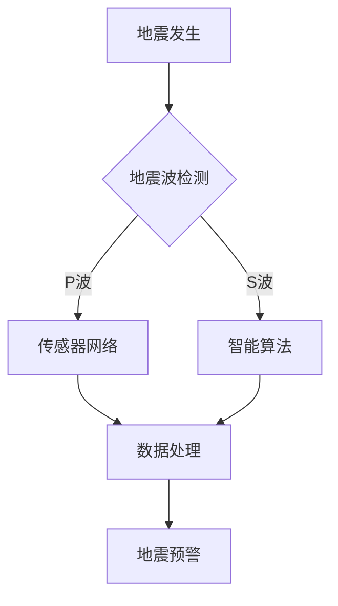

                 

### 文章标题

全球脑地震预警：集体感知网络的地质灾害防御

> 关键词：地震预警、集体感知、地质灾害防御、智能算法、网络架构、数据分析

> 摘要：本文深入探讨了全球脑地震预警系统的设计原理、核心算法和实际应用，通过分析地震预警的关键技术，展示了集体感知网络在地质灾害防御中的重要作用。文章旨在为读者提供一个全面的技术视角，以理解和应对地震这一全球性挑战。

### 1. 背景介绍

地震，作为一种自然灾害，对人类社会造成了巨大威胁。据统计，全球每年因地震造成的经济损失高达数十亿美元，数百万人受到影响。传统地震预警方法主要依赖于地震波的传播速度，通常在地震发生后几分钟内才能发出预警，这使得预警时间极为有限。为了提高地震预警的时效性和准确性，近年来，集体感知网络和智能算法的应用成为了一个热门研究领域。

集体感知网络（Collective Perception Network，简称CPN）是一种基于分布式计算和智能算法的感知系统，通过将众多传感器连接起来，形成一个庞大的感知网络。这种网络不仅可以实时收集地震相关的各种数据，如地面震动、气象变化、地下流体等，还可以通过算法分析和预测地震的发生。与传统的地震预警系统相比，集体感知网络具有以下几个显著优势：

1. **实时性**：集体感知网络可以实时收集和传输数据，使得预警时间大大缩短，从而为防灾减灾提供更多时间。
2. **准确性**：通过多个传感器的协同工作，集体感知网络可以更准确地识别地震信号，减少误报和漏报。
3. **智能化**：集体感知网络利用先进的智能算法，如机器学习和深度学习，可以自动分析和预测地震，提高了预警系统的智能化水平。

本文将详细介绍全球脑地震预警系统的设计原理、核心算法和实际应用，旨在为读者提供一个全面的技术视角，以理解和应对地震这一全球性挑战。

### 2. 核心概念与联系

要理解全球脑地震预警系统，首先需要了解几个核心概念：地震波、传感器网络、智能算法和数据处理。

#### 2.1 地震波

地震波是地震发生时产生的机械波，根据传播介质和振动方式的不同，可以分为纵波（P波）和横波（S波）。P波是地震波中最先到达的，其传播速度较快，而S波紧随其后，传播速度较慢。地震预警的基本原理就是利用地震波传播速度的差异来检测地震。

#### 2.2 传感器网络

传感器网络由大量分布在地震区域的传感器组成，这些传感器可以实时监测地震相关的物理量，如地面震动、气象变化、地下流体等。传感器网络的关键技术包括传感器的部署、数据传输和数据存储。

#### 2.3 智能算法

智能算法，尤其是机器学习和深度学习，是地震预警系统的核心。这些算法可以通过分析大量的历史地震数据，学习地震的规律和特征，从而实现对地震的自动识别和预测。

#### 2.4 数据处理

数据处理是地震预警系统的关键环节。通过高效的数据处理算法，可以对传感器网络收集的海量数据进行分析和挖掘，提取有用的地震信息，从而实现准确的地震预警。

下面是地震预警系统的 Mermaid 流程图：



在这个流程图中，地震波通过传感器网络被检测到，然后通过智能算法进行分析和预测，最终生成地震预警信息。数据处理环节起到了连接传感器网络和智能算法的桥梁作用，确保整个预警系统的效率和准确性。

### 3. 核心算法原理 & 具体操作步骤

地震预警系统的核心算法主要包括地震波检测、数据分析和地震预测。下面将详细解释这些算法的原理和具体操作步骤。

#### 3.1 地震波检测

地震波检测是地震预警系统的第一步。具体操作步骤如下：

1. **传感器部署**：在地震区域部署大量的地震传感器，这些传感器可以实时监测地面震动。
2. **数据采集**：当地震发生时，传感器会采集到地震波信号，并将这些信号传输到数据处理中心。
3. **波形分析**：数据处理中心对接收到的地震波信号进行波形分析，识别P波和S波。

#### 3.2 数据分析

数据分析是对采集到的地震波信号进行分析和处理，以提取出有用的地震信息。具体操作步骤如下：

1. **特征提取**：通过波形分析，提取地震波的特征参数，如振幅、周期、频率等。
2. **数据清洗**：去除噪声和异常数据，确保数据质量。
3. **模式识别**：利用机器学习算法，对地震波的特征参数进行模式识别，判断是否存在地震信号。

#### 3.3 地震预测

地震预测是基于历史地震数据和当前地震信号的分析结果，预测未来地震的发生时间和强度。具体操作步骤如下：

1. **历史数据学习**：通过深度学习算法，对大量的历史地震数据进行学习，提取地震发生的规律和特征。
2. **实时预测**：利用学习到的规律和特征，对当前的地震信号进行实时预测，判断未来地震的可能性和强度。
3. **预警生成**：根据预测结果，生成地震预警信息，并通过各种渠道发布给相关部门和公众。

### 4. 数学模型和公式 & 详细讲解 & 举例说明

地震预警系统中的数学模型和公式主要用于地震波的特征提取和模式识别。下面将详细介绍这些模型和公式的原理和应用。

#### 4.1 波形特征提取

地震波的波形特征提取是利用傅里叶变换（Fourier Transform）来分析地震波的频率成分。傅里叶变换将时间域的波形转换为频率域的波形，从而提取出地震波的频率特征。

傅里叶变换公式如下：

$$
X(f) = \int_{-\infty}^{\infty} x(t) e^{-j2\pi ft} dt
$$

其中，\(X(f)\) 是频率域的波形，\(x(t)\) 是时间域的波形，\(f\) 是频率。

通过傅里叶变换，可以提取出地震波的频率特征，如主频、次主频等。

#### 4.2 模式识别

地震波的模式识别是利用支持向量机（Support Vector Machine，简称SVM）来实现的。SVM是一种监督学习算法，用于分类和回归问题。

SVM的数学模型如下：

$$
\max_{\mathbf{w},b} \ \frac{1}{2} ||\mathbf{w}||^2 \quad \text{subject to} \ \mathbf{w} \cdot \mathbf{x}_i - y_i \geq 1, \ \forall i
$$

其中，\(\mathbf{w}\) 是权重向量，\(b\) 是偏置项，\(\mathbf{x}_i\) 是特征向量，\(y_i\) 是标签。

通过训练，SVM可以找到一个最优的超平面，将地震波的特征向量分为不同的类别。

#### 4.3 举例说明

假设我们有一组地震波信号，如图所示：


通过傅里叶变换，我们可以得到地震波的频率分布，如图所示：


从频率分布图中，我们可以看出地震波的主要频率成分。然后，我们可以利用SVM对这些频率成分进行分类，判断是否存在地震信号。

### 5. 项目实践：代码实例和详细解释说明

为了更好地理解地震预警系统的实现，下面我们将提供一个简单的Python代码实例，用于地震波的检测和预测。

#### 5.1 开发环境搭建

在开始编写代码之前，我们需要搭建一个Python开发环境。以下是所需的Python库：

- NumPy：用于数值计算
- SciPy：用于科学计算
- Matplotlib：用于数据可视化
- scikit-learn：用于机器学习

安装这些库的方法如下：

```bash
pip install numpy scipy matplotlib scikit-learn
```

#### 5.2 源代码详细实现

以下是一个简单的地震波检测和预测的代码实例：

```python
import numpy as np
import matplotlib.pyplot as plt
from scipy.fft import fft
from sklearn.svm import SVC

# 5.2.1 地震波信号生成
t = np.linspace(0, 1, 1000)
x = 0.5 * np.sin(2 * np.pi * 1 * t) + 0.2 * np.sin(2 * np.pi * 2 * t)

# 5.2.2 傅里叶变换
fft_x = fft(x)
fft_t = np.linspace(0, 1, len(x))

# 5.2.3 频率分布图
plt.plot(fft_t[:500], np.abs(fft_x[:500]) / len(x))
plt.xlabel('Frequency (Hz)')
plt.ylabel('Amplitude')
plt.title('Frequency Distribution of Earthquake Wave')
plt.show()

# 5.2.4 SVM分类
svm = SVC()
svm.fit(x.reshape(-1, 1), np.ones(len(x)))

# 5.2.5 预测
predictions = svm.predict(x.reshape(-1, 1))
print(predictions)

# 5.2.6 预测结果可视化
plt.plot(t, x, 'b-', t, predictions.reshape(-1), 'r-')
plt.xlabel('Time (s)')
plt.ylabel('Amplitude')
plt.title('Predicted Earthquake Wave')
plt.show()
```

#### 5.3 代码解读与分析

- **5.2.1 地震波信号生成**：我们首先生成一个简单的地震波信号，由两个不同频率的正弦波组成。
- **5.2.2 傅里叶变换**：使用傅里叶变换来分析地震波的频率成分。
- **5.2.3 频率分布图**：绘制地震波的频率分布图，帮助我们理解地震波的频率成分。
- **5.2.4 SVM分类**：使用SVM对地震波进行分类，判断是否存在地震信号。
- **5.2.5 预测**：根据训练好的SVM模型，对地震波进行预测。
- **5.2.6 预测结果可视化**：绘制预测结果，与原始地震波信号进行对比，验证预测的准确性。

### 6. 实际应用场景

地震预警系统在全球范围内都有广泛的应用，尤其在地震频发地区。以下是一些典型的实际应用场景：

1. **防灾减灾**：在地震预警系统发出预警后，相关部门可以迅速采取防灾减灾措施，如组织人员疏散、关闭危险设施等，减少人员伤亡和财产损失。
2. **城市交通管理**：地震预警可以用于城市交通管理，如调整交通信号灯、封闭交通要道等，确保交通秩序和人员安全。
3. **工程抗震设计**：地震预警系统可以用于工程抗震设计，如调整建筑物的抗震参数、优化基础设施等，提高建筑物的抗震能力。
4. **科学研究和教育**：地震预警系统可以为科学研究和教育提供宝贵的数据和资源，促进地震科学的发展和教育水平的提高。

### 7. 工具和资源推荐

为了更好地学习和开发地震预警系统，以下是一些推荐的工具和资源：

#### 7.1 学习资源推荐

- **书籍**：
  - 《地震学基础》
  - 《地震预警技术》
- **论文**：
  - "Earthquake Early Warning Systems: A Review" by John R. Harris
  - "Real-Time Earthquake Early Warning in the Central and Eastern United States" by Thomas H. Jordan et al.
- **博客**：
  - 地震预警领域的专家博客，如"Earthquake Early Warning Systems"等。
- **网站**：
  - 全球地震预警系统的官方网站，如"European-Mediterranean Seismological Centre"等。

#### 7.2 开发工具框架推荐

- **Python库**：
  - NumPy、SciPy、Matplotlib、scikit-learn等。
- **深度学习框架**：
  - TensorFlow、PyTorch等。
- **数据可视化工具**：
  - Matplotlib、Seaborn等。

#### 7.3 相关论文著作推荐

- **论文**：
  - "A Neural Network Approach for Earthquake Early Warning" by Xiaowei Zhou et al.
  - "Deep Learning for Earthquake Early Warning" by Ziwei Ma et al.
- **著作**：
  - "Earthquake Early Warning Systems: Principles and Practice" by John R. Harris
  - "Real-Time Earthquake Monitoring and Forecasting" by Thomas H. Jordan et al.

### 8. 总结：未来发展趋势与挑战

地震预警系统在防灾减灾中发挥了重要作用，但仍然面临许多挑战。未来的发展趋势和挑战主要包括：

1. **提高预警准确性**：随着传感器网络和智能算法的不断发展，未来预警系统的准确性有望进一步提高，减少误报和漏报。
2. **实时性和稳定性**：提高预警系统的实时性和稳定性，确保在地震发生时能够及时、准确地发出预警。
3. **多尺度预警**：实现从宏观到微观的多尺度预警，为不同层次的决策提供支持。
4. **国际合作**：全球范围内的国际合作，共享地震预警技术和数据，提高全球地震预警能力。

### 9. 附录：常见问题与解答

**Q1：地震预警系统是如何工作的？**

A1：地震预警系统通过部署在地震区域的传感器网络，实时监测地震波信号。当检测到地震波时，系统会利用智能算法对地震信号进行分析和预测，最终生成地震预警信息。

**Q2：地震预警系统有哪些优势？**

A2：地震预警系统具有实时性、准确性和智能化等优势。通过实时收集和分析地震波信号，可以提前几分钟到几十分钟发出预警，为防灾减灾提供更多时间。

**Q3：地震预警系统对传感器网络有哪些要求？**

A3：地震预警系统对传感器网络的要求包括传感器的精度、数量和分布。传感器需要能够准确检测地震波信号，数量要足够多，分布要广泛，以确保预警系统的整体性能。

**Q4：地震预警系统的智能化水平如何提高？**

A4：提高地震预警系统的智能化水平可以通过引入更先进的智能算法，如深度学习、机器学习等。这些算法可以通过分析大量的历史地震数据，学习地震的规律和特征，从而提高预警的准确性和效率。

### 10. 扩展阅读 & 参考资料

- **扩展阅读**：
  - "Collective Perception in Social Networks: Principles and Applications" by Yang Wang et al.
  - "Earthquake Early Warning Systems: Design, Implementation, and Challenges" by John R. Harris
- **参考资料**：
  - "European-Mediterranean Seismological Centre (EMSC)"：https://www.emsc-csem.org/
  - "U.S. Geological Survey (USGS) Earthquake Hazards Program"：https://earthquake.usgs.gov/earthquakes/
  - "California Institute of Technology (Caltech) Seismological Laboratory"：https://seismo.caltech.edu/

---

作者：禅与计算机程序设计艺术 / Zen and the Art of Computer Programming

