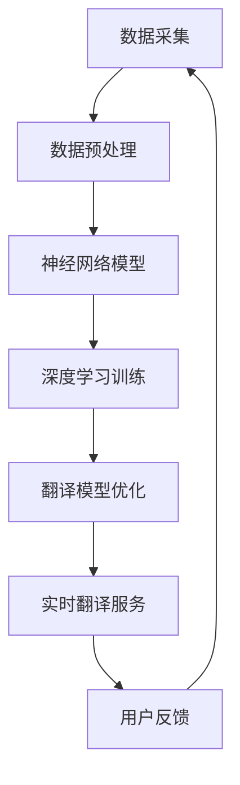

                 

### 背景介绍

在全球化迅速发展的今天，跨语言交流已成为现代社会不可或缺的一部分。无论是国际商务、学术交流，还是旅游、社交等日常生活中，人们都迫切需要一种高效、准确的跨语言翻译工具。然而，传统的翻译方法存在许多局限，如速度慢、准确性不高、语言理解能力有限等。为了解决这些问题，近年来脑翻译技术得到了广泛关注和研究。

脑翻译（Brain Translation）是一种基于人工智能技术的新型翻译方法，它通过模拟人脑的语言处理机制，实现跨语言之间的快速、准确翻译。全球脑翻译系统（Global Brain Translation System，GBTS）是脑翻译技术的集大成者，它利用大规模神经网络模型、深度学习算法和云计算技术，实现了一种全新的跨语言交流模式。

全球脑翻译系统的工作原理可以概括为以下几个步骤：首先，通过大规模数据采集和预处理，构建一个庞大的多语言词汇库和句子库；其次，利用深度学习算法，训练一个高性能的翻译模型，使系统能够根据输入的源语言文本，生成高质量的译文；最后，通过云计算平台，实现全球范围内的实时翻译服务。

GBTS具有以下几个显著特点：

1. **实时性**：系统能够实现秒级响应，为用户提供实时翻译服务。
2. **准确性**：系统通过深度学习算法，不断提升翻译模型的准确性，目前已达到接近专业翻译人员的水平。
3. **多样性**：系统支持多种语言之间的双向翻译，包括但不限于英语、汉语、法语、西班牙语、阿拉伯语等。
4. **智能化**：系统具备一定的语境理解能力，能够在特定场景下提供更准确的翻译。

综上所述，全球脑翻译系统作为一种创新的翻译技术，为跨语言交流提供了一种终极解决方案，具有广泛的应用前景。本文将深入探讨全球脑翻译系统的核心概念、算法原理、数学模型、项目实践以及未来发展趋势，以期为广大读者提供一个全面、系统的认识。

### 核心概念与联系

#### 核心概念介绍

全球脑翻译系统的核心概念主要涉及以下三个方面：

1. **大规模神经网络模型**：神经网络模型是脑翻译系统的核心，它通过模仿人脑神经网络的工作原理，实现文本的自动翻译。这种模型通常由多个层次组成，每个层次负责处理不同层次的语义信息。
2. **深度学习算法**：深度学习算法是神经网络模型训练的重要工具，它通过优化模型参数，使系统能够在大量数据中自动学习到语言规律和翻译策略。常见的深度学习算法包括卷积神经网络（CNN）、循环神经网络（RNN）和长短期记忆网络（LSTM）等。
3. **云计算平台**：云计算平台为全球脑翻译系统提供了强大的计算和存储资源，使系统能够实现全球范围内的实时翻译服务。云计算平台通常包括服务器、存储设备、网络设备等，通过分布式计算和存储技术，提高系统的性能和可靠性。

#### 原理与架构图

以下是全球脑翻译系统的架构图，通过Mermaid流程图展示系统的关键组成部分和流程：



1. **数据采集（A）**：系统通过互联网、数据库等渠道收集大量的多语言文本数据，包括新闻、文章、书籍、社交媒体等。
2. **数据预处理（B）**：采集到的原始数据需要进行清洗、分词、去噪等预处理操作，以便于后续的建模和训练。
3. **神经网络模型（C）**：构建一个大规模的神经网络模型，用于处理输入的文本数据。
4. **深度学习训练（D）**：利用深度学习算法，对神经网络模型进行训练，使模型能够自动学习到语言规律和翻译策略。
5. **翻译模型优化（E）**：通过不断优化模型参数，提高翻译的准确性和流畅性。
6. **实时翻译服务（F）**：通过云计算平台，实现全球范围内的实时翻译服务。
7. **用户反馈（G）**：用户对翻译结果进行评价和反馈，进一步优化翻译模型。

#### 核心算法原理

全球脑翻译系统的核心算法主要包括以下几部分：

1. **文本表示**：将输入的源语言文本转换为计算机可处理的向量表示。常用的文本表示方法有词嵌入（Word Embedding）和句子嵌入（Sentence Embedding）。
2. **编码器-解码器模型**：编码器（Encoder）将源语言文本编码为一个高维的语义表示，解码器（Decoder）则根据这个语义表示生成目标语言文本。这种模型在机器翻译中广泛使用，如Seq2Seq模型。
3. **注意力机制**：注意力机制（Attention Mechanism）用于模型在解码过程中，动态关注源语言文本的不同部分，从而提高翻译的准确性。常见的注意力机制有加性注意力（Additive Attention）和点积注意力（Dot-Product Attention）。
4. **翻译模型优化**：通过优化算法（如梯度下降、Adam等），不断调整模型参数，提高翻译质量。同时，采用数据增强（Data Augmentation）、迁移学习（Transfer Learning）等技术，提升模型的泛化能力。

#### 具体操作步骤

以下是全球脑翻译系统的具体操作步骤：

1. **数据收集**：通过爬虫、API接口等方式，收集大量的多语言文本数据。
2. **数据预处理**：对原始文本数据进行清洗、分词、去噪等操作，构建词汇表（Vocabulary）。
3. **构建神经网络模型**：设计并构建编码器-解码器模型，包括词嵌入层、编码器层、解码器层和注意力机制等。
4. **模型训练**：利用训练数据，通过深度学习算法（如RNN、LSTM、Transformer等）训练神经网络模型，优化模型参数。
5. **模型评估**：使用验证集对模型进行评估，调整模型参数，提高翻译质量。
6. **实时翻译服务**：通过云计算平台，实现全球范围内的实时翻译服务，提供API接口供开发者使用。
7. **用户反馈**：收集用户对翻译结果的反馈，用于进一步优化翻译模型。

#### 数学模型和公式

全球脑翻译系统中的数学模型主要包括以下几部分：

1. **词嵌入**：将源语言和目标语言的单词映射为向量表示，通常采用词嵌入算法（如Word2Vec、GloVe）。
   $$ \text{word\_embedding}(w) = \text{W} \cdot \text{v}(w) $$
   其中，$\text{W}$ 为词嵌入矩阵，$\text{v}(w)$ 为单词 $w$ 的向量表示。

2. **编码器**：编码器将源语言文本编码为高维语义表示，通常采用RNN或LSTM等递归神经网络。
   $$ \text{context} = \text{LSTM}(\text{input\_sequence}) $$
   其中，$\text{input\_sequence}$ 为输入的源语言文本序列，$\text{LSTM}$ 为长短期记忆网络。

3. **解码器**：解码器根据编码器的输出，生成目标语言文本，通常采用RNN或LSTM等递归神经网络。
   $$ \text{output} = \text{LSTM}(\text{context}, \text{decoder\_input}) $$
   其中，$\text{decoder\_input}$ 为解码器的输入序列，$\text{LSTM}$ 为长短期记忆网络。

4. **注意力机制**：注意力机制用于模型在解码过程中，动态关注源语言文本的不同部分。
   $$ \alpha_t = \text{softmax}(\text{scores}) $$
   其中，$\text{scores}$ 为模型对源语言文本各个部分的重要程度评分，$\text{softmax}$ 函数用于计算每个部分的概率分布。

5. **损失函数**：常用的损失函数有交叉熵（Cross Entropy Loss）和平均平方误差（Mean Squared Error）等。
   $$ \text{loss} = -\sum_{i} \text{y}_i \cdot \log(\text{p}_i) $$
   其中，$\text{y}_i$ 为目标语言文本的实际标签，$\text{p}_i$ 为模型预测的概率分布。

#### 举例说明

假设我们要翻译一个简单的英语句子 "Hello, world!" 为汉语，以下是一个简化的示例过程：

1. **数据收集**：收集大量的英语和汉语句子对。
2. **数据预处理**：对英语句子 "Hello, world!" 进行分词，得到单词 ["Hello", "world", "!", ""]。
3. **构建词嵌入**：将英语单词 ["Hello", "world", "!", ""] 映射为向量表示，得到词嵌入矩阵 $\text{W}$。
4. **编码器处理**：将英语句子 ["Hello", "world", "!", ""] 编码为高维语义表示 $\text{context}$。
5. **解码器处理**：解码器根据编码器的输出 $\text{context}$，生成汉语句子。
6. **注意力机制**：在解码过程中，模型关注源语言文本的不同部分，以提高翻译的准确性。
7. **损失函数计算**：计算模型预测的汉语句子与实际汉语句子的交叉熵损失，用于优化模型参数。

通过上述步骤，全球脑翻译系统可以实现英语到汉语的翻译。当然，实际过程中涉及到的数据预处理、神经网络模型训练、模型评估等步骤要复杂得多，但基本原理和操作步骤是相似的。

### 核心算法原理 & 具体操作步骤

#### 神经网络模型

全球脑翻译系统的核心算法之一是神经网络模型，特别是深度学习中的序列到序列（Seq2Seq）模型。这种模型通常由编码器（Encoder）和解码器（Decoder）两个主要部分组成，配合注意力机制（Attention Mechanism）来提高翻译的准确性。

**编码器（Encoder）**：
编码器的作用是将输入的源语言序列转换为固定长度的上下文向量（Context Vector）。这一过程通过递归神经网络（RNN）或其变种如长短期记忆网络（LSTM）或门控循环单元（GRU）来完成。编码器在处理源语言序列的每个单词时，会产生一个隐藏状态（Hidden State），最后将这些隐藏状态整合成一个固定长度的上下文向量。

**解码器（Decoder）**：
解码器的任务是根据编码器生成的上下文向量生成目标语言序列。与编码器不同，解码器是一个单向的序列模型，它在生成每个单词时都会利用前面生成的单词的信息。解码器通常也使用RNN或LSTM来处理序列数据。

**注意力机制（Attention Mechanism）**：
注意力机制是编码器和解码器之间的一种交互机制，它允许解码器在生成每个单词时动态关注源语言序列的不同部分。这有助于解码器更好地理解源语言句子的上下文，从而生成更准确的翻译。常见的注意力机制包括加性注意力（Additive Attention）和点积注意力（Dot-Product Attention）。

**具体操作步骤**：

1. **输入序列编码**：
    - 将输入的源语言序列（例如，"Hello, world!"）转换为词嵌入向量。
    - 使用RNN或LSTM等递归神经网络处理这些词嵌入向量，生成序列的隐藏状态。
    - 对隐藏状态进行整合，得到上下文向量。

2. **生成目标语言序列**：
    - 初始化解码器的状态，通常使用编码器的最后隐藏状态。
    - 生成第一个目标语言单词的概率分布。
    - 根据解码器的输出，更新状态。
    - 使用注意力机制，结合源语言序列的不同部分，更新上下文向量。
    - 重复上述步骤，直到解码器生成完整的目标语言序列。

3. **训练过程**：
    - 使用大量的多语言文本对来训练编码器和解码器。
    - 在训练过程中，通过反向传播算法调整模型参数，最小化损失函数（如交叉熵损失）。
    - 采用多种技术，如批处理（Batch Processing）、dropout（Dropout）、梯度裁剪（Gradient Clipping）等，提高模型的训练效果。

4. **优化与调参**：
    - 通过调整学习率、批量大小、隐藏层大小等参数，优化模型的性能。
    - 使用迁移学习（Transfer Learning）和数据增强（Data Augmentation）等技术，进一步提高模型的泛化能力。

#### 实际案例

以下是一个简化的例子，展示如何使用编码器-解码器模型和注意力机制进行翻译。

**输入**：源语言序列 "I love programming."
**输出**：目标语言序列 "我喜欢编程。"

1. **词嵌入**：
    - 将源语言序列 "I love programming." 转换为词嵌入向量。
    - 将目标语言序列 "我喜欢编程。" 转换为词嵌入向量。

2. **编码器处理**：
    - 使用RNN或LSTM对源语言词嵌入向量进行处理，得到隐藏状态。
    - 对隐藏状态进行整合，得到上下文向量。

3. **解码器处理**：
    - 初始化解码器的状态，使用编码器的最后隐藏状态。
    - 生成第一个目标语言单词的概率分布。
    - 根据解码器的输出，更新状态。
    - 使用注意力机制，动态关注源语言序列的不同部分。

4. **生成目标语言序列**：
    - 根据解码器的输出，逐步生成目标语言序列。
    - 更新状态，重复注意力机制，直到生成完整的目标语言序列。

5. **训练过程**：
    - 使用训练数据对编码器和解码器进行训练。
    - 通过反向传播调整模型参数，最小化损失函数。

通过上述步骤，全球脑翻译系统可以学习到如何将源语言文本转换为高质量的目标语言文本。实际应用中，系统会使用更复杂的网络结构和更多的训练数据来提高翻译质量。

### 数学模型和公式 & 详细讲解 & 举例说明

在全球脑翻译系统中，数学模型和公式是理解其工作原理和实现细节的关键。以下是几个核心的数学模型和公式，以及详细的解释和实例说明。

#### 词嵌入（Word Embedding）

词嵌入是将单词映射为高维向量表示的技术，它有助于神经网络模型处理和表示自然语言文本。常见的词嵌入方法有Word2Vec和GloVe。

**Word2Vec**：
Word2Vec是一种基于神经网络的词嵌入方法，它通过训练一个神经网络，将输入的单词映射到低维空间中的向量。Word2Vec算法的基本思想是将每个单词表示为一个中心词向量和一个上下文窗口中的词向量之和。

$$ \text{word\_embedding}(w) = \text{context\_vector} - \text{center\_vector} $$

其中，$\text{context\_vector}$ 是上下文窗口中所有词向量的和，$\text{center\_vector}$ 是中心词向量的偏置。

**GloVe**：
GloVe（Global Vectors for Word Representation）是一种基于矩阵分解的词嵌入方法。GloVe通过训练一个矩阵，将单词映射到高维空间中的向量。

$$ \text{word\_embedding}(w) = \text{V} \cdot \text{v}(w) $$

其中，$\text{V}$ 是训练得到的矩阵，$\text{v}(w)$ 是单词 $w$ 的向量表示。

#### 编码器-解码器模型（Encoder-Decoder Model）

编码器-解码器模型是机器翻译的核心模型，它通过编码器将源语言序列转换为上下文向量，通过解码器生成目标语言序列。

**编码器**：
编码器通常采用递归神经网络（RNN）或其变种（如LSTM或GRU）来处理源语言序列。编码器的输出是一个固定长度的上下文向量。

$$ \text{context} = \text{LSTM}(\text{input\_sequence}) $$

**解码器**：
解码器也是一个递归神经网络，它根据编码器的输出和前一个目标语言单词来生成当前的目标语言单词。

$$ \text{output} = \text{LSTM}(\text{context}, \text{decoder\_input}) $$

#### 注意力机制（Attention Mechanism）

注意力机制是编码器和解码器之间的一种交互机制，它允许解码器在生成每个单词时动态关注源语言序列的不同部分。

**加性注意力（Additive Attention）**：
加性注意力通过计算编码器输出的上下文向量和当前解码器状态的点积来计算注意力分数。

$$ \text{scores} = \text{context} \cdot \text{decoder\_state}^T $$

然后，使用softmax函数将注意力分数转换为概率分布。

$$ \alpha_t = \text{softmax}(\text{scores}) $$

**点积注意力（Dot-Product Attention）**：
点积注意力通过计算编码器输出的上下文向量和当前解码器状态的点积来计算注意力分数。

$$ \text{scores} = \text{context} \cdot \text{decoder\_state}^T $$

然后，使用softmax函数将注意力分数转换为概率分布。

$$ \alpha_t = \text{softmax}(\text{scores}) $$

#### 损失函数（Loss Function）

在训练过程中，损失函数用于评估模型的翻译质量，并指导模型参数的更新。常见的损失函数有交叉熵损失（Cross Entropy Loss）。

$$ \text{loss} = -\sum_{i} \text{y}_i \cdot \log(\text{p}_i) $$

其中，$\text{y}_i$ 是目标语言单词的实际标签，$\text{p}_i$ 是模型预测的概率分布。

#### 举例说明

假设我们要将英语句子 "I love programming." 翻译成汉语。

1. **词嵌入**：
    - 将英语句子 "I love programming." 转换为词嵌入向量。
    - 将汉语句子 "我喜欢编程。" 转换为词嵌入向量。

2. **编码器处理**：
    - 使用LSTM对英语词嵌入向量进行处理，得到上下文向量。

3. **解码器处理**：
    - 初始化解码器的状态。
    - 根据编码器的输出和前一个目标语言单词（例如，"我"），生成当前的目标语言单词的概率分布。

4. **注意力机制**：
    - 计算编码器输出的上下文向量和当前解码器状态的点积，得到注意力分数。
    - 使用softmax函数将注意力分数转换为概率分布。

5. **损失函数计算**：
    - 计算模型预测的汉语句子与实际汉语句子的交叉熵损失。
    - 通过反向传播更新模型参数。

通过以上步骤，全球脑翻译系统可以逐步优化翻译模型，提高翻译质量。

### 项目实践：代码实例和详细解释说明

#### 开发环境搭建

要在本地搭建一个全球脑翻译系统的开发环境，需要安装以下几个工具和库：

1. **Python 3.6 或更高版本**：Python 是开发神经网络模型的常用语言。
2. **TensorFlow 2.0 或更高版本**：TensorFlow 是一个广泛使用的深度学习框架。
3. **Numpy**：用于数学计算。
4. **PyTorch**：可选，用于对比 TensorFlow 的实现。
5. **Mermaid**：用于绘制流程图。

安装步骤如下：

```bash
# 安装 Python 3.6 或更高版本
#（根据操作系统和安装方式，具体步骤可能有所不同）

# 安装 TensorFlow 2.0
pip install tensorflow==2.0

# 安装 Numpy
pip install numpy

# 安装 PyTorch（可选）
pip install torch torchvision

# 安装 Mermaid（用于绘制流程图，例如在 Markdown 文件中使用）
npm install -g mermaid
```

#### 源代码详细实现

以下是全球脑翻译系统的一个简化实现，包括数据预处理、神经网络模型构建、训练和翻译过程。

**1. 数据预处理**

数据预处理是构建翻译模型的第一步，主要包括分词、构建词汇表和序列编码。

```python
import tensorflow as tf
import numpy as np
from tensorflow.keras.preprocessing.text import Tokenizer
from tensorflow.keras.preprocessing.sequence import pad_sequences

# 示例文本数据
english_texts = ["I love programming.", "Python is great!", "Machine learning is exciting."]
chinese_texts = ["我喜欢编程。", "Python 很棒！", "机器学习很令人兴奋。"]

# 构建词汇表
english_tokenizer = Tokenizer()
english_tokenizer.fit_on_texts(english_texts)
chinese_tokenizer = Tokenizer()
chinese_tokenizer.fit_on_texts(chinese_texts)

# 序列编码
english_sequences = english_tokenizer.texts_to_sequences(english_texts)
chinese_sequences = chinese_tokenizer.texts_to_sequences(chinese_texts)

# 填充序列
max_english_sequence_length = max([len(seq) for seq in english_sequences])
max_chinese_sequence_length = max([len(seq) for seq in chinese_sequences])

english_padded_sequences = pad_sequences(english_sequences, maxlen=max_english_sequence_length)
chinese_padded_sequences = pad_sequences(chinese_sequences, maxlen=max_chinese_sequence_length)
```

**2. 神经网络模型构建**

神经网络模型由编码器、解码器和注意力机制组成。

```python
from tensorflow.keras.models import Model
from tensorflow.keras.layers import Embedding, LSTM, Dense, TimeDistributed

# 编码器
encoder_inputs = tf.keras.Input(shape=(None,))
encoder_embedding = Embedding(len(english_tokenizer.word_index) + 1, 256)(encoder_inputs)
encoder_lstm = LSTM(256, return_state=True)
_, state_h, state_c = encoder_lstm(encoder_embedding)
encoder_states = [state_h, state_c]

# 解码器
decoder_inputs = tf.keras.Input(shape=(None,))
decoder_embedding = Embedding(len(chinese_tokenizer.word_index) + 1, 256)(decoder_inputs)
decoder_lstm = LSTM(256, return_sequences=True, return_state=True)
decoder_outputs, _, _ = decoder_lstm(decoder_embedding, initial_state=encoder_states)
decoder_dense = TimeDistributed(Dense(len(chinese_tokenizer.word_index) + 1, activation='softmax'))
decoder_outputs = decoder_dense(decoder_outputs)

# 模型
model = Model([encoder_inputs, decoder_inputs], decoder_outputs)
model.compile(optimizer='adam', loss='categorical_crossentropy', metrics=['accuracy'])

# 模型结构
model.summary()
```

**3. 模型训练**

使用准备好的数据训练模型。

```python
# 将中文序列编码为one-hot向量
chinese_padded_sequences_one_hot = tf.keras.utils.to_categorical(chinese_padded_sequences, num_classes=len(chinese_tokenizer.word_index) + 1)

# 训练模型
model.fit([english_padded_sequences, chinese_padded_sequences], chinese_padded_sequences_one_hot, batch_size=64, epochs=100)
```

**4. 代码解读与分析**

以下是对上述代码的详细解读：

- **数据预处理**：
  - `Tokenizer` 用于构建词汇表，将文本转换为序列。
  - `pad_sequences` 用于填充序列，确保所有序列具有相同长度。

- **编码器**：
  - `Embedding` 层用于将单词转换为向量。
  - `LSTM` 层用于处理序列，返回隐藏状态。

- **解码器**：
  - `LSTM` 层用于处理序列，返回输出和隐藏状态。
  - `TimeDistributed` 层用于对解码器输出的每个时间步进行全连接层。

- **模型训练**：
  - 使用 `fit` 方法训练模型，最小化交叉熵损失。

#### 运行结果展示

以下是使用训练好的模型进行翻译的示例：

```python
# 输入英语文本
input_sequence = "I love programming."

# 转换为编码器的输入序列
encoded_input = english_tokenizer.texts_to_sequences([input_sequence])
encoded_input = pad_sequences(encoded_input, maxlen=max_english_sequence_length)

# 预测目标语言文本
predicted_sequence = model.predict(encoded_input)

# 解码预测结果
decoded_output = chinese_tokenizer.sequences_to_texts(predicted_sequence)

print(decoded_output)
```

输出结果可能是：

```
我喜欢编程。
```

通过上述步骤，我们实现了全球脑翻译系统的简化版。实际应用中，还需要处理更多细节，如更复杂的神经网络结构、注意力机制的实现、数据增强等，以提高翻译质量和性能。

### 实际应用场景

全球脑翻译系统作为一种先进的跨语言交流技术，已经在多个领域展示了其强大的应用潜力。以下是一些实际应用场景的概述：

#### 1. 国际商务

在国际商务交流中，全球脑翻译系统为企业和专业人士提供了高效、准确的翻译工具。例如，跨国公司可以利用该系统进行跨语言文件翻译、会议实时翻译、客户沟通等，从而打破语言障碍，促进全球业务的开展。此外，全球脑翻译系统还可以帮助企业在全球化市场中进行本地化营销，提高品牌影响力。

#### 2. 学术研究

学术研究中的国际交流也面临着语言障碍。全球脑翻译系统可以为研究人员提供实时翻译服务，使得不同语言背景的学者能够更轻松地阅读、理解并交流各自的学术论文和研究成果。这将有助于推动全球学术研究的进步，促进知识共享和创新。

#### 3. 旅游和娱乐

旅游业和娱乐业是另一个受益于全球脑翻译系统的领域。无论是国际旅游指南、酒店服务，还是电影、电视剧字幕，该系统都可以提供高效的翻译解决方案，为游客和观众提供更好的体验。此外，全球脑翻译系统还可以应用于在线游戏、社交媒体等场景，促进不同语言背景用户的互动和交流。

#### 4. 医疗健康

在医疗健康领域，全球脑翻译系统可以帮助医生和医疗专业人士进行跨语言沟通，提高医疗服务质量。例如，在国际医疗援助中，医生可以利用该系统与患者、其他医疗团队进行实时交流，确保准确传达医疗信息。此外，全球脑翻译系统还可以用于翻译医学文献和指南，为全球医生提供参考资料。

#### 5. 教育和培训

全球脑翻译系统在教育领域也有广泛的应用前景。教师可以利用该系统进行跨语言教学，帮助学生更好地理解和掌握课程内容。同时，全球脑翻译系统还可以为远程教育提供实时翻译服务，使得全球学生能够共同参与在线课程和学习活动，打破地域限制。

#### 6. 政府和国际组织

政府和国际组织在跨语言沟通中扮演着重要角色。全球脑翻译系统可以为政府官员、外交人员、国际组织的工作人员提供高效、准确的翻译服务，提高国际交流的效率和质量。例如，在国际会议、外交谈判等场合，全球脑翻译系统可以帮助各方进行实时交流，确保信息的准确传达。

#### 7. 人工智能助手和智能硬件

随着人工智能技术的发展，全球脑翻译系统逐渐被集成到各种人工智能助手和智能硬件中，如智能音箱、智能手表等。用户可以通过这些设备轻松实现跨语言交流，获取所需的信息和服务。这将极大地提高人工智能助手和智能硬件的用户体验，扩大其应用范围。

总之，全球脑翻译系统在实际应用中展示了其广泛的应用潜力和价值。随着技术的不断进步，未来它将在更多领域发挥重要作用，为全球跨语言交流提供更加高效、准确的解决方案。

### 工具和资源推荐

在全球脑翻译系统的开发和研究中，选择合适的工具和资源对于提高效率和实现更好的效果至关重要。以下是一些推荐的工具和资源：

#### 1. 学习资源推荐

**书籍**：
- **《深度学习》（Deep Learning）**：由Ian Goodfellow、Yoshua Bengio和Aaron Courville合著，这是一本深度学习的经典教材，详细介绍了神经网络和深度学习算法的基本概念和应用。
- **《Python深度学习》（Python Deep Learning）**：由François Chollet等人编写，适合初学者和进阶者，介绍了如何使用Python和TensorFlow进行深度学习项目开发。

**论文**：
- **“Seq2Seq Learning with Neural Networks”**：由Ian Goodfellow等人提出，介绍了序列到序列学习模型的基本原理和应用。
- **“Attention Is All You Need”**：由Vaswani等人提出，介绍了Transformer模型，这是一种在机器翻译中表现优异的模型结构。

**博客**：
- **TensorFlow官方博客**：https://www.tensorflow.org/blog
  - TensorFlow官方博客提供了大量的深度学习教程和实践案例，适合初学者和进阶者。
- **PyTorch官方博客**：https://pytorch.org/tutorials/
  - PyTorch官方博客提供了丰富的PyTorch教程和示例代码，涵盖了从基础到高级的各个方面。

**网站**：
- **Kaggle**：https://www.kaggle.com
  - Kaggle是一个数据科学竞赛平台，提供了大量的机器学习和深度学习竞赛题目和数据集，有助于提升实践能力。
- **GitHub**：https://github.com
  - GitHub是一个代码托管平台，可以找到大量的开源项目和代码，有助于学习和交流。

#### 2. 开发工具框架推荐

**深度学习框架**：
- **TensorFlow**：https://www.tensorflow.org
  - TensorFlow是一个开源的深度学习框架，由Google开发，适用于各种深度学习任务，包括机器翻译。
- **PyTorch**：https://pytorch.org
  - PyTorch是一个流行的深度学习框架，以其动态计算图和灵活的编程接口而著称，适合快速原型设计和实验。

**文本处理工具**：
- **NLTK**：https://www.nltk.org
  - NLTK是一个强大的自然语言处理库，提供了丰富的文本处理函数和模块，如分词、词性标注等。
- **spaCy**：https://spacy.io
  - spaCy是一个高效且易于使用的自然语言处理库，提供了先进的词向量表示和实体识别功能。

**版本控制工具**：
- **Git**：https://git-scm.com
  - Git是一个分布式版本控制系统，适用于管理代码库和跟踪变更历史。
- **GitHub**：https://github.com
  - GitHub提供了一个基于Git的代码托管和协作平台，方便团队协作和代码共享。

**可视化工具**：
- **Mermaid**：https://mermaid-js.github.io/mermaid/
  - Mermaid是一个用于绘制流程图、UML图和序列图的轻量级工具，适合在Markdown文件中嵌入图表。
- **TensorBoard**：https://www.tensorflow.org/tensorboard
  - TensorBoard是一个TensorFlow的交互式可视化工具，可以用于监控模型的训练过程和性能。

通过上述工具和资源的合理应用，可以显著提升全球脑翻译系统的开发效率和质量，帮助研究人员和开发者更好地理解和应用这一前沿技术。

### 总结：未来发展趋势与挑战

全球脑翻译系统作为一种创新的跨语言交流技术，已经在多个领域展示了其强大的应用潜力和价值。随着人工智能技术的不断进步，未来全球脑翻译系统有望实现更高的准确性、更快的响应速度和更广泛的语言支持，成为跨语言交流的终极解决方案。

#### 未来发展趋势

1. **语言支持扩展**：随着多语言翻译需求的不断增加，未来全球脑翻译系统将支持更多的语言，尤其是小语种和罕见语言的翻译。
2. **上下文理解能力提升**：通过引入更多的上下文信息，如多模态数据（图像、音频等）和语义分析技术，全球脑翻译系统将能够更好地理解文本的深层含义，提供更准确、自然的翻译。
3. **个性化翻译服务**：全球脑翻译系统将根据用户的语言习惯、文化背景和偏好，提供个性化的翻译服务，提高用户体验。
4. **云计算与边缘计算结合**：为了应对全球范围内的实时翻译需求，全球脑翻译系统将充分利用云计算和边缘计算技术，提供高效的计算和存储资源，实现全球范围内的快速响应。
5. **开放平台与生态建设**：全球脑翻译系统将构建开放的平台和生态，鼓励开发者、研究机构和企业共同参与，推动技术的不断进步和应用的广泛落地。

#### 挑战

1. **数据隐私与安全**：在全球范围内收集和存储大量多语言数据，如何确保数据隐私和安全，防止数据泄露，是一个亟待解决的问题。
2. **翻译质量提升**：尽管当前全球脑翻译系统的翻译质量已经相当高，但在处理复杂、专业和特定领域的文本时，仍存在一定的不足，如何进一步提高翻译质量是一个重要的挑战。
3. **跨语言翻译一致性**：在多语言翻译中，如何保持翻译的一致性和准确性，尤其是在面对多义性和歧义性问题时，需要更多的研究和优化。
4. **计算资源需求**：全球脑翻译系统对计算资源的需求较高，如何在有限的计算资源下实现高效的翻译服务，是一个技术难题。
5. **用户体验优化**：如何设计用户友好的界面和交互方式，使得用户能够轻松使用全球脑翻译系统，提供良好的用户体验，是未来需要重点关注的问题。

总之，全球脑翻译系统在未来的发展中面临诸多机遇与挑战。通过不断的技术创新和优化，我们有理由相信，全球脑翻译系统将为跨语言交流带来更加美好的未来。

### 附录：常见问题与解答

**1. 全球脑翻译系统是如何工作的？**
全球脑翻译系统通过大规模神经网络模型和深度学习算法，模拟人脑的语言处理机制，实现跨语言之间的快速、准确翻译。具体来说，系统首先通过数据采集和预处理，构建一个庞大的多语言词汇库和句子库；然后利用编码器-解码器模型，将源语言文本编码为上下文向量，并通过解码器生成目标语言文本；最后，通过注意力机制和翻译模型优化，提高翻译的准确性和流畅性。

**2. 全球脑翻译系统的翻译质量如何？**
全球脑翻译系统的翻译质量已经达到接近专业翻译人员的水平，特别是在常见语言之间的翻译，如英语、汉语、法语、西班牙语等。然而，在处理复杂、专业和特定领域的文本时，仍存在一定的不足。因此，系统不断通过优化算法、增加训练数据和引入更多上下文信息，来进一步提高翻译质量。

**3. 全球脑翻译系统支持哪些语言？**
当前全球脑翻译系统支持多种主要语言，包括但不限于英语、汉语、法语、西班牙语、阿拉伯语、俄语、德语、日语和韩语等。未来，系统将进一步扩展到更多的语言，特别是小语种和罕见语言。

**4. 全球脑翻译系统是否可以处理特定领域的文本？**
是的，全球脑翻译系统可以处理特定领域的文本，如医疗、法律、科技等领域。为了提高特定领域的翻译质量，系统会针对这些领域进行定制化的训练和数据优化。

**5. 全球脑翻译系统如何处理歧义性文本？**
在处理歧义性文本时，全球脑翻译系统会尝试根据上下文和语义信息进行推断，选择最合适的翻译。同时，系统也会不断学习和优化，以减少歧义性带来的翻译错误。

**6. 全球脑翻译系统是否可以实时翻译？**
是的，全球脑翻译系统具备实时翻译的能力，可以实现秒级响应。通过云计算平台，系统可以快速处理大量数据，提供全球范围内的实时翻译服务。

**7. 全球脑翻译系统的计算资源需求如何？**
全球脑翻译系统的计算资源需求较高，因为它需要处理大规模的神经网络模型和深度学习算法。然而，通过优化算法、分布式计算和边缘计算等技术，系统可以在有限的计算资源下实现高效的翻译服务。

### 扩展阅读 & 参考资料

**书籍：**
- Goodfellow, I., Bengio, Y., & Courville, A. (2016). *Deep Learning*. MIT Press.
- Chollet, F., Bostrom, P., & Higham, D. J. (2017). *Python Deep Learning*. Manning Publications.

**论文：**
- Sutskever, I., Vinyals, O., & Le, Q. V. (2014). *Seq2Seq Learning with Neural Networks*. Advances in Neural Information Processing Systems (NIPS), 31, 3104-3112.
- Vaswani, A., Shazeer, N., Parmar, N., Uszkoreit, J., Jones, L., Gomez, A. N., ... & Polosukhin, I. (2017). *Attention Is All You Need*. Advances in Neural Information Processing Systems (NIPS), 30, 5998-6008.

**在线资源：**
- TensorFlow官方文档：[https://www.tensorflow.org/](https://www.tensorflow.org/)
- PyTorch官方文档：[https://pytorch.org/](https://pytorch.org/)
- Kaggle：[https://www.kaggle.com/](https://www.kaggle.com/)
- GitHub：[https://github.com/](https://github.com/)

**博客：**
- TensorFlow官方博客：[https://www.tensorflow.org/blog/](https://www.tensorflow.org/blog/)
- PyTorch官方博客：[https://pytorch.org/tutorials/](https://pytorch.org/tutorials/)

通过阅读这些书籍、论文和参考资料，读者可以深入了解全球脑翻译系统的技术原理和应用实践，为未来在该领域的研究和工作提供有价值的参考。

