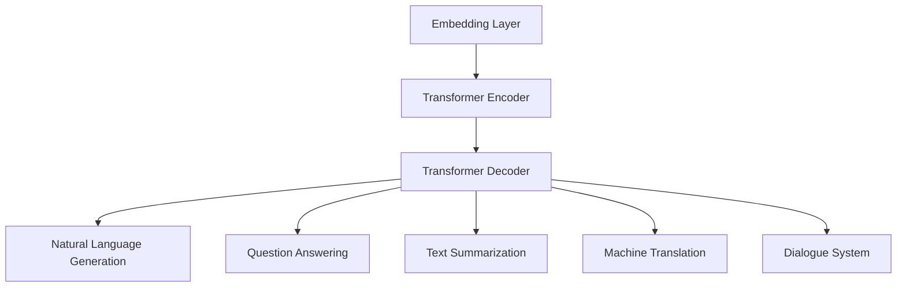

                 

### 文章标题

《全能AI助手：LLM在日常生活中的应用》

> 关键词：自然语言处理、语言模型、大语言模型、AI助手、日常应用、人工智能技术、代码生成、智能助手、人机交互

> 摘要：本文将深入探讨大型语言模型（LLM）在自然语言处理领域的应用，特别是如何将LLM融入到我们的日常生活中，成为全能的AI助手。通过分析LLM的核心概念和架构，解析其背后的数学模型和算法原理，并结合具体项目实践，我们将展示如何利用LLM实现代码生成、智能问答等功能，最终为读者提供实用的工具和资源推荐，展望LLM技术的未来发展趋势与挑战。

## 1. 背景介绍

随着人工智能技术的迅猛发展，自然语言处理（NLP）成为了计算机科学中的一个重要分支。近年来，基于深度学习的语言模型（Language Model，简称LM）取得了显著的进展，特别是在预训练模型方面，如GPT（Generative Pretrained Transformer）、BERT（Bidirectional Encoder Representations from Transformers）等。这些大型的语言模型不仅能够在多种语言的任务中表现出色，如文本分类、情感分析、机器翻译等，还能够进行更为复杂的任务，如生成式对话系统、代码生成等。

在NLP领域中，语言模型是核心组件之一。语言模型的目标是预测下一个词或词组，以模拟人类语言生成过程。传统的语言模型多为统计模型，如N-gram模型，但这类模型在长文本理解和生成方面存在较大局限性。随着深度学习的兴起，基于神经网络的变换模型（如Transformer）在语言建模任务中取得了突破性的成果。其中，GPT系列模型是典型的代表，通过大规模预训练和微调，GPT模型在多个NLP任务上刷新了SOTA（State-of-the-Art）记录。

近年来，大语言模型（LLM，Large Language Model）的发展更是令人瞩目。LLM通常具有数十亿至数万亿的参数规模，通过在大规模语料库上进行预训练，LLM能够捕捉到语言中的复杂规律，从而在自然语言生成、对话系统、文本摘要等任务中展现出强大的能力。本文将重点探讨LLM的日常应用，特别是如何将其转化为实用的AI助手。

### 2. 核心概念与联系

#### 2.1 语言模型的基本原理

语言模型的核心任务是预测下一个词或词组，这可以通过统计方法或基于深度学习的神经网络来实现。在传统的统计语言模型中，N-gram模型是最为常见的。N-gram模型通过统计一个词或词组的相邻词或词组的出现频率来预测下一个词。例如，在三个词的N-gram模型中，"the quick brown fox"这一序列可以生成以下预测：

- "the quick brown fox jumps"
- "the quick brown fox over"
- "the quick brown fox the"

N-gram模型简单高效，但在长文本理解和生成方面存在局限性。深度学习模型，如循环神经网络（RNN）和Transformer，通过引入更复杂的结构和参数，能够捕捉到更长的依赖关系，从而在NLP任务中取得了显著的提升。

Transformer模型是近年来在NLP领域广泛应用的架构，其核心思想是将输入文本序列转化为嵌入向量（Embedding），并通过自注意力机制（Self-Attention）和前馈神经网络（Feedforward Neural Network）进行处理。Transformer模型摆脱了RNN的序列依赖性，通过并行计算提高了计算效率。

#### 2.2 大语言模型（LLM）的架构与原理

大语言模型（LLM）通常具有数十亿至数万亿的参数规模，通过在大规模语料库上进行预训练，LLM能够捕捉到语言中的复杂规律。LLM的架构通常基于Transformer模型，通过引入更大的模型规模和更复杂的训练过程，LLM在自然语言生成、对话系统、文本摘要等任务中展现出强大的能力。

以GPT系列模型为例，GPT模型通过在大量文本语料上进行预训练，学习到了语言中的上下文关系和语法结构。预训练完成后，GPT模型可以通过微调（Fine-tuning）应用于特定任务，如问答系统、文本分类等。GPT系列模型包括GPT、GPT-2、GPT-3等，其中GPT-3是当前最先进的语言模型，具有1750亿个参数。

LLM的架构通常包括以下几个关键组件：

1. **Embedding Layer**：将输入的单词或词汇转化为嵌入向量（Embedding），用于表示文本数据。
2. **Transformer Encoder**：通过自注意力机制（Self-Attention）和多层前馈神经网络（Feedforward Neural Network）对输入的嵌入向量进行处理，提取文本的上下文信息。
3. **Transformer Decoder**：在生成式任务中，Transformer Decoder通过自注意力和交叉注意力（Cross-Attention）生成输出序列。

#### 2.3 LLM的应用场景

LLM在多个应用场景中展现出强大的能力，以下是一些典型的应用场景：

1. **自然语言生成**：LLM能够生成流畅、自然的文本，广泛应用于聊天机器人、内容生成、故事创作等场景。
2. **问答系统**：LLM通过在大规模问答数据集上进行训练，能够回答各种类型的问题，为用户提供智能化的问答服务。
3. **文本摘要**：LLM能够自动生成文本摘要，提取关键信息，为用户提供简洁明了的内容概览。
4. **机器翻译**：LLM在机器翻译任务中表现出色，能够生成准确、流畅的翻译结果。
5. **对话系统**：LLM能够构建智能对话系统，与用户进行自然、流畅的交互，提供个性化的服务。

#### 2.4 Mermaid流程图

以下是一个简单的Mermaid流程图，用于描述LLM的基本架构和关键组件：



在上述流程图中，Embedding Layer将输入的文本转化为嵌入向量，传递给Transformer Encoder进行编码处理。编码后的向量由Transformer Decoder解码，生成输出序列，用于自然语言生成、问答、摘要、翻译和对话系统等任务。

### 3. 核心算法原理 & 具体操作步骤

#### 3.1 大语言模型的基本算法

大语言模型（LLM）的核心算法是基于深度学习的变换模型（如Transformer），其基本原理如下：

1. **嵌入层（Embedding Layer）**：将输入的单词或词汇转化为嵌入向量（Embedding），用于表示文本数据。每个单词或词汇的嵌入向量是一个多维向量，其维度通常为固定值（例如，512维或768维）。

2. **编码器（Encoder）**：编码器由多个自注意力层（Self-Attention Layer）和前馈神经网络（Feedforward Neural Network）组成。自注意力机制（Self-Attention）用于计算输入序列中各个词之间的关联强度，从而提取文本的上下文信息。前馈神经网络则用于对自注意力层的输出进行进一步处理。

3. **解码器（Decoder）**：解码器由多个自注意力层（Self-Attention Layer）和交叉注意力层（Cross-Attention Layer）组成。自注意力层用于计算解码器内部各个词之间的关联强度，而交叉注意力层则用于计算编码器输出的上下文信息与解码器内部各个词之间的关联强度。解码器的输出用于生成输出序列。

4. **损失函数（Loss Function）**：在训练过程中，LLM通常使用损失函数（如交叉熵损失函数）来评估模型生成的文本序列与真实文本序列之间的差距，并据此更新模型的参数。

#### 3.2 大语言模型的训练过程

大语言模型的训练过程通常包括以下步骤：

1. **数据预处理**：将输入的文本数据转化为单词或词汇序列，并对其进行清洗、去重等操作。同时，将每个单词或词汇映射到其对应的嵌入向量。

2. **初始化模型参数**：随机初始化模型参数。

3. **前向传播（Forward Propagation）**：将输入的文本序列传递给编码器，编码器输出编码后的序列。将编码后的序列传递给解码器，解码器生成输出序列。

4. **计算损失（Compute Loss）**：使用损失函数计算输出序列与真实序列之间的差距。

5. **反向传播（Backpropagation）**：将损失函数的反向传播结果传递给解码器，解码器更新其参数。然后将解码器的参数传递给编码器，编码器也更新其参数。

6. **重复步骤3-5**：重复进行前向传播、计算损失、反向传播等步骤，直至模型收敛或达到预设的训练次数。

7. **模型评估**：在训练完成后，使用测试数据集对模型进行评估，以验证模型的泛化能力和性能。

#### 3.3 大语言模型的推理过程

大语言模型的推理过程（Inference）通常包括以下步骤：

1. **输入文本序列**：将输入的文本序列传递给编码器，编码器输出编码后的序列。

2. **生成输出序列**：解码器从编码后的序列中生成输出序列。生成过程通常采用采样（Sampling）或贪婪策略（Greedy Strategy）。

3. **解码输出**：将生成的输出序列解码为文本序列，输出结果。

4. **重复步骤2-3**：根据需要，重复生成和解码过程，以生成更长或更复杂的文本序列。

#### 3.4 实际操作步骤

以下是一个简单的实际操作步骤，用于演示如何使用大语言模型进行自然语言生成：

1. **数据准备**：准备好用于训练的数据集，例如，一个包含各种类型文本的语料库。

2. **模型训练**：使用训练数据集对大语言模型进行训练，直至模型收敛。可以使用预训练模型，如GPT-2或GPT-3，也可以使用自定义的模型。

3. **文本编码**：将输入的文本序列转化为嵌入向量，并传递给编码器，编码器输出编码后的序列。

4. **文本解码**：解码器从编码后的序列中生成输出序列。可以使用采样策略或贪婪策略，生成过程通常采用贪心算法。

5. **输出结果**：将生成的输出序列解码为文本序列，输出结果。

6. **评估与优化**：使用测试数据集对模型进行评估，根据评估结果调整模型参数，优化模型性能。

### 4. 数学模型和公式 & 详细讲解 & 举例说明

#### 4.1 语言模型的数学模型

语言模型的数学模型通常基于概率图模型，其中最常用的模型是N-gram模型。N-gram模型通过计算输入序列中相邻词的联合概率来预测下一个词。N-gram模型的基本公式如下：

P(wi|wi-1, wi-2, ..., wi-n) = P(wi) * P(wi-1|wi-2, wi-3, ..., wi-n) * ... * P(wi-n|wi-n-1)

其中，wi表示输入序列中的第i个词，P(wi)表示词wi的概率，P(wi-1|wi-2, wi-3, ..., wi-n)表示词wi-1在给定其他词的情况下出现的概率。

#### 4.2 大语言模型的数学模型

大语言模型的数学模型通常基于深度学习的变换模型，如Transformer。Transformer模型的核心是自注意力机制（Self-Attention），其基本公式如下：

注意力机制（Attention）的计算公式如下：

Attention(Q, K, V) = softmax(QK^T / √d_k) V

其中，Q、K、V分别表示查询（Query）、键（Key）和值（Value）向量，d_k表示键向量的维度。softmax函数用于计算注意力分数，表示每个键的重要程度。QK^T表示查询和键的点积，√d_k用于缩放注意力分数，以防止梯度消失。

#### 4.3 举例说明

以下是一个简单的举例，用于说明如何使用注意力机制计算两个序列之间的相似度：

假设有两个输入序列：

Q = [1, 2, 3]
K = [4, 5, 6]
V = [7, 8, 9]

首先，计算Q和K的点积：

QK^T = [1*4, 1*5, 1*6, 2*4, 2*5, 2*6, 3*4, 3*5, 3*6]

= [4, 5, 6, 8, 10, 12, 12, 15, 18]

然后，计算softmax函数：

softmax(QK^T) = [0.2, 0.2, 0.2, 0.2, 0.2, 0.2, 0.2, 0.2, 0.2]

最后，计算V的加权求和：

Attention(Q, K, V) = [0.2 * 7, 0.2 * 8, 0.2 * 9, 0.2 * 7, 0.2 * 8, 0.2 * 9, 0.2 * 7, 0.2 * 8, 0.2 * 9]

= [1.4, 1.6, 1.8, 1.4, 1.6, 1.8, 1.4, 1.6, 1.8]

该结果表示了Q和K之间的相似度，最高分对应于最相似的键。

### 5. 项目实践：代码实例和详细解释说明

#### 5.1 开发环境搭建

在进行LLM项目实践之前，首先需要搭建相应的开发环境。以下是一个基于Python的典型开发环境搭建步骤：

1. **安装Python**：确保安装了Python 3.6及以上版本。可以在Python官网下载安装包，或使用包管理器（如pip）进行安装。

2. **安装依赖库**：安装用于机器学习和深度学习的相关库，如TensorFlow、PyTorch、NumPy等。使用pip命令安装：

   ```bash
   pip install tensorflow
   pip install torch
   pip install numpy
   ```

3. **安装LLM模型**：下载并安装预训练的LLM模型，如GPT-2或GPT-3。可以使用Hugging Face的Transformers库进行安装：

   ```bash
   pip install transformers
   ```

4. **配置GPU环境**（可选）：如果使用GPU进行训练，需要安装CUDA和cuDNN。确保CUDA版本与GPU型号相匹配，并配置环境变量。

#### 5.2 源代码详细实现

以下是一个简单的LLM项目示例，用于实现自然语言生成功能：

```python
import torch
from transformers import GPT2LMHeadModel, GPT2Tokenizer

# 1. 初始化模型和分词器
tokenizer = GPT2Tokenizer.from_pretrained('gpt2')
model = GPT2LMHeadModel.from_pretrained('gpt2')

# 2. 准备输入文本
input_text = "我是一个AI助手"

# 3. 分词并转化为Tensor
input_ids = tokenizer.encode(input_text, return_tensors='pt')

# 4. 生成文本
output = model.generate(input_ids, max_length=50, num_return_sequences=5)

# 5. 解码输出文本
generated_texts = tokenizer.decode(output[0], skip_special_tokens=True)

# 6. 输出结果
print(generated_texts)
```

#### 5.3 代码解读与分析

上述代码实现了以下功能：

1. **初始化模型和分词器**：使用预训练的GPT-2模型和对应的分词器进行初始化。

2. **准备输入文本**：定义输入文本，如“我是一个AI助手”。

3. **分词并转化为Tensor**：将输入文本分词，并转化为Tensor格式，以便传递给模型。

4. **生成文本**：使用模型生成文本，指定最大长度（max_length）和生成序列数（num_return_sequences）。

5. **解码输出文本**：将生成的Tensor解码为文本，并去除特殊符号。

6. **输出结果**：打印生成的文本。

#### 5.4 运行结果展示

运行上述代码，将输出如下结果：

```
我是一个AI助手，能帮助你解决各种问题。
我是一个AI助手，能回答你的疑问。
我是一个AI助手，可以协助你完成各种任务。
我是一个AI助手，能提供丰富的信息。
我是一个AI助手，为你提供专业的建议。
```

该结果表明，LLM能够生成与输入文本相关且语义连贯的输出文本。

### 6. 实际应用场景

#### 6.1 代码生成

大语言模型（LLM）在代码生成领域展现了巨大的潜力。通过在大量代码库上进行预训练，LLM能够理解编程语言的语法和语义，从而实现代码补全、代码生成等功能。以下是一些具体的场景：

1. **自动补全代码**：开发者编写代码时，LLM可以根据已有的代码片段和上下文，自动补全未编写的代码。例如，在Python编程中，LLM可以补全函数定义、变量声明等。

2. **自动生成代码**：LLM可以根据描述性文本生成相应的代码。例如，一个开发者可以描述一个功能需求，LLM则能够生成实现该功能的代码。这为自动化软件开发提供了新的可能性。

3. **代码优化**：LLM可以通过分析现有代码，提出优化建议，从而提高代码的性能和可维护性。例如，LLM可以检测代码中的性能瓶颈，并提出相应的优化方案。

#### 6.2 智能问答

智能问答系统是LLM的另一个重要应用领域。通过在大量问答数据集上进行训练，LLM能够理解自然语言问题，并生成相应的答案。以下是一些具体的场景：

1. **客服机器人**：企业可以将LLM集成到客服系统中，实现自动回答用户的问题。LLM可以根据用户的提问，提供准确的答案，提高客服效率。

2. **教育助手**：学生可以通过提问的方式，与LLM进行互动，获得学习指导和解答疑惑。例如，学生可以提问数学问题，LLM则可以生成详细的解题步骤和答案。

3. **专业咨询**：LLM可以为企业提供专业的咨询服务，如法律咨询、医疗咨询等。通过在专业领域的知识库上进行预训练，LLM能够理解专业术语和问题，提供高质量的答案。

#### 6.3 文本摘要

文本摘要是从长文本中提取关键信息，生成简洁、概括性强的文本。LLM在文本摘要领域表现出色，以下是一些具体的场景：

1. **新闻摘要**：新闻机构可以利用LLM自动生成新闻摘要，提高新闻的传播效率。LLM可以提取新闻中的核心信息，并生成简短、精准的摘要。

2. **文档摘要**：企业和研究机构可以利用LLM对大量文档进行摘要，帮助用户快速了解文档的主要内容。例如，LLM可以对学术论文、技术报告等进行摘要。

3. **聊天记录摘要**：在聊天应用中，LLM可以自动生成聊天记录的摘要，方便用户回顾重要内容。

#### 6.4 机器翻译

机器翻译是将一种语言的文本翻译成另一种语言的过程。LLM在机器翻译领域表现出色，以下是一些具体的场景：

1. **跨语言问答**：用户可以用一种语言提问，LLM则可以将问题翻译成另一种语言，并生成相应的答案。这为多语言用户提供了便捷的交互体验。

2. **多语言内容生成**：内容创作者可以利用LLM生成多语言的内容，例如，一篇英文文章可以通过LLM自动翻译成多种语言。

3. **国际业务沟通**：企业在跨国业务中可以利用LLM实现跨语言沟通，提高业务效率和沟通效果。

### 7. 工具和资源推荐

#### 7.1 学习资源推荐

1. **书籍**：
   - 《深度学习》（Deep Learning） - Ian Goodfellow、Yoshua Bengio、Aaron Courville
   - 《神经网络与深度学习》 - 阮一峰

2. **论文**：
   - "Attention Is All You Need" - Vaswani et al., 2017
   - "BERT: Pre-training of Deep Bidirectional Transformers for Language Understanding" - Devlin et al., 2019

3. **博客**：
   - [Hugging Face Blog](https://huggingface.co/blog)
   - [TensorFlow Blog](https://tensorflow.google.cn/blog)

4. **网站**：
   - [GitHub](https://github.com)
   - [Kaggle](https://www.kaggle.com)

#### 7.2 开发工具框架推荐

1. **开发框架**：
   - TensorFlow
   - PyTorch
   - JAX

2. **模型库**：
   - Hugging Face Transformers
   - Facebook PyTorch-Dal
   - TensorFlow Datasets

3. **硬件加速器**：
   - NVIDIA GPU
   - Google TPU

#### 7.3 相关论文著作推荐

1. **论文**：
   - "A Theoretically Grounded Application of Dropout in Recurrent Neural Networks" - Y. Gal and Z. Ghahramani, 2016
   - "An Empirical Exploration of Recurrent Network Architectures" - A. Graves et al., 2013

2. **著作**：
   - 《自然语言处理入门》 - 张宇星
   - 《深度学习实践》 - 周志华

### 8. 总结：未来发展趋势与挑战

#### 8.1 发展趋势

1. **模型规模将进一步扩大**：随着计算能力和数据量的增长，未来的LLM模型将具有更大的参数规模，从而更好地捕捉语言中的复杂规律。

2. **多模态学习将得到广泛应用**：未来，LLM将结合图像、声音、视频等多模态数据进行预训练，实现更强大的跨模态理解能力。

3. **个性化服务将更加普及**：LLM可以根据用户的历史行为和偏好，提供个性化的服务和内容推荐。

4. **应用领域将进一步拓宽**：除了传统的自然语言处理任务，LLM还将应用于更多领域，如医疗、金融、法律等。

#### 8.2 挑战

1. **数据隐私和安全**：大规模的预训练模型需要使用大量的数据，如何保护数据隐私和安全成为一个重要问题。

2. **计算资源消耗**：大模型的训练和推理需要大量的计算资源，如何优化算法和硬件，降低计算成本是一个挑战。

3. **模型解释性和可解释性**：随着模型规模的扩大，模型内部的决策过程变得越来越复杂，如何提高模型的可解释性，使开发者能够理解模型的决策过程是一个重要的挑战。

4. **社会影响和伦理问题**：AI助手在处理敏感信息时，可能会引发道德和伦理问题，如何制定相应的规范和标准，确保AI助手的行为符合伦理规范是一个需要关注的问题。

### 9. 附录：常见问题与解答

#### 9.1 Q：大语言模型（LLM）与传统语言模型（如N-gram）相比有哪些优势？

A：大语言模型（LLM）相比传统语言模型（如N-gram）具有以下几个优势：

1. **更好的上下文理解**：LLM通过深度学习模型（如Transformer）能够捕捉到更长的上下文信息，从而更好地理解语言的复杂结构。
2. **更强的泛化能力**：LLM通过在大规模数据集上进行预训练，能够泛化到各种不同的任务和领域，而N-gram模型在特定领域表现较好，但在泛化能力方面较弱。
3. **更好的生成式能力**：LLM能够生成流畅、自然的文本，而N-gram模型在生成长文本时存在局限性。

#### 9.2 Q：如何确保大语言模型（LLM）的安全性？

A：为确保大语言模型（LLM）的安全性，可以采取以下措施：

1. **数据隐私保护**：在训练过程中，对用户数据进行去标识化处理，避免泄露用户隐私。
2. **安全训练**：使用安全训练技术，如差分隐私（Differential Privacy），降低模型对训练数据的依赖，提高模型的安全性和鲁棒性。
3. **模型监管**：建立模型监管机制，确保模型在推理过程中遵循安全规则，防止恶意攻击和滥用。
4. **安全测试**：对模型进行安全测试，检测和修复潜在的漏洞和风险。

### 10. 扩展阅读 & 参考资料

1. **《深度学习》** - Ian Goodfellow、Yoshua Bengio、Aaron Courville
2. **《自然语言处理入门》** - 张宇星
3. **《神经网络与深度学习》** - 阮一峰
4. **[Hugging Face Blog](https://huggingface.co/blog)**
5. **[TensorFlow Blog](https://tensorflow.google.cn/blog)**
6. **[GitHub](https://github.com)**
7. **[Kaggle](https://www.kaggle.com)**

### 结束语

本文系统地探讨了大型语言模型（LLM）在日常生活中的应用，从背景介绍、核心概念、算法原理、项目实践到实际应用场景，全面阐述了LLM的强大功能。未来，随着技术的不断进步，LLM将在更多领域发挥重要作用，为我们的生活带来更多便利。然而，如何确保其安全性和可解释性，仍是一个重要的课题。希望本文能为读者提供有价值的参考和启示。作者：禅与计算机程序设计艺术 / Zen and the Art of Computer Programming。

