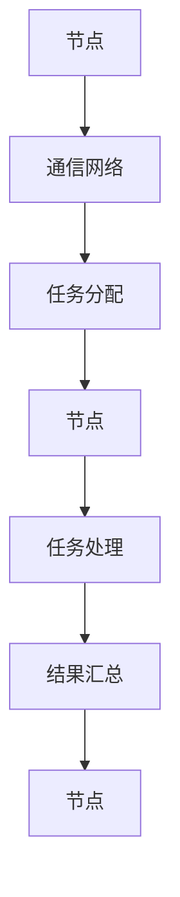

                 

### 背景介绍 ###

#### 分布式系统的起源与发展历程 ####

分布式系统（Distributed System）的概念最早可以追溯到20世纪60年代。当时，计算机技术和网络技术刚刚起步，科研机构和大型企业开始探索如何将多台计算机互联，以实现资源共享和协同工作。1964年，阿帕网（ARPANET）的建立标志着分布式计算的开端，它为现代分布式系统的发展奠定了基础。

随着计算机性能的提升和网络技术的进步，分布式系统逐渐从理论研究走向实际应用。20世纪80年代，分布式数据库系统和分布式文件系统的出现，进一步推动了分布式系统的发展。进入21世纪，互联网的普及和云计算的兴起，使得分布式系统在工业界和学术界都得到了广泛关注。分布式计算逐渐成为计算机科学和工程领域的一个重要研究方向。

#### 分布式系统在现代IT行业的重要性 ####

分布式系统在现代IT行业中扮演着至关重要的角色。首先，分布式系统提供了强大的计算能力和资源利用效率。通过将任务分解并分配到多台计算机上，分布式系统能够处理大规模的数据和复杂的计算任务，从而提高系统的性能和响应速度。

其次，分布式系统提高了系统的可靠性和可用性。在分布式系统中，即使个别节点发生故障，其他节点仍然可以继续工作，确保系统的正常运行。这种容错能力使得分布式系统能够在面对硬件故障、网络中断等意外情况时，保持高可用性。

此外，分布式系统还支持灵活的扩展性。通过添加更多的节点，分布式系统可以轻松地扩展其处理能力和存储容量。这种扩展性使得分布式系统能够适应不断变化的需求，满足企业和组织的发展需求。

综上所述，分布式系统在现代IT行业中具有重要的地位和作用。它不仅提高了系统的性能和可靠性，还提供了灵活的扩展性，成为现代IT基础设施的重要组成部分。

#### 分布式系统设计中的常见挑战 ####

分布式系统设计虽然带来了诸多优势，但也面临一些挑战。首先，数据一致性问题是一个关键挑战。在分布式系统中，多台计算机需要协同工作，更新和维护数据的一致性。然而，网络延迟、分区故障和并发操作等因素可能导致数据不一致。

其次，分布式系统的容错性设计也是一大挑战。为了保证系统的可靠性，需要设计有效的容错机制，例如副本机制、故障检测和恢复策略等。然而，实现这些机制需要考虑到系统性能、存储资源和网络带宽等因素。

另外，分布式系统的可扩展性设计也是一个难题。在系统中添加更多节点时，如何确保系统仍然能够高效地工作，同时避免单点故障和性能瓶颈，是一个需要仔细考虑的问题。

最后，分布式系统的安全性也是一个不可忽视的挑战。分布式系统通常涉及多个组织之间的数据共享和协作，如何确保数据的安全性、防止恶意攻击和数据泄露，是分布式系统设计中的一个重要问题。

总之，尽管分布式系统设计带来了许多机遇，但同时也面临一系列挑战。如何有效地解决这些挑战，是分布式系统设计中的一个重要课题。

#### 分布式系统设计的总体目标 ####

分布式系统设计的总体目标主要包括提高性能、保证可靠性和提供可扩展性。首先，性能是分布式系统的核心目标之一。通过将任务分配到多台计算机上，分布式系统可以充分利用并行计算的优势，从而提高处理速度和响应时间。

其次，可靠性是分布式系统的关键特性。为了确保系统在面对故障和异常情况时能够正常运行，分布式系统设计需要考虑容错性和故障恢复机制。通过冗余和分布式算法，分布式系统可以在部分节点失效的情况下保持整体系统的可用性。

最后，可扩展性是分布式系统设计的重要目标。随着业务规模的增长，分布式系统需要能够灵活地扩展其处理能力和存储容量。通过分布式架构，系统能够在不影响性能的情况下，动态地添加或移除节点，以满足不断变化的需求。

总之，分布式系统设计的总体目标是通过性能、可靠性和可扩展性的优化，构建一个高效、稳定和灵活的分布式计算环境，以满足现代IT行业的多样化需求。

#### 分布式系统与集中式系统的比较 ####

分布式系统与集中式系统在架构和特点上存在显著差异。集中式系统通常由一个中心服务器或单一计算节点组成，所有计算和数据处理都集中在这个中心节点上。这种架构具有简单性和易于管理的优势，但存在单点故障和高依赖性的问题。一旦中心节点发生故障，整个系统将无法正常运行。

相比之下，分布式系统由多个节点组成，这些节点通过网络互联，共同完成计算和数据处理的任务。分布式系统的优点包括高可用性、高可靠性和良好的扩展性。通过将任务分配到多个节点上，分布式系统可以更好地利用资源，提高处理能力和响应速度。此外，分布式系统具有容错能力，即使个别节点发生故障，其他节点仍然可以继续工作，确保系统的稳定性和可用性。

然而，分布式系统也面临一些挑战，如数据一致性和分布式同步问题。分布式系统的复杂性较高，需要更多的设计和维护工作。此外，分布式系统的网络通信开销较大，可能影响系统的整体性能。

总的来说，分布式系统与集中式系统各有优缺点。选择合适的系统架构，需要根据具体的应用场景和需求进行权衡。

### 核心概念与联系 ###

#### 分布式系统的基本概念与结构 ####

分布式系统是由多个节点（Node）通过通信网络互联而成的计算系统。每个节点可以是一个独立的计算机或服务器，它们共同工作，协同完成复杂的任务。分布式系统的核心概念包括节点、通信网络和任务分配。

**节点（Node）：** 节点是分布式系统中的基本计算单元，负责执行任务和存储数据。节点可以是物理计算机或虚拟机，它们通过IP地址或域名进行标识。节点之间的通信通常使用TCP/IP协议进行数据传输。

**通信网络（Communication Network）：** 通信网络是节点之间进行数据交换和协作的通道。它可以是局域网（LAN）、广域网（WAN）或互联网。通信网络的质量直接影响系统的性能和可靠性。

**任务分配（Task Allocation）：** 在分布式系统中，任务分配是指将计算任务分配给不同的节点。任务分配的目标是优化资源利用，提高系统性能和负载均衡。常见的任务分配策略包括负载均衡、任务调度和分布式计算框架。

#### 核心概念之间的联系与相互作用 ####

分布式系统的核心概念之间紧密相连，相互作用，共同决定了系统的性能和可靠性。

**节点与通信网络：** 节点是分布式系统的基础，它们通过通信网络进行数据交换和协同工作。通信网络的性能直接影响节点之间的通信效率和系统的整体性能。节点需要具备良好的网络连接性和可靠性，以确保数据传输的准确性和实时性。

**任务分配与节点：** 任务分配是根据节点的计算能力和负载情况，将任务分配给不同的节点。节点之间的任务分配需要考虑负载均衡、资源利用率和任务调度策略。良好的任务分配策略可以优化资源利用，提高系统的性能和响应速度。

**节点与通信网络与任务分配：** 节点、通信网络和任务分配共同作用，决定了分布式系统的性能和可靠性。节点需要具备高效的计算能力和良好的网络连接性，通信网络需要提供稳定和高速的数据传输通道，任务分配需要根据节点的实际情况进行优化。

#### 分布式系统与并行系统、集群系统的比较 ####

**分布式系统与并行系统：** 并行系统是指多个处理器或计算机同时执行多个任务，而分布式系统则是通过多个节点协同工作来完成一个任务。并行系统通常在单台计算机内部进行任务分配和并行处理，而分布式系统则在多台计算机之间进行任务分配和协同工作。分布式系统具有更好的可扩展性和容错性，但并行系统通常具有更高的计算速度。

**分布式系统与集群系统：** 集群系统是指将多台计算机组成一个整体，共同完成计算任务。集群系统和分布式系统在架构上相似，但集群系统通常采用单一操作系统和文件系统，而分布式系统则采用多个操作系统和文件系统。分布式系统具有更高的灵活性和扩展性，但集群系统通常具有更好的性能和可靠性。

总的来说，分布式系统、并行系统和集群系统各有特点，适用于不同的应用场景。根据具体需求，选择合适的系统架构，是分布式系统设计中的重要课题。

#### 分布式系统的核心概念流程图 ####

为了更直观地展示分布式系统的核心概念和它们之间的相互作用，我们可以使用Mermaid流程图来描述。以下是一个简单的分布式系统流程图：



在这个流程图中，节点（A）通过通信网络（B）进行数据交换和任务分配（C），然后节点（D）执行任务处理（E），并将结果汇总（F），最终返回给节点（G）。这个流程图展示了分布式系统中的核心概念和它们之间的相互作用。

### 核心算法原理 & 具体操作步骤 ###

#### 一致性算法（Consistency Algorithms）####

一致性算法是分布式系统中确保数据一致性的关键技术。在分布式系统中，多个节点需要协同工作，维护同一份数据的一致性。一致性算法通过特定的协议和策略，保证多个节点上的数据在发生更新时保持一致。

**1. 强一致性（Strong Consistency）：** 强一致性要求系统在任意时刻都能提供一致的视图，即所有节点在同一时间看到的都是同一份数据。强一致性保证了数据的高度一致性，但可能会影响系统的性能和可用性。常见的强一致性算法包括Paxos算法和Raft算法。

**2. 最终一致性（ eventual Consistency）：** 最终一致性允许系统在一段时间内看到不一致的数据，但最终会达到一致状态。最终一致性算法通常采用事件溯源（Event Sourcing）或最终一致性保证协议（如Gossip协议）来实现。这种算法具有更好的性能和可用性，但可能会牺牲一部分数据一致性。

**3. 部分一致性（Partial Consistency）：** 部分一致性是指系统在特定条件下允许部分节点看到不一致的数据。这种算法适用于对一致性要求较低的分布式系统，如一些非关键业务场景。常见的部分一致性算法包括反事实日志（Counterfactual Logging）和锁机制（Locking）。

**具体操作步骤：**

**强一致性算法实现步骤：**
1. 选择主节点（Leader Node）：系统初始化时，通过Paxos或Raft算法选举出一个主节点。
2. 数据更新：所有数据更新请求发送到主节点进行处理。
3. 主节点更新数据：主节点接收到更新请求后，更新本地数据。
4. 同步副本：主节点将更新结果同步到其他副本节点。
5. 副本节点更新：副本节点接收到同步数据后，更新本地数据。

**最终一致性算法实现步骤：**
1. 事件溯源：系统将所有操作记录为事件，存储在事件日志中。
2. 数据更新：每个节点根据事件日志顺序更新本地数据。
3. 最终一致性保证：系统通过 gossip 协议或其他一致性算法，确保节点间的事件顺序一致。

#### 负载均衡算法（Load Balancing Algorithms）####

负载均衡算法是分布式系统中优化资源利用和性能的重要技术。负载均衡算法通过将请求分配到不同的节点，避免单个节点过载，从而提高系统的整体性能和可用性。

**1. 轮询负载均衡（Round-Robin）：** 轮询负载均衡是最简单的负载均衡算法，它按照顺序将请求分配到每个节点。每个节点处理完请求后，下一个请求分配给下一个节点。轮询负载均衡简单易实现，但可能导致部分节点过载。

**2. 最少连接负载均衡（Least Connections）：** 最少连接负载均衡根据当前连接数将请求分配到连接数最少的节点。这种算法可以更好地平衡节点的负载，但需要维护每个节点的连接状态。

**3. 加权负载均衡（Weighted Load Balancing）：** 加权负载均衡根据节点的计算能力和带宽等属性，为每个节点分配不同的权重。请求分配时，根据节点的权重比例进行分配。这种算法可以更灵活地平衡负载，但需要考虑节点的实际能力。

**具体操作步骤：**

**轮询负载均衡实现步骤：**
1. 初始化：创建一个循环列表，包含所有参与负载均衡的节点。
2. 接收请求：接收到请求后，根据循环列表的顺序，将请求分配给下一个节点。
3. 节点处理请求：节点处理请求，并将响应返回给客户端。
4. 更新循环列表：节点处理完请求后，将循环列表指针移动到下一个节点。

**最少连接负载均衡实现步骤：**
1. 初始化：为每个节点维护一个连接数计数器。
2. 接收请求：接收到请求后，遍历所有节点，选择连接数最少的节点。
3. 节点处理请求：节点处理请求，并将响应返回给客户端。
4. 更新连接数：节点处理完请求后，更新连接数计数器。

**加权负载均衡实现步骤：**
1. 初始化：为每个节点分配一个权重。
2. 接收请求：接收到请求后，根据节点的权重比例，计算每个节点的权重分数。
3. 选择节点：选择权重分数最高的节点。
4. 节点处理请求：节点处理请求，并将响应返回给客户端。

#### 分布式锁算法（Distributed Lock Algorithms）####

分布式锁算法是分布式系统中实现并发控制和同步的重要技术。分布式锁用于确保多个节点在执行特定操作时不会相互冲突，保证数据的正确性和一致性。

**1. 乐观锁（Optimistic Locking）：** 乐观锁假设在大多数情况下，多个节点不会同时修改同一份数据。在执行操作前，系统会检查数据版本号，如果版本号与预期一致，则执行更新操作。乐观锁适用于读多写少的场景，但可能导致冲突和性能问题。

**2. 悲观锁（Pessimistic Locking）：** 悲观锁假设在大多数情况下，多个节点会同时修改同一份数据。在执行操作前，系统会先尝试获取锁，如果锁已被占用，则等待或重试。悲观锁适用于写多读少的场景，但可能会影响系统的可用性。

**3. 悖论解决锁（Conflict Resolution Lock）：** 悖论解决锁是一种结合乐观锁和悲观锁的分布式锁算法，它通过判断冲突发生的概率，选择合适的锁策略。这种算法在保证数据一致性的同时，提高了系统的性能和可用性。

**具体操作步骤：**

**乐观锁实现步骤：**
1. 数据版本号初始化：为数据设置一个版本号。
2. 检查版本号：在执行更新操作前，检查数据的版本号。
3. 执行更新：如果版本号与预期一致，则执行更新操作。
4. 更新版本号：更新数据版本号，确保后续操作使用新的版本号。

**悲观锁实现步骤：**
1. 获取锁：在执行操作前，尝试获取分布式锁。
2. 执行操作：如果锁已被占用，则等待或重试。
3. 释放锁：操作完成后，释放分布式锁。

**悖论解决锁实现步骤：**
1. 判断冲突概率：根据历史操作记录，判断冲突发生的概率。
2. 选择锁策略：如果冲突概率低，使用乐观锁；否则，使用悲观锁。
3. 执行操作：根据锁策略，执行相应的操作。

### 数学模型和公式 & 详细讲解 & 举例说明 ###

#### 分布式一致性算法：Paxos协议

Paxos协议是分布式一致性算法的基石，用于确保分布式系统中多个节点对某个值达成一致。Paxos协议的核心思想是通过一个称为“提案者”（Proposer）、“接受者”（Acceptor）和“学习者”（Learner）的角色，实现对系统中多个副本数据的一致性维护。

**1. Paxos协议中的基本角色和概念：**
- **提案者（Proposer）：** 负责提出提案并试图达成一致。
- **接受者（Acceptor）：** 负责接受提案，并记录已接受的提案值。
- **学习者（Learner）：** 负责学习已达成一致的结果，并更新本地状态。

**2. Paxos协议的基本流程：**
- **初始化：** 提案者向接受者发送初始化请求，接受者响应后，选举出一个提案号作为当前值。
- **提出提案：** 提案者向接受者发送提案请求，提案包含提案号和提议的值。
- **接受提案：** 接受者收到提案请求后，如果提案号大于已接受的提案号，则接受该提案并返回承诺。
- **学习结果：** 提案者收到接受者的承诺后，向学习者发送学习请求，学习者更新状态并记录结果。

**3. Paxos协议的数学模型和公式：**
- **选择规则（Quorum）：** Paxos协议通过选择规则确保大多数接受者（超过半数）接受同一提案。选择规则可以用以下公式表示：
  $$ \text{Quorum} = \frac{n}{2} + 1 $$
  其中，\( n \) 是系统中的节点总数。这意味着至少需要超过半数的节点接受提案，才能达成一致。

- **提案号（Proposal Number）：** Paxos协议使用提案号来标识提案。每个提案都有一个唯一的提案号，提案者必须递增提案号以避免冲突。

- **状态机（State Machine）：** Paxos协议通过状态机来维护系统的状态。每个节点都有一个状态机，当节点接受一个提案时，它会执行提案中的操作，并将状态更新为提案值。

**4. Paxos协议的详细讲解和举例说明：**
假设有5个节点（A、B、C、D、E）的分布式系统，其中至少3个节点需要达成一致。

**例子：提案值为“增加10元”**
1. **初始化：**
   提案者A发送初始化请求，所有接受者（B、C、D、E）响应，并选举出提案号1作为当前值。

2. **提出提案：**
   提案者A发送提案请求（提案号2，提议值为“增加10元”），接受者B、C、D响应，并承诺接受提案。

3. **接受提案：**
   提案者A收到三个接受者的承诺后，发送学习请求给所有学习者（B、C、D、E），学习者更新状态为“增加10元”。

4. **达成一致：**
   提案者A成功达成一致，系统状态更新为“增加10元”。

**5. Paxos协议的优点和缺点：**
- **优点：**
  - 高可用性：即使部分节点故障，系统仍然可以运行。
  - 强一致性：Paxos协议确保系统在多个节点间达成一致。
  - 可扩展性：Paxos协议可以方便地扩展到更多节点。

- **缺点：**
  - 复杂性：Paxos协议实现较为复杂，需要精心设计和调试。
  - 性能：Paxos协议可能导致较多的网络通信和延迟，影响性能。

总之，Paxos协议是分布式一致性算法的重要实现，通过数学模型和公式的严谨分析，它为分布式系统提供了可靠的一致性保障。

### 项目实践：代码实例和详细解释说明

#### 开发环境搭建

在开始分布式系统项目实践之前，我们需要搭建一个适合开发的运行环境。以下是在Windows操作系统上搭建开发环境的具体步骤：

1. **安装Java开发工具包（JDK）：** 访问Oracle官方网站下载适用于Windows的JDK安装包，并按照提示完成安装。

2. **配置Java环境变量：** 在系统环境变量中配置JAVA_HOME和PATH变量，以便在命令行中运行Java命令。

3. **安装Maven：** Maven是一个常用的项目管理和构建工具，用于管理和构建Java项目。从Maven官方网站下载安装包，并按照提示完成安装。

4. **配置Maven环境变量：** 在系统环境变量中配置MAVEN_HOME和PATH变量，以便在命令行中运行Maven命令。

5. **安装Git：** Git是一个版本控制系统，用于管理项目源代码。从Git官方网站下载安装包，并按照提示完成安装。

6. **配置Git环境变量：** 在系统环境变量中配置GIT_HOME和PATH变量，以便在命令行中运行Git命令。

7. **安装MySQL数据库：** MySQL是一个常用的关系型数据库，用于存储分布式系统中的数据。从MySQL官方网站下载适用于Windows的安装包，并按照提示完成安装。

8. **配置MySQL：** 在MySQL安装完成后，使用root账户登录MySQL数据库，创建一个新的数据库和用户，并授予相应的权限。

#### 源代码详细实现

下面将给出一个简单的分布式日志记录系统的源代码实现，包括服务器端和客户端的代码。为了简洁起见，以下代码示例将采用Java语言编写。

**服务器端（Server）:**

```java
import java.io.*;
import java.net.*;

public class LogServer {
    private ServerSocket serverSocket;
    
    public LogServer(int port) throws IOException {
        serverSocket = new ServerSocket(port);
    }
    
    public void startServer() {
        try {
            while (true) {
                Socket clientSocket = serverSocket.accept();
                new LogHandler(clientSocket).start();
            }
        } catch (IOException e) {
            e.printStackTrace();
        }
    }
    
    private class LogHandler extends Thread {
        private Socket clientSocket;
        
        public LogHandler(Socket socket) {
            this.clientSocket = socket;
        }
        
        public void run() {
            try {
                BufferedReader in = new BufferedReader(new InputStreamReader(clientSocket.getInputStream()));
                PrintWriter out = new PrintWriter(clientSocket.getOutputStream(), true);
                
                String inputLine;
                while ((inputLine = in.readLine()) != null && !inputLine.equals("")) {
                    System.out.println("Received: " + inputLine);
                    out.println("Received: " + inputLine);
                }
                
                in.close();
                out.close();
                clientSocket.close();
            } catch (IOException e) {
                e.printStackTrace();
            }
        }
    }
    
    public static void main(String[] args) {
        try {
            LogServer server = new LogServer(8080);
            server.startServer();
        } catch (IOException e) {
            e.printStackTrace();
        }
    }
}
```

**客户端（Client）:**

```java
import java.io.*;
import java.net.*;

public class LogClient {
    public static void main(String[] args) {
        try {
            Socket socket = new Socket("localhost", 8080);
            PrintWriter out = new PrintWriter(socket.getOutputStream(), true);
            BufferedReader in = new BufferedReader(new InputStreamReader(socket.getInputStream()));
            
            out.println("Hello, Server!");
            String response = in.readLine();
            System.out.println("Server response: " + response);
            
            out.close();
            in.close();
            socket.close();
        } catch (IOException e) {
            e.printStackTrace();
        }
    }
}
```

#### 代码解读与分析

**服务器端代码解读：**

服务器端代码使用Java的Socket编程实现一个简单的日志记录服务器。服务器在指定的端口上监听客户端的连接请求，并为每个连接创建一个处理线程（`LogHandler`）。

`LogServer` 类中，`startServer` 方法启动服务器，并进入一个循环，等待客户端的连接请求。当接收到客户端请求时，创建一个新的 `LogHandler` 线程来处理连接。

`LogHandler` 类继承自 `Thread` 类，用于处理客户端的请求。在 `run` 方法中，创建输入输出流，读取客户端发送的消息，并打印到控制台。同时，将接收到的消息回送给客户端。

**客户端代码解读：**

客户端代码通过Socket连接到服务器，并使用输入输出流发送消息和接收响应。在 `main` 方法中，创建Socket连接，并使用 `PrintWriter` 发送消息给服务器。接收服务器响应后，打印到控制台。

#### 运行结果展示

**服务器端运行结果：**

```shell
C:\Users\example>java LogServer
```

服务器端运行后，在控制台显示如下输出：

```shell
C:\Users\example>java LogServer
Starting server on port 8080...
```

**客户端运行结果：**

```shell
C:\Users\example>java LogClient
Server response: Received: Hello, Server!
```

客户端成功连接到服务器，并接收到了服务器的响应。

#### 项目实践总结

通过以上代码实例，我们实现了简单的分布式日志记录系统。服务器端和客户端通过Socket连接进行通信，展示了分布式系统的基本架构和通信原理。在实际项目中，可以进一步扩展系统的功能，例如增加日志存储、处理和查询等操作，以实现更复杂的分布式应用。

### 实际应用场景

分布式系统在许多实际应用场景中发挥着重要作用。以下是几个典型的应用场景：

#### 电子商务平台

电子商务平台通常需要处理海量交易数据，并保证系统的高性能和高可用性。分布式系统通过将任务分解到多个节点上，实现了数据的并行处理和负载均衡。例如，Amazon和阿里巴巴等大型电商平台采用分布式系统架构，以支持其庞大的用户群体和交易量。

#### 大数据应用

大数据应用需要处理和分析海量数据，分布式系统提供了高效的数据存储和处理能力。Hadoop和Spark等大数据框架都是基于分布式系统架构，能够将数据分布在多个节点上进行计算，从而提高数据处理速度和效率。

#### 云计算服务

云计算服务通过分布式系统提供计算、存储和网络资源，以按需分配和动态扩展的方式满足用户需求。分布式系统使云计算平台能够高效地管理大量虚拟机和容器，并提供弹性的计算资源。

#### 金融交易系统

金融交易系统需要保证交易数据的一致性和可靠性，分布式系统通过冗余和容错机制确保系统的高可用性和数据完整性。例如，许多银行和金融机构使用分布式数据库系统，以支持高并发交易处理和实时数据查询。

#### 社交媒体平台

社交媒体平台需要处理海量用户数据和实时消息传输，分布式系统通过负载均衡和分布式存储技术，实现了高并发和可扩展性。例如，Facebook和Twitter等平台采用分布式系统架构，以支持全球范围内的用户交互和消息传输。

总之，分布式系统在电子商务、大数据、云计算、金融交易和社交媒体等领域都有广泛应用。通过分布式系统，企业能够实现高效的数据处理、负载均衡和容错性，从而提高系统的性能和可靠性。

### 工具和资源推荐

#### 学习资源推荐

**书籍：**
1. 《分布式系统：概念与设计》（Distributed Systems: Concepts and Design） - George Coulouris, Jean Dollimore, Tim Kindberg, Gordon Blair
2. 《大规模分布式存储系统：原理解析与架构实战》 - 李京春，宋宝华
3. 《分布式系统设计原理》 - 周志明

**论文：**
1. "The Google File System" - Sanjay Ghemawat, Shun-Tak Leung, David G. Kneser, Benagdesh Rajan
2. "The Chubby lock service: reliable, scalable, and performant lock management for distributed systems" - John C. O'Leary, David G. Kneser, David A. Wallach
3. "Bigtable: A Distributed Storage System for Structured Data" - Sanjay Ghemawat, Howard G.chin, Shun-Tak Leung, Ashish Goel, Weiling Wang, Sean Burks, Frank Dabek, Christopher DeSalvo, Jean-Luc Godey, He Zhu, Tim Shen, Shinyi Wei

**博客：**
1. [康威定律](https://www.cnblogs.com/skywang12345/p/3605109.html)
2. [分布式算法](https://www.distributedgorithm.com/)
3. [分布式系统](https://www.distributed-systems-book.com/)

**网站：**
1. [Apache ZooKeeper](https://zookeeper.apache.org/)
2. [Apache Kafka](https://kafka.apache.org/)
3. [Apache Hadoop](https://hadoop.apache.org/)

#### 开发工具框架推荐

**开发框架：**
1. **Spring Cloud：** 一个基于Spring Boot的开源微服务架构框架，提供负载均衡、配置管理、服务发现、断路器等功能。
2. **Dubbo：** 阿里巴巴开源的高性能RPC框架，用于构建分布式服务架构，支持服务注册、发现、负载均衡和容错机制。
3. **Netflix OSS：** Netflix开源的一系列分布式系统工具，包括Eureka、Hystrix、Zuul、Ribbon等，用于构建高可用、高性能的分布式系统。

**分布式数据库：**
1. **MongoDB：** 一个高性能、可扩展的文档型数据库，适用于大规模数据的存储和查询。
2. **Cassandra：** 一个分布式键值存储系统，提供高可用性和高性能的NoSQL数据库解决方案。
3. **Redis：** 一个高性能的内存键值存储系统，适用于高速缓存和实时数据处理。

**消息队列：**
1. **RabbitMQ：** 一个开源的消息队列中间件，支持多种消息协议和传输机制。
2. **Kafka：** 一个分布式流处理平台，用于构建高吞吐量的消息系统。
3. **Pulsar：** 一个开源的分布式发布-订阅消息系统，提供高性能和可扩展性。

#### 相关论文著作推荐

**论文：**
1. "Spanner: Google's Globally-Distributed Database" - Daniel J. Abadi, Simon S. Chu, Michael Burrows, Alan F. Dean, Sanjay Ghorpade, P. Andrew MacKenzie, James M. McMinn, Dennis Shasha, and Z vigneshwaran
2. "Google File System" - Sanjay Ghemawat, Howard G. Chin, Shivnath Pattuck, Michael Burrows, Robert Gruber, Christopher DeSalvo, Frank Dabek
3. "The Chubby Lock Service: Reliable Locking in a Distributed System" - John O'Leary, David G. Kneser, David A. Wallach

**著作：**
1. 《分布式系统原理与范型》（Distributed Systems: Principles and Paradigms） - George Coulouris, Jean Dollimore, Tim Kindberg, Gordon Blair
2. 《分布式计算：概念与实现》（Distributed Computing: Concepts and Techniques） - George Coulouris, Jean Dollimore, Tim Kindberg, Gordon Blair
3. 《大规模分布式存储系统：原理解析与架构实战》 - 李京春，宋宝华

### 总结：未来发展趋势与挑战

#### 未来发展趋势

分布式系统在未来的发展趋势上，将继续朝着更高效、更智能、更可靠的方向发展。以下是几个关键的发展趋势：

**1. 自动化与智能化：** 随着人工智能和机器学习技术的发展，分布式系统将更加智能化，能够自动进行任务调度、负载均衡、故障检测和恢复。自动化技术将使分布式系统的运维和管理变得更加简便，减少人力成本。

**2. 软件定义网络（SDN）：** 软件定义网络技术将使网络资源能够灵活、动态地分配和管理，提高分布式系统的网络性能和可扩展性。SDN与分布式系统的结合，将实现更高效的资源利用和网络优化。

**3. 区块链技术的融合：** 区块链技术具有去中心化、不可篡改、可追溯等特点，与分布式系统的结合将带来数据安全和信任机制的提升。未来，分布式系统与区块链技术的融合将变得更加紧密，为金融、物联网等领域提供更加安全可靠的解决方案。

**4. 边缘计算：** 随着物联网设备和智能终端的普及，边缘计算成为分布式系统的重要发展方向。通过在边缘节点上实现部分计算任务，分布式系统可以更好地满足实时性和低延迟的需求，提高整体系统的性能和响应速度。

#### 未来挑战

尽管分布式系统具有许多优势，但在未来发展过程中，仍将面临一系列挑战：

**1. 数据一致性：** 随着分布式系统的规模和复杂度不断增加，如何确保数据的一致性成为一个重要挑战。分布式系统中的数据一致性问题仍然是一个亟待解决的难题，需要进一步的研究和优化。

**2. 网络安全性：** 随着分布式系统在各个领域的广泛应用，网络安全性成为关键问题。分布式系统需要具备强大的安全防护能力，以应对网络攻击、数据泄露等安全威胁。

**3. 可观测性与可维护性：** 随着分布式系统的规模不断扩大，系统的可观测性和可维护性变得尤为重要。如何有效地监控和管理分布式系统，提高系统的可维护性和可靠性，是一个亟待解决的挑战。

**4. 资源优化与能耗管理：** 随着云计算和大数据技术的普及，分布式系统的资源消耗和能耗问题逐渐凸显。如何实现资源的优化利用和能耗管理，降低分布式系统的运行成本，是未来研究的一个重要方向。

总之，分布式系统在未来发展中，将继续面临许多机遇和挑战。通过不断的研究和技术创新，分布式系统将不断优化和提升，为各行各业提供更加高效、可靠和智能的解决方案。

### 附录：常见问题与解答

**Q1：分布式系统中的数据一致性如何保证？**

分布式系统中，数据一致性是确保系统正确性和可靠性的一项关键任务。保证数据一致性通常需要以下几种方法：

1. **强一致性（Strong Consistency）：** 强一致性要求所有节点在同一时间看到一致的数据。实现强一致性通常需要使用分布式一致性算法，如Paxos和Raft。

2. **最终一致性（Eventual Consistency）：** 最终一致性允许系统在一段时间内看到不一致的数据，但最终会达到一致状态。这种方法适用于对一致性要求不高的应用场景，如一些实时性要求不高的系统。

3. **部分一致性（Partial Consistency）：** 部分一致性是指在特定条件下，允许部分节点看到不一致的数据。这种方法适用于对一致性要求较低的场景，如一些非关键业务系统。

**Q2：分布式系统中的容错机制有哪些？**

分布式系统中的容错机制旨在确保系统在面对故障和异常情况时仍能正常运行。以下是一些常见的容错机制：

1. **副本机制（Replication）：** 通过在多个节点上保存数据的多个副本，可以确保在个别节点发生故障时，其他节点仍然可以继续提供服务。

2. **故障检测（Fault Detection）：** 通过监控和检测系统节点的状态，及时发现故障节点并进行故障恢复。

3. **故障恢复（Fault Recovery）：** 当系统检测到故障节点时，通过自动或手动的方式，重新分配任务和资源，确保系统的正常运转。

4. **负载均衡（Load Balancing）：** 通过将任务分配到多个节点上，避免单个节点过载，从而提高系统的可靠性和性能。

**Q3：分布式系统中的网络分区问题如何解决？**

网络分区是指分布式系统中，部分节点由于网络问题而无法相互通信。以下是一些解决网络分区问题的方法：

1. **多路径传输（Multi-path Transmission）：** 通过使用多个网络路径传输数据，可以减少网络分区对系统的影响。

2. **超时机制（Timeout Mechanism）：** 当节点无法在预定时间内与另一个节点通信时，可以设置超时机制，重新尝试通信或切换路径。

3. **自动切换（Automatic Switching）：** 当检测到网络分区时，系统可以自动切换到备用路径或节点，确保数据的传输不受影响。

4. **中心化控制（Centralized Control）：** 通过使用中心化控制机制，可以统一管理和协调分布式系统中的网络通信，减少网络分区的影响。

**Q4：分布式系统中的负载均衡如何实现？**

分布式系统中的负载均衡是指通过将任务分配到多个节点上，优化资源利用和系统性能。以下是一些常见的负载均衡方法：

1. **轮询负载均衡（Round-Robin）：** 将请求按照顺序分配给每个节点，实现简单且易于实现。

2. **最少连接负载均衡（Least Connections）：** 根据节点的当前连接数，将请求分配给连接数最少的节点，实现负载均衡。

3. **加权负载均衡（Weighted Load Balancing）：** 根据节点的计算能力和带宽等属性，为每个节点分配不同的权重，实现更精细的负载均衡。

4. **动态负载均衡（Dynamic Load Balancing）：** 根据系统的实时负载情况，动态调整任务的分配策略，实现最优的负载均衡。

**Q5：分布式系统中的数据同步问题如何解决？**

分布式系统中的数据同步是指确保不同节点上的数据保持一致。以下是一些常见的数据同步方法：

1. **基于日志同步（Log-based Replication）：** 通过记录和传输系统日志，实现数据的同步。例如，使用Kafka等消息队列系统，将日志数据传输到其他节点。

2. **基于一致性算法同步（Consistency Algorithm）：** 使用Paxos、Raft等一致性算法，确保在多个节点上达成数据一致。

3. **基于时间戳同步（Timestamp-based Replication）：** 通过使用时间戳，确定数据版本并实现同步。

4. **基于版本控制同步（Version Control-based Replication）：** 使用版本控制系统，确保数据在不同节点上的版本一致。

通过以上常见问题与解答，可以帮助读者更好地理解分布式系统的关键概念和技术，为实际应用提供指导。

### 扩展阅读 & 参考资料

分布式系统设计是一个广泛且不断发展的领域，为了更深入地了解这一主题，以下是一些扩展阅读和参考资料：

**1. 经典书籍：**

- 《分布式系统：概念与设计》（Distributed Systems: Concepts and Design）- 作者：George Coulouris, Jean Dollimore, Tim Kindberg, Gordon Blair
- 《大规模分布式存储系统：原理解析与架构实战》- 作者：李京春，宋宝华
- 《分布式系统设计原理》- 作者：周志明

**2. 开源框架和工具：**

- **Apache ZooKeeper**：一个分布式应用程序协调服务，用于维护配置信息、命名服务和分布式同步等。
- **Apache Kafka**：一个分布式流处理平台，用于构建高吞吐量的消息系统。
- **Apache Hadoop**：一个开源的大规模数据处理框架，支持分布式存储和计算。

**3. 论文和报告：**

- “Spanner: Google's Globally-Distributed Database”- 作者：Daniel J. Abadi, Simon S. Chu, Michael Burrows, Alan F. Dean, Sanjay Ghorpade, P. Andrew MacKenzie, James M. McMinn, Dennis Shasha, Z vigneshwaran
- “Google File System”- 作者：Sanjay Ghemawat, Howard G. Chin, Shivnath Pattuck, Michael Burrows, Robert Gruber, Christopher DeSalvo, Frank Dabek
- “The Chubby Lock Service: Reliable, Scalable, and Performant Lock Management for Distributed Systems”- 作者：John C. O'Leary, David G. Kneser, David A. Wallach

**4. 博客和在线资源：**

- **康威定律**：描述软件系统的组织结构与其通信结构之间的关系。
- **分布式算法**：提供关于分布式算法和协议的详细介绍。
- **分布式系统**：分享关于分布式系统设计、架构和实现的最佳实践。

通过阅读这些书籍、框架、论文和博客，读者可以深入了解分布式系统的核心概念、实现技术和最佳实践，为实际项目提供有力的理论支持。同时，不断关注最新的研究进展和行业动态，有助于保持技术的先进性和竞争力。

