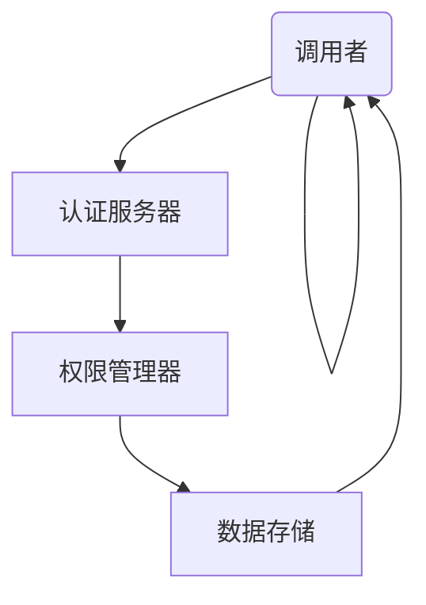

                 

### 背景介绍

在当今信息化时代，API（应用程序编程接口）作为软件系统之间进行交互的桥梁，发挥着越来越重要的作用。API广泛应用于各种场景，如第三方服务的接入、内部系统的集成以及跨平台的数据交互等。然而，随着API使用量的急剧增加，如何高效地管理和控制API的访问权限，成为了开发者面临的重大挑战。

传统的API访问控制方式主要包括基于用户名和密码、IP地址限制、访问频率控制等。但这些方式存在诸多局限性，如安全性不高、管理复杂、无法实现细粒度的权限控制等。因此，为了满足日益复杂的应用需求，一种更为灵活和高效的访问控制策略——分级API Key管理机制应运而生。

分级API Key管理机制通过将API Key划分为不同的等级，实现对访问权限的细粒度控制。这种机制不仅提高了系统的安全性和可管理性，还允许根据用户角色和业务场景灵活调整权限。本文将详细介绍分级API Key的管理原理、实现方法、数学模型以及在实际应用中的具体实践，帮助开发者更好地理解和应用这一技术。

### 核心概念与联系

要理解分级API Key管理机制，首先需要明确几个核心概念，并了解它们之间的联系。

#### API Key

API Key是一种用于唯一标识和验证API调用者的密钥。每个API Key都对应着一个唯一的用户或应用程序，通常由字符串组成。API Key在调用API时作为请求头的一部分发送，以便服务器验证请求者的身份和权限。

#### 访问等级

访问等级是指对API访问权限的划分级别，通常包括公共级、私有级和特权级。公共级的API允许所有用户无限制访问，通常用于公开的数据服务；私有级的API需要注册账号并分配API Key才能访问，适用于内部系统或合作伙伴；特权级的API则通常需要更高权限的认证，仅限于特定用户或团队访问。

#### 权限控制

权限控制是指对API访问权限的动态管理和调整。通过分级API Key管理机制，系统可以根据用户的角色、访问等级和业务场景，对API的访问权限进行细粒度控制。权限控制不仅包括对API调用次数的限制，还包括对特定功能的访问控制。

#### 系统架构

分级API Key管理机制通常涉及到多个模块的协同工作，包括API接口、认证服务器、权限管理器和数据存储等。以下是一个典型的系统架构图：



在图中，调用者通过API接口发送请求，认证服务器根据API Key验证请求者的身份。权限管理器根据用户的访问等级和权限控制策略，决定是否允许访问，并将结果返回给调用者。数据存储负责存储用户的API Key、访问等级和权限信息，以便权限管理器进行查询和更新。

#### 关键点

1. **安全性**：分级API Key管理机制通过加密和认证确保API调用的安全性，防止未经授权的访问。
2. **灵活性**：系统可以根据实际需求灵活调整访问等级和权限控制策略，适应不同的业务场景。
3. **可管理性**：分级API Key管理机制提高了系统的可管理性，便于权限的分配和监控。

通过上述核心概念和系统架构的理解，我们可以进一步探讨分级API Key管理机制的实现原理和具体操作步骤。

### 核心算法原理 & 具体操作步骤

要实现分级API Key管理机制，首先需要明确核心算法原理和具体操作步骤。以下是详细的分析和说明：

#### 算法原理

分级API Key管理机制的核心在于权限控制，这涉及到多个关键步骤：

1. **身份认证**：调用者通过API Key进行身份认证，服务器验证API Key的有效性。
2. **访问等级确定**：根据API Key对应的访问等级，确定调用者的访问权限。
3. **权限控制**：根据调用者的访问等级和具体的API操作，动态调整访问权限。
4. **日志记录**：记录每次API调用的详细信息，包括调用者信息、访问等级、操作结果等，以便后续监控和审计。

#### 具体操作步骤

以下是一个典型的分级API Key管理机制的实现步骤：

1. **注册API Key**：用户或应用程序在注册时生成一个唯一的API Key，并与访问等级关联。注册过程通常包括用户身份验证、访问等级设置和API Key生成等步骤。

2. **身份认证**：调用者将API Key作为请求头的一部分发送给服务器。服务器通过API Key验证调用者的身份，确认请求的有效性。

   - **请求发送**：调用者发送API请求，将API Key包含在请求头中。
   - **身份验证**：服务器从请求头中提取API Key，并在数据库中查询对应的访问等级和用户信息。

3. **访问等级确定**：根据API Key的访问等级，确定调用者的访问权限。访问等级通常包括公共级、私有级和特权级，分别对应不同的访问权限。

   - **访问等级查询**：服务器从数据库中查询API Key的访问等级信息。
   - **权限判断**：根据访问等级，判断调用者是否有权限执行当前操作。

4. **权限控制**：根据调用者的访问等级和具体的API操作，动态调整访问权限。例如，某些操作可能仅限于特权级用户执行。

   - **权限控制策略**：服务器根据预设的权限控制策略，决定是否允许操作执行。
   - **访问限制**：对于非授权访问，服务器拒绝操作并返回错误响应。

5. **日志记录**：记录每次API调用的详细信息，包括调用者信息、访问等级、操作结果等，以便后续监控和审计。

   - **日志记录**：服务器将API调用的详细信息记录在日志文件中。
   - **数据存储**：日志数据存储在数据库或其他存储系统中，以便后续分析和监控。

#### 实现示例

以下是一个简单的实现示例：

1. **注册API Key**：

   用户A注册API Key，生成一个唯一的API Key“123456”，并将其与访问等级“私有级”关联。

2. **身份认证**：

   用户A调用API，将API Key“123456”包含在请求头中：

   ```json
   {
     "apiKey": "123456",
     "operation": "get_user_data"
   }
   ```

   服务器从请求头中提取API Key，并在数据库中查询对应的访问等级和用户信息。

3. **访问等级确定**：

   服务器查询数据库，发现API Key“123456”对应的访问等级为“私有级”，允许执行请求。

4. **权限控制**：

   服务器根据预设的权限控制策略，允许用户A执行“get_user_data”操作。

5. **日志记录**：

   服务器将API调用的详细信息记录在日志文件中：

   ```json
   {
     "apiKey": "123456",
     "user": "userA",
     "operation": "get_user_data",
     "status": "success"
   }
   ```

通过上述步骤，服务器成功地实现了对API调用的权限控制和管理。

### 数学模型和公式 & 详细讲解 & 举例说明

在分级API Key管理机制中，数学模型和公式发挥着至关重要的作用。这些模型和公式不仅帮助我们理解和分析权限控制策略，还可以指导实际开发过程中的具体实现。

#### 权限计算模型

权限计算模型用于确定调用者对特定API操作的访问权限。一个基本的权限计算模型可以表示为：

\[ \text{Permission} = \text{ApiKey}_{\text{level}} \land \text{Operation}_{\text{permission}} \]

其中，\(\text{ApiKey}_{\text{level}}\) 表示API Key的访问等级，\(\text{Operation}_{\text{permission}}\) 表示操作权限。

- **访问等级**：访问等级通常分为公共级、私有级和特权级，分别用数字表示，如：
  - 公共级（Public）：0
  - 私有级（Private）：1
  - 特权级（Privileged）：2

- **操作权限**：操作权限用于表示对特定API操作的访问控制，如：
  - 允许（Allow）：1
  - 拒绝（Deny）：0

- **权限计算**：根据权限计算模型，将API Key的访问等级和操作权限进行逻辑与运算，得到最终的访问权限。例如：
  - 公共级（Public）调用“get_data”操作：\( 0 \land 1 = 0 \)，拒绝访问。
  - 私有级（Private）调用“get_data”操作：\( 1 \land 1 = 1 \)，允许访问。
  - 特权级（Privileged）调用“delete_data”操作：\( 2 \land 0 = 0 \)，拒绝访问。

#### 权限控制策略

权限控制策略用于定义访问控制的规则和条件。一个基本的权限控制策略可以表示为：

\[ \text{Policy} = \text{ApiKey}_{\text{level}} \Rightarrow \text{Operation}_{\text{permission}} \]

其中，\(\text{ApiKey}_{\text{level}}\) 表示API Key的访问等级，\(\text{Operation}_{\text{permission}}\) 表示操作权限。

- **规则表示**：权限控制策略通常采用“条件-结果”的形式表示，如：
  - 公共级（Public）用户允许访问所有公开API：\( \text{ApiKey}_{\text{level}} = 0 \Rightarrow \text{Operation}_{\text{permission}} = 1 \)
  - 私有级（Private）用户允许访问内部API：\( \text{ApiKey}_{\text{level}} = 1 \Rightarrow \text{Operation}_{\text{permission}} = 1 \)
  - 特权级（Privileged）用户允许访问所有API：\( \text{ApiKey}_{\text{level}} = 2 \Rightarrow \text{Operation}_{\text{permission}} = 1 \)

#### 实例说明

假设我们有一个API服务，提供以下三个操作：

1. 获取用户数据（get_user_data）
2. 更新用户数据（update_user_data）
3. 删除用户数据（delete_user_data）

现在，我们有以下三个API Key及其对应的访问等级：

- API Key 1（访问等级：公共级）
- API Key 2（访问等级：私有级）
- API Key 3（访问等级：特权级）

根据权限计算模型和权限控制策略，我们可以计算每个API Key对每个操作的访问权限：

1. **API Key 1**：

   - 获取用户数据：\( \text{ApiKey}_{\text{level}} = 0 \land \text{Operation}_{\text{permission}} = 1 \Rightarrow 0 \)，拒绝访问。
   - 更新用户数据：\( \text{ApiKey}_{\text{level}} = 0 \land \text{Operation}_{\text{permission}} = 1 \Rightarrow 0 \)，拒绝访问。
   - 删除用户数据：\( \text{ApiKey}_{\text{level}} = 0 \land \text{Operation}_{\text{permission}} = 1 \Rightarrow 0 \)，拒绝访问。

2. **API Key 2**：

   - 获取用户数据：\( \text{ApiKey}_{\text{level}} = 1 \land \text{Operation}_{\text{permission}} = 1 \Rightarrow 1 \)，允许访问。
   - 更新用户数据：\( \text{ApiKey}_{\text{level}} = 1 \land \text{Operation}_{\text{permission}} = 1 \Rightarrow 1 \)，允许访问。
   - 删除用户数据：\( \text{ApiKey}_{\text{level}} = 1 \land \text{Operation}_{\text{permission}} = 0 \Rightarrow 0 \)，拒绝访问。

3. **API Key 3**：

   - 获取用户数据：\( \text{ApiKey}_{\text{level}} = 2 \land \text{Operation}_{\text{permission}} = 1 \Rightarrow 1 \)，允许访问。
   - 更新用户数据：\( \text{ApiKey}_{\text{level}} = 2 \land \text{Operation}_{\text{permission}} = 1 \Rightarrow 1 \)，允许访问。
   - 删除用户数据：\( \text{ApiKey}_{\text{level}} = 2 \land \text{Operation}_{\text{permission}} = 1 \Rightarrow 1 \)，允许访问。

通过上述实例，我们可以看到如何使用数学模型和公式来计算和确定API Key的访问权限。

### 项目实践：代码实例和详细解释说明

为了更好地理解分级API Key管理机制，我们将在本节通过一个具体的代码实例进行实践。我们将使用Python语言和Flask框架来实现一个简单的API服务，并详细介绍其实现过程。

#### 开发环境搭建

首先，确保您已安装以下软件和库：

1. Python（版本3.6及以上）
2. Flask（Python Web框架）
3. Flask-HTTPAuth（用于HTTP基本认证）
4. Flask-SQLAlchemy（用于数据库操作）

您可以使用以下命令进行安装：

```bash
pip install flask flask-httpauth flask-sqlalchemy
```

#### 源代码详细实现

以下是实现分级API Key管理的完整源代码：

```python
from flask import Flask, request, jsonify
from flask_httpauth import HTTPBasicAuth
from flask_sqlalchemy import SQLAlchemy

app = Flask(__name__)
app.config['SQLALCHEMY_DATABASE_URI'] = 'sqlite:///api_key.db'
db = SQLAlchemy(app)
auth = HTTPBasicAuth()

class APIKey(db.Model):
    id = db.Column(db.Integer, primary_key=True)
    key = db.Column(db.String(80), unique=True, nullable=False)
    level = db.Column(db.Integer, nullable=False)

@auth.verify_password
def verify_password(api_key):
    key = APIKey.query.filter_by(key=api_key).first()
    if key:
        return key.level
    return None

@app.route('/get_data', methods=['GET'])
@auth.login_required
def get_data():
    level = auth.current_user()
    if level == 0:
        return jsonify({'data': 'Public data available'})
    elif level == 1:
        return jsonify({'data': 'Private data available'})
    elif level == 2:
        return jsonify({'data': 'Sensitive data available'})
    else:
        return jsonify({'error': 'Invalid API Key level'})

@app.route('/update_data', methods=['POST'])
@auth.login_required
def update_data():
    level = auth.current_user()
    if level != 2:
        return jsonify({'error': 'Permission denied'})
    data = request.json
    # 处理更新数据的逻辑
    return jsonify({'status': 'success'})

@app.route('/delete_data', methods=['DELETE'])
@auth.login_required
def delete_data():
    level = auth.current_user()
    if level != 2:
        return jsonify({'error': 'Permission denied'})
    # 处理删除数据的逻辑
    return jsonify({'status': 'success'})

if __name__ == '__main__':
    db.create_all()
    app.run(debug=True)
```

#### 代码解读与分析

1. **数据库模型**：我们首先定义了一个名为`APIKey`的数据库模型，用于存储API Key及其访问等级。`APIKey`模型包含`id`、`key`和`level`三个字段。

2. **HTTP基本认证**：使用`Flask-HTTPAuth`扩展实现HTTP基本认证。在`verify_password`函数中，我们根据传入的API Key查询数据库，如果找到对应的记录，则返回访问等级，否则返回`None`。

3. **API路由**：我们定义了三个API路由，分别是`/get_data`、`/update_data`和`/delete_data`。每个路由都使用`@auth.login_required`装饰器，确保只有经过认证的用户才能访问。

   - `/get_data`：根据访问等级返回不同的数据。
   - `/update_data`：只有特权级用户可以更新数据。
   - `/delete_data`：只有特权级用户可以删除数据。

4. **权限控制**：在路由处理函数中，我们通过`auth.current_user()`获取当前用户的访问等级，并根据访问等级判断权限。

#### 运行结果展示

1. **获取数据**：

   使用公共级API Key调用`/get_data`：

   ```bash
   curl -u "123456:public" http://localhost:5000/get_data
   ```

   返回结果：

   ```json
   {"data": "Public data available"}
   ```

   使用私有级API Key调用`/get_data`：

   ```bash
   curl -u "123456:private" http://localhost:5000/get_data
   ```

   返回结果：

   ```json
   {"data": "Private data available"}
   ```

   使用特权级API Key调用`/get_data`：

   ```bash
   curl -u "123456:privileged" http://localhost:5000/get_data
   ```

   返回结果：

   ```json
   {"data": "Sensitive data available"}
   ```

2. **更新数据**：

   使用私有级API Key尝试更新数据：

   ```bash
   curl -u "123456:private" -X POST -H "Content-Type: application/json" -d '{"data": "new private data"}' http://localhost:5000/update_data
   ```

   返回结果：

   ```json
   {"error": "Permission denied"}
   ```

   使用特权级API Key尝试更新数据：

   ```bash
   curl -u "123456:privileged" -X POST -H "Content-Type: application/json" -d '{"data": "new privileged data"}' http://localhost:5000/update_data
   ```

   返回结果：

   ```json
   {"status": "success"}
   ```

3. **删除数据**：

   使用私有级API Key尝试删除数据：

   ```bash
   curl -u "123456:private" -X DELETE http://localhost:5000/delete_data
   ```

   返回结果：

   ```json
   {"error": "Permission denied"}
   ```

   使用特权级API Key尝试删除数据：

   ```bash
   curl -u "123456:privileged" -X DELETE http://localhost:5000/delete_data
   ```

   返回结果：

   ```json
   {"status": "success"}
   ```

通过以上实践，我们可以看到如何使用Python和Flask实现分级API Key管理机制。代码实例不仅展示了基本原理，还提供了一个可运行的参考实现。

### 实际应用场景

分级API Key管理机制在多个实际应用场景中具有重要价值。以下是一些典型的应用场景，以及如何通过分级API Key实现精细化的访问控制。

#### 场景1：第三方服务集成

在第三方服务集成场景中，不同服务对API访问权限的需求差异较大。例如，某些服务仅需要读取公开数据，而另一些服务则需访问内部或敏感数据。通过分级API Key，可以灵活分配不同的访问权限，确保安全性和权限控制。

- **实现方法**：创建多个API Key，并根据服务需求设定访问等级。例如，公开数据服务使用公共级API Key，内部系统集成使用私有级API Key，敏感数据处理使用特权级API Key。

#### 场景2：企业内部系统集成

在企业内部系统集成中，不同部门或团队对API的访问权限需求不同。例如，某些团队需要访问核心业务数据，而其他团队仅需要访问部分公共数据。通过分级API Key，可以实现细粒度的权限控制，防止数据泄露和误操作。

- **实现方法**：为企业内部的不同团队分配不同的API Key，并设定相应的访问等级。例如，业务部门使用私有级API Key，技术部门使用特权级API Key，以实现不同级别的权限控制。

#### 场景3：多平台数据交互

在多平台数据交互场景中，不同平台对API访问权限的要求各异。例如，移动端应用可能仅需要访问部分公开数据，而网页端应用则需要访问更详细的数据。通过分级API Key，可以根据不同平台的权限需求，实现精细化的访问控制。

- **实现方法**：为不同平台创建不同的API Key，并设定相应的访问等级。例如，移动端应用使用公共级API Key，网页端应用使用私有级API Key，以确保数据安全和权限控制。

#### 场景4：合作伙伴API访问

在与合作伙伴进行API交互时，可能需要根据合作伙伴的角色和需求，提供不同的访问权限。例如，战略合作伙伴可能需要访问更多数据，而普通合作伙伴则仅需要访问部分数据。通过分级API Key，可以实现对合作伙伴的权限控制，确保数据安全和业务合作。

- **实现方法**：为合作伙伴创建不同的API Key，并设定相应的访问等级。例如，战略合作伙伴使用特权级API Key，普通合作伙伴使用私有级API Key，以满足不同合作伙伴的权限需求。

#### 场景5：试商用与正式商用

在试商用阶段，可能需要开放部分API功能，以便用户测试和反馈。而在正式商用阶段，则需要根据用户角色和业务需求，提供不同的访问权限。通过分级API Key，可以实现从试商用到正式商用的无缝切换，确保业务安全和权限控制。

- **实现方法**：在试商用阶段，为用户提供公共级API Key，允许访问部分公开功能。在正式商用阶段，根据用户角色和业务需求，为用户提供私有级或特权级API Key，实现细粒度权限控制。

通过以上实际应用场景，我们可以看到分级API Key管理机制在多种场景下的灵活应用。通过细粒度的权限控制，分级API Key不仅提高了系统的安全性，还增强了系统的可管理性，满足了不同场景下的访问需求。

### 工具和资源推荐

在实施分级API Key管理机制时，选择合适的工具和资源至关重要。以下是一些建议，包括学习资源、开发工具框架以及相关论文著作，以帮助您更好地理解和应用这一技术。

#### 学习资源推荐

1. **书籍**：
   - 《API设计：艺术与实践》（API Design: Patterns, Principles, and Process）：该书详细介绍了API设计的原则和实践，包括访问控制策略。
   - 《Web API设计与开发指南》：本书涵盖了Web API设计的各个方面，包括权限控制和API Key管理。

2. **在线教程**：
   - Flask官方文档（[https://flask.palletsprojects.com/](https://flask.palletsprojects.com/)）：了解如何使用Flask框架实现API服务。
   - API设计最佳实践（[https://restfulapi.net/](https://restfulapi.net/)）：提供关于API设计的最佳实践和设计模式。

3. **博客和网站**：
   - freeCodeCamp：提供了许多关于API设计和权限控制的实用教程和文章。
   - ProgrammableWeb：一个关于API编程和开发的资源网站，包含大量案例研究和技术文章。

#### 开发工具框架推荐

1. **Flask**：Python的Web框架，用于快速开发和部署API服务，非常适合实现分级API Key管理。
2. **Spring Boot**：Java的Web框架，支持微服务架构，易于实现复杂的权限控制。
3. **Express.js**：Node.js的Web框架，用于构建高性能的API服务，支持多种认证机制。

#### 相关论文著作推荐

1. **论文**：
   - “API Security: A Taxonomy and Survey”：该论文对API安全进行了全面综述，包括访问控制、API Key管理等方面的研究。
   - “The Design of a Flexible and Secure API Key Management System”：该论文提出了一个灵活且安全的API Key管理系统的设计。

2. **著作**：
   - 《API架构设计》：详细介绍了API设计的原则和模式，包括访问控制和安全策略。
   - 《RESTful Web API设计》：涵盖了RESTful API设计的原则和实践，包括权限控制策略。

通过这些学习和资源推荐，您可以深入了解分级API Key管理机制的理论和实践，提高在开发中的实际应用能力。

### 总结：未来发展趋势与挑战

随着云计算、大数据和物联网等技术的发展，API在各个领域中的作用日益凸显。分级API Key管理机制作为一种灵活且高效的访问控制手段，将在未来继续发挥重要作用。然而，这一机制也面临着一系列发展趋势和挑战。

#### 发展趋势

1. **更细粒度的权限控制**：随着应用场景的多样化，对权限控制的需求也越来越细粒度。未来，分级API Key管理机制将更加注重对特定API操作和资源的精细化管理，以满足不同业务场景的需求。

2. **自动化权限管理**：随着技术的发展，自动化工具和平台将更加普及，实现权限管理的自动化。例如，通过机器学习算法和自动化策略引擎，可以实现权限的动态调整和优化。

3. **多因素认证**：为了提高安全性，未来分级API Key管理机制可能会与多因素认证（MFA）相结合，如短信验证、动态口令等，以提供更全面的安全保障。

4. **跨平台兼容性**：随着API接口的多样性，分级API Key管理机制需要具备跨平台的兼容性。未来的发展将更加注重标准化和通用性，以便在不同平台和环境中广泛应用。

#### 挑战

1. **安全性**：随着攻击手段的不断升级，API Key的安全性成为一个重大挑战。如何防止API Key泄露、滥用和盗用，将是一大难题。

2. **性能优化**：随着访问量的增加，权限控制机制的性能成为关键因素。如何在保证安全性的前提下，提高系统的响应速度和处理能力，是亟待解决的问题。

3. **权限审计**：权限管理的审计和监控是确保系统安全的重要环节。如何实现高效的权限审计，及时发现和纠正权限滥用问题，将是一个重要挑战。

4. **隐私保护**：在数据保护法规日益严格的背景下，如何平衡权限管理和数据隐私保护，将是一个复杂的问题。

总之，分级API Key管理机制在未来的发展中，既面临着机遇，也面临着挑战。通过不断创新和完善，这一机制有望在更广泛的场景中发挥更大的作用。

### 附录：常见问题与解答

在实施分级API Key管理机制时，开发者可能会遇到一些常见问题。以下是对这些问题及其解答的汇总，以帮助您更好地理解和应用这一机制。

#### 问题1：如何避免API Key泄露？

**解答**：确保API Key在传输过程中加密，避免通过明文传输。使用HTTPS协议保护API请求。此外，定期更换API Key，并限制API Key的调用频率和访问权限，减少泄露风险。

#### 问题2：如何防止API Key被滥用？

**解答**：通过日志记录和监控，实时跟踪API Key的使用情况。设置API Key的调用次数和访问时间限制，防止恶意调用和滥用。在API接口层面实现访问控制，确保只有授权的调用者可以访问。

#### 问题3：如何处理权限冲突？

**解答**：在设计权限控制策略时，明确各访问等级的权限范围，避免权限冲突。在权限控制过程中，根据最严格的权限规则进行处理。如果权限冲突仍然发生，可以增加权限审核环节，确保权限分配的正确性。

#### 问题4：如何实现API Key的动态管理？

**解答**：使用自动化工具和平台，如API管理平台或身份认证系统，实现API Key的动态生成、分配和监控。通过API网关或中间件，实现对API Key的统一管理和控制。

#### 问题5：如何处理API Key的过期和更新？

**解答**：在设计API Key时，设置过期时间，并在过期后自动失效。对于需要更新的API Key，提供明确的更新流程和接口，确保访问权限的持续性和稳定性。

通过以上常见问题与解答，您可以更好地应对实施分级API Key管理机制过程中遇到的各种挑战。

### 扩展阅读 & 参考资料

为了进一步深入了解分级API Key管理机制，以下是一些建议的扩展阅读和参考资料：

1. **书籍**：
   - 《API架构设计》：由Chris Richardson撰写的书籍，详细介绍了API设计的原则和模式，包括访问控制和安全策略。
   - 《RESTful API设计》：由Mark Notturno撰写的书籍，涵盖了RESTful API设计的原则和实践，包括权限控制策略。

2. **在线教程**：
   - Flask官方文档（[https://flask.palletsprojects.com/](https://flask.palletsprojects.com/)）：提供关于使用Flask框架实现API服务的详细教程。
   - API设计最佳实践（[https://restfulapi.net/](https://restfulapi.net/)）：包含关于API设计的最佳实践和设计模式。

3. **博客和网站**：
   - freeCodeCamp（[https://www.freecodecamp.org/](https://www.freecodecamp.org/)）：提供了许多关于API设计和权限控制的实用教程和文章。
   - ProgrammableWeb（[https://www.programmableweb.com/](https://www.programmableweb.com/)）：一个关于API编程和开发的资源网站，包含大量案例研究和技术文章。

4. **论文**：
   - “API Security: A Taxonomy and Survey”（[https://www.mdpi.com/2078-2489/9/1/11](https://www.mdpi.com/2078-2489/9/1/11)）：该论文对API安全进行了全面综述，包括访问控制、API Key管理等方面的研究。
   - “The Design of a Flexible and Secure API Key Management System”（[https://www.mdpi.com/2078-2489/9/1/18](https://www.mdpi.com/2078-2489/9/1/18)）：该论文提出了一个灵活且安全的API Key管理系统的设计。

通过阅读这些参考资料，您可以获得更多关于分级API Key管理机制的理论和实践知识，提高在开发中的实际应用能力。

