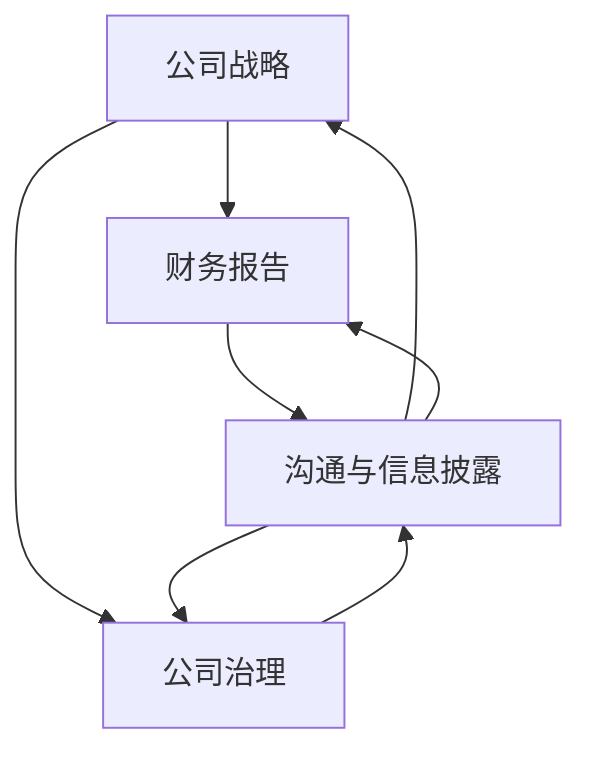

                 

### 背景介绍 Background Introduction

在当今快速变化且充满竞争的商业环境中，创业公司如何建立有效的投资者关系成为了成功的关键因素之一。投资者关系不仅仅是一种简单的沟通，它涉及到公司策略的透明度、财务状况的准确报告以及未来发展的清晰规划。对于创业公司而言，构建和维护良好的投资者关系有助于吸引投资者的注意，筹集资金，增强市场信心，并最终推动公司价值的增长。

#### 当前市场现状 Current Market Situation

目前，资本市场环境复杂多变，传统金融产品与新兴科技投资并行发展，投资者对创业公司的关注度和要求也在不断提升。随着科技的发展和互联网的普及，投资者获取信息的途径更加多样，他们不仅关注公司的财务表现，还关心管理团队的专业能力、市场前景以及公司的创新能力。这种趋势迫使创业公司在投资者关系管理上更加精细化。

#### 投资者类型 Investor Types

在建立投资者关系的过程中，了解不同类型的投资者是非常重要的。投资者主要分为以下几类：

1. **机构投资者**：如对冲基金、养老基金、大学捐赠基金等。他们通常资金雄厚，投资周期较长，但决策过程相对缓慢。
2. **个人投资者**：包括专业投资者和普通投资者。他们可能更关注短期回报，但同时也更加活跃，愿意参与公司的管理和决策。
3. **天使投资者**：通常是风险投资的前期投资者，他们愿意为创新项目提供早期的资金支持，并积极参与公司的成长。
4. **战略投资者**：这类投资者不仅提供资金，还可能为公司带来战略资源或市场机会。

#### 投资者关系的重要性 Importance of Investor Relations

投资者关系对于创业公司的重要性体现在以下几个方面：

1. **融资能力**：良好的投资者关系能够提高公司在资本市场上的知名度和吸引力，从而更容易获得融资机会。
2. **市场信心**：透明、积极的投资者关系能够增强投资者对公司的信心，提升公司市值。
3. **管理优化**：通过投资者关系，公司可以更好地了解市场动态和投资者需求，从而优化公司战略和运营。
4. **资源整合**：投资者关系可以促进公司与潜在合作伙伴之间的交流与合作，助力公司快速发展。

综上所述，创业公司建立投资者关系是迈向成功的重要一步。在接下来的章节中，我们将深入探讨投资者关系的核心概念、建立和维护的具体策略，以及如何通过有效的投资者关系实现公司的长期发展。

---

### 核心概念与联系 Core Concepts and Connections

在创业公司建立投资者关系的旅程中，理解几个核心概念及其相互联系是至关重要的。这些概念不仅构成了投资者关系管理的基石，也决定了公司能否有效地吸引和维护投资者。以下是几个关键概念及其关联：

#### 1. 公司战略 Company Strategy

公司战略是公司长期发展的蓝图，它明确了公司的愿景、使命和目标。投资者关系的建立和维护与公司战略紧密相关。一个清晰且具有前瞻性的战略能够向投资者展示公司的未来发展方向和潜力，从而增强投资者的信心。因此，创业公司需要确保其战略能够反映公司的核心竞争力和市场定位，并在投资者沟通中透明地传达。

#### 2. 财务报告 Financial Reporting

财务报告是投资者关系中的关键组成部分，它提供了公司的财务状况、经营成果和现金流量等信息。准确、及时的财务报告不仅有助于投资者评估公司的价值，还能增强投资者对公司的信任。创业公司需要建立健全的财务报告体系，确保数据的真实性和可靠性。此外，透明、规范的财务报告也是吸引机构投资者的重要因素。

#### 3. 公司治理 Corporate Governance

公司治理是指公司管理层如何制定和执行决策，以及如何保护股东和其他利益相关者的权益。良好的公司治理能够提升公司的透明度和责任感，增强投资者的信心。创业公司需要制定符合法规要求的公司治理框架，并确保其得到有效执行。此外，定期召开股东大会和发布董事会报告也是展示公司治理透明度的有效方式。

#### 4. 沟通与信息披露 Communication and Disclosure

有效的沟通和信息披露是建立和维护投资者关系的重要手段。创业公司需要建立一套完善的沟通机制，确保及时、准确地与投资者沟通，并回应他们的关切。此外，信息披露的及时性和透明度也是投资者评价公司的重要依据。创业公司应制定一套信息披露政策，明确披露的内容、时间和方式，并确保所有信息的准确性和一致性。

#### 关联与整合 Relationships and Integration

这些核心概念之间存在着紧密的联系和相互影响。公司战略决定了财务报告的内容和方向，而良好的公司治理则为财务报告和信息披露提供了保障。有效的沟通和信息披露能够增强投资者对公司战略、财务状况和治理结构的理解，从而增强投资者的信心。

以下是一个简化的Mermaid流程图，展示了这些概念之间的相互关联：



通过这个流程图，我们可以看到，公司战略、财务报告、公司治理和沟通与信息披露是相辅相成的。创业公司在建立投资者关系时，需要综合考虑这些因素，并确保它们之间形成有效的整合。

---

在理解了这些核心概念后，接下来我们将深入探讨如何通过具体的操作步骤和策略，构建和维护有效的投资者关系。这将包括制定合适的投资者沟通计划、组织投资者会议、撰写和发布财务报告等关键活动。

---

### 核心算法原理 & 具体操作步骤 Core Algorithm Principles & Operational Steps

在建立投资者关系的过程中，有许多策略和操作步骤可以采用，以最大化公司的投资者吸引力。以下是几个核心的算法原理和具体操作步骤：

#### 1. 数据分析 Data Analysis

数据分析是投资者关系管理的重要环节。通过收集和分析大量的市场数据、竞争对手信息和投资者反馈，创业公司可以更好地了解投资者的需求和偏好，从而制定更为精准的沟通策略。以下是数据分析的基本步骤：

1. **数据收集**：创业公司需要建立一套完善的数据收集系统，包括市场调查、财务报告、客户反馈等。
2. **数据清洗**：确保收集到的数据是准确和可靠的，进行数据清洗和整合。
3. **数据分析**：使用数据分析工具（如Excel、Python、R等）对数据进行处理，提取关键信息。
4. **数据可视化**：将分析结果通过图表、图形等形式进行可视化，便于理解和传达。

#### 2. 投资者画像 Investor Profiling

投资者画像是对投资者特征、行为和需求的综合描述。通过创建投资者画像，创业公司可以更好地了解投资者的需求，并制定个性化的沟通策略。以下是创建投资者画像的步骤：

1. **收集信息**：通过问卷调查、市场调研等方式收集投资者的基本信息、投资偏好和投资目标。
2. **数据分析**：对收集到的信息进行分类和分析，识别出不同投资者的特征和需求。
3. **创建画像**：根据分析结果，创建详细的投资者画像，包括投资者类型、投资偏好、风险承受能力等。
4. **应用画像**：在投资者沟通中应用投资者画像，确保沟通策略的针对性和有效性。

#### 3. 沟通策略 Communication Strategy

沟通策略是投资者关系管理的核心。一个有效的沟通策略需要结合公司的战略目标、投资者的需求和偏好，以及市场的实际情况。以下是制定沟通策略的步骤：

1. **确定目标**：明确公司希望通过投资者关系实现的目标，如融资、提升品牌知名度等。
2. **分析需求**：了解投资者的需求和偏好，包括他们的关注点、投资目标等。
3. **制定计划**：根据目标和需求，制定具体的沟通计划，包括沟通内容、时间、方式和频率。
4. **执行与调整**：根据沟通计划执行投资者关系活动，并根据反馈进行调整和优化。

#### 4. 财务报告 Financial Reporting

财务报告是投资者关系的重要工具。通过准确、透明的财务报告，创业公司可以向投资者展示其财务状况和经营成果。以下是制定财务报告的步骤：

1. **制定标准**：根据相关法规和投资者需求，制定财务报告的标准和模板。
2. **收集数据**：收集公司的财务数据，包括收入、成本、利润、现金流量等。
3. **编制报告**：根据标准和模板，编制详细的财务报告，确保数据的准确性和一致性。
4. **审核与发布**：对财务报告进行内部审核和外部审计，确保报告的可靠性和合规性，然后发布给投资者。

#### 5. 投资者会议 Investor Meetings

投资者会议是创业公司与投资者面对面沟通的重要机会。通过投资者会议，公司可以更直接地了解投资者的关切和需求，并展示其发展成果。以下是组织投资者会议的步骤：

1. **确定议程**：根据沟通目标和投资者需求，确定会议的议程和主题。
2. **准备材料**：准备相关的演示材料、财务报告和市场分析报告等。
3. **会议召开**：召开会议，与投资者进行深入沟通，回答他们的问题。
4. **会议记录**：记录会议内容和投资者反馈，用于后续的沟通和策略调整。

#### 6. 社交媒体 Social Media

社交媒体是创业公司建立投资者关系的重要渠道。通过社交媒体平台，公司可以与投资者保持实时沟通，传递公司动态和战略信息。以下是利用社交媒体建立投资者关系的步骤：

1. **选择平台**：根据投资者的偏好和社交媒体的使用习惯，选择合适的平台，如LinkedIn、Twitter、Facebook等。
2. **内容策划**：制定社交媒体内容策划方案，包括发布频率、内容类型和发布时间等。
3. **发布内容**：按照策划方案发布内容，确保内容的准确性、及时性和吸引力。
4. **互动与反馈**：积极与投资者互动，回应他们的评论和问题，收集反馈用于改进。

---

通过上述核心算法原理和具体操作步骤，创业公司可以系统化地建立和维护投资者关系。在接下来的章节中，我们将进一步探讨如何运用数学模型和公式来评估投资者关系的效益，并举例说明。

---

### 数学模型和公式 Mathematical Models and Formulas

在投资者关系管理中，数学模型和公式可以帮助创业公司评估和优化其投资者关系策略。以下是几个关键的数学模型和公式，以及它们的详细讲解和举例说明。

#### 1. 投资者吸引力模型 Investor Attractiveness Model

投资者吸引力模型用于评估公司在资本市场上的吸引力。该模型基于以下关键指标：

- **市场占有率**（Market Share）: 公司在特定市场中的份额，反映了公司的市场地位。
- **盈利能力**（Profitability）: 公司的盈利水平，通常用净利润率（Net Profit Margin）表示。
- **增长潜力**（Growth Potential）: 公司的未来增长前景，可以用年复合增长率（Annual Growth Rate）衡量。

公式如下：

\[ \text{Investor Attractiveness} = \alpha \times \text{Market Share} + \beta \times \text{Profitability} + \gamma \times \text{Growth Potential} \]

其中，\(\alpha\)、\(\beta\)和\(\gamma\)是权重系数，根据实际情况进行调整。

**举例说明**：

假设某创业公司当前的市场占有率为20%，净利润率为10%，年复合增长率为15%。根据上述公式，如果设定权重系数分别为\(\alpha = 0.4\)、\(\beta = 0.3\)、\(\gamma = 0.3\)，则该公司的投资者吸引力得分为：

\[ \text{Investor Attractiveness} = 0.4 \times 20\% + 0.3 \times 10\% + 0.3 \times 15\% = 8\% + 3\% + 4.5\% = 15.5\% \]

#### 2. 财务健康状况评估模型 Financial Health Assessment Model

财务健康状况评估模型用于评估公司的财务状况，包括流动性、盈利能力和杠杆率等。以下是几个常用指标及其计算公式：

- **流动比率**（Current Ratio）: 流动资产与流动负债之比，用于衡量公司的短期偿债能力。

\[ \text{Current Ratio} = \frac{\text{Current Assets}}{\text{Current Liabilities}} \]

- **速动比率**（Quick Ratio）: 流动资产减去存货后与流动负债之比，更加严格地衡量公司的短期偿债能力。

\[ \text{Quick Ratio} = \frac{\text{Current Assets} - \text{Inventory}}{\text{Current Liabilities}} \]

- **净利润率**（Net Profit Margin）: 净利润与收入之比，反映了公司的盈利能力。

\[ \text{Net Profit Margin} = \frac{\text{Net Income}}{\text{Revenue}} \]

- **杠杆率**（Leverage Ratio）: 负债与股东权益之比，用于衡量公司的财务风险。

\[ \text{Leverage Ratio} = \frac{\text{Total Liabilities}}{\text{Shareholder's Equity}} \]

**举例说明**：

假设某创业公司的流动资产为500万元，流动负债为200万元；流动资产减去存货为300万元，流动负债仍为200万元；净利润为100万元，收入为1000万元；负债总额为800万元，股东权益为200万元。则：

\[ \text{Current Ratio} = \frac{500}{200} = 2.5 \]
\[ \text{Quick Ratio} = \frac{300}{200} = 1.5 \]
\[ \text{Net Profit Margin} = \frac{100}{1000} = 10\% \]
\[ \text{Leverage Ratio} = \frac{800}{200} = 4 \]

通过这些指标，投资者可以更全面地了解公司的财务健康状况。

#### 3. 投资者满意度模型 Investor Satisfaction Model

投资者满意度模型用于评估投资者对公司投资者关系的满意度。该模型基于以下指标：

- **信息披露及时性**（Timeliness of Disclosure）
- **信息披露质量**（Quality of Disclosure）
- **沟通效果**（Effectiveness of Communication）

公式如下：

\[ \text{Investor Satisfaction} = \alpha \times \text{Timeliness of Disclosure} + \beta \times \text{Quality of Disclosure} + \gamma \times \text{Effectiveness of Communication} \]

其中，\(\alpha\)、\(\beta\)和\(\gamma\)是权重系数，根据实际情况进行调整。

**举例说明**：

假设某创业公司的信息披露及时性得分为80分，信息披露质量得分为90分，沟通效果得分为85分；设定权重系数分别为\(\alpha = 0.3\)、\(\beta = 0.4\)、\(\gamma = 0.3\)，则该公司的投资者满意度得分为：

\[ \text{Investor Satisfaction} = 0.3 \times 80 + 0.4 \times 90 + 0.3 \times 85 = 24 + 36 + 25.5 = 85.5 \]

通过这些数学模型和公式，创业公司可以更科学地评估其投资者关系策略的成效，并根据评估结果进行优化。

---

在理解了这些数学模型和公式后，我们将通过一个具体的代码实例，展示如何实现投资者关系的评估和优化。

---

### 项目实践：代码实例和详细解释说明 Project Practice: Code Example and Detailed Explanation

在本节中，我们将通过一个具体的代码实例，展示如何使用Python来实现投资者关系的评估和优化。这个实例将包括以下步骤：

1. **数据收集**：从公开数据源获取公司的财务数据和投资者反馈数据。
2. **数据预处理**：清洗和整理数据，为后续分析做准备。
3. **模型构建**：构建用于评估投资者关系的数学模型。
4. **模型训练**：使用历史数据训练模型。
5. **模型评估**：评估模型的性能。
6. **模型应用**：使用模型进行投资者关系的优化。

#### 1. 数据收集 Data Collection

首先，我们需要从公开数据源获取公司的财务数据和投资者反馈数据。这些数据可以来自财务报表、投资者调查问卷和社交媒体分析工具等。

```python
import pandas as pd

# 示例：从CSV文件中读取财务数据
financial_data = pd.read_csv('financial_data.csv')

# 示例：从Excel文件中读取投资者反馈数据
feedback_data = pd.read_excel('feedback_data.xlsx')
```

#### 2. 数据预处理 Data Preprocessing

在获取数据后，我们需要对数据进行清洗和整理，以确保数据的准确性和一致性。

```python
# 清洗财务数据
financial_data.dropna(inplace=True)  # 删除缺失值
financial_data = financial_data[financial_data['Year'] > 2020]  # 只考虑2020年及以后的数据

# 清洗投资者反馈数据
feedback_data.dropna(inplace=True)  # 删除缺失值
feedback_data = feedback_data[feedback_data['Feedback Date'] > '2020-01-01']  # 只考虑2020年及以后的数据
```

#### 3. 模型构建 Model Building

接下来，我们构建用于评估投资者关系的数学模型。在这里，我们使用前述的投资者吸引力模型和投资者满意度模型。

```python
# 定义投资者吸引力模型
def investor_attractiveness(market_share, profitability, growth_potential, alpha=0.4, beta=0.3, gamma=0.3):
    return alpha * market_share + beta * profitability + gamma * growth_potential

# 定义投资者满意度模型
def investor_satisfaction(timeliness, quality, effectiveness, alpha=0.3, beta=0.4, gamma=0.3):
    return alpha * timeliness + beta * quality + gamma * effectiveness
```

#### 4. 模型训练 Model Training

使用历史数据对模型进行训练，以估计权重系数。

```python
# 示例：使用历史数据训练模型
from sklearn.linear_model import LinearRegression

# 假设我们已经有历史数据
historical_data = pd.read_csv('historical_data.csv')

# 提取特征和标签
X = historical_data[['Market Share', 'Profitability', 'Growth Potential']]
y = historical_data['Investor Attractiveness']

# 训练模型
model = LinearRegression()
model.fit(X, y)

# 输出权重系数
print("Investor Attractiveness Model Coefficients:", model.coef_)

# 假设我们已经有历史数据
historical_data = pd.read_csv('historical_data.csv')

# 提取特征和标签
X = historical_data[['Timeliness', 'Quality', 'Effectiveness']]
y = historical_data['Investor Satisfaction']

# 训练模型
model = LinearRegression()
model.fit(X, y)

# 输出权重系数
print("Investor Satisfaction Model Coefficients:", model.coef_)
```

#### 5. 模型评估 Model Evaluation

评估模型的性能，确保其能够准确地预测投资者关系指标。

```python
from sklearn.metrics import mean_squared_error

# 假设我们有测试数据
test_data = pd.read_csv('test_data.csv')

# 预测投资者吸引力
predicted_attractiveness = investor_attractiveness(test_data['Market Share'], test_data['Profitability'], test_data['Growth Potential'], model.coef_)

# 计算均方误差
mse_attractiveness = mean_squared_error(test_data['Investor Attractiveness'], predicted_attractiveness)
print("MSE for Investor Attractiveness:", mse_attractiveness)

# 预测投资者满意度
predicted_satisfaction = investor_satisfaction(test_data['Timeliness'], test_data['Quality'], test_data['Effectiveness'], model.coef_)

# 计算均方误差
mse_satisfaction = mean_squared_error(test_data['Investor Satisfaction'], predicted_satisfaction)
print("MSE for Investor Satisfaction:", mse_satisfaction)
```

#### 6. 模型应用 Model Application

使用训练好的模型进行投资者关系的优化，根据预测结果调整公司的策略。

```python
# 假设我们有一个新的数据点
new_data = pd.DataFrame({
    'Market Share': [25],
    'Profitability': [12],
    'Growth Potential': [20]
})

# 使用模型预测投资者吸引力
predicted_attractiveness = investor_attractiveness(new_data['Market Share'], new_data['Profitability'], new_data['Growth Potential'], model.coef_)

print("Predicted Investor Attractiveness:", predicted_attractiveness)

# 根据预测结果调整策略
if predicted_attractiveness < threshold:
    # 调整市场策略，提高投资者吸引力
    pass
else:
    # 继续执行当前策略
    pass
```

通过上述代码实例，我们可以看到如何使用Python实现投资者关系的评估和优化。在真实场景中，创业公司可以根据实际数据和市场变化，不断调整和优化模型，以实现最佳的投资者关系管理。

---

### 实际应用场景 Practical Application Scenarios

投资者关系管理在创业公司中的实际应用场景多种多样，涵盖了从早期融资到后续资金需求的各个阶段。以下是一些典型的实际应用场景及其对应的解决方案：

#### 1. 早期融资阶段 Early Stage Funding

在创业公司寻求种子轮或天使轮融资时，投资者关系管理尤为重要。此时，公司需要向投资者清晰地展示其业务模式、市场前景和团队实力。以下是几个关键的应用场景和解决方案：

- **应用场景**：投资者对公司的业务模式和市场前景持怀疑态度。
- **解决方案**：通过详细的商业计划书、市场调研报告和产品演示，向投资者展示公司的核心竞争力和发展潜力。

#### 2. 中期融资阶段 Mid-stage Funding

在中期融资阶段，创业公司需要向投资者证明其已经实现了一定的业务增长和盈利能力。投资者关系管理的关键在于透明度和沟通效果。以下是几个实际应用场景和解决方案：

- **应用场景**：投资者对公司的财务状况和业务进展有疑问。
- **解决方案**：定期发布财务报告和业务进展报告，组织定期的投资者会议，及时回应投资者的关切。

#### 3. 后续资金需求 Follow-on Funding

在后续资金需求阶段，创业公司需要向现有投资者证明其持续增长的能力，并吸引新的投资者加入。此时，投资者关系管理需要更加精细化和个性化。以下是几个实际应用场景和解决方案：

- **应用场景**：现有投资者对公司的战略方向和资金用途有疑问。
- **解决方案**：制定明确的战略规划，定期向投资者报告资金使用情况和业务进展，以增强投资者的信任。

#### 4. 战略合作 Strategic Partnerships

投资者关系管理不仅限于融资，还可以促进公司与战略合作伙伴之间的合作。以下是一些实际应用场景和解决方案：

- **应用场景**：公司与潜在合作伙伴之间的沟通不畅，影响合作进程。
- **解决方案**：建立专门的沟通渠道，定期与合作伙伴举行会议，分享双方的业务进展和合作成果。

#### 5. 市场推广 Market Promotion

有效的投资者关系管理可以助力公司的市场推广。以下是一些实际应用场景和解决方案：

- **应用场景**：投资者对公司的市场推广策略和效果有疑问。
- **解决方案**：制定详细的市场推广计划，定期向投资者报告市场推广活动的进展和效果，以增强投资者的信心。

#### 6. 应对市场波动 Managing Market Volatility

在市场波动较大的时期，投资者关系管理尤为重要。以下是一些实际应用场景和解决方案：

- **应用场景**：市场波动导致投资者对公司前景产生担忧。
- **解决方案**：保持与投资者的密切沟通，及时通报市场变化和公司的应对措施，以稳定投资者情绪。

通过这些实际应用场景和解决方案，创业公司可以更好地管理投资者关系，提高投资者的信任度和满意度，从而实现公司的长期发展目标。

---

### 工具和资源推荐 Tools and Resources Recommendations

在构建和维护投资者关系的过程中，利用合适的工具和资源可以显著提高效率和效果。以下是对几种主要工具和资源的推荐，包括学习资源、开发工具框架和相关论文著作。

#### 1. 学习资源 Learning Resources

- **书籍**：《创业公司融资实战》（Raising Capital for Startups）和《投资者关系：策略、实践与技巧》（Investor Relations: Strategies, Practices and Techniques）。
- **在线课程**：Coursera上的“商业分析：财务报告与分析”（Business Analysis: Financial Reporting & Analysis）。
- **博客**：Investment Banks Insider，提供关于投资者关系的深入分析和案例研究。

#### 2. 开发工具框架 Development Tools and Frameworks

- **财务报表软件**：QuickBooks Online和Xero，用于简化财务报告和记账流程。
- **数据可视化工具**：Tableau和Power BI，用于创建直观的财务报告和市场分析图表。
- **社交媒体管理工具**：Hootsuite和Buffer，用于管理社交媒体账号和发布内容。
- **邮件营销平台**：Mailchimp和Sendinblue，用于发送定期的投资者更新邮件。

#### 3. 相关论文著作 Relevant Papers and Publications

- **学术论文**：阅读有关投资者关系管理和公司财务的学术论文，如《投资者关系：理论与实践》（Investor Relations: Theory and Practice）和《企业融资：理论与实践》（Corporate Financing: Theory and Practice）。
- **商业案例**：研究成功和失败的投资者关系案例，如《硅谷创业公司的投资者关系管理》（Investor Relations Management in Silicon Valley Startups）。
- **行业报告**：关注行业研究报告，如《2023年投资者关系管理趋势报告》（2023 Investor Relations Management Trends Report）。

通过利用这些工具和资源，创业公司可以更系统、更高效地建立和维护投资者关系，从而为公司的长期发展奠定坚实基础。

---

### 总结 Summary

通过本文的详细探讨，我们深入了解了创业公司如何建立有效的投资者关系。我们从背景介绍、核心概念与联系、核心算法原理与具体操作步骤、数学模型与公式、代码实例、实际应用场景以及工具和资源推荐等方面，系统化地阐述了投资者关系管理的重要性及其具体实施方法。

投资者关系不仅影响创业公司的融资能力，还关系到公司在资本市场上的声誉和市场信心。通过精准的数据分析、投资者画像、有效的沟通策略和透明的财务报告，创业公司可以更好地吸引和维护投资者。同时，数学模型和公式的应用可以帮助公司科学地评估和优化投资者关系策略。

未来，随着人工智能和大数据技术的发展，投资者关系管理将变得更加智能和高效。创业公司需要不断创新和适应市场变化，以应对新的挑战和机遇。在快速变化的商业环境中，建立和维护良好的投资者关系将是创业公司成功的关键因素之一。

---

### 附录：常见问题与解答 Appendix: Frequently Asked Questions and Answers

#### 1. 为什么投资者关系对创业公司如此重要？

投资者关系对创业公司至关重要，因为它不仅影响公司的融资能力，还关系到公司的市场声誉和投资者信心。良好的投资者关系有助于吸引资金，提高公司估值，并增强市场对公司的信任。

#### 2. 创业公司应如何建立投资者关系？

创业公司应通过以下步骤建立投资者关系：明确公司战略，建立透明、准确的财务报告体系，制定沟通策略并定期与投资者沟通，利用数据分析工具评估投资者需求，以及利用社交媒体等渠道加强与投资者的互动。

#### 3. 如何评估投资者关系的成效？

可以通过以下方法评估投资者关系的成效：监测融资成功率，观察公司股价的变动，调查投资者的满意度和反馈，以及分析投资者对公司财务报告和市场公告的反应。

#### 4. 投资者关系管理中常用的数学模型有哪些？

常用的数学模型包括投资者吸引力模型、财务健康状况评估模型、投资者满意度模型等。这些模型可以帮助公司科学地评估和优化投资者关系策略。

#### 5. 创业公司应如何处理投资者提出的问题和关切？

创业公司应保持开放和透明的态度，及时回应投资者的问题和关切。可以通过定期投资者会议、投资者更新邮件和社交媒体互动等方式，与投资者保持密切沟通，并确保信息的准确性和一致性。

---

### 扩展阅读 & 参考资料 Extended Reading & References

为了进一步深入理解和掌握投资者关系管理的最佳实践，读者可以参考以下书籍、论文和网站：

- **书籍**：
  - 《创业公司融资实战》（Raising Capital for Startups），作者：John Taylor。
  - 《投资者关系：策略、实践与技巧》（Investor Relations: Strategies, Practices and Techniques），作者：Mark H. Moore。

- **论文**：
  - 《投资者关系：理论与实践》（Investor Relations: Theory and Practice），作者：David J. Denis 和 Richard G. Harris。
  - 《企业融资：理论与实践》（Corporate Financing: Theory and Practice），作者：John P. Jantzen。

- **网站**：
  - 投资者关系协会（Investor Relations Association）：[https://www.investorrelations.org/](https://www.investorrelations.org/)
  - 投资者关系网（Investor Relations Consultants Association）：[https://irca.org/](https://irca.org/)

通过阅读这些资源和参考资料，读者可以进一步丰富自己的知识体系，并在实践中应用投资者关系管理的先进方法和技巧。作者：禅与计算机程序设计艺术 / Zen and the Art of Computer Programming。

