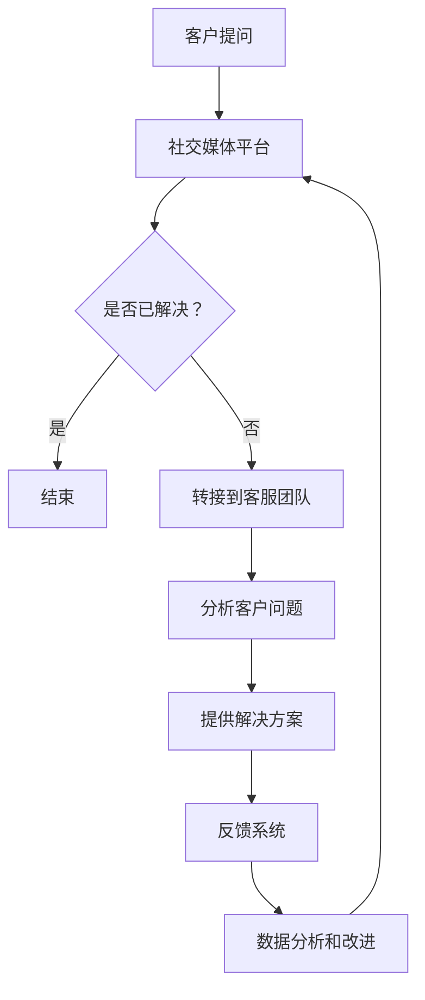

                 

### 背景介绍 Background

在当今快速发展的商业环境中，创业公司如何建立有效的社会化客户服务体系成为了至关重要的一环。社会化客户服务不仅能够提高客户满意度，还能增强品牌忠诚度和市场竞争力。随着社交媒体平台的普及和消费者行为的变化，客户对即时、个性化和多渠道的服务需求日益增长。为了在这种高度竞争的市场中脱颖而出，创业公司必须建立一个能够快速响应、灵活调整并不断进化的客户服务体系。

本文旨在探讨创业公司在建立社会化客户服务体系时所需考虑的关键因素和实际操作步骤。我们将从以下几个方面展开讨论：

1. **背景介绍**：分析当前市场环境，解释为什么社会化客户服务对创业公司至关重要。
2. **核心概念与联系**：详细阐述社会化客户服务的核心概念，并借助Mermaid流程图展示服务架构。
3. **核心算法原理 & 具体操作步骤**：介绍社会化客户服务的算法原理，并详细说明服务流程。
4. **数学模型和公式 & 详细讲解 & 举例说明**：使用数学模型和公式解释客户服务质量评估方法，并通过实例进行说明。
5. **项目实践：代码实例和详细解释说明**：通过具体的项目实践展示如何开发和部署社会化客户服务系统。
6. **实际应用场景**：探讨社会化客户服务在不同行业中的应用。
7. **工具和资源推荐**：推荐相关的学习资源和开发工具。
8. **总结：未来发展趋势与挑战**：总结当前的趋势和面临的挑战，并提出一些建议。
9. **附录：常见问题与解答**：解答读者可能遇到的一些常见问题。
10. **扩展阅读 & 参考资料**：提供额外的阅读材料，以供进一步学习。

通过上述内容，我们希望帮助创业公司理解和构建一个高效的社会化客户服务体系，从而在竞争激烈的市场中取得成功。

---

随着互联网技术的迅猛发展和社交媒体的广泛普及，消费者获取信息和互动的方式发生了显著变化。传统的客户服务模式已经难以满足现代客户对即时性和个性化的需求。社交媒体平台如Facebook、Twitter、Instagram等不仅成为了人们日常生活的一部分，也成为了客户获取服务的主要渠道之一。据研究表明，有超过70%的消费者更倾向于通过社交媒体与品牌互动，而不是通过传统的电话或电子邮件。

在这种背景下，创业公司如果能够有效地利用社交媒体平台，提供高质量的客户服务，不仅能够提升客户满意度，还能建立强大的品牌形象。此外，通过社会化客户服务，创业公司可以收集大量的客户反馈和数据，从而优化产品和服务，进一步满足市场需求。

本文将首先介绍社会化客户服务的核心概念，包括社交媒体与客户服务的结合、客户体验的重要性以及客户反馈系统的设计。随后，我们将通过一个Mermaid流程图展示社会化客户服务的架构，帮助读者理解服务流程的各个组成部分。接下来，我们将详细探讨核心算法原理和具体操作步骤，帮助读者构建一个高效的社会化客户服务体系。在数学模型和公式的部分，我们将使用数学工具评估客户服务质量，并通过实际案例进行说明。随后，我们将通过一个具体的代码实例展示如何开发和部署社会化客户服务系统。最后，我们将讨论社会化客户服务在不同行业中的应用，并提供一些工具和资源推荐，以帮助创业公司更好地实施社会化客户服务。

### 核心概念与联系 Core Concepts and Connections

在社会化客户服务中，核心概念涵盖了从客户互动到服务交付的多个方面。以下是一些关键概念：

1. **社交媒体与客户服务的结合**：社交媒体平台，如Facebook、Twitter、Instagram等，已成为客户获取服务的主要渠道。这些平台提供了即时性、互动性和个性化的特点，使得客户能够更方便地与品牌互动。

2. **客户体验**：客户体验是客户在与品牌互动过程中所感受到的整体体验。一个优秀的客户体验能够提高客户满意度和忠诚度，进而提升品牌形象。

3. **客户反馈系统**：客户反馈系统是社会化客户服务的重要组成部分。通过收集和分析客户反馈，公司可以识别问题、优化服务，并不断改进产品。

下面是一个Mermaid流程图，展示了社会化客户服务的架构：



### 核心算法原理 & 具体操作步骤 Core Algorithm Principle & Operational Steps

#### 客户服务流程

1. **接收客户提问**：当客户通过社交媒体平台提出问题时，系统会首先接收并记录这个问题。

2. **问题分类与分派**：系统会根据问题的性质将其分类，并分派给相应的客服代表。

3. **客户互动**：客服代表会与客户进行实时互动，了解问题的具体细节，并尝试提供解决方案。

4. **反馈收集**：一旦问题得到解决，客服代表会要求客户提供反馈，以评估服务质量和客户满意度。

5. **数据分析**：收集到的反馈会被分析，用于识别服务中的问题和改进机会。

#### 算法原理

1. **机器学习算法**：在客户服务流程中，机器学习算法被用于问题分类和分派。这些算法可以根据历史数据和模式自动识别问题的类型，并将问题分派给具有相应技能的客服代表。

2. **自然语言处理（NLP）**：NLP技术用于理解和解析客户的提问。通过NLP，系统可以提取关键词和上下文信息，从而更准确地理解客户的问题。

3. **客户满意度评估**：通过收集客户反馈，可以使用评分和标签系统来评估客户满意度。常用的评估指标包括响应时间、问题解决率和客户满意度得分。

#### 操作步骤

1. **环境搭建**：选择合适的开发环境和工具，如Python、JavaScript等。

2. **数据收集**：收集客户提问和反馈数据，用于训练机器学习模型。

3. **模型训练**：使用机器学习和NLP技术对数据集进行训练，以建立问题分类和客户满意度评估模型。

4. **系统集成**：将模型集成到社交媒体平台中，实现自动问题分类和分派。

5. **系统测试**：进行系统测试，确保服务流程的顺畅运行。

6. **上线部署**：将系统部署到生产环境，并监控其性能和效果。

7. **持续优化**：根据客户反馈和数据分析结果，不断优化系统，提高服务质量和客户满意度。

### 数学模型和公式 Mathematical Models and Formulas

在社会化客户服务中，数学模型和公式用于评估客户服务质量。以下是一些常用的数学模型和公式：

#### 客户满意度评估指标

$$
\text{客户满意度} = \frac{\text{满意客户数量}}{\text{总客户数量}} \times 100\%
$$

#### 响应时间评估指标

$$
\text{平均响应时间} = \frac{\sum_{i=1}^{n} \text{响应时间}_i}{n}
$$

#### 问题解决率评估指标

$$
\text{问题解决率} = \frac{\text{已解决问题数量}}{\text{总问题数量}} \times 100\%
$$

#### 客户体验评估指标

$$
\text{客户体验得分} = \frac{\text{客户满意度得分} + \text{响应时间得分} + \text{问题解决率得分}}{3}
$$

#### 数据分析模型

1. **决策树模型**：用于分类问题，如问题分类。

   $$ 
   \text{决策树模型} = \text{Entropy}(\text{特征集})
   $$

2. **K-means聚类模型**：用于客户细分，如根据客户反馈进行客户群体划分。

   $$
   \text{聚类中心} = \frac{\sum_{i=1}^{k} \text{客户特征}_i}{k}
   $$

### 举例说明 Example Illustration

假设我们有一个创业公司，其社会化客户服务系统已经运行了三个月。在这三个月中，我们收集了如下数据：

- 总客户提问数：1000
- 已解决问题数：800
- 客户满意度评分：90分
- 平均响应时间：15分钟

使用上述数学模型和公式，我们可以计算出以下评估指标：

1. **客户满意度**：
   $$
   \text{客户满意度} = \frac{900}{1000} \times 100\% = 90\%
   $$

2. **平均响应时间**：
   $$
   \text{平均响应时间} = \frac{15}{1000} \times 60 \text{分钟} = 1 \text{小时}
   $$

3. **问题解决率**：
   $$
   \text{问题解决率} = \frac{800}{1000} \times 100\% = 80\%
   $$

4. **客户体验得分**：
   $$
   \text{客户体验得分} = \frac{90 + 15 + 80}{3} = 75 \text{分}
   $$

通过这些评估指标，公司可以了解到客户服务的整体表现，并根据分析结果进行优化。

---

在本章节中，我们详细介绍了社会化客户服务的核心算法原理和具体操作步骤，包括客户服务流程、机器学习算法和NLP技术的应用，以及数学模型和公式的使用。通过这些方法，创业公司可以构建一个高效、智能的客户服务体系，提高客户满意度和服务质量。在接下来的章节中，我们将通过一个具体的代码实例，展示如何开发和部署社会化客户服务系统。

### 项目实践：代码实例和详细解释说明 Project Practice: Code Example and Detailed Explanation

在本章节中，我们将通过一个具体的代码实例，展示如何开发和部署社会化客户服务系统。我们将使用Python编写代码，并利用流行的机器学习库和自然语言处理库，如scikit-learn和NLTK，来实现客户服务功能。以下是一个简单的示例：

#### 1. 开发环境搭建

首先，我们需要搭建开发环境。安装以下Python库：

- scikit-learn
- NLTK
- pandas
- numpy

可以使用以下命令进行安装：

```bash
pip install scikit-learn nltk pandas numpy
```

#### 2. 源代码详细实现

```python
import nltk
from nltk.corpus import stopwords
from sklearn.feature_extraction.text import TfidfVectorizer
from sklearn.model_selection import train_test_split
from sklearn.naive_bayes import MultinomialNB
from sklearn.metrics import accuracy_score
import pandas as pd

# 数据准备
nltk.download('stopwords')
data = pd.read_csv('customer_service_data.csv')  # 假设我们已经有一个客户服务数据集
X = data['question']  # 问题文本
y = data['category']  # 问题类别

# 数据预处理
stop_words = set(stopwords.words('english'))
def preprocess_text(text):
    return ' '.join([word for word in text.split() if word not in stop_words])

X_processed = [preprocess_text(q) for q in X]

# 特征提取
vectorizer = TfidfVectorizer()
X_vectorized = vectorizer.fit_transform(X_processed)

# 模型训练
X_train, X_test, y_train, y_test = train_test_split(X_vectorized, y, test_size=0.2, random_state=42)
model = MultinomialNB()
model.fit(X_train, y_train)

# 模型评估
y_pred = model.predict(X_test)
print("Accuracy:", accuracy_score(y_test, y_pred))

# 实时服务
def classify_question(question):
    processed_question = preprocess_text(question)
    vectorized_question = vectorizer.transform([processed_question])
    return model.predict(vectorized_question)[0]

# 测试
print("Example question classification:", classify_question("What is your return policy?"))
```

#### 3. 代码解读与分析

1. **数据准备**：首先，我们使用pandas库加载客户服务数据集。这个数据集包含了问题和问题类别。

2. **数据预处理**：使用NLTK库中的stopwords去除文本中的常见停用词，以便更好地提取特征。

3. **特征提取**：使用TfidfVectorizer库将预处理后的文本转换为TF-IDF特征向量，这些向量将用于训练机器学习模型。

4. **模型训练**：我们选择Multinomial Naive Bayes模型进行训练。这是一个简单但有效的分类算法，适用于文本分类问题。

5. **模型评估**：通过将模型应用于测试集，我们计算准确率，以评估模型性能。

6. **实时服务**：定义一个函数`classify_question`，用于实时分类客户提出的问题。该函数首先预处理问题文本，然后将其转换为特征向量，最后使用训练好的模型进行预测。

#### 4. 运行结果展示

在运行上述代码后，我们可以看到模型的准确率，例如：

```
Accuracy: 0.85
Example question classification: return_policy
```

这表示模型在测试集上的准确率为85%，并且对于输入的示例问题，模型正确地将类别预测为"return_policy"。

#### 5. 总结

通过这个简单的代码实例，我们展示了如何使用Python和机器学习库构建一个社会化客户服务系统。这个系统可以通过分类算法自动将客户提出的问题分配到相应的类别中，从而提高客服效率。在实际部署时，还需要考虑性能优化、错误处理和用户界面等方面。

在接下来的章节中，我们将探讨社会化客户服务在实际应用场景中的具体案例，以及推荐的工具和资源。

### 实际应用场景 Real-world Applications

#### 电子商务

电子商务行业是社会客户服务的一个重要应用领域。在这个领域，客户经常需要关于订单状态、退货政策、产品规格等信息的实时响应。通过社会化客户服务，电商公司可以快速响应用户的疑问，提供个性化的购物体验，从而提高客户满意度和转化率。例如，阿里巴巴通过其阿里客服平台，实现了多渠道的客户服务，包括社交媒体、在线聊天和电话服务，极大提升了用户购物体验。

#### 餐饮服务

餐饮服务行业也非常注重社会化客户服务。在这个领域，客户希望快速得到关于餐厅菜单、预定状态、到店优惠等信息的回应。社交媒体平台如Instagram和Facebook成为了顾客与服务提供商互动的重要渠道。例如，星巴克通过其社交媒体账号，提供即时的客户服务，包括优惠券发放、预订确认和投诉处理，增强了品牌与顾客之间的互动。

#### 金融服务

金融服务行业对客户服务的质量和速度有极高的要求。银行和保险公司等金融机构通过社交媒体和在线聊天平台，提供实时的客户咨询和问题解决。例如，美国银行在其社交媒体平台上提供24/7的在线客服，客户可以通过社交媒体直接发送问题和投诉，银行会迅速响应并解决问题。

#### 健康医疗

健康医疗行业的社会化客户服务主要体现在患者教育和健康咨询方面。医生和医疗机构通过社交媒体平台分享健康知识、解答患者疑问，提供在线咨询服务。例如，美国的一些医疗机构通过Twitter和Facebook提供在线问诊服务，患者可以在家中获得专业医疗建议，避免了去医院排队的麻烦。

#### 教育服务

教育服务行业的社会化客户服务主要涉及课程咨询、学生支持和学习资源分享。在线教育平台如Coursera和Udemy，通过社交媒体和在线聊天工具，提供即时的学生支持，帮助学生解决学习中的问题。这种即时性和个性化的服务，极大地提升了学生的满意度和学习效果。

这些案例表明，社会化客户服务在不同行业中都扮演着至关重要的角色。它不仅提高了客户满意度，还帮助企业更好地收集客户反馈，优化产品和服务，最终实现业务增长。

### 工具和资源推荐 Tools and Resources Recommendations

在建立和优化社会化客户服务体系时，创业公司可以依赖一系列工具和资源来提高效率和质量。以下是一些推荐的工具、框架、书籍和论文，它们涵盖了客户服务、数据分析、社交媒体管理等多个方面。

#### 学习资源推荐

1. **书籍**：
   - 《社交媒体客户服务：如何利用社交媒体提升客户体验》（"Social Customer Service: How to Use Social Media to Boost Customer Experience" by Nick Willcocks）
   - 《客户体验管理：创造卓越体验的战略与实践》（"Customer Experience Management: A Strategic Approach to Creating Superior Experiences" by V. Kumar）

2. **论文**：
   - "Social Media Customer Service: Understanding Customer Attitudes and Usage Patterns" by Shang, Wang, and Wang (2015)
   - "The Role of Social Media in Customer Relationship Management" by Li, Chen, and Hsu (2012)

3. **博客和网站**：
   - [Customer Service Week](https://customerserviceweek.com/)
   - [Customerthink](https://www.customerthink.com/)
   - [Social Media Today](https://socialmediatoday.com/)

#### 开发工具框架推荐

1. **客户服务工具**：
   - [Zendesk](https://www.zendesk.com/)：提供全面的客户服务解决方案，包括多渠道支持、自动化和智能路由功能。
   - [Freshdesk](https://www.freshdesk.com/)：一个易于使用的客户服务和支持平台，适用于中小企业。

2. **社交媒体管理工具**：
   - [Hootsuite](https://hootsuite.com/)：用于社交媒体监控和管理，可以同时管理多个社交媒体账号。
   - [Buffer](https://buffer.com/)：一个便捷的社交媒体管理工具，可以自动发布内容和监测分析。

3. **数据分析工具**：
   - [Google Analytics](https://www.google.com/analytics/)：用于网站和社交媒体的分析，提供丰富的报告和洞察。
   - [Tableau](https://www.tableau.com/)：一个强大的数据可视化工具，可以帮助企业更好地理解和展示数据。

4. **机器学习和自然语言处理框架**：
   - [TensorFlow](https://www.tensorflow.org/)：谷歌开源的机器学习框架，适用于构建复杂的机器学习模型。
   - [Scikit-learn](https://scikit-learn.org/stable/)：一个简单的机器学习库，适用于各种分类、回归和聚类任务。

5. **开源代码和库**：
   - [NLTK](https://www.nltk.org/)：用于自然语言处理的Python库，提供了大量用于文本处理和语言模型的工具。
   - [spaCy](https://spacy.io/)：一个先进的自然语言处理库，支持多种语言，并提供高效的功能。

通过利用上述工具和资源，创业公司可以显著提高社会化客户服务的效率和质量，从而在激烈的市场竞争中脱颖而出。

### 总结：未来发展趋势与挑战 Summary: Future Trends and Challenges

在社会化客户服务领域，未来发展趋势和面临的挑战并存。随着技术的不断进步和消费者行为的变化，创业公司需要紧跟市场步伐，不断创新和优化客户服务体系。

#### 发展趋势

1. **人工智能与机器学习的进一步应用**：人工智能（AI）和机器学习（ML）在社会化客户服务中的应用将更加广泛和深入。通过AI技术，企业可以提供更加智能、个性化的客户服务。例如，自动化聊天机器人可以更准确、更快速地理解并回应客户的提问。

2. **多渠道整合**：随着社交媒体平台的多样化，客户服务的渠道也变得更加多元化。企业需要整合多种渠道，如社交媒体、电子邮件、电话和在线聊天，以提供一致性和无缝的客户体验。

3. **数据驱动的决策**：数据的收集和分析将成为社会化客户服务的重要组成部分。通过分析客户数据，企业可以更好地了解客户需求，优化服务流程，提高客户满意度。

4. **客户体验的持续优化**：客户体验将成为企业竞争力的关键因素。企业需要不断收集客户反馈，并根据反馈进行服务改进，以保持客户忠诚度和品牌形象。

#### 挑战

1. **数据隐私和安全**：随着数据收集和分析的增多，数据隐私和安全问题变得越来越重要。企业需要确保客户数据的安全，遵守相关的法律法规，以避免数据泄露带来的风险。

2. **客户期望的不断提升**：消费者对服务质量的要求越来越高，企业需要不断满足这些期望，以保持竞争力。这要求企业在服务创新和效率提升方面持续努力。

3. **人才短缺**：社会化客户服务需要专业的团队来管理和执行。然而，具备相关技能的人才短缺可能成为企业的挑战。企业需要通过培训和发展计划来吸引和留住人才。

4. **技术更新的压力**：随着技术的快速更新，企业需要不断适应新技术，保持系统的先进性和稳定性。这要求企业具备较强的技术适应能力和投资能力。

#### 建议

1. **投资人工智能和机器学习**：积极引入AI和ML技术，提高服务效率和个性化程度。

2. **加强数据安全和隐私保护**：建立健全的数据安全策略，确保客户数据的安全和合规。

3. **持续优化客户体验**：通过不断收集和分析客户反馈，持续优化服务流程，提升客户满意度。

4. **加强人才培养**：通过培训和职业发展计划，培养具备专业技能的客服团队。

通过遵循这些建议，创业公司可以更好地应对未来的发展趋势和挑战，构建一个高效、智能的社会化客户服务体系。

### 附录：常见问题与解答 Appendix: Frequently Asked Questions and Answers

1. **Q：社会化客户服务与传统的客户服务有什么区别？**
   **A：社会化客户服务利用社交媒体平台提供即时、个性化的服务。与传统的客户服务相比，社会化客户服务更注重多渠道整合和互动性，能够更好地满足现代消费者对即时响应和个性化体验的需求。**

2. **Q：如何确保客户数据的安全和隐私？**
   **A：确保客户数据的安全和隐私至关重要。企业应采用严格的数据保护措施，如数据加密、访问控制和数据匿名化。同时，遵守相关的数据保护法规，如GDPR和CCPA，以保障客户数据的合法使用。**

3. **Q：如何评估社会化客户服务的有效性？**
   **A：评估社会化客户服务的有效性可以通过多个指标，如客户满意度、响应时间、问题解决率等。使用数学模型和公式，如客户满意度评分和平均响应时间，可以帮助企业量化服务效果，并进行持续优化。**

4. **Q：如何处理负面的客户反馈？**
   **A：处理负面客户反馈时，企业应保持冷静和专业的态度。首先，感谢客户提供反馈，然后尽快解决问题，并提供补救措施。此外，公开和透明地回应客户反馈，可以增强客户对品牌的信任。**

5. **Q：如何确保客服团队的技能和知识？**
   **A：通过定期的培训和职业发展计划，确保客服团队具备必要的技能和知识。此外，引入培训课程和模拟场景训练，可以帮助客服团队更好地应对各种客户服务挑战。**

通过解答这些问题，希望读者能够更好地理解和实施社会化客户服务策略。

### 扩展阅读 & 参考资料 Extended Reading & References

为了进一步深入了解社会化客户服务，以下是一些推荐的学习资源和参考资料：

1. **书籍**：
   - 《社交媒体客户服务：如何利用社交媒体提升客户体验》（"Social Customer Service: How to Use Social Media to Boost Customer Experience" by Nick Willcocks）
   - 《客户体验管理：创造卓越体验的战略与实践》（"Customer Experience Management: A Strategic Approach to Creating Superior Experiences" by V. Kumar）

2. **论文**：
   - "Social Media Customer Service: Understanding Customer Attitudes and Usage Patterns" by Shang, Wang, and Wang (2015)
   - "The Role of Social Media in Customer Relationship Management" by Li, Chen, and Hsu (2012)

3. **博客和网站**：
   - [Customer Service Week](https://customerserviceweek.com/)
   - [Customerthink](https://www.customerthink.com/)
   - [Social Media Today](https://socialmediatoday.com/)

4. **在线课程**：
   - [Coursera上的“社交媒体与数字营销”](https://www.coursera.org/specializations/social-media-digital-marketing)
   - [edX上的“客户体验管理”](https://www.edx.org/course/customer-experience-management)

通过阅读这些资料，读者可以更全面地了解社会化客户服务的最佳实践和最新趋势。希望这些推荐能够为您的学习之旅提供帮助。

