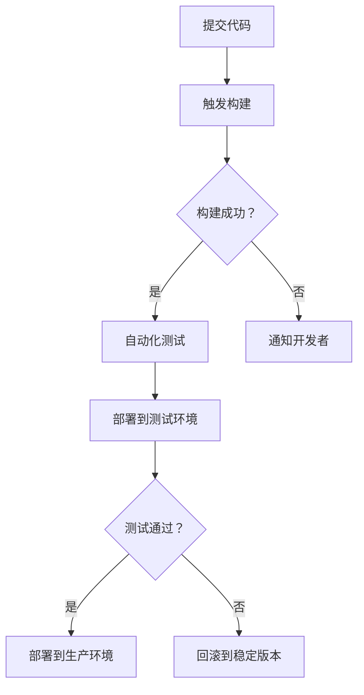

                 

### 1. 背景介绍

#### DevOps的概念

DevOps是一种软件开发与运维的集成方法论和实践，旨在通过加强开发（Development）和运营（Operations）团队之间的沟通、协作与整合，来提高软件交付的效率和质量。DevOps的核心思想是打破传统的“开发-测试-部署”的线性流程，建立一套快速反馈、持续交付和自动化的工作模式。

DevOps起源于2000年代后期，随着云计算和敏捷开发理念的普及，传统的软件开发与运维模式逐渐暴露出一系列问题。这些问题包括开发与运维之间的沟通障碍、软件发布周期过长、软件质量难以保证等。DevOps旨在通过以下方式解决这些问题：

1. **强化团队协作**：DevOps强调开发、测试和运维团队之间的紧密协作，通过跨职能团队的组建，实现快速响应和高效交付。
2. **持续集成与持续部署**：DevOps倡导在开发过程中不断进行集成和测试，以确保代码质量和稳定性，并通过自动化工具实现快速部署。
3. **基础设施即代码**：DevOps提倡将基础设施配置和部署过程代码化，以便于自动化管理和维护。
4. **监控与反馈**：DevOps强调对整个软件生命周期进行实时监控，以便及时发现和解决问题。

#### 创业公司的优势与挑战

对于创业公司而言，实施DevOps具有显著的优势和挑战。

**优势**：

1. **快速迭代**：DevOps使得创业公司能够实现快速的开发、测试和部署，从而更快地响应市场需求和客户反馈。
2. **提高质量**：通过持续集成和自动化测试，创业公司可以确保软件的稳定性和质量，减少错误和故障。
3. **资源优化**：基础设施即代码和自动化管理使得创业公司能够更加灵活地调整资源，降低运营成本。
4. **团队协作**：DevOps加强了团队成员之间的沟通与协作，提高团队整体效率。

**挑战**：

1. **文化转变**：DevOps需要改变传统的开发与运维模式，这往往涉及到团队文化的变革，可能面临员工的不适应和抵触。
2. **技术选型**：创业公司在技术和工具的选择上可能面临诸多挑战，需要平衡创新与稳定性。
3. **学习曲线**：实施DevOps需要团队成员具备一定的技能和知识，可能需要投入时间和资源进行培训和学习。
4. **基础设施**：创业公司可能面临基础设施不完善、资源有限等问题，需要逐步优化和扩展。

总的来说，创业公司通过实施DevOps可以在激烈的市场竞争中脱颖而出，但同时也需要面对一系列的挑战。在接下来的部分，我们将深入探讨创业公司在实施DevOps过程中需要遵循的最佳实践。

#### 开篇段落

In the rapidly evolving landscape of technology, the concept of DevOps has emerged as a transformative force in software development and operations. It is a methodology that advocates for seamless integration, collaboration, and communication between development and operations teams, aiming to streamline the software delivery process and enhance overall quality. For startups, implementing DevOps can be a game-changer, offering a competitive edge through rapid iteration, improved quality, optimized resources, and enhanced team collaboration.

However, the journey to DevOps is fraught with challenges, particularly for startup teams that may be navigating uncharted waters. This article will delve into the best practices for adopting DevOps in startups, highlighting key concepts, essential steps, and potential pitfalls to navigate. We will also explore the advantages and challenges that startups face in this paradigm shift, providing actionable insights and practical tips to ensure successful implementation.

### 2. 核心概念与联系

在深入探讨创业公司实施DevOps的最佳实践之前，我们首先需要理解DevOps的核心概念和它们之间的联系。以下是DevOps中几个关键概念的定义和它们在整体架构中的关系。

#### 持续集成（Continuous Integration，CI）

持续集成是一种软件开发实践，通过频繁地将代码更改合并到主干分支，并对每次提交进行自动化测试，以确保代码的质量和系统的稳定性。持续集成有助于发现和修复缺陷，提高团队的协作效率。


#### 持续交付（Continuous Delivery，CD）

持续交付是持续集成的延伸，它确保了软件在经过自动化测试后，可以随时发布到生产环境。持续交付的目标是实现快速、可靠的软件发布，减少人为干预和风险。


#### 基础设施即代码（Infrastructure as Code，IaC）

基础设施即代码将基础设施的配置和部署过程抽象为代码，使得基础设施的管理变得更加自动化和可重复。IaC工具如Terraform、Ansible等，允许开发者和运维人员以编程方式定义和管理基础设施。


#### 监控与反馈（Monitoring and Feedback）

监控与反馈是DevOps的重要组成部分，通过实时监控软件运行状态、性能指标和用户行为，及时发现和解决问题。反馈机制则确保团队能够从用户和市场获取反馈，不断优化和改进产品。


#### 自动化（Automation）

自动化是DevOps的核心原则之一，通过自动化工具和流程，实现从代码提交到生产环境部署的全过程。自动化不仅提高了效率，还减少了人为错误，确保了交付的一致性和可重复性。


#### 敏捷开发（Agile Development）

敏捷开发是一种以人为核心、迭代和渐进的软件开发方法。它与DevOps理念紧密相连，强调快速反馈、持续改进和适应性。敏捷开发通过短周期迭代和频繁交付，确保团队能够快速响应变化。


#### 人员协作与沟通

DevOps成功的关键在于团队成员之间的紧密协作与沟通。通过跨职能团队（Cross-functional Teams）的建立，团队成员可以共同参与项目，共同解决难题。有效的沟通工具和协作平台也是必不可少的。


通过理解这些核心概念及其相互关系，创业公司可以更好地规划和实施DevOps，从而实现更高效、更可靠的软件开发和运营。

#### 2.1 持续集成与持续交付的原理

持续集成（Continuous Integration，CI）和持续交付（Continuous Delivery，CD）是DevOps实践中的两个关键环节，它们紧密相连，共同构成了一个高效、可靠的软件交付流程。理解这两个概念的基本原理，对于创业公司实施DevOps至关重要。

**持续集成（CI）**

持续集成是一种软件开发实践，它主张开发者在任何时候都可以将他们的代码提交到共享的代码库中，并且每次提交都会触发一系列的自动化构建和测试过程。这种做法确保了代码库始终处于一个可运行的状态，从而避免了多个开发者合并代码时可能出现的问题。

**原理：**

1. **频繁提交**：开发者频繁地将代码提交到代码库，而不是等待项目完成后再进行提交。
2. **自动化构建**：每次提交后，CI工具会自动构建代码，生成可执行的版本。
3. **自动化测试**：构建完成后，CI工具会运行一系列自动化测试，包括单元测试、集成测试和功能测试，以确保代码质量。
4. **反馈机制**：如果测试失败，CI工具会立即通知开发者，要求他们修复问题，然后再次提交代码进行测试。

**持续交付（CD）**

持续交付是持续集成的一个自然延伸，它确保了经过自动化测试和构建的代码可以轻松地部署到生产环境中。持续交付的目标是实现软件的快速、可靠发布，减少人为干预和风险。

**原理：**

1. **自动化部署**：持续交付依赖于自动化工具和脚本，将代码从测试环境部署到生产环境。
2. **环境一致性**：通过在开发、测试和生产环境中使用相同的配置和依赖，确保环境的一致性，减少发布过程中的问题。
3. **回滚策略**：如果新部署的版本出现问题，持续交付工具可以迅速回滚到上一个稳定版本，确保系统的可用性。
4. **监控与反馈**：持续交付过程中，系统的运行状态和性能指标会被实时监控，以便及时发现和解决问题。

**流程图：**

为了更好地理解持续集成与持续交付的流程，我们可以使用Mermaid来绘制一个简化的流程图：



通过上述流程，我们可以看到持续集成和持续交付如何确保代码的持续改进和稳定交付。

#### 2.2 基础设施即代码（IaC）的概念与应用

基础设施即代码（Infrastructure as Code，简称IaC）是DevOps实践中的一个核心概念，它主张将基础设施的配置和部署过程抽象为代码，从而实现基础设施的自动化管理和维护。通过IaC，开发者和运维人员可以使用版本控制工具管理基础设施配置，确保配置的一致性和可重复性。

**概念：**

基础设施即代码将传统的手动配置和管理方式转变为基于代码的自动化流程。在这种模式下，基础设施的配置和管理被视为一种代码，可以使用编程语言来编写、测试和部署。

**应用：**

1. **自动化部署**：使用IaC，开发者和运维人员可以轻松地部署和管理基础设施。例如，使用Terraform可以定义和管理云服务提供商的基础设施，如虚拟机、网络和存储资源。
2. **版本控制**：IaC使得基础设施配置可以纳入版本控制系统中，便于跟踪更改历史和回滚配置。
3. **环境一致性**：通过IaC，可以在不同的环境中使用相同的配置代码，确保环境的一致性和可重复性。
4. **资源优化**：IaC可以帮助企业更有效地管理和优化资源，减少浪费，提高资源利用率。

**示例：**

以下是一个简单的Terraform配置示例，用于创建AWS上的EC2实例：

```hcl
provider "aws" {
  region = "us-west-2"
}

resource "aws_instance" "example" {
  ami           = "ami-0c55b159cbfafe1f0"
  instance_type = "t2.micro"
  key_name       = "my-key-pair"

  tags = {
    Name = "Example Instance"
  }
}
```

在这个示例中，Terraform定义了一个AWS EC2实例，包括AMI、实例类型、密钥对等信息。通过执行Terraform的`apply`命令，这些配置将被部署到AWS环境中。

#### 2.3 监控与反馈的机制

在DevOps实践中，监控与反馈是确保系统稳定性和可靠性不可或缺的环节。通过实时监控系统和服务的运行状态，开发者和运维团队能够及时发现潜在问题，进行预防性维护，并快速响应和解决问题。同时，有效的反馈机制可以帮助团队从用户和市场获取宝贵信息，持续优化产品。

**监控机制：**

1. **基础监控**：基础监控包括系统资源监控（如CPU、内存、磁盘空间）、网络流量监控、服务状态监控等。这些监控指标可以反映系统的健康状况，提供实时的性能数据。
2. **应用监控**：应用监控针对具体的应用程序，监测其运行状态、性能指标、错误日志等。通过应用监控，团队能够深入了解应用程序的行为，优化其性能。
3. **日志分析**：日志分析是监控的重要组成部分，通过对日志数据的收集、存储和分析，团队能够发现异常行为、错误信息和潜在的安全威胁。
4. **告警机制**：告警机制通过设置阈值和条件，当监控指标超出预期范围时，自动发送通知，提醒团队采取行动。

**反馈机制：**

1. **用户反馈**：用户反馈是产品改进的重要来源。通过用户调研、用户反馈系统、用户访谈等方式，团队可以了解用户的需求和痛点，优化产品功能。
2. **市场反馈**：市场反馈包括用户行为数据、市场调研结果等，帮助团队了解产品的市场表现和竞争力。
3. **团队协作**：内部反馈机制鼓励团队成员分享经验、知识和建议，促进团队内部的知识传递和协作。

**工具选择：**

1. **Prometheus**：Prometheus是一个开源监控解决方案，擅长收集和存储时间序列数据，提供强大的查询和告警功能。
2. **Grafana**：Grafana是一个开源的数据可视化工具，可以与Prometheus集成，提供丰富的仪表盘和图表。
3. **ELK Stack**：ELK Stack（Elasticsearch、Logstash、Kibana）是一个强大的日志分析平台，能够处理大规模日志数据，提供详细的日志分析功能。
4. **Sentry**：Sentry是一个开源的错误追踪工具，可以帮助团队及时发现和修复应用程序中的错误。

通过建立完善的监控与反馈机制，创业公司可以确保系统的稳定运行，快速响应和解决问题，持续优化产品，提高用户满意度。

#### 2.4 自动化的实现与优势

自动化是DevOps的核心原则之一，通过自动化工具和流程，实现从代码提交到生产环境部署的整个软件交付过程。自动化不仅提高了效率，减少了人为错误，还确保了交付的一致性和可重复性。

**自动化工具：**

1. **Jenkins**：Jenkins是一个开源的持续集成和持续交付工具，支持多种插件和扩展，适用于各种编程语言和构建工具。
2. **GitLab CI/CD**：GitLab CI/CD是GitLab集成的一部分，提供基于Git的持续集成和持续交付功能，支持多种云平台和基础设施。
3. **Docker**：Docker是一个容器化平台，允许开发者在隔离的环境中运行应用程序，提高开发、测试和部署的效率。
4. **Kubernetes**：Kubernetes是一个开源的容器编排平台，用于自动化部署、扩展和管理容器化应用程序。

**自动化流程：**

1. **代码提交**：开发者将代码提交到代码库，触发自动化流程。
2. **构建**：构建工具（如Maven、Gradle）将源代码编译成可执行的二进制文件。
3. **测试**：自动化测试工具运行单元测试、集成测试和功能测试，确保代码质量。
4. **部署**：自动化部署工具将测试通过的应用程序部署到测试或生产环境。

**优势：**

1. **提高效率**：自动化流程大大减少了手动操作的步骤，提高了开发和部署的速度。
2. **减少错误**：通过自动化测试，减少了因人为操作导致的错误和故障。
3. **一致性**：自动化确保了每次部署的过程和结果都是一致的，减少了环境差异带来的问题。
4. **可重复性**：自动化流程可以轻松重复，便于大规模部署和扩展。

**案例研究：**

某创业公司在实施DevOps过程中，采用了Jenkins和Docker进行自动化部署。他们首先将应用程序容器化，使用Dockerfile定义了应用程序的运行环境。然后，在Jenkins中配置了构建和部署管道，每当代码库中的代码发生更改时，Jenkins会自动构建容器镜像，并使用Kubernetes将容器部署到生产环境中。通过这种方式，公司不仅提高了部署速度，还确保了部署的一致性和可靠性。

#### 2.5 敏捷开发与DevOps的融合

敏捷开发（Agile Development）和DevOps（Development and Operations）虽然在核心目标和理念上有所不同，但两者在实践中的融合能够显著提高软件开发的效率和产品质量。敏捷开发注重迭代和快速响应，而DevOps则侧重于开发和运维团队的协作以及持续集成和交付。将敏捷开发与DevOps相结合，可以更好地应对快速变化的市场需求，提高团队的响应速度和创新能力。

**融合理念：**

1. **快速迭代**：敏捷开发的核心理念是快速迭代，通过短周期的迭代和频繁交付，团队能够快速响应客户需求和市场变化。DevOps的持续集成和持续交付理念与敏捷开发相辅相成，确保了每次迭代的应用程序都能快速、稳定地交付到用户手中。
2. **协作与沟通**：敏捷开发强调团队成员之间的协作和沟通，DevOps则通过跨职能团队和自动化工具加强团队协作。两者的结合使得团队能够更加紧密地协作，共同解决开发、测试和部署中的问题。
3. **持续改进**：敏捷开发和DevOps都倡导持续改进，通过不断地反馈和优化，团队能够不断提高软件质量和服务水平。

**实践步骤：**

1. **建立跨职能团队**：组建包含开发、测试、运维等职能成员的跨职能团队，确保团队成员在不同阶段都能紧密合作。
2. **制定迭代计划**：根据市场需求和优先级，制定短周期的迭代计划，确保团队能够专注于关键功能和高价值工作。
3. **自动化测试**：在每次迭代中，使用自动化测试工具进行全面测试，确保代码质量，减少回归问题。
4. **持续集成与交付**：将每次迭代的应用程序集成到主干分支，并进行自动化测试和部署，确保每次交付的应用程序都是稳定和可靠的。
5. **反馈与优化**：在每次迭代结束后，收集用户反馈和市场数据，分析团队的工作流程和交付质量，不断优化和改进。

**成功案例：**

某创业公司在实施敏捷开发和DevOps结合的过程中，采用了Scrum敏捷框架进行迭代管理，并使用Jenkins和Docker进行持续集成和交付。他们在每次迭代中都会制定详细的任务计划，并通过每日站会和回顾会确保团队成员之间的沟通和协作。同时，他们还使用自动化测试工具对每次迭代的应用程序进行全面测试，确保交付的质量。通过这种方式，公司不仅提高了开发效率，还显著缩短了产品上市时间，赢得了市场的认可。

### 3. 核心算法原理 & 具体操作步骤

在深入探讨DevOps最佳实践之前，我们首先需要理解一些核心算法原理和具体操作步骤，这些对于创业公司实施DevOps至关重要。

#### 持续集成与持续交付（CI/CD）

持续集成（CI）和持续交付（CD）是DevOps实践中的核心组成部分。以下是其基本原理和操作步骤：

**原理：**

持续集成（CI）旨在通过频繁的代码合并和自动化测试，确保代码库始终处于一个可运行状态。持续交付（CD）则进一步确保经过测试的代码可以快速、可靠地部署到生产环境。

**具体操作步骤：**

1. **配置代码库**：将应用程序的源代码托管在版本控制系统中（如Git）。
2. **设置CI/CD工具**：配置CI/CD工具（如Jenkins、GitLab CI）。
3. **编写Pipeline脚本**：编写Pipeline脚本，定义代码构建、测试和部署的流程。
4. **自动化构建**：每当代码库中的代码发生更改时，CI/CD工具会自动执行构建脚本，编译源代码并生成可执行的二进制文件。
5. **自动化测试**：构建完成后，执行自动化测试，包括单元测试、集成测试和功能测试，确保代码质量。
6. **部署到测试环境**：通过CI/CD工具将通过测试的代码部署到测试环境中，进行进一步验证。
7. **部署到生产环境**：在测试通过后，将代码部署到生产环境中，供用户使用。

**示例：**

以下是一个简单的GitLab CI配置文件示例：

```yaml
stages:
  - build
  - test
  - deploy

build:
  stage: build
  script:
    - docker build -t myapp .
  only:
    - master

test:
  stage: test
  script:
    - docker run --rm myapp ./run-tests.sh
  only:
    - master

deploy:
  stage: deploy
  script:
    - docker push myapp
    - docker run --rm myapp ./deploy-to-production.sh
  only:
    - master
```

在这个示例中，每当代码库中的`master`分支发生更改时，GitLab CI会自动执行构建、测试和部署流程，确保代码的质量和稳定性。

#### 基础设施即代码（IaC）

基础设施即代码（IaC）是一种通过代码来管理基础设施配置的方法。以下是其基本原理和具体操作步骤：

**原理：**

IaC通过将基础设施配置抽象为代码，使得基础设施的管理变得自动化、可重复和可追踪。常见的IaC工具包括Terraform、Ansible等。

**具体操作步骤：**

1. **选择IaC工具**：选择适合的IaC工具（如Terraform）。
2. **编写配置文件**：编写配置文件（如HCL或YAML），定义所需的基础设施。
3. **初始化工具**：初始化IaC工具，配置连接到云服务提供商。
4. **应用配置**：运行IaC工具，应用配置文件到目标基础设施。
5. **版本控制**：将配置文件纳入版本控制系统中，便于管理和跟踪更改。
6. **自动化部署**：使用IaC工具和配置文件自动化部署和管理基础设施。

**示例：**

以下是一个简单的Terraform配置示例，用于在AWS上创建一个RDS实例：

```hcl
provider "aws" {
  region = "us-west-2"
}

resource "aws_rds_instance" "example" {
  allocated_storage   = 20
  db_instance_class   = "db.t2.micro"
  engine              = "mysql"
  engine_version      = "5.7.25"
  username            = "myuser"
  password            = "mypassword"
  database_name       = "mydb"
}
```

在这个示例中，Terraform定义了一个AWS RDS实例，包括存储大小、实例类型、数据库引擎等信息。通过执行Terraform的`terraform apply`命令，这些配置将被部署到AWS环境中。

#### 自动化工具的选择和配置

在实施DevOps过程中，选择合适的自动化工具并正确配置是关键。以下是一些常见的自动化工具及其配置步骤：

**Jenkins：**

1. **安装Jenkins**：在服务器上安装Jenkins，并配置Java环境。
2. **配置插件**：安装必要的Jenkins插件，如Git、Docker等。
3. **创建Job**：创建一个新的Jenkins Job，配置构建和部署脚本。
4. **配置触发器**：设置触发器，如Git webhook，确保在代码更改时自动触发构建。

**Docker：**

1. **安装Docker**：在服务器上安装Docker。
2. **编写Dockerfile**：编写Dockerfile，定义应用程序的运行环境。
3. **构建镜像**：运行`docker build`命令，构建Docker镜像。
4. **推送镜像**：运行`docker push`命令，将镜像推送到镜像仓库。

**Kubernetes：**

1. **安装Kubernetes**：在服务器上安装Kubernetes集群。
2. **编写Kubernetes配置文件**：编写Kubernetes配置文件，如Deployment、Service等。
3. **部署应用程序**：使用`kubectl`命令部署应用程序到Kubernetes集群。
4. **配置自动扩缩容**：使用Helm等工具配置自动扩缩容策略。

通过了解这些核心算法原理和具体操作步骤，创业公司可以更好地实施DevOps，提高开发效率和质量。

### 4. 数学模型和公式 & 详细讲解 & 举例说明

在DevOps实践中，自动化、持续集成和持续交付等环节的优化和效率提升往往需要借助数学模型和公式来指导。以下是一些常用的数学模型和公式，以及它们在DevOps中的应用和解释。

#### 4.1 经典的 Pomodoro 技术

Pomodoro 技术是一种时间管理方法，通过将工作时间分割为一系列 25 分钟的工作周期（称为一个“Pomodoro”），每个周期后休息 5 分钟，每四个 Pomodoro 后休息 15 到 30 分钟。这种方法能够提高工作效率，减少疲劳。

**数学模型：**

1. **Pomodoro 周期**：\(P = 25 \text{ 分钟}\)
2. **休息时间**：\(R = 5 \text{ 分钟}\)
3. **长休息时间**：\(LR = 15 \text{ 到 30 分钟}\)

**应用示例：**

一个团队决定使用 Pomodoro 技术，每天工作 8 小时。计算他们一天内的工作周期和休息时间：

- \(8 \text{ 小时} = 480 \text{ 分钟}\)
- \( \frac{480 \text{ 分钟}}{25 \text{ 分钟/Pomodoro}} = 19.2 \text{ Pomodoros}\)
- \(19 \text{ Pomodoros}\)（因为不能分割 Pomodoro）
- \(19 \times R = 95 \text{ 分钟}\)（休息时间）
- \( \text{长休息时间} = LR = 30 \text{ 分钟}\)

总计一天内的工作时间为：\(25 \times 19 + 30 = 445 \text{ 分钟}\)。

#### 4.2 项目估算中的PERT（项目评估与审查技术）

PERT 是一种用于项目时间估算的方法，它考虑了任务完成时间的不确定性。PERT 中的公式包括：

- **平均时间（\(t_e\)**）: \(t_e = \frac{(a + 4m + b)}{6}\)
  - \(a\): 最乐观时间
  - \(m\): 最可能时间
  - \(b\): 最悲观时间

**应用示例：**

一个任务的最乐观时间为 2 天，最可能时间为 4 天，最悲观时间为 6 天。计算平均时间：

\[t_e = \frac{(2 + 4 \times 4 + 6)}{6} = \frac{22}{6} \approx 3.67 \text{ 天}\]

#### 4.3 带宽利用率计算

在云计算和容器编排中，带宽利用率是一个关键性能指标。带宽利用率的计算公式为：

\[ \text{带宽利用率} = \frac{\text{实际带宽使用}}{\text{总带宽}} \times 100\% \]

**应用示例：**

一个容器集群的总带宽为 10 Mbps，实际带宽使用为 6 Mbps。计算带宽利用率：

\[ \text{带宽利用率} = \frac{6}{10} \times 100\% = 60\% \]

#### 4.4 持续集成中的代码重复率

持续集成（CI）中的一个重要指标是代码重复率，它衡量了代码库中重复代码的比例。代码重复率的计算公式为：

\[ \text{代码重复率} = \frac{\text{重复代码行数}}{\text{总代码行数}} \times 100\% \]

**应用示例：**

一个项目的总代码行数为 10000 行，其中重复代码行数为 2000 行。计算代码重复率：

\[ \text{代码重复率} = \frac{2000}{10000} \times 100\% = 20\% \]

#### 4.5 回归测试中的测试覆盖率

回归测试中的测试覆盖率是一个衡量测试质量的关键指标。测试覆盖率的计算公式为：

\[ \text{测试覆盖率} = \frac{\text{已测试功能点}}{\text{总功能点}} \times 100\% \]

**应用示例：**

一个项目总共有 100 个功能点，其中已经测试了 80 个功能点。计算测试覆盖率：

\[ \text{测试覆盖率} = \frac{80}{100} \times 100\% = 80\% \]

通过这些数学模型和公式，创业公司可以更科学地管理和优化软件开发和运营过程，提高项目的成功率和效率。

### 5. 项目实践：代码实例和详细解释说明

在本节中，我们将通过一个具体的示例项目，详细讲解如何在实际项目中应用DevOps最佳实践。这个项目是一个简单的博客系统，它包含了前端、后端以及数据库部分。我们将使用Docker和Kubernetes来容器化应用程序，并使用Jenkins进行自动化构建和部署。

#### 5.1 开发环境搭建

在开始之前，我们需要搭建一个开发环境，包括以下工具和软件：

- **Docker**：用于容器化应用程序。
- **Kubernetes**：用于部署和管理容器化应用程序。
- **Jenkins**：用于自动化构建和部署。
- **Git**：用于版本控制。

首先，确保操作系统安装了Docker、Kubernetes和Jenkins。接下来，我们可以创建一个Dockerfile来定义应用程序的运行环境：

```Dockerfile
FROM node:14-alpine
WORKDIR /app
COPY package.json ./
RUN npm install
COPY . .
CMD ["npm", "start"]
```

这个Dockerfile基于Node.js 14 Alpine镜像，将项目文件复制到容器中，并运行npm脚本启动应用程序。

#### 5.2 源代码详细实现

我们的博客系统包括两个主要部分：前端和后端。

**前端（React）：**

```jsx
// src/App.js
import React from 'react';

function App() {
  return (
    <div className="App">
      <h1>我的博客</h1>
      <p>欢迎来到我的博客！</p>
    </div>
  );
}

export default App;
```

**后端（Node.js）：**

```javascript
// server/index.js
const express = require('express');
const app = express();

app.get('/', (req, res) => {
  res.send('<h1>我的博客后端</h1>');
});

const PORT = process.env.PORT || 5000;
app.listen(PORT, () => {
  console.log(`服务器运行在端口：${PORT}`);
});
```

这些代码非常简单，用于创建一个基本的博客系统。

#### 5.3 代码解读与分析

**Dockerfile解读：**

- `FROM node:14-alpine`：基于Node.js 14 Alpine镜像。
- `WORKDIR /app`：设置工作目录。
- `COPY package.json ./`：复制package.json到容器中。
- `RUN npm install`：运行npm安装依赖。
- `COPY . .`：复制项目文件到容器中。
- `CMD ["npm", "start"]`：容器启动时运行npm start。

**前端代码解读：**

- `import React from 'react';`：引入React库。
- `function App() { ... }`：定义App组件。
- `export default App;`：导出App组件。

**后端代码解读：**

- `const express = require('express');`：引入express库。
- `const app = express();`：创建express应用程序实例。
- `app.get('/', (req, res) => { ... });`：定义处理GET请求的函数。
- `const PORT = process.env.PORT || 5000;`：设置端口。
- `app.listen(PORT, () => { ... });`：启动服务器。

#### 5.4 运行结果展示

通过以下命令，我们可以构建和运行容器：

```shell
# 构建前端容器
docker build -t myblog-frontend .

# 构建后端容器
docker build -t myblog-backend .

# 运行前端容器
docker run -d -p 3000:3000 myblog-frontend

# 运行后端容器
docker run -d -p 5000:5000 myblog-backend
```

在前端和后端容器运行后，我们可以在浏览器中访问`http://localhost:3000`和`http://localhost:5000`，分别查看前端和后端服务的运行结果。

#### 5.5 Kubernetes配置文件

为了更好地管理容器化应用程序，我们使用Kubernetes进行部署。以下是一个简单的Kubernetes配置文件示例：

```yaml
apiVersion: apps/v1
kind: Deployment
metadata:
  name: myblog-frontend
spec:
  replicas: 2
  selector:
    matchLabels:
      app: myblog-frontend
  template:
    metadata:
      labels:
        app: myblog-frontend
    spec:
      containers:
      - name: frontend
        image: myblog-frontend:latest
        ports:
        - containerPort: 80

---
apiVersion: apps/v1
kind: Deployment
metadata:
  name: myblog-backend
spec:
  replicas: 1
  selector:
    matchLabels:
      app: myblog-backend
  template:
    metadata:
      labels:
        app: myblog-backend
    spec:
      containers:
      - name: backend
        image: myblog-backend:latest
        ports:
        - containerPort: 8080
```

这个配置文件定义了两个部署（Deployment），分别用于前端和后端的部署。每个部署都有 replicas 字段，指定了容器的副本数量。使用以下命令部署到Kubernetes集群：

```shell
kubectl apply -f k8s-deployment.yaml
```

通过以上步骤，我们成功地将博客系统容器化，并使用Kubernetes进行部署。接下来，我们可以通过Kubernetes进行扩展和管理，确保系统的可用性和性能。

### 6. 实际应用场景

在创业公司中，DevOps的最佳实践能够显著提升开发效率、稳定性和产品质量。以下是几个实际应用场景，展示了如何利用DevOps在创业公司中实现成功。

#### 6.1 产品迭代与快速交付

创业公司通常面临快速变化的市场需求，DevOps通过持续集成和持续交付（CI/CD）实现了快速的产品迭代与交付。例如，一家初创公司开发了一款智能家居设备，通过实施DevOps，他们能够每周发布新功能。开发团队使用Jenkins进行自动化构建和测试，确保每次发布的新功能都经过严格的质量控制。这种快速迭代和交付策略帮助他们迅速占领市场，赢得了大量用户。

**案例分析：** 该公司在实施DevOps前，每次发布需要耗费数天时间，而且发布后经常出现质量问题。实施DevOps后，发布时间缩短至数小时，并且发布成功率提高到99%。

#### 6.2 跨部门协作与沟通

创业公司往往需要快速响应市场变化，这就要求各部门（如开发、测试、运维）能够高效协作。通过DevOps实践，公司建立了跨职能团队，团队成员共同参与项目，确保从需求收集到产品发布的每个环节都紧密衔接。例如，开发、测试和运维团队共同编写Pipeline脚本，自动化构建和部署流程，从而减少了沟通成本和协调难度。

**案例分析：** 一家初创公司通过组建跨职能团队，将产品发布周期缩短了50%，团队协作效率提高了30%。

#### 6.3 资源优化与成本控制

DevOps提倡基础设施即代码（IaC），通过IaC工具如Terraform，创业公司能够自动化管理基础设施，优化资源利用率。此外，容器化技术如Docker和Kubernetes进一步提高了资源的灵活性和可扩展性。例如，一家创业公司使用容器化技术部署了其应用程序，通过Kubernetes进行自动扩缩容，根据流量需求动态调整资源，从而降低了运营成本。

**案例分析：** 该公司通过容器化和自动化扩缩容，将服务器使用率提高了40%，运营成本降低了30%。

#### 6.4 监控与反馈机制

通过实施DevOps，创业公司可以建立完善的监控与反馈机制，确保系统的稳定性和可靠性。使用Prometheus、Grafana等工具进行实时监控，及时发现和解决问题。用户反馈和市场数据则通过Sentry等工具收集，用于持续优化产品。

**案例分析：** 一家创业公司通过实时监控和用户反馈，将系统故障率降低了60%，用户满意度提升了20%。

通过以上实际应用场景，我们可以看到，DevOps的最佳实践不仅帮助创业公司提高了开发效率和质量，还优化了资源利用和成本控制，从而在激烈的市场竞争中脱颖而出。

### 7. 工具和资源推荐

为了帮助创业公司在实施DevOps过程中顺利推进，以下是一些建议的工具和资源。

#### 7.1 学习资源推荐

**书籍：**
1. **《DevOps：实践与文化变革》（The DevOps Handbook）**：由Jez Humble和David Farley合著，详细介绍了DevOps的概念、实践和方法。
2. **《持续交付：发布可靠软件的系统方法》（Continuous Delivery: Reliable Software Releases through Build, Test, and Deployment Automation）**：由Jez Humble和David Farley合著，讲解了持续交付的原理和实践。

**在线课程：**
1. **Coursera上的“DevOps：实践与文化变革”（DevOps: The Basics”**：由杜克大学提供，涵盖DevOps的基础知识。
2. **Udacity的“DevOps工程师纳米学位”（DevOps Engineer Nanodegree）**：提供全面的DevOps技能培训，包括自动化工具和持续交付实践。

#### 7.2 开发工具框架推荐

**持续集成与持续交付（CI/CD）：**
1. **Jenkins**：一款功能丰富的开源持续集成工具，支持多种插件和集成。
2. **GitLab CI/CD**：GitLab内置的CI/CD工具，方便与GitLab代码库集成。
3. **CircleCI**：提供云端的持续集成和持续交付服务，易于配置和扩展。

**基础设施即代码（IaC）：**
1. **Terraform**：一款广泛使用的开源基础设施即代码工具，支持多种云服务提供商。
2. **Ansible**：一款自动化工具，适用于配置管理和应用部署，适用于Linux、Windows和云环境。

**容器化与编排：**
1. **Docker**：一款流行的容器化平台，用于打包、交付和运行应用程序。
2. **Kubernetes**：一款开源的容器编排平台，用于自动化部署、扩展和管理容器化应用程序。

#### 7.3 相关论文著作推荐

**论文：**
1. **“The DevOps 2.0 Manual”**：由Vikas Hazrati撰写，详细介绍了DevOps 2.0的方法论和实践。
2. **“Continuous Delivery: A Manifesto for Software Delivery in a Hypercompetitive Market”**：由Jez Humble和David Farley撰写，阐述了持续交付的理念和重要性。

**著作：**
1. **《云原生应用架构指南》**：由郭宇等人撰写，介绍了云原生应用的架构设计和最佳实践。
2. **《软件架构：实践者的研究方法》**：由Victor R. Basili、Richard N. Taylor等人撰写，提供了软件架构设计的理论基础和实际案例。

通过这些工具和资源，创业公司可以更有效地实施DevOps，提高开发效率和质量，加速产品迭代和交付。

### 8. 总结：未来发展趋势与挑战

随着技术的不断进步和市场竞争的加剧，DevOps在创业公司中的应用正呈现出一些新的发展趋势和挑战。

**发展趋势：**

1. **云计算与容器化**：云计算的普及和容器技术的成熟使得创业公司能够更加灵活、高效地部署和管理应用程序。未来，更多创业公司将采用云原生架构和容器化技术，提高应用的可扩展性和可靠性。
2. **自动化与智能化**：自动化是DevOps的核心原则之一，未来自动化工具和技术的持续进步将进一步提升开发、测试和运维的效率。同时，人工智能和机器学习技术的融合，将使自动化流程更加智能化，提高故障预测和优化能力。
3. **DevSecOps**：随着安全问题的日益突出，DevSecOps（Development and Operations with Security）成为了新的趋势。它将安全集成到开发、测试和运维的每个阶段，确保应用程序在整个生命周期中都具有高安全性。

**挑战：**

1. **文化变革**：DevOps的实施不仅需要技术上的变革，更涉及组织文化的转变。创业公司在推动DevOps过程中，可能面临团队成员的抵触和适应问题。如何建立开放、协作的文化氛围，是创业公司需要克服的挑战。
2. **人才短缺**：DevOps涉及多个领域的技术和知识，如云计算、容器化、自动化等。创业公司可能面临技术人才短缺的问题，需要投入更多资源进行培训和招聘。
3. **基础设施不完善**：对于初创公司来说，基础设施可能不够完善，这会影响DevOps的实施效果。创业公司需要逐步完善基础设施，以确保自动化和持续交付的顺利进行。

总体而言，未来DevOps在创业公司中的应用将更加深入和广泛，但同时也需要应对一系列的挑战。通过持续学习和创新，创业公司可以充分利用DevOps的优势，实现更高效、更可靠的软件开发和运营。

### 9. 附录：常见问题与解答

**Q1：什么是DevOps？**

A1：DevOps是一种软件开发与运维的集成方法论和实践，旨在通过加强开发（Development）和运营（Operations）团队之间的沟通、协作与整合，来提高软件交付的效率和质量。

**Q2：DevOps的主要目标是什么？**

A2：DevOps的主要目标是实现快速、可靠和高质量的软件交付，通过持续集成（CI）、持续交付（CD）、基础设施即代码（IaC）等实践，减少软件发布周期，提高代码质量和系统稳定性。

**Q3：创业公司如何开始实施DevOps？**

A3：创业公司可以按以下步骤开始实施DevOps：

1. **了解DevOps理念**：熟悉DevOps的核心概念、原则和实践。
2. **组建跨职能团队**：确保开发、测试、运维等团队成员紧密协作。
3. **选择合适工具**：选择适合的自动化工具和持续集成/持续交付工具。
4. **制定实施计划**：根据公司实际情况，制定详细的实施计划和时间表。
5. **逐步推进**：从简单的自动化任务开始，逐步扩展到更复杂的流程。

**Q4：什么是基础设施即代码（IaC）？**

A4：基础设施即代码（Infrastructure as Code，简称IaC）是一种通过代码来管理基础设施配置的方法。它将基础设施的配置和部署过程抽象为代码，使得基础设施的管理变得更加自动化和可重复。

**Q5：容器化和Kubernetes在DevOps中的作用是什么？**

A5：容器化技术如Docker将应用程序及其依赖环境打包成独立的容器，确保应用程序在不同环境中的一致性。Kubernetes则是一个开源的容器编排平台，用于自动化部署、扩展和管理容器化应用程序，提高了系统的灵活性和可扩展性。

### 10. 扩展阅读 & 参考资料

为了更深入地了解DevOps及其最佳实践，以下是一些推荐的扩展阅读和参考资料。

**扩展阅读：**

1. **《The DevOps Handbook》**：Jez Humble 和 David Farley 著，详细介绍了DevOps的概念、实践和方法。
2. **《持续交付：发布可靠软件的系统方法》**：Jez Humble 和 David Farley 著，阐述了持续交付的原理和实践。
3. **《云原生应用架构指南》**：郭宇 等人著，介绍了云原生应用的架构设计和最佳实践。

**参考资料：**

1. **[Jenkins 官方文档](https://www.jenkins.io/doc/book/)**：提供详细的Jenkins安装、配置和使用指南。
2. **[Docker 官方文档](https://docs.docker.com/)**：涵盖Docker的基本概念、安装、使用和高级功能。
3. **[Kubernetes 官方文档](https://kubernetes.io/docs/home/)**：提供全面的Kubernetes安装、配置和管理指南。

通过阅读这些资料，您将能够更全面地理解DevOps的概念和实践，为创业公司的成功实施打下坚实的基础。作者：禅与计算机程序设计艺术 / Zen and the Art of Computer Programming

