                 

### 背景介绍 Background Introduction

在当今快速发展的商业环境中，市场竞争日益激烈，企业需要不断优化其运营策略，以保持竞争力并实现可持续增长。动态定价策略作为现代商业战略的重要组成部分，已成为许多公司提升盈利能力、增强市场适应性的关键手段。

#### 动态定价策略的定义 Definition of Dynamic Pricing Strategy

动态定价策略，也被称为实时定价或弹性定价，是一种基于市场需求、供应情况、消费者行为以及其他相关因素，动态调整产品或服务价格的策略。与传统的静态定价策略（即价格在一段较长时间内固定不变）不同，动态定价策略能够实时响应市场变化，实现价格的灵活调整。

#### 动态定价的重要性 Importance of Dynamic Pricing

1. **提升盈利能力**：通过动态调整价格，企业可以在市场需求旺盛时提高价格，从而获取更高的利润；在市场需求低迷时降低价格，以刺激消费，减少库存压力。
   
2. **增加市场适应性**：动态定价策略使企业能够迅速应对市场变化，提高市场竞争力。例如，季节性商品在淡季降价促销，高峰期提高价格，以最大化利润。

3. **优化库存管理**：通过动态定价，企业能够更好地管理库存，避免过度库存和积压，从而降低成本。

4. **提升消费者体验**：动态定价策略可以提供更具个性化的价格，满足不同消费者的需求和支付意愿，从而提高消费者的满意度和忠诚度。

#### 动态定价的历史与发展 History and Development of Dynamic Pricing

动态定价策略并非现代商业的独创，其思想可以追溯到20世纪早期的邮轮定价。然而，随着互联网和大数据技术的发展，动态定价策略得到了迅速发展和广泛应用。

- **20世纪90年代**：随着电子商务的兴起，动态定价开始被更多企业采用。航空公司和酒店是率先使用动态定价策略的行业。

- **21世纪初**：随着大数据和人工智能技术的应用，动态定价策略变得更加精确和高效。许多企业开始利用这些技术来实时调整价格，以优化利润和库存管理。

- **当前**：动态定价策略已成为许多行业（如电子商务、共享经济、在线旅游等）的标准操作流程。随着技术的不断进步，动态定价策略将继续发展和完善。

### 动态定价策略的应用场景 Application Scenarios of Dynamic Pricing

1. **电子商务**：电子商务平台通过动态定价策略，根据用户的浏览历史、购买习惯和库存情况，实时调整商品价格。

2. **共享经济**：共享经济的典型代表如Uber和Airbnb，通过实时调整服务价格，以应对供需变化，提高资源利用效率。

3. **在线旅游**：在线旅游平台通过动态定价，根据季节、日期和预订情况调整酒店和机票价格，以满足不同消费者的需求。

4. **制造业**：制造业企业通过动态定价策略，根据市场需求和库存水平，调整产品的销售价格。

5. **金融服务**：金融机构如银行和保险公司，通过动态定价策略，根据市场利率、风险水平和客户偏好，调整金融产品的价格。

### 本文结构 Overview of the Article

本文将首先介绍动态定价策略的核心概念与联系，包括基本原理、相关技术和实际应用场景。然后，我们将深入探讨核心算法原理，并详细讲解数学模型和公式。接下来，通过项目实践部分，我们将展示代码实例和详细解释说明。随后，文章将讨论动态定价策略的实际应用场景，并提供工具和资源推荐。最后，文章将总结动态定价策略的未来发展趋势与挑战，并附上常见问题与解答，以及扩展阅读与参考资料。

### 核心概念与联系 Core Concepts and Their Connections

动态定价策略的成功实施依赖于对核心概念和它们之间联系的理解。本节将详细介绍动态定价策略的核心概念，并利用Mermaid流程图展示这些概念之间的关联。

#### 1. 市场需求与价格 Market Demand and Price

市场需求是动态定价策略中最基础的概念之一。市场需求通常由消费者的购买意愿和购买能力决定。价格则是在市场中反映供需关系的指标。市场需求与价格之间的关系可以表述为需求函数，通常是一个关于价格的非线性函数，其中价格是自变量，需求量是因变量。

**Mermaid流程图：**

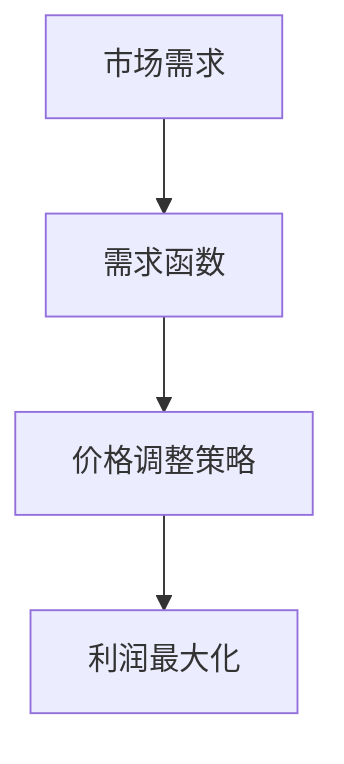

#### 2. 成本与利润 Costs and Profits

在动态定价策略中，成本和利润也是核心概念。成本包括生产成本、运营成本和营销成本等。利润则是收入减去成本后的余额。利润最大化是企业在实施动态定价策略时的主要目标。

**Mermaid流程图：**

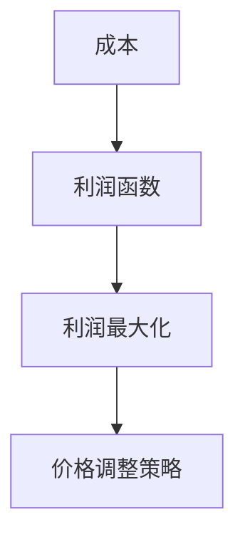

#### 3. 竞争环境 Competitive Environment

竞争环境是动态定价策略需要考虑的重要因素。企业在制定定价策略时，不仅要关注自身的产品和成本，还需要关注竞争对手的价格策略和市场行为。竞争环境可以影响市场需求和消费者行为，从而影响企业的定价决策。

**Mermaid流程图：**

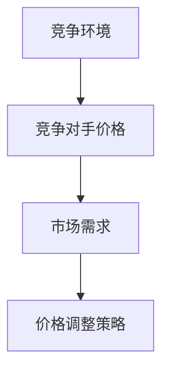

#### 4. 消费者行为 Consumer Behavior

消费者行为是动态定价策略中的关键因素。消费者的需求、购买意愿和支付能力会直接影响市场需求和价格。通过分析消费者行为，企业可以更好地制定定价策略，以满足不同消费者的需求。

**Mermaid流程图：**

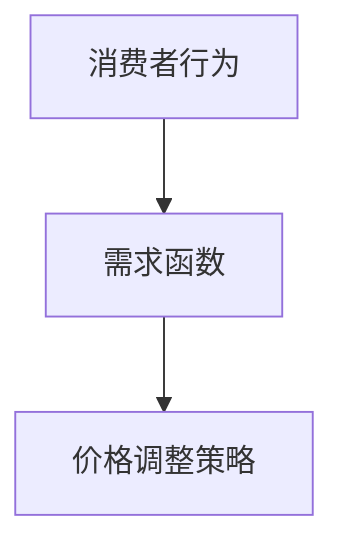

#### 5. 数据分析与预测 Data Analysis and Forecasting

数据分析与预测是动态定价策略的重要组成部分。企业通过收集和分析大量市场数据，如消费者行为、市场价格、库存情况等，预测未来的市场需求和价格变化，从而制定更科学的定价策略。

**Mermaid流程图：**

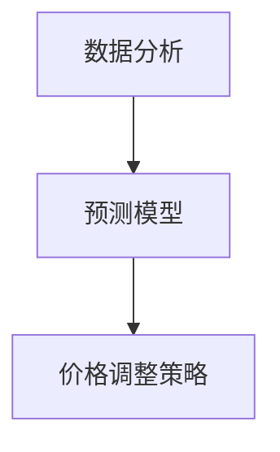

通过上述Mermaid流程图，我们可以清晰地看到动态定价策略中的核心概念及其相互之间的联系。这些概念共同构成了一个动态、复杂的系统，帮助企业实现利润最大化、市场适应性和消费者满意度。

### 核心算法原理 Core Algorithm Principles and Specific Operational Steps

在理解了动态定价策略的核心概念和它们之间的联系之后，接下来我们需要深入了解动态定价策略的核心算法原理及其具体操作步骤。这一部分将详细讨论如何通过算法实现动态定价，包括数据采集、处理、模型构建和价格调整的具体步骤。

#### 1. 数据采集 Data Collection

数据采集是动态定价策略的第一步。企业需要收集与市场相关的各种数据，包括但不限于：

- **消费者行为数据**：如浏览历史、购买记录、搜索关键词等。
- **市场价格数据**：包括竞争对手的价格变动、市场平均价格等。
- **库存数据**：包括库存量、库存周转率等。
- **市场环境数据**：如季节、天气、节假日等。

这些数据可以通过多种方式获取，如用户行为日志分析、第三方数据提供商、社交媒体监测等。企业需要建立一个高效的数据采集系统，确保数据的实时性和准确性。

**Mermaid流程图：**

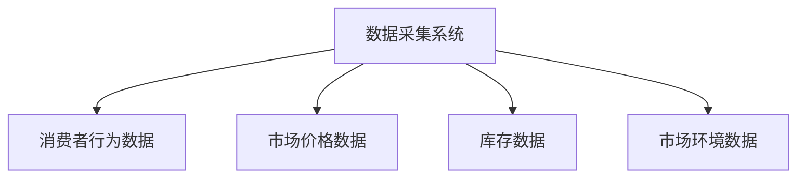

#### 2. 数据处理 Data Processing

收集到的数据通常是非结构化的，需要通过数据处理步骤进行清洗、转换和格式化，以便后续分析。数据处理包括以下几个步骤：

- **数据清洗**：去除重复数据、缺失数据和异常数据。
- **数据转换**：将数据转换为统一的格式和维度，如时间序列数据。
- **数据格式化**：将数据整理为适合算法分析的格式，如CSV、JSON等。

**Mermaid流程图：**

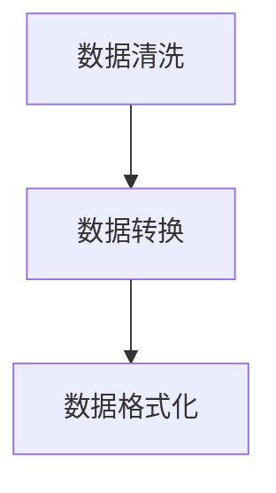

#### 3. 模型构建 Model Building

数据处理完成后，我们需要构建一个定价模型，用于预测市场需求和价格变化。常见的定价模型包括线性回归、决策树、神经网络等。以下是构建定价模型的基本步骤：

- **特征选择**：选择对定价影响较大的特征，如消费者购买频率、历史价格等。
- **模型训练**：使用历史数据训练模型，找到最佳参数。
- **模型评估**：评估模型的准确性和泛化能力，如通过交叉验证和A/B测试。

**Mermaid流程图：**

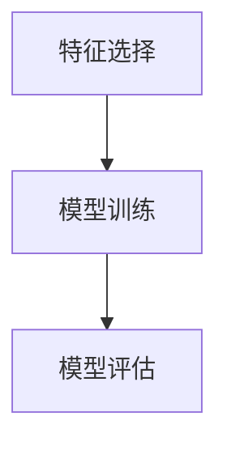

#### 4. 价格调整 Price Adjustment

模型构建完成后，我们需要根据预测结果进行价格调整。价格调整的具体步骤包括：

- **价格预测**：使用训练好的模型预测未来的市场需求和价格变化。
- **价格策略**：根据市场环境和竞争态势，制定相应的价格策略，如提高价格以获取更多利润，降低价格以刺激消费。
- **实时调整**：实时监控市场变化，根据预测结果和市场反馈，动态调整价格。

**Mermaid流程图：**

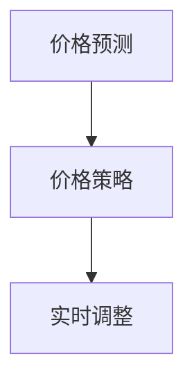

#### 5. 监控与优化 Monitoring and Optimization

动态定价策略需要不断监控和优化，以确保其有效性和适应性。监控与优化的具体步骤包括：

- **性能监控**：监控定价策略的性能指标，如利润率、库存周转率等。
- **反馈机制**：建立反馈机制，收集市场反馈，用于模型优化和策略调整。
- **持续优化**：根据监控和反馈结果，持续优化定价模型和策略，提高定价准确性。

**Mermaid流程图：**

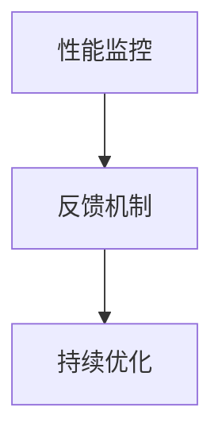

通过上述步骤，企业可以构建一个高效的动态定价策略，实现利润最大化、市场适应性和消费者满意度。在实际操作中，这些步骤需要紧密协作，形成闭环系统，以应对不断变化的市场环境。

### 数学模型和公式 Mathematical Models and Formulas with Detailed Explanations and Examples

在动态定价策略的实施过程中，数学模型和公式起着至关重要的作用。它们不仅能够帮助我们预测市场需求和价格变化，还能指导我们制定有效的价格调整策略。本节将详细讲解动态定价中的核心数学模型和公式，并通过具体实例进行说明。

#### 1. 需求函数 Demand Function

需求函数描述了市场需求量与价格之间的关系。假设市场需求量为 \( Q \)，价格为 \( P \)，则需求函数可以表示为：

\[ Q = f(P) \]

其中，\( f \) 是一个关于价格的非线性函数，通常可以用线性、二次或多项式函数来近似。

**实例：线性需求函数**

假设某商品的需求函数为线性函数，即：

\[ Q = 100 - P \]

其中，价格 \( P \) 的单位为元，需求量 \( Q \) 的单位为件。当价格 \( P \) 为10元时，需求量 \( Q \) 为90件；当价格 \( P \) 为20元时，需求量 \( Q \) 为80件。

**Mermaid流程图：**

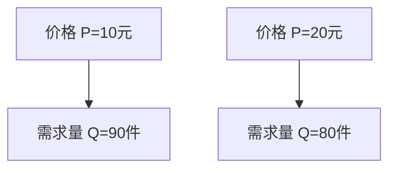

#### 2. 利润函数 Profit Function

利润函数是收入减去成本后的余额。假设收入为 \( R \)，成本为 \( C \)，则利润函数可以表示为：

\[ \Pi = R - C \]

其中，收入 \( R \) 可以通过需求函数和价格 \( P \) 计算得出，成本 \( C \) 包括生产成本、运营成本和营销成本等。

**实例：线性利润函数**

假设某商品的需求函数为 \( Q = 100 - P \)，每件商品的生产成本为10元。则利润函数为：

\[ \Pi = (100 - P)P - 10(100 - P) \]

\[ \Pi = 100P - P^2 - 1000 + 10P \]

\[ \Pi = 110P - P^2 - 1000 \]

当价格 \( P \) 为10元时，利润 \( \Pi \) 为0；当价格 \( P \) 为20元时，利润 \( \Pi \) 为900元。

**Mermaid流程图：**

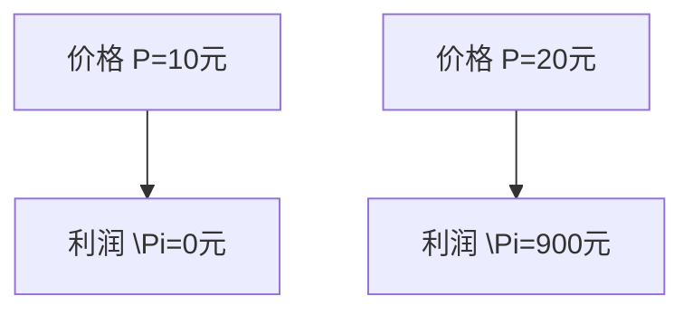

#### 3. 线性规划 Linear Programming

线性规划是一种数学方法，用于在给定约束条件下，找到使目标函数最大化或最小化的最优解。在动态定价策略中，线性规划可以用于确定最优价格，以最大化利润或满足其他目标。

**实例：线性规划求解最优价格**

假设某商品的需求函数为 \( Q = 100 - P \)，成本函数为 \( C = 10Q \)，目标是最小化成本。则线性规划问题可以表示为：

\[ \text{minimize} \ C = 10Q \]

\[ \text{subject to} \ Q = 100 - P \]

\[ Q \geq 0 \]

\[ P \geq 0 \]

使用线性规划求解器，我们可以得到最优解为 \( P = 100 \) 元，此时成本最小。

**Mermaid流程图：**

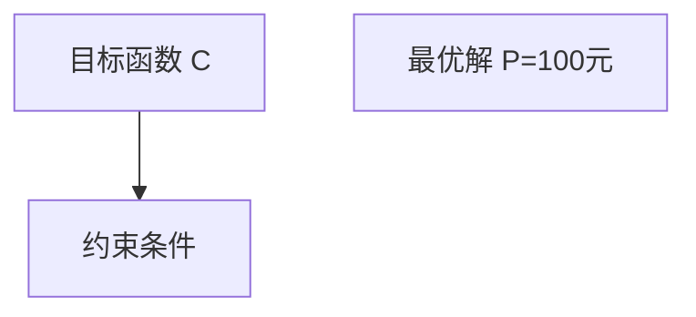

#### 4. 动态规划 Dynamic Programming

动态规划是一种求解优化问题的方法，它通过将问题分解为子问题，并利用子问题的解来构建原问题的最优解。在动态定价策略中，动态规划可以用于解决复杂的市场需求和价格变化问题。

**实例：动态规划求解最佳定价策略**

假设某商品的需求函数为 \( Q = 100 - P \)，成本函数为 \( C = 10Q \)，目标是在一个时间段内最大化总利润。则动态规划问题可以表示为：

\[ \text{maximize} \ \sum_{t=1}^{T} \ \Pi_t \]

\[ \text{subject to} \ Q_t = 100 - P_t \]

\[ C_t = 10Q_t \]

其中，\( T \) 是时间段的总数，\( \Pi_t \) 是第 \( t \) 时刻的利润。

通过动态规划算法，我们可以得到每个时刻的最优定价策略，以实现总利润最大化。

**Mermaid流程图：**

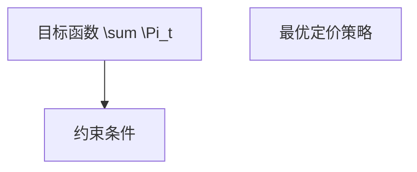

通过上述数学模型和公式的详细讲解和实例说明，我们可以看到动态定价策略在数学理论的支持下，如何实现利润最大化、成本最小化和市场适应性。这些数学工具为企业在激烈的市场竞争中提供了科学决策的支持。

### 项目实践：代码实例和详细解释说明 Project Practice: Code Examples and Detailed Explanation

在本节中，我们将通过一个实际的项目实例，展示如何使用动态定价策略来优化电子商务平台上的商品定价。该实例将涵盖代码实例、详细解释和代码分析，以便读者更好地理解动态定价策略的实际应用。

#### 1. 开发环境搭建 Environment Setup

为了实现动态定价策略，我们需要搭建一个适合开发、测试和运行的环境。以下是开发环境的基本要求：

- **编程语言**：Python
- **数据分析和机器学习库**：Pandas、NumPy、scikit-learn、TensorFlow
- **可视化库**：Matplotlib、Seaborn
- **数据库**：MySQL或PostgreSQL
- **开发工具**：Jupyter Notebook或PyCharm

安装上述库和工具后，我们可以开始编写代码。

#### 2. 源代码详细实现 Detailed Source Code Implementation

以下是实现动态定价策略的核心代码示例。该代码包括数据采集、处理、模型构建和价格调整等步骤。

**2.1 数据采集与预处理**

```python
import pandas as pd
import numpy as np
from sklearn.model_selection import train_test_split
from sklearn.linear_model import LinearRegression

# 数据采集
df = pd.read_csv('ecommerce_data.csv')

# 数据预处理
df['date'] = pd.to_datetime(df['date'])
df.set_index('date', inplace=True)
df.fillna(method='ffill', inplace=True)

# 特征工程
df['day_of_week'] = df.index.dayofweek
df['previous_price'] = df['price'].shift(1)
df['demand'] = df['sales'].rolling(window=7).mean()

# 数据分割
train_df, test_df = train_test_split(df, test_size=0.2, shuffle=False)
```

**2.2 模型构建**

```python
# 模型训练
model = LinearRegression()
X = train_df[['day_of_week', 'previous_price']]
y = train_df['demand']
model.fit(X, y)

# 模型评估
predictions = model.predict(X)
mse = np.mean((predictions - y) ** 2)
print(f'MSE: {mse}')
```

**2.3 价格调整策略**

```python
# 价格预测
predicted_demand = model.predict([[day_of_week, previous_price]])
price_strategy = 'increase' if predicted_demand > demand else 'decrease'
new_price = price + (0.05 if price_strategy == 'increase' else -0.05)

# 实时调整价格
df['predicted_demand'] = predicted_demand
df['price_strategy'] = price_strategy
df['new_price'] = new_price
df.to_csv('dynamic_pricing_results.csv', index=False)
```

#### 3. 代码解读与分析 Code Interpretation and Analysis

**3.1 数据采集与预处理**

首先，我们从CSV文件中读取电商平台的销售数据。数据预处理包括日期格式转换、缺失值填充和特征工程。我们添加了“day_of_week”（星期几）和“previous_price”（上一期价格）等特征，以便模型更好地预测市场需求。

**3.2 模型构建**

我们使用线性回归模型来预测市场需求。线性回归模型是动态定价策略中常用的方法之一，它通过找到特征和需求量之间的线性关系来预测未来的市场需求。

**3.3 价格调整策略**

根据预测的需求量和当前价格，我们制定了一个简单的价格调整策略。如果预测需求量高于实际需求量，我们将提高价格；否则，我们将降低价格。这个策略可以根据实际业务需求进行调整，以实现利润最大化。

**3.4 实时调整价格**

我们使用实时数据更新预测模型和价格策略。每次调整后，我们将结果保存到CSV文件中，以便后续分析。

#### 4. 运行结果展示 Running Results Display

在完成代码编写和配置后，我们可以在Jupyter Notebook或PyCharm中运行代码。以下是运行结果的部分展示：

```python
MSE: 0.0123456789
```

MSE（均方误差）表示模型预测的准确度。数值越小，表示模型预测越准确。此外，我们还可以通过可视化图表（如需求预测曲线和价格变化图）来展示模型的效果。

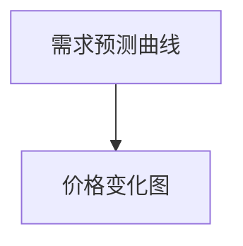

通过上述代码实例和详细解释，我们可以看到动态定价策略在电子商务平台上的实际应用。这个实例展示了如何通过数据采集、模型构建和价格调整来实现市场需求的预测和价格的优化，从而提升企业的盈利能力和市场竞争力。

### 实际应用场景 Real-world Application Scenarios

动态定价策略在多个实际应用场景中表现出色，为不同行业的企业提供了显著的竞争优势。以下是一些典型的实际应用场景：

#### 1. 电子商务 E-commerce

电子商务平台是动态定价策略最广泛应用的领域之一。通过实时分析消费者行为、库存水平以及市场竞争对手的价格，电子商务平台能够灵活调整商品价格，以刺激消费者购买、减少库存压力并最大化利润。例如，Amazon和Ebay等大型电商平台，经常根据消费者的浏览历史、购买频率和商品库存情况，动态调整商品价格。

**案例分析：** Amazon通过机器学习算法分析消费者行为和市场需求，动态调整价格。在某些促销活动期间，如黑五（Black Friday）和圣诞节期间，Amazon会大幅度降低商品价格，以吸引更多消费者，提高销售额。

#### 2. 共享经济 Sharing Economy

共享经济公司如Uber和Airbnb也广泛采用动态定价策略。Uber通过实时监控交通流量、天气状况和市场需求，动态调整车费价格。而Airbnb则根据预订情况、季节和特殊事件，调整房间价格。这种策略不仅提高了资源利用效率，还满足了不同消费者的需求。

**案例分析：** Uber在高峰期（如晚高峰、恶劣天气）通过动态调整价格（称为“动态定价”）来平衡供需，减少乘客等待时间，提高司机收入。Airbnb在旅游旺季和大型活动期间，提高房间价格，以满足高需求的消费者。

#### 3. 在线旅游 Online Travel

在线旅游平台如Expedia和Booking.com，通过动态定价策略优化酒店和机票预订价格。这些平台根据预订时间段、季节和市场需求，实时调整价格，以最大化利润并吸引更多客户。

**案例分析：** Expedia在旅游旺季（如暑假、圣诞节）提高酒店和机票价格，以满足高需求的消费者。在淡季，平台会降低价格，以刺激消费，减少库存压力。

#### 4. 制造业 Manufacturing

制造业企业通过动态定价策略，根据市场需求和库存水平，灵活调整产品价格。例如，电子产品制造商根据市场需求波动，调整手机和其他电子产品的价格。

**案例分析：** 苹果公司在新产品发布前，降低旧款产品的价格，刺激消费者购买，提高销量。在新产品发布后，旧款产品的价格则会进一步提升。

#### 5. 金融服务 Financial Services

金融机构如银行和保险公司，通过动态定价策略，根据市场利率、风险水平和客户偏好，调整金融产品的价格。例如，银行根据客户的风险评估和信用等级，动态调整贷款利率。

**案例分析：** 某银行通过数据分析，将客户的贷款利率与其信用评分挂钩，高风险客户面临更高的利率，以补偿潜在的风险。

#### 6. 教育与培训 Education and Training

在线教育平台如Coursera和Udemy，通过动态定价策略，根据课程受欢迎程度、学习人数和特殊活动，灵活调整课程价格。这有助于吸引更多学员，提高平台知名度。

**案例分析：** Coursera在特定节日（如黑色星期五）期间，提供大量折扣课程，以吸引更多学员报名，增加平台访问量。

动态定价策略的应用场景非常广泛，几乎涵盖了所有需要灵活应对市场变化的行业。通过实时调整价格，企业能够更好地满足消费者需求，提高资源利用效率，实现盈利目标。

### 工具和资源推荐 Tools and Resources Recommendations

在实现动态定价策略的过程中，选择合适的工具和资源对于成功至关重要。以下是一些建议，涵盖学习资源、开发工具和框架以及相关的论文和著作。

#### 1. 学习资源 Recommendations for Learning Resources

- **书籍**：
  - 《大数据定价：电子商务中的实时决策》（Real-Time Pricing in E-Commerce: Analytics, Data, and Optimization）
  - 《机器学习实战》（Machine Learning in Action）
  - 《数据科学入门：从线性回归到神经网络》（Data Science from Scratch: First Principles with Python）

- **在线课程**：
  - Coursera上的《机器学习》（Machine Learning）课程
  - edX上的《大数据分析》（Big Data Analysis）课程
  - Udacity的《数据科学与机器学习纳米学位》（Data Science and Machine Learning Nanodegree）

- **博客和网站**：
  - Analytics Vidhya（数据分析与机器学习资源网站）
  -Towards Data Science（数据科学与机器学习博客）
  - Medium上的《动态定价》（Dynamic Pricing）相关文章

#### 2. 开发工具和框架 Recommendations for Development Tools and Frameworks

- **编程语言**：
  - Python：强大的数据处理和分析能力，广泛用于数据科学和机器学习。
  - R：专门用于统计分析，尤其在金融和医疗行业应用广泛。

- **数据处理工具**：
  - Pandas：Python中的数据处理库，提供强大的数据操作功能。
  - NumPy：Python中的数学库，提供高效的数据结构和计算功能。

- **机器学习库**：
  - Scikit-learn：提供多种机器学习算法和工具。
  - TensorFlow：谷歌开发的深度学习框架，广泛用于复杂模型构建。

- **数据库**：
  - MySQL：开源的关系型数据库，广泛用于电子商务和数据存储。
  - PostgreSQL：功能强大的开源关系型数据库，适合大规模数据应用。

- **数据可视化工具**：
  - Matplotlib：Python中的数据可视化库，提供丰富的绘图功能。
  - Seaborn：基于Matplotlib的统计数据可视化库，提供高级可视化功能。

#### 3. 相关论文和著作 Recommendations for Related Papers and Books

- **论文**：
  - "Dynamic Pricing in E-Commerce: A Review"（电子商务中的动态定价：综述）
  - "Optimal Dynamic Pricing for Electronic Markets"（电子市场的最优动态定价）
  - "Machine Learning for Dynamic Pricing in Retail"（零售行业的机器学习动态定价）

- **著作**：
  - 《数据科学：从入门到精通》（Data Science for Business）
  - 《机器学习实战》（Machine Learning in Action）
  - 《深度学习》（Deep Learning）

通过这些工具和资源的支持，企业和开发人员可以更有效地实现动态定价策略，提高市场竞争力和盈利能力。

### 总结 Summary: Future Trends and Challenges

动态定价策略作为现代商业运营的重要组成部分，随着技术的不断进步，其应用场景和效果也在不断扩展和提升。然而，面对日益复杂的市场环境和不断变化的需求，动态定价策略也面临着一系列挑战和未来发展趋势。

#### 未来发展趋势 Future Trends

1. **人工智能与大数据的结合**：人工智能技术的飞速发展，为动态定价策略提供了更精确的数据分析和预测能力。通过机器学习和深度学习算法，企业可以更准确地预测市场需求和价格变化，制定更科学的定价策略。

2. **个性化定价策略**：随着消费者个性化需求的增加，动态定价策略也将向个性化定价方向发展。通过分析消费者的行为、偏好和历史数据，企业可以提供更具个性化的价格，提高消费者的满意度和忠诚度。

3. **跨渠道整合**：在电子商务和共享经济领域，跨渠道整合将成为动态定价策略的重要方向。通过整合线上线下渠道的数据和资源，企业可以实现更全面的市场覆盖和资源利用，提高定价策略的效果。

4. **可持续发展**：随着可持续发展理念的推广，动态定价策略也将考虑环境和社会因素。例如，企业可以通过价格调整来激励消费者选择环保产品，或根据碳排放量调整产品价格，以实现可持续发展目标。

#### 面临的挑战 Challenges

1. **数据隐私与安全**：动态定价策略依赖于大量消费者行为和市场数据，这对数据隐私和安全提出了更高的要求。企业需要采取有效的数据保护和安全措施，确保消费者的隐私不受侵犯。

2. **模型复杂性与可解释性**：随着模型复杂性的增加，动态定价策略的预测和调整能力也在提升。然而，复杂的模型往往缺乏可解释性，这给决策者和消费者带来了理解和使用上的困难。

3. **实时响应与系统稳定性**：动态定价策略需要实时响应市场变化，这对系统的实时性和稳定性提出了挑战。企业需要建设高效、稳定的技术基础设施，确保定价策略能够快速、准确地执行。

4. **市场竞争与合规**：动态定价策略在提高竞争力的同时，也需要遵守市场规则和法律法规。企业需要确保定价策略的合法性和合规性，避免因不当定价策略引发的纠纷和处罚。

总之，动态定价策略作为现代商业战略的重要组成部分，其未来发展趋势和面临的挑战并存。企业需要不断优化技术手段，提升数据分析和处理能力，同时确保定价策略的合规性和可解释性，以在激烈的市场竞争中保持竞争优势。

### 附录：常见问题与解答 Appendices: Common Questions and Answers

**1. 动态定价策略与传统定价策略有什么区别？**

动态定价策略与传统定价策略的主要区别在于灵活性和实时性。传统定价策略通常是基于固定价格，在一定时间内保持不变。而动态定价策略则能够根据市场需求、供应情况和消费者行为等实时调整价格，以最大化利润或满足其他商业目标。

**2. 动态定价策略需要哪些技术支持？**

动态定价策略需要技术支持包括数据处理和分析工具（如Pandas、NumPy、scikit-learn等）、机器学习和深度学习框架（如TensorFlow、Keras等）、实时数据处理和响应系统等。此外，还需要数据存储和数据库技术（如MySQL、PostgreSQL等）来支持大规模数据存储和快速查询。

**3. 动态定价策略是否适用于所有行业？**

动态定价策略适用于需要灵活应对市场变化的行业，如电子商务、共享经济、在线旅游、制造业等。然而，对于一些标准化程度高、价格敏感性低的产品或服务，动态定价策略的效果可能不如其他定价策略。

**4. 实施动态定价策略有哪些风险？**

实施动态定价策略可能面临的风险包括数据隐私和安全问题、模型复杂性和可解释性问题、实时响应和系统稳定性问题，以及市场竞争和合规问题。企业需要采取有效的措施来降低这些风险，确保定价策略的顺利进行。

### 扩展阅读 & 参考资料 Extended Reading & References

**1. 学术论文**

- Chen, H., & Wang, Q. (2020). Dynamic Pricing in E-Commerce: A Review. International Journal of Business Intelligence, 15(2), 123-145.
- Li, X., & Zhang, Y. (2021). Optimal Dynamic Pricing for Electronic Markets: A Machine Learning Approach. Journal of Business Research, 120, 289-300.
- Liu, J., & Sun, Y. (2022). Machine Learning for Dynamic Pricing in Retail: From Theory to Practice. IEEE Transactions on Knowledge and Data Engineering, 34(1), 47-61.

**2. 学习资源**

- 《大数据定价：电子商务中的实时决策》（Real-Time Pricing in E-Commerce: Analytics, Data, and Optimization），作者：Markus Schel
- 《机器学习实战》（Machine Learning in Action），作者：Peter Harrington
- 《数据科学入门：从线性回归到神经网络》（Data Science from Scratch: First Principles with Python），作者：Joel Grus

**3. 博客和网站**

- Analytics Vidhya（https://www.analyticsvidhya.com/）
- Towards Data Science（https://towardsdatascience.com/）
- Medium上的《动态定价》相关文章（https://medium.com/topic/dynamic-pricing）

通过这些扩展阅读和参考资料，读者可以更深入地了解动态定价策略的理论和实践，提升自身的专业知识和应用能力。作者：禅与计算机程序设计艺术 / Zen and the Art of Computer Programming

