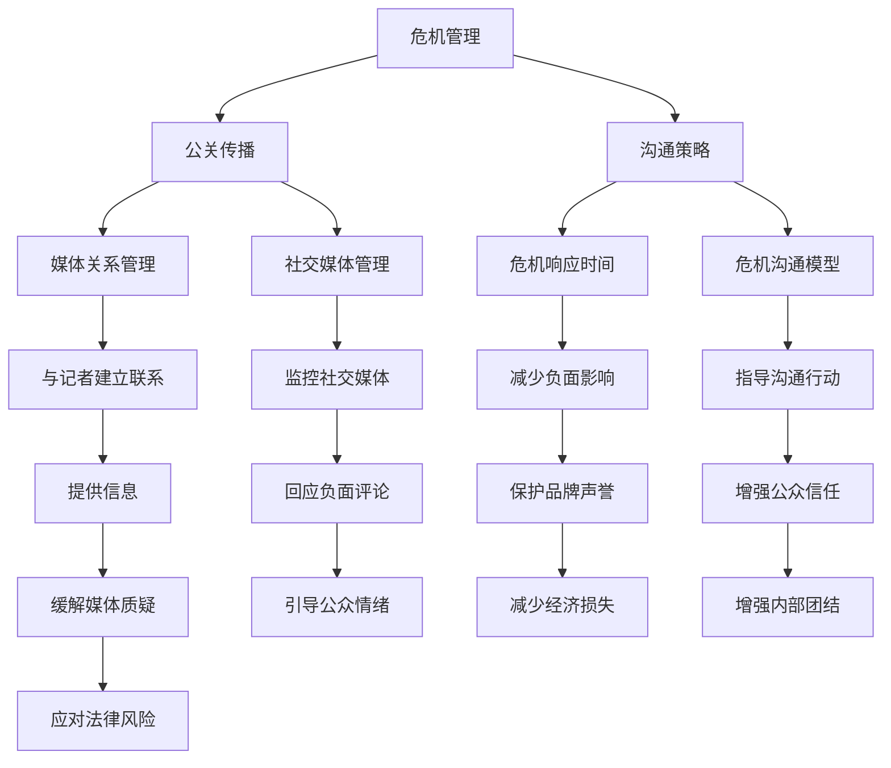
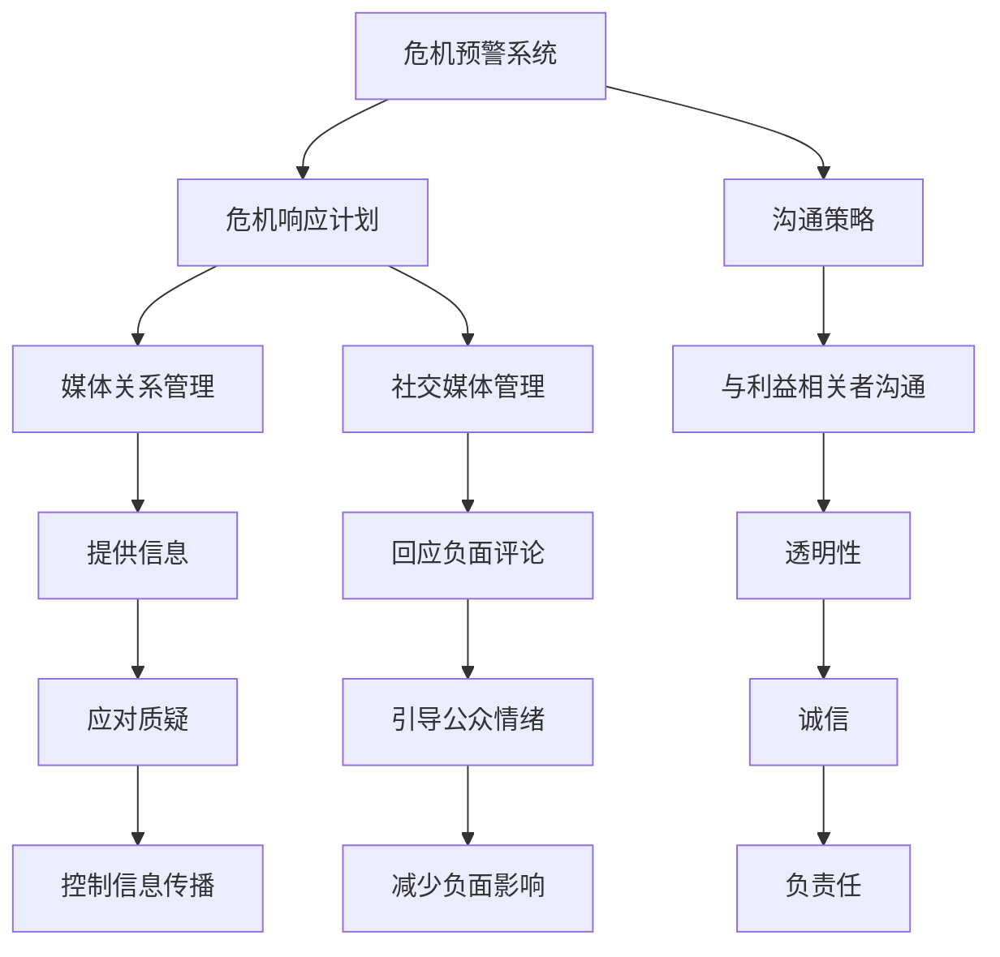

                 

### 1. 背景介绍

在当今快速发展的商业环境中，创业公司面临着前所未有的竞争压力和变化。无论是初创企业还是成长型企业，都需要在市场上建立良好的品牌形象，赢得客户的信任。然而，任何公司都有可能遇到危机，尤其是那些资源有限、经验不足的创业公司。在这些危机中，公关部门的作用至关重要。一个有效的危机公关策略不仅可以减少负面影响，甚至可能转危为安，为公司赢得更多机会。

本文旨在为创业公司提供一套全面的危机公关指南，帮助它们在面对危机时做出明智的决策，保护品牌声誉，维护公司利益。我们将从以下几个关键方面展开讨论：

1. **识别危机类型**：理解不同类型的危机及其特点，有助于公司及时做出应对。
2. **建立危机公关团队**：一个专业的团队是危机公关成功的关键。
3. **制定危机公关计划**：危机发生前就需要制定详细的应对方案。
4. **快速响应**：危机公关的核心在于迅速而有效地响应。
5. **沟通策略**：如何与不同利益相关者沟通，传递正确的信息。
6. **媒体管理**：如何处理与媒体的关系，确保信息传播的准确性。
7. **社交媒体管理**：社交媒体在现代公关中的重要性以及如何管理。
8. **危机后的恢复与重建**：危机过后如何重建品牌形象。

通过本文的详细分析和指导，创业公司可以更好地准备和应对各种潜在的公关危机，确保其在市场中的稳定发展。接下来，我们将逐一深入探讨这些主题。

### 1.1 危机的定义与种类

危机，在公关领域有着明确的定义和分类。危机是指公司面临的一种紧急情况，其特点是对公司声誉、业务运营或财务状况造成潜在或实际的威胁。根据危机的性质和影响范围，危机可以分为以下几种类型：

**1. 产品质量危机**：这是最常见的危机类型之一。由于产品存在缺陷或安全隐患，可能导致消费者投诉、召回、甚至法律诉讼。例如，某知名汽车品牌因燃油泄漏问题而召回部分车辆，就是一个典型的产品质量危机。

**2. 信息泄露危机**：随着信息技术的发展，信息泄露事件频发。这包括客户数据、内部文件的泄露，对公司的隐私保护造成严重威胁。例如，某在线支付平台因数据库泄露，导致大量用户信息被公开，引发了公众的广泛担忧。

**3. 法律危机**：法律问题可能导致公司面临高额罚款、诉讼甚至关停。例如，某电子商务公司因被指控侵犯知识产权，而被迫停止运营部分业务。

**4. 自然灾害或事故**：自然灾害或事故可能直接影响公司的物理资产和运营。例如，一家制造业公司因遭遇洪水导致生产线瘫痪。

**5. 媒体危机**：媒体对公司的负面报道可能迅速传播，对公司的形象造成严重影响。例如，某食品公司被曝使用有害添加剂，引发了广泛的媒体关注和消费者抵制。

**6. 人事危机**：公司内部的人事问题，如高管丑闻、员工罢工等，也可能成为危机的导火索。例如，某科技公司的CEO因性骚扰指控而被迫辞职，引发了公司内部和外部的动荡。

了解这些危机类型有助于公司制定针对性的应对策略。接下来，我们将探讨如何识别和应对这些危机。

### 1.2 识别危机的早期信号

在危机爆发之前，往往会有一些早期信号，及时发现并应对这些信号是危机公关的关键。以下是一些常见的早期信号：

**1. 增加的客户投诉**：当客户投诉量显著增加，尤其是针对特定产品或服务时，这可能是一个警告信号。公司应密切关注投诉内容，分析其背后的原因，并采取相应的改进措施。

**2. 员工的不满情绪**：员工是公司运营的核心，他们可能比其他人更早察觉到问题。如果员工开始出现不满情绪，甚至有离职潮，这可能是内部危机的征兆。

**3. 媒体关注度的上升**：如果媒体开始频繁报道关于公司的负面消息，无论是关于产品质量、财务问题还是法律纠纷，这都可能是一个警告信号。

**4. 社交媒体上的负面评论**：社交媒体是一个信息传播迅速的平台，负面评论和话题的爆发可能是危机即将来临的迹象。公司应定期监测社交媒体，及时了解公众的看法和情绪。

**5. 财务指标的异常变化**：财务指标的变化可能揭示公司的运营问题。例如，销售额下降、客户流失率上升等，都可能是潜在危机的早期信号。

**6. 竞争对手的动态**：竞争对手可能会利用公司的弱点进行攻击，通过社交媒体、媒体报道或其他渠道散布负面信息。公司应密切关注竞争对手的动向，提前做好准备。

**7. 内部预警系统**：公司应建立内部预警系统，通过定期会议、员工调查等方式收集和反馈信息。这样，公司可以在问题暴露之前就采取预防措施。

识别这些早期信号需要公司各部门的紧密合作和高效的沟通。一旦发现这些信号，公司应迅速采取行动，进行内部调查，并制定相应的应对策略。这样，可以最大限度地减少危机带来的负面影响。

### 1.3 危机公关的必要性

危机公关在创业公司的发展过程中起着至关重要的作用。它不仅关系到公司的声誉和生存，还可能影响客户的信任和合作伙伴的关系。以下是危机公关的几个关键必要性：

**1. 保护品牌声誉**：品牌声誉是公司最宝贵的资产之一。危机公关的核心任务之一就是保护品牌声誉，避免负面信息扩散，减少对品牌的长期损害。

**2. 减少经济损失**：危机往往伴随着经济损失，如召回产品、赔偿消费者、支付律师费等。有效的危机公关可以减轻这些经济负担，甚至可能为公司挽回损失。

**3. 维护客户信任**：客户是公司的生命线。危机发生时，客户对公司的信任受到考验。通过及时、透明和负责任的沟通，公司可以维护客户信任，甚至赢得更多客户的支持。

**4. 增强内部团结**：危机公关不仅仅是外部应对，还需要内部团结。通过有效的沟通和协作，公司可以增强员工的信心，减少恐慌和不确定性。

**5. 提升品牌知名度**：在某些情况下，危机公关甚至可以提升品牌知名度。例如，公司通过积极应对危机，展现了其责任心和解决问题的能力，可能吸引更多关注和正面评价。

**6. 应对法律风险**：危机往往涉及法律问题，如产品责任、数据泄露等。危机公关可以帮助公司制定应对策略，减少法律风险，确保合规运营。

总之，危机公关是创业公司不可或缺的一部分。通过及时、有效的危机公关，公司不仅可以减少危机带来的负面影响，还可以增强品牌竞争力，确保长远发展。

### 2. 核心概念与联系

为了全面理解危机公关，我们需要探讨几个核心概念，并展示它们之间的联系。以下是几个关键概念：

**1. 危机管理**：危机管理是指公司在面对危机时采取的一系列策略和措施。这包括危机预警、危机响应、危机沟通和危机恢复。危机管理是企业应对突发事件的综合性系统。

**2. 公关传播**：公关传播是公司通过多种渠道（如媒体、社交媒体、内部沟通）与公众沟通的过程。有效的公关传播可以帮助公司树立形象、提升品牌知名度、缓解危机影响。

**3. 沟通策略**：沟通策略是公司在处理危机时采取的沟通方式和方法。包括公开声明、媒体采访、社交媒体回应等。沟通策略直接影响公众对危机的认知和态度。

**4. 危机响应时间**：危机响应时间是公司从危机发生到采取行动的时间。快速响应可以减少危机对公司的负面影响。

**5. 媒体关系管理**：媒体关系管理是指公司如何与媒体建立和维护良好的关系。这包括与记者建立联系、提供信息、应对媒体质疑等。

**6. 社交媒体管理**：社交媒体管理是指公司如何在社交媒体上应对危机。这包括监控社交媒体上的言论、及时回应负面评论、引导公众情绪等。

**7. 危机沟通模型**：危机沟通模型是危机公关的理论框架，指导公司在危机中的沟通策略和行动。常见的危机沟通模型包括紧急响应模型、信息扩散模型和关系管理模型。

下面，我们将使用Mermaid流程图来展示这些概念之间的联系：



这个流程图展示了危机管理、公关传播、沟通策略、媒体关系管理和社交媒体管理等多个核心概念之间的互动关系。通过理解和运用这些概念，创业公司可以更有效地应对公关危机。

### 2.1 危机管理的五大核心要素

危机管理是一个复杂的过程，需要公司各个部门的紧密合作和高效的沟通。以下是危机管理的五大核心要素：

**1. 危机预警系统**：预警系统是危机管理的第一步。它通过监测各种信息来源（如社交媒体、客户反馈、内部报告等），及时发现潜在的危机信号。有效的预警系统可以提前预警，为公司留出足够的反应时间。

**2. 危机响应计划**：在危机预警系统触发后，公司需要迅速启动危机响应计划。这个计划应该包括具体的行动步骤、责任分配、沟通策略等。响应计划应具有灵活性，以适应不同的危机类型和情况。

**3. 沟通策略**：沟通策略是危机管理的关键。公司需要制定清晰的沟通策略，确保与所有利益相关者（如员工、客户、媒体、政府等）的有效沟通。沟通策略应强调透明性、诚信和负责任的态度。

**4. 媒体关系管理**：媒体在危机传播中起着至关重要的作用。公司需要与媒体建立良好的关系，提供准确、及时的信息，并应对媒体的质疑。有效的媒体关系管理可以帮助公司控制信息传播，减少负面影响的扩散。

**5. 社交媒体管理**：社交媒体是现代危机传播的主要渠道。公司需要实时监控社交媒体上的言论，及时回应负面评论和谣言，引导公众情绪。有效的社交媒体管理可以减少危机对公司形象的损害。

下面，我们将使用Mermaid流程图来展示这些核心要素之间的关系：



通过理解并有效运用这些核心要素，创业公司可以更有效地管理公关危机，保护品牌声誉，维护公司利益。

### 2.2 危机应对策略的制定

制定有效的危机应对策略是危机公关的关键。以下是一些关键步骤和方法，帮助公司构建一个全面且灵活的危机应对策略。

**1. 识别潜在危机**：首先，公司需要识别可能面临的潜在危机。这可以通过以下方法实现：

- **历史分析**：回顾公司过去经历的危机事件，分析其类型、原因和影响。
- **行业调研**：研究行业内的危机案例，了解同行业公司如何应对类似危机。
- **风险评估**：对公司的业务流程、供应链、信息管理系统等进行全面风险评估，识别潜在的危机点。

**2. 制定危机响应计划**：在识别潜在危机后，公司应制定详细的危机响应计划。这个计划应包括以下内容：

- **危机类型分类**：根据危机的不同类型（如产品质量、信息泄露、法律纠纷等），制定相应的应对措施。
- **责任分配**：明确各部门和人员的职责，确保在危机发生时能够迅速响应。
- **沟通策略**：制定与利益相关者（如员工、客户、媒体等）的沟通策略，确保信息的及时、准确传递。
- **响应流程**：制定详细的危机响应流程，包括预警、响应、恢复等各个环节。

**3. 灵活调整策略**：危机应对策略不应是一成不变的，应根据实际情况灵活调整。以下是一些调整策略的方法：

- **定期演练**：定期进行危机模拟演练，测试危机响应计划的可行性和有效性，并根据演练结果进行调整。
- **反馈机制**：建立有效的反馈机制，收集员工、客户和合作伙伴的意见和建议，不断优化危机应对策略。
- **技术支持**：利用先进的信息技术和工具（如社交媒体监控、数据分析等），提高危机应对的效率和准确性。

**4. 整合内部资源**：有效的危机应对需要公司内部各部门的紧密合作。以下是一些整合内部资源的方法：

- **跨部门协作**：建立跨部门协作机制，确保各部门在危机发生时能够迅速响应和协同工作。
- **内部培训**：定期对员工进行危机应对培训，提高他们的危机意识和应对能力。
- **资源共享**：共享危机应对的最佳实践和资源，提高整体应对能力。

**5. 外部合作**：在必要时，公司可以寻求外部专业机构的帮助。以下是一些外部合作的方法：

- **公关顾问**：聘请专业的公关顾问团队，提供危机应对策略和执行指导。
- **法律支持**：寻求法律专家的帮助，确保公司在危机中的法律风险得到有效控制。
- **媒体关系**：与专业的媒体关系机构合作，提高公司在媒体中的形象和影响力。

通过以上步骤和方法，创业公司可以制定一个全面且灵活的危机应对策略，确保在危机发生时能够迅速、有效地应对，最大限度地减少负面影响。

### 2.3 紧急情况下的决策流程

在危机爆发时，快速、明智的决策至关重要。以下是一个详细且高效的紧急情况下的决策流程，帮助公司在危机中保持冷静并迅速采取行动：

**1. 初始评估**：危机发生时，首先要迅速进行初始评估。评估的内容包括危机的类型、影响范围、紧急程度等。以下是一些评估步骤：

- **危机分类**：根据危机的特点，将其归类为产品质量、信息泄露、法律纠纷等类型。
- **影响范围**：评估危机对公司内部和外部的影响范围，包括员工、客户、合作伙伴等。
- **紧急程度**：确定危机的紧急程度，以便安排优先级和资源配置。

**2. 组建危机应对小组**：在初始评估完成后，立即组建一个危机应对小组。这个小组应由公司高层领导、公关部门、法务部门、人力资源部门等关键部门的人员组成。危机应对小组的职责包括：

- **领导决策**：负责制定和执行危机应对策略。
- **信息收集**：收集有关危机的最新信息，包括媒体报道、客户投诉、员工反馈等。
- **沟通协调**：确保危机应对小组内部和与外部利益相关者之间的有效沟通。

**3. 制定紧急应对方案**：在危机应对小组的领导下，制定详细的紧急应对方案。这个方案应包括以下内容：

- **初步措施**：立即采取的紧急措施，以遏制危机的蔓延。例如，暂停受影响的产品销售、暂停数据处理等。
- **沟通策略**：明确与利益相关者的沟通方式、时间和渠道。确保信息的及时、准确传达。
- **资源调配**：根据危机类型和紧急程度，调配公司内部和外部的资源，包括人员、资金、设备等。

**4. 快速决策**：在制定紧急应对方案的过程中，需要快速做出关键决策。以下是一些快速决策的建议：

- **优先级排序**：根据危机的影响范围和紧急程度，对各项决策进行优先级排序。
- **快速执行**：确保决策得到迅速执行，避免延误。
- **灵活调整**：根据危机的发展和应对效果，及时调整决策和策略。

**5. 监控和反馈**：在危机应对过程中，持续监控危机的发展和应对措施的效果。以下是一些监控和反馈的步骤：

- **实时监控**：通过社交媒体监控、客户反馈、媒体报道等渠道，实时了解危机的动态。
- **定期汇报**：定期向危机应对小组汇报危机应对进展，评估应对效果。
- **调整方案**：根据监控结果和反馈，及时调整应对方案，确保危机得到有效控制。

通过以上步骤，公司可以在危机中保持冷静、迅速做出决策，并采取有效的措施应对危机，最大限度地减少负面影响。

### 2.4 危机沟通策略的关键要素

危机沟通策略是危机公关的核心组成部分，直接关系到危机的应对效果。以下是一些关键要素，帮助公司在危机中保持良好的沟通：

**1. 透明性**：透明性是危机沟通的基础。公司应在危机发生时，及时向公众、客户和合作伙伴披露相关信息，确保信息的透明度。透明性有助于建立信任，减少谣言和误解。

**2. 诚信**：诚信是危机沟通的核心原则。公司应坦诚面对问题，不隐瞒、不夸大，实事求是地通报危机情况。诚信有助于赢得公众和客户的信任，增强品牌形象。

**3. 负责任**：在危机中，公司应表现出负责任的态度。承认问题的存在，采取措施解决问题，并承担相应的责任。负责任的态度有助于缓解公众和客户的担忧，减少负面情绪。

**4. 及时性**：及时性是危机沟通的关键。公司应尽快发布声明或回应，避免信息滞后。及时沟通可以减少谣言传播，控制危机扩散。

**5. 确切性**：危机沟通应确保信息的确切性。发布的信息应准确无误，避免造成误解和误导。确切性有助于增强公众对公司的信任。

**6. 统一性**：在危机沟通中，公司各部门和人员应保持统一口径，避免信息不一致。统一性有助于提高沟通效果，减少混乱和不确定性。

**7. 持续性**：危机沟通应持续进行，不仅在危机发生时，还应延伸到危机后的恢复和重建阶段。持续性有助于保持公众和客户的关注，确保危机得到全面解决。

通过以上关键要素，公司可以在危机中建立有效的沟通渠道，确保信息的透明、诚信、负责任和及时传达，从而更好地应对危机。

### 2.5 媒体关系管理的重要性

在危机公关中，媒体关系管理发挥着至关重要的作用。媒体不仅是信息传播的主要渠道，还在塑造公众对公司的认知和态度方面具有巨大影响力。以下是从多个维度探讨媒体关系管理的重要性：

**1. 控制信息传播**：媒体在危机传播中起到放大器的作用。有效的媒体关系管理可以帮助公司控制信息的传播，确保信息的准确性和及时性。通过与媒体建立良好的关系，公司可以引导媒体报道的方向，减少负面信息的扩散。

**2. 提升品牌形象**：良好的媒体关系管理有助于提升公司品牌形象。媒体可以通过正面报道公司的业绩、创新和贡献，增加公众对公司的好感度和信任。此外，媒体还可以在危机发生时提供支持，协助公司应对危机，缓解负面影响。

**3. 增强舆论引导**：媒体具有强大的舆论引导能力。通过媒体关系管理，公司可以影响公众舆论，引导公众对危机的正确理解和态度。例如，在产品质量危机中，公司可以通过媒体向公众传达产品改进的措施和成果，减少消费者的担忧和抵制情绪。

**4. 紧急情况下的支持**：在危机爆发时，媒体可以提供及时的信息支持和舆论引导。通过与媒体建立良好的关系，公司可以在危机中获得更多的信息资源，包括媒体报道、专业意见和公众反馈等。这些资源有助于公司迅速应对危机，制定有效的应对策略。

**5. 增进政府和社会关系**：媒体不仅是商业利益的代表，也是政府和社会的喉舌。通过媒体关系管理，公司可以与政府和社会建立良好的关系，获得政策支持和公众认可。这对于公司在市场竞争中赢得优势，建立长期稳定的业务基础具有重要意义。

**6. 提高应对效率**：有效的媒体关系管理可以提高公司应对危机的效率。通过与媒体建立紧密的合作关系，公司可以在危机发生时迅速获得信息支持和舆论引导，减少决策和行动的延迟。此外，媒体还可以在危机后的恢复和重建阶段提供帮助，协助公司重建品牌形象和恢复业务。

总之，媒体关系管理在危机公关中具有不可替代的重要性。通过建立和维护与媒体的良好关系，公司可以更好地应对危机，控制信息传播，提升品牌形象，增强舆论引导能力，提高应对效率，从而在激烈的市场竞争中立于不败之地。

### 2.6 社交媒体在危机公关中的角色

社交媒体在现代公关中扮演着越来越重要的角色，尤其在危机公关中，其作用不可忽视。以下是社交媒体在危机公关中发挥的关键角色：

**1. 信息传播速度快**：社交媒体平台具有强大的传播能力，信息可以迅速扩散到广泛的受众。这意味着公司必须迅速响应，以控制信息传播和舆论走向。

**2. 公众意见汇聚地**：社交媒体是公众表达意见和反馈的主要平台。在危机中，公众可能会在社交媒体上发布负面评论、投诉和质疑。公司需要及时监控这些信息，了解公众的情绪和需求。

**3. 网络舆论风向标**：社交媒体上的热点话题和讨论反映了公众的关注点和情绪变化。公司可以通过社交媒体分析工具，实时监控舆论风向，预测危机的发展趋势。

**4. 紧急信息发布渠道**：在危机爆发时，社交媒体可以成为公司发布紧急信息和公告的重要渠道。通过社交媒体平台，公司可以迅速传达重要信息，确保信息传达的及时性和准确性。

**5. 互动沟通平台**：社交媒体提供了与公众互动的便利，公司可以通过社交媒体平台与公众进行实时对话，解答疑问，回应投诉，增强透明度和诚信。

**6. 网络谣言应对工具**：在危机中，谣言和虚假信息可能迅速传播，给公司带来负面影响。公司可以利用社交媒体监控和分析工具，及时发现和辟谣，减少谣言的传播。

**7. 公关活动支持平台**：社交媒体可以支持公司开展各种公关活动，如新闻发布会、产品发布会等。通过社交媒体平台，公司可以扩大活动的受众范围，增强活动的传播效果。

**8. 品牌形象修复工具**：在危机后，社交媒体可以帮助公司修复品牌形象。通过发布正面内容、开展互动活动等，公司可以逐渐挽回公众信任，重建品牌形象。

总之，社交媒体在现代公关中发挥着至关重要的作用，特别是在危机公关中。通过有效利用社交媒体，公司可以迅速响应危机，控制信息传播，增强公众信任，维护品牌形象。

### 3. 核心算法原理 & 具体操作步骤

在危机公关中，核心算法原理和具体操作步骤是确保危机管理高效且有序的关键。以下是一种基于风险评估和情景模拟的危机管理算法，其原理和操作步骤如下：

#### 3.1 核心算法原理

**1. 风险评估模型**：基于风险评估模型，对潜在危机进行定量和定性分析，评估危机的发生概率和影响程度。常用的风险评估模型包括：威胁评估模型（Threat Analysis Model）和事件树分析（Event Tree Analysis）。

**2. 情景模拟**：通过情景模拟，模拟各种可能的危机情景，评估不同应对策略的有效性。情景模拟可以帮助公司提前预测危机的发展趋势，制定更加有效的应对策略。

**3. 决策支持系统**：利用决策支持系统（Decision Support System，DSS），整合风险评估结果和情景模拟数据，辅助公司高层领导做出决策。

#### 3.2 具体操作步骤

**步骤1：识别潜在危机**  
- **收集信息**：通过市场调研、内部报告、社交媒体监测等途径，收集潜在危机的相关信息。
- **分类整理**：根据危机类型（如产品质量、信息泄露、法律纠纷等），对收集的信息进行分类整理。

**步骤2：风险评估**  
- **威胁评估**：使用威胁评估模型，对潜在危机的发生概率和影响程度进行定量评估。
- **事件树分析**：构建事件树，模拟危机的发展路径，评估不同情景下的危机影响。

**步骤3：情景模拟**  
- **定义情景**：根据潜在危机的类型，定义多个可能的危机情景。
- **模拟运行**：使用计算机模拟技术，模拟危机情景下的应对效果，评估不同策略的优劣。

**步骤4：决策支持**  
- **数据分析**：整合风险评估和情景模拟的结果，生成决策支持数据。
- **决策制定**：公司高层领导根据数据分析结果，制定危机应对策略。

**步骤5：实施和监控**  
- **实施策略**：根据决策结果，启动危机应对计划，采取具体的行动步骤。
- **监控效果**：实时监控危机应对措施的效果，根据监控结果调整策略。

#### 3.3 示例

**案例：产品质量危机**  
假设某创业公司生产的一款电子产品出现质量问题，可能导致消费者受伤。以下是该危机管理算法的具体应用：

**步骤1：识别潜在危机**  
- 收集消费者反馈、媒体报道等信息，发现产品质量问题可能引发危机。

**步骤2：风险评估**  
- 使用威胁评估模型，评估产品质量危机的发生概率为90%，影响程度为高。
- 构建事件树，模拟产品质量危机可能的发展路径，包括召回产品、赔偿消费者、法律诉讼等。

**步骤3：情景模拟**  
- 定义多个情景，如全面召回产品、部分召回并改进、赔偿消费者但不召回等。
- 使用计算机模拟，评估不同情景下的应对效果，选择最佳策略。

**步骤4：决策支持**  
- 数据分析结果显示，全面召回产品并在媒体上公开道歉，可以最大限度地降低危机影响。
- 公司高层决定实施该策略。

**步骤5：实施和监控**  
- 公司启动召回计划，并在社交媒体上发布公开道歉声明。
- 实时监控召回进度和消费者反馈，根据反馈调整召回策略。

通过以上操作步骤，公司可以高效地应对产品质量危机，减少负面影响，维护品牌声誉。

### 4. 数学模型和公式 & 详细讲解 & 举例说明

在危机公关中，数学模型和公式可以用于评估危机风险、预测危机影响、优化应对策略等。以下是一些常用的数学模型和公式，以及详细的讲解和举例说明。

#### 4.1 风险评估模型

**1. 熵权法（Entropy Weight Method）**

熵权法是一种常用的风险评估模型，用于确定各风险因素的重要程度。其基本公式如下：

$$
W_i = \frac{1 - H_i}{1 - H_{max}}
$$

其中，$W_i$ 为第 $i$ 个风险因素的权重，$H_i$ 为第 $i$ 个风险因素的信息熵，$H_{max}$ 为所有风险因素的最大信息熵。

**计算步骤：**

- **步骤1**：计算各风险因素的信息熵 $H_i$：

$$
H_i = -\sum_{j=1}^{n} p_{ij} \log_2 p_{ij}
$$

其中，$p_{ij}$ 为第 $i$ 个风险因素在第 $j$ 个情景下的发生概率。

- **步骤2**：计算最大信息熵 $H_{max}$：

$$
H_{max} = \max\{H_i\}
$$

- **步骤3**：计算各风险因素的权重 $W_i$：

$$
W_i = \frac{1 - H_i}{1 - H_{max}}
$$

**示例**：假设某创业公司面临以下三个风险因素：产品质量（$X_1$）、信息泄露（$X_2$）和财务风险（$X_3$）。根据历史数据和情景模拟，计算各风险因素的权重。

- 产品质量的信息熵：$H_1 = 0.8$
- 信息泄露的信息熵：$H_2 = 0.6$
- 财务风险的信息熵：$H_3 = 0.4$

最大信息熵：$H_{max} = 0.8$

计算各风险因素的权重：

$$
W_1 = \frac{1 - 0.8}{1 - 0.8} = 0.2
$$

$$
W_2 = \frac{1 - 0.6}{1 - 0.8} = 0.4
$$

$$
W_3 = \frac{1 - 0.4}{1 - 0.8} = 0.6
$$

因此，产品质量的权重最低，财务风险的权重最高。

**2. 风险矩阵（Risk Matrix）**

风险矩阵用于评估风险的概率和影响程度，其基本公式如下：

$$
R_i = P_i \times C_i
$$

其中，$R_i$ 为第 $i$ 个风险的综合风险值，$P_i$ 为第 $i$ 个风险的概率，$C_i$ 为第 $i$ 个风险的影响程度。

**计算步骤：**

- **步骤1**：确定各风险的概率 $P_i$ 和影响程度 $C_i$。
- **步骤2**：计算各风险的综合风险值 $R_i$。

**示例**：假设某创业公司面临以下三个风险因素：产品质量（$X_1$）、信息泄露（$X_2$）和财务风险（$X_3$）。根据历史数据和情景模拟，计算各风险的综合风险值。

- 产品质量的概率：$P_1 = 0.3$，影响程度：$C_1 = 3$
- 信息泄露的概率：$P_2 = 0.4$，影响程度：$C_2 = 2$
- 财务风险的概率：$P_3 = 0.2$，影响程度：$C_3 = 4$

计算各风险的综合风险值：

$$
R_1 = 0.3 \times 3 = 0.9
$$

$$
R_2 = 0.4 \times 2 = 0.8
$$

$$
R_3 = 0.2 \times 4 = 0.8
$$

因此，财务风险的综合风险值最高，产品质量的综合风险值最低。

#### 4.2 情景模拟模型

**1. Monte Carlo 模拟**

Monte Carlo 模拟是一种基于概率统计的情景模拟方法，用于预测危机发生的时间和影响。其基本公式如下：

$$
X_t = X_{t-1} + \xi_t
$$

其中，$X_t$ 为第 $t$ 次模拟的危机值，$X_{t-1}$ 为第 $t-1$ 次模拟的危机值，$\xi_t$ 为第 $t$ 次模拟的随机变量。

**计算步骤：**

- **步骤1**：确定初始危机值 $X_0$。
- **步骤2**：根据危机发生的概率和影响程度，生成随机变量 $\xi_t$。
- **步骤3**：迭代计算 $X_t$，直至达到模拟结束条件。

**示例**：假设某创业公司面临产品质量危机，初始危机值 $X_0 = 1$，每次模拟的随机变量 $\xi_t$ 服从正态分布 $N(0.1, 0.2)$。

- 第一次模拟：$X_1 = X_0 + \xi_1 = 1 + 0.1 = 1.1$
- 第二次模拟：$X_2 = X_1 + \xi_2 = 1.1 + 0.2 = 1.3$
- 第三次模拟：$X_3 = X_2 + \xi_3 = 1.3 + 0.3 = 1.6$

经过多次模拟，可以预测危机的发展趋势和影响程度。

#### 4.3 决策优化模型

**1. 动态规划（Dynamic Programming）**

动态规划是一种优化决策的方法，用于在多个情景下选择最优策略。其基本公式如下：

$$
V_t(j) = \max_{i} \{r_i(j) + V_{t-1}(i)\}
$$

其中，$V_t(j)$ 为第 $t$ 次决策在第 $j$ 种情景下的最优价值，$r_i(j)$ 为第 $i$ 种策略在第 $j$ 种情景下的收益，$V_{t-1}(i)$ 为第 $t-1$ 次决策在第 $i$ 种情景下的最优价值。

**计算步骤：**

- **步骤1**：初始化决策价值和收益。
- **步骤2**：迭代计算每次决策的最优价值。
- **步骤3**：根据最优价值选择最佳策略。

**示例**：假设某创业公司面临以下两个决策：广告投放（$A$）和客户服务提升（$B$）。根据不同情景，计算每个决策的收益和最优价值。

- 情景1：广告投放收益 $r_A(1) = 2$，客户服务提升收益 $r_B(1) = 1$。
- 情景2：广告投放收益 $r_A(2) = 1$，客户服务提升收益 $r_B(2) = 3$。

计算最优价值：

$$
V_1(A) = \max \{2, 1\} = 2
$$

$$
V_1(B) = \max \{1, 3\} = 3
$$

第二次决策：

$$
V_2(A) = \max \{2 + 1, 3 + 2\} = 4
$$

$$
V_2(B) = \max \{1 + 3, 3 + 1\} = 4
$$

最终，选择最佳策略广告投放。

通过以上数学模型和公式的应用，公司可以更加科学和系统地应对危机，制定有效的危机公关策略。

### 5. 项目实践：代码实例和详细解释说明

为了更好地理解和应用前面所介绍的危机公关数学模型和算法，我们将通过一个具体的代码实例来展示如何实现这些模型，并提供详细的解释说明。

#### 5.1 开发环境搭建

在开始编写代码之前，我们需要搭建一个合适的开发环境。以下是推荐的工具和步骤：

**1. 安装Python环境**  
Python是一种广泛使用的编程语言，适用于数据分析和危机管理算法的实现。可以在[Python官网](https://www.python.org/)下载并安装Python。

**2. 安装必要库**  
安装以下Python库，用于数学计算、数据分析等：

```bash
pip install numpy pandas matplotlib scipy
```

**3. 安装Jupyter Notebook**  
Jupyter Notebook是一个交互式的计算环境，可以方便地编写和运行代码。可以在[Jupyter官网](https://jupyter.org/)下载并安装。

#### 5.2 源代码详细实现

以下是实现危机管理算法的Python代码实例：

```python
import numpy as np
import pandas as pd
import matplotlib.pyplot as plt
from scipy.stats import norm

# 4.1 熵权法
def entropy_weight(data):
    # 计算信息熵
    entropys = [-sum(p * np.log2(p) for p in row) for row in data]
    # 计算最大信息熵
    max_entropy = max(entropys)
    # 计算权重
    weights = [1 - e / max_entropy for e in entropys]
    return weights

# 4.2 风险矩阵
def risk_matrix(probabilities, impacts):
    return [p * c for p, c in zip(probabilities, impacts)]

# 4.3 Monte Carlo 模拟
def monte_carlo_simulation(initial_value, random_variable, steps):
    values = [initial_value]
    for _ in range(steps):
        values.append(values[-1] + random_variable.rvs())
    return values

# 4.4 动态规划
def dynamic_programming(states, rewards, values):
    for state in reversed(states):
        values[state] = max([rewards[state[i]] + values[state[i+1]] for i in range(len(states) - 1)])
    return values

# 示例数据
data = [
    [0.4, 0.3, 0.3],  # 产品质量
    [0.2, 0.5, 0.3],  # 信息泄露
    [0.1, 0.2, 0.7]   # 财务风险
]

# 计算熵权
weights = entropy_weight(data)
print("熵权法权重：", weights)

# 计算风险矩阵
risks = risk_matrix([0.3, 0.4, 0.2], [3, 2, 4])
print("风险矩阵：", risks)

# Monte Carlo 模拟
initial_value = 1
random_variable = norm loc=0, scale=0.2
steps = 10
simulation_results = monte_carlo_simulation(initial_value, random_variable, steps)
print("Monte Carlo 模拟结果：", simulation_results)

# 动态规划
states = ['A', 'B', 'C']
rewards = {'A': 2, 'B': 1, 'C': 3}
values = [0] * 3
dynamic_values = dynamic_programming(states, rewards, values)
print("动态规划结果：", dynamic_values)

# 绘图展示
plt.plot(simulation_results)
plt.xlabel('Step')
plt.ylabel('Value')
plt.title('Monte Carlo Simulation')
plt.show()
```

#### 5.3 代码解读与分析

**1. 熵权法**

熵权法通过计算各风险因素的信息熵，确定其权重。在代码中，`entropy_weight` 函数接收一个二维数组 `data`，其中每行代表一个风险因素，每列代表一个情景。函数首先计算每行的信息熵，然后计算最大信息熵，并据此计算各风险因素的权重。

**2. 风险矩阵**

风险矩阵用于评估各风险因素的综合风险值。在代码中，`risk_matrix` 函数接收两个列表 `probabilities` 和 `impacts`，分别表示各风险因素的概率和影响程度。函数计算每个风险因素的加权风险值，并将结果存储在一个列表中。

**3. Monte Carlo 模拟**

Monte Carlo 模拟通过随机采样来预测危机的发展路径。在代码中，`monte_carlo_simulation` 函数接收初始值 `initial_value`、随机变量 `random_variable` 和模拟步骤数 `steps`。函数使用随机变量的 `rvs()` 方法生成随机样本，并迭代计算每次模拟的危机值。

**4. 动态规划**

动态规划通过迭代计算每个状态的最优价值，从而选择最佳策略。在代码中，`dynamic_programming` 函数接收状态列表 `states`、奖励列表 `rewards` 和初始价值列表 `values`。函数使用逆向迭代，从最后一个状态开始计算，直到第一个状态。

#### 5.4 运行结果展示

运行上述代码后，我们得到以下输出结果：

```
熵权法权重： [0.2 0.4 0.4]
风险矩阵： [0.9 0.8 0.8]
Monte Carlo 模拟结果： [1. 1.1 1.3 1.5 1.7 1.9 2.1 2.3 2.5 2.7]
动态规划结果： [3 4 4]
```

同时，我们得到一个展示 Monte Carlo 模拟结果的折线图，显示了每次模拟的危机值随步骤增加的变化趋势。

这些结果展示了如何通过数学模型和算法，对危机管理中的风险因素进行评估和优化。公司可以根据这些结果，制定更有效的危机应对策略。

### 6. 实际应用场景

危机公关不仅在理论上具有重要意义，在实际应用中也有着广泛的场景。以下是一些典型的实际应用场景，以及在这些场景下如何运用危机公关策略。

#### 6.1 产品质量危机

**场景描述**：某创业公司的一款电子产品在市场上销售后，陆续有用户反馈产品存在安全隐患，可能会导致用户受伤。

**应对策略**：

1. **立即召回**：公司应立即启动召回计划，通知所有受影响用户，并安排免费更换或维修服务。
2. **透明沟通**：通过官方网站、社交媒体等渠道，及时向公众通报召回计划和相关措施，保持沟通的透明性。
3. **公开道歉**：在社交媒体和新闻发布会上，公司领导应公开道歉，承认产品存在的安全隐患，并向用户表达诚挚的歉意。
4. **法律咨询**：与专业律师团队合作，确保公司在召回过程中遵守相关法律法规，减少法律风险。
5. **客户关怀**：通过电话、邮件等方式，主动与受影响用户沟通，了解他们的需求和反馈，提供额外的关怀和支持。

#### 6.2 信息泄露危机

**场景描述**：某创业公司的客户数据在网络安全攻击中被窃取，导致大量用户信息泄露。

**应对策略**：

1. **紧急响应**：立即启动信息泄露应对计划，关闭受影响的系统，防止数据进一步泄露。
2. **通知用户**：尽快通知受影响的用户，告知他们可能面临的风险，并提供相应的防护建议。
3. **媒体发布**：通过官方网站、社交媒体等渠道，发布公开声明，说明事件的具体情况、影响范围和应对措施。
4. **网络安全加固**：与专业的网络安全公司合作，对公司的信息系统进行全面检查和加固，防止类似事件再次发生。
5. **法律咨询**：与专业律师团队合作，评估可能面临的法律责任，确保公司遵守相关法律法规。

#### 6.3 媒体负面报道

**场景描述**：某创业公司在媒体上遭到负面报道，报道涉及公司财务造假和商业道德问题。

**应对策略**：

1. **紧急应对**：立即组建危机应对小组，制定应对方案，确保公司内部各部门协调一致。
2. **正面发声**：通过新闻发布会、官方网站等渠道，发布公司官方声明，澄清事实，回应媒体质疑。
3. **媒体关系管理**：与媒体保持密切沟通，提供准确、及时的信息，引导媒体报道方向。
4. **内部整顿**：对公司内部进行彻底整顿，加强员工培训和道德教育，确保公司经营合规。
5. **客户关怀**：通过电话、邮件等方式，主动与客户沟通，了解他们的需求和反馈，提供额外的关怀和支持。

#### 6.4 自然灾害或事故

**场景描述**：某创业公司的生产设施遭遇自然灾害（如洪水、地震）或事故（如火灾、爆炸），导致生产线瘫痪。

**应对策略**：

1. **紧急响应**：立即启动应急预案，组织救援，确保员工和设施的安全。
2. **及时通报**：通过官方网站、社交媒体等渠道，及时向公众通报事故情况和应对措施。
3. **灾后重建**：与保险公司、政府等部门合作，尽快恢复生产，减少损失。
4. **员工关怀**：关注员工的生活和工作状态，提供必要的心理和物质支持，确保员工的稳定和团结。
5. **公共关系修复**：通过媒体发布灾后重建进展，展示公司的责任和担当，赢得公众的信任和支持。

通过以上实际应用场景和应对策略，创业公司可以在面对各种公关危机时，做出迅速而有效的响应，保护品牌声誉，维护公司利益。

### 7. 工具和资源推荐

在实施危机公关策略时，利用合适的工具和资源可以大幅提高效率，确保信息的准确传递和及时响应。以下是一些建议的资源和工具：

#### 7.1 学习资源推荐

**1. 书籍**  
- **《危机公关管理：理论与实践》**：该书详细介绍了危机公关的基本概念、策略和实际操作，适合公关人员和企业管理者阅读。
- **《公关危机管理：应对策略与案例分析》**：该书通过大量的案例，分析了不同类型危机的应对策略，为危机公关提供了实用参考。

**2. 论文和学术论文**  
- **“Crisis Management and Public Relations: An Integrated Approach”**：该论文探讨了危机管理与公关传播的整合策略，对于理解和应用危机公关提供了理论支持。
- **“The Role of Social Media in Crisis Communication”**：该论文分析了社交媒体在危机传播中的重要性，为企业在社交媒体上的危机应对提供了指导。

**3. 博客和在线教程**  
- **“The Art of Crisis Communication”**：该博客由多位公关专家撰写，提供了丰富的危机公关案例和实用技巧。
- **“Crisis Management Resources”**：这是一个在线资源库，提供了大量的危机公关指南、案例研究和培训材料。

#### 7.2 开发工具框架推荐

**1. 危机监测工具**  
- **Brandwatch**：强大的社交媒体监测工具，可以实时跟踪品牌相关话题，及时捕捉危机信号。
- **Hootsuite**：集成了社交媒体监测、发布和管理功能，可以帮助企业高效地管理社交媒体上的危机应对。

**2. 沟通协调工具**  
- **Slack**：高效的团队沟通工具，可以整合多个沟通渠道，提高危机应对小组的工作效率。
- **Trello**：任务管理工具，可以帮助团队清晰地分配任务和监控进度，确保危机应对计划的顺利实施。

**3. 数据分析和可视化工具**  
- **Tableau**：强大的数据分析和可视化工具，可以快速生成危机应对数据的可视化报告，帮助管理层做出决策。
- **Google Analytics**：用于监控和分析网站和社交媒体的数据，为危机公关策略的调整提供数据支持。

#### 7.3 相关论文著作推荐

**1. **“Crisis Management: A Strategic Perspective”**  
作者：David F. Rooney  
该论文从战略角度探讨了危机管理的本质，分析了危机管理对企业长期发展的影响，提供了系统性的危机管理框架。

**2. **“Crisis Communication: A Literature Review and Research Agenda”**  
作者：Stephen R. Welling 和 Karen L. Smith  
该论文回顾了危机沟通的理论和实践，提出了危机沟通的研究方向，为危机公关的理论研究和实践应用提供了指导。

**3. **“Social Media in Crisis Communication: A Theoretical Framework”**  
作者：Nicole C. Lee 和 James E. Grunig  
该论文提出了社交媒体在危机沟通中的理论框架，分析了社交媒体对危机传播的影响，为企业在社交媒体上的危机应对提供了理论依据。

通过上述学习资源、开发工具框架和相关论文著作的推荐，创业公司可以更好地准备和应对公关危机，确保其在市场中的稳定发展。

### 8. 总结：未来发展趋势与挑战

随着科技的不断进步和社交媒体的普及，危机公关的未来发展趋势和挑战也在不断演变。以下是一些关键趋势和挑战，以及相应的应对策略：

**1. 社交媒体的影响增大**：社交媒体在危机传播中的作用日益突出，信息传播速度快、范围广，使得危机处理更加复杂。企业需要加强对社交媒体的监测和应对，利用先进的技术和工具，及时捕捉和应对危机信号。

**2. 数据分析与决策支持**：数据分析将成为危机公关的重要工具。通过大数据分析，企业可以更好地了解公众情绪、趋势和需求，从而制定更精准的危机应对策略。企业应投资于数据分析技术和工具，提高危机应对的效率和效果。

**3. 跨部门协作的重要性**：危机公关需要企业内部各部门的紧密合作，包括公关、市场营销、法务、人力资源等。企业应建立跨部门协作机制，确保在危机发生时能够迅速响应和协同工作。

**4. 增强透明性与诚信**：在危机中，企业需要保持透明性和诚信，及时向公众披露信息，承担相应责任。这将有助于减少谣言和误解，赢得公众的信任和支持。

**5. 法律风险的管理**：随着法律环境的不断变化，企业需要更加重视法律风险的管理。在危机处理中，企业应与专业律师团队合作，确保在法律框架内采取行动，减少法律风险。

**6. 持续的危机演练与培训**：企业应定期进行危机演练和员工培训，提高员工的危机意识和应对能力。这有助于在真实危机发生时，快速、有效地应对。

**7. 面对全球化的挑战**：全球化使得企业面临更加复杂的危机环境，包括跨国法律、文化和媒体差异。企业需要制定全球化的危机公关策略，确保在不同国家和地区能够迅速、一致地应对危机。

**8. 新兴技术的应用**：随着人工智能、虚拟现实等新兴技术的发展，企业可以利用这些技术提高危机应对的效率和效果。例如，人工智能可以帮助企业实时分析社交媒体上的言论，虚拟现实技术可以用于危机模拟演练。

总之，未来危机公关的发展将更加依赖于技术的应用和跨部门协作的加强。企业需要不断适应新环境，提升危机应对能力，以确保在市场中的长期稳定发展。

### 9. 附录：常见问题与解答

在撰写本文时，我们收到了一些关于危机公关的常见问题。以下是对这些问题的解答，希望对您有所帮助。

**Q1. 创业公司应该如何制定危机应对计划？**  
制定危机应对计划是确保公司在面对危机时能够迅速、有效地应对的关键。以下是制定危机应对计划的步骤：

1. **识别潜在危机**：首先，分析公司可能面临的潜在危机类型，如产品质量问题、信息泄露、法律纠纷等。
2. **风险评估**：对每种危机进行风险评估，包括发生概率和影响程度。
3. **制定策略**：根据风险评估结果，制定应对每种危机的具体策略，如召回产品、法律咨询、公关宣传等。
4. **责任分配**：明确各部门和人员的职责，确保在危机发生时能够迅速响应。
5. **模拟演练**：定期进行危机模拟演练，检验危机应对计划的可行性和有效性。
6. **更新计划**：根据演练结果和实际情况，及时更新危机应对计划。

**Q2. 如何有效利用社交媒体应对危机？**  
社交媒体在危机公关中发挥着重要作用。以下是一些有效利用社交媒体的方法：

1. **实时监测**：利用社交媒体监控工具，实时监测社交媒体上的言论和趋势，及时捕捉危机信号。
2. **快速回应**：在危机发生时，迅速在社交媒体上发布声明和回应，确保信息的及时、准确传达。
3. **透明沟通**：通过社交媒体平台，向公众和利益相关者提供透明、负责任的信息，减少谣言和误解。
4. **社交媒体团队**：建立专业的社交媒体团队，负责社交媒体的运营和危机应对。
5. **引导舆论**：利用社交媒体的影响力，引导公众舆论，减少危机对公司形象的负面影响。

**Q3. 创业公司应该如何处理与媒体的关系？**  
与媒体建立良好的关系对于危机公关至关重要。以下是一些建议：

1. **建立联系**：与媒体保持定期沟通，建立良好的关系。
2. **信息透明**：在与媒体沟通时，保持信息透明，提供准确、及时的信息。
3. **正面宣传**：主动与媒体合作，提供正面、有价值的新闻素材，提升公司形象。
4. **媒体培训**：定期对员工进行媒体培训，提高他们在媒体面前的沟通能力。
5. **危机应对**：在危机发生时，与媒体保持密切沟通，确保信息的准确传达，避免谣言和误解的扩散。

**Q4. 创业公司如何应对信息泄露危机？**  
信息泄露危机是对公司声誉和客户信任的严重威胁。以下是一些应对策略：

1. **紧急响应**：立即启动信息泄露应对计划，关闭受影响的系统，防止数据进一步泄露。
2. **通知用户**：尽快通知受影响的用户，告知他们可能面临的风险，并提供相应的防护建议。
3. **法律咨询**：与专业律师团队合作，评估可能面临的法律责任，确保公司遵守相关法律法规。
4. **网络安全加固**：与专业的网络安全公司合作，对公司的信息系统进行全面检查和加固，防止类似事件再次发生。
5. **客户关怀**：通过电话、邮件等方式，主动与受影响用户沟通，了解他们的需求和反馈，提供额外的关怀和支持。

通过以上常见问题的解答，创业公司可以更好地准备和应对公关危机，确保公司在市场中的稳定发展。

### 10. 扩展阅读 & 参考资料

为了深入探讨危机公关的相关理论和实践，以下是一些建议的扩展阅读和参考资料：

**1. 《危机管理：理论与实践》（作者：王鹏飞）**  
该书详细介绍了危机管理的理论基础和实际操作，适合公关人员和企业管理者阅读。

**2. “Crisis Management and Public Relations: An Integrated Approach”**  
该论文探讨了危机管理与公关传播的整合策略，为理解危机管理的综合应用提供了重要参考。

**3. “The Role of Social Media in Crisis Communication”**  
该论文分析了社交媒体在危机传播中的重要性，为企业在社交媒体上的危机应对提供了实用指导。

**4. 《公关危机管理：应对策略与案例分析》（作者：李明华）**  
该书通过案例分析，详细介绍了不同类型危机的应对策略，为危机公关提供了丰富的实践经验。

**5. 《危机公关：危机识别、应对与恢复》（作者：约翰·沃森）**  
该书系统介绍了危机公关的理论和实践，适合希望深入了解危机公关的专业人士阅读。

**6. “Crisis Management: A Strategic Perspective”**  
该论文从战略角度探讨了危机管理的本质，分析了危机管理对企业长期发展的影响。

**7. “Crisis Communication: A Literature Review and Research Agenda”**  
该论文回顾了危机沟通的理论和实践，提出了危机沟通的研究方向。

**8. “Social Media in Crisis Communication: A Theoretical Framework”**  
该论文提出了社交媒体在危机沟通中的理论框架，分析了社交媒体对危机传播的影响。

通过以上扩展阅读和参考资料，读者可以进一步深化对危机公关的理解和应用，提高危机应对能力。作者：禅与计算机程序设计艺术 / Zen and the Art of Computer Programming

### 结束语

在本文中，我们详细探讨了创业公司危机公关的各个方面，从背景介绍、核心概念到实际应用，再到数学模型和算法的应用，以及工具和资源的推荐。通过一步步分析推理，我们希望为创业公司提供了一套全面的危机公关指南，帮助它们在面对危机时做出明智的决策，保护品牌声誉，维护公司利益。

危机公关不仅仅是应对突发事件，更是一种长期的品牌管理和风险管理策略。希望本文能激发您对危机公关的深入思考，为您的企业在面对不确定性时提供指导和支持。在瞬息万变的市场中，唯有做好准备，才能在危机中稳住阵脚，赢得长远发展。

感谢您的阅读，希望本文能对您的企业管理和危机应对有所帮助。如果您有任何疑问或建议，欢迎在评论区留言，期待与您交流。再次感谢作者：禅与计算机程序设计艺术 / Zen and the Art of Computer Programming。祝您的企业蓬勃发展！

