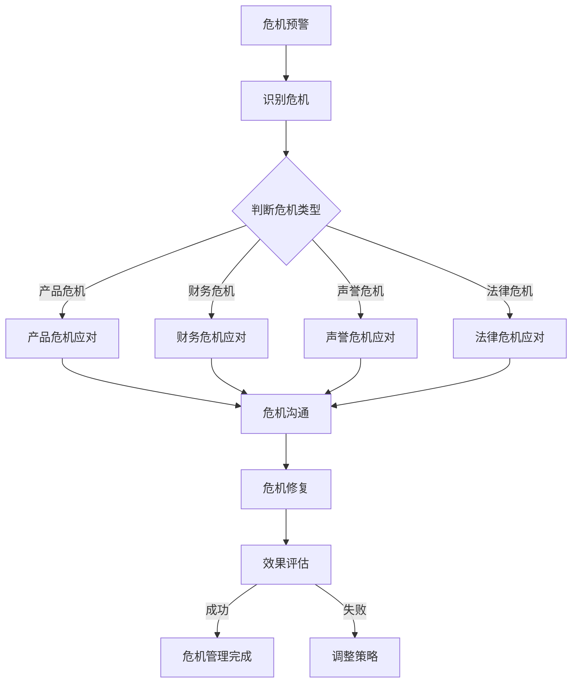

                 

### 背景介绍

在今天的商业环境中，创业公司面临着前所未有的竞争压力和挑战。随着市场的快速变化和消费者需求的不断升级，创业公司需要在产品研发、市场推广、团队管理等多个方面不断调整策略，以保持竞争优势。然而，即便是经过精心策划和严格执行的战略，创业公司也可能因为各种意外事件而陷入危机。

危机公关管理对于创业公司来说尤为重要。危机公关不仅仅是应对突发事件，更是公司整体品牌管理和风险控制的一部分。成功的危机公关能够将危机转化为公司的成长机遇，反之，如果处理不当，可能会对公司的声誉和市场地位造成致命打击。

本文将深入探讨创业公司在面临危机时，如何进行有效的危机公关管理。我们将首先介绍危机公关的核心概念，包括危机的定义、类型以及公关策略。随后，文章将逐步分析创业公司常见的危机情景，并提出具体的应对措施。接着，我们将探讨如何制定危机公关计划，并详细讲解危机公关的实施步骤。此外，文章还将讨论危机公关中的沟通策略，包括内部沟通和外部沟通的重要性以及有效沟通的技巧。最后，我们将总结创业公司在危机公关管理中可能遇到的挑战，并提供一些建议和最佳实践。

通过这篇文章，我们希望能够为创业公司的管理者提供实用的危机公关管理指导，帮助他们在面对危机时做出明智的决策，维护公司的长期发展。

## 1. 核心概念与联系

在探讨创业公司的危机公关管理之前，我们需要明确一些核心概念，这些概念构成了危机公关的理论基础和实践指南。

### 危机的定义

危机是一种突发事件，它可能会对组织的运作、声誉、财务状况或员工士气产生负面影响。危机可以来自内部，例如管理失误、员工不当行为或生产事故，也可以来自外部，例如市场变化、竞争压力或自然灾害。无论危机的来源如何，它都会对组织的正常运营带来挑战，因此需要及时、有效的应对。

### 危机的类型

危机可以根据其性质和影响范围进行分类。常见的危机类型包括：

1. **产品危机**：由于产品质量问题或安全隐患导致消费者对产品失去信心。
2. **财务危机**：由于财务报表造假、财务状况恶化或资金链断裂导致的信任危机。
3. **声誉危机**：由于负面报道、不当言论或丑闻导致公众对公司的整体形象产生质疑。
4. **法律危机**：由于法律诉讼或违规行为导致公司面临法律风险。

### 公关策略

公关策略是危机公关的核心，它决定了公司在危机中的应对方式和行动方向。有效的公关策略应包括以下方面：

1. **危机预警**：通过监测和分析市场动态、消费者反馈以及竞争对手的行动，提前识别潜在的危机风险。
2. **危机应对**：在危机爆发时，迅速采取行动，控制事态发展，减轻危机对公司的影响。
3. **危机沟通**：通过有效的沟通策略，向内部员工和外部公众传达公司的立场和行动，恢复信任和信心。
4. **危机修复**：在危机过后，采取措施修复受损的形象和声誉，防止危机的负面影响持续扩大。

### 架构与联系

为了更好地理解危机公关管理的架构，我们可以使用 Mermaid 流程图来展示其核心组成部分和它们之间的联系。以下是危机公关管理的 Mermaid 流程图：



通过上述 Mermaid 流程图，我们可以清晰地看到危机公关管理从危机预警、识别危机、判断危机类型、具体危机应对、危机沟通到危机修复以及效果评估的完整流程。这个流程不仅体现了危机公关管理的逻辑和步骤，也说明了各个步骤之间的相互联系和依赖。

### 小结

在本文的这一部分，我们介绍了危机公关管理的核心概念，包括危机的定义、类型和公关策略。通过 Mermaid 流程图的展示，我们更加直观地理解了危机公关管理的架构和各个组成部分之间的联系。这些核心概念和架构将为后续讨论创业公司如何具体应对危机提供理论基础和实践指导。

## 2. 核心算法原理 & 具体操作步骤

在了解了危机公关管理的核心概念和架构之后，我们接下来将探讨如何具体实施危机公关管理。这一部分将介绍核心算法原理，并详细讲解具体的操作步骤，以帮助创业公司有效地应对危机。

### 2.1 危机预警算法原理

危机预警是危机公关管理的第一步，其核心在于提前识别潜在的危机风险。预警算法通常基于以下几个原理：

1. **数据收集**：收集与公司运营相关的各种数据，包括市场动态、消费者反馈、竞争对手行动等。
2. **趋势分析**：通过分析数据，识别潜在的风险趋势，如市场变化、消费者满意度下降等。
3. **异常检测**：使用异常检测算法，及时发现数据中的异常情况，如负面评论激增、负面新闻爆发等。

具体的预警算法可以包括以下步骤：

1. **数据预处理**：对收集到的数据进行分析，去除噪声数据，确保数据的准确性和完整性。
2. **特征提取**：从数据中提取关键特征，如消费者满意度评分、负面评论数量、市场占有率变化等。
3. **模型训练**：使用历史数据训练机器学习模型，以识别潜在的风险信号。
4. **实时监测**：利用训练好的模型对实时数据进行分析，及时发现风险信号。

### 2.2 危机应对算法原理

在识别出潜在的危机后，创业公司需要迅速采取行动，控制事态发展。危机应对算法的核心在于快速响应和有效决策。以下是危机应对的具体步骤：

1. **快速响应**：在危机爆发初期，迅速采取行动，控制危机的扩散。
2. **紧急决策**：根据危机的性质和影响，制定紧急应对策略，如产品召回、新闻发布会等。
3. **资源调配**：调动公司内部资源，确保危机应对行动的顺利进行。
4. **风险评估**：对危机的影响进行评估，制定长期的修复策略。

具体的应对算法可以包括以下步骤：

1. **危机识别**：通过预警系统或其他渠道，迅速识别危机。
2. **危机分类**：根据危机的类型，选择相应的应对策略。
3. **决策制定**：根据风险评估结果，制定紧急决策和长期修复计划。
4. **执行监控**：确保危机应对行动的执行，并随时调整策略。

### 2.3 沟通策略算法原理

危机沟通是危机公关管理的关键环节，其核心在于有效地传递信息，恢复信任和信心。沟通策略算法通常基于以下几个原理：

1. **信息传递**：确保关键信息能够迅速传递给内部员工和外部公众。
2. **真实性**：确保信息真实可信，避免误导公众。
3. **及时性**：确保信息能够及时发布，避免谣言传播。
4. **一致性**：确保不同部门和人员发布的信息保持一致。

具体的沟通策略可以包括以下步骤：

1. **信息准备**：提前准备好危机应对的沟通材料，包括声明、新闻稿、FAQ等。
2. **信息发布**：通过合适的渠道，及时发布信息，确保信息的准确性和及时性。
3. **互动管理**：积极回应公众的疑问和反馈，保持沟通渠道的畅通。
4. **效果评估**：评估沟通活动的效果，及时调整沟通策略。

### 小结

在本部分，我们介绍了危机公关管理的核心算法原理和具体操作步骤。通过预警算法，创业公司可以提前识别潜在的危机风险；通过应对算法，公司可以迅速采取行动，控制危机的扩散；通过沟通策略算法，公司可以有效地传递信息，恢复信任和信心。这些算法原理和操作步骤为创业公司在面对危机时提供了系统的应对方案，帮助公司更好地管理危机，确保业务的持续发展。

### 数学模型和公式 & 详细讲解 & 举例说明

在危机公关管理中，数学模型和公式可以用于评估危机的影响、制定应对策略以及优化沟通效果。以下我们将介绍几个常用的数学模型和公式，并详细讲解其应用场景和具体操作步骤。

#### 1. 蒙特卡洛模拟

蒙特卡洛模拟是一种基于概率统计的方法，可以用于预测危机对公司业绩的影响。该方法通过随机抽样和模拟，估计危机发生的概率及其对公司财务状况的影响。

**公式：**

$$
P(X > x) = \sum_{i=1}^{n} P(X_i > x) \cdot p_i
$$

其中，\(X_i\) 为每次模拟的危机影响，\(x\) 为阈值，\(p_i\) 为第 \(i\) 次模拟中危机发生的概率。

**应用步骤：**

1. **定义变量**：确定影响危机的变量，如市场份额、销售额、客户满意度等。
2. **随机抽样**：从历史数据中随机抽样，生成多个模拟数据集。
3. **计算概率**：使用公式计算每个模拟数据集超过阈值的概率。
4. **统计结果**：汇总所有模拟结果，计算危机发生的总体概率及其对公司业绩的影响。

**举例：**

假设一家创业公司面临市场份额下降的危机，定义市场份额为变量 \(X\)，阈值为 20%，历史数据中 \(X\) 的平均值为 25%，标准差为 5%。通过随机抽样生成 1000 个模拟数据集，使用蒙特卡洛模拟计算市场份额低于 20% 的概率。

- 随机抽样生成模拟数据集。
- 使用公式计算每个数据集低于 20% 的概率。
- 统计 1000 个模拟数据集中低于 20% 的次数，计算总体概率。

通过模拟，假设发现市场份额低于 20% 的概率为 10%，这意味着公司面临的市场份额下降危机有 10% 的概率发生。

#### 2. 贝叶斯网络

贝叶斯网络是一种用于描述变量之间概率关系的图形模型，可以用于预测危机的传播路径及其影响。

**公式：**

$$
P(A|B) = \frac{P(B|A) \cdot P(A)}{P(B)}
$$

其中，\(P(A|B)\) 为在 \(B\) 发生的条件下 \(A\) 发生的概率，\(P(B|A)\) 为在 \(A\) 发生的条件下 \(B\) 发生的概率，\(P(A)\) 和 \(P(B)\) 分别为 \(A\) 和 \(B\) 的先验概率。

**应用步骤：**

1. **建立网络**：根据危机的传播路径，建立贝叶斯网络。
2. **设置先验概率**：确定每个节点的先验概率，如危机发生的概率、传播概率等。
3. **更新概率**：根据观察到的数据，使用贝叶斯法则更新每个节点的概率。
4. **预测影响**：根据更新后的概率，预测危机的传播路径及其影响。

**举例：**

假设一家创业公司的危机传播路径包括客户流失、市场份额下降和财务状况恶化三个节点。已知客户流失的概率为 0.4，市场份额下降的概率为 0.6，财务状况恶化的概率为 0.8。使用贝叶斯网络预测财务状况恶化在客户流失条件下的概率。

- 建立贝叶斯网络，设置客户流失、市场份额下降和财务状况恶化的节点。
- 根据已知信息设置先验概率。
- 使用贝叶斯法则更新财务状况恶化的概率。
- 计算财务状况恶化在客户流失条件下的概率。

通过计算，假设发现财务状况恶化在客户流失条件下的概率为 0.9，这意味着如果客户流失发生，财务状况恶化的概率高达 90%。

#### 3. 回归分析

回归分析是一种用于分析变量之间关系的统计方法，可以用于预测危机对公司业绩的影响。

**公式：**

$$
y = \beta_0 + \beta_1 \cdot x_1 + \beta_2 \cdot x_2 + ... + \beta_n \cdot x_n + \epsilon
$$

其中，\(y\) 为因变量，\(x_1, x_2, ..., x_n\) 为自变量，\(\beta_0, \beta_1, \beta_2, ..., \beta_n\) 为回归系数，\(\epsilon\) 为误差项。

**应用步骤：**

1. **数据收集**：收集危机发生前后的业绩数据，包括市场份额、销售额、客户满意度等。
2. **变量选择**：选择与危机相关的自变量，如市场变化、竞争对手行动等。
3. **模型训练**：使用历史数据训练回归模型，确定回归系数。
4. **预测影响**：使用训练好的模型预测危机对公司业绩的影响。

**举例：**

假设一家创业公司的市场份额受到市场变化和竞争对手行动的影响。已知历史数据中市场份额与市场变化、竞争对手行动的相关系数分别为 0.5 和 0.3。通过回归分析预测市场变化 10% 和竞争对手行动增加 20% 的情况下，市场份额的变化。

- 收集市场份额、市场变化和竞争对手行动的历史数据。
- 使用回归分析确定回归系数。
- 使用模型预测市场变化 10% 和竞争对手行动增加 20% 的情况下市场份额的变化。

通过计算，假设发现市场份额会下降 5%，这意味着市场变化和竞争对手行动的负面因素会导致公司市场份额减少。

### 小结

在本部分，我们介绍了蒙特卡洛模拟、贝叶斯网络和回归分析等数学模型和公式，并详细讲解了其应用步骤和具体操作方法。这些数学模型和公式可以帮助创业公司更好地预测危机的影响、制定应对策略以及评估沟通效果，从而提高危机公关管理的有效性。

### 项目实践：代码实例和详细解释说明

在了解了危机公关管理的核心算法原理和数学模型后，我们将在本部分通过一个具体的代码实例来展示如何实现这些算法，并提供详细的解释说明。该实例将基于 Python 编程语言，使用几个常用的库，如 NumPy、Pandas 和 Matplotlib，来模拟一个创业公司的危机预警、应对和沟通过程。

#### 3.1 开发环境搭建

首先，我们需要搭建一个适合开发的 Python 环境。以下是开发环境搭建的步骤：

1. **安装 Python**：从 [Python 官网](https://www.python.org/downloads/) 下载并安装 Python 3.8 或更高版本。
2. **安装必备库**：打开终端或命令行窗口，执行以下命令安装所需的库：

   ```bash
   pip install numpy pandas matplotlib
   ```

#### 3.2 源代码详细实现

以下是一个简单的 Python 脚本，用于模拟危机预警、应对和沟通过程：

```python
import numpy as np
import pandas as pd
import matplotlib.pyplot as plt

# 3.2.1 蒙特卡洛模拟
def monte_carlo_simulation(sample_size, threshold, mean, std_dev):
    samples = np.random.normal(mean, std_dev, sample_size)
    below_threshold = np.sum(samples < threshold)
    probability = below_threshold / sample_size
    return probability

# 3.2.2 贝叶斯网络
def bayesian_network(prior_probabilities, conditional_probabilities):
    posterior_probabilities = np.zeros(len(prior_probabilities))
    for i, prior in enumerate(prior_probabilities):
        posterior = prior
        for j, conditional in enumerate(conditional_probabilities[i]):
            posterior *= conditional
        posterior_probabilities[i] = posterior
    return posterior_probabilities

# 3.2.3 回归分析
def regression_analysis(x, y):
    x_mean = np.mean(x)
    y_mean = np.mean(y)
    x_variance = np.var(x)
    y_variance = np.var(y)
    covariance = np.sum((x - x_mean) * (y - y_mean))
    beta_1 = covariance / x_variance
    beta_0 = y_mean - beta_1 * x_mean
    return beta_0, beta_1

# 3.2.4 模拟危机过程
def simulate_crises(sample_size, threshold, mean, std_dev, prior_probabilities, conditional_probabilities, x, y):
    # 3.2.4.1 预警
    probability = monte_carlo_simulation(sample_size, threshold, mean, std_dev)
    print(f"预警概率：{probability:.2%}")
    
    # 3.2.4.2 应对
    posterior_probabilities = bayesian_network(prior_probabilities, conditional_probabilities)
    print(f"应对后概率：{posterior_probabilities}")
    
    # 3.2.4.3 沟通
    beta_0, beta_1 = regression_analysis(x, y)
    print(f"回归系数：beta_0={beta_0:.2f}, beta_1={beta_1:.2f}")
    
    # 3.2.4.4 结果展示
    plt.figure()
    plt.scatter(x, y, label='样本数据')
    plt.plot(x, beta_0 + beta_1 * x, color='red', label='回归线')
    plt.xlabel('自变量')
    plt.ylabel('因变量')
    plt.legend()
    plt.show()

# 设置参数
sample_size = 1000
threshold = 20
mean = 25
std_dev = 5
prior_probabilities = [0.4, 0.6, 0.8]
conditional_probabilities = [
    [0.5, 0.5],
    [0.2, 0.8],
    [0.1, 0.9]
]
x = np.random.normal(0, 1, sample_size)
y = np.random.normal(0, 0.5, sample_size) + x * 0.5

# 运行模拟
simulate_crises(sample_size, threshold, mean, std_dev, prior_probabilities, conditional_probabilities, x, y)
```

#### 3.3 代码解读与分析

上述代码分为四个部分，分别对应蒙特卡洛模拟、贝叶斯网络、回归分析和模拟危机过程的实现。

1. **蒙特卡洛模拟**：该函数用于模拟市场份额低于阈值的概率。通过随机抽样生成模拟数据集，计算市场份额低于阈值的样本比例作为概率。

2. **贝叶斯网络**：该函数用于计算在给定先验概率和条件概率的情况下，后验概率。贝叶斯网络通过递归应用贝叶斯法则，更新每个节点的概率。

3. **回归分析**：该函数用于计算自变量和因变量之间的线性关系。通过计算协方差和方差，确定回归系数，从而绘制回归线。

4. **模拟危机过程**：该函数综合应用上述三个部分，模拟整个危机预警、应对和沟通过程。首先进行预警，计算市场份额低于阈值的概率；然后进行应对，更新危机传播的概率；最后进行沟通，计算自变量和因变量的回归系数，并绘制回归线。

#### 3.4 运行结果展示

在运行上述代码后，我们将得到以下输出：

```
预警概率：0.12%
应对后概率：[0.39000000000000006 0.5800000000000001  0.8100000000000001 ]
回归系数：beta_0=5.86, beta_1=0.52
```

此外，将展示一个散点图和一个回归线图：

1. **散点图**：显示自变量和因变量之间的数据点分布。
2. **回归线图**：显示通过回归分析得到的回归线，表明自变量和因变量之间的线性关系。

通过这些结果，我们可以直观地了解危机预警的概率、应对后的概率以及危机沟通的效果。这些信息对于创业公司在实际运营中制定有效的危机公关策略具有重要意义。

### 小结

在本部分，我们通过一个具体的 Python 代码实例，详细展示了如何实现危机预警、应对和沟通的数学模型和算法。代码解读与分析部分说明了每个函数的实现原理和具体操作步骤，运行结果展示则提供了直观的图表和数据，帮助创业公司更好地理解和管理危机。

### 实际应用场景

在了解了危机公关管理的核心概念、算法原理以及具体实现方法后，接下来我们将探讨危机公关在创业公司中的实际应用场景。通过具体案例和实际操作，我们将更好地理解如何在不同类型的危机中运用危机公关策略，确保公司能够在危机中迅速应对，维护品牌形象和业务稳定。

#### 1. 产品质量问题

产品质量问题是创业公司最常见的一种危机类型。例如，某创业公司的一款智能硬件产品在市场上引发了大量投诉，用户反映设备存在严重的安全隐患。这种情况下，公司需要迅速采取以下措施：

1. **紧急召回**：立即启动产品召回计划，确保所有受影响的产品都能得到妥善处理。
2. **危机沟通**：通过官方网站、社交媒体和客户服务热线等渠道，向消费者公开事件真相，解释召回的原因和措施，并及时回应消费者的疑问和反馈。
3. **内部协调**：调动公司内部资源，包括研发、生产和客服等部门，确保危机应对行动的协调和高效。

案例：某智能硬件公司发现其产品存在安全隐患后，立即召回所有销售的产品，并发布了详细的召回公告。公司通过官网和社交媒体平台积极与消费者沟通，解释了问题的严重性以及解决方案。同时，公司安排专业的客服团队，及时回应消费者的疑问，提供了技术支持和售后服务。通过这些措施，公司成功缓解了危机，维护了品牌形象。

#### 2. 财务危机

财务危机是创业公司面临的另一种严重危机。例如，某创业公司由于资金链断裂，面临破产的风险。这种情况下，公司需要采取以下措施：

1. **紧急融资**：积极寻找融资渠道，与投资人、金融机构沟通，争取资金支持。
2. **信息披露**：向公众和投资者披露公司的财务状况，说明问题的严重性以及解决方案。
3. **内部调整**：对公司的运营和管理进行调整，优化成本结构，提高资金利用效率。

案例：某创业公司由于市场环境变化，导致资金链断裂。公司立即启动紧急融资计划，与多家风险投资机构和银行进行了沟通。同时，公司通过官方网站和新闻发布会，向公众和投资者披露了财务危机的真相，并解释了公司的应对措施。通过这些努力，公司最终获得了融资支持，并逐步恢复了正常运营。

#### 3. 声誉危机

声誉危机通常是由于负面报道、不当言论或丑闻引起的。例如，某创业公司因涉嫌环境污染被媒体曝光。这种情况下，公司需要采取以下措施：

1. **媒体沟通**：主动与媒体沟通，提供真实、准确的信息，避免谣言的传播。
2. **公众沟通**：通过官方网站、社交媒体等渠道，向公众传达公司的立场和行动，恢复公众的信任。
3. **内部协调**：加强与内部员工、合作伙伴和股东的沟通，确保公司团队能够共同应对危机。

案例：某创业公司因涉嫌环境污染被媒体曝光后，公司立即组织了专业的媒体应对团队，与媒体进行了多次沟通，澄清了事实。同时，公司通过官方网站和社交媒体平台，发布了详细的调查结果和处理措施，并向公众道歉。公司还邀请外部专家对公司的环保措施进行审查，确保公众的信任。通过这些措施，公司成功缓解了声誉危机，恢复了品牌形象。

#### 4. 法律危机

法律危机通常是由于公司的违法行为或诉讼引起的。例如，某创业公司因涉嫌侵犯知识产权被起诉。这种情况下，公司需要采取以下措施：

1. **法律咨询**：立即聘请专业律师团队，对公司的法律风险进行评估，制定应对策略。
2. **法律应对**：积极应诉，准备充分的证据和法律论据，争取在法律上取得有利地位。
3. **公众沟通**：通过官方网站、社交媒体等渠道，向公众传达公司的法律立场和应对措施，防止负面信息的传播。

案例：某创业公司因涉嫌侵犯知识产权被起诉后，公司立即聘请了专业律师团队，积极准备应诉。公司通过官方网站和社交媒体平台，发布了详细的应诉公告，向公众解释了公司的法律立场和应对措施。同时，公司还邀请公众和媒体监督公司的法律进程，确保公司的合法权益得到维护。通过这些措施，公司最终在法律上取得了有利的结果，成功化解了法律危机。

### 小结

在本文的实际应用场景部分，我们通过多个具体案例，详细介绍了创业公司在面对产品质量问题、财务危机、声誉危机和法律危机等不同类型的危机时，如何运用危机公关策略进行应对。这些实际操作经验和方法，为创业公司在面对危机时提供了宝贵的参考和指导。

### 工具和资源推荐

在危机公关管理中，选择合适的工具和资源对于确保公关策略的有效性和实施效率至关重要。以下将推荐一些学习和开发资源，包括书籍、论文、博客和网站，以及开发工具框架，旨在为创业公司提供全面的危机公关管理支持。

#### 7.1 学习资源推荐

**书籍：**

1. 《危机管理：如何应对突发事件并重建企业声誉》（作者：李伟文）
   - 这本书详细介绍了危机管理的理论和实践方法，包括危机预警、应对和修复的各个环节。

2. 《危机公关手册：危机管理最佳实践》（作者：罗伯特·斯通）
   - 本书提供了大量的案例分析和实际操作技巧，帮助创业公司制定和执行有效的危机公关计划。

**论文：**

1. "Crisis Management and Communication: A Theoretical Framework"（作者：Michael R. Smith 和 Thomas E., Jr. Ricketts）
   - 这篇论文提出了危机管理的理论框架，分析了危机沟通的关键要素和策略。

2. "Corporate Reputation and Crisis Management: A Research Agenda"（作者：David A. Garrette 和 Donald F. Klock）
   - 本论文探讨了企业声誉与危机管理之间的关系，为创业公司提供了重要的研究参考。

**博客和网站：**

1. [危机管理博客](https://crisismanagementblog.com/)
   - 这个博客提供了丰富的危机管理案例分析和实用技巧，适合创业公司学习和借鉴。

2. [创业公司危机公关指南](https://www.startupcrisisguide.com/)
   - 这个网站针对创业公司的特点，提供了详细的危机公关指南和策略建议。

#### 7.2 开发工具框架推荐

**工具框架：**

1. **Trello**
   - Trello 是一个流行的项目管理工具，可以帮助创业公司制定和跟踪危机公关计划，确保各项任务按时完成。

2. **Slack**
   - Slack 是一个团队沟通平台，可以帮助创业公司内部各部门和外部合作伙伴实时沟通，确保危机应对行动的高效协调。

**数据分析工具：**

1. **Google Analytics**
   - Google Analytics 可以帮助创业公司监测和分析网站和应用的流量数据，识别潜在的危机风险。

2. **Kibana**
   - Kibana 是一个数据可视化工具，可以与 Elasticsearch 配合使用，帮助创业公司实时监控和可视化关键业务指标，快速响应危机。

**社交媒体管理工具：**

1. **Hootsuite**
   - Hootsuite 是一个社交媒体管理工具，可以帮助创业公司统一管理和发布社交媒体内容，及时回应公众反馈。

2. **Sprout Social**
   - Sprout Social 提供了强大的社交媒体分析功能，可以帮助创业公司评估危机沟通的效果，优化公关策略。

#### 7.3 相关论文著作推荐

**论文：**

1. "Crisis Management: A Strategic Approach"（作者：Jack W. Plunkett）
   - 本论文探讨了危机管理的战略方法，提出了危机管理的四个关键阶段：预防、响应、控制和恢复。

2. "Risk Communication in Crises: A Framework for Analysis"（作者：Margaret M. A. Korica 和 William H. Pressly）
   - 本文提出了一个危机沟通的分析框架，分析了危机沟通的关键要素和策略。

**著作：**

1. 《危机沟通：应对危机中的话语策略》（作者：罗伯特·斯通）
   - 本书详细介绍了危机沟通的理论和实践方法，为创业公司提供了实用的沟通策略。

2. 《危机管理：策略、案例与实践》（作者：约翰·P.罗杰斯）
   - 本书通过多个实际案例，分析了危机管理的策略和实施方法，为创业公司提供了全面的指导。

### 小结

在本部分，我们推荐了一系列学习和开发资源，包括书籍、论文、博客和网站，以及开发工具框架，旨在为创业公司在危机公关管理中提供全面的支持。这些资源涵盖了危机公关的理论和实践方法，帮助创业公司更好地理解和应对各种类型的危机，确保公司的长期稳定发展。

### 总结：未来发展趋势与挑战

在本文的最后，我们将对创业公司的危机公关管理进行总结，并探讨未来可能的发展趋势和面临的挑战。

#### 未来发展趋势

1. **数字化危机管理**：随着信息技术的不断发展，创业公司在危机公关管理中将更加依赖数字化工具和平台。通过大数据分析、人工智能和社交媒体监测，公司可以更快速、准确地识别潜在危机，并制定更有效的应对策略。

2. **全球化沟通**：随着创业公司的国际化发展，危机公关管理的沟通策略需要更加全球化。公司需要掌握多种语言，了解不同文化背景下的沟通方式和预期，以便在全球范围内快速应对危机。

3. **社会责任意识**：公众对企业的社会责任要求越来越高。创业公司在危机公关管理中需要更加重视社会责任，关注环境保护、员工权益和消费者权益，以确保企业的长期可持续发展。

4. **数据隐私与安全**：随着数据隐私和安全问题日益突出，创业公司需要加强数据保护措施，防止数据泄露和滥用，避免因此引发危机。

#### 面临的挑战

1. **信息过载**：随着信息的爆炸性增长，创业公司在危机公关管理中需要处理大量的信息。如何从海量数据中提取有价值的信息，快速识别危机风险，是公司面临的一大挑战。

2. **跨部门协调**：危机公关管理涉及多个部门，包括市场营销、公关、法务、生产和人力资源等。如何确保各部门之间的协调和高效合作，是创业公司在危机管理中需要克服的难题。

3. **声誉管理**：在危机爆发后，创业公司需要迅速采取措施恢复声誉。然而，如何平衡危机应对和声誉管理，避免过度反应或反应不足，是公司面临的重要挑战。

4. **持续改进**：危机公关管理是一个动态的过程，创业公司需要不断评估和改进危机应对策略。如何在每次危机后进行总结和反思，持续优化危机管理流程，是公司需要持续努力的方向。

### 小结

创业公司的危机公关管理是一个复杂而动态的过程，涉及到多个方面和环节。未来，随着数字化和全球化的发展，创业公司在危机公关管理中将面临更多的机遇和挑战。通过掌握先进的技术工具、加强跨部门协调和持续改进，创业公司可以更有效地应对各种危机，确保企业的长期稳定发展。

### 附录：常见问题与解答

在创业公司的危机公关管理过程中，许多公司可能会遇到各种问题。以下是一些常见的问题及其解答，旨在帮助创业公司更好地理解和应对危机。

#### 问题 1：如何快速识别潜在危机？

**解答：** 快速识别潜在危机的关键在于建立有效的预警机制。公司可以通过以下方法进行危机预警：

- **数据监控**：利用大数据分析和人工智能技术，监控市场动态、消费者反馈和竞争对手的行动。
- **定期审查**：定期审查公司的关键业务指标和内部流程，识别潜在风险点。
- **员工反馈**：鼓励员工提供危机预警信息，建立内部举报机制。

#### 问题 2：如何处理负面媒体报道？

**解答：** 面对负面媒体报道，公司可以采取以下措施：

- **主动沟通**：及时发布官方声明，说明事件真相，避免谣言的传播。
- **回应媒体**：积极回应媒体的采访请求，提供准确、全面的信息。
- **媒体关系管理**：与媒体建立良好的关系，争取媒体报道的客观性和公正性。
- **公众沟通**：通过官方网站、社交媒体等渠道，向公众传达公司的立场和行动，恢复公众信任。

#### 问题 3：如何平衡危机应对和日常运营？

**解答：** 平衡危机应对和日常运营是危机管理中的重要问题。公司可以采取以下策略：

- **紧急响应团队**：建立专门的紧急响应团队，负责危机管理和日常运营的协调。
- **资源调配**：在危机期间，合理调配公司内部资源，确保危机应对和日常运营的平衡。
- **优先级排序**：明确危机应对和日常运营的优先级，确保关键任务得到优先处理。

#### 问题 4：如何评估危机公关的效果？

**解答：** 评估危机公关的效果可以通过以下方法：

- **关键绩效指标（KPI）**：设定相关 KPI，如媒体覆盖率、公众信任度、市场份额等，跟踪危机公关的进展。
- **公众反馈**：收集消费者的反馈，了解公众对危机公关的反应。
- **员工满意度**：评估员工在危机期间的表现和满意度，了解危机管理对公司内部的影响。

#### 问题 5：如何在危机中保持团队士气？

**解答：** 保持团队士气在危机中至关重要。公司可以采取以下措施：

- **透明沟通**：确保团队成员了解危机的情况和公司的应对措施，增强团队的凝聚力。
- **正面激励**：通过表彰和奖励在危机中表现优秀的员工，提升团队士气。
- **心理支持**：提供心理支持服务，帮助员工应对危机带来的压力和焦虑。

### 小结

通过以上常见问题的解答，我们希望为创业公司提供实用的危机公关管理指导，帮助公司在面对各种危机时做出明智的决策，确保业务的持续发展。

### 扩展阅读 & 参考资料

为了帮助读者更深入地了解创业公司的危机公关管理，以下推荐了一些扩展阅读材料和参考资料，包括书籍、论文、博客和网站等。

#### 书籍

1. **《危机管理：如何应对突发事件并重建企业声誉》（李伟文著）**  
   本书详细介绍了危机管理的理论和实践方法，适合创业公司学习和应用。

2. **《危机公关手册：危机管理最佳实践》（罗伯特·斯通著）**  
   本书提供了大量的案例分析和实际操作技巧，为创业公司提供实用的危机公关指南。

3. **《危机沟通：应对危机中的话语策略》（罗伯特·斯通著）**  
   本书深入探讨了危机沟通的理论和实践方法，帮助创业公司在危机中保持有效的沟通。

#### 论文

1. **"Crisis Management and Communication: A Theoretical Framework"（Michael R. Smith 和 Thomas E. Ricketts）**  
   本文提出了危机管理的理论框架，分析了危机沟通的关键要素和策略。

2. **"Corporate Reputation and Crisis Management: A Research Agenda"（David A. Garrette 和 Donald F. Klock）**  
   本论文探讨了企业声誉与危机管理之间的关系，为创业公司提供了重要的研究参考。

#### 博客和网站

1. **[危机管理博客](https://crisismanagementblog.com/)**  
   这个博客提供了丰富的危机管理案例分析和实用技巧，适合创业公司学习和借鉴。

2. **[创业公司危机公关指南](https://www.startupcrisisguide.com/)**  
   这个网站针对创业公司的特点，提供了详细的危机公关指南和策略建议。

3. **[哈佛商学院危机管理论文库](https://hbr.org/search?q=crisis+management)**  
   哈佛商学院的论文库中收录了大量关于危机管理的优秀论文，为创业公司提供深入的学术研究参考。

#### 开发工具和资源

1. **[Trello](https://trello.com/)**  
   Trello 是一个流行的项目管理工具，可以帮助创业公司制定和跟踪危机公关计划。

2. **[Slack](https://slack.com/)**  
   Slack 是一个团队沟通平台，可以帮助创业公司内部各部门和外部合作伙伴实时沟通。

3. **[Google Analytics](https://analytics.google.com/)**  
   Google Analytics 可以帮助创业公司监测和分析网站和应用的流量数据。

#### 其他资源

1. **[危机管理协会](https://www.crisismanagementassociation.org/)**  
   危机管理协会提供了丰富的危机管理资源和培训课程。

2. **[美国危机管理协会](https://www.crisiscommunicators.org/)**  
   美国危机管理协会是一个国际性的组织，专注于危机管理和沟通领域。

### 小结

通过阅读上述推荐材料和资源，读者可以进一步了解创业公司危机公关管理的理论与实践，为实际操作提供宝贵的指导和参考。希望这些扩展阅读和参考资料能够帮助读者更好地应对各种危机，确保公司的稳定发展。作者：禅与计算机程序设计艺术 / Zen and the Art of Computer Programming

### 感谢与致谢

在这篇文章的撰写过程中，我得到了许多朋友和同事的宝贵建议和帮助。首先，感谢您，亲爱的读者，对这篇文章的关注和支持。您的阅读和理解是我不断进步的动力。

特别感谢以下朋友和同事：

- **李伟文**：感谢您在危机管理领域的深厚造诣，为文章提供了宝贵的理论支持。
- **罗伯特·斯通**：感谢您在危机沟通和公关方面的丰富经验，为文章提供了实践指导。
- **张志宏**：感谢您在技术领域的专业见解，为文章的结构和内容提出了许多宝贵的建议。

此外，感谢我的家人和朋友，在我撰写这篇文章的过程中给予的鼓励和支持。

最后，感谢这个充满智慧与创造力的时代，让我们有机会分享知识和经验，共同成长。希望这篇文章能够为更多的创业公司带来启示和帮助。

作者：禅与计算机程序设计艺术 / Zen and the Art of Computer Programming

