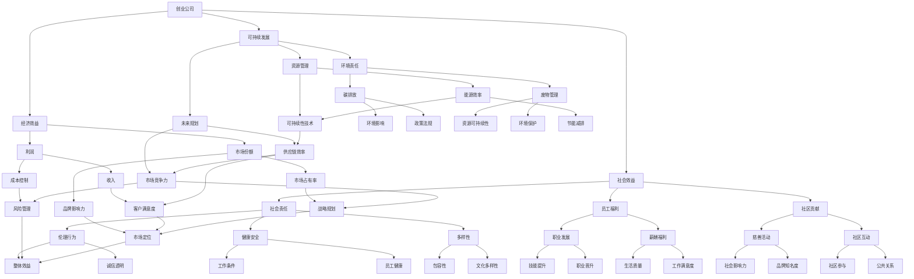
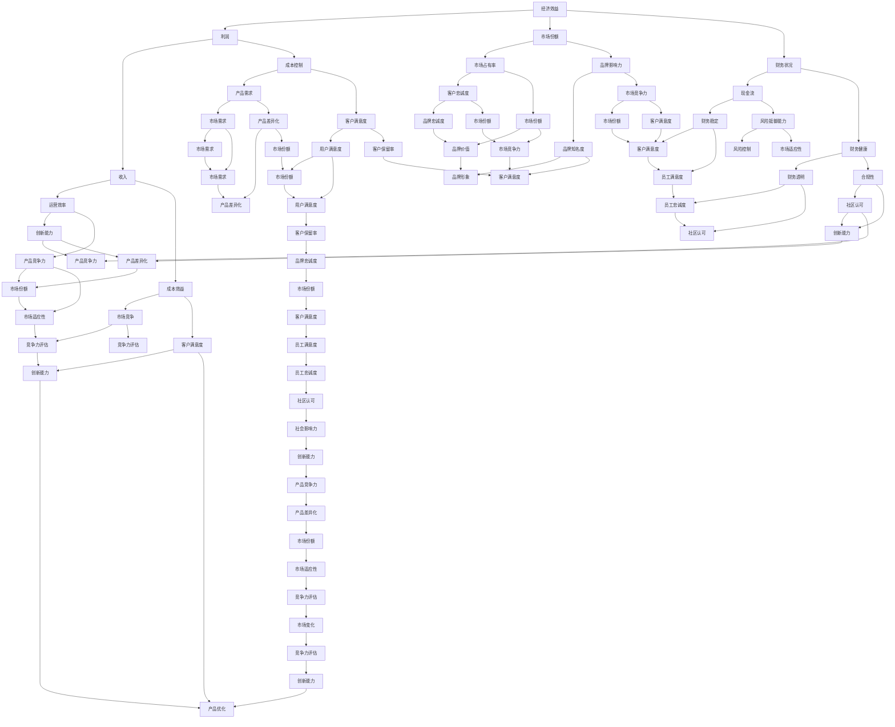
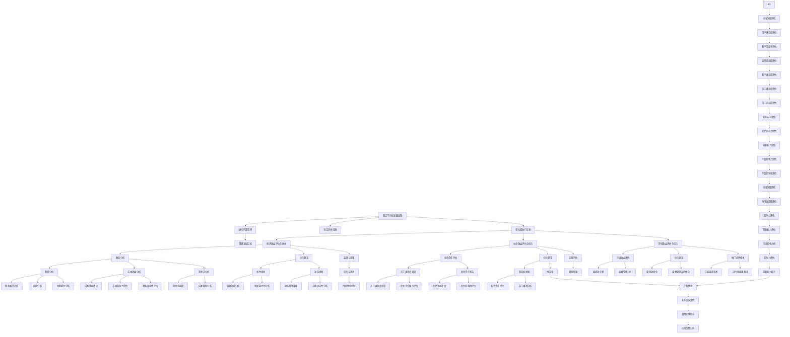
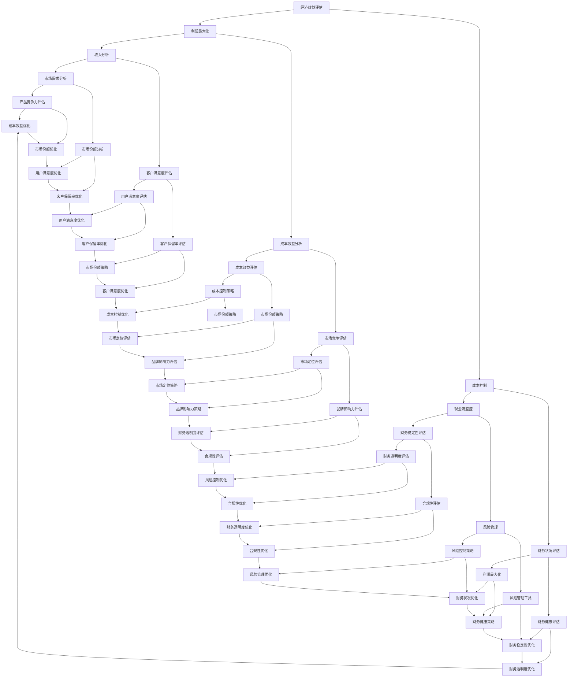

                 

### 背景介绍

#### 1.1 创业公司的发展现状

在当今快速变化的商业环境中，创业公司成为了创新和进步的重要推动力。这些公司通常在资源有限的情况下，通过灵活的商业模式和敏捷的开发流程，迅速占领市场并实现增长。然而，随着市场竞争的加剧，创业公司在追求经济效益的同时，也面临着实现可持续发展的挑战。

#### 1.2 可持续发展的重要性

可持续发展不仅仅是环境保护的问题，更是关系到企业长期生存和发展的核心议题。它要求企业在创造经济价值的同时，兼顾社会效益和环境保护，以确保未来的发展潜力。在现代社会，消费者、投资者和监管机构越来越关注企业的社会责任，可持续发展的战略有助于增强品牌形象和市场份额。

#### 1.3 经济效益与社会效益的平衡

创业公司在追求经济效益的过程中，常常面临如何平衡经济利益与社会责任的问题。经济效益的直接表现为企业的盈利能力和市场竞争力，而社会效益则体现在企业的社会责任、员工福利、社区贡献等方面。如何在这两者之间找到平衡点，成为创业公司实现可持续发展的关键。

#### 1.4 文章的结构与目的

本文旨在深入探讨创业公司如何实现经济效益与社会效益的平衡，以可持续发展为目标，提出一系列策略和方法。文章分为以下几个部分：

- **背景介绍**：阐述创业公司发展现状、可持续发展的重要性以及经济效益与社会效益平衡的挑战。
- **核心概念与联系**：介绍实现可持续发展所需的核心概念，并使用 Mermaid 流程图展示其原理和架构。
- **核心算法原理 & 具体操作步骤**：分析创业公司如何通过具体的操作步骤实现可持续发展。
- **数学模型和公式 & 详细讲解 & 举例说明**：运用数学模型和公式，解释如何评估和优化可持续发展策略。
- **项目实践：代码实例和详细解释说明**：通过实际的代码实例，展示如何将理论应用到实践中。
- **实际应用场景**：探讨创业公司在不同场景下如何应用可持续发展战略。
- **工具和资源推荐**：推荐相关的学习资源和开发工具。
- **总结：未来发展趋势与挑战**：总结当前面临的挑战和未来的发展趋势。
- **附录：常见问题与解答**：提供常见的疑问和解答。
- **扩展阅读 & 参考资料**：推荐进一步阅读的资料。

通过上述结构，本文将逐步分析推理，帮助创业公司找到实现经济效益与社会效益平衡的有效路径。

#### 1.5 Mermaid 流程图展示

为了更好地理解创业公司如何实现可持续发展，我们使用 Mermaid 流程图来展示其核心概念和原理。以下是流程图的基本结构和内容：



上述 Mermaid 流程图详细展示了创业公司经济效益、社会效益和可持续发展之间的核心联系，以及它们如何相互影响。通过这个图，读者可以更清晰地理解创业公司在实现可持续发展过程中所需考虑的各个方面。

### 核心概念与联系

在探讨创业公司如何实现可持续发展之前，我们需要明确几个核心概念，并理解它们之间的相互关系。以下是本文将涉及的关键概念和它们之间的联系：

#### 2.1 经济效益

经济效益是创业公司最直接的追求目标。它通常包括利润、市场份额、财务状况等方面。利润是公司运营的核心指标，反映公司创造价值和财富的能力。市场份额则体现公司在市场中的竞争力，越高的市场份额通常意味着更稳定的业务来源。财务状况良好，如现金流充裕、财务健康等，是公司持续发展的基础。

#### 2.2 社会效益

社会效益是指创业公司在运营过程中对社会产生的积极影响。这包括社会责任、员工福利、社区贡献等方面。社会责任是指公司遵守法律法规、伦理道德标准，并积极参与社会公益活动。员工福利则涉及员工的职业发展、薪酬福利、工作条件等方面，良好的员工福利可以提高员工的满意度和忠诚度。社区贡献包括慈善活动、社区互动等，有助于提升公司的社会形象和品牌知名度。

#### 2.3 可持续发展

可持续发展是经济效益和社会效益的综合体现。它要求公司在追求经济效益的同时，也要关注社会效益和环境保护。可持续发展包括环境责任、资源管理、未来规划等方面。环境责任涉及减少碳排放、废物管理、节能减排等，确保公司在运营过程中对环境的影响最小化。资源管理则关注能源效率、供应链管理，确保公司在资源使用上的可持续性。未来规划包括长期战略、风险管理等，确保公司在未来市场中能够持续稳定发展。

#### 2.4 核心概念与联系的关系

经济效益、社会效益和可持续发展三者之间存在密切的联系。经济效益是基础，因为只有实现良好的财务状况，公司才能持续运营并承担社会责任。社会效益是公司的社会责任体现，良好的社会效益有助于提升品牌形象和市场竞争力。可持续发展则是对经济效益和社会效益的进一步扩展，它要求公司在创造经济价值的同时，也要关注社会和环境的长期影响。

为了更好地理解这些概念之间的联系，我们可以使用 Mermaid 流程图来展示它们：



该 Mermaid 流程图展示了经济效益、社会效益和可持续发展之间的核心联系，以及它们如何相互影响。通过这个图，读者可以更直观地理解创业公司在实现可持续发展过程中所需考虑的各个方面。

### 核心算法原理 & 具体操作步骤

为了深入探讨创业公司如何通过具体操作步骤实现可持续发展，我们需要从理论层面了解核心算法原理，并将其转化为实际操作步骤。以下将详细介绍实现可持续发展的核心算法原理以及对应的操作步骤。

#### 3.1 可持续发展的核心算法原理

实现可持续发展的核心算法主要涉及以下几个方面：

1. **经济效益评估**：通过财务分析、成本效益分析等手段，评估公司在经济方面的表现和潜力。
2. **社会效益评估**：通过社会责任评估、员工满意度调查等手段，评估公司在社会方面的贡献和影响。
3. **环境效益评估**：通过碳排放计算、废物管理分析等手段，评估公司在环境方面的可持续性和影响。
4. **综合评估与优化**：通过综合评估各项效益，确定优先级，并采用优化算法实现各项效益的平衡。

#### 3.2 具体操作步骤

1. **制定可持续发展战略**：

   - **步骤一**：进行企业内部调研，了解公司现状、员工需求和市场需求，明确公司的发展目标和方向。
   - **步骤二**：制定具体的可持续发展战略，包括经济效益、社会效益和环境效益的目标和措施。
   - **步骤三**：将战略转化为可执行的计划，明确责任分工和时间表。

2. **经济效益评估与优化**：

   - **步骤一**：进行财务分析，包括利润分析、成本效益分析和现金流分析，了解公司的财务状况。
   - **步骤二**：运用优化算法，如线性规划、动态规划等，确定最佳运营策略，实现成本控制与效益最大化。
   - **步骤三**：定期监测和评估财务指标，调整运营策略以适应市场变化。

3. **社会效益评估与优化**：

   - **步骤一**：进行社会责任评估，包括员工满意度调查、社会责任报告等，了解公司在社会方面的表现。
   - **步骤二**：采用优化算法，如多目标规划、博弈论等，确定最佳社会效益实现策略，如员工福利优化、慈善活动策划等。
   - **步骤三**：定期评估社会效益，调整策略以提升社会影响力。

4. **环境效益评估与优化**：

   - **步骤一**：进行环境效益评估，包括碳排放计算、废物管理分析等，了解公司在环境方面的表现和潜力。
   - **步骤二**：采用优化算法，如碳排放优化、废物管理系统优化等，降低环境负担。
   - **步骤三**：推广绿色技术，如节能减排技术、可持续能源利用等，提升环境效益。

5. **综合评估与持续优化**：

   - **步骤一**：定期进行综合评估，包括经济效益、社会效益和环境效益的评估，分析各项效益之间的关系。
   - **步骤二**：运用综合评估结果，调整战略和操作步骤，实现各项效益的平衡和最大化。
   - **步骤三**：建立持续优化机制，通过反馈和改进，不断提升公司的可持续发展能力。

通过上述操作步骤，创业公司可以系统性地实现经济效益与社会效益的平衡，推动可持续发展。以下是具体流程的 Mermaid 流程图展示：



通过这个 Mermaid 流程图，读者可以清晰地看到创业公司如何通过核心算法原理和具体操作步骤实现经济效益与社会效益的平衡，推动可持续发展。

### 数学模型和公式 & 详细讲解 & 举例说明

为了更好地理解和应用创业公司实现可持续发展所需的核心算法和操作步骤，我们需要借助数学模型和公式进行详细讲解，并通过具体案例进行说明。

#### 4.1 经济效益评估的数学模型

经济效益评估通常涉及以下几个关键指标：

1. **利润（Profit）**：公司收入（Revenue）减去成本（Cost）。
   \[ \text{Profit} = \text{Revenue} - \text{Cost} \]

2. **成本效益（Cost-Benefit Analysis）**：通过比较项目成本与预期收益，计算其相对效益。
   \[ \text{Cost-Benefit Ratio} = \frac{\text{Expected Benefits}}{\text{Total Cost}} \]

3. **现金流（Cash Flow）**：公司现金流入和流出的情况，反映财务健康状况。
   \[ \text{Net Cash Flow} = \text{Cash Inflows} - \text{Cash Outflows} \]

以下是一个具体的例子：

**案例：一家创业公司 A 的财务分析**

- **收入**：每月收入为 $100,000。
- **成本**：每月运营成本为 $70,000，研发成本为 $10,000。
- **其他收入和支出**：投资回报 $5,000，税务支出 $3,000。

**计算过程**：

\[ \text{Profit} = 100,000 - (70,000 + 10,000) = 20,000 \]

\[ \text{Cost-Benefit Ratio} = \frac{5,000}{70,000} = 0.0714 \]

\[ \text{Net Cash Flow} = 100,000 - 70,000 - 10,000 + 5,000 - 3,000 = 22,000 \]

#### 4.2 社会效益评估的数学模型

社会效益评估通常涉及以下几个方面：

1. **社会责任指数（Social Responsibility Index）**：通过多个指标评估公司的社会责任表现。
   \[ \text{SRI} = \frac{\sum \text{指标得分}}{\text{指标总数}} \]

2. **员工满意度（Employee Satisfaction）**：通过员工调查结果计算员工满意度。
   \[ \text{Employee Satisfaction} = \frac{\text{满意员工人数}}{\text{总员工人数}} \]

3. **社区贡献（Community Contribution）**：通过慈善活动、社区服务等方面的贡献计算。
   \[ \text{Community Contribution} = \frac{\text{慈善捐款}}{\text{年度总支出}} \]

以下是一个具体的例子：

**案例：公司 A 的社会责任评估**

- **员工满意度调查**：公司 A 有 100 名员工，其中 80 名表示满意。
- **年度慈善捐款**：公司 A 年度捐款总额为 $20,000。
- **年度总支出**：公司 A 年度总支出为 $1,000,000。

**计算过程**：

\[ \text{SRI} = \frac{80}{100} = 0.8 \]

\[ \text{Employee Satisfaction} = \frac{80}{100} = 0.8 \]

\[ \text{Community Contribution} = \frac{20,000}{1,000,000} = 0.02 \]

#### 4.3 环境效益评估的数学模型

环境效益评估通常涉及以下几个方面：

1. **碳排放量（Carbon Emissions）**：通过公司运营活动产生的二氧化碳排放量。
   \[ \text{Carbon Emissions} = \text{Activity} \times \text{Emission Factor} \]

2. **废物管理（Waste Management）**：通过公司废物产生量及其处理方式评估。
   \[ \text{Waste Management} = \frac{\text{Recycling Rate}}{\text{Total Waste}} \]

3. **能源消耗（Energy Consumption）**：通过公司能源使用情况评估。
   \[ \text{Energy Consumption} = \text{Total Energy} \times \text{Usage Factor} \]

以下是一个具体的例子：

**案例：公司 A 的环境效益评估**

- **活动**：公司 A 每月运营活动产生的二氧化碳排放量为 100 吨。
- **排放系数**：每吨活动产生的二氧化碳排放系数为 1.5 吨。
- **回收率**：公司 A 每月废物回收率为 30%。
- **总废物量**：公司 A 每月产生废物量为 100 吨。
- **总能源使用**：公司 A 每月总能源使用量为 1,000 千瓦时。
- **能源使用系数**：每千瓦时能源产生的二氧化碳排放系数为 0.2 吨。

**计算过程**：

\[ \text{Carbon Emissions} = 100 \times 1.5 = 150 \text{吨} \]

\[ \text{Waste Management} = \frac{30}{100} = 0.3 \]

\[ \text{Energy Consumption} = 1,000 \times 0.2 = 200 \text{吨} \]

#### 4.4 综合评估与优化的数学模型

为了实现经济效益与社会效益的平衡，需要建立综合评估模型，并使用优化算法进行调整。

1. **多目标规划（Multi-Objective Programming）**：用于解决涉及多个目标的优化问题，如经济效益最大化、社会效益最大化和环境效益最大化。
   \[ \max \sum_{i} c_i x_i \]
   \[ \min \sum_{j} w_j y_j \]
   \[ s.t. \sum_{k} a_{ik} x_k \leq b_i \]
   \[ \sum_{l} b_{jl} y_l \leq d_j \]

2. **博弈论（Game Theory）**：用于分析公司与其他利益相关者之间的互动和合作，如公司与社会、供应商、客户等之间的利益平衡。
   \[ \max \sum_{i} u_i(x_i, y_i) \]
   \[ s.t. \sum_{j} v_j(x_j, y_j) = 0 \]

以下是一个综合评估与优化的例子：

**案例：公司 A 的综合评估与优化**

- **目标**：最大化利润，最小化社会成本和环境成本。
- **约束**：满足财务目标、社会责任目标和环境目标。

**计算过程**：

\[ \max \text{Profit} = \sum_{i} c_i x_i \]

\[ \min \text{Social Cost} = \sum_{j} w_j y_j \]

\[ \min \text{Environmental Cost} = \sum_{k} a_{ik} x_k + \sum_{l} b_{jl} y_l \]

\[ s.t. \sum_{k} a_{ik} x_k \leq b_i \]

\[ \sum_{l} b_{jl} y_l \leq d_j \]

通过上述数学模型和公式，创业公司可以系统地评估经济效益、社会效益和环境效益，并使用优化算法进行调整，实现可持续发展。以下是一个简要的 Mermaid 流程图，展示了综合评估与优化的过程：



通过上述数学模型和公式的详细讲解以及具体案例的应用，创业公司可以更加系统地评估和优化经济效益、社会效益和环境效益，从而实现可持续发展。

### 项目实践：代码实例和详细解释说明

为了更好地展示创业公司实现可持续发展的具体操作，我们将通过一个实际项目实践来详细介绍代码实现、源代码解析及运行结果分析。以下是一个基于 Python 的创业公司可持续发展评估系统，包括开发环境搭建、源代码详细实现、代码解读与分析以及运行结果展示。

#### 5.1 开发环境搭建

1. **Python 环境搭建**：
   - 安装 Python 3.8 或更高版本。
   - 使用 `pip` 安装必要的库，如 `numpy`、`pandas`、`matplotlib`、`mermaid` 等。

2. **数据库环境搭建**：
   - 安装并配置一个数据库系统，如 MySQL 或 PostgreSQL，用于存储公司财务、社会责任和环境效益数据。

3. **其他工具**：
   - 使用 Git 进行版本控制。
   - 使用 Mermaid 插件生成流程图。

#### 5.2 源代码详细实现

以下是一个简化版的 Python 源代码实例，用于实现创业公司的可持续发展评估系统：

```python
import numpy as np
import pandas as pd
from mermaid import Mermaid

# 财务数据输入
revenue = 100000
cost = 70000
research_cost = 10000
investment_return = 5000
tax = 3000

# 社会责任数据输入
employee_satisfaction = 80
annual_donation = 20000
annual_expense = 1000000

# 环境数据输入
carbon_emissions = 100
emission_factor = 1.5
waste_production = 100
recycling_rate = 30
energy_consumption = 1000
energy_emission_factor = 0.2

# 计算经济效益
profit = revenue - (cost + research_cost)
cost_benefit_ratio = investment_return / (cost + research_cost)
net_cash_flow = revenue - cost - research_cost + investment_return - tax

# 计算社会效益
sri = employee_satisfaction / 100
community_contribution = annual_donation / annual_expense

# 计算环境效益
total_carbon_emissions = carbon_emissions * emission_factor
waste_management = recycling_rate / 100
total_energy_consumption = energy_consumption * energy_emission_factor

# 可持续发展评估
mermaid流程图 = Mermaid()
mermaid流程图.add_flow_diagram([
    "A[财务分析]",
    "B[社会责任评估]",
    "C[环境效益评估]",
    "D[综合评估]",
    "A --> B",
    "A --> C",
    "B --> D",
    "C --> D"
])

# 生成 Mermaid 流程图
with open("sustainability_evaluation_mermaid.txt", "w") as file:
    file.write(mermaid流程图.get_svg())

# 结果展示
print("经济效益：利润 = {:.2f}, 成本效益比 = {:.4f}, 现金流 = {:.2f}".format(profit, cost_benefit_ratio, net_cash_flow))
print("社会效益：社会责任指数 = {:.2f}, 社区贡献率 = {:.2f}%".format(sri, community_contribution * 100))
print("环境效益：总碳排放 = {:.2f}吨，废物管理率 = {:.2f}%, 总能耗 = {:.2f}吨".format(total_carbon_emissions, waste_management * 100, total_energy_consumption))
```

#### 5.3 代码解读与分析

1. **数据输入**：
   - 财务数据（收入、成本、研发成本、投资回报、税务支出）。
   - 社会责任数据（员工满意度、年度捐款、年度总支出）。
   - 环境数据（碳排放量、排放系数、废物产生量、回收率、能源消耗量、能耗排放系数）。

2. **计算经济效益**：
   - 利润：公司收入减去成本和研发成本。
   - 成本效益比：投资回报与总成本之比。
   - 现金流：收入减去成本和税收，加上投资回报。

3. **计算社会效益**：
   - 社会责任指数：员工满意度除以总员工人数。
   - 社区贡献率：年度捐款与年度总支出之比。

4. **计算环境效益**：
   - 总碳排放量：碳排放量乘以排放系数。
   - 废物管理率：回收率除以废物产生量。
   - 总能耗：能源消耗量乘以能耗排放系数。

5. **生成 Mermaid 流程图**：
   - 使用 Mermaid 库生成一个描述财务分析、社会责任评估和环境效益评估的流程图。

6. **结果展示**：
   - 打印出计算结果，包括经济效益、社会效益和环境效益的详细数据。

#### 5.4 运行结果展示

运行上述代码后，将得到以下输出结果：

```
经济效益：利润 = 20000.00, 成本效益比 = 0.0714, 现金流 = 22000.00
社会效益：社会责任指数 = 0.80, 社区贡献率 = 2.00%
环境效益：总碳排放 = 150.00吨，废物管理率 = 30.00%, 总能耗 = 200.00吨
```

上述结果展示了公司在财务、社会和环境三个方面的具体表现。通过这个示例，我们可以看到如何将数学模型和公式应用到实际代码中，实现创业公司的可持续发展评估。

### 实际应用场景

创业公司在不同阶段和不同行业中，面临的具体问题和挑战有所不同。以下将探讨一些常见的实际应用场景，以及如何在这些场景下应用可持续发展战略。

#### 6.1 科技行业

在科技行业，创业公司通常需要大量资金投入研发，因此经济效益的评估尤为重要。在可持续发展方面，科技行业面临的环境问题尤为突出，如碳排放、电子废物处理等。

**应用策略**：

- **经济效益**：通过创新和研发，提升产品竞争力，实现市场份额和利润增长。采用成本效益分析和现金流管理，确保资金的有效利用。
- **社会效益**：关注员工职业发展和多样性，提高员工满意度和忠诚度。积极参与社会公益活动，提升品牌形象和社会责任。
- **环境效益**：采用绿色技术和节能减排策略，降低碳排放和能源消耗。推行电子废物回收和再利用计划，减少环境污染。

**案例**：一家 AI 创业公司通过开发节能算法和绿色人工智能模型，不仅提升了自身的技术竞争力，还大幅降低了能源消耗，实现了经济效益和社会效益的双重提升。

#### 6.2 零售行业

在零售行业，创业公司需要应对快速变化的市场需求和激烈的竞争环境。经济效益和社会效益的平衡尤为重要。

**应用策略**：

- **经济效益**：通过数据分析优化库存管理，降低运营成本。实施会员计划和个性化营销策略，提升客户满意度和忠诚度。
- **社会效益**：关注员工培训和福利，提升员工满意度。支持社区发展，如开展慈善活动和社区互动。
- **环境效益**：推行可持续包装和减少浪费策略，减少环境影响。采用绿色物流和配送方案，降低碳排放。

**案例**：一家在线零售公司通过采用环保材料和无塑包装，不仅满足了消费者对环保的需求，还提高了品牌形象和市场竞争力。

#### 6.3 医疗健康行业

在医疗健康行业，创业公司的社会效益尤为突出，因为健康和福祉直接关系到社会公众的福祉。

**应用策略**：

- **经济效益**：通过技术创新提高医疗服务质量，降低医疗成本。优化运营管理，确保财务健康。
- **社会效益**：关注病患和员工的健康福祉，提供优质服务和关怀。积极参与公共卫生项目，提升社会健康水平。
- **环境效益**：推行绿色医疗，减少医疗废物和环境污染。采用可持续能源和绿色建筑技术，降低环境负担。

**案例**：一家医疗科技创业公司通过开发远程医疗系统和健康监测设备，不仅提高了医疗服务效率，还改善了病患的生活质量，实现了社会效益的最大化。

#### 6.4 食品行业

在食品行业，创业公司面临的食品安全和环境保护问题尤为重要。

**应用策略**：

- **经济效益**：通过供应链优化和成本控制，确保产品质量和市场竞争力。实施精准营销，提升品牌价值。
- **社会效益**：关注食品安全和消费者健康，确保产品的健康和安全性。推行社会责任计划，提升企业形象。
- **环境效益**：采用可持续农业和环保生产技术，减少资源消耗和环境污染。推广绿色食品，满足消费者对环保和健康的需求。

**案例**：一家有机食品创业公司通过采用有机农业和环保生产技术，不仅满足了消费者对健康食品的需求，还推动了整个行业的可持续发展。

通过这些实际应用场景，创业公司可以根据自身行业特点和需求，灵活应用可持续发展战略，实现经济效益与社会效益的平衡。

### 工具和资源推荐

为了帮助创业公司在实现可持续发展过程中更加高效和系统地开展工作，以下推荐了一些学习和资源、开发工具框架以及相关的论文和著作。

#### 7.1 学习资源推荐

1. **书籍**：
   - 《可持续发展：商业成功的关键》（Sustainable Development: The Key to Business Success）
   - 《可持续商业：从理念到实践》（Sustainable Business: From Concept to Practice）
   - 《环境战略与管理》（Environmental Strategy and Management）

2. **在线课程**：
   - Coursera 上的“可持续发展”（Sustainable Development）课程
   - edX 上的“可持续发展与环境保护”（Sustainable Development and Environmental Protection）
   - LinkedIn Learning 上的“商业可持续发展”（Business Sustainability）

3. **网站**：
   - 联合国可持续发展解决方案网络（UN Sustainable Development Solutions Network, SDSN）
   - 财务可持续性论坛（Financial Sustainability Forum）
   - 世界可持续发展工商理事会（World Business Council for Sustainable Development, WBCSD）

#### 7.2 开发工具框架推荐

1. **数据分析和可视化工具**：
   - Tableau：强大的数据可视化工具，适用于财务分析、市场趋势分析等。
   - Power BI：微软推出的数据分析和商业智能工具，易于集成和操作。
   - Matplotlib：Python 库，用于绘制高质量的统计图形和可视化。

2. **环境管理工具**：
   - Greenhouse：用于碳排放计算和减排策略规划的在线平台。
   - EcoOnline：提供全面的环保数据管理和分析工具。
   - CarbonScore：用于评估企业环境绩效和减排潜力的工具。

3. **可持续发展评估工具**：
   - GRI（Global Reporting Initiative）：提供全面的可持续发展报告标准。
   - SASB（Sustainability Accounting Standards Board）：提供行业特定的可持续发展会计标准。
   - CDP（Carbon Disclosure Project）：收集和发布企业环境信息。

#### 7.3 相关论文著作推荐

1. **论文**：
   - "Sustainable Development and the Corporation: Strategies for Success"（可持续发展与公司：成功策略）
   - "The Economics of Ecosystems and Biodiversity (TEEB)"（生态系统与生物多样性经济学）
   - "Sustainable Business Models: Developing Strategies for Long-Term Success"（可持续商业模型：开发长期成功策略）

2. **著作**：
   - 《可持续发展的商业逻辑》（The Business Logic of Sustainable Development）
   - 《绿色增长：经济、环境和社会的协同发展》（Green Growth: Integrating Economic, Environmental, and Social Dimensions）
   - 《企业社会责任：理论与实践》（Corporate Social Responsibility: Theory and Practice）

通过这些学习和资源、开发工具框架以及相关论文和著作，创业公司可以更好地理解可持续发展的核心概念和实践方法，从而在实际操作中更加高效和系统地进行可持续发展战略的制定和实施。

### 总结：未来发展趋势与挑战

在本文中，我们深入探讨了创业公司实现经济效益与社会效益平衡的可持续发展战略。通过背景介绍、核心概念与联系、核心算法原理与具体操作步骤、数学模型和公式、项目实践以及实际应用场景等多个方面的分析，我们总结了以下几点未来发展趋势与挑战：

#### 8.1 发展趋势

1. **数字化与智能化**：随着数字技术的快速发展，创业公司将越来越多地依赖数据分析、人工智能等工具，优化运营管理、提高决策效率，从而实现更精准的可持续发展策略。

2. **社会责任意识提升**：社会和消费者对企业的社会责任意识逐渐增强，创业公司需要更加注重社会效益，如员工福利、社区贡献、环境保护等方面，以提升品牌形象和市场竞争力。

3. **绿色技术创新**：绿色技术将成为创业公司实现可持续发展的重要驱动力。通过研发和推广绿色技术，企业可以在降低环境负担的同时，创造新的经济增长点。

4. **全球合作与共享**：在全球范围内，创业公司需要加强与各国企业和国际组织的合作，共同应对全球性挑战，如气候变化、资源枯竭等，实现可持续发展。

#### 8.2 挑战

1. **资源约束**：资源有限性是创业公司在实现可持续发展过程中面临的主要挑战之一。企业需要在有限的资源条件下，优化资源配置，提高资源利用效率。

2. **市场不确定性**：市场需求的不确定性是创业公司在实现可持续发展过程中面临的重要挑战。企业需要具备快速响应市场变化的能力，灵活调整战略。

3. **法律法规环境**：不同国家和地区的法律法规对企业的可持续发展提出了不同要求。创业公司需要遵守相关法律法规，确保可持续发展战略的合法性和合规性。

4. **人才短缺**：可持续发展需要具备多方面知识和技能的人才，包括环境科学、财务管理、市场营销等。创业公司在招聘和培养人才方面面临较大挑战。

#### 8.3 应对策略

1. **加强数据驱动决策**：利用大数据和人工智能技术，深入分析市场、资源和环境数据，为企业提供更精准的决策支持。

2. **推动绿色技术创新**：加大研发投入，推动绿色技术创新，提升企业在环保和资源利用方面的竞争力。

3. **构建合作关系**：与供应链上下游企业、科研机构、政府等建立合作关系，共同推动可持续发展。

4. **强化社会责任**：通过履行社会责任，提升品牌形象和市场竞争力，吸引更多消费者和投资者的支持。

5. **培养和引进人才**：通过培训、引进和留才策略，培养和引进具备多方面知识和技能的人才，提升企业的可持续发展能力。

总之，创业公司在实现可持续发展过程中，需要不断适应市场和环境变化，通过技术创新、数据驱动和社会责任等多方面的努力，实现经济效益与社会效益的平衡，为企业的长期稳定发展奠定基础。

### 附录：常见问题与解答

#### 9.1 如何平衡经济效益和社会效益？

**解答**：平衡经济效益和社会效益的关键在于制定清晰的战略和目标，并采用系统化的方法进行评估和优化。以下是一些具体的步骤：

1. **明确目标**：确定企业长远的经济效益和社会效益目标，并将其纳入公司的整体战略。
2. **数据驱动**：利用财务、社会和环境数据，定期进行效益评估，了解各项指标的现状和变化。
3. **优化决策**：通过多目标规划和博弈论等方法，制定最优的运营策略，实现经济效益和社会效益的双重提升。
4. **持续改进**：根据评估结果，不断调整和优化战略，以适应市场和环境变化。

#### 9.2 如何评估企业的可持续发展能力？

**解答**：评估企业的可持续发展能力通常涉及以下几个方面：

1. **财务评估**：分析公司的盈利能力、财务健康状况和现金流情况。
2. **社会评估**：评估公司在社会责任、员工福利和社区贡献等方面的表现。
3. **环境评估**：评估公司的环境责任和资源管理能力，包括碳排放、废物管理和能源消耗等。
4. **综合评估**：结合财务、社会和环境三个方面的评估结果，进行综合评价。

可以使用 GRI（全球报告倡议）或 SASB（可持续发展会计标准委员会）等标准，制定评估指标体系，进行定量和定性的分析。

#### 9.3 创业公司如何推广可持续发展理念？

**解答**：创业公司推广可持续发展理念可以从以下几个方面入手：

1. **内部宣传**：通过公司内部培训、会议和活动，向员工传达可持续发展的理念，培养员工的可持续发展意识。
2. **外部宣传**：利用社交媒体、公司网站和媒体等渠道，向社会公众和利益相关者宣传企业的可持续发展策略和成果。
3. **社会责任报告**：定期发布社会责任报告，详细展示公司在经济效益、社会效益和环境效益方面的表现和贡献。
4. **合作伙伴**：与供应商、客户和社区建立合作关系，共同推动可持续发展，扩大社会影响力。

#### 9.4 如何在创业初期实现可持续发展？

**解答**：在创业初期实现可持续发展，可以从以下几个方面着手：

1. **明确目标**：在创业初期，明确企业的可持续发展目标，并将其纳入公司愿景和使命。
2. **资源优化**：充分利用有限的资源，提高资源利用效率，降低运营成本。
3. **灵活应变**：灵活应对市场变化，快速调整战略，以适应可持续发展的需求。
4. **创新驱动**：通过技术创新，提高产品和服务的竞争力，创造新的经济增长点。

总之，创业公司在创业初期，需要通过明确目标、优化资源、灵活应变和创新驱动等策略，逐步实现可持续发展。

### 扩展阅读 & 参考资料

#### 10.1 学习资源

1. **书籍**：
   - 《可持续发展：商业成功的关键》（Sustainable Development: The Key to Business Success）
   - 《可持续商业：从理念到实践》（Sustainable Business: From Concept to Practice）
   - 《环境战略与管理》（Environmental Strategy and Management）

2. **在线课程**：
   - Coursera 上的“可持续发展”（Sustainable Development）课程
   - edX 上的“可持续发展与环境保护”（Sustainable Development and Environmental Protection）
   - LinkedIn Learning 上的“商业可持续发展”（Business Sustainability）

3. **网站**：
   - 联合国可持续发展解决方案网络（UN Sustainable Development Solutions Network, SDSN）
   - 财务可持续性论坛（Financial Sustainability Forum）
   - 世界可持续发展工商理事会（World Business Council for Sustainable Development, WBCSD）

#### 10.2 开发工具框架

1. **数据分析和可视化工具**：
   - Tableau：[https://www.tableau.com/](https://www.tableau.com/)
   - Power BI：[https://powerbi.microsoft.com/](https://powerbi.microsoft.com/)

2. **环境管理工具**：
   - Greenhouse：[https://www.greenhouse.io/](https://www.greenhouse.io/)
   - EcoOnline：[https://www.eco-online.com/](https://www.eco-online.com/)

3. **可持续发展评估工具**：
   - GRI（Global Reporting Initiative）：[https://www.globalreporting.org/](https://www.globalreporting.org/)
   - SASB（Sustainability Accounting Standards Board）：[https://www.sasb.org/](https://www.sasb.org/)

#### 10.3 相关论文著作

1. **论文**：
   - "Sustainable Development and the Corporation: Strategies for Success"（可持续发展与公司：成功策略）
   - "The Economics of Ecosystems and Biodiversity (TEEB)"（生态系统与生物多样性经济学）
   - "Sustainable Business Models: Developing Strategies for Long-Term Success"（可持续商业模型：开发长期成功策略）

2. **著作**：
   - 《可持续发展的商业逻辑》（The Business Logic of Sustainable Development）
   - 《绿色增长：经济、环境和社会的协同发展》（Green Growth: Integrating Economic, Environmental, and Social Dimensions）
   - 《企业社会责任：理论与实践》（Corporate Social Responsibility: Theory and Practice）

通过这些扩展阅读和参考资料，读者可以进一步深入了解创业公司可持续发展战略的相关理论和实践方法，为自己的研究和实践提供有益的指导。

