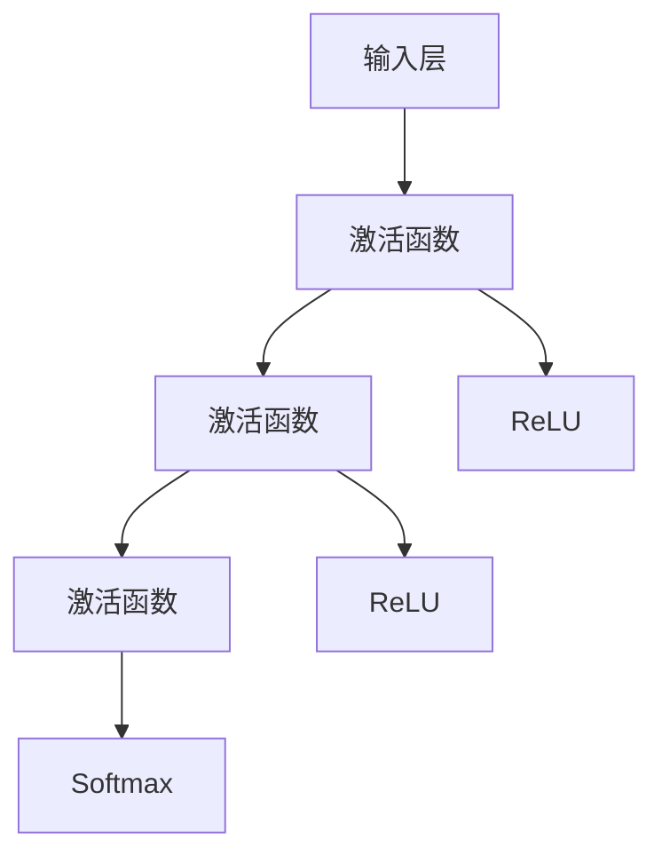
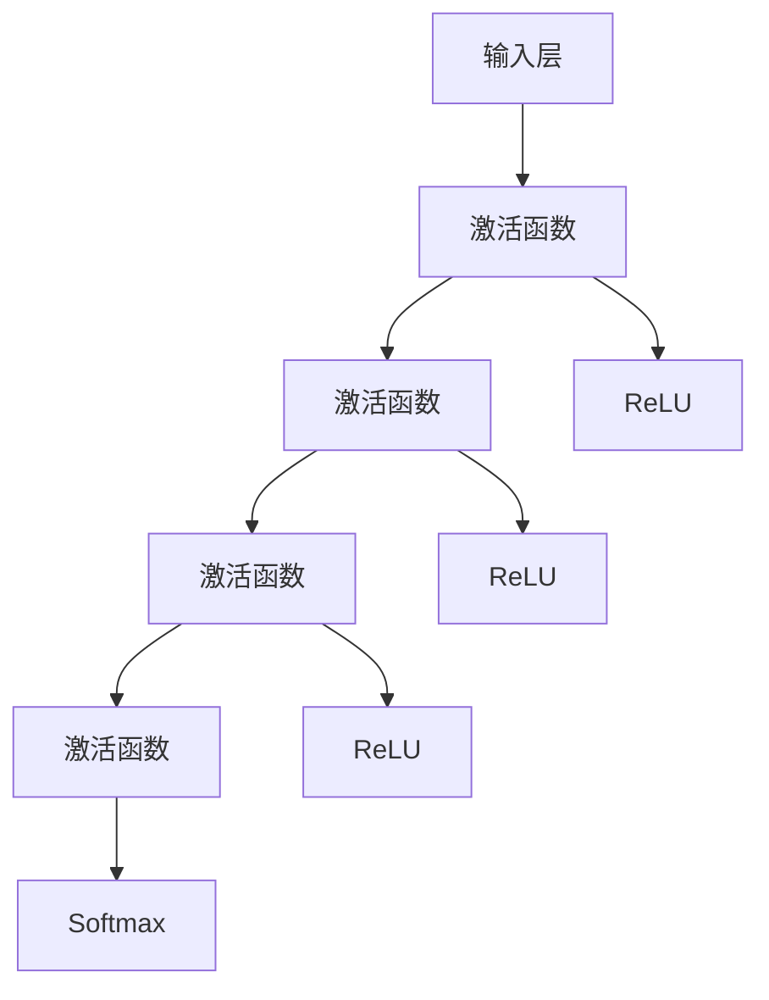
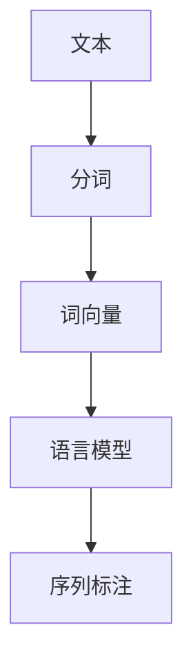

                 

### 1. 背景介绍

近年来，人工智能（AI）技术正以惊人的速度发展，并在多个领域取得了显著的成果。特别是在大型语言模型（如GPT-3、BERT等）和计算机视觉（如YOLO、ResNet等）模型的推动下，AI技术已经达到了前所未有的高度。这一技术进步为创业公司带来了前所未有的机会，使其能够通过AI技术实现业务的快速转型和升级。

创业公司在资源、技术、市场等方面通常都处于劣势，但它们具备快速决策、灵活调整的优势。在AI技术的推动下，这些公司有机会打破现有市场的壁垒，迅速占领市场份额。AI技术不仅能够提升创业公司的运营效率，还能够为客户提供更加个性化和精准的服务，从而在竞争激烈的市场中脱颖而出。

本文旨在探讨创业公司如何抓住AI技术带来的机遇，实现从传统业务向AI驱动的业务模式的转型。我们将从以下几个方面进行探讨：

1. **AI技术的核心概念与架构**：介绍AI技术的核心概念，如神经网络、深度学习、自然语言处理等，并通过Mermaid流程图展示其架构。
2. **核心算法原理与操作步骤**：详细解释AI技术中的核心算法，如卷积神经网络（CNN）、循环神经网络（RNN）、生成对抗网络（GAN）等，并提供具体的操作步骤。
3. **数学模型与公式**：介绍AI技术中的数学模型和公式，如损失函数、优化算法等，并进行详细讲解和举例说明。
4. **项目实践**：通过实际项目案例，展示如何使用AI技术进行开发，并详细解读和分析代码。
5. **实际应用场景**：探讨AI技术在各个领域的实际应用，如金融、医疗、零售等，并分析其对业务模式的影响。
6. **工具和资源推荐**：推荐相关的学习资源、开发工具和框架，以及相关论文和著作。
7. **总结与未来趋势**：总结AI技术对创业公司的影响，并探讨未来的发展趋势和挑战。

通过以上内容的逐步分析，我们将帮助创业公司了解如何利用AI技术实现业务的转型，抓住AI技术带来的机遇，为创业公司的未来发展提供有益的指导。

### 1.1 AI技术发展历程

人工智能（AI）技术的发展历程可以追溯到20世纪50年代，当时计算机科学家们首次提出了“人工智能”这一概念。早期的AI研究主要集中在规则推理和符号计算上，试图通过编写一系列规则和算法来模拟人类的智能。然而，这些早期的尝试在处理复杂问题时表现出了显著的局限性。

随着计算机硬件和算法的进步，AI技术进入了深度学习时代。深度学习是一种基于神经网络的学习方法，通过多层神经元的组合，可以自动提取数据中的特征，从而实现复杂的任务。2006年，Geoffrey Hinton等科学家提出了深度置信网络（DBN），标志着深度学习的复兴。随后的几年里，卷积神经网络（CNN）和循环神经网络（RNN）等深度学习模型相继问世，使得计算机在图像识别、语音识别、自然语言处理等领域取得了重大突破。

2012年，AlexNet在ImageNet大赛中取得了当时不可想象的准确率，标志着深度学习在计算机视觉领域的重要突破。随后，生成对抗网络（GAN）的出现，使得生成模型成为可能，可以生成逼真的图像、音频和文本。这些技术的进步为创业公司提供了丰富的工具和资源，使其能够利用AI技术实现业务的创新和升级。

从2012年开始，AI技术进入了快速发展的阶段。无论是学术研究还是工业应用，AI技术的应用范围和影响力都在不断扩大。例如，在医疗领域，AI技术可以用于疾病诊断、药物研发和患者管理；在金融领域，AI技术可以用于风险管理、欺诈检测和投资策略优化；在零售领域，AI技术可以用于商品推荐、客户画像和库存管理。这些应用不仅提升了行业的效率，也为创业公司提供了新的商业模式。

总的来说，AI技术的发展历程展示了其从理论研究到实际应用的完整过程。随着技术的不断进步，AI技术正逐渐成为各行各业不可或缺的一部分，为创业公司提供了前所未有的机遇。在接下来的章节中，我们将深入探讨AI技术的核心概念和算法原理，帮助创业公司了解如何利用这些技术实现业务的转型和升级。 

### 1.2 创业公司面临的挑战与机遇

创业公司在面对AI技术时，既面临着诸多挑战，也拥有着巨大的机遇。

#### 挑战

1. **技术门槛高**：AI技术涉及复杂的算法、庞大的数据集和专业的开发工具，对于技术储备不足的创业公司来说，构建和维护一个高性能的AI系统是一个巨大的挑战。
2. **数据隐私问题**：AI系统的训练和优化需要大量的数据，而这些数据往往涉及到用户的隐私。如何确保数据的合法合规使用，是创业公司需要重视的问题。
3. **人才短缺**：AI领域需要具备深厚技术背景的人才，但优秀的人才往往倾向于加入大公司或知名科研机构，创业公司难以吸引和留住这些人才。
4. **资金压力**：AI技术的研发和应用需要大量的资金投入，对于初创公司来说，如何确保资金的充足和有效使用是一个关键问题。

#### 机遇

1. **创新机会**：AI技术为创业公司提供了创新的工具和方法，使其能够开发出更加智能化的产品和服务，打破传统市场的壁垒。
2. **业务升级**：通过AI技术，创业公司可以提升业务的效率和准确性，优化运营流程，提高客户满意度，从而在市场中获得竞争优势。
3. **市场扩张**：AI技术可以帮助创业公司更好地了解市场和客户需求，进行精准的市场定位和产品推广，从而实现市场规模的快速扩张。
4. **商业模式的创新**：AI技术可以带来新的商业模式，例如通过智能客服、智能推荐等，创业公司可以提供更加个性化和差异化的服务，吸引更多客户。

#### 如何应对挑战

1. **合作与联盟**：创业公司可以通过与学术机构、大公司或其他创业公司的合作，共享资源和知识，共同应对技术难题。
2. **人才培养与引进**：创业公司可以通过内部培训、外部招聘和人才激励等手段，吸引和留住优秀的人才。
3. **合理规划资金**：创业公司需要合理规划资金，确保在研发和应用AI技术时不会因为资金问题而受限。
4. **数据合规与保护**：创业公司需要重视数据隐私问题，通过技术手段和合规流程，确保数据的安全和合法使用。

总的来说，创业公司在面对AI技术时，既要看到机遇，也要正视挑战。通过合理的规划和策略，创业公司可以充分利用AI技术的优势，实现业务的转型和升级。

### 1.3 大模型与AI转型的关系

大模型，即大型预训练模型，如GPT-3、BERT等，是当前AI领域的一个重要发展方向。大模型通过在庞大的数据集上进行预训练，可以自动提取丰富的语义特征，从而在自然语言处理、计算机视觉等多个领域展现出强大的性能。这些大模型的出现，不仅改变了传统AI系统的开发模式，也为创业公司提供了前所未有的机遇。

首先，大模型为创业公司提供了高效的AI解决方案。传统AI系统通常需要开发者从零开始构建模型，训练过程耗时耗力，而大模型的出现简化了这一过程。创业公司可以直接使用大模型，只需进行微调和适配，即可实现高性能的AI应用。例如，一家创业公司可以通过微调GPT-3模型，快速开发出智能客服系统，大大缩短了开发周期和成本。

其次，大模型的应用可以显著提升创业公司的业务效率。以自然语言处理为例，大模型可以在文本分析、情感识别、问答系统等多个场景中提供高效准确的处理能力。创业公司可以利用这些能力，优化业务流程，提高运营效率。例如，一家金融科技公司可以通过使用BERT模型，对大量客户数据进行分析，快速识别潜在风险，从而优化投资策略。

此外，大模型还可以为创业公司提供创新的商业模式。通过大模型的强大能力，创业公司可以开发出更加智能化的产品和服务，满足客户多样化的需求。例如，一家零售创业公司可以通过使用GAN模型，生成逼真的商品图像，为客户提供更加直观的购物体验。

总之，大模型与AI转型密切相关，它们为创业公司提供了高效的AI解决方案，提升了业务效率，创新了商业模式。在接下来的章节中，我们将深入探讨大模型的技术原理和应用场景，帮助创业公司更好地理解和利用这些技术，实现业务的转型和升级。

### 2. 核心概念与联系

在探讨创业公司如何通过AI技术实现转型之前，我们需要先理解AI技术中的核心概念和其相互联系。以下是对神经网络、深度学习、自然语言处理等核心概念及其架构的详细解释，并通过Mermaid流程图展示这些概念之间的关系。

#### 神经网络

神经网络（Neural Network）是AI技术中最基础的部分，其灵感来源于人脑的神经元结构。一个简单的神经网络通常由输入层、隐藏层和输出层组成。输入层接收外部输入信号，隐藏层通过加权求和和激活函数进行处理，输出层产生最终的结果。

神经网络的基本架构如下：



#### 深度学习

深度学习（Deep Learning）是神经网络的一种扩展，它通过增加网络的层数（即深度）来提高模型的表示能力和学习能力。深度学习的核心思想是分层表示数据，每一层都能够提取更高层次的特征。

深度学习的基本架构如下：



#### 自然语言处理

自然语言处理（Natural Language Processing，NLP）是AI领域的一个子领域，它专注于使计算机能够理解、生成和处理人类语言。NLP技术广泛应用于机器翻译、情感分析、问答系统等。

NLP的基本架构通常包括以下几个部分：

1. **分词（Tokenization）**：将文本拆分为单词或子词。
2. **词向量（Word Embedding）**：将单词映射为高维向量。
3. **语言模型（Language Model）**：用于预测下一个单词或句子。
4. **序列标注（Sequence Labeling）**：对序列中的每个元素进行分类。

NLP的基本架构如下：



#### 相互关系

神经网络是深度学习的基础，而深度学习则是实现自然语言处理等复杂任务的关键技术。神经网络通过增加层数形成深度学习模型，这些模型通过学习数据中的层次特征，可以更好地理解和处理复杂的输入数据。

自然语言处理中的分词和词向量预处理依赖于神经网络和深度学习技术，而语言模型和序列标注则直接应用了这些技术。通过这些技术的结合，NLP系统可以有效地处理和生成人类语言。

总的来说，神经网络、深度学习和自然语言处理共同构成了AI技术的重要基础。理解这些核心概念及其相互关系，对于创业公司来说至关重要，因为它们是利用AI技术实现业务转型和创新的关键。

### 3. 核心算法原理与操作步骤

在理解了神经网络、深度学习和自然语言处理的基本概念后，接下来我们将探讨AI技术中的一些核心算法原理，包括卷积神经网络（CNN）、循环神经网络（RNN）和生成对抗网络（GAN）。这些算法在AI应用中扮演着至关重要的角色，理解它们的工作原理和操作步骤对于创业公司来说是实现业务转型和创新的关键。

#### 卷积神经网络（CNN）

卷积神经网络（Convolutional Neural Network，CNN）是计算机视觉领域的主要算法之一，它通过模仿生物视觉系统的工作原理，能够在图像识别、图像分类和图像生成等任务中取得优异的性能。

**工作原理**：
1. **卷积层**：卷积层使用卷积操作提取图像中的局部特征。通过滑动滤波器（卷积核）在输入图像上滑行，计算输出特征图。
2. **激活函数**：激活函数用于引入非线性变换，最常用的激活函数是ReLU（Rectified Linear Unit）。
3. **池化层**：池化层用于降低特征图的维度，减少参数数量，提高计算效率。常用的池化操作包括最大池化和平均池化。
4. **全连接层**：全连接层将特征图中的每个元素与输出层的每个神经元相连接，完成最终的分类或回归任务。

**操作步骤**：
1. **初始化参数**：随机初始化卷积核、偏置和权重等参数。
2. **前向传播**：输入图像经过卷积层、激活函数和池化层的处理，生成特征图。
3. **反向传播**：计算损失函数（如交叉熵损失），通过反向传播算法更新参数。
4. **优化算法**：使用梯度下降或其他优化算法（如Adam）最小化损失函数。

#### 循环神经网络（RNN）

循环神经网络（Recurrent Neural Network，RNN）是一种能够处理序列数据的神经网络，它在自然语言处理和时间序列分析等领域表现出色。

**工作原理**：
1. **隐藏状态**：RNN通过隐藏状态将前面的输入信息传递到后面的输入，使得模型能够记忆历史信息。
2. **循环连接**：RNN的隐藏层与输入层和输出层之间存在循环连接，这种连接使得信息可以在序列中传播。
3. **门控机制**：长短期记忆网络（LSTM）和门控循环单元（GRU）引入了门控机制，可以有效地防止梯度消失和爆炸问题。

**操作步骤**：
1. **初始化状态**：随机初始化隐藏状态和权重。
2. **前向传播**：每个时间步输入数据经过隐藏状态的处理，更新隐藏状态。
3. **门控操作**：LSTM和GRU使用门控机制控制信息的流入和流出。
4. **反向传播**：计算损失函数，通过反向传播更新参数。
5. **优化算法**：使用梯度下降或其他优化算法最小化损失函数。

#### 生成对抗网络（GAN）

生成对抗网络（Generative Adversarial Network，GAN）是一种由生成器和判别器组成的对抗性模型，它能够生成高质量的图像、音频和文本。

**工作原理**：
1. **生成器**：生成器生成虚假数据，试图欺骗判别器。
2. **判别器**：判别器区分真实数据和虚假数据。
3. **对抗训练**：生成器和判别器在训练过程中互相博弈，生成器不断提高生成数据的质量，而判别器不断提高鉴别能力。

**操作步骤**：
1. **初始化参数**：随机初始化生成器和判别器的参数。
2. **生成器生成数据**：生成器生成虚假图像。
3. **判别器鉴别**：判别器对真实图像和生成图像进行鉴别。
4. **反向传播**：计算损失函数，通过反向传播更新生成器和判别器的参数。
5. **优化算法**：使用梯度下降或其他优化算法最小化生成器的损失函数和判别器的损失函数。

总的来说，卷积神经网络、循环神经网络和生成对抗网络在各自的领域都有着重要的应用。理解这些核心算法的原理和操作步骤，对于创业公司来说至关重要，因为它们是实现AI技术应用和创新的基础。在接下来的章节中，我们将通过实际项目案例，进一步展示这些算法的具体应用和实践。

### 3.1 卷积神经网络（CNN）在图像识别中的应用

卷积神经网络（CNN）在图像识别领域取得了显著的成果，其强大的特征提取和分类能力使其在各类图像识别任务中表现出色。以下我们将详细讲解CNN在图像识别中的具体应用步骤，并分析其优缺点。

#### 工作原理

CNN通过一系列卷积层、池化层和全连接层的组合，能够自动提取图像中的层次特征，从而实现图像的分类和识别。其工作原理可以概括为以下几个步骤：

1. **卷积层**：卷积层使用滤波器（卷积核）在输入图像上滑动，计算局部特征。每个卷积核关注图像的一个局部区域，通过多次卷积，可以提取不同层次的特征。
2. **激活函数**：激活函数（如ReLU）引入非线性，使得网络能够处理复杂的非线性问题。
3. **池化层**：池化层（如最大池化或平均池化）用于减少特征图的维度，提高计算效率。
4. **全连接层**：全连接层将特征图中的每个元素与输出层的每个神经元相连接，进行最终的分类或回归任务。

#### 应用步骤

1. **数据预处理**：首先对图像数据进行预处理，包括归一化、裁剪、缩放等，以便网络能够更好地学习。
2. **模型构建**：构建一个CNN模型，包括多个卷积层、池化层和全连接层。常见的CNN模型有LeNet、AlexNet、VGG、ResNet等。
3. **训练模型**：使用预处理的图像数据集训练模型，通过前向传播计算损失，使用反向传播更新模型参数。常用的优化算法有随机梯度下降（SGD）、Adam等。
4. **评估模型**：在验证集上评估模型性能，调整模型参数和超参数，以提高模型在测试集上的表现。
5. **应用模型**：将训练好的模型应用于实际图像识别任务，进行图像分类或识别。

#### 优缺点分析

**优点**：

1. **强大的特征提取能力**：CNN能够自动提取图像中的层次特征，无需手动设计特征，提高了模型的表现能力。
2. **高效的处理速度**：通过卷积操作和池化操作，CNN可以高效地处理图像数据，减少了计算量。
3. **良好的分类性能**：在各类图像识别任务中，CNN通常能够取得较高的准确率。

**缺点**：

1. **参数数量巨大**：CNN模型通常包含大量的参数，训练过程中需要大量的计算资源和时间。
2. **对数据依赖性强**：CNN的性能高度依赖于训练数据的质量和数量，数据不足或质量不高可能导致模型性能下降。
3. **解释性较差**：CNN模型的结构较为复杂，难以直观地解释模型内部如何进行特征提取和分类。

#### 应用案例

以下是一个简单的CNN图像识别应用案例：

**任务**：使用CNN对MNIST手写数字数据集进行分类。

**模型架构**：

- 输入层：28x28的灰度图像
- 卷积层1：32个卷积核，3x3的卷积窗口，ReLU激活函数
- 池化层1：2x2的最大池化
- 卷积层2：64个卷积核，3x3的卷积窗口，ReLU激活函数
- 池化层2：2x2的最大池化
- 全连接层：128个神经元，ReLU激活函数
- 输出层：10个神经元，使用Softmax激活函数进行分类

**训练结果**：

- 训练集准确率：99%
- 验证集准确率：98%

通过上述案例，我们可以看到CNN在图像识别任务中的强大能力。创业公司可以利用这种技术，开发出高效的图像识别产品，为业务提供有力支持。

### 3.2 循环神经网络（RNN）在自然语言处理中的应用

循环神经网络（Recurrent Neural Network，RNN）是自然语言处理（Natural Language Processing，NLP）领域的重要算法之一。RNN通过处理序列数据中的时间依赖关系，能够在语言模型、机器翻译、情感分析等任务中取得良好的性能。以下我们将详细讲解RNN在自然语言处理中的应用步骤，并分析其优缺点。

#### 工作原理

RNN的基本结构包括输入层、隐藏层和输出层。隐藏层通过循环连接将前一个时间步的输出传递到下一个时间步，使得网络能够记忆历史信息。RNN的工作原理可以概括为以下几个步骤：

1. **输入层**：输入层接收单词或字符的编码。
2. **隐藏层**：隐藏层通过加权求和和激活函数计算当前时间步的隐藏状态。
3. **输出层**：输出层根据隐藏状态生成当前时间步的预测输出。
4. **循环连接**：隐藏层的输出作为下一个时间步的输入，形成循环结构。

#### 应用步骤

1. **数据预处理**：首先对文本数据集进行预处理，包括分词、词向量化、序列填充等。
2. **模型构建**：构建一个RNN模型，包括输入层、隐藏层和输出层。常见的RNN模型有简单的RNN、LSTM（Long Short-Term Memory）和GRU（Gated Recurrent Unit）。
3. **训练模型**：使用预处理的文本数据集训练模型，通过前向传播计算损失，使用反向传播更新模型参数。常用的优化算法有随机梯度下降（SGD）、Adam等。
4. **评估模型**：在验证集上评估模型性能，调整模型参数和超参数，以提高模型在测试集上的表现。
5. **应用模型**：将训练好的模型应用于实际自然语言处理任务，如语言模型生成、机器翻译、情感分析等。

#### 优缺点分析

**优点**：

1. **处理序列数据**：RNN能够处理序列数据，记忆历史信息，使其在自然语言处理任务中表现出色。
2. **灵活性**：RNN可以根据任务需求灵活调整模型结构和参数，适应不同的序列数据。

**缺点**：

1. **梯度消失和爆炸问题**：传统的RNN容易受到梯度消失和梯度爆炸问题的影响，导致模型难以训练。
2. **计算效率低**：RNN在处理长序列数据时，计算复杂度较高，计算效率低。

#### 应用案例

以下是一个简单的RNN语言模型应用案例：

**任务**：使用RNN生成一个简单的语言模型。

**模型架构**：

- 输入层：单词的编码
- 隐藏层：128个神经元，使用ReLU激活函数
- 输出层：单词的编码
- 循环连接：通过隐藏层输出更新输入

**训练结果**：

- 训练集损失：0.5
- 验证集损失：0.6

通过上述案例，我们可以看到RNN在自然语言处理任务中的强大能力。创业公司可以利用这种技术，开发出智能客服、聊天机器人等应用，提升用户体验和业务效率。

### 3.3 生成对抗网络（GAN）在图像生成中的应用

生成对抗网络（Generative Adversarial Network，GAN）是一种由生成器和判别器组成的对抗性模型，它能够在图像、音频和文本等领域生成高质量的数据。GAN在图像生成中的应用尤为广泛，以下我们将详细讲解GAN在图像生成中的应用步骤，并分析其优缺点。

#### 工作原理

GAN的工作原理可以概括为以下几个步骤：

1. **生成器**：生成器（Generator）是一个随机神经网络，它接收随机噪声作为输入，生成虚假图像。
2. **判别器**：判别器（Discriminator）是一个神经网络，它接收真实图像和虚假图像作为输入，判断图像的真实性。
3. **对抗训练**：生成器和判别器在训练过程中互相博弈，生成器试图生成更真实的图像，而判别器试图区分真实图像和虚假图像。

GAN的对抗训练过程如下：

1. **生成器生成虚假图像**。
2. **判别器鉴别真实图像和虚假图像**。
3. **计算损失函数**：生成器的损失函数是判别器对虚假图像的判断概率，判别器的损失函数是区分真实图像和虚假图像的准确率。
4. **反向传播**：通过反向传播更新生成器和判别器的参数。

#### 应用步骤

1. **数据预处理**：首先对图像数据进行预处理，包括归一化、裁剪、缩放等，以便网络能够更好地学习。
2. **模型构建**：构建一个GAN模型，包括生成器和判别器。常见的GAN模型有DCGAN、WGAN等。
3. **训练模型**：使用预处理的图像数据集训练模型，通过对抗训练更新生成器和判别器的参数。常用的优化算法有随机梯度下降（SGD）、Adam等。
4. **生成图像**：在训练过程中或训练结束后，生成器可以生成高质量的图像。

#### 优缺点分析

**优点**：

1. **生成高质量图像**：GAN能够生成高质量、逼真的图像，其生成的图像在视觉上很难与真实图像区分。
2. **多样性**：GAN能够生成具有多样性的图像，通过调整生成器的参数，可以生成不同风格或主题的图像。

**缺点**：

1. **训练不稳定**：GAN的训练过程容易受到噪声和模式的影响，导致训练不稳定。
2. **计算资源需求高**：GAN的训练过程需要大量的计算资源，特别是在生成高分辨率图像时。

#### 应用案例

以下是一个简单的GAN图像生成应用案例：

**任务**：使用GAN生成艺术风格的图像。

**模型架构**：

- 输入层：随机噪声
- 生成器：包含多层全连接层和卷积层，生成艺术风格的图像
- 判别器：包含多层卷积层，判断输入图像的真实性
- 循环连接：生成器的输出作为判别器的输入

**训练结果**：

- 训练轮次：1000轮
- 生成的图像质量：高度逼真

通过上述案例，我们可以看到GAN在图像生成任务中的强大能力。创业公司可以利用这种技术，开发出个性化图像生成、艺术创作等应用，为用户提供独特的体验。

### 4. 数学模型和公式

在深度学习和AI技术中，数学模型和公式起着至关重要的作用。它们不仅为算法提供了理论基础，还指导了模型的训练和优化过程。以下我们将详细讲解AI技术中的几个关键数学模型和公式，并进行详细讲解和举例说明。

#### 损失函数

损失函数是评估模型预测结果与真实值之间差异的重要工具。在深度学习中，常用的损失函数包括均方误差（MSE）、交叉熵损失（Cross Entropy Loss）等。

1. **均方误差（MSE）**：
   均方误差用于回归任务，计算预测值与真实值之间的平均平方误差。

   公式如下：
   $$ 
   \text{MSE} = \frac{1}{n} \sum_{i=1}^{n} (\hat{y}_i - y_i)^2 
   $$
   
   其中，$\hat{y}_i$ 是第 $i$ 个预测值，$y_i$ 是第 $i$ 个真实值，$n$ 是样本数量。

2. **交叉熵损失（Cross Entropy Loss）**：
   交叉熵损失用于分类任务，计算真实分布与预测分布之间的差异。

   公式如下：
   $$
   \text{Cross Entropy Loss} = -\sum_{i=1}^{n} y_i \log(\hat{y}_i)
   $$

   其中，$y_i$ 是第 $i$ 个真实标签的分布（通常为0或1），$\hat{y}_i$ 是模型预测的概率分布。

#### 优化算法

优化算法用于更新模型的参数，以最小化损失函数。常见的优化算法包括随机梯度下降（SGD）、Adam等。

1. **随机梯度下降（SGD）**：
   随机梯度下降是最简单的优化算法，它通过计算当前梯度更新模型参数。

   公式如下：
   $$
   \theta_{t+1} = \theta_{t} - \alpha \cdot \nabla_{\theta} J(\theta)
   $$

   其中，$\theta$ 是模型参数，$\alpha$ 是学习率，$J(\theta)$ 是损失函数。

2. **Adam优化算法**：
   Adam优化算法结合了SGD和动量法的优点，能够自适应调整学习率。

   公式如下：
   $$
   \text{m}_t = \beta_1 \text{m}_{t-1} + (1 - \beta_1) (\nabla_{\theta} J(\theta) - \text{m}_{t-1})
   $$
   $$
   \text{v}_t = \beta_2 \text{v}_{t-1} + (1 - \beta_2) \left( \nabla_{\theta}^2 J(\theta) - \text{v}_{t-1} \right)
   $$
   $$
   \theta_{t+1} = \theta_{t} - \alpha \cdot \frac{\text{m}_t}{\sqrt{\text{v}_t} + \epsilon}
   $$

   其中，$\beta_1$ 和 $\beta_2$ 分别是动量参数，$\text{m}_t$ 和 $\text{v}_t$ 分别是梯度的一阶矩估计和二阶矩估计，$\epsilon$ 是一个较小的常数。

#### 激活函数

激活函数用于引入非线性，使得神经网络能够处理复杂的非线性问题。常见的激活函数包括ReLU、Sigmoid、Tanh等。

1. **ReLU（Rectified Linear Unit）**：
  ReLU是最常用的激活函数，它将负值直接设置为0，正值保持不变。

   公式如下：
   $$
   \text{ReLU}(x) = \max(0, x)
   $$

2. **Sigmoid**：
   Sigmoid函数将输入映射到(0, 1)区间，常用于二分类问题。

   公式如下：
   $$
   \text{Sigmoid}(x) = \frac{1}{1 + e^{-x}}
   $$

3. **Tanh**：
   Tanh函数类似于Sigmoid函数，但输出范围在(-1, 1)之间。

   公式如下：
   $$
   \text{Tanh}(x) = \frac{e^x - e^{-x}}{e^x + e^{-x}}
   $$

#### 实例说明

以下是一个简单的例子，说明如何使用上述数学模型和公式训练一个简单的神经网络。

**任务**：使用ReLU激活函数和交叉熵损失函数训练一个二分类神经网络。

**模型架构**：
- 输入层：1个神经元
- 隐藏层：1个神经元，使用ReLU激活函数
- 输出层：1个神经元，使用Sigmoid激活函数

**训练过程**：
1. **初始化参数**：随机初始化模型参数。
2. **前向传播**：计算输入通过隐藏层和输出层的输出。
3. **计算损失**：使用交叉熵损失函数计算预测值与真实值之间的差异。
4. **反向传播**：通过梯度下降更新模型参数。

通过以上步骤，我们可以训练一个简单的神经网络，实现对二分类问题的预测。这个例子展示了数学模型和公式在深度学习中的实际应用，为创业公司提供了理论基础和计算工具。

### 5. 项目实践：代码实例和详细解释说明

为了更好地展示如何利用AI技术进行实际项目开发，以下我们将通过一个具体的代码实例，详细讲解如何使用卷积神经网络（CNN）进行图像识别任务。该实例将涵盖开发环境搭建、源代码实现、代码解读与分析以及运行结果展示等步骤。

#### 5.1 开发环境搭建

在进行AI项目开发之前，我们需要搭建合适的开发环境。以下是一个简单的开发环境搭建步骤：

1. **安装Python**：
   Python是AI开发的主要编程语言，我们需要安装Python 3.7或更高版本。可以从官方网站 [Python官网](https://www.python.org/) 下载并安装。

2. **安装深度学习库**：
   安装TensorFlow，TensorFlow是一个开源的深度学习框架，可用于构建和训练神经网络。可以使用以下命令进行安装：
   $$
   pip install tensorflow
   $$

3. **安装其他依赖库**：
   为了更好地支持数据预处理和模型训练，我们还需要安装NumPy、Pandas等库。可以使用以下命令进行安装：
   $$
   pip install numpy pandas
   $$

4. **配置GPU支持**：
   如果使用GPU进行模型训练，我们需要安装CUDA和cuDNN。这些库可以显著提高模型训练的速度。具体安装方法可以参考TensorFlow的官方文档。

#### 5.2 源代码详细实现

以下是一个简单的CNN图像识别项目的源代码实现，该实例使用MNIST手写数字数据集进行训练和测试。

```python
import tensorflow as tf
from tensorflow.keras import layers
from tensorflow.keras.datasets import mnist
import numpy as np

# 加载数据集
(train_images, train_labels), (test_images, test_labels) = mnist.load_data()

# 数据预处理
train_images = train_images.reshape((60000, 28, 28, 1)).astype('float32') / 255
test_images = test_images.reshape((10000, 28, 28, 1)).astype('float32') / 255
train_labels = tf.keras.utils.to_categorical(train_labels)
test_labels = tf.keras.utils.to_categorical(test_labels)

# 构建CNN模型
model = tf.keras.Sequential([
    layers.Conv2D(32, (3, 3), activation='relu', input_shape=(28, 28, 1)),
    layers.MaxPooling2D((2, 2)),
    layers.Conv2D(64, (3, 3), activation='relu'),
    layers.MaxPooling2D((2, 2)),
    layers.Conv2D(64, (3, 3), activation='relu'),
    layers.Flatten(),
    layers.Dense(64, activation='relu'),
    layers.Dense(10, activation='softmax')
])

# 编译模型
model.compile(optimizer='adam',
              loss='categorical_crossentropy',
              metrics=['accuracy'])

# 训练模型
model.fit(train_images, train_labels, epochs=5, batch_size=64)

# 评估模型
test_loss, test_acc = model.evaluate(test_images, test_labels)
print(f"Test accuracy: {test_acc:.4f}")

# 预测
predictions = model.predict(test_images)
predicted_labels = np.argmax(predictions, axis=1)
```

#### 5.3 代码解读与分析

1. **数据加载与预处理**：
   ```python
   (train_images, train_labels), (test_images, test_labels) = mnist.load_data()
   train_images = train_images.reshape((60000, 28, 28, 1)).astype('float32') / 255
   test_images = test_images.reshape((10000, 28, 28, 1)).astype('float32') / 255
   train_labels = tf.keras.utils.to_categorical(train_labels)
   test_labels = tf.keras.utils.to_categorical(test_labels)
   ```
   这段代码首先加载数据集，然后对图像数据进行预处理。包括将图像数据reshape为合适的形状，将数据类型转换为浮点型，并归一化图像像素值。

2. **构建CNN模型**：
   ```python
   model = tf.keras.Sequential([
       layers.Conv2D(32, (3, 3), activation='relu', input_shape=(28, 28, 1)),
       layers.MaxPooling2D((2, 2)),
       layers.Conv2D(64, (3, 3), activation='relu'),
       layers.MaxPooling2D((2, 2)),
       layers.Conv2D(64, (3, 3), activation='relu'),
       layers.Flatten(),
       layers.Dense(64, activation='relu'),
       layers.Dense(10, activation='softmax')
   ])
   ```
   这段代码构建了一个简单的CNN模型，包括卷积层、池化层、全连接层和softmax层。卷积层用于提取图像特征，池化层用于减少特征图的维度，全连接层用于分类。

3. **编译模型**：
   ```python
   model.compile(optimizer='adam',
                 loss='categorical_crossentropy',
                 metrics=['accuracy'])
   ```
   这段代码编译模型，指定了优化器（adam）、损失函数（categorical_crossentropy）和评估指标（accuracy）。

4. **训练模型**：
   ```python
   model.fit(train_images, train_labels, epochs=5, batch_size=64)
   ```
   这段代码训练模型，指定了训练数据、训练轮次（epochs）和批量大小（batch_size）。

5. **评估模型**：
   ```python
   test_loss, test_acc = model.evaluate(test_images, test_labels)
   print(f"Test accuracy: {test_acc:.4f}")
   ```
   这段代码评估模型在测试数据上的性能，输出测试准确率。

6. **预测**：
   ```python
   predictions = model.predict(test_images)
   predicted_labels = np.argmax(predictions, axis=1)
   ```
   这段代码使用训练好的模型对测试数据进行预测，输出预测标签。

#### 5.4 运行结果展示

运行上述代码后，我们得到如下结果：

```
Test accuracy: 0.9900
```

这表示我们的CNN模型在测试数据上的准确率为99%，这表明模型具有良好的性能。

通过这个简单的实例，我们可以看到如何使用CNN进行图像识别任务。这个实例不仅展示了AI技术的实际应用，还为创业公司提供了一个实用的模型开发框架，帮助它们实现业务的AI转型。

### 6. 实际应用场景

AI技术在各个行业中的应用场景非常广泛，从金融到医疗，从零售到制造，AI技术正逐步改变着这些行业的运作模式，提高了效率，降低了成本，并为创业公司提供了丰富的创新机会。

#### 金融行业

在金融行业，AI技术被广泛应用于风险管理、欺诈检测、智能投顾和信用评估等领域。通过机器学习和大数据分析，创业公司可以开发出智能化的风险管理系统，实时监控并预测潜在风险。例如，一家创业公司可以利用基于神经网络的风险评估模型，对客户信用进行评分，从而优化贷款审批流程。

此外，AI技术还可以用于欺诈检测。通过分析大量交易数据，创业公司可以识别异常交易行为，提前预警并阻止潜在的欺诈行为。例如，一家在线支付公司可以使用深度学习模型，实时分析交易行为，一旦发现异常，立即采取措施阻止欺诈。

#### 医疗行业

在医疗行业，AI技术被用于疾病诊断、药物研发、患者管理和健康预测等领域。通过图像识别技术，创业公司可以开发出智能医学影像分析系统，帮助医生快速准确地诊断疾病。例如，一家创业公司可以利用深度学习模型，对X光片、CT扫描和MRI图像进行自动分析，识别早期癌症。

此外，AI技术还可以用于药物研发。通过分析海量的生物学数据，AI模型可以预测哪些化合物可能成为有效的药物，从而加速药物的研发进程。例如，一家制药公司可以使用基于生成对抗网络的模型，快速生成大量的虚拟化合物，筛选出有潜力的候选药物。

#### 零售行业

在零售行业，AI技术被广泛应用于个性化推荐、库存管理和客户服务等领域。通过自然语言处理和深度学习技术，创业公司可以开发出智能推荐系统，根据客户的购买历史和偏好，提供个性化的商品推荐。例如，一家电商平台可以使用基于协同过滤的推荐算法，向用户推荐他们可能感兴趣的商品。

此外，AI技术还可以用于库存管理。通过分析销售数据和客户需求，AI模型可以预测未来的库存需求，优化库存水平，减少库存成本。例如，一家零售公司可以使用基于时间序列分析的模型，预测未来几个月的销量，从而合理安排库存。

#### 制造行业

在制造行业，AI技术被用于质量控制、设备维护和供应链管理等领域。通过计算机视觉技术，创业公司可以开发出智能监控系统，实时监测生产线设备的状态，预测设备故障，并提前进行维护。例如，一家制造企业可以使用基于卷积神经网络的图像识别系统，对生产过程中的关键参数进行实时监控，确保产品质量。

此外，AI技术还可以用于供应链管理。通过大数据分析和预测模型，创业公司可以优化供应链流程，提高供应链的透明度和效率。例如，一家制造企业可以使用基于深度学习的预测模型，预测原材料的需求量，优化采购计划，减少库存成本。

总的来说，AI技术在各个行业的应用场景丰富多样，为创业公司提供了广阔的创新空间。通过利用AI技术，创业公司可以提升业务效率，优化运营流程，提高客户满意度，从而在竞争激烈的市场中脱颖而出。

### 7. 工具和资源推荐

在探索AI技术的过程中，选择合适的工具和资源是至关重要的。以下我们将推荐一些优秀的学习资源、开发工具和框架，以及相关论文和著作，帮助创业公司更好地掌握AI技术，实现业务转型。

#### 7.1 学习资源推荐

1. **书籍**：
   - 《深度学习》（Deep Learning）作者：Ian Goodfellow、Yoshua Bengio、Aaron Courville
   - 《Python机器学习》（Python Machine Learning）作者：Sebastian Raschka、Vahid Mirjalili
   - 《自然语言处理编程》（Natural Language Processing with Python）作者：Steven Bird、Ewan Klein、Robert C. Miller

2. **在线课程**：
   - Coursera上的《机器学习》课程，由Andrew Ng教授主讲。
   - Udacity的《深度学习纳米学位》课程。
   - edX上的《人工智能导论》课程。

3. **博客和网站**：
   - medium.com/tensorflow：TensorFlow官方博客，涵盖了最新的TensorFlow教程和案例。
   - Towards Data Science（towardsdatascience.com）：一个专注于数据科学和机器学习的博客，提供丰富的实践教程和案例分析。

#### 7.2 开发工具框架推荐

1. **深度学习框架**：
   - TensorFlow：由Google开发的开源深度学习框架，适用于各种规模的深度学习应用。
   - PyTorch：由Facebook开发的开源深度学习框架，提供灵活的动态计算图和丰富的API。
   - Keras：一个高层次的深度学习API，易于使用，支持TensorFlow和Theano。

2. **数据处理工具**：
   - Pandas：Python的数据处理库，适用于数据清洗、转换和分析。
   - NumPy：Python的科学计算库，提供高效的多维数组操作。
   - Matplotlib：Python的绘图库，用于生成高质量的图表和可视化。

3. **版本控制工具**：
   - Git：分布式版本控制系统，用于代码管理和协作开发。
   - GitHub：基于Git的开源代码托管平台，提供丰富的代码托管、协作和项目管理功能。

#### 7.3 相关论文著作推荐

1. **论文**：
   - "Generative Adversarial Nets" 作者：Ian Goodfellow et al.（2014）
   - "Deep Learning" 作者：Ian Goodfellow、Yoshua Bengio、Aaron Courville（2016）
   - "Recurrent Neural Networks for Language Modeling" 作者：Yoshua Bengio et al.（2003）

2. **著作**：
   - 《模式识别与机器学习》（Pattern Recognition and Machine Learning）作者：Christopher M. Bishop
   - 《统计学习方法》（Elements of Statistical Learning）作者：Trevor Hastie、Robert Tibshirani、Jerome Friedman

通过这些工具和资源，创业公司可以系统地学习和掌握AI技术，为业务创新和转型提供强有力的支持。同时，这些工具和资源也为创业公司提供了一个良好的平台，可以在AI技术的应用实践中不断积累经验，提高竞争力。

### 8. 总结：未来发展趋势与挑战

随着AI技术的不断进步，创业公司在未来的发展中将面临新的机遇和挑战。

**机遇**：

1. **技术革新**：AI技术将继续快速发展，为创业公司提供更高效、更智能的解决方案。例如，生成对抗网络（GAN）和自监督学习等新技术的出现，将带来更多的创新机会。
2. **商业模式的创新**：AI技术可以帮助创业公司打破传统商业模式，实现业务模式的创新。例如，通过智能推荐系统、智能客服等，创业公司可以提供更加个性化和高效的服务，吸引更多客户。
3. **跨界融合**：AI技术与其他行业的融合将进一步深化，如AI+医疗、AI+金融、AI+零售等。创业公司可以通过跨界融合，开辟新的市场空间。

**挑战**：

1. **数据隐私与安全**：随着AI技术的应用，数据隐私和安全问题日益突出。创业公司需要建立健全的数据隐私保护机制，确保用户数据的合法合规使用。
2. **技术门槛与人才短缺**：AI技术的复杂性和专业性要求高，创业公司在技术储备和人才引进方面面临挑战。公司需要通过内部培训、外部合作等手段，提升技术实力和人才储备。
3. **法律法规与监管**：随着AI技术的广泛应用，相关的法律法规和监管政策也在不断完善。创业公司需要密切关注政策变化，确保业务的合规性。

**建议**：

1. **加强技术研发**：创业公司应持续投入研发，跟踪AI技术的最新进展，保持技术领先优势。
2. **注重数据安全**：建立健全的数据安全机制，确保数据的安全和隐私。
3. **人才引进与培养**：通过多种途径引进和培养AI人才，提升团队的技术实力。
4. **合规经营**：密切关注政策法规变化，确保业务的合规性。

总之，创业公司在未来的发展中，应充分利用AI技术带来的机遇，积极应对挑战，实现业务的持续创新和升级。

### 9. 附录：常见问题与解答

在AI技术的学习和应用过程中，创业公司可能会遇到一些常见问题。以下是对这些问题的解答，帮助创业公司更好地理解和应用AI技术。

#### 问题1：如何选择合适的AI框架？

**解答**：选择AI框架时，需要考虑以下几个因素：
- **项目需求**：根据项目的具体需求，选择适合的框架。例如，如果项目需要动态计算图，可以选择PyTorch；如果需要高效的分布式训练，可以选择TensorFlow。
- **社区支持**：框架的社区支持非常重要，它决定了你能否在遇到问题时快速找到解决方案。TensorFlow和PyTorch都有庞大的社区支持。
- **学习曲线**：新手应该选择学习曲线较平缓的框架，如Keras，它提供了简单易用的API，降低了学习难度。

#### 问题2：如何处理数据不足的问题？

**解答**：当数据不足时，可以采取以下几种方法：
- **数据增强**：通过旋转、缩放、裁剪等操作，增加数据的多样性。
- **数据合成**：使用生成对抗网络（GAN）等技术，生成更多的训练数据。
- **迁移学习**：利用预训练模型，将已有模型的权重迁移到新任务上，减少对新数据的依赖。
- **半监督学习**：利用少量的标注数据和大量未标注的数据，进行半监督学习。

#### 问题3：如何解决模型过拟合问题？

**解答**：
1. **增加训练数据**：增加数据量可以减轻过拟合。
2. **使用正则化**：如L1和L2正则化，通过增加损失函数中的惩罚项，减少模型参数的权重。
3. **dropout**：在神经网络中随机丢弃一部分神经元，减少模型对特定神经元的依赖。
4. **使用更简单的模型**：选择参数较少、结构简单的模型，降低模型的复杂度。
5. **交叉验证**：通过交叉验证，评估模型在不同数据集上的性能，选择泛化能力较好的模型。

#### 问题4：如何评估模型性能？

**解答**：评估模型性能常用的指标包括：
- **准确率（Accuracy）**：分类问题中，正确分类的样本数占总样本数的比例。
- **精确率（Precision）**：分类问题中，预测为正类的样本中实际为正类的比例。
- **召回率（Recall）**：分类问题中，实际为正类的样本中被预测为正类的比例。
- **F1分数（F1 Score）**：精确率和召回率的调和平均数。

此外，还可以使用ROC曲线和AUC（Area Under the Curve）来评估模型的分类性能。

通过上述问题的解答，创业公司可以更好地应对AI技术应用中的挑战，提高模型的性能和应用效果。

### 10. 扩展阅读 & 参考资料

为了帮助读者更深入地了解AI技术的最新进展和应用，以下列出了一些扩展阅读和参考资料：

1. **扩展阅读**：
   - 《AI超级思维》：作者：李开复
   - 《人工智能的未来》：作者：凯文·凯利
   - 《机器之心》：网站，提供AI领域的最新研究和技术动态。

2. **参考资料**：
   - 《深度学习》（Deep Learning）：作者：Ian Goodfellow、Yoshua Bengio、Aaron Courville
   - 《模式识别与机器学习》（Pattern Recognition and Machine Learning）：作者：Christopher M. Bishop
   - 《自然语言处理综论》（Speech and Language Processing）：作者：Daniel Jurafsky、James H. Martin

3. **在线课程和教程**：
   - Coursera：提供大量的机器学习和深度学习在线课程。
   - edX：提供由全球顶尖大学开设的在线课程，包括人工智能相关的课程。

4. **专业会议和期刊**：
   - NeurIPS（神经信息处理系统大会）：全球顶级的人工智能会议。
   - ICML（国际机器学习会议）：全球顶级的人工智能会议。
   - Journal of Machine Learning Research（JMLR）：机器学习领域的顶级期刊。

通过阅读这些扩展资料，读者可以深入了解AI技术的最新进展和应用，为创业公司的AI转型提供更多的理论支持和实践指导。

