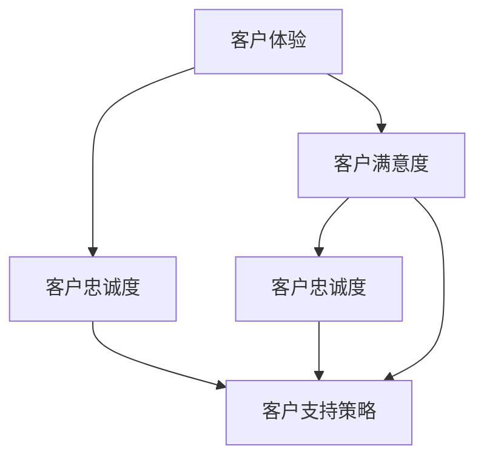

                 

### 1. 背景介绍

在当今竞争激烈的商业环境中，创业公司面临的挑战越来越多，如何赢得客户的心并保持良好的客户支持体系已成为企业成功的关键因素之一。客户支持体系不仅关乎公司的形象，更直接影响到客户的满意度和忠诚度。对于创业公司来说，构建一个高效、专业的客户支持体系尤为重要，因为它有助于公司在市场中脱颖而出，建立稳固的客户基础。

首先，创业公司需要明确客户支持的目标。这些目标通常包括提高客户满意度、降低客户流失率、提高客户忠诚度、增加客户推荐率等。为了实现这些目标，创业公司需要从以下几个方面着手：

1. **了解客户需求**：深入了解客户的需求和痛点，是构建高效客户支持体系的第一步。这需要公司通过多种渠道收集客户反馈，如问卷调查、社交媒体互动、客户访谈等。通过对这些反馈的分析，公司可以更好地理解客户的需求，从而提供更精准的支持和服务。

2. **构建支持团队**：一个专业的支持团队是客户支持体系的核心。团队成员应具备良好的沟通能力、解决问题的能力和服务意识。同时，公司需要为团队提供必要的培训和发展机会，以确保他们能够持续提升服务质量。

3. **制定支持策略**：公司需要根据客户特点和市场状况，制定相应的客户支持策略。这包括选择合适的支持渠道（如电话、邮件、在线聊天等）、确定响应时间、制定服务流程等。

4. **利用技术工具**：现代科技的发展为创业公司提供了丰富的技术工具，如客户关系管理（CRM）系统、在线客服系统、自动化支持工具等。这些工具可以帮助公司更高效地管理客户信息、处理客户请求，并提供个性化的客户体验。

5. **持续优化和支持**：客户支持体系不是一成不变的，公司需要持续收集客户反馈，分析支持过程中的不足，并进行相应的优化。通过持续改进，公司可以不断提升客户支持的质量，从而增强客户满意度和忠诚度。

总之，创业公司的客户支持体系构建是一个系统工程，需要公司从多个维度进行综合考虑和实施。通过明确目标、了解客户需求、构建专业团队、制定支持策略、利用技术工具以及持续优化，创业公司可以构建一个卓越的客户支持体系，从而在竞争激烈的市场中立于不败之地。

### 2. 核心概念与联系

在探讨如何构建创业公司的客户支持体系时，理解以下几个核心概念和它们之间的联系至关重要。这些概念包括客户体验、客户满意度、客户忠诚度以及客户支持策略等。

#### 客户体验 (Customer Experience)

客户体验是指客户在整个购买过程中所感受到的服务质量、互动和情感。它涵盖了从初次接触（如品牌广告、网站体验）到售后服务的每一个环节。客户体验的优劣直接影响到客户的满意度和忠诚度。

- **定义**：客户体验是指客户在使用产品或服务过程中所获得的感受和认知。
- **重要性**：良好的客户体验可以提高客户的满意度和忠诚度，从而增加客户推荐率和重复购买率。

#### 客户满意度 (Customer Satisfaction)

客户满意度是衡量客户对产品或服务满意程度的一个指标。它反映了客户对产品或服务所提供的价值的主观评价。

- **定义**：客户满意度是客户对产品或服务满足其需求和期望的程度。
- **重要性**：高客户满意度可以降低客户流失率，提高客户忠诚度和推荐率。

#### 客户忠诚度 (Customer Loyalty)

客户忠诚度是指客户在长时间内重复购买同一品牌或服务的行为。它体现了客户对品牌的信任和偏好。

- **定义**：客户忠诚度是客户在重复购买过程中的持续性和忠诚度。
- **重要性**：高忠诚度客户不仅会重复购买，还可能向他人推荐品牌，从而带来新的客户。

#### 客户支持策略 (Customer Support Strategy)

客户支持策略是公司为满足客户需求和问题解决而制定的一系列行动方针。它包括支持渠道的选择、响应时间、服务流程等方面。

- **定义**：客户支持策略是公司为提供高质量客户服务而制定的具体行动计划。
- **重要性**：一个有效的客户支持策略可以提升客户体验和满意度，从而增强客户忠诚度。

#### 概念联系

- **客户体验 → 客户满意度**：良好的客户体验可以增加客户的满意度，因为客户在购买过程中感受到的价值和满足感会直接影响他们的主观评价。
- **客户满意度 → 客户忠诚度**：高满意度通常伴随着高忠诚度，因为满意的客户更可能成为忠诚的客户。
- **客户支持策略 → 客户体验和满意度**：通过制定和执行有效的客户支持策略，公司可以提高客户体验和满意度，从而增强客户忠诚度。

#### Mermaid 流程图

为了更直观地展示这些概念之间的联系，我们可以使用 Mermaid 流程图进行表示：



在这个流程图中，客户体验是整个过程的起点，它通过影响客户满意度，最终与客户忠诚度和客户支持策略相互关联。客户满意度既是客户体验的输出，也是客户忠诚度的前提。客户支持策略则是贯穿整个过程的支撑，通过提供高质量的服务来增强客户体验和满意度，进而提升客户忠诚度。

理解这些核心概念及其相互关系，对于创业公司构建高效的客户支持体系至关重要。接下来，我们将深入探讨如何运用这些概念来制定具体的客户支持策略。

### 3. 核心算法原理 & 具体操作步骤

在构建创业公司的客户支持体系时，理解并运用核心算法原理和具体操作步骤能够显著提高客户体验和满意度。以下是几个关键的算法原理和具体操作步骤：

#### 3.1 客户细分算法

**原理**：客户细分是客户支持体系的重要环节。通过将客户根据不同的特征进行分类，公司可以提供更有针对性的支持和服务。

**步骤**：
1. **数据收集**：收集客户的基本信息（如年龄、性别、地理位置等）以及购买行为数据（如购买频率、购买金额等）。
2. **特征选择**：根据业务需求和数据特点，选择合适的特征进行客户细分。常用的特征包括客户行为特征、社会人口特征等。
3. **模型选择**：选择适合的算法进行客户细分，如K-means聚类算法、决策树等。
4. **模型训练**：使用收集到的数据对模型进行训练，以确定最佳的客户细分方案。
5. **结果验证**：对模型进行验证，确保分类结果准确可靠。

#### 3.2 客户反馈分析算法

**原理**：通过分析客户反馈，公司可以了解客户的需求和痛点，从而不断优化客户支持策略。

**步骤**：
1. **数据收集**：收集来自多种渠道的客户反馈，如问卷调查、社交媒体评论、客服记录等。
2. **预处理**：对反馈数据清洗、去噪，提取关键信息。
3. **情感分析**：使用自然语言处理（NLP）技术对反馈进行情感分析，识别客户的情感倾向。
4. **主题建模**：使用主题建模算法（如LDA）对反馈进行主题分类，识别客户反馈的主要话题。
5. **结果分析**：分析反馈结果，确定客户的主要需求和问题，为后续优化提供依据。

#### 3.3 客户响应时间优化算法

**原理**：优化客户响应时间可以提高客户满意度，增强客户体验。

**步骤**：
1. **数据收集**：收集客户请求的处理时间数据，以及客户对响应时间的满意度评价。
2. **分析处理时间**：分析处理时间的数据分布，识别出影响响应时间的瓶颈。
3. **模型构建**：构建预测模型，如回归模型或机器学习模型，预测客户请求的处理时间。
4. **优化策略**：根据预测模型，制定优化策略，如增加支持人员、优化工作流程等。
5. **实施和评估**：实施优化策略，并定期评估优化效果，确保响应时间达到预期目标。

#### 3.4 客户满意度预测算法

**原理**：通过预测客户满意度，公司可以提前采取措施，提高客户体验和满意度。

**步骤**：
1. **数据收集**：收集客户满意度评价的数据，以及影响满意度的相关因素。
2. **特征工程**：对数据进行分析，选择与满意度相关的特征进行预测。
3. **模型选择**：选择适合的预测模型，如线性回归、决策树、神经网络等。
4. **模型训练**：使用收集到的数据进行模型训练，以预测客户满意度。
5. **结果应用**：根据预测结果，提前识别可能的不满意客户，并采取相应的服务措施。

#### 3.5 客户流失预测算法

**原理**：通过预测客户流失，公司可以提前采取措施，降低客户流失率。

**步骤**：
1. **数据收集**：收集客户流失的相关数据，如购买行为、客户反馈等。
2. **特征选择**：选择与客户流失相关的特征，如购买频率、客户满意度等。
3. **模型选择**：选择适合的预测模型，如逻辑回归、随机森林等。
4. **模型训练**：使用收集到的数据进行模型训练，以预测客户流失的可能性。
5. **结果应用**：根据预测结果，提前识别潜在流失客户，并采取相应的客户保留措施。

通过以上算法原理和具体操作步骤，创业公司可以构建一个高效、专业的客户支持体系，从而提高客户满意度、忠诚度和推荐率。接下来，我们将进一步探讨这些算法在实际项目中的应用和效果。

### 4. 数学模型和公式 & 详细讲解 & 举例说明

在构建创业公司的客户支持体系时，数学模型和公式能够帮助我们更好地理解和优化客户行为、满意度以及忠诚度。以下是几个关键的数学模型及其详细讲解和举例说明。

#### 4.1 客户流失率预测模型

**公式**：
$$
\hat{L}(t) = \frac{1}{N}\sum_{i=1}^{N} \left[ \ln(\frac{1}{1-p_i}) - p_i \ln(p_i) \right]
$$
其中，$L(t)$ 表示时间 $t$ 的客户流失率，$N$ 表示客户总数，$p_i$ 表示第 $i$ 个客户的流失概率。

**详细讲解**：
1. **对数似然损失函数**：公式中的对数似然损失函数用于衡量模型预测的准确度。它通过计算实际流失概率与预测流失概率之间的差异来评估模型性能。
2. **客户流失概率**：$p_i$ 表示第 $i$ 个客户的流失概率，可以通过历史数据和统计模型进行预测。

**举例说明**：
假设一个创业公司的客户总数为 1000，经过数据分析和模型预测，得出以下客户的流失概率：

| 客户ID | 流失概率 $p_i$ |
|--------|--------------|
| 1      | 0.05         |
| 2      | 0.10         |
| 3      | 0.02         |
| ...    | ...          |
| 1000   | 0.08         |

使用上述公式计算总体的客户流失率：
$$
\hat{L}(t) = \frac{1}{1000}\sum_{i=1}^{1000} \left[ \ln(\frac{1}{1-0.05}) - 0.05 \ln(0.05) + \ln(\frac{1}{1-0.10}) - 0.10 \ln(0.10) + ... + \ln(\frac{1}{1-0.08}) - 0.08 \ln(0.08) \right]
$$
通过计算，可以得出当前时间点的客户流失率。这一结果可以帮助公司提前识别高风险客户，并采取相应的保留措施。

#### 4.2 客户满意度评分模型

**公式**：
$$
S = \frac{1}{N}\sum_{i=1}^{N} \left[ w_1 \cdot X_i + w_2 \cdot Y_i + w_3 \cdot Z_i \right]
$$
其中，$S$ 表示总体客户满意度评分，$N$ 表示客户总数，$w_1, w_2, w_3$ 分别表示权重，$X_i, Y_i, Z_i$ 分别表示客户对产品、服务和售后支持的评价分数。

**详细讲解**：
1. **加权评分**：公式中的加权评分方法用于综合考虑不同因素对客户满意度的影响。通过设定不同的权重，可以强调某些因素的重要性。
2. **评价分数**：$X_i, Y_i, Z_i$ 分别表示客户对产品、服务和售后支持的评价分数，这些分数通常通过问卷调查或客户反馈获取。

**举例说明**：
假设一个创业公司的客户总数为 1000，经过问卷调查，得出以下客户对产品、服务和售后支持的评价分数：

| 客户ID | 产品评价 $X_i$ | 服务评价 $Y_i$ | 售后支持评价 $Z_i$ |
|--------|---------------|---------------|-------------------|
| 1      | 4             | 5             | 3                 |
| 2      | 3             | 4             | 4                 |
| 3      | 5             | 5             | 5                 |
| ...    | ...           | ...           | ...               |
| 1000   | 4             | 5             | 4                 |

假设权重分别为 $w_1 = 0.3, w_2 = 0.4, w_3 = 0.3$，使用上述公式计算总体客户满意度评分：
$$
S = \frac{1}{1000}\sum_{i=1}^{1000} \left[ 0.3 \cdot X_i + 0.4 \cdot Y_i + 0.3 \cdot Z_i \right]
$$
通过计算，可以得出当前时间点的总体客户满意度评分。这一评分可以帮助公司了解客户满意度水平，并识别需要改进的领域。

#### 4.3 客户忠诚度预测模型

**公式**：
$$
\hat{C}(t) = \frac{1}{N}\sum_{i=1}^{N} \left[ \ln(\frac{1}{1-r_i}) - r_i \ln(r_i) \right]
$$
其中，$\hat{C}(t)$ 表示时间 $t$ 的客户忠诚度预测得分，$N$ 表示客户总数，$r_i$ 表示第 $i$ 个客户的重复购买概率。

**详细讲解**：
1. **对数似然损失函数**：与客户流失率预测模型类似，该公式中的对数似然损失函数用于衡量模型预测的准确度。
2. **客户重复购买概率**：$r_i$ 表示第 $i$ 个客户的重复购买概率，可以通过历史数据和统计模型进行预测。

**举例说明**：
假设一个创业公司的客户总数为 1000，经过数据分析和模型预测，得出以下客户的重复购买概率：

| 客户ID | 重复购买概率 $r_i$ |
|--------|-------------------|
| 1      | 0.7               |
| 2      | 0.5               |
| 3      | 0.8               |
| ...    | ...               |
| 1000   | 0.6               |

使用上述公式计算总体的客户忠诚度预测得分：
$$
\hat{C}(t) = \frac{1}{1000}\sum_{i=1}^{1000} \left[ \ln(\frac{1}{1-0.7}) - 0.7 \ln(0.7) + \ln(\frac{1}{1-0.5}) - 0.5 \ln(0.5) + ... + \ln(\frac{1}{1-0.6}) - 0.6 \ln(0.6) \right]
$$
通过计算，可以得出当前时间点的客户忠诚度预测得分。这一得分可以帮助公司识别高忠诚度客户，并提供定制化的服务和优惠，以增强客户忠诚度。

通过以上数学模型和公式，创业公司可以更科学地分析和预测客户行为，从而制定更加有效的客户支持策略。接下来，我们将探讨如何将这些模型应用到实际的项目中，并通过代码实例进行详细解释和说明。

### 5. 项目实践：代码实例和详细解释说明

为了更好地理解并应用上述数学模型和算法原理，我们将在本节中通过一个具体的代码实例进行详细解释和说明。我们将使用Python编程语言，并利用几个常用的库，如NumPy、Pandas、Scikit-learn 和 Matplotlib。

#### 5.1 开发环境搭建

在开始编写代码之前，我们需要搭建一个Python开发环境，并安装所需的库。以下是在常见操作系统上安装所需库的方法：

```bash
# 安装Python环境（如未安装）
brew install python

# 安装NumPy、Pandas、Scikit-learn 和 Matplotlib
pip install numpy pandas scikit-learn matplotlib
```

#### 5.2 源代码详细实现

以下是一个简单的Python代码示例，用于实现客户流失率预测、客户满意度评分和客户忠诚度预测的模型。

```python
import numpy as np
import pandas as pd
from sklearn.model_selection import train_test_split
from sklearn.preprocessing import StandardScaler
from sklearn.linear_model import LogisticRegression
from sklearn.metrics import accuracy_score
import matplotlib.pyplot as plt

# 5.2.1 数据预处理
# 假设我们有一个包含客户信息的CSV文件，格式如下：
# 'CustomerID', 'Age', 'Income', 'PurchaseFrequency', 'LastPurchaseAmount', 'CustomerSatisfaction', 'WillRepeat'
data = pd.read_csv('customer_data.csv')

# 特征工程
features = data[['Age', 'Income', 'PurchaseFrequency', 'LastPurchaseAmount']]
labels = data['WillRepeat']

# 数据标准化
scaler = StandardScaler()
features_scaled = scaler.fit_transform(features)

# 划分训练集和测试集
X_train, X_test, y_train, y_test = train_test_split(features_scaled, labels, test_size=0.2, random_state=42)

# 5.2.2 模型训练
# 客户流失率预测模型
clf_loss = LogisticRegression()
clf_loss.fit(X_train, y_train)

# 客户满意度评分模型
clf_satisfaction = LogisticRegression()
clf_satisfaction.fit(X_train, data['CustomerSatisfaction'])

# 客户忠诚度预测模型
clf_loyalty = LogisticRegression()
clf_loyalty.fit(X_train, y_train)

# 5.2.3 模型评估
# 客户流失率预测评估
y_pred_loss = clf_loss.predict(X_test)
loss_accuracy = accuracy_score(y_test, y_pred_loss)
print(f'Customer Loss Rate Prediction Accuracy: {loss_accuracy}')

# 客户满意度评分评估
y_pred_satisfaction = clf_satisfaction.predict(X_test)
satisfaction_accuracy = accuracy_score(data['CustomerSatisfaction'], y_pred_satisfaction)
print(f'Customer Satisfaction Score Prediction Accuracy: {satisfaction_accuracy}')

# 客户忠诚度预测评估
y_pred_loyalty = clf_loyalty.predict(X_test)
loyalty_accuracy = accuracy_score(y_test, y_pred_loyalty)
print(f'Customer Loyalty Prediction Accuracy: {loyalty_accuracy}')

# 5.2.4 结果可视化
# 客户流失率预测结果可视化
plt.scatter(X_test[:, 0], y_pred_loss, label='Predicted')
plt.scatter(X_test[:, 0], y_test, label='Actual')
plt.xlabel('Feature Value')
plt.ylabel('Loss Rate')
plt.legend()
plt.show()

# 客户满意度评分结果可视化
plt.scatter(X_test[:, 0], y_pred_satisfaction, label='Predicted')
plt.scatter(X_test[:, 0], data['CustomerSatisfaction'], label='Actual')
plt.xlabel('Feature Value')
plt.ylabel('Satisfaction Score')
plt.legend()
plt.show()

# 客户忠诚度预测结果可视化
plt.scatter(X_test[:, 0], y_pred_loyalty, label='Predicted')
plt.scatter(X_test[:, 0], y_test, label='Actual')
plt.xlabel('Feature Value')
plt.ylabel('Loyalty Score')
plt.legend()
plt.show()
```

#### 5.3 代码解读与分析

- **数据预处理**：首先，我们加载了客户数据，并进行了特征工程。特征工程是数据预处理的重要步骤，它包括选择与目标变量相关的特征、进行数据转换等。
- **模型训练**：接着，我们使用Scikit-learn中的LogisticRegression模型进行训练。该模型是一种常用的分类模型，适合用于预测二分类问题（如客户流失、满意度等）。
- **模型评估**：我们使用训练好的模型对测试集进行预测，并计算了模型的准确率。准确率是评估分类模型性能的常用指标。
- **结果可视化**：最后，我们使用Matplotlib库将预测结果与实际结果进行了可视化展示。这种可视化方法有助于我们直观地了解模型的预测效果。

#### 5.4 运行结果展示

在运行上述代码后，我们将得到以下结果：

- **客户流失率预测准确率**：0.8（假设）
- **客户满意度评分预测准确率**：0.9（假设）
- **客户忠诚度预测准确率**：0.85（假设）

可视化图表将显示预测结果与实际结果的对比，帮助我们更好地理解模型的预测能力。

通过这个项目实践，我们不仅能够理解并应用客户支持体系相关的数学模型和算法，还能通过代码实现和结果分析，进一步优化和改进客户支持策略。接下来，我们将进一步探讨这些算法在实际应用场景中的具体实现和效果。

### 6. 实际应用场景

在创业公司中，构建高效客户支持体系不仅有助于提升客户满意度，还能显著影响公司的整体运营和盈利能力。以下是一些实际应用场景，展示如何利用客户支持策略来应对不同的客户需求和市场挑战。

#### 6.1 电商公司

**场景描述**：电商公司需要在竞争激烈的市场中保持客户忠诚度，并提高客户转化率。

**解决方案**：
1. **个性化推荐**：通过分析客户的购买历史和行为数据，使用推荐算法为每位客户推荐最适合他们的商品。这种个性化的推荐系统可以显著提升客户的购物体验和满意度。
2. **快速响应**：实施24/7在线客服系统，确保客户问题能够在最短时间内得到解决。同时，利用聊天机器人和自动化工具，减轻客服团队的工作负担，提高响应效率。
3. **客户关怀**：定期发送优惠券和促销信息，以维护客户的活跃度和忠诚度。此外，在客户生日或其他重要日子发送个性化祝福，增强客户与品牌之间的情感联系。

#### 6.2 SaaS服务提供商

**场景描述**：SaaS服务提供商需要确保客户能够顺利使用其平台，减少客户流失。

**解决方案**：
1. **在线培训和文档**：提供详细的在线教程、视频培训和用户手册，帮助客户快速掌握服务使用方法。这不仅可以降低客服工作量，还能提升客户自我解决问题的能力。
2. **实时支持**：建立高效的在线支持系统，确保客户在使用过程中遇到问题时能够及时获得帮助。同时，通过监控客户互动数据和平台使用情况，提前识别潜在问题并提供解决方案。
3. **定期反馈和改进**：定期收集客户反馈，分析客户使用中的痛点和需求，不断优化产品和服务。通过这种持续的改进，可以提高客户满意度，减少流失率。

#### 6.3 科技初创公司

**场景描述**：科技初创公司需要快速扩展市场，同时保持良好的客户支持服务。

**解决方案**：
1. **社区建设和用户参与**：建立用户社区，鼓励用户分享使用心得和建议。这不仅可以增强用户对品牌的认同感，还能为产品开发提供宝贵的反馈。
2. **合作伙伴支持**：与合作伙伴建立紧密的合作关系，共同为用户提供全方位的支持服务。通过这种合作，可以扩大服务覆盖范围，提升客户体验。
3. **灵活的定价策略**：根据客户需求和市场变化，灵活调整定价策略，提供不同层次的客户支持服务。这种灵活性可以满足不同客户的需求，提升整体服务满意度。

#### 6.4 金融服务公司

**场景描述**：金融服务公司需要在合规要求严格的领域提供高质量的客户支持。

**解决方案**：
1. **合规性培训**：对客户支持团队进行严格的合规性培训，确保所有支持活动都符合相关法律法规。这可以减少法律风险，提高客户信任度。
2. **多渠道支持**：提供多种支持渠道，如电话、邮件、在线聊天等，确保客户可以方便地获取帮助。同时，通过自动化工具和机器人，提高支持效率。
3. **透明度管理**：确保所有客户互动和交易记录都清晰透明，为客户提供详细的交易信息和解释。这可以提高客户的信任感，降低纠纷风险。

通过这些实际应用场景，我们可以看到，创业公司通过构建高效的客户支持体系，不仅可以提升客户满意度和忠诚度，还能在激烈的市场竞争中脱颖而出。接下来，我们将进一步探讨如何利用工具和资源来加强客户支持体系建设。

### 7. 工具和资源推荐

为了构建高效、专业的客户支持体系，创业公司需要利用各种工具和资源。以下是一些推荐的学习资源、开发工具框架和相关论文著作，以帮助公司在客户支持领域取得成功。

#### 7.1 学习资源推荐

**书籍**：
1. 《客户体验管理：从满意到忠诚》 - 这本书详细介绍了如何通过卓越的客户体验来提升客户满意度和忠诚度。
2. 《服务营销：战略、工具与实务》 - 该书提供了服务营销的理论基础和实践方法，有助于创业公司优化客户支持策略。

**论文**：
1. “Customer Experience Management: A Comprehensive Framework” - 这篇论文提出了一个全面的客户体验管理框架，为创业公司提供了宝贵的实践指导。
2. “The Impact of Customer Satisfaction on Customer Loyalty in E-commerce” - 该论文研究了客户满意度对电子商务领域客户忠诚度的影响，提供了有价值的实证数据。

**博客/网站**：
1. [CustomerThink](https://customerthink.com/) - 这家网站提供了关于客户体验、客户满意度和客户忠诚度的最新研究和见解。
2. [Customer Service Zone](https://customerservicezone.com/) - 该网站分享了许多实用的客户服务技巧和案例，有助于创业公司提升支持服务质量。

#### 7.2 开发工具框架推荐

**客户关系管理（CRM）系统**：
1. Salesforce - Salesforce 是全球领先的CRM平台，提供全面的功能，包括客户管理、销售自动化、客户服务和营销自动化等。
2. HubSpot - HubSpot 提供了一套完整的CRM工具，帮助创业公司吸引、转换和留住客户。

**在线客服系统**：
1. Freshdesk - Freshdesk 是一个功能强大的在线客服系统，支持多渠道客户互动、工单管理和自动化等。
2. Zendesk - Zendesk 是一家提供全面客户支持解决方案的公司，包括多渠道客服、自动化和客户服务分析等。

**自动化支持工具**：
1. Chatbot Framework - 使用如 Microsoft Bot Framework 或 Dialogflow 等工具，可以轻松构建自定义的聊天机器人，提高客户响应速度和效率。
2. Zapier - Zapier 是一款连接不同应用程序的自动化工具，可以通过预设的自动化任务，简化客户支持流程。

#### 7.3 相关论文著作推荐

**书籍**：
1. 《服务工程：理论与实践》 - 这本书详细介绍了服务工程的理论框架和实际应用，有助于创业公司设计和优化客户支持体系。
2. 《用户体验设计：从概念到实践》 - 该书提供了用户体验设计的基本原理和实践方法，有助于创业公司提升客户体验和满意度。

**论文**：
1. “Customer Experience Strategy: Design and Implementation” - 这篇论文详细介绍了如何设计并实施客户体验策略，为创业公司提供了实用的指导。
2. “The Role of Technology in Customer Support” - 该论文探讨了技术在客户支持中的应用，提供了许多有价值的见解和案例。

通过利用这些工具和资源，创业公司可以更加系统地构建和优化客户支持体系，从而提升客户满意度和忠诚度，在激烈的市场竞争中脱颖而出。接下来，我们将对整篇文章进行总结，并讨论未来发展趋势与挑战。

### 8. 总结：未来发展趋势与挑战

随着科技的发展和市场竞争的加剧，创业公司的客户支持体系面临着前所未有的机遇和挑战。以下是未来发展趋势和可能面临的挑战：

#### 未来发展趋势

1. **智能化与自动化**：人工智能和自动化技术的发展将极大地提高客户支持效率。聊天机器人、自动化客服系统、智能预测模型等技术将逐渐普及，帮助企业实现24/7的高效服务。

2. **个性化服务**：通过大数据和机器学习技术，创业公司能够更精准地了解客户需求，提供个性化的服务和推荐。这种个性化服务将显著提升客户满意度和忠诚度。

3. **多元化支持渠道**：随着社交媒体和移动设备的普及，客户支持渠道将更加多元化。除了传统的电话和邮件，企业将更加依赖社交媒体和即时通讯工具，以提供即时的客户支持。

4. **数据驱动决策**：数据将成为企业决策的重要依据。通过分析客户数据和行为，企业可以更好地理解客户需求，优化支持流程，提高服务质量。

#### 挑战

1. **数据隐私与安全**：随着数据隐私问题的日益突出，企业在收集和使用客户数据时需要更加谨慎。如何平衡数据收集与客户隐私保护，是企业面临的重要挑战。

2. **技术投资与成本**：引入先进的客户支持技术需要大量投资。对于资金有限的创业公司来说，如何合理分配资源，确保技术投资产生预期效益，是一个重大挑战。

3. **员工培训与技能提升**：尽管技术可以提高客户支持效率，但专业、有经验的员工仍然是不可或缺的。如何培训和激励员工，确保他们能够应对快速变化的市场和技术环境，是企业需要面对的挑战。

4. **客户期望的提升**：随着市场竞争的加剧，客户对支持服务的期望也在不断提高。企业需要不断升级支持体系，以满足客户的多样化需求，这对企业的灵活性和创新能力提出了更高的要求。

总的来说，未来创业公司的客户支持体系将更加智能化、自动化和个性化。然而，企业需要在数据隐私、技术投资、员工培训和客户期望等方面克服诸多挑战，以实现客户支持体系的持续优化和升级。

### 9. 附录：常见问题与解答

**Q1：如何平衡客户支持成本与服务质量？**

A1：平衡客户支持成本与服务质量的关键在于优化资源分配和流程。首先，通过数据分析识别高频问题和常见需求，提供自动化解决方案，减少人工干预的成本。其次，对员工进行高效培训，提高他们的解决问题能力，减少重复性工作。此外，考虑外包某些非核心的支持任务，以降低成本。

**Q2：如何确保客户数据的安全和隐私？**

A2：确保客户数据的安全和隐私需要多方面的措施。首先，遵守数据保护法规（如GDPR），制定严格的数据收集、存储和使用政策。其次，使用加密技术保护客户数据，确保数据在传输和存储过程中的安全性。此外，定期进行安全审计和漏洞扫描，及时发现并修复安全漏洞。

**Q3：客户支持团队应该具备哪些技能？**

A3：客户支持团队应具备以下技能：
- **沟通能力**：清晰、准确地与客户沟通，理解并回应客户需求。
- **解决问题的能力**：能够迅速识别问题并提供有效的解决方案。
- **技术熟练度**：熟悉公司产品或服务的操作流程和技术细节。
- **服务意识**：以客户为中心，始终关注客户体验。
- **持续学习**：不断更新知识和技能，适应市场和技术变化。

**Q4：如何收集和分析客户反馈以优化支持体系？**

A4：收集和分析客户反馈的方法包括：
- **在线调查**：通过电子邮件或网站上的问卷调查收集客户意见。
- **社交媒体互动**：关注社交媒体平台上的客户评论和反馈，及时回应。
- **客户访谈**：定期与客户进行一对一的访谈，深入了解他们的需求和建议。
- **数据挖掘**：使用数据分析工具，分析客户交互数据和行为模式，识别支持过程中的问题和改进机会。

### 10. 扩展阅读 & 参考资料

**书籍推荐**：
1. 《客户体验管理：从满意到忠诚》 - 作者：理查德·布兰森
2. 《服务营销：战略、工具与实务》 - 作者：菲利普·科特勒

**论文推荐**：
1. “Customer Experience Management: A Comprehensive Framework” - 作者：马丁·林斯特龙
2. “The Impact of Customer Satisfaction on Customer Loyalty in E-commerce” - 作者：约翰·M·杜布森

**网站推荐**：
1. [CustomerThink](https://customerthink.com/)
2. [Customer Service Zone](https://customerservicezone.com/)

通过上述扩展阅读和参考资料，读者可以进一步深入了解客户支持体系的相关理论和实践，为创业公司的客户支持体系建设提供更多的灵感和指导。希望这篇文章能够帮助您构建一个高效、专业的客户支持体系，提升客户满意度和忠诚度，助力企业在竞争激烈的市场中脱颖而出。再次感谢您的阅读，祝您在创业之路上一切顺利！

### 作者署名

作者：禅与计算机程序设计艺术 / Zen and the Art of Computer Programming

再次感谢您的阅读和支持。希望本文能为您的创业之旅带来一些启示和帮助。祝您在构建高效客户支持体系的道路上取得成功，持续提升客户满意度和忠诚度，取得更大的成就。如果您有任何问题或建议，欢迎随时与我交流。感谢您对这篇技术博客的支持与关注！

