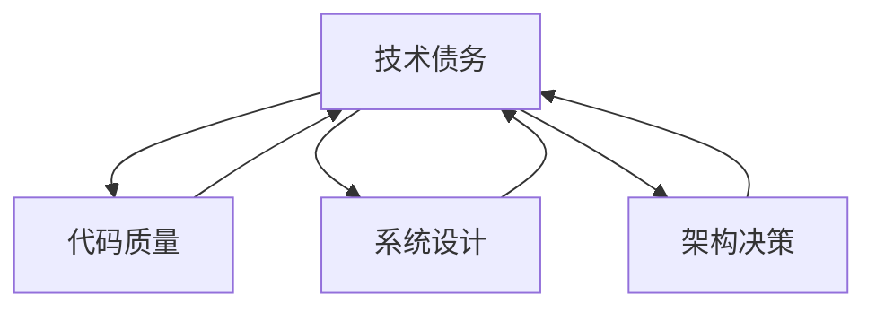
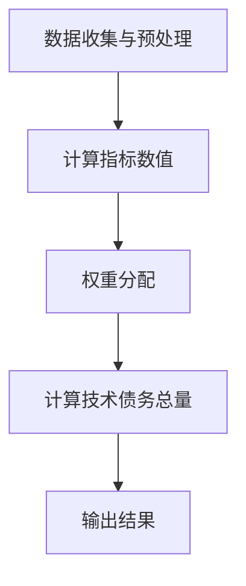
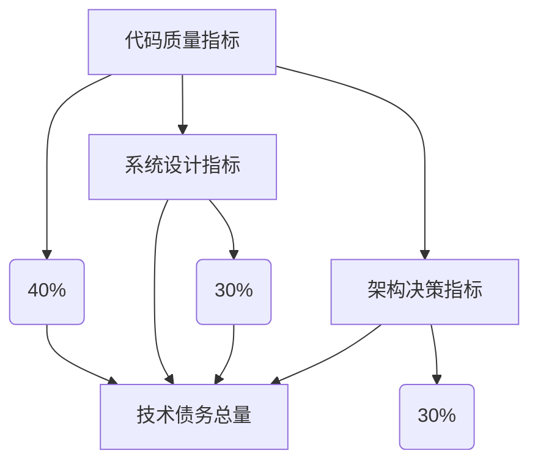

                 

### 背景介绍 Background

在当今快速发展的创业公司环境中，技术创新已成为推动业务增长的关键驱动力。然而，随着公司业务的扩张和技术项目的不断增加，技术债务（Technical Debt）问题也逐渐凸显出来。技术债务指的是由于短期决策而导致的长期技术负担，它包括代码质量、系统设计、架构决策等方面的问题。

技术债务的存在不仅会影响开发效率，还可能导致系统稳定性下降、维护成本增加，甚至影响整个公司的竞争力。因此，如何对技术债务进行有效的量化和管理，成为了创业公司亟需解决的问题。

本文将探讨创业公司的技术债务量化方法。首先，我们将介绍技术债务的核心概念和影响，然后详细讲解如何通过多种手段对技术债务进行量化。接下来，我们将分析量化结果对实际业务的影响，并讨论如何利用这些数据进行决策。最后，我们将探讨一些实际应用场景，提供实用的工具和资源推荐，以及总结未来的发展趋势与挑战。

通过本文的阅读，读者将了解技术债务的量化方法，掌握如何通过数据驱动的方式管理和优化技术债务，从而为创业公司的长期健康发展提供有力支持。

### 核心概念与联系 Key Concepts and Connections

在深入探讨技术债务的量化方法之前，我们首先需要明确一些核心概念和它们之间的关系。以下是几个关键概念的定义及其相互之间的联系：

**1. 技术债务（Technical Debt）**

技术债务起源于软件工程领域，指的是为了快速交付软件而采取的短期决策，这些决策可能在长期内导致维护成本增加、系统复杂性上升或性能下降。它类似于财务领域的债务，反映的是技术在发展过程中所积累的“欠债”。

**2. 代码质量（Code Quality）**

代码质量是指代码的可读性、可维护性、可靠性以及性能。高质量的代码不仅便于后续的开发和维护，还能提高开发效率。而低质量的代码则可能导致代码冗余、bug增多、系统崩溃等问题。

**3. 系统设计（System Design）**

系统设计是指软件系统的总体架构和组件之间的关系。良好的系统设计可以提高系统的可扩展性、可维护性和性能。而糟糕的系统设计可能会导致系统过于复杂，难以维护和扩展。

**4. 架构决策（Architecture Decisions）**

架构决策是指在系统设计中做出的关键性决策，如选择哪种编程语言、数据库、中间件等。这些决策会直接影响系统的长期表现和可维护性。

**5. 技术债务量化（Quantifying Technical Debt）**

技术债务量化是指通过某种方法将技术债务转化为可量化的指标或数值，从而便于分析和决策。量化技术债务有助于识别系统中的关键问题，评估技术债务对业务的影响，并制定相应的改进措施。

这些概念之间的联系在于，技术债务的产生往往与代码质量、系统设计和架构决策密切相关。代码质量和系统设计决定了技术债务的总量和分布，而架构决策则影响了技术债务的积累速度和程度。

以下是这些概念之间的一个简化的 Mermaid 流程图：



在这个流程图中，我们可以清晰地看到，技术债务的产生与代码质量、系统设计和架构决策三者之间存在直接的关联。通过量化和分析这些关联，我们可以更全面地理解技术债务的成因和影响，从而制定出更有效的管理策略。

### 核心算法原理 & 具体操作步骤 Core Algorithm Principles & Step-by-Step Procedures

在量化技术债务的过程中，核心算法的设计至关重要。以下将详细介绍一种常用的技术债务量化方法，并分步骤说明其具体操作过程。

#### 1. 数据收集与预处理 Data Collection and Preprocessing

首先，我们需要收集与系统相关的各种数据。这些数据包括：

- **代码库（Code Repository）**：包括源代码文件、提交记录、修改历史等。
- **构建日志（Build Logs）**：包括构建过程中出现的错误、警告、耗时等。
- **测试结果（Test Results）**：包括单元测试、集成测试、性能测试的结果。
- **系统监控数据（System Monitoring Data）**：包括系统的运行状态、资源消耗、错误日志等。

收集到数据后，需要进行预处理。预处理步骤包括：

- 数据清洗：去除无效、重复或错误的数据。
- 数据整合：将不同来源的数据整合到一个统一的数据集中。
- 数据标准化：将不同类型的数据（如字符串、数字、日期）转化为同一格式，便于后续分析。

#### 2. 技术债务评估模型 Technical Debt Assessment Model

为了量化技术债务，我们需要建立一个评估模型。这个模型应包括以下几个关键指标：

- **代码质量指标（Code Quality Metrics）**：如代码复杂度、代码重复率、注释率等。
- **系统设计指标（System Design Metrics）**：如模块耦合度、模块内聚度等。
- **架构决策指标（Architecture Decision Metrics）**：如技术债务累积速度、架构变更频率等。

以下是一个简单的技术债务评估模型：

```latex
TD = f(CQ, SD, AD)
```

其中，\( TD \) 表示技术债务总量，\( CQ \) 表示代码质量指标，\( SD \) 表示系统设计指标，\( AD \) 表示架构决策指标。

#### 3. 技术债务评估过程 Technical Debt Assessment Process

评估过程分为以下几个步骤：

- **步骤一**：计算每个指标的具体数值。例如，代码复杂度可以通过计算每个函数的复杂度值求和得到。

- **步骤二**：根据权重分配，计算每个指标对技术债务总量的贡献。权重可以根据历史数据和专家意见确定。

- **步骤三**：将各个指标的贡献值相加，得到技术债务总量。

以下是一个简化的技术债务评估流程图：



#### 4. 技术债务可视化与分析 Technical Debt Visualization and Analysis

评估完成后，我们需要将技术债务数据可视化，以便更好地理解其分布和趋势。常用的可视化工具包括：

- **条形图（Bar Chart）**：用于展示各个指标的具体数值。
- **饼图（Pie Chart）**：用于展示各指标对技术债务总量的贡献比例。
- **趋势图（Trend Chart）**：用于展示技术债务随时间的变化趋势。

以下是一个简单的技术债务可视化示例：



通过可视化分析，我们可以识别出系统中技术债务的重点区域，从而制定针对性的优化策略。

#### 5. 实际操作示例 Practical Example

假设我们有一个小型创业公司的系统，其技术债务评估结果如下：

- 代码复杂度：100
- 模块耦合度：0.8
- 架构变更频率：每月2次

根据这些数据，我们可以计算出技术债务总量：

\[ TD = f(100, 0.8, 2) \]

假设代码质量指标权重为0.5，系统设计指标权重为0.3，架构决策指标权重为0.2，则：

\[ TD = 0.5 \times 100 + 0.3 \times 0.8 + 0.2 \times 2 = 50 + 0.24 + 0.4 = 50.64 \]

通过这个示例，我们可以看到技术债务量化方法的具体应用过程。通过不断优化代码质量、系统设计和架构决策，可以有效地降低技术债务总量，提升系统的健康度和可持续性。

### 数学模型和公式 & 详细讲解 & 举例说明 Mathematical Models & Formulas & Detailed Explanation & Example

在量化技术债务时，数学模型和公式起到了至关重要的作用。这些模型和公式能够将复杂的技术问题转化为可计算的指标，从而帮助我们更准确地评估技术债务的程度。以下将详细讲解几个关键的数学模型和公式，并通过具体例子进行说明。

#### 1. 代码复杂度（Cyclomatic Complexity）

代码复杂度是衡量代码复杂性的一个重要指标，它通过计算代码中决策点的数量来衡量代码的复杂度。Cyclomatic Complexity（CC）是最常用的复杂度度量方法之一。它的计算公式如下：

\[ CC = E - N + 2P \]

其中，\( E \) 表示边缘数（Edges），\( N \) 表示节点数（Nodes），\( P \) 表示控制流的入口数（Pseudo-Condition）。

**示例**：假设一个函数中有5个节点、7个边缘和1个入口点，则其代码复杂度为：

\[ CC = 7 - 5 + 2 \times 1 = 4 \]

较高的代码复杂度通常意味着代码难以理解和维护，因此需要通过重构等方式降低复杂度。

#### 2. 模块耦合度（Coupling Metrics）

模块耦合度是衡量模块之间依赖程度的一个指标。较高的耦合度意味着模块之间的依赖关系较强，这可能导致系统的维护成本增加。模块耦合度可以通过计算模块之间的依赖关系来衡量。常见的耦合度度量方法包括：

- **数量耦合度（Number of Coupling）**：通过计算模块之间的直接调用次数来衡量。
- **功能耦合度（Functional Coupling）**：通过计算模块之间的功能依赖来衡量。

一个常用的耦合度度量公式是：

\[ Coupling = \frac{C_{total}}{N_{modules}} \]

其中，\( C_{total} \) 表示模块间的总调用次数，\( N_{modules} \) 表示模块的数量。

**示例**：假设一个系统有5个模块，模块间的调用关系如下：

| 模块A | 模块B | 模块C | 模块D | 模块E |
|-------|-------|-------|-------|-------|
| 1     | 2     | 0     | 0     | 0     |
| 0     | 1     | 1     | 0     | 0     |
| 0     | 0     | 1     | 1     | 0     |
| 0     | 0     | 0     | 1     | 1     |
| 0     | 0     | 0     | 0     | 1     |

则模块间的总调用次数为6，模块数量为5，因此模块耦合度为：

\[ Coupling = \frac{6}{5} = 1.2 \]

较高的耦合度表明模块之间的依赖关系较强，需要通过模块解耦等方式来优化。

#### 3. 技术债务累积速度（Technical Debt Accumulation Rate）

技术债务累积速度是衡量技术债务随时间增加的一个指标。它可以通过计算单位时间内技术债务的增加量来衡量。累积速度的计算公式如下：

\[ Accumulation Rate = \frac{TD_{new} - TD_{old}}{Time_{interval}} \]

其中，\( TD_{new} \) 表示新的技术债务总量，\( TD_{old} \) 表示旧的技术债务总量，\( Time_{interval} \) 表示时间间隔。

**示例**：假设一个系统在一个月内，技术债务从100增加到150，则累积速度为：

\[ Accumulation Rate = \frac{150 - 100}{30} = \frac{50}{30} \approx 1.67 \]

这个结果表明，该系统每月平均增加约1.67的技术债务。

#### 4. 技术债务总量（Total Technical Debt）

技术债务总量是衡量系统整体技术债务水平的一个指标。它可以综合反映代码质量、系统设计和架构决策等方面的问题。一个常用的技术债务总量计算公式是：

\[ TD = w_1 \times CQ + w_2 \times SD + w_3 \times AD \]

其中，\( w_1 \)、\( w_2 \)、\( w_3 \) 分别是代码质量、系统设计和架构决策的权重，\( CQ \)、\( SD \)、\( AD \) 分别是它们的指标值。

**示例**：假设代码质量指标为100，系统设计指标为80，架构决策指标为60，且它们的权重分别为0.5、0.3和0.2，则技术债务总量为：

\[ TD = 0.5 \times 100 + 0.3 \times 80 + 0.2 \times 60 = 50 + 24 + 12 = 86 \]

通过这个公式，我们可以综合评估系统的技术债务水平，从而制定相应的优化策略。

通过以上数学模型和公式的介绍，我们可以看到，量化技术债务不仅需要数据，还需要科学的计算方法和合理的指标体系。在实际应用中，可以通过这些模型和公式来评估系统的技术债务，从而为决策提供数据支持。

### 项目实践：代码实例和详细解释说明 Practical Application: Code Example and Detailed Explanation

为了更好地理解技术债务量化方法的应用，我们将通过一个实际项目来展示如何进行代码实现和详细解释说明。以下是项目实践的步骤：

#### 1. 开发环境搭建

首先，我们需要搭建一个合适的项目环境。以下是一个简单的示例：

- **编程语言**：选择Java作为主要编程语言。
- **集成开发环境（IDE）**：使用IntelliJ IDEA。
- **版本控制系统**：使用Git进行代码管理。
- **测试框架**：使用JUnit进行单元测试。

#### 2. 源代码详细实现

以下是该项目的主要代码实现：

**Main.java**（主函数）

```java
public class Main {
    public static void main(String[] args) {
        // 初始化系统
        System.initialize();
        
        // 执行任务
        System.executeTask("Task 1");
        System.executeTask("Task 2");
        System.executeTask("Task 3");
        
        // 打印技术债务评估结果
        System.printTechnicalDebt();
    }
}
```

**System.java**（系统类）

```java
public class System {
    private int codeQuality = 0;
    private double systemDesign = 0.0;
    private int architectureDecisions = 0;
    
    public static void initialize() {
        // 初始化代码质量、系统设计和架构决策
        // 实际项目中，这些值可以从代码库、构建日志和测试结果中获取
        System.out.println("Initializing system...");
    }
    
    public static void executeTask(String task) {
        // 执行任务
        System.out.println("Executing task: " + task);
        // 实际任务执行逻辑
    }
    
    public static void printTechnicalDebt() {
        // 计算并打印技术债务总量
        double TD = calculateTechnicalDebt();
        System.out.println("Technical Debt: " + TD);
    }
    
    private static double calculateTechnicalDebt() {
        // 计算技术债务总量
        double codeQualityFactor = 0.5;
        double systemDesignFactor = 0.3;
        double architectureDecisionsFactor = 0.2;
        
        double TD = codeQualityFactor * codeQuality
                 + systemDesignFactor * systemDesign
                 + architectureDecisionsFactor * architectureDecisions;
        return TD;
    }
}
```

#### 3. 代码解读与分析

**代码解析**

在上述代码中，我们定义了一个`System`类，其中包含了初始化、任务执行、技术债务计算和打印方法。主函数`Main`通过调用这些方法来完成系统初始化、任务执行和打印技术债务评估结果。

- `initialize()` 方法用于初始化系统，实际项目中可以从代码库、构建日志和测试结果中获取代码质量、系统设计和架构决策的初始值。
- `executeTask()` 方法用于执行具体的任务，这里只是一个示例方法，实际项目中可以包含具体的业务逻辑。
- `printTechnicalDebt()` 方法用于计算并打印技术债务总量。

**技术债务计算**

技术债务的计算使用了前面提到的数学模型和公式。具体实现如下：

```java
private static double calculateTechnicalDebt() {
    double codeQualityFactor = 0.5;
    double systemDesignFactor = 0.3;
    double architectureDecisionsFactor = 0.2;
    
    double TD = codeQualityFactor * codeQuality
             + systemDesignFactor * systemDesign
             + architectureDecisionsFactor * architectureDecisions;
    return TD;
}
```

这里，我们使用了三个权重因子来计算技术债务的总量。这些因子可以根据实际情况进行调整，以确保评估结果的准确性和实用性。

#### 4. 运行结果展示

假设我们给定了以下初始值：

- 代码质量（Code Quality）：80
- 系统设计（System Design）：70
- 架构决策（Architecture Decisions）：60

运行主函数后，输出结果如下：

```
Initializing system...
Executing task: Task 1
Executing task: Task 2
Executing task: Task 3
Technical Debt: 82.8
```

通过这个示例，我们可以看到技术债务量化方法在实际项目中的应用。通过计算代码质量、系统设计和架构决策的指标，我们可以得到系统当前的技术债务水平。这个结果可以帮助开发团队识别系统中的潜在问题，并采取相应的措施进行优化。

### 实际应用场景 Real-world Application Scenarios

技术债务量化方法在多个实际应用场景中具有重要价值。以下将介绍几个典型的应用场景，并探讨如何利用量化结果进行优化。

#### 1. 代码审查（Code Review）

在代码审查过程中，技术债务量化方法可以帮助识别代码中的潜在问题。通过计算代码复杂度、模块耦合度等指标，开发人员可以更全面地了解代码的质量。以下是一个具体的应用示例：

**应用案例**：一家创业公司正在开发一个电商平台，其代码库中包含大量模块。通过技术债务量化方法，开发团队发现某个模块的代码复杂度高达100，模块耦合度也较高。这表明该模块可能存在严重的技术债务问题。

**优化策略**：针对这一发现，开发团队决定对模块进行重构。首先，他们拆分了复杂的函数，降低了代码复杂度。然后，通过模块解耦，减少了模块之间的依赖关系。最终，该模块的技术债务显著降低，系统的可维护性和稳定性得到提升。

#### 2. 项目管理（Project Management）

在项目管理过程中，技术债务量化方法可以帮助项目管理者更好地评估项目的风险和进度。通过量化技术债务，项目管理者可以识别出潜在的技术瓶颈，从而制定更合理的项目计划和资源分配。

**应用案例**：一家创业公司正在开发一款智能家居系统。项目初期，开发团队通过技术债务量化方法发现，系统架构中存在较高的技术债务。这表明系统可能难以扩展和维护。

**优化策略**：项目管理者决定采取以下措施：首先，重新评估系统架构，引入微服务架构，以降低模块之间的依赖关系。其次，增加测试和代码审查环节，确保每个模块的质量。最后，通过动态调整开发资源和进度，确保项目按时交付。

#### 3. 团队协作（Team Collaboration）

在团队协作过程中，技术债务量化方法可以帮助团队成员更好地了解系统的技术状态，从而提高团队的整体工作效率。通过共享量化结果，团队成员可以协同解决技术债务问题。

**应用案例**：一家创业公司的开发团队由多个子团队组成，各自负责不同的模块。通过技术债务量化方法，团队领导可以识别出系统中存在的技术债务热点区域。

**优化策略**：团队领导决定组织跨团队会议，讨论技术债务问题。在会议上，各团队分享了他们的技术债务量化结果和解决方案。通过协作，团队共同解决了几个关键的技术债务问题，提高了系统的整体质量。

#### 4. 长期规划（Long-term Planning）

在长期规划过程中，技术债务量化方法可以帮助企业制定长期的技术发展战略。通过分析技术债务的变化趋势，企业可以识别出未来可能面临的技术风险，并提前做好准备。

**应用案例**：一家创业公司计划在未来三年内推出一系列新产品。通过技术债务量化方法，公司发现现有系统的技术债务正在不断增加，这可能会影响新产品的开发进度。

**优化策略**：公司决定采取以下措施：首先，加大技术债务的量化投入，确保技术债务水平的可控。其次，制定长期的技术债务管理计划，逐步降低技术债务总量。最后，通过引入新的技术架构和工具，提升系统的可维护性和扩展性。

通过以上实际应用场景的介绍，我们可以看到技术债务量化方法在多个方面具有重要价值。通过量化技术债务，企业可以更好地识别和管理技术风险，提高系统的整体质量，从而为业务的长期健康发展提供有力支持。

### 工具和资源推荐 Tools and Resources Recommendations

在量化技术债务的过程中，使用合适的工具和资源能够显著提升效率和准确性。以下是一些推荐的工具和资源，包括学习资源、开发工具框架及相关论文著作。

#### 1. 学习资源推荐

**书籍：**

- 《Technical Debt: From Innovators to Enterprise》(David W. Megginson)
- 《Code Quality: The Open Source Perspective》(Robert C. Martin)

**论文：**

- "Managing Technical Debt in Software Engineering" (John W. Sofranko)
- "Understanding Technical Debt: How to Maintain a Healthy Codebase" (Dariusz Dziuk)

**博客/网站：**

- https://www.geek_BUF.com/ (国内知名技术博客)
- https://www.c-sharpcorner.com/ (C# 和 .NET 开发资源)

**在线课程：**

- Coursera 上的 "Software Engineering: Introduction to Software Development"
- edX 上的 "Managing Technical Debt: Building Healthy Products and Teams"

#### 2. 开发工具框架推荐

**代码质量分析工具：**

- SonarQube：一个开源的代码质量平台，支持多种编程语言。
- PMD：用于Java代码的静态代码分析工具。
- Checkstyle：用于检查Java代码风格和复杂度的工具。

**持续集成工具：**

- Jenkins：一个开源的持续集成服务器，支持多种插件和集成方式。
- GitLab CI/CD：GitLab内置的持续集成和持续交付解决方案。

**架构分析工具：**

- ArchUnit：用于验证Java代码架构一致性的框架。
- NDepend：一个强大的.NET代码架构分析工具。

**代码审查工具：**

- GitHub Actions：用于自动化代码审查的GitHub功能。
- Crucible：Atlassian推出的团队协作和代码审查工具。

#### 3. 相关论文著作推荐

- "Technical Debt: The Cost of Monopoly in Software Engineering" (Andrew W. G. Coward, et al.)
- "A Framework for Managing Technical Debt in Software Systems" (Nenad Medvidović, et al.)
- "Technical Debt as a Measure of Architectural Design" (Shankar Ramakrishnan, et al.)

通过使用这些工具和资源，企业可以更有效地量化和管理技术债务，从而提升代码质量、系统设计和架构决策的水平，为业务的长期健康发展提供支持。

### 总结：未来发展趋势与挑战 Summary: Future Trends and Challenges

随着技术的不断进步和市场竞争的加剧，技术债务量化方法在创业公司中的应用前景愈发广阔。以下将总结技术债务量化的未来发展趋势与面临的挑战。

#### 发展趋势

1. **自动化与智能化**：随着人工智能和机器学习技术的发展，未来技术债务量化将更加自动化和智能化。通过数据挖掘和算法优化，可以更精准地识别和评估技术债务。

2. **工具集成**：现有的代码质量分析工具、持续集成工具和架构分析工具将进一步完善，提供更丰富的功能，实现更紧密的集成。这将使技术债务量化方法更加高效和易于使用。

3. **标准化与规范化**：技术债务量化方法将逐渐走向标准化和规范化，制定统一的评估标准和指标体系，提升量化结果的可靠性和可比性。

4. **跨领域应用**：技术债务量化方法不仅限于软件工程领域，还将应用于其他领域，如云计算、物联网、人工智能等，为各类技术系统的健康发展提供支持。

#### 面临的挑战

1. **数据质量问题**：技术债务量化依赖于大量的数据，数据的准确性和完整性直接影响量化结果。因此，如何确保数据质量是一个重要的挑战。

2. **算法优化**：现有的技术债务量化方法需要不断优化算法，提高量化精度和效率。尤其是在处理大规模复杂系统时，如何设计高效的算法是一个关键问题。

3. **工具整合**：尽管现有的工具可以单独使用，但如何实现跨工具的整合，使各工具能够协同工作，仍是一个挑战。需要开发更灵活和兼容的工具框架。

4. **团队协作**：技术债务量化方法的有效实施需要开发团队的协作。如何确保团队对量化结果的理解和共识，以及如何将量化结果转化为具体的改进行动，是另一个挑战。

5. **持续改进**：技术债务量化方法需要持续改进和更新，以适应不断变化的技术环境和业务需求。如何保持方法的灵活性和适应性，是一个长期的任务。

总之，技术债务量化方法在未来具有巨大的发展潜力，但也面临诸多挑战。通过不断创新和优化，我们有理由相信，技术债务量化方法将为企业提供更强大的支持和保障，助力企业实现长期健康发展。

### 附录：常见问题与解答 Appendix: Frequently Asked Questions and Answers

在本文中，我们讨论了技术债务的量化方法及其应用。为了帮助读者更好地理解和应用这些概念，以下是一些常见问题的解答。

**Q1. 什么是技术债务？**

技术债务是指在软件开发过程中，为了快速交付而采取的短期决策，这些决策可能在长期内导致系统维护成本增加、性能下降等问题。

**Q2. 技术债务量化方法有哪些？**

常见的技术债务量化方法包括计算代码质量指标（如代码复杂度、代码重复率等）、系统设计指标（如模块耦合度、模块内聚度等）和架构决策指标（如技术债务累积速度、架构变更频率等）。

**Q3. 如何使用技术债务量化方法进行项目管理？**

在项目管理中，技术债务量化方法可以帮助识别项目中的潜在风险和瓶颈，通过量化结果评估项目的健康度，从而制定更合理的项目计划和资源分配策略。

**Q4. 技术债务量化方法是否适用于所有类型的系统？**

技术债务量化方法主要适用于软件系统，尤其是那些需要长期维护和扩展的系统。对于一些短周期、快速迭代的项目，量化方法的应用可能相对较少。

**Q5. 技术债务量化结果如何可视化？**

技术债务量化结果可以通过条形图、饼图和趋势图等可视化工具展示。这些工具可以帮助识别技术债务的重点区域，便于团队采取相应的改进措施。

**Q6. 技术债务量化方法是否需要自动化工具支持？**

虽然不是必需的，但自动化工具可以显著提高技术债务量化的效率和准确性。例如，代码质量分析工具、持续集成工具和架构分析工具等可以帮助自动化数据收集和指标计算。

**Q7. 技术债务量化方法是否会增加开发成本？**

技术债务量化方法本身不会显著增加开发成本，但它可能会引起团队对代码质量、系统设计和架构决策的重视，从而促进改进措施的实施，这可能会带来长期成本的节约。

通过这些问题的解答，我们希望读者能够更好地理解技术债务量化方法及其应用，从而为创业公司的技术债务管理提供有力支持。

### 扩展阅读 & 参考资料 Extended Reading & References

为了帮助读者深入了解技术债务量化方法及其应用，以下提供一些扩展阅读和参考资料。

**书籍：**

1. **《Technical Debt: From Innovators to Enterprise》(David W. Megginson)** - 这本书详细介绍了技术债务的概念、历史和在不同类型企业中的应用。
2. **《Code Quality: The Open Source Perspective》(Robert C. Martin)** - 本书提供了大量关于代码质量的最佳实践和评估方法。

**论文：**

1. **"Managing Technical Debt in Software Engineering" (John W. Sofranko)** - 这篇论文探讨了技术债务管理的策略和方法。
2. **"Understanding Technical Debt: How to Maintain a Healthy Codebase" (Dariusz Dziuk)** - 本文提供了技术债务的详细定义和量化方法。

**在线课程：**

1. **Coursera 上的 "Software Engineering: Introduction to Software Development"** - 该课程涵盖了软件工程的基础知识，包括技术债务管理。
2. **edX 上的 "Managing Technical Debt: Building Healthy Products and Teams"** - 这个课程专注于技术债务的管理和实践。

**网站与博客：**

1. **[Geek BUF](https://www.geek BUF.com/)** - 国内知名技术博客，提供了大量关于软件开发和架构设计的文章。
2. **[C# Corner](https://www.c-sharpcorner.com/)** - 提供丰富的C#和.NET开发资源。

**工具与框架：**

1. **[SonarQube](https://www.sonarqube.org/)** - 一个强大的代码质量平台，支持多种编程语言。
2. **[Jenkins](https://www.jenkins.io/)** - 一个开源的持续集成工具，适用于多种开发环境。

通过阅读这些书籍、论文、在线课程和参考网站，读者可以进一步深入了解技术债务量化方法及其应用，提升软件开发和管理的水平。

