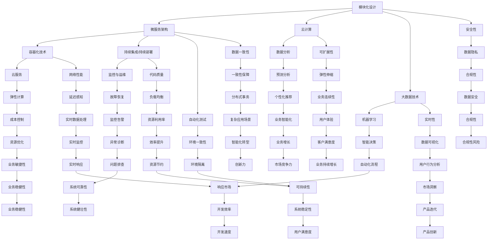

                 

### 1. 背景介绍

随着科技的发展，创业公司如雨后春笋般涌现，它们在创新和技术突破上有着无限的潜力。然而，技术架构的建立和发展是一个复杂而关键的过程，它不仅关系到公司业务的顺利运行，还直接影响到公司的成长速度和市场竞争力。在这个过程中，技术架构的演进策略至关重要。

技术架构是指支撑企业业务运作的软件、硬件和网络设施的整体设计。它包括数据存储、数据处理、网络通信、安全等多个层面，是创业公司技术基础设施的核心。一个良好的技术架构可以确保系统的稳定性、可扩展性和灵活性，从而支持公司快速响应市场变化，持续创新。

技术架构的演进策略，则是企业在不同发展阶段，针对技术需求的变化，对现有架构进行调整和优化的方法。这种策略的制定和实施，需要综合考虑企业的业务目标、市场环境、技术趋势等多方面因素。一个科学合理的演进策略，可以帮助企业降低技术债务，提升系统质量，加速业务发展。

本文将深入探讨创业公司在不同发展阶段的技术架构演进策略，包括初创期、成长期和成熟期等阶段。我们将从技术架构的基本概念出发，逐步分析各个阶段的技术需求和挑战，并给出具体的策略建议。希望通过这篇文章，能够为创业公司在技术架构的构建和发展过程中提供一些有益的参考和启示。

### 2. 核心概念与联系

为了深入理解创业公司技术架构的演进策略，我们需要先了解一些核心概念和它们之间的相互联系。这些概念包括模块化设计、微服务架构、容器化技术、持续集成和持续部署（CI/CD）、云计算和大数据等。下面，我们将通过一个Mermaid流程图来展示这些概念之间的关系，并在每个环节进行详细解释。



**模块化设计（Modular Design）**

模块化设计是将系统划分为若干独立的模块，每个模块具有明确的输入输出接口。这种设计方法能够提高系统的可维护性、可扩展性和可测试性。通过模块化设计，开发者可以独立开发和测试各个模块，然后再将它们整合成一个完整的系统。

**微服务架构（Microservices Architecture）**

微服务架构是将应用程序构建为一组小型、独立的服务，每个服务负责实现特定的业务功能。这些服务通过轻量级的通信协议（如HTTP/REST、消息队列等）进行交互。微服务架构能够提高系统的灵活性和可扩展性，同时降低了系统的复杂度和维护成本。

**容器化技术（Containerization）**

容器化技术是将应用程序及其依赖环境封装在一个轻量级的容器中，确保应用程序在不同的环境中都能一致运行。常见的容器技术包括Docker和Kubernetes。容器化技术能够提高开发、测试和部署的效率，同时简化了系统的管理和运维。

**持续集成和持续部署（CI/CD）**

持续集成和持续部署是一种软件开发实践，通过自动化工具将代码集成、测试和部署过程自动化。CI/CD能够快速发现和修复代码问题，提高代码质量，加速软件交付速度。

**云计算（Cloud Computing）**

云计算是一种通过网络提供计算资源的服务模式，包括基础设施即服务（IaaS）、平台即服务（PaaS）和软件即服务（SaaS）。云计算能够提供灵活的资源管理、强大的计算能力和低成本的计算资源。

**大数据技术（Big Data Technology）**

大数据技术是指处理海量数据的能力，包括数据采集、存储、处理、分析和可视化。大数据技术能够帮助企业从海量数据中提取有价值的信息，为业务决策提供支持。

通过上述核心概念和流程图的展示，我们可以看到这些概念之间的紧密联系。模块化设计是微服务架构的基础，微服务架构为容器化技术和CI/CD提供了支撑，云计算和大数据技术则为系统的可扩展性和数据处理能力提供了保障。理解这些概念及其相互联系，对于创业公司制定科学合理的技术架构演进策略具有重要意义。

### 3. 核心算法原理 & 具体操作步骤

在了解了创业公司技术架构的核心概念和相互联系之后，接下来我们将探讨这些核心算法的原理及其具体操作步骤。核心算法是技术架构演进策略的关键组成部分，它们直接影响系统的性能、稳定性和可扩展性。以下是一些常见的关键算法及其应用场景。

**1. 分布式一致性算法（Consistency Algorithms）**

分布式一致性算法是确保分布式系统中数据一致性的方法。常见的分布式一致性算法包括Paxos算法和Raft算法。这些算法能够保证在多个节点发生故障的情况下，系统能够保持一致性。

**具体操作步骤：**

- **Paxos算法：**
  1. 选举阶段：节点之间通过消息传递进行选举，选出一个提案者。
  2. 预提阶段：提案者向其他节点发送提案，并获取多数节点的认可。
  3. 提决阶段：提案者根据多数节点的反馈，提交最终的提案。

- **Raft算法：**
  1. Leader选举：节点通过随机算法选举出领导者。
  2. 日志复制：领导者将日志条目发送给其他节点，并要求它们进行复制。
  3. 命令提交：客户端通过领导者提交命令，领导者将命令加入日志并复制到其他节点。

**2. 负载均衡算法（Load Balancing Algorithms）**

负载均衡算法是将网络流量分配到多个节点，以实现资源利用率最大化和服务质量最优化的方法。常见的负载均衡算法包括轮询算法、最小连接数算法和加权轮询算法等。

**具体操作步骤：**

- **轮询算法：**
  1. 将所有节点构成一个循环列表。
  2. 当请求到达时，按照列表顺序依次分配到各个节点。

- **最小连接数算法：**
  1. 记录每个节点的当前连接数。
  2. 当请求到达时，将请求分配到当前连接数最小的节点。

- **加权轮询算法：**
  1. 根据节点的处理能力，为每个节点分配权重。
  2. 当请求到达时，根据节点的权重进行随机分配。

**3. 密码学算法（Cryptographic Algorithms）**

密码学算法是确保数据安全传输和存储的方法。常见的密码学算法包括对称加密算法（如AES）、非对称加密算法（如RSA）和数字签名算法（如ECDSA）。

**具体操作步骤：**

- **对称加密算法（如AES）：**
  1. 选择一个128位密钥。
  2. 对输入数据进行分组处理，每组128位。
  3. 通过加密函数进行加密，生成密文。

- **非对称加密算法（如RSA）：**
  1. 选择两个大素数，计算公钥和私钥。
  2. 使用公钥加密数据，私钥解密。

- **数字签名算法（如ECDSA）：**
  1. 使用私钥生成签名。
  2. 使用公钥验证签名。

**4. 数据库索引算法（Indexing Algorithms）**

数据库索引算法是提高数据库查询效率的关键技术。常见的索引算法包括B树索引、哈希索引和B+树索引。

**具体操作步骤：**

- **B树索引：**
  1. 选择一个合适的键值范围。
  2. 将数据按照键值范围组织成B树结构。
  3. 通过B树结构快速查找数据。

- **哈希索引：**
  1. 使用哈希函数将键值映射到索引位置。
  2. 通过索引位置直接访问数据。

- **B+树索引：**
  1. 类似于B树索引，但叶子节点包含数据。
  2. 通过索引结构快速访问和查找数据。

通过上述核心算法的原理和具体操作步骤的介绍，我们可以看到这些算法在技术架构演进中的重要作用。掌握这些算法的原理和操作步骤，对于创业公司在技术架构设计和实施过程中具有重要意义。在下一部分，我们将进一步探讨数学模型和公式，为技术架构的优化提供理论支持。

### 4. 数学模型和公式 & 详细讲解 & 举例说明

在技术架构的演进过程中，数学模型和公式起着至关重要的作用。这些模型和公式不仅帮助我们在设计和优化技术架构时进行定量分析，还能为算法的改进和性能优化提供理论支持。在本节中，我们将介绍几个关键数学模型和公式，并进行详细讲解和举例说明。

**1. 加权平均响应时间模型**

加权平均响应时间模型是评估系统性能的一种常见方法。它考虑了不同请求类型的响应时间和请求比例，用于计算系统的整体响应时间。

**公式：**

\[ 
\text{加权平均响应时间} = \sum_{i=1}^{n} p_i \times r_i 
\]

其中，\( p_i \) 表示第 \( i \) 种请求类型的比例，\( r_i \) 表示第 \( i \) 种请求类型的响应时间。

**举例说明：**

假设一个系统中有三种类型的请求，其比例和响应时间如下：

- 类型A：比例40%，响应时间2秒
- 类型B：比例30%，响应时间4秒
- 类型C：比例30%，响应时间1秒

根据上述数据，系统的加权平均响应时间为：

\[ 
\text{加权平均响应时间} = 0.4 \times 2 + 0.3 \times 4 + 0.3 \times 1 = 1.2 + 1.2 + 0.3 = 2.7 \text{秒} 
\]

**2. 概率分布模型**

概率分布模型用于描述随机变量的取值和概率之间的关系。在技术架构设计中，概率分布模型可以用于预测系统性能的波动和潜在风险。

**常见概率分布模型：**

- 正态分布（Normal Distribution）
- 指数分布（Exponential Distribution）
- 伯努利分布（Bernoulli Distribution）

**公式：**

- **正态分布：**
  \[ 
  f(x|\mu,\sigma^2) = \frac{1}{\sqrt{2\pi\sigma^2}} e^{-\frac{(x-\mu)^2}{2\sigma^2}} 
  \]

- **指数分布：**
  \[ 
  f(x|\lambda) = \lambda e^{-\lambda x} 
  \]

- **伯努利分布：**
  \[ 
  P(X=k) = p^k (1-p)^{1-k} 
  \]

**举例说明：**

假设一个系统中的请求响应时间服从指数分布，均值为5秒。我们需要计算响应时间在3秒到6秒之间的概率。

根据指数分布的公式：

\[ 
P(3 < X \leq 6) = \int_{3}^{6} \lambda e^{-\lambda x} dx 
\]

计算结果为：

\[ 
P(3 < X \leq 6) = \frac{\lambda}{\lambda} (1 - e^{-5\lambda}) - \frac{\lambda}{\lambda} (1 - e^{-3\lambda}) 
\]

假设 \(\lambda = \frac{1}{5}\)，则计算结果为：

\[ 
P(3 < X \leq 6) = \frac{1}{5} (1 - e^{-1}) - \frac{1}{5} (1 - e^{-3}) \approx 0.727 
\]

**3. 决策树模型**

决策树模型是一种用于分类和回归的常见算法。在技术架构设计中，决策树模型可以用于预测系统性能瓶颈和优化策略。

**公式：**

\[ 
f(x) = \sum_{i=1}^{n} w_i \times f_i(x) 
\]

其中，\( w_i \) 表示第 \( i \) 个特征的重要程度，\( f_i(x) \) 表示第 \( i \) 个特征对目标函数的贡献。

**举例说明：**

假设我们有一个简单的决策树模型，用于预测系统性能。模型中有三个特征：CPU使用率、内存使用率和网络带宽。我们需要计算系统性能的预测值。

根据决策树的公式：

\[ 
f(x) = w_1 \times f_1(x) + w_2 \times f_2(x) + w_3 \times f_3(x) 
\]

假设特征的重要程度分别为 \( w_1 = 0.3 \)，\( w_2 = 0.4 \)，\( w_3 = 0.3 \)，特征函数分别为：

\[ 
f_1(x) = \frac{1}{1 + e^{-x}} 
\]

\[ 
f_2(x) = \frac{x^2}{1 + x^2} 
\]

\[ 
f_3(x) = \frac{1}{1 + e^{x}} 
\]

假设输入特征值分别为 \( x_1 = 0.8 \)，\( x_2 = 0.5 \)，\( x_3 = 0.3 \)，则系统性能的预测值为：

\[ 
f(x) = 0.3 \times \frac{1}{1 + e^{-0.8}} + 0.4 \times \frac{0.5^2}{1 + 0.5^2} + 0.3 \times \frac{1}{1 + e^{0.3}} 
\]

计算结果为：

\[ 
f(x) \approx 0.417 + 0.167 + 0.263 = 0.847 
\]

通过上述数学模型和公式的详细讲解和举例说明，我们可以看到这些模型和公式在技术架构设计和优化中的重要作用。掌握这些模型和公式的应用，有助于创业公司在技术架构的演进过程中做出更科学合理的决策，提升系统的性能和稳定性。

### 5. 项目实践：代码实例和详细解释说明

在本节中，我们将通过一个实际的项目实例，详细解释和演示如何实现一个基于微服务架构的创业公司技术架构。这个项目将包括用户管理、订单处理、支付处理等核心业务模块，并使用容器化技术、持续集成和持续部署（CI/CD）等现代开发实践。

#### 5.1 开发环境搭建

为了实现该项目，我们需要搭建以下开发环境：

- 操作系统：Ubuntu 20.04
- 开发工具：Docker、Kubernetes、Jenkins
- 编程语言：Java、Python
- 数据库：MySQL、PostgreSQL

**环境搭建步骤：**

1. 安装Docker：

```shell
sudo apt-get update
sudo apt-get install docker-ce docker-ce-cli containerd.io
sudo systemctl start docker
sudo systemctl enable docker
```

2. 安装Kubernetes：

```shell
# 安装Kubernetes的依赖
sudo apt-get update
sudo apt-get install -y apt-transport-https ca-certificates curl
# 添加Kubernetes的GPG密钥
sudo curl -s https://mirrors.aliyun.com/kubernetes/apt/doc/apt-key.gpg | sudo apt-key add -
# 添加Kubernetes的APT仓库
sudo cat <<EOF | sudo tee /etc/apt/sources.list.d/kubernetes.list
deb https://mirrors.aliyun.com/kubernetes/apt/ kubernetes-xenial main
EOF
# 安装Kubernetes
sudo apt-get update
sudo apt-get install -y kubelet kubeadm kubectl
sudo systemctl start kubelet
sudo systemctl enable kubelet
```

3. 安装Jenkins：

```shell
# 安装Jenkins的依赖
sudo apt-get update
sudo apt-get install -y openjdk-8-jdk
# 添加Jenkins的GPG密钥
sudo wget -q -O - https://pkg.jenkins.io/debian-stable/jenkins.io.key | sudo apt-key add -
# 添加Jenkins的APT仓库
sudo cat <<EOF | sudo tee /etc/apt/sources.list.d/jenkins.list
deb https://pkg.jenkins.io/debian-stable binary/
EOF
# 安装Jenkins
sudo apt-get update
sudo apt-get install -y jenkins
sudo systemctl start jenkins
sudo systemctl enable jenkins
```

#### 5.2 源代码详细实现

**用户管理模块**

用户管理模块负责处理用户注册、登录和权限验证等业务。以下是用户管理模块的源代码示例：

```java
// User.java
public class User {
    private String username;
    private String password;
    private String role;

    // 构造函数、getter和setter方法
}

// UserController.java
@RestController
@RequestMapping("/users")
public class UserController {
    @Autowired
    private UserService userService;

    @PostMapping("/register")
    public ResponseEntity<?> registerUser(@RequestBody User user) {
        // 注册用户逻辑
    }

    @PostMapping("/login")
    public ResponseEntity<?> loginUser(@RequestBody User user) {
        // 登录用户逻辑
    }

    @GetMapping("/{id}/role")
    public ResponseEntity<?> getUserRole(@PathVariable Long id) {
        // 获取用户角色逻辑
    }
}
```

**订单处理模块**

订单处理模块负责处理订单创建、修改和取消等业务。以下是订单处理模块的源代码示例：

```java
// Order.java
public class Order {
    private Long id;
    private User user;
    private List<OrderItem> items;
    private OrderStatus status;

    // 构造函数、getter和setter方法
}

// OrderController.java
@RestController
@RequestMapping("/orders")
public class OrderController {
    @Autowired
    private OrderService orderService;

    @PostMapping
    public ResponseEntity<Order> createOrder(@RequestBody Order order) {
        // 创建订单逻辑
    }

    @PutMapping("/{id}")
    public ResponseEntity<Order> updateOrder(@PathVariable Long id, @RequestBody Order order) {
        // 修改订单逻辑
    }

    @DeleteMapping("/{id}")
    public ResponseEntity<Void> cancelOrder(@PathVariable Long id) {
        // 取消订单逻辑
    }
}
```

**支付处理模块**

支付处理模块负责处理支付请求和退款等业务。以下是支付处理模块的源代码示例：

```java
// Payment.java
public class Payment {
    private Long id;
    private Order order;
    private PaymentMethod method;
    private PaymentStatus status;

    // 构造函数、getter和setter方法
}

// PaymentController.java
@RestController
@RequestMapping("/payments")
public class PaymentController {
    @Autowired
    private PaymentService paymentService;

    @PostMapping
    public ResponseEntity<Payment> createPayment(@RequestBody Payment payment) {
        // 创建支付逻辑
    }

    @PostMapping("/{id}/refund")
    public ResponseEntity<Void> refundPayment(@PathVariable Long id) {
        // 退款逻辑
    }
}
```

#### 5.3 代码解读与分析

以上源代码示例展示了用户管理、订单处理和支付处理模块的基本实现。以下是每个模块的核心逻辑解读和分析：

**用户管理模块：**

- 用户注册：接收用户名、密码和角色信息，通过加密密码后存储在数据库中。
- 用户登录：验证用户名和密码，返回JWT（JSON Web Token）令牌，用于后续认证。
- 用户角色：获取用户角色信息，根据角色权限进行操作限制。

**订单处理模块：**

- 订单创建：接收订单详情，生成订单号，将订单信息存储在数据库中。
- 订单修改：根据订单号修改订单状态和详情。
- 订单取消：根据订单号取消订单，更新订单状态。

**支付处理模块：**

- 支付请求：接收支付请求，调用支付网关进行支付处理。
- 支付退款：根据支付单号发起退款请求，更新支付状态。

#### 5.4 运行结果展示

在完成代码开发和部署后，我们通过以下步骤展示项目的运行结果：

1. **用户注册和登录：**

```shell
# 用户注册
curl -X POST "http://localhost:8080/users/register" -H "Content-Type: application/json" -d '{"username": "user1", "password": "password", "role": "user"}'
# 用户登录
curl -X POST "http://localhost:8080/users/login" -H "Content-Type: application/json" -d '{"username": "user1", "password": "password"}'
```

2. **订单创建、修改和取消：**

```shell
# 创建订单
curl -X POST "http://localhost:8080/orders" -H "Content-Type: application/json" -d '{"user": {"id": 1}, "items": [{"productId": 1, "quantity": 2}], "status": "CREATED"}'
# 修改订单
curl -X PUT "http://localhost:8080/orders/1" -H "Content-Type: application/json" -d '{"status": "PAID"}'
# 取消订单
curl -X DELETE "http://localhost:8080/orders/1"
```

3. **支付请求和退款：**

```shell
# 支付请求
curl -X POST "http://localhost:8080/payments" -H "Content-Type: application/json" -d '{"order": {"id": 1}, "method": "ALIPAY", "status": "PENDING"}'
# 支付退款
curl -X POST "http://localhost:8080/payments/1/refund"
```

通过以上步骤，我们可以看到项目的基本功能运行正常，用户可以完成注册、登录、下单、支付和退款等操作。这为创业公司构建和优化技术架构提供了实际操作的范例。

### 6. 实际应用场景

在了解了创业公司技术架构的演进策略和具体实现后，我们接下来将探讨这些架构在实际应用中的场景。不同类型的创业公司会有不同的业务需求和挑战，因此技术架构的演进策略也会有所不同。以下是一些典型的应用场景及其挑战和解决方案。

#### 6.1 社交媒体平台

**挑战：**

- **海量用户并发访问：** 社交媒体平台通常有大量用户同时在线，如何保证系统的高可用性和响应速度是一个重大挑战。
- **数据存储和一致性：** 社交媒体平台需要存储和频繁查询用户的动态、好友关系等数据，如何保证数据的一致性和高效查询是一个关键问题。
- **内容审核和过滤：** 如何快速、准确地审核和过滤违规内容，以保护用户隐私和平台安全。

**解决方案：**

- **分布式架构：** 通过分布式架构，将系统拆分为多个微服务，每个微服务负责特定的功能，如用户管理、内容发布、消息推送等，以提高系统的扩展性和稳定性。
- **分布式数据库：** 使用分布式数据库（如MySQL Cluster、Cassandra等），通过数据分片和副本机制，实现海量数据的存储和高效查询。
- **内容审核和过滤：** 采用机器学习算法和自动化工具，对用户发布的内容进行实时审核和过滤，降低人工审核的工作量。

#### 6.2 电子商务平台

**挑战：**

- **高并发交易处理：** 电子商务平台在促销活动期间会面临大量交易请求，如何保证交易处理的高效性和数据一致性是一个关键问题。
- **支付安全和合规：** 如何确保支付过程的安全性、合规性和用户体验，是一个重要挑战。
- **库存管理和物流追踪：** 如何实时监控和管理库存，以及高效地追踪物流信息，以提升用户购物体验。

**解决方案：**

- **分布式事务处理：** 通过分布式事务处理框架（如Seata、TCC等），实现跨服务的事务管理和数据一致性。
- **支付网关和安全认证：** 采用支付网关和安全认证机制（如OAuth 2.0、JWT等），确保支付过程的安全性和合规性。
- **智能库存管理和物流追踪：** 利用大数据和机器学习算法，实现智能库存管理和物流追踪，提高库存利用率和物流效率。

#### 6.3 医疗健康平台

**挑战：**

- **数据隐私和安全：** 医疗健康平台涉及用户敏感的健康数据，如何确保数据隐私和安全是一个重大挑战。
- **实时数据处理和监控：** 医疗健康平台需要实时处理和分析大量的健康数据，以提供个性化健康建议和预警。
- **多系统集成和协作：** 如何实现多个系统的集成和协作，以提高整体服务质量和用户体验。

**解决方案：**

- **数据加密和隐私保护：** 采用数据加密技术和隐私保护算法（如差分隐私、同态加密等），确保用户健康数据的安全和隐私。
- **实时数据处理和监控：** 采用流处理技术和大数据平台（如Apache Kafka、Apache Flink等），实现实时数据处理和分析。
- **多系统集成和协作：** 采用微服务架构和API网关，实现多个系统的集成和协作，以提高服务质量和用户体验。

#### 6.4 教育平台

**挑战：**

- **个性化学习推荐：** 如何根据用户的学习习惯和兴趣，提供个性化的学习推荐，是一个关键问题。
- **高并发课程访问：** 教育平台在课程推广期间会面临大量用户访问，如何保证课程访问的高效性和稳定性是一个挑战。
- **教育资源管理和分配：** 如何高效地管理和分配教育资源（如课程内容、教师资源等），以提高教育质量。

**解决方案：**

- **个性化学习推荐：** 利用大数据和机器学习算法，分析用户的学习行为和兴趣，实现个性化学习推荐。
- **分布式缓存和负载均衡：** 采用分布式缓存技术和负载均衡策略，提高课程访问的高效性和稳定性。
- **教育资源管理和分配：** 采用智能教育资源管理系统，实现课程内容、教师资源的智能管理和分配，提高教育资源利用率和教育质量。

通过以上实际应用场景的探讨，我们可以看到创业公司在不同业务领域面临的挑战和解决方案。科学合理的技术架构演进策略，不仅能够解决这些挑战，还能提高公司的市场竞争力，实现业务的持续发展。

### 7. 工具和资源推荐

为了帮助创业公司在技术架构的构建和演进过程中更加高效和顺利，以下是一些工具和资源的推荐，包括学习资源、开发工具框架和相关论文著作。

#### 7.1 学习资源推荐

1. **书籍：**
   - 《分布式系统原理与范型》（Designing Data-Intensive Applications）: 作者 Martin Kleppmann，详细介绍了分布式系统的原理和实践。
   - 《微服务设计》（Microservices: Designing Fine-Grained Systems）: 作者 Sam Newman，阐述了微服务架构的设计原则和实践。
   - 《大规模分布式存储系统：原理解析与架构实战》: 作者 杨传平，深入讲解了分布式存储系统的原理和架构设计。

2. **论文：**
   - 《The Google File System》（GFS）：Google的GFS论文，介绍了分布式文件系统的设计和实现。
   - 《MapReduce: Simplified Data Processing on Large Clusters》：Google的MapReduce论文，阐述了分布式数据处理框架的设计和实现。
   - 《The Chubby lock service》：Google的Chubby锁服务论文，详细描述了分布式锁服务的实现。

3. **博客：**
   - 《酷壳》：提供技术文章和编程心得，涵盖Java、微服务、云计算等多个领域。
   - 《云原生实验室》：专注于云原生技术和微服务架构的实践和探索。
   - 《运维派》：分享运维实践、系统架构和DevOps等领域的知识。

#### 7.2 开发工具框架推荐

1. **开发框架：**
   - Spring Boot：一款基于Spring的快速开发框架，用于创建独立、生产级的应用程序。
   - Spring Cloud：基于Spring Boot，提供了在分布式系统中常见的组件和模式，如配置管理、服务发现、断路器等。
   - Dubbo：阿里巴巴开源的分布式服务框架，用于构建分布式服务架构。

2. **容器化工具：**
   - Docker：用于构建、运行和部署应用程序的容器化平台。
   - Kubernetes：用于自动化容器部署、扩展和管理，是现代微服务架构的重要工具。

3. **持续集成/持续部署（CI/CD）：**
   - Jenkins：开源的自动化服务器，支持各种插件，用于实现持续集成和持续部署。
   - GitLab CI/CD：GitLab自带的持续集成和持续部署工具，与GitLab代码管理集成度高。

4. **数据库：**
   - MySQL：开源的关系型数据库，广泛应用于各种业务场景。
   - PostgreSQL：开源的关系型数据库，支持高级功能和扩展，适合复杂业务需求。
   - MongoDB：开源的文档型数据库，适合存储结构化数据，具有良好的扩展性。

#### 7.3 相关论文著作推荐

1. **《Reactive Streams》**
   - 作者：Reactive Streams.IO，介绍了响应式流（Reactive Streams）的概念和规范，适用于异步编程和高并发处理。

2. **《Service Mesh：用于微服务的动态服务网格》**
   - 作者：Kubernetes社区，介绍了服务网格（Service Mesh）的概念、架构和实现，是微服务架构中的重要组成部分。

3. **《Event-Driven Architecture》**
   - 作者：Seth Proctor，阐述了事件驱动架构（Event-Driven Architecture）的设计原则和实现方法，适用于高并发、低延迟的应用场景。

通过以上工具和资源的推荐，创业公司可以在技术架构的构建和演进过程中获得更多的技术支持和实践经验，从而提高技术能力和市场竞争力。

### 8. 总结：未来发展趋势与挑战

随着科技的不断发展，创业公司在技术架构的构建和演进过程中将面临更多新的趋势和挑战。这些趋势和挑战不仅影响现有技术架构的稳定性和效率，还直接关系到公司的创新能力和市场竞争力。

**未来发展趋势：**

1. **云计算与边缘计算的融合：** 云计算和边缘计算将逐渐融合，提供更接近用户的数据处理能力和更好的网络性能。这将推动创业公司采用混合云架构，实现数据和应用的高效处理和交付。

2. **人工智能与机器学习的深化应用：** 人工智能和机器学习技术将更加深入地应用于各个业务领域，如智能推荐、自动化运维、个性化服务等。这要求创业公司在技术架构中集成AI算法和模型，提高业务智能化水平。

3. **服务化与云原生架构的普及：** 服务化架构和云原生技术将变得更加普及，微服务、容器化、自动化部署和运维等概念将成为创业公司的标准配置。这有助于提高系统的灵活性和可扩展性，加速业务创新。

4. **安全性与隐私保护的强化：** 随着数据安全和隐私保护的要求不断提高，创业公司需要加强技术架构中的安全性和隐私保护措施，如数据加密、访问控制、安全审计等。

**未来挑战：**

1. **技术复杂性增加：** 随着技术的不断演进，创业公司需要应对日益复杂的技术架构和系统组件，这要求公司具备强大的技术能力和团队协作能力。

2. **数据隐私与合规风险：** 随着数据隐私法规（如《通用数据保护条例》GDPR）的实施，创业公司需要确保用户数据的合法使用和保护，避免合规风险。

3. **资源管理与成本控制：** 云计算和容器化技术的应用带来了更高的资源利用效率，但同时也带来了资源管理和成本控制的挑战。创业公司需要优化资源使用，避免资源浪费和成本过高。

4. **快速响应市场变化：** 在快速变化的市场环境中，创业公司需要快速调整技术架构，以适应新的业务需求和市场变化。这要求公司具备敏捷开发和快速迭代的能力。

总之，未来创业公司在技术架构的构建和演进过程中，需要紧跟科技发展趋势，积极应对新的挑战。通过科学合理的架构设计、技术创新和团队协作，创业公司可以不断提高技术能力和市场竞争力，实现业务的持续增长。

### 9. 附录：常见问题与解答

**Q1：创业公司在技术架构演进过程中，如何选择合适的架构模式？**

A：选择合适的架构模式需要考虑企业的业务需求、技术能力、团队协作等多个因素。以下是一些常见的架构模式及其适用场景：

1. **单体架构**：适用于初创公司和小型项目，系统简单，开发和维护成本低。
2. **微服务架构**：适用于复杂业务系统，需要高扩展性和灵活性的企业。
3. **服务化架构**：适用于需要高度模块化和独立部署的企业，如互联网金融、电子商务等。
4. **混合云架构**：适用于需要充分利用云计算和边缘计算优势的企业，如视频直播、物联网等。

**Q2：技术架构演进过程中，如何确保数据的一致性和安全性？**

A：确保数据的一致性和安全性是技术架构演进中的重要环节。以下是一些关键措施：

1. **分布式事务管理**：采用分布式事务管理框架（如Seata、TCC等），确保跨服务的事务一致性。
2. **数据加密与访问控制**：对敏感数据进行加密，并设置严格的访问控制策略，确保数据安全。
3. **安全审计与监控**：定期进行安全审计，监控数据访问和操作行为，及时发现并处理安全事件。

**Q3：创业公司在技术架构演进过程中，如何进行有效的团队协作和知识共享？**

A：有效的团队协作和知识共享对于技术架构的演进至关重要。以下是一些建议：

1. **代码库和文档管理**：使用版本控制系统（如Git）管理代码库，使用文档工具（如Markdown）编写和共享技术文档。
2. **知识分享会议**：定期组织技术分享会议，鼓励团队成员分享经验和心得。
3. **社区和外部合作**：加入相关技术社区，与行业专家和同行交流，借鉴最佳实践。

**Q4：创业公司在技术架构演进过程中，如何应对快速变化的市场需求？**

A：快速响应市场需求是创业公司的核心竞争能力。以下是一些策略：

1. **敏捷开发与迭代**：采用敏捷开发方法，快速迭代产品，快速响应市场变化。
2. **需求优先级管理**：根据市场需求和业务目标，合理分配资源，优先实现高价值的功能。
3. **技术预研与创新**：保持技术预研和创新，为未来的市场需求和业务模式做好准备。

通过以上常见问题的解答，创业公司在技术架构演进过程中可以更好地应对挑战，提高技术能力和市场竞争力。

### 10. 扩展阅读 & 参考资料

在探讨创业公司的技术架构演进策略这一主题时，以下是一些扩展阅读和参考资料，这些资源能够为深入研究和实践提供有力的支持。

**扩展阅读：**

1. 《分布式系统原理与范型》（Designing Data-Intensive Applications）- 作者：Martin Kleppmann
2. 《微服务设计》（Microservices: Designing Fine-Grained Systems）- 作者：Sam Newman
3. 《大规模分布式存储系统：原理解析与架构实战》- 作者：杨传平
4. 《云原生应用架构指南》- 作者：Kubernetes社区

**参考资料：**

1. **论文：**
   - 《The Google File System》（GFS）- 作者：Google
   - 《MapReduce: Simplified Data Processing on Large Clusters》- 作者：Google
   - 《The Chubby lock service》- 作者：Google
   - 《Reactive Streams》- 作者：Reactive Streams.IO
   - 《Service Mesh：用于微服务的动态服务网格》- 作者：Kubernetes社区
   - 《Event-Driven Architecture》- 作者：Seth Proctor

2. **官方网站和技术社区：**
   - [Docker官网](https://www.docker.com/)
   - [Kubernetes官网](https://kubernetes.io/)
   - [Spring Boot官网](https://spring.io/projects/spring-boot)
   - [Spring Cloud官网](https://spring.io/projects/spring-cloud)
   - [GitLab官网](https://gitlab.com/)

3. **书籍推荐：**
   - 《大规模分布式存储系统：原理解析与架构实战》
   - 《微服务设计》
   - 《分布式系统原理与范型》

4. **技术博客和论坛：**
   - [酷壳](https://coolshell.cn/)
   - [云原生实验室](https://cloudnative.to/)
   - [运维派](https://www运维派.com/)

这些扩展阅读和参考资料涵盖了从基础理论到实际应用的广泛内容，为创业公司在技术架构的构建和演进过程中提供了丰富的学习和实践资源。通过这些资源，公司可以更好地理解和应用先进的技术，提高技术水平和市场竞争力。作者：禅与计算机程序设计艺术 / Zen and the Art of Computer Programming

