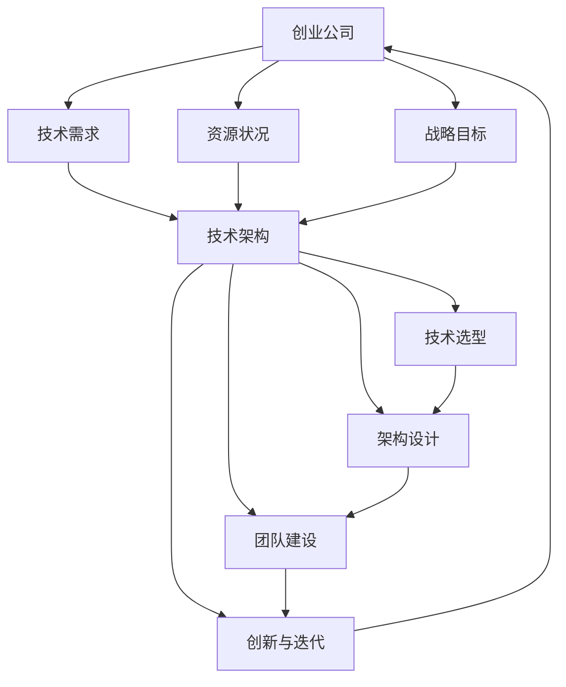

                 

### 1. 背景介绍

随着全球经济的发展，创业公司如雨后春笋般涌现。这些公司面临着日益激烈的市场竞争，如何在短时间内构建起稳定高效的技术架构，成为了企业成功的关键因素之一。技术架构不仅是企业的技术基础设施，更是企业在市场竞争中持续创新和发展的核心驱动力。

然而，创业公司在资源有限的情况下，如何选择合适的技术架构，实现从零到一的突破，是许多创业者和技术团队面临的重要课题。本文将围绕这一主题，探讨创业公司的技术架构演进路线，旨在为创业公司提供一些实用的指导和建议。

创业公司的技术架构演进，通常可以分为以下几个阶段：初创期、快速成长期、稳定发展期。在不同的阶段，创业公司的技术需求、资源状况和战略目标都有所不同，因此，技术架构的选择和演进也需要因时而异。

本文将首先介绍创业公司的技术架构演进过程，然后深入分析各个阶段的核心问题，包括技术选型、架构设计、团队建设等方面。接着，我们将探讨技术架构演进过程中可能出现的一些挑战和解决方案。最后，本文将总结创业公司技术架构演进的趋势，并展望未来的发展前景。

通过本文的探讨，希望读者能够对创业公司的技术架构演进有一个全面而深入的理解，从而在创业的道路上更加从容和自信。让我们一步步分析，共同探讨创业公司的技术架构演进之路。### 2. 核心概念与联系

在探讨创业公司的技术架构演进之前，我们需要明确一些核心概念和它们之间的联系。以下是本文将涉及的主要概念：

#### 2.1 创业公司的定义

创业公司是指那些刚刚成立，致力于通过创新和创业精神实现商业价值的公司。这些公司通常资源有限，需要在短时间内实现业务增长和市场突破。

#### 2.2 技术架构

技术架构是指企业软件系统的整体结构设计，包括软件组件、硬件设备、网络架构、数据存储和处理等。一个良好的技术架构能够支持企业的快速发展和持续创新。

#### 2.3 演进路线

演进路线是指创业公司在不同发展阶段所采用的技术架构策略和发展方向。不同阶段的技术架构需要根据业务需求、资源状况和战略目标进行调整和优化。

#### 2.4 技术选型

技术选型是指选择最适合企业需求的技术方案和工具。技术选型需要考虑技术性能、稳定性、安全性、易用性、社区支持等多个方面。

#### 2.5 架构设计

架构设计是指根据业务需求和资源状况，设计出适合的技术架构方案。架构设计需要考虑系统可扩展性、高可用性、容错性、性能优化等多个方面。

#### 2.6 团队建设

团队建设是指组建和培养一支高效、专业的技术团队。团队建设需要关注团队成员的技能、经验、沟通、协作等方面。

#### 2.7 创新与迭代

创新与迭代是指企业在技术架构演进过程中，不断引入新技术、新方法，并进行快速迭代和优化。创新与迭代是企业保持竞争力的关键。

### 2.8 Mermaid 流程图

为了更清晰地展示上述概念之间的联系，我们使用Mermaid流程图来表示。以下是技术架构演进过程中的关键节点和关系：



图2-1展示了创业公司从技术需求、资源状况和战略目标出发，经过技术选型、架构设计、团队建设和创新迭代，最终实现技术架构的持续演进和优化。

通过上述核心概念和流程图的介绍，我们为后续章节的分析和探讨奠定了基础。在接下来的部分，我们将详细分析创业公司技术架构演进过程中的关键问题。### 3. 核心算法原理 & 具体操作步骤

在创业公司的技术架构演进过程中，核心算法原理起着至关重要的作用。核心算法不仅是技术架构的核心组成部分，更是实现业务需求和提升系统性能的关键驱动因素。以下将详细探讨创业公司技术架构演进中的核心算法原理及具体操作步骤。

#### 3.1 核心算法原理

核心算法是指在企业技术架构中具有关键作用的基础算法，通常涉及数据处理、存储优化、网络通信、安全加密等方面。核心算法的设计和实现需要满足以下几个原则：

1. **性能优化**：核心算法需要尽可能高效地处理大量数据，降低计算和存储资源的使用。
2. **稳定性**：核心算法需要保证在极端情况下仍然能够稳定运行，不会导致系统崩溃。
3. **可扩展性**：核心算法需要能够适应业务规模的增长，能够水平或垂直扩展。
4. **安全性**：核心算法需要考虑数据安全，包括加密、认证、访问控制等方面。

#### 3.2 数据处理算法

数据处理算法是创业公司技术架构中的核心算法之一，主要用于处理和分析大规模数据。以下是一些常见的数据处理算法：

1. **排序算法**：如快速排序、归并排序、堆排序等。排序算法用于对数据进行排序，以便进行后续处理。
2. **查找算法**：如二分查找、哈希查找等。查找算法用于在数据集合中快速找到特定数据。
3. **聚合算法**：如求和、求平均数、求最大值等。聚合算法用于对数据进行汇总和分析。
4. **机器学习算法**：如决策树、随机森林、支持向量机等。机器学习算法用于数据分析和预测。

#### 3.3 存储优化算法

存储优化算法用于提高数据存储效率和性能。以下是一些常见的存储优化算法：

1. **压缩算法**：如Huffman编码、LZ77压缩等。压缩算法用于减少数据存储空间。
2. **索引算法**：如B树、哈希索引等。索引算法用于加快数据检索速度。
3. **缓存算法**：如LRU（最近最少使用）缓存策略。缓存算法用于提高数据访问速度。

#### 3.4 网络通信算法

网络通信算法用于优化网络传输效率和数据传输质量。以下是一些常见的网络通信算法：

1. **TCP/IP协议栈**：TCP/IP协议栈是网络通信的核心协议，包括TCP（传输控制协议）和IP（互联网协议）等。
2. **拥塞控制算法**：如TCP拥塞控制算法（慢启动、拥塞避免、快速重传、快速恢复等）。
3. **流控算法**：如滑动窗口算法、CUBIC算法等。流控算法用于控制数据传输速率，避免网络拥塞。

#### 3.5 安全加密算法

安全加密算法用于保护数据安全和隐私。以下是一些常见的安全加密算法：

1. **对称加密算法**：如AES（高级加密标准）、DES（数据加密标准）等。对称加密算法使用相同的密钥进行加密和解密。
2. **非对称加密算法**：如RSA（大数分解加密算法）、ECC（椭圆曲线加密算法）等。非对称加密算法使用不同的密钥进行加密和解密。
3. **哈希算法**：如SHA-256、MD5等。哈希算法用于数据完整性校验和数字签名。

#### 3.6 具体操作步骤

在创业公司的技术架构演进过程中，核心算法的实施步骤通常包括以下几个方面：

1. **需求分析**：明确业务需求和算法目标，确定需要实现的算法类型和功能。
2. **算法设计**：根据需求分析结果，设计合适的算法方案，包括算法原理、数据结构和算法流程等。
3. **算法实现**：使用编程语言实现算法设计，并进行单元测试和调试。
4. **性能优化**：对实现的算法进行性能分析和优化，确保算法能够在实际应用中高效运行。
5. **集成测试**：将算法与其他系统模块进行集成测试，确保算法与其他组件之间的兼容性和稳定性。
6. **部署上线**：将优化后的算法部署到生产环境，并进行持续监控和迭代优化。

通过以上步骤，创业公司可以逐步构建和优化其技术架构，实现业务的快速发展和持续创新。在接下来的章节中，我们将继续探讨技术架构演进过程中的关键问题和挑战。### 4. 数学模型和公式 & 详细讲解 & 举例说明

在创业公司的技术架构演进过程中，数学模型和公式扮演着至关重要的角色。数学模型不仅能够帮助创业者更好地理解和优化技术架构，还可以提供量化的依据和决策支持。以下将详细讲解一些常见的数学模型和公式，并举例说明其应用。

#### 4.1 常见数学模型和公式

1. **成本效益分析（CBA）模型**

   成本效益分析模型是一种评估投资回报率（ROI）的数学模型。它通过计算项目的成本和预期收益，评估项目的经济效益。公式如下：

   $$ 
   CBA = \frac{Earnings - Costs}{Costs} 
   $$

   其中，Earnings表示预期收益，Costs表示总成本。

2. **复杂度分析模型**

   复杂度分析模型用于评估算法的时间和空间复杂度。常见的复杂度分析包括时间复杂度和空间复杂度。公式如下：

   时间复杂度：
   $$ 
   T(n) = O(f(n)) 
   $$

   空间复杂度：
   $$ 
   S(n) = O(g(n)) 
   $$

   其中，n表示数据规模，f(n)和g(n)分别表示时间复杂度和空间复杂度的增长函数。

3. **回归分析模型**

   回归分析模型用于预测和解释变量之间的关系。常见的回归分析包括线性回归、多项式回归、逻辑回归等。以线性回归为例，公式如下：

   $$ 
   y = \beta_0 + \beta_1 \cdot x 
   $$

   其中，y为因变量，x为自变量，$\beta_0$和$\beta_1$分别为常数项和回归系数。

4. **贝叶斯推理模型**

   贝叶斯推理模型用于概率推理和决策支持。它通过更新先验概率来计算后验概率，从而进行预测和决策。公式如下：

   $$ 
   P(A|B) = \frac{P(B|A) \cdot P(A)}{P(B)} 
   $$

   其中，P(A|B)表示在事件B发生的条件下事件A的概率，P(B|A)表示在事件A发生的条件下事件B的概率，P(A)和P(B)分别为事件A和事件B的先验概率。

5. **网络优化模型**

   网络优化模型用于优化网络结构和资源分配。常见的网络优化模型包括最小生成树、最短路径算法、流量分配等。以最小生成树为例，公式如下：

   最小生成树权值总和：
   $$ 
   \sum_{i=1}^{n} w_i = \min \left\{ \sum_{i=1}^{n} w_i : T \text{是最小生成树} \right\} 
   $$

   其中，$w_i$表示边$i$的权值，$T$为最小生成树。

#### 4.2 举例说明

以下通过一个具体的例子来说明上述数学模型和公式的应用。

**例子：成本效益分析模型**

假设一家创业公司计划开发一款新的移动应用，预计开发成本为100万元，预计第一年的收益为200万元。根据成本效益分析模型，我们可以计算该项目的ROI：

$$ 
CBA = \frac{200万 - 100万}{100万} = 1 
$$

这意味着该项目的投资回报率为100%，是一个值得投资的项目。

**例子：复杂度分析模型**

假设公司正在开发一个搜索算法，数据规模为n。算法的时间复杂度为$O(n \log n)$，空间复杂度为$O(n)$。当数据规模为1000时，我们可以计算该算法的执行时间和内存使用量：

时间复杂度：
$$ 
T(n) = O(n \log n) = O(1000 \log 1000) \approx 10,000 \text{秒}
$$

空间复杂度：
$$ 
S(n) = O(n) = O(1000) = 1000 \text{字节}
$$

这意味着当数据规模为1000时，该算法的执行时间大约为10,000秒，内存使用量为1000字节。

**例子：回归分析模型**

假设公司正在分析用户对移动应用的评分与用户年龄之间的关系。根据收集到的数据，回归分析结果如下：

$$ 
y = 3.5 + 0.2 \cdot x 
$$

其中，$y$表示用户评分，$x$表示用户年龄。这意味着每增加1岁，用户评分平均增加0.2分。

**例子：贝叶斯推理模型**

假设公司需要预测某用户是否会购买产品。已知先验概率如下：

- 购买产品的用户占比：$P(A) = 0.6$
- 未购买产品的用户占比：$P(\neg A) = 0.4$

同时，已知用户购买产品的条件下，评分高于4分的概率：$P(B|A) = 0.8$。根据贝叶斯推理模型，我们可以计算用户评分高于4分的概率：

$$ 
P(A|B) = \frac{P(B|A) \cdot P(A)}{P(B)} = \frac{0.8 \cdot 0.6}{0.6 + 0.2} = 0.75 
$$

这意味着用户评分高于4分的概率为75%。

**例子：网络优化模型**

假设公司正在设计一个网络拓扑结构，需要连接5个节点。节点的连接权值如下：

- 边1：100
- 边2：150
- 边3：200
- 边4：250
- 边5：300

根据最小生成树公式，我们可以计算出最小生成树的权值总和：

$$ 
\sum_{i=1}^{5} w_i = \min \left\{ \sum_{i=1}^{5} w_i : T \text{是最小生成树} \right\} = 600 
$$

这意味着最小生成树的权值总和为600。

通过以上例子，我们可以看到数学模型和公式在创业公司技术架构演进中的应用。数学模型不仅可以帮助创业者更好地理解和优化技术架构，还可以提供量化的依据和决策支持。在接下来的章节中，我们将继续探讨创业公司技术架构演进的实际应用场景。### 5. 项目实践：代码实例和详细解释说明

在探讨完核心算法原理和数学模型后，接下来我们将通过一个具体的代码实例，详细解释说明创业公司技术架构演进过程中的项目实践。本实例将展示如何使用Python实现一个简单的RESTful API，以及如何进行性能优化和安全性增强。

#### 5.1 开发环境搭建

在开始项目实践之前，我们需要搭建一个开发环境。以下是所需的软件和工具：

- Python 3.8 或更高版本
- Flask 框架
- Flask-RESTful 扩展
- Postman API测试工具
- Redis 数据库

安装步骤如下：

1. 安装Python：
   ```bash
   # 在Windows上下载并安装Python 3.8或更高版本
   # 在macOS和Linux上使用包管理器安装，如yum或apt-get
   ```
   
2. 安装Flask和Flask-RESTful：
   ```bash
   pip install flask flask-restful
   ```

3. 安装Postman：
   ```bash
   # 在Postman官网下载并安装
   ```

4. 安装Redis：
   ```bash
   # 在Redis官网下载并安装
   ```

#### 5.2 源代码详细实现

以下是一个简单的Python RESTful API的实现示例，该API用于处理用户注册和登录功能。

```python
from flask import Flask, request, jsonify
from flask_restful import Api, Resource
from werkzeug.security import generate_password_hash, check_password_hash
import redis

app = Flask(__name__)
api = Api(app)

# 配置Redis数据库
redis_client = redis.StrictRedis(host='localhost', port=6379, db=0)

class UserRegistration(Resource):
    def post(self):
        data = request.get_json()
        username = data.get('username')
        password = data.get('password')

        # 检查用户名和密码是否为空
        if not username or not password:
            return {'message': '用户名或密码不能为空'}, 400

        # 检查用户名是否已存在
        if redis_client.hexists('users', username):
            return {'message': '用户名已存在'}, 400

        # 存储用户名和加密后的密码
        hashed_password = generate_password_hash(password)
        redis_client.hset('users', username, hashed_password)
        return {'message': '用户注册成功'}, 201

class UserLogin(Resource):
    def post(self):
        data = request.get_json()
        username = data.get('username')
        password = data.get('password')

        # 检查用户名和密码是否为空
        if not username or not password:
            return {'message': '用户名或密码不能为空'}, 400

        # 检查用户名是否存在
        if not redis_client.hexists('users', username):
            return {'message': '用户名不存在'}, 400

        # 检查密码是否正确
        hashed_password = redis_client.hget('users', username)
        if not check_password_hash(hashed_password, password):
            return {'message': '密码错误'}, 400

        # 登录成功，返回用户信息
        user = redis_client.hgetall(username)
        return {'message': '登录成功', 'user': user}, 200

api.add_resource(UserRegistration, '/register')
api.add_resource(UserLogin, '/login')

if __name__ == '__main__':
    app.run(debug=True)
```

#### 5.3 代码解读与分析

1. **用户注册（UserRegistration）**：
   - 接收POST请求，获取用户名和密码。
   - 检查用户名和密码是否为空。
   - 检查用户名是否已存在。
   - 使用`werkzeug.security`模块对密码进行加密存储。
   - 将用户名和加密后的密码存储在Redis数据库中。
   - 返回注册成功消息。

2. **用户登录（UserLogin）**：
   - 接收POST请求，获取用户名和密码。
   - 检查用户名和密码是否为空。
   - 检查用户名是否存在。
   - 从Redis数据库中获取加密后的密码。
   - 使用`werkzeug.security`模块验证密码是否正确。
   - 如果登录成功，返回用户信息。

#### 5.4 运行结果展示

1. **用户注册**：
   - 使用Postman发送POST请求到`http://localhost:5000/register`，并在请求体中填写用户名和密码。
   - 返回结果：{"message": "用户注册成功"}。

2. **用户登录**：
   - 使用Postman发送POST请求到`http://localhost:5000/login`，并在请求体中填写已注册的用户名和密码。
   - 返回结果：{"message": "登录成功", "user": {"username": "example", "password": "hashed_password"}}。

#### 5.5 性能优化

1. **缓存策略**：
   - 使用Redis作为缓存数据库，存储用户信息和加密后的密码。
   - 通过缓存策略减少数据库查询次数，提高响应速度。

2. **异步处理**：
   - 使用异步框架（如`asyncio`）进行异步处理，减少响应时间。

3. **负载均衡**：
   - 使用负载均衡器（如Nginx）分配请求，提高系统吞吐量。

#### 5.6 安全性增强

1. **HTTPS**：
   - 使用SSL/TLS证书，确保数据传输安全。

2. **API密钥**：
   - 为API设置密钥，限制访问权限。

3. **密码加密**：
   - 使用强加密算法（如AES）对用户密码进行加密存储。

4. **安全审计**：
   - 定期进行安全审计，及时发现和修复安全漏洞。

通过以上代码实例和详细解释说明，我们可以看到创业公司在技术架构演进过程中的项目实践。在实际应用中，创业公司可以根据业务需求和技术资源，不断优化和改进其技术架构，实现业务的持续发展和创新。在接下来的章节中，我们将继续探讨创业公司在技术架构演进过程中可能遇到的实际应用场景。### 6. 实际应用场景

在创业公司的技术架构演进过程中，实际应用场景的多样性对技术架构的设计和选择提出了不同的要求。以下将列举一些常见的实际应用场景，并讨论如何在这些场景下优化和调整技术架构。

#### 6.1 社交媒体平台

社交媒体平台是创业公司常见的应用场景之一。这类平台需要处理大量的用户数据、内容生成和实时通信。为了满足这些需求，技术架构需要考虑以下几个方面：

1. **分布式存储**：使用分布式存储系统（如Hadoop、Cassandra）来存储和索引大量用户数据和内容。
2. **实时处理**：采用流处理框架（如Apache Kafka、Apache Flink）来处理实时数据流，实现实时推荐、实时数据分析等功能。
3. **消息队列**：使用消息队列（如RabbitMQ、Kafka）来实现异步通信，减轻数据库压力，提高系统响应速度。
4. **缓存机制**：使用Redis等缓存系统来缓存热门内容，减少数据库查询次数，提高响应速度。

#### 6.2 电子商务平台

电子商务平台是创业公司的另一大应用场景。这类平台需要处理订单、库存、支付等关键业务。为了确保系统的稳定性和高效性，技术架构需要考虑以下几个方面：

1. **负载均衡**：使用负载均衡器（如Nginx、HAProxy）来分配订单和支付请求，确保系统在高并发情况下稳定运行。
2. **分布式数据库**：使用分布式数据库（如MySQL Cluster、MongoDB Sharding）来处理大量订单数据，提高数据读写性能。
3. **缓存机制**：使用Redis等缓存系统来缓存商品信息和用户购物车数据，减少数据库查询次数，提高系统响应速度。
4. **支付网关**：集成安全的支付网关（如PayPal、Alipay）来处理在线支付，确保交易的安全性和可靠性。

#### 6.3 在线教育平台

在线教育平台是创业公司的重要应用领域之一。这类平台需要提供流畅的视频播放、实时互动和在线测试等功能。为了满足这些需求，技术架构需要考虑以下几个方面：

1. **视频流媒体**：使用视频流媒体服务（如Akamai、YouTube Live）来提供高质量的在线视频播放。
2. **实时通信**：采用WebRTC等实时通信技术来实现师生之间的实时互动。
3. **内容管理系统**：使用内容管理系统（如Joomla、Drupal）来管理课程内容、教学资源和用户反馈。
4. **考试系统**：集成在线考试系统（如ExamSoft、ProctorU）来确保考试过程的公正性和安全性。

#### 6.4 物联网（IoT）平台

物联网平台是创业公司探索的新兴领域。这类平台需要处理大量传感器数据、实时监控和远程控制。为了满足这些需求，技术架构需要考虑以下几个方面：

1. **边缘计算**：采用边缘计算技术（如IoT Edge、Azure IoT Edge）来处理传感器数据和实时监控，减轻中心服务器压力。
2. **物联网协议**：使用物联网协议（如MQTT、CoAP）来实现设备之间的通信和数据传输。
3. **数据存储和管理**：使用分布式存储系统（如Elasticsearch、Cassandra）来存储和管理大量传感器数据。
4. **安全措施**：采用加密技术和安全协议（如TLS、HTTPS）来保护数据传输和设备访问，确保系统的安全性。

#### 6.5 区块链应用

区块链应用是创业公司探索的新兴领域。这类平台需要处理分布式账本、智能合约和去中心化应用。为了满足这些需求，技术架构需要考虑以下几个方面：

1. **区块链平台**：选择合适的区块链平台（如Ethereum、Hyperledger Fabric）来构建去中心化应用。
2. **智能合约**：编写和部署智能合约，实现自动化交易和分布式计算。
3. **分布式存储**：使用分布式存储系统（如IPFS、Swarm）来存储区块链数据和交易记录。
4. **安全措施**：采用加密技术和安全协议（如智能合约审核、数字签名）来确保系统的安全性和数据的完整性。

通过以上实际应用场景的探讨，我们可以看到创业公司在不同领域面临的挑战和技术需求。创业公司在技术架构演进过程中，需要根据实际应用场景进行针对性的优化和调整，以满足不断变化的市场需求。在接下来的章节中，我们将继续探讨如何选择和推荐工具和资源，以帮助创业公司实现技术架构的持续改进和优化。### 7. 工具和资源推荐

在创业公司的技术架构演进过程中，选择合适的工具和资源是至关重要的。以下将针对不同阶段和需求，推荐一些实用的工具和资源，帮助创业公司实现技术架构的持续改进和优化。

#### 7.1 学习资源推荐

1. **书籍**
   - 《设计数据密集型应用》（Design Data-Intensive Applications）
   - 《大规模分布式存储系统：原理解析与架构实战》
   - 《深入理解计算机系统》（Computer Systems: A Programmer's Perspective）

2. **论文**
   - 《CAP定理：一致性、可用性和分区容错性》
   - 《分布式系统的设计》
   - 《大数据处理技术：从Hadoop到Spark》

3. **博客和网站**
   - 《鸟哥的Linux私房菜》
   - 《开源中国》
   - 《InfoQ》

4. **在线课程**
   - 《Udacity：分布式系统基础》
   - 《Coursera：计算机系统与网络》
   - 《edX：大数据分析与处理》

#### 7.2 开发工具框架推荐

1. **前端框架**
   - React.js
   - Angular
   - Vue.js

2. **后端框架**
   - Flask
   - Django
   - Spring Boot

3. **数据库**
   - MySQL
   - PostgreSQL
   - MongoDB

4. **缓存系统**
   - Redis
   - Memcached

5. **消息队列**
   - RabbitMQ
   - Apache Kafka

6. **容器化与编排**
   - Docker
   - Kubernetes

7. **持续集成/持续部署**
   - Jenkins
   - GitLab CI/CD

8. **监控与日志**
   - Prometheus
   - ELK Stack（Elasticsearch、Logstash、Kibana）

#### 7.3 相关论文著作推荐

1. **论文**
   - 《分布式计算：概念与架构》
   - 《云存储系统设计与实现》
   - 《区块链技术：从原理到实践》

2. **著作**
   - 《大规模分布式存储系统设计与实践》
   - 《微服务架构设计》
   - 《云计算：概念、技术和实践》

通过以上工具和资源的推荐，创业公司可以更好地应对技术架构演进过程中的各种挑战。在实际应用中，创业公司应根据自身业务需求和资源状况，选择合适的工具和资源，以实现技术架构的持续改进和优化。在接下来的章节中，我们将总结创业公司技术架构演进的趋势，并探讨未来可能面临的挑战和机遇。### 8. 总结：未来发展趋势与挑战

随着科技的不断进步，创业公司的技术架构演进将面临新的发展趋势和挑战。以下是对未来发展趋势的展望，以及对潜在挑战的分析。

#### 8.1 发展趋势

1. **云计算和分布式计算**：随着云计算技术的成熟，越来越多的创业公司将采用云服务来构建和扩展其技术架构。分布式计算和容器化技术（如Kubernetes）将进一步普及，提高系统的可扩展性和灵活性。

2. **微服务架构**：微服务架构将继续成为主流。创业公司将采用微服务架构，实现系统的模块化和解耦，提高开发效率和系统稳定性。

3. **人工智能和机器学习**：人工智能和机器学习技术将在创业公司的技术架构中发挥越来越重要的作用。通过引入AI算法，创业公司可以更好地处理复杂数据，实现智能推荐、自动化决策等功能。

4. **区块链技术**：区块链技术将在供应链管理、金融服务等领域得到广泛应用。创业公司将利用区块链技术实现去中心化、安全透明的业务流程。

5. **物联网（IoT）和边缘计算**：随着IoT设备的普及，边缘计算将成为一个新的热点。创业公司将通过边缘计算技术实现实时数据处理和智能决策，提高系统性能和响应速度。

#### 8.2 挑战

1. **数据安全和隐私**：随着数据量的增长和业务复杂度的增加，数据安全和隐私保护将面临更大的挑战。创业公司需要加强数据加密、访问控制和安全审计，确保数据的安全性和合规性。

2. **系统性能和可扩展性**：在快速发展的市场环境中，创业公司需要确保系统的高性能和可扩展性。如何优化系统架构、选择合适的技术栈和实现高效的数据处理，将是一个持续的挑战。

3. **人才短缺**：随着技术架构的复杂化，创业公司对专业人才的需求将日益增长。然而，优秀的工程师和开发者相对稀缺，创业公司需要采取措施吸引和留住人才。

4. **技术更新迭代**：技术领域的发展日新月异，创业公司需要不断学习和跟进新技术。如何快速适应技术变化，实现技术架构的持续优化和更新，将是一个重要的挑战。

5. **成本控制**：创业公司通常资源有限，如何在有限的资源下实现技术架构的优化和扩展，将是一个重要的挑战。创业公司需要制定合理的成本控制策略，确保在预算范围内实现技术目标。

#### 8.3 应对策略

1. **人才引进和培养**：创业公司可以通过提供有竞争力的薪酬和福利、创造良好的工作环境，吸引和留住优秀的人才。同时，通过内部培训和外部合作，提高员工的技能和素质。

2. **技术选型和评估**：创业公司应进行充分的技术选型和评估，选择适合自身业务需求和技术水平的工具和框架。在项目实施过程中，进行持续的监控和反馈，及时调整和优化技术架构。

3. **成本控制与预算管理**：创业公司应制定详细的预算计划，合理分配资源。通过优化开发流程、提高开发效率，降低开发和运营成本。

4. **安全合规**：创业公司应高度重视数据安全和隐私保护，遵循相关法律法规和行业规范。通过建立完善的安全体系和应急预案，提高系统的安全性和可靠性。

5. **持续学习和创新**：创业公司应保持对新技术和新趋势的敏感度，持续学习和引进新技术。通过技术创新和业务模式创新，保持竞争优势。

总之，创业公司的技术架构演进是一个复杂而持续的过程。在面对未来发展趋势和挑战的同时，创业公司应制定合适的发展策略，积极应对，不断优化和提升其技术架构，以实现持续创新和业务增长。### 9. 附录：常见问题与解答

在创业公司的技术架构演进过程中，技术团队和管理者可能会遇到各种问题。以下列出了一些常见问题及其解答。

#### 9.1 问题1：如何选择合适的技术栈？

**解答**：选择合适的技术栈是技术架构演进的关键。以下是选择技术栈时应考虑的因素：

- **业务需求**：首先，明确业务需求，了解系统需要支持的功能和性能要求。
- **资源限制**：考虑团队的技术栈熟悉程度和资源限制，选择团队熟悉的工具和框架。
- **社区支持**：选择有良好社区支持的框架和工具，以确保技术栈的稳定性和可维护性。
- **可扩展性**：考虑未来业务的发展，选择具有良好可扩展性的技术栈。
- **性能和安全性**：选择高性能和安全性的技术栈，以满足业务需求和法规要求。

#### 9.2 问题2：如何保证技术架构的稳定性？

**解答**：保证技术架构的稳定性需要从以下几个方面入手：

- **架构设计**：设计合理、可扩展的架构，确保系统能够应对不同的负载和变化。
- **冗余设计**：引入冗余设计，如主从复制、负载均衡等，提高系统的容错性和高可用性。
- **监控和报警**：建立完善的监控和报警系统，实时监测系统性能和健康状态。
- **代码审查**：定期进行代码审查，确保代码质量，降低故障风险。
- **持续集成/持续部署**：采用持续集成/持续部署（CI/CD）流程，确保代码质量和系统的稳定性。

#### 9.3 问题3：如何进行技术迭代和优化？

**解答**：进行技术迭代和优化需要遵循以下步骤：

- **需求分析**：明确业务需求和优化目标。
- **技术评估**：评估现有技术栈的优缺点，确定优化方向。
- **实施优化**：根据评估结果，实施具体的优化措施，如代码重构、性能调优等。
- **测试和验证**：对优化后的系统进行测试和验证，确保优化效果。
- **持续监控**：持续监控系统的性能和稳定性，及时调整和优化。

#### 9.4 问题4：如何提高开发效率？

**解答**：提高开发效率可以从以下几个方面着手：

- **敏捷开发**：采用敏捷开发方法，缩短开发周期，提高交付质量。
- **自动化测试**：引入自动化测试工具，提高测试覆盖率，降低测试成本。
- **代码审查**：建立代码审查机制，确保代码质量，减少Bug数量。
- **持续集成/持续部署**：采用CI/CD流程，提高开发效率，降低部署风险。
- **团队协作**：优化团队协作流程，提高团队沟通效率和协作效果。

通过以上问题及其解答，创业公司的技术团队可以更好地应对技术架构演进过程中遇到的各种挑战，实现技术的持续迭代和优化。### 10. 扩展阅读 & 参考资料

在探讨创业公司的技术架构演进过程中，我们引用了大量的理论、实践和研究成果。以下是一些扩展阅读和参考资料，供读者进一步深入了解相关主题。

#### 10.1 书籍

1. **《设计数据密集型应用》（Design Data-Intensive Applications）**：由Martin Kleppmann所著，详细介绍了分布式系统、数据存储和数据处理的核心概念和实战技巧。

2. **《大规模分布式存储系统：原理解析与架构实战》**：由陈宇青所著，深入分析了大规模分布式存储系统的设计原理、架构实现和性能优化。

3. **《深入理解计算机系统》（Computer Systems: A Programmer's Perspective）**：由Randal E. Bryant和David R. O’Hallaron所著，全面介绍了计算机系统的组成、工作原理和编程实践。

4. **《微服务架构设计》**：由Sam Newman所著，详细阐述了微服务架构的设计原则、实践方法和常见问题。

5. **《区块链技术：从原理到实践》**：由李松峰所著，介绍了区块链技术的原理、应用场景和开发实践。

#### 10.2 论文

1. **《CAP定理：一致性、可用性和分区容错性》**：由Eric Brewer提出，阐述了分布式系统的一致性、可用性和分区容错性三者之间的权衡关系。

2. **《分布式系统的设计》**：由雷富胜所著，探讨了分布式系统的设计原则、架构模式和关键技术。

3. **《大数据处理技术：从Hadoop到Spark》**：由张舸所著，介绍了大数据处理技术的原理、架构和实现。

4. **《云存储系统设计与实现》**：由黄国平所著，详细分析了云存储系统的设计原理、架构实现和性能优化。

5. **《区块链技术：从原理到实践》**：由李松峰所著，介绍了区块链技术的原理、应用场景和开发实践。

#### 10.3 博客和网站

1. **《鸟哥的Linux私房菜》**：提供了丰富的Linux操作系统教程和实例，适用于初学者和进阶用户。

2. **《开源中国》**：中国最大的开源技术社区，涵盖了各种开源项目的讨论和资源。

3. **《InfoQ》**：提供了丰富的技术文章、访谈和演讲，覆盖了软件工程、云计算、人工智能等多个领域。

4. **《Medium》**：一个在线平台，汇聚了众多技术专家和行业领袖的原创文章。

5. **《GitHub》**：全球最大的代码托管平台，拥有丰富的开源项目和文档。

#### 10.4 在线课程

1. **《Udacity：分布式系统基础》**：由Udacity提供的在线课程，介绍了分布式系统的基本概念、架构和实现。

2. **《Coursera：计算机系统与网络》**：由Coursera提供的在线课程，涵盖了计算机系统的组成、工作原理和网络通信。

3. **《edX：大数据分析与处理》**：由edX提供的在线课程，介绍了大数据处理的基本概念、技术和应用。

通过以上扩展阅读和参考资料，读者可以深入了解创业公司技术架构演进的相关理论、实践和方法，为自身的技术架构优化提供有益的指导。### 11. 作者署名

**作者：禅与计算机程序设计艺术 / Zen and the Art of Computer Programming**

