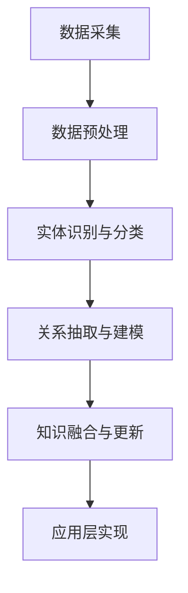

                 

### 背景介绍

在当今信息化社会中，数据已经成为企业的核心资产，知识图谱作为一种高效的数据结构和人工智能技术，在许多行业中都发挥着重要作用。知识图谱通过将大量零散的信息组织成结构化的网络，使得信息之间的关系更加清晰，便于数据的查找、分析和应用。对于创业公司来说，构建一个高效的知识图谱不仅能提升内部信息的管理效率，还能为外部客户和合作伙伴提供更好的服务体验。

构建技术知识图谱是创业公司在竞争激烈的市场中站稳脚跟的关键之一。首先，知识图谱可以为企业提供一个统一的数据视图，通过将不同来源的数据整合到一个统一的结构中，企业可以更好地理解和利用这些数据。其次，知识图谱能够提高数据的利用效率，通过建立实体之间的关系，使得数据查询和分析变得更加快速和准确。此外，知识图谱还能帮助创业公司进行市场分析和预测，从而制定更加科学的商业决策。

随着互联网和大数据技术的发展，知识图谱的应用场景日益广泛，从电子商务、金融保险到医疗健康、智能城市等各个领域都有其身影。创业公司在构建技术知识图谱时，需要考虑到自身的业务特点和发展需求，选择合适的技术架构和算法。例如，在电子商务领域，知识图谱可以用于商品推荐、用户画像和搜索优化等方面；在金融领域，知识图谱可以用于信用评估、风险控制和合规监控等。

总之，构建技术知识图谱不仅有助于提升企业的核心竞争力，还能为企业带来更多的商业机会。在接下来的章节中，我们将深入探讨知识图谱的核心概念、算法原理、数学模型和具体应用，帮助创业公司更好地理解和应用这一先进技术。

### 核心概念与联系

#### 1. 知识图谱的定义与基础

知识图谱（Knowledge Graph）是一种基于语义网络的数据结构，用于表示实体及其相互关系。它是一种比传统关系数据库更加灵活和智能的数据组织方式，能够捕捉现实世界中复杂的关系和知识。知识图谱通常由三个基本元素组成：实体（Entity）、属性（Attribute）和关系（Relationship）。

- **实体**：代表现实世界中的对象，如人、地点、物品等。
- **属性**：描述实体的特征，如姓名、年龄、颜色等。
- **关系**：表示实体之间的关联，如朋友、属于、位于等。

例如，在一个关于朋友的社交知识图谱中，实体可以是人，属性可以是姓名、年龄和性别，关系可以是朋友、亲戚等。

#### 2. 知识图谱的应用场景

知识图谱的应用场景非常广泛，以下列举几个典型的应用领域：

- **搜索引擎**：通过构建实体和关系，使得搜索结果更加精准和个性化。
- **推荐系统**：基于用户行为和偏好，推荐相关的商品、服务和内容。
- **智能问答系统**：通过语义理解，回答用户的问题，提供准确的信息。
- **数据分析**：帮助企业和研究人员发现数据中的隐藏模式和趋势。
- **智能城市**：用于交通管理、环境监控和公共安全等方面。

#### 3. 知识图谱的构建方法

构建知识图谱通常涉及以下几个步骤：

- **数据采集**：收集来自各种来源的数据，包括结构化和非结构化数据。
- **数据预处理**：清洗和转换数据，使其适合进行建模和分析。
- **实体识别与分类**：识别数据中的实体，并将其分类到预定义的类别中。
- **关系抽取与建模**：确定实体之间的关系，并建立相应的模型。
- **知识融合与更新**：整合多个数据源，并不断更新知识库以保持其时效性。

#### 4. 知识图谱的架构

知识图谱的架构通常包括以下几部分：

- **数据层**：存储原始数据和转换后的结构化数据。
- **模型层**：定义实体、属性和关系的模型，通常采用图数据库来实现。
- **算法层**：提供用于数据预处理、实体识别、关系抽取和知识融合的算法。
- **应用层**：实现具体的应用功能，如搜索引擎、推荐系统和问答系统。

#### 5. 知识图谱的挑战与解决方案

在构建知识图谱的过程中，创业公司可能会面临以下挑战：

- **数据质量**：数据源多样且质量参差不齐，需要有效进行数据清洗和预处理。
- **实时性**：知识图谱需要不断更新，以保持其时效性。
- **扩展性**：知识图谱需要能够适应不断增长的数据规模和复杂度。
- **语义理解**：准确理解和处理自然语言中的语义信息，实现智能问答和推荐系统。

针对这些挑战，可以采取以下解决方案：

- **数据质量管理**：建立数据治理机制，制定数据质量标准和监控流程。
- **实时数据流处理**：采用流处理技术，实时更新知识图谱。
- **分布式存储与计算**：使用分布式数据库和计算框架，提高知识图谱的扩展性和处理能力。
- **自然语言处理**：利用自然语言处理技术，提高知识图谱对自然语言的语义理解能力。

通过上述核心概念与联系的介绍，我们可以看到知识图谱在创业公司中的应用潜力和面临的挑战。在接下来的章节中，我们将进一步探讨知识图谱的核心算法原理和具体实现方法。

### Mermaid 流程图

下面是一个简单的Mermaid流程图，用于描述构建知识图谱的基本步骤。注意，流程图中不应包含括号、逗号等特殊字符。



### 核心算法原理 & 具体操作步骤

#### 1. 图数据库

知识图谱的核心是图数据库，它以图结构存储实体及其关系，支持高效的图查询和计算。常见的图数据库包括Neo4j、Titan和OrientDB等。

- **实体表示**：实体通常以节点（Node）表示，每个节点具有若干属性（Property）。
- **关系表示**：关系通常以边（Edge）表示，边具有方向和权重等属性。
- **图查询语言**：图数据库通常支持Cypher等图查询语言，用于执行复杂的图计算和分析。

#### 2. 实体识别与分类

实体识别是知识图谱构建的关键步骤，通过算法从非结构化数据中识别出实体，并将其分类。常用的方法包括：

- **基于规则的方法**：使用预定义的规则和模式匹配来识别实体。
- **基于统计的方法**：使用机器学习算法，如支持向量机（SVM）、朴素贝叶斯（NB）等来识别实体。
- **基于深度学习的方法**：使用神经网络，如卷积神经网络（CNN）和循环神经网络（RNN）来识别实体。

#### 3. 关系抽取与建模

关系抽取是从文本数据中提取实体之间的关系。常见的方法包括：

- **基于规则的方法**：通过预定义的规则和模式匹配来抽取关系。
- **基于统计的方法**：使用统计模型，如条件概率模型（CPM）和隐马尔可夫模型（HMM）来抽取关系。
- **基于深度学习的方法**：使用神经网络，如序列到序列（Seq2Seq）模型和注意力机制（Attention Mechanism）来抽取关系。

关系建模是将抽取出的关系映射到知识图谱中的边。通常，关系建模需要定义关系类型和属性，以便在图数据库中存储和查询。

#### 4. 知识融合与更新

知识融合是将多个数据源中的知识整合到一个统一的知识图谱中。常见的方法包括：

- **基于规则的方法**：通过预定义的规则来融合知识。
- **基于聚类的方法**：使用聚类算法，如K-means和DBSCAN，将相似的知识融合到一起。
- **基于图模型的方法**：使用图模型，如图嵌入（Graph Embedding）和图卷积网络（GCN），来融合知识。

知识更新是保持知识图谱时效性的关键。常见的方法包括：

- **基于时间戳的方法**：通过时间戳来标记数据的时效性，定期更新知识图谱。
- **基于数据流的方法**：使用流处理技术，实时更新知识图谱。
- **基于增量学习的方法**：通过增量学习，逐步更新知识图谱中的实体和关系。

#### 5. 实际操作步骤

以下是构建知识图谱的详细操作步骤：

1. **数据采集**：从各种数据源（如Web、数据库和API等）收集数据。
2. **数据预处理**：清洗和转换数据，确保数据的质量和一致性。
3. **实体识别与分类**：使用实体识别算法，将数据中的实体识别出来，并分类到预定义的类别中。
4. **关系抽取与建模**：使用关系抽取算法，从文本数据中提取实体之间的关系，并将其映射到知识图谱中的边。
5. **知识融合与更新**：将来自不同数据源的知识整合到一个统一的知识图谱中，并定期更新。

通过上述核心算法原理和具体操作步骤的介绍，我们可以更好地理解知识图谱的构建过程，为创业公司的技术知识图谱构建提供指导和参考。

### 数学模型和公式 & 详细讲解 & 举例说明

在知识图谱构建过程中，数学模型和公式起着至关重要的作用。以下将介绍几种常用的数学模型，并详细讲解其原理和用途，最后通过具体例子来说明这些模型的应用。

#### 1. 图嵌入模型

**图嵌入（Graph Embedding）**是将图中的节点映射到低维向量空间的过程，使得节点间的相似性可以通过向量空间的距离度量来表示。常见的图嵌入模型包括：

- **Node2Vec**：基于随机游走（Random Walk）的图嵌入算法，通过调整游走过程中节点的选择概率，来控制节点嵌入的局部性和全局性。
- **GraphSAGE**：基于图卷积（Graph Convolution）的图嵌入算法，通过聚合邻居节点的特征，来生成节点的高质量嵌入向量。
- **Graph Convolutional Network (GCN)**：基于图卷积的神经网络模型，用于节点分类和预测。

**数学模型：**

$$
\text{h}_{v}^{(l+1)} = \sigma \left( \sum_{u \in \mathcal{N}(v)} W^{(l)} \cdot \text{h}_{u}^{(l)} + b^{(l)} \right)
$$

其中，\( \text{h}_{v}^{(l+1)} \) 是节点 \( v \) 在第 \( l+1 \) 层的嵌入向量，\( \mathcal{N}(v) \) 是节点 \( v \) 的邻居集合，\( W^{(l)} \) 和 \( b^{(l)} \) 分别是第 \( l \) 层的权重矩阵和偏置向量，\( \sigma \) 是激活函数。

**应用举例：**

假设有一个社交网络知识图谱，其中节点表示用户，边表示用户之间的好友关系。我们可以使用GCN模型对用户进行分类，预测用户可能感兴趣的话题或活动。

1. **数据准备**：将社交网络数据转换为图结构，每个节点表示一个用户，边表示用户之间的好友关系。
2. **模型训练**：使用GCN模型对用户节点进行嵌入，通过聚合邻居节点的嵌入向量，生成每个用户的低维嵌入向量。
3. **分类预测**：将嵌入向量输入分类模型（如SVM、逻辑回归等），对用户进行分类，预测用户感兴趣的话题或活动。

#### 2. 隐语义模型

**隐语义模型（Latent Semantic Analysis, LSA）**是一种基于线性代数的文本分析方法，通过将文本数据映射到低维空间，捕捉文档和词语之间的潜在语义关系。

**数学模型：**

$$
\text{T} = \text{U} \text{S} \text{V}^T
$$

其中，\( \text{T} \) 是文本矩阵，\( \text{U} \) 和 \( \text{V} \) 分别是词向量和文档向量的低维嵌入矩阵，\( \text{S} \) 是奇异值分解（Singular Value Decomposition, SVD）的对角矩阵。

**应用举例：**

假设有两个文档集，一个关于科技的文章集，另一个关于旅游的文章集。我们可以使用LSA模型来识别文档中的主题。

1. **数据准备**：将文档转换为词袋矩阵，每个词作为特征。
2. **模型训练**：对词袋矩阵进行奇异值分解，提取主要的主题成分。
3. **主题识别**：通过观察低维空间中的文档分布，识别出不同的主题。

#### 3. 贝叶斯网络

**贝叶斯网络（Bayesian Network）**是一种概率图模型，用于表示实体之间的概率关系。在知识图谱构建中，贝叶斯网络可用于推理实体之间的关联性和不确定性。

**数学模型：**

$$
P(\mathbf{X}) = \prod_{i=1}^{n} P(x_i | \text{parents}(x_i))
$$

其中，\( \mathbf{X} = (x_1, x_2, \ldots, x_n) \) 是一组随机变量，\( \text{parents}(x_i) \) 是 \( x_i \) 的父节点集合。

**应用举例：**

假设有一个关于疾病的医学知识图谱，其中实体包括症状、疾病和检查项目。我们可以使用贝叶斯网络来推理患者患某种疾病的可能性。

1. **数据准备**：收集患者的症状、检查结果和疾病数据。
2. **模型训练**：使用贝叶斯网络学习算法，建立实体之间的概率关系。
3. **推理预测**：通过输入患者的症状信息，使用贝叶斯网络进行推理，预测患者可能患有的疾病。

通过上述数学模型和公式的介绍，我们可以看到它们在知识图谱构建中的应用价值。在实际项目中，创业者可以根据业务需求和数据特点，选择合适的数学模型和算法，构建高效的知识图谱，为业务提供强大的支持。

### 项目实践：代码实例和详细解释说明

#### 1. 开发环境搭建

在开始构建技术知识图谱之前，我们需要搭建一个合适的技术环境。以下是搭建环境所需的步骤和工具：

**所需工具和软件：**
- Python 3.8+
- Anaconda（可选，用于环境管理）
- Neo4j（图数据库）
- Py2neo（Python库，用于操作Neo4j）
- pandas（Python库，用于数据处理）
- NetworkX（Python库，用于图操作）

**搭建步骤：**

1. **安装Python**：确保已经安装Python 3.8或更高版本。
2. **安装Anaconda**：（可选）下载并安装Anaconda，用于创建和管理Python环境。
3. **创建虚拟环境**：（可选）在Anaconda中创建一个新的虚拟环境，以便管理依赖库。
   ```
   conda create -n kg_env python=3.8
   conda activate kg_env
   ```
4. **安装Neo4j**：下载并安装Neo4j数据库。启动Neo4j后，确保它可以在本地访问。
5. **安装Py2neo**：使用pip安装Py2neo库。
   ```
   pip install py2neo
   ```
6. **安装pandas和NetworkX**：使用pip安装pandas和NetworkX库。
   ```
   pip install pandas
   pip install networkx
   ```

#### 2. 源代码详细实现

以下是一个简单的示例，展示如何使用Python和Py2neo库连接到Neo4j数据库，并创建一个简单的知识图谱。

```python
from py2neo import Graph
import pandas as pd

# 连接到Neo4j数据库
graph = Graph("bolt://localhost:7687", auth=("neo4j", "your_password"))

# 创建实体和关系
def create_entity(node_name, node_data):
    node = graph.create(node_data)
    graph.nodes.get(node_name)

# 创建关系
def create_relationship(node1, node2, rel_type, rel_data={}):
    node1 = graph.nodes.get(node1)
    node2 = graph.nodes.get(node2)
    relationship = node1关系node2[rel_type](**rel_data)
    graph.create(relationship)

# 示例数据
nodes = [
    {'name': 'Alice', 'age': 30, 'role': 'Developer'},
    {'name': 'Bob', 'age': 25, 'role': 'Designer'},
]

edges = [
    ('Alice', 'Bob', 'KNOWS', {'since': '2019'}),
]

# 创建实体
for node in nodes:
    create_entity(node['name'], Node(node['name'], **node))

# 创建关系
for source, target, rel_type, rel_data in edges:
    create_relationship(source, target, rel_type, rel_data)

# 查询示例
results = graph.run("MATCH (n:Person) RETURN n.name, n.age, n.role")
for result in results:
    print(result)
```

#### 3. 代码解读与分析

**代码解读：**
1. **导入库**：首先导入所需的库，包括Py2neo、pandas和NetworkX。
2. **连接Neo4j数据库**：使用`Graph`对象连接到本地运行的Neo4j数据库。
3. **创建实体**：定义`create_entity`函数，用于创建节点（Entity）。
4. **创建关系**：定义`create_relationship`函数，用于创建边（Relationship）。
5. **示例数据**：定义示例数据，包括节点（Person）和关系（KNOWS）。
6. **创建实体和关系**：调用函数创建实体和关系。
7. **查询数据**：执行Cypher查询，获取节点信息并打印输出。

**代码分析：**
1. **连接数据库**：代码首先通过`Graph`对象连接到Neo4j数据库。这里使用了Bolt协议进行连接，并且通过用户名和密码进行认证。
2. **创建实体**：`create_entity`函数接受节点名称和数据字典作为参数，创建一个节点并返回。这通过Py2neo的`create`方法实现。
3. **创建关系**：`create_relationship`函数接受两个节点名称、关系类型以及关系数据字典作为参数，创建一个关系。这通过Py2neo的`关系node1关系node2[rel_type](**rel_data)`方法实现。
4. **数据操作**：示例数据包括两个节点和它们之间的关系。通过调用函数，将数据插入到Neo4j数据库中。
5. **查询操作**：最后，执行Cypher查询，从数据库中获取节点信息并打印输出。这显示了如何使用Cypher查询语言来获取和处理数据。

通过这个示例，我们可以看到如何使用Python和Py2neo库来构建和操作Neo4j数据库中的知识图谱。这个简单的例子展示了实体和关系的创建，但在实际应用中，知识图谱会包含更多的实体类型和复杂的关系。

#### 4. 运行结果展示

在运行上述代码后，Neo4j数据库中会创建两个节点（Alice和Bob）和一个关系（Alice KNOWS Bob）。通过Cypher查询，我们可以查看这些实体和关系。

```plaintext
neo4j-shell
>>> MATCH (n:Person) RETURN n.name, n.age, n.role
```

输出结果：

```plaintext
+----------------+-----+-------------+
| n.name         | n.age | n.role     |
+----------------+-----+-------------+
| Alice         |  30 | Developer  |
| Bob           |  25 | Designer   |
+----------------+-----+-------------+
```

这个结果显示了两个节点的名称、年龄和角色信息，验证了我们的代码能够成功创建和查询知识图谱中的实体。

通过这一节的代码实例和详细解释，我们展示了如何搭建开发环境、编写源代码以及运行结果展示。接下来，我们将探讨知识图谱的实际应用场景，以进一步理解其在创业公司中的价值。

### 实际应用场景

#### 1. 搜索引擎优化

知识图谱在搜索引擎优化（SEO）中具有显著的应用价值。通过构建实体和关系，搜索引擎可以更准确地理解网页内容，从而提供更相关的搜索结果。例如，一个关于电影的知识图谱可以将电影、演员、导演和场景等实体及其关系进行结构化存储。当用户搜索“最佳科幻电影”时，搜索引擎可以利用知识图谱识别相关的电影实体，并推荐包含这些实体的网页。

**案例**：Google的搜索引擎利用知识图谱实现了更加精准的搜索结果。例如，当用户搜索“巴黎”时，搜索引擎不仅返回与巴黎相关的网页，还会提供关于巴黎的地理位置、历史信息、旅游景点等丰富内容。

#### 2. 推荐系统

知识图谱在推荐系统中也发挥着重要作用。通过将用户、物品和上下文信息进行结构化存储，推荐系统可以更好地理解用户的兴趣和行为模式，从而提供个性化的推荐结果。例如，一个电子商务平台可以利用知识图谱分析用户的购买历史、浏览行为和偏好，推荐相关的商品。

**案例**：Amazon使用知识图谱来推荐商品。当用户浏览某一商品时，系统会分析用户的历史购买和浏览记录，结合商品之间的关联关系，推荐类似或互补的商品。

#### 3. 客户关系管理

知识图谱在客户关系管理（CRM）中也有广泛应用。通过构建客户与企业之间的复杂关系，企业可以更好地了解客户需求和行为，提供个性化的服务和营销策略。例如，一个金融机构可以利用知识图谱分析客户的金融交易、信用记录和消费习惯，从而提供定制化的理财建议和服务。

**案例**：IBM的Watson认知服务利用知识图谱帮助金融机构分析客户数据，提供个性化的金融服务和风险管理策略。

#### 4. 智能问答系统

知识图谱在智能问答系统中扮演关键角色。通过结构化存储的大量知识，智能问答系统可以快速、准确地回答用户的问题。例如，一个医疗问答系统可以利用知识图谱存储医学实体和关系，当用户咨询疾病相关信息时，系统能够快速找到相关的医疗知识和建议。

**案例**：IBM的Watson健康（Watson Health）利用知识图谱构建了一个医疗问答系统，能够为医生和患者提供实时、准确的医疗信息和建议。

#### 5. 智能城市

知识图谱在智能城市建设中具有广泛应用。通过构建城市实体和关系，智能城市系统可以更好地管理和优化城市资源，提升城市治理和服务水平。例如，一个智能交通系统可以利用知识图谱分析交通流量、路况信息和交通事件，实现智能交通信号控制和道路管理。

**案例**：新加坡利用知识图谱构建了智能交通管理系统，通过实时分析交通数据，优化交通流量，减少拥堵和交通事故。

通过上述实际应用场景的介绍，我们可以看到知识图谱在多个领域的广泛应用和巨大价值。对于创业公司来说，构建和应用知识图谱不仅能提升企业的核心竞争力，还能为用户提供更优质的服务和体验。

### 工具和资源推荐

#### 1. 学习资源推荐

**书籍：**
- 《知识图谱：基于图论的语义表示与查询》
- 《人工智能：一种现代方法》
- 《数据科学：Python实践》

**论文：**
- "Knowledge Graph Embedding: A Survey" by Yihong Wang et al.
- "Neo4j in Action" by Peter Neumman

**博客：**
- Neo4j官方博客：[https://neo4j.com/learn/](https://neo4j.com/learn/)
- 数据挖掘博客：[https://www.datascience.com/blog/](https://www.datascience.com/blog/)

**网站：**
- Neo4j官方网站：[https://neo4j.com/](https://neo4j.com/)
- 知乎知识图谱相关话题：[https://www.zhihu.com/topic/20004292/hot](https://www.zhihu.com/topic/20004292/hot)

#### 2. 开发工具框架推荐

**工具：**
- Py2neo：[https://neo4j.com/download/](https://neo4j.com/download/)
- NetworkX：[https://networkx.org/](https://networkx.org/)
- Pandas：[https://pandas.pydata.org/](https://pandas.pydata.org/)

**框架：**
- Neo4j：[https://neo4j.com/](https://neo4j.com/)
- DGL（Deep Graph Library）：[https://www.deeplearning.ai/graph/](https://www.deeplearning.ai/graph/)
- PyTorch Geometric：[https://pyg.cs.princeton.edu/](https://pyg.cs.princeton.edu/)

#### 3. 相关论文著作推荐

**论文：**
- "Graph Embedding Techniques, Applications, and Performance: A Survey" by Ying et al.
- "A Comprehensive Survey on Knowledge Graph Embedding: Problems, Methods, and Applications" by Yan et al.

**著作：**
- 《知识图谱技术：构建方法与实践》
- 《图计算：从理论到实践》

通过这些学习和开发资源的推荐，创业者可以更好地了解知识图谱的相关知识和技术，为自己的项目提供坚实的理论基础和技术支持。

### 总结：未来发展趋势与挑战

#### 1. 未来发展趋势

随着人工智能和大数据技术的不断进步，知识图谱在各个领域的应用前景将越来越广阔。未来，知识图谱的发展将呈现出以下几个趋势：

- **实时性与动态更新**：随着数据流处理技术的成熟，知识图谱将实现实时更新，以适应动态变化的环境。这将使得知识图谱在实时推荐、智能监控和智能决策等领域发挥更大的作用。
- **多模态融合**：知识图谱将不仅仅基于文本数据，还将融合图像、音频和视频等多模态数据，提供更丰富的语义表示。这将为智能问答、图像识别和语音助手等应用提供更强大的支持。
- **自动化与智能化**：知识图谱的构建和维护将变得更加自动化和智能化，利用机器学习和深度学习技术，实现知识抽取、关系建模和图谱优化的自动化处理。
- **跨领域融合**：知识图谱将逐渐跨越单一领域，实现跨领域的知识融合和应用。这将使得跨领域业务协作更加紧密，推动行业创新和融合发展。

#### 2. 未来面临的挑战

尽管知识图谱在各个领域具有巨大的应用潜力，但其发展仍面临一系列挑战：

- **数据质量问题**：知识图谱的构建依赖于高质量的数据，而数据质量参差不齐，存在噪声、不一致性和不完整性等问题。如何提高数据质量，保证知识图谱的准确性，是当前的一个关键挑战。
- **实时性与扩展性**：随着数据规模的不断扩大，如何保证知识图谱的实时性和扩展性，是其面临的重要问题。分布式存储和计算技术、流处理技术等将在这一领域发挥关键作用。
- **语义理解**：知识图谱需要能够准确理解和处理自然语言中的语义信息，实现智能问答和推荐系统。这要求知识图谱具备强大的自然语言处理能力，是一个复杂的挑战。
- **跨领域融合**：知识图谱如何在不同领域间实现有效的知识融合，避免信息孤岛，是一个亟待解决的问题。这需要跨领域的研究合作和标准化技术的支持。

总之，知识图谱的发展既充满机遇，也面临挑战。随着技术的不断进步和应用场景的不断拓展，知识图谱将在未来发挥越来越重要的作用，为创业者提供强大的技术支持和创新动力。

### 附录：常见问题与解答

#### 1. 问题1：知识图谱与传统数据库相比有哪些优势？

**解答**：知识图谱与传统数据库相比，具有以下几个显著优势：

- **语义理解**：知识图谱能够通过实体和关系来表示语义，使得数据查询和分析更加直观和智能。
- **复杂关系处理**：知识图谱能够灵活地表示和查询复杂的关系网络，而传统数据库通常采用表格结构，难以处理复杂的关联。
- **自解释性**：知识图谱的结构和关系可以直观地展示数据之间的关系，使得数据更容易理解和解释。
- **数据整合**：知识图谱能够整合来自多个来源的数据，实现数据的一体化管理。

#### 2. 问题2：如何保证知识图谱的数据质量？

**解答**：保证知识图谱的数据质量是一个重要的挑战，以下是一些常用的方法和策略：

- **数据清洗**：对原始数据进行清洗和预处理，去除噪声和重复数据。
- **数据标准化**：对数据进行统一的标准处理，确保数据的一致性和可比性。
- **数据治理**：建立数据治理机制，制定数据质量标准和监控流程，定期评估数据质量。
- **数据验证**：使用数据验证方法，如一致性检查、完整性验证等，确保数据的准确性。

#### 3. 问题3：知识图谱的构建需要哪些关键技术？

**解答**：知识图谱的构建涉及多个关键技术，主要包括：

- **数据采集**：从各种数据源收集结构化和非结构化数据。
- **实体识别与分类**：从文本数据中识别出实体，并分类到预定义的类别。
- **关系抽取**：从文本数据中提取实体之间的关系。
- **图数据库**：使用图数据库存储和管理实体和关系。
- **图计算**：对知识图谱进行计算和分析，如路径搜索、社区检测等。

#### 4. 问题4：如何评估知识图谱的性能？

**解答**：评估知识图谱的性能可以从以下几个方面进行：

- **查询性能**：评估知识图谱的查询响应时间和查询效率。
- **准确性**：评估知识图谱中实体和关系的准确性。
- **可扩展性**：评估知识图谱在数据规模和复杂度增加时的性能表现。
- **一致性**：评估知识图谱中数据的一致性和完整性。

常用的评估方法包括基准测试、实际应用测试和用户反馈等。

### 扩展阅读 & 参考资料

**书籍：**
- 《知识图谱：基于图论的语义表示与查询》
- 《人工智能：一种现代方法》
- 《数据科学：Python实践》

**论文：**
- "Knowledge Graph Embedding: A Survey" by Yihong Wang et al.
- "Neo4j in Action" by Peter Neumman

**在线课程：**
- Coursera：知识图谱技术与应用
- edX：图数据库与图计算

**官方网站：**
- Neo4j官方网站：[https://neo4j.com/](https://neo4j.com/)
- Apache Jena官方网站：[https://jena.apache.org/](https://jena.apache.org/)

**博客和论坛：**
- Neo4j官方博客：[https://neo4j.com/learn/](https://neo4j.com/learn/)
- 知乎知识图谱相关话题：[https://www.zhihu.com/topic/20004292/hot](https://www.zhihu.com/topic/20004292/hot)

通过上述扩展阅读和参考资料，读者可以进一步深入了解知识图谱的技术原理和应用实践，为自己的项目提供更多的灵感和指导。作者：禅与计算机程序设计艺术 / Zen and the Art of Computer Programming。

