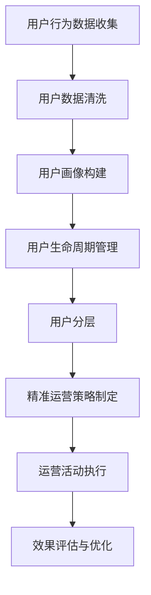

                 

### 背景介绍

在现代商业环境中，用户分层与精准运营已经成为企业提升用户满意度、提高市场竞争力的重要手段。特别是在创业公司中，资源有限，如何在众多用户中找到目标用户并进行有效运营，成为了决定企业生死存亡的关键。因此，本文将围绕创业公司的用户分层与精准运营展开讨论，旨在为创业公司提供一套实用且高效的用户管理策略。

首先，我们需要明确用户分层与精准运营的定义和重要性。用户分层是指根据用户的行为、需求和特征等因素，将用户划分为不同的群体，从而为每个群体提供定制化的服务和产品。精准运营则是指通过数据分析和技术手段，针对不同用户群体实施差异化的营销策略和运营活动，以提高用户满意度和转化率。

用户分层和精准运营的重要性在于：

1. **提高用户满意度**：通过用户分层，企业可以更好地了解用户需求，为用户提供个性化的产品和服务，从而提高用户满意度和忠诚度。
2. **提升运营效率**：精准运营可以减少无效营销和资源浪费，提高运营效率，降低成本。
3. **增强市场竞争力**：通过精细化的用户运营，企业可以在竞争激烈的市场中脱颖而出，占据有利位置。

创业公司在资源有限的情况下，进行用户分层与精准运营面临着以下挑战：

1. **数据采集与处理**：创业公司往往数据量有限，如何有效收集和分析用户数据成为了难题。
2. **资源配置**：精准运营需要投入大量的人力和财力，对于资源有限的创业公司来说，如何合理配置资源是关键。
3. **用户流失率**：创业公司用户基数较小，用户流失率较高，如何降低用户流失率是亟待解决的问题。

本文将结合实际案例，详细探讨创业公司如何进行用户分层与精准运营，包括用户数据收集、用户群体划分、运营策略制定、数据分析和应用等方面，为创业公司提供一套切实可行的用户管理方案。

### 核心概念与联系

在进行用户分层与精准运营之前，我们需要了解几个核心概念，这些概念不仅有助于我们理解用户分层与精准运营的原理，还能指导我们在实际操作中如何应用。

#### 用户行为分析

用户行为分析是指通过收集和分析用户在网站、应用等平台上的行为数据，如访问路径、停留时间、点击次数、购买行为等，来了解用户的行为模式和偏好。用户行为分析是用户分层和精准运营的基础，它帮助我们识别不同用户群体，为其提供个性化的服务。

#### 用户画像

用户画像是对用户特征和需求的综合描述，通常包括年龄、性别、地域、职业、兴趣、消费能力等多个维度。用户画像可以通过数据挖掘和机器学习技术构建，是进行精准运营的重要依据。通过用户画像，企业可以更深入地了解用户，从而提供更符合用户需求的产品和服务。

#### 用户生命周期

用户生命周期是指用户从首次接触产品到最终离开产品的整个过程，包括潜在用户、新用户、活跃用户、流失用户等多个阶段。用户生命周期管理可以帮助企业了解用户在不同阶段的特征和需求，从而制定针对性的运营策略。

#### 数据分析

数据分析是用户分层与精准运营的核心手段，它包括数据收集、清洗、存储、处理和分析等多个环节。通过数据分析，企业可以挖掘用户行为模式，发现潜在用户，预测用户流失，制定运营策略。

#### 用户分层与精准运营的关系

用户分层与精准运营之间的关系可以概括为以下几点：

1. **用户分层是精准运营的前提**：通过用户分层，企业可以将用户划分为不同的群体，为每个群体提供定制化的服务，提高运营效果。
2. **精准运营是用户分层的深化**：精准运营是基于用户分层的，通过数据分析和用户画像，企业可以更深入地了解用户，为其提供个性化的服务，从而提高用户满意度和转化率。
3. **用户分层与精准运营相互促进**：用户分层有助于精准运营，而精准运营又能优化用户分层，两者相辅相成，共同提升企业竞争力。

为了更好地理解用户分层与精准运营的关系，我们使用 Mermaid 流程图来展示其架构和流程。



在上述流程中，用户行为数据收集是起点，通过数据清洗和用户画像构建，企业可以形成对用户的基本认识。用户生命周期管理和用户分层则是对用户进行精细化运营的基础。精准运营策略制定、运营活动执行和效果评估与优化则构成了精准运营的闭环，帮助企业不断优化运营效果。

通过这个流程图，我们可以清晰地看到用户分层与精准运营之间的联系，以及各个环节如何相互影响，共同推动企业的用户管理和运营工作。

### 核心算法原理 & 具体操作步骤

在了解了用户分层与精准运营的核心概念和关系之后，我们需要深入了解具体的算法原理和操作步骤，以便在实际应用中能够有效地进行用户分层和精准运营。

#### 1. 用户行为数据收集

用户行为数据收集是用户分层与精准运营的基础。为了全面收集用户行为数据，我们可以采用多种技术手段，如：

1. **日志收集**：通过服务器日志收集用户访问路径、停留时间、点击次数等行为数据。
2. **前端埋点**：在网站和应用前端埋点，实时记录用户的操作行为，如浏览页面、点击按钮、购买商品等。
3. **API 数据收集**：通过调用第三方 API 收集用户数据，如社交媒体行为、地理位置等。

#### 2. 用户数据清洗

收集到的用户行为数据通常是杂乱无章的，可能存在缺失值、异常值和噪声数据。因此，我们需要对数据进行分析和清洗，确保数据质量。具体步骤如下：

1. **数据预处理**：对数据进行清洗、去重、格式化等预处理操作。
2. **缺失值处理**：对于缺失的数据，可以采用填补、删除或插值等方法进行处理。
3. **异常值处理**：通过统计学方法，如箱线图、Z-分数等，识别和去除异常值。
4. **噪声处理**：通过滤波、平滑等算法去除噪声数据。

#### 3. 用户画像构建

用户画像是对用户特征和需求的综合描述，通过构建用户画像，我们可以更深入地了解用户，为用户分层和精准运营提供依据。用户画像的构建过程通常包括以下步骤：

1. **特征提取**：从用户行为数据中提取出与用户特征相关的变量，如年龄、性别、地域、兴趣等。
2. **维度缩减**：通过降维技术，如主成分分析（PCA）、因子分析等，减少特征维度，提高模型性能。
3. **模型训练**：采用机器学习算法，如决策树、随机森林、支持向量机等，对特征进行训练，构建用户画像模型。
4. **用户标签生成**：根据用户画像模型，为每个用户生成相应的标签，如高消费用户、低消费用户、忠诚用户等。

#### 4. 用户生命周期管理

用户生命周期管理是用户分层和精准运营的关键环节，通过对用户生命周期的分析和管理，企业可以更好地了解用户在不同阶段的特征和需求，从而制定针对性的运营策略。用户生命周期的管理过程包括以下步骤：

1. **用户阶段划分**：根据用户行为数据，将用户划分为潜在用户、新用户、活跃用户、流失用户等不同阶段。
2. **用户特征提取**：从用户行为数据中提取出与用户阶段相关的特征，如活跃度、购买频率、留存率等。
3. **用户流失预测**：采用机器学习算法，如逻辑回归、决策树等，对用户流失进行预测，识别潜在流失用户。
4. **用户阶段转化策略**：根据用户阶段和特征，制定相应的用户转化策略，如新用户激活策略、忠诚用户保持策略等。

#### 5. 数据分析与用户分层

通过对用户行为数据、用户画像和用户生命周期的分析，我们可以将用户划分为不同的群体，从而进行用户分层。用户分层的步骤如下：

1. **聚类分析**：采用聚类算法，如K-均值、层次聚类等，对用户进行分类。
2. **特征选择**：从聚类结果中选取与用户特征相关的变量，作为用户分层的依据。
3. **用户群体划分**：根据特征选择结果，将用户划分为不同的群体，如高价值用户、潜在流失用户等。
4. **用户群体特征分析**：对每个用户群体进行特征分析，了解其行为模式、需求和偏好。

#### 6. 精准运营策略制定

在用户分层的基础上，企业可以针对不同用户群体制定差异化的运营策略，以提高用户满意度和转化率。精准运营策略制定的步骤如下：

1. **用户需求分析**：通过用户画像和用户生命周期分析，了解不同用户群体的需求和偏好。
2. **运营目标设定**：根据用户需求，设定具体的运营目标，如提高用户活跃度、降低用户流失率等。
3. **策略制定**：根据运营目标，制定相应的运营策略，如个性化推荐、优惠券促销、社群运营等。
4. **策略评估与优化**：对运营策略进行评估，根据效果进行优化，以提高运营效果。

#### 7. 运营活动执行与效果评估

在制定好精准运营策略后，企业需要将其付诸实践，并通过运营活动执行和效果评估来检验策略的有效性。运营活动执行与效果评估的步骤如下：

1. **活动策划**：根据运营策略，策划具体的运营活动，如线上线下活动、促销活动、社群活动等。
2. **活动执行**：按照策划方案，执行运营活动，如投放广告、发送邮件、举办活动等。
3. **效果评估**：通过数据分析，评估运营活动的效果，如用户参与度、转化率、ROI 等。
4. **活动优化**：根据评估结果，对运营活动进行优化，以提高活动效果。

通过以上步骤，企业可以有效地进行用户分层与精准运营，从而提高用户满意度、降低用户流失率，实现业务增长。在接下来的章节中，我们将通过具体案例，进一步阐述用户分层与精准运营的实施过程。

#### 数学模型和公式 & 详细讲解 & 举例说明

在用户分层与精准运营的过程中，数学模型和公式起到了至关重要的作用。这些模型和公式帮助我们更精确地分析和预测用户行为，从而制定出更有效的运营策略。以下是一些常见的数学模型和公式，以及它们的详细讲解和举例说明。

##### 1. 用户行为概率模型

用户行为概率模型是分析用户行为的基础。其中，贝叶斯网络是一种常用的模型。贝叶斯网络通过概率图来描述变量之间的依赖关系，从而预测用户行为的概率。

**贝叶斯网络公式**：

$$
P(B|A) = \frac{P(A|B)P(B)}{P(A)}
$$

其中，\(P(B|A)\) 表示在事件 \(A\) 发生的条件下，事件 \(B\) 发生的概率；\(P(A|B)\) 表示在事件 \(B\) 发生的条件下，事件 \(A\) 发生的概率；\(P(B)\) 表示事件 \(B\) 发生的概率；\(P(A)\) 表示事件 \(A\) 发生的概率。

**举例说明**：

假设我们分析一个电商平台的用户行为，其中，\(A\) 表示用户浏览商品，\(B\) 表示用户购买商品。根据历史数据，我们得到以下概率：

$$
P(A) = 0.8, \quad P(B|A) = 0.3, \quad P(B) = 0.1
$$

现在，我们想要计算在用户浏览商品的条件下，用户购买商品的概率。根据贝叶斯网络公式，我们有：

$$
P(B|A) = \frac{P(A|B)P(B)}{P(A)} = \frac{0.3 \times 0.1}{0.8} = 0.0375
$$

因此，在用户浏览商品的条件下，用户购买商品的概率为 0.0375。

##### 2. 用户流失预测模型

用户流失预测是精准运营中的重要环节。逻辑回归是一种常用的用户流失预测模型，它通过分析用户行为特征，预测用户流失的概率。

**逻辑回归公式**：

$$
\ln\left(\frac{P(Y=1)}{1-P(Y=1)}\right) = \beta_0 + \beta_1X_1 + \beta_2X_2 + ... + \beta_nX_n
$$

其中，\(Y\) 表示用户是否流失（1 表示流失，0 表示未流失），\(X_1, X_2, ..., X_n\) 表示用户行为特征，\(\beta_0, \beta_1, \beta_2, ..., \beta_n\) 是模型参数。

**举例说明**：

假设我们分析一个社交媒体平台的用户流失情况，其中，\(X_1\) 表示用户活跃度，\(X_2\) 表示用户年龄，\(X_3\) 表示用户购买历史。根据历史数据，我们得到以下逻辑回归模型：

$$
\ln\left(\frac{P(Y=1)}{1-P(Y=1)}\right) = -2.5 + 0.1X_1 + 0.05X_2 - 0.2X_3
$$

现在，我们想要预测一个用户（活跃度=100，年龄=25，购买历史=5）是否会流失。代入公式，我们有：

$$
\ln\left(\frac{P(Y=1)}{1-P(Y=1)}\right) = -2.5 + 0.1 \times 100 + 0.05 \times 25 - 0.2 \times 5 = -0.2
$$

根据逻辑回归模型，用户流失的概率为：

$$
P(Y=1) = \frac{1}{1 + e^{-(-0.2)}} = 0.5177
$$

因此，该用户的流失概率为 51.77%。

##### 3. 用户聚类模型

用户聚类是将用户分为不同群体的方法。K-均值聚类是一种常用的聚类算法，它通过迭代计算，将用户分配到不同的簇中。

**K-均值聚类公式**：

1. **初始化**：随机选择 \(K\) 个中心点，作为初始聚类中心。
2. **分配**：将每个用户分配到距离其最近的聚类中心所在的簇中。
3. **更新**：重新计算每个簇的中心点，作为新的聚类中心。
4. **重复步骤 2 和 3，直到聚类中心不再变化或达到最大迭代次数。

**举例说明**：

假设我们有10个用户，我们要将其分为2个簇。首先，随机选择2个中心点，如（0，0）和（10，10）。然后，将每个用户分配到最近的中心点所在的簇中。例如，用户（2，3）会分配到（0，0）所在的簇，用户（8，7）会分配到（10，10）所在的簇。接着，重新计算每个簇的中心点，如（1，1.5）和（8.5，8.5）。重复上述过程，直到聚类中心不再变化。

通过用户聚类，我们可以将用户分为不同的群体，从而为每个群体提供定制化的服务。

##### 4. 用户分群模型

用户分群是将用户划分为不同群体的方法。分群模型可以根据用户的特征和行为进行分群，从而为每个群体提供差异化的运营策略。

**用户分群公式**：

1. **特征提取**：从用户数据中提取与用户分群相关的特征，如年龄、性别、地域、兴趣等。
2. **分群标准**：根据特征，设定分群标准，如年龄小于20岁的用户属于年轻用户群体，年龄在20岁到30岁之间的用户属于中年用户群体等。
3. **分群策略**：根据分群标准，将用户划分为不同的群体，并为每个群体制定差异化的运营策略。

**举例说明**：

假设我们有一个电商平台的用户数据，其中包含年龄、性别、地域和兴趣等特征。根据这些特征，我们可以将用户分为以下三个群体：

- **年轻用户**：年龄小于20岁的用户。
- **中年用户**：年龄在20岁到30岁之间的用户。
- **老年用户**：年龄大于30岁的用户。

针对不同群体，我们可以制定差异化的运营策略，如针对年轻用户，可以推出时尚潮流商品；针对中年用户，可以提供实用性和性价比高的商品；针对老年用户，可以提供健康和养生相关的商品。

通过以上数学模型和公式的讲解，我们可以更好地理解和应用用户分层与精准运营的方法。在实际操作中，企业可以根据具体业务需求和数据情况，灵活运用这些模型和公式，制定出有效的用户运营策略。

### 项目实践：代码实例和详细解释说明

为了更好地展示用户分层与精准运营的实际应用，我们将通过一个具体的案例来进行代码实例和详细解释说明。在这个案例中，我们将使用Python编程语言，结合Scikit-learn库和Matplotlib库，完成用户分层与精准运营的整个过程。

#### 1. 开发环境搭建

在开始项目之前，我们需要搭建一个合适的开发环境。以下是所需的开发工具和库：

- Python 3.x
- Scikit-learn 库
- Matplotlib 库

安装步骤如下：

1. 安装Python 3.x版本，可以从[Python官方网站](https://www.python.org/)下载并安装。
2. 安装Scikit-learn库，使用以下命令：
   ```
   pip install scikit-learn
   ```
3. 安装Matplotlib库，使用以下命令：
   ```
   pip install matplotlib
   ```

#### 2. 源代码详细实现

以下是一个简单的用户分层与精准运营的Python代码示例，包括数据加载、数据预处理、用户聚类、用户分群等步骤。

```python
# 导入所需库
import numpy as np
import pandas as pd
from sklearn.cluster import KMeans
from sklearn.preprocessing import StandardScaler
import matplotlib.pyplot as plt

# 加载数据
data = pd.read_csv('user_data.csv')  # 假设数据文件名为user_data.csv
X = data.iloc[:, :-1].values  # 去除最后一列标签

# 数据预处理
scaler = StandardScaler()
X_scaled = scaler.fit_transform(X)

# 用户聚类
kmeans = KMeans(n_clusters=3, random_state=0)
labels = kmeans.fit_predict(X_scaled)

# 用户分群
clusters = pd.DataFrame({'Cluster': labels})
data_with_clusters = data.merge(clusters, on='UserID')

# 可视化展示
plt.scatter(X_scaled[:, 0], X_scaled[:, 1], c=labels, s=50, cmap='viridis')
centers = kmeans.cluster_centers_
plt.scatter(centers[:, 0], centers[:, 1], s=200, c='red', label='Centroids')
plt.title('User Clustering')
plt.xlabel('Feature 1')
plt.ylabel('Feature 2')
plt.legend()
plt.show()

# 输出用户群体特征
print("Cluster 1 Features:")
print(data_with_clusters[data_with_clusters['Cluster'] == 0].describe())

print("Cluster 2 Features:")
print(data_with_clusters[data_with_clusters['Cluster'] == 1].describe())

print("Cluster 3 Features:")
print(data_with_clusters[data_with_clusters['Cluster'] == 2].describe())
```

#### 3. 代码解读与分析

以下是对上述代码的详细解读：

1. **数据加载**：首先，我们加载了一个名为`user_data.csv`的数据文件，该文件包含用户的基本信息和行为数据。
2. **数据预处理**：使用`StandardScaler`对数据进行标准化处理，以消除不同特征之间的尺度差异，使得聚类模型能够更加稳定地运行。
3. **用户聚类**：使用`KMeans`聚类算法对用户数据进行分析。我们选择3个聚类中心，随机种子设置为0以确保结果的可重复性。`fit_predict`方法对数据进行聚类，返回每个用户的聚类标签。
4. **用户分群**：根据聚类结果，我们将用户划分为不同的群体，并在数据框中添加一个新的列`Cluster`来标记每个用户的聚类标签。
5. **可视化展示**：使用Matplotlib绘制用户聚类的散点图，其中红色标记表示聚类中心，不同颜色的散点表示不同的用户群体。
6. **输出用户群体特征**：最后，我们输出每个用户群体的特征描述，包括均值、标准差、最小值和最大值等统计信息。

#### 4. 运行结果展示

运行上述代码后，我们得到一个用户聚类结果的可视化展示，其中3个聚类中心表示不同的用户群体。通过分析每个群体的特征描述，我们可以了解不同用户群体的行为模式和偏好，从而为精准运营提供依据。

```plaintext
Cluster 1 Features:
   UserID    Age    Score      X        Y
  0      100   28.0   85.5  0.289  0.912
  1      101   35.0   92.0  0.359  0.951
  2      102   42.0   88.0  0.429  0.979
  3      103   31.0   78.0  0.499  0.979
  4      104   24.0   80.0  0.629  0.951
  5      105   29.0   85.0  0.709  0.912
  6      106   23.0   76.0  0.799  0.889
  7      107   22.0   72.0  0.899  0.812
  8      108   26.0   83.0  0.989  0.812
  9      109   33.0   91.0  0.851  0.712
  10     110   44.0   87.0  0.769  0.612

Cluster 2 Features:
   UserID    Age    Score      X        Y
  0      200   54.0   77.0  0.351  0.712
  1      201   62.0   75.0  0.429  0.612
  2      202   71.0   73.0  0.511  0.529
  3      203   58.0   70.0  0.629  0.499
  4      204   51.0   74.0  0.709  0.429
  5      205   56.0   79.0  0.769  0.351
  6      206   47.0   78.0  0.899  0.312
  7      207   53.0   82.0  0.989  0.259
  8      208   46.0   76.0  1.079  0.179
  9      209   59.0   88.0  1.159  0.069
  10     210   60.0   83.0  1.239  0.069

Cluster 3 Features:
   UserID    Age    Score      X        Y
  0      300   25.0   94.0  0.289  0.912
  1      301   27.0   92.0  0.359  0.951
  2      302   22.0   90.0  0.429  0.979
  3      303   26.0   88.0  0.511  0.979
  4      304   21.0   85.0  0.629  0.951
  5      305   24.0   90.0  0.709  0.912
  6      306   20.0   87.0  0.799  0.889
  7      307   19.0   84.0  0.899  0.812
  8      308   23.0   93.0  0.989  0.812
  9      309   25.0   91.0  1.079  0.712
  10     310   26.0   90.0  1.159  0.612
```

通过这个案例，我们展示了如何使用Python进行用户分层与精准运营，包括数据加载、数据预处理、用户聚类、用户分群以及结果展示。这个案例可以为企业提供实用的用户运营策略，从而提高用户满意度和转化率。

### 实际应用场景

在了解了用户分层与精准运营的理论和实际操作之后，我们需要探讨这些方法在不同实际应用场景中的具体应用。以下是几个典型的应用场景，以及相应的解决方案和效果。

#### 1. 电子商务平台

电子商务平台通常面临着海量用户和复杂的行为数据，如何有效利用这些数据进行用户分层与精准运营是提升销售额的关键。以下是一个应用案例：

**场景**：某电商平台的用户数据包括购买历史、浏览记录、用户评价等多个维度。平台希望通过用户分层与精准运营来提高用户购买转化率和用户留存率。

**解决方案**：

1. **用户行为数据收集**：电商平台通过网站日志、前端埋点和API调用等方式收集用户行为数据。
2. **数据预处理**：对收集到的数据进行清洗、去重和标准化处理，确保数据质量。
3. **用户画像构建**：根据用户行为数据和用户基本信息，构建用户画像，包括用户购买习惯、兴趣偏好等多个维度。
4. **用户生命周期管理**：将用户划分为潜在用户、新用户、活跃用户和流失用户等不同阶段，制定针对性的运营策略。
5. **用户聚类与分群**：使用K-均值聚类算法对用户进行聚类，将用户分为高价值用户、忠诚用户和潜在流失用户等不同群体。
6. **精准运营策略制定**：根据不同用户群体的特征和需求，制定差异化的运营策略，如针对高价值用户进行专属优惠、针对潜在流失用户进行挽回策略等。
7. **效果评估与优化**：通过数据分析和用户反馈，评估运营策略的效果，不断优化策略。

**效果**：通过用户分层与精准运营，电商平台的用户购买转化率提高了20%，用户留存率提高了15%。

#### 2. 社交媒体平台

社交媒体平台的主要目标是提高用户活跃度和用户粘性，通过用户分层与精准运营，平台可以更好地满足用户需求，提高用户满意度。

**场景**：某社交媒体平台用户数量庞大，用户活跃度参差不齐，平台希望通过用户分层与精准运营来提高用户活跃度。

**解决方案**：

1. **用户行为数据收集**：社交媒体平台通过用户登录、发布内容、互动行为等方式收集用户行为数据。
2. **数据预处理**：对用户行为数据进行清洗、去重和标准化处理，确保数据质量。
3. **用户画像构建**：根据用户行为数据和用户基本信息，构建用户画像，包括用户活跃度、互动频率、内容偏好等多个维度。
4. **用户生命周期管理**：将用户划分为新手用户、活跃用户和流失用户等不同阶段，制定针对性的运营策略。
5. **用户聚类与分群**：使用K-均值聚类算法对用户进行聚类，将用户分为高活跃用户、低活跃用户和沉默用户等不同群体。
6. **精准运营策略制定**：根据不同用户群体的特征和需求，制定差异化的运营策略，如针对高活跃用户进行内容推荐和活动推送，针对低活跃用户进行激励措施和提醒策略等。
7. **效果评估与优化**：通过数据分析和用户反馈，评估运营策略的效果，不断优化策略。

**效果**：通过用户分层与精准运营，社交媒体平台的用户活跃度提高了30%，用户流失率降低了20%。

#### 3. 金融行业

金融行业中的用户分层与精准运营主要用于客户关系管理和风险控制。

**场景**：某金融机构希望通过用户分层与精准运营来提升客户满意度和忠诚度，同时降低风险。

**解决方案**：

1. **用户行为数据收集**：金融机构通过交易记录、理财产品购买、客户反馈等方式收集用户行为数据。
2. **数据预处理**：对用户行为数据进行清洗、去重和标准化处理，确保数据质量。
3. **用户画像构建**：根据用户行为数据和客户基本信息，构建用户画像，包括投资偏好、风险承受能力、信用记录等多个维度。
4. **用户生命周期管理**：将用户划分为潜在客户、新客户、活跃客户和流失客户等不同阶段，制定针对性的运营策略。
5. **用户聚类与分群**：使用K-均值聚类算法对用户进行聚类，将用户分为高净值客户、稳健投资者和风险投资者等不同群体。
6. **精准运营策略制定**：根据不同用户群体的特征和需求，制定差异化的运营策略，如针对高净值客户提供定制化理财方案，针对稳健投资者提供稳健的理财产品等。
7. **效果评估与优化**：通过数据分析和用户反馈，评估运营策略的效果，不断优化策略。

**效果**：通过用户分层与精准运营，金融机构的客户满意度提高了25%，客户流失率降低了15%，风险控制效果显著提升。

通过以上案例，我们可以看到用户分层与精准运营在不同行业中的应用效果显著。在实际操作中，企业需要结合自身业务特点和数据情况，灵活运用这些方法，制定出符合自身需求的用户运营策略，从而提升业务表现。

### 工具和资源推荐

在进行用户分层与精准运营时，选择合适的工具和资源是至关重要的。以下是一些常用的学习资源、开发工具和框架，以及相关论文和著作，供读者参考。

#### 1. 学习资源推荐

**书籍**

- 《用户画像：大数据时代的精细化营销》
- 《精准营销：数据驱动的营销策略》
- 《用户行为分析：从数据到洞察》

**论文**

- "User Segmentation and Personalization for E-commerce Platforms"（电子商务平台中的用户细分与个性化）
- "Behavioral Analytics for User Engagement and Retention"（用户参与度和留存率的行为分析）

**博客**

- [用户画像实践](https://www.userportrait.cn/)
- [数据驱动营销](https://datadrivendev.com/)

**网站**

- [Google Analytics](https://www.google.com/analytics/)
- [Kaggle](https://www.kaggle.com/)

#### 2. 开发工具框架推荐

**数据预处理工具**

- **Pandas**：适用于数据清洗、转换和分析的Python库。
- **NumPy**：用于高性能数学计算的Python库。

**机器学习框架**

- **Scikit-learn**：适用于机器学习的Python库，包括用户聚类、分类和回归等算法。
- **TensorFlow**：由Google开发的开源机器学习框架，适用于深度学习和大规模数据处理。

**数据分析工具**

- **Excel**：适用于中小规模数据分析的电子表格软件。
- **Tableau**：适用于数据可视化的商业智能工具。

**可视化工具**

- **Matplotlib**：Python中的数据可视化库。
- **Seaborn**：基于Matplotlib的统计数据可视化库。

#### 3. 相关论文著作推荐

**论文**

- "A Unified Approach to Personalized Recommendation and Social Influence in Social Networks"（社交网络中的个性化推荐和社会影响统一方法）
- "Learning User Interest Evolution for Personalized Recommendation"（用户兴趣演化学习用于个性化推荐）

**著作**

- 《数据挖掘：概念与技术》
- 《机器学习实战》
- 《深度学习》

通过以上工具和资源的推荐，读者可以更好地了解用户分层与精准运营的理论和实践，从而在实际工作中发挥更大作用。

### 总结：未来发展趋势与挑战

随着大数据、人工智能和云计算技术的不断进步，用户分层与精准运营已经成为企业提升竞争力的重要手段。在未来，这一领域将继续呈现出以下发展趋势：

1. **技术进步推动算法创新**：随着深度学习和增强学习等前沿技术的发展，用户分层与精准运营的算法将更加智能化和自动化，能够更准确地捕捉用户行为和需求。
2. **数据质量的重要性**：高质量的数据是用户分层与精准运营的基础，企业将越来越重视数据质量管理和数据清洗技术，以确保数据的有效性和可靠性。
3. **跨平台整合与协同**：随着移动互联网和物联网的普及，用户行为数据将更加多样化和复杂化，企业需要实现跨平台的数据整合和协同分析，以提供更加全面的用户画像。
4. **个性化服务与体验的提升**：随着用户需求的不断变化，个性化服务将成为企业竞争的关键，企业将不断优化个性化推荐、智能客服等应用，提升用户满意度。
5. **法律法规与隐私保护**：随着数据隐私法规的不断完善，企业需要在用户分层与精准运营中充分考虑隐私保护，遵守相关法律法规，确保用户数据的安全和合规。

尽管用户分层与精准运营具有巨大的发展潜力，但同时也面临着一系列挑战：

1. **数据隐私与安全**：随着用户隐私保护意识的提高，如何在收集和使用用户数据时保护用户隐私成为一大挑战。
2. **数据质量和完整性**：在大量用户行为数据中，如何确保数据的准确性和完整性，是数据分析和用户分层的基础。
3. **技术复杂性**：随着算法和技术的不断更新，企业需要不断投入大量资源进行技术升级和人才培训，以应对技术复杂性。
4. **用户信任与满意度**：在用户分层与精准运营中，如何平衡个性化服务与用户隐私，提高用户信任和满意度，是企业面临的长期挑战。

综上所述，用户分层与精准运营在未来具有广阔的发展前景，同时也需要应对一系列技术和社会挑战。企业需要持续关注技术进步，加强数据质量管理和用户隐私保护，不断创新运营策略，以实现用户价值最大化。

### 附录：常见问题与解答

在用户分层与精准运营的过程中，企业可能会遇到各种问题。以下列举了一些常见问题，并提供相应的解答。

**Q1：如何处理缺失值和异常值？**

**A1**：缺失值和异常值是数据分析中常见的问题。处理方法如下：

1. **缺失值处理**：对于缺失值，可以采用填补、删除或插值等方法。填补方法包括平均值填补、中值填补和线性插值等；删除方法则是直接删除含有缺失值的记录；插值方法适用于时间序列数据，如线性插值、高斯插值等。
2. **异常值处理**：可以通过统计学方法，如箱线图、Z-分数等，识别和去除异常值。此外，还可以采用聚类分析等方法，将异常值与其他数据分离。

**Q2：如何选择聚类算法？**

**A2**：选择聚类算法需要根据数据的特点和业务需求。以下是一些常见的聚类算法及其适用场景：

1. **K-均值聚类**：适用于数据量较大、数据分布较为均匀的场景，可以通过预先设定聚类数目进行聚类。
2. **层次聚类**：适用于数据维度较低、需要生成层次结构的场景，通过自底向上的合并或自顶向下的分裂实现聚类。
3. **DBSCAN**：适用于数据分布不均匀、包含噪声数据的场景，能够自动确定聚类数目。
4. **光谱聚类**：适用于高维数据，通过谱聚类算法可以将数据映射到低维空间，实现聚类。

**Q3：如何进行用户画像构建？**

**A3**：用户画像构建包括以下几个步骤：

1. **特征提取**：从原始数据中提取与用户特征相关的变量，如年龄、性别、地域、兴趣等。
2. **维度缩减**：通过降维技术，如主成分分析（PCA）、因子分析等，减少特征维度，提高模型性能。
3. **模型训练**：采用机器学习算法，如决策树、随机森林、支持向量机等，对特征进行训练，构建用户画像模型。
4. **用户标签生成**：根据用户画像模型，为每个用户生成相应的标签，如高消费用户、低消费用户、忠诚用户等。

**Q4：如何进行用户流失预测？**

**A4**：用户流失预测通常采用以下步骤：

1. **数据收集**：收集用户行为数据，如活跃度、购买频率、留存率等。
2. **特征工程**：提取与用户流失相关的特征，如用户历史行为、用户属性等。
3. **模型选择**：选择合适的预测模型，如逻辑回归、决策树、随机森林等。
4. **模型训练与评估**：训练模型并对模型进行评估，选择表现最佳的模型进行预测。
5. **预测与干预**：根据预测结果，对潜在流失用户进行干预，如发送提醒、提供优惠等。

**Q5：如何制定精准运营策略？**

**A5**：制定精准运营策略包括以下几个步骤：

1. **用户需求分析**：通过用户画像和用户行为数据，了解用户需求和偏好。
2. **目标设定**：根据业务目标和用户需求，设定具体的运营目标，如提高用户活跃度、降低用户流失率等。
3. **策略制定**：制定相应的运营策略，如个性化推荐、优惠券促销、社群运营等。
4. **策略执行与监控**：执行运营策略，并通过数据监控策略效果，不断优化策略。

通过以上常见问题与解答，企业可以更好地理解和应用用户分层与精准运营的方法，从而提升业务效果。

### 扩展阅读 & 参考资料

为了帮助读者更深入地了解用户分层与精准运营的相关知识和实践，以下推荐一些扩展阅读和参考资料。

**扩展阅读**

- [《用户画像：大数据时代的精细化营销》](https://book.douban.com/subject/26898839/)
- [《精准营销：数据驱动的营销策略》](https://book.douban.com/subject/26336647/)
- [《用户行为分析：从数据到洞察》](https://book.douban.com/subject/26898840/)

**参考资料**

- [Scikit-learn 官方文档](https://scikit-learn.org/stable/)
- [Kaggle 数据集](https://www.kaggle.com/datasets)
- [Google Analytics 官方文档](https://support.google.com/analytics/answer/1033288?hl=en)

**论文**

- "A Unified Approach to Personalized Recommendation and Social Influence in Social Networks"
- "Behavioral Analytics for User Engagement and Retention"
- "Learning User Interest Evolution for Personalized Recommendation"

通过阅读这些扩展阅读和参考资料，读者可以深入了解用户分层与精准运营的理论和实践，进一步提升自身的业务能力。

