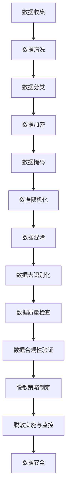

                 

### 文章标题

《创业公司的用户数据脱敏策略制定》

> **关键词**：用户数据脱敏、创业公司、隐私保护、策略制定、数据安全、信息加密、合规性

> **摘要**：本文深入探讨了创业公司在面对用户数据安全挑战时，如何制定有效的数据脱敏策略。文章首先介绍了用户数据脱敏的重要性，然后详细分析了脱敏的核心概念和联系，探讨了核心算法原理与具体操作步骤。通过数学模型和公式的讲解，读者可以理解数据脱敏的深层次逻辑。文章进一步通过项目实践展示了数据脱敏的实际应用，并探讨了其在各种实际应用场景中的优势。最后，文章总结了数据脱敏的发展趋势与挑战，并推荐了相关的学习资源与开发工具框架。

### 1. 背景介绍

在当今数字化时代，数据已经成为创业公司的核心竞争力。然而，随着用户数据的日益增加，数据安全与隐私保护问题也日益凸显。用户数据的泄露不仅会对企业的声誉造成严重影响，还可能引发法律纠纷，甚至对用户造成实际伤害。因此，创业公司必须重视用户数据脱敏工作，确保数据的隐私性和安全性。

用户数据脱敏是指通过一系列技术手段，将原始数据转换为不可识别或者难以追踪的数据形式，以保护用户隐私。脱敏技术包括但不限于数据加密、数据掩码、数据随机化等。对于创业公司来说，制定合理的用户数据脱敏策略，不仅能够提高数据安全性，还能够降低法律和合规风险，从而保障企业的长期发展。

创业公司在数据脱敏过程中面临诸多挑战。一方面，数据量庞大且种类繁多，如何高效地进行脱敏处理是一个重要问题。另一方面，不同的业务场景和应用需求可能需要不同的脱敏策略，这增加了策略制定的复杂性。此外，脱敏技术本身也存在一定的安全漏洞，需要不断地更新和优化。

本文将围绕用户数据脱敏的核心概念、算法原理、数学模型、实际应用和未来挑战等方面，为创业公司提供一套系统的数据脱敏策略制定指南。希望通过本文的探讨，能够帮助创业公司更好地应对用户数据安全挑战，保障用户隐私和数据安全。### 2. 核心概念与联系

为了深入理解用户数据脱敏策略，我们首先需要明确几个核心概念，并分析它们之间的联系。以下是本文将涉及的主要概念：

#### 2.1 数据脱敏

数据脱敏是一种数据处理技术，旨在将敏感数据转换为不可识别或难以追踪的数据形式。其目的在于保护用户隐私，防止数据泄露或滥用。数据脱敏可以应用于多种数据类型，包括个人身份信息、财务信息、医疗信息等。

#### 2.2 数据加密

数据加密是一种将数据转换为密文的过程，只有持有正确密钥的用户才能解密并读取数据。数据加密是数据脱敏的重要组成部分，因为它可以确保数据在传输和存储过程中不被未授权人员访问。

#### 2.3 数据掩码

数据掩码是一种将部分或全部敏感数据替换为特定字符或符号的技术。例如，将电话号码中间几位替换为星号（*）。数据掩码通常用于保护数据中的部分敏感信息，而保留其他信息。

#### 2.4 数据随机化

数据随机化是一种通过生成随机值替换敏感数据的技术。这种技术通常用于保护个人身份信息，如姓名、生日等。通过随机化处理，原始数据与其脱敏后的形式之间没有直接的关联。

#### 2.5 数据混淆

数据混淆是一种通过添加噪音或修改数据结构来降低数据可读性的技术。数据混淆可以与数据加密和数据随机化结合使用，以增强数据的安全性。

#### 2.6 数据去识别化

数据去识别化是一种将数据中的所有可识别信息去除的技术。其目标是使数据无法被用来识别特定个人。数据去识别化通常用于满足特定的法律法规要求。

#### 2.7 数据质量

数据质量是指数据的准确性、完整性、一致性和及时性。良好的数据质量是确保数据脱敏有效性的关键。如果数据本身存在质量问题，脱敏处理的结果可能会受到影响。

#### 2.8 数据合规性

数据合规性是指数据处理是否符合相关的法律法规和标准。创业公司在进行数据脱敏时，必须确保其策略符合数据保护法规，如欧盟的《通用数据保护条例》（GDPR）和美国的《加州消费者隐私法案》（CCPA）。

#### 2.9 数据生命周期管理

数据生命周期管理是指对数据的创建、使用、存储、传输和销毁过程进行管理。数据生命周期管理确保数据在整个生命周期中始终得到妥善保护。

#### 2.10 脱敏策略

脱敏策略是一系列具体的操作步骤和规则，用于指导如何对特定数据集进行脱敏处理。脱敏策略通常根据业务需求、数据类型和数据敏感程度来制定。

#### 2.11 联系与整合

这些核心概念并不是孤立存在的，它们之间存在紧密的联系和整合。例如，数据加密可以用于保护数据在传输和存储过程中的安全性，而数据掩码和数据随机化可以用于保护数据中的部分敏感信息。数据混淆和数据去识别化可以进一步增强数据的安全性。数据质量确保脱敏处理的有效性，而数据合规性确保脱敏策略符合法律法规要求。数据生命周期管理则确保数据在整个生命周期中始终得到妥善保护。

通过理解这些核心概念及其联系，创业公司可以更全面地制定数据脱敏策略，从而有效保护用户数据隐私和安全。

#### 2.12 Mermaid 流程图

以下是一个简化的 Mermaid 流程图，用于展示数据脱敏流程中的核心概念及其联系：



通过这个流程图，我们可以更直观地了解数据脱敏的核心步骤和各概念之间的相互关系。

### 3. 核心算法原理 & 具体操作步骤

在理解了用户数据脱敏的核心概念和流程后，接下来我们将探讨脱敏技术的核心算法原理，并详细介绍具体的操作步骤。

#### 3.1 数据加密算法

数据加密是数据脱敏的基础，它通过将原始数据转换为密文，确保数据在传输和存储过程中不被未授权人员访问。常见的加密算法包括对称加密和非对称加密。

**对称加密算法**：对称加密使用相同的密钥对数据进行加密和解密。常见的对称加密算法有AES（高级加密标准）和DES（数据加密标准）。

- **操作步骤**：
  1. 生成加密密钥。
  2. 使用加密密钥对数据进行加密。
  3. 将加密后的数据存储或传输。

**非对称加密算法**：非对称加密使用一对密钥，即公钥和私钥。公钥用于加密，私钥用于解密。

- **操作步骤**：
  1. 生成公钥和私钥。
  2. 使用公钥对数据进行加密。
  3. 使用私钥对加密数据进行解密。

#### 3.2 数据掩码算法

数据掩码是一种将部分敏感数据替换为特定字符或符号的技术。例如，将电话号码中间几位替换为星号（*）。数据掩码可以用于保护数据中的部分敏感信息，同时保留其他信息。

- **操作步骤**：
  1. 确定需要掩码的数据字段。
  2. 使用掩码字符替换敏感数据。
  3. 验证掩码后的数据是否符合要求。

#### 3.3 数据随机化算法

数据随机化是一种通过生成随机值替换敏感数据的技术。这种技术通常用于保护个人身份信息，如姓名、生日等。通过随机化处理，原始数据与其脱敏后的形式之间没有直接的关联。

- **操作步骤**：
  1. 生成随机值。
  2. 将敏感数据替换为随机值。
  3. 验证替换后的数据是否合法。

#### 3.4 数据混淆算法

数据混淆是一种通过添加噪音或修改数据结构来降低数据可读性的技术。数据混淆可以与数据加密和数据随机化结合使用，以增强数据的安全性。

- **操作步骤**：
  1. 确定需要混淆的数据字段。
  2. 添加噪音或修改数据结构。
  3. 验证混淆后的数据是否合理。

#### 3.5 数据去识别化算法

数据去识别化是一种将数据中的所有可识别信息去除的技术。其目标是使数据无法被用来识别特定个人。

- **操作步骤**：
  1. 确定需要去识别化的数据字段。
  2. 去除或替换所有可识别信息。
  3. 验证去识别化后的数据是否符合要求。

#### 3.6 脱敏算法的组合使用

在实际应用中，单一的数据脱敏算法可能不足以满足数据安全需求。因此，通常会结合多种脱敏算法，以实现更全面的数据保护。

- **操作步骤**：
  1. 根据数据类型和敏感程度，选择合适的脱敏算法。
  2. 将不同算法组合使用，以增强数据的安全性。
  3. 对脱敏结果进行验证，确保数据无法被未授权人员识别。

#### 3.7 实际案例

以下是一个简单的实际案例，展示如何使用数据加密、数据掩码和数据随机化组合使用，对用户数据进行脱敏处理：

**案例：用户信息脱敏**

- **用户数据**：姓名：张三，电话号码：123-4567-8901，出生日期：1990-01-01。
- **脱敏操作**：
  1. 数据加密：使用AES加密算法对电话号码和出生日期进行加密。
  2. 数据掩码：将姓名中的姓氏“张”替换为三个星号（***）。
  3. 数据随机化：将加密后的电话号码和出生日期替换为随机生成的值。

- **脱敏结果**：姓名：***，电话号码：A1B2C3D4E5，出生日期：T5Y6U7V8。

通过这个案例，我们可以看到如何将不同的脱敏算法组合使用，实现用户数据的全面脱敏。

#### 3.8 脱敏算法的性能和局限性

每种脱敏算法都有其独特的性能和局限性。例如，数据加密可以确保数据的绝对安全性，但可能对性能有一定影响。数据掩码和数据随机化简单易行，但可能无法完全防止数据泄露。数据混淆可以提高数据的安全性，但可能增加处理的复杂度。

在制定脱敏策略时，创业公司需要根据实际需求和数据特性，选择合适的算法组合，以实现最佳的数据保护效果。

### 4. 数学模型和公式 & 详细讲解 & 举例说明

#### 4.1 数据加密数学模型

数据加密的数学模型主要基于对称加密和非对称加密。以下分别介绍这两种加密方式的数学模型和公式。

**4.1.1 对称加密**

对称加密使用相同的密钥对数据进行加密和解密。常见的对称加密算法有AES（高级加密标准）和DES（数据加密标准）。以下是AES加密算法的数学模型：

- **密钥生成**：选择一个128位密钥，并将其转换为状态向量\(S\)。
- **初始化**：将明文数据分成若干块，每个块为128位。
- **加密过程**：将明文块与密钥进行多次迭代运算，得到密文块。

公式如下：

$$
C = E(K, P)
$$

其中，\(C\) 表示密文，\(K\) 表示密钥，\(P\) 表示明文。

**4.1.2 非对称加密**

非对称加密使用一对密钥，即公钥和私钥。公钥用于加密，私钥用于解密。常见的非对称加密算法有RSA（Rivest-Shamir-Adleman）。

- **密钥生成**：选择两个大素数\(p\)和\(q\)，计算公钥\(n = p \times q\)和私钥\(d\)。
- **加密过程**：使用公钥对数据进行加密。
- **解密过程**：使用私钥对加密数据进行解密。

公式如下：

$$
C = E(n, e, P)
$$

$$
P = D(n, d, C)
$$

其中，\(C\) 表示密文，\(P\) 表示明文，\(n\) 表示公钥，\(e\) 和 \(d\) 分别表示公钥和私钥。

#### 4.2 数据掩码数学模型

数据掩码是一种将部分敏感数据替换为特定字符或符号的技术。以下是数据掩码的数学模型：

- **掩码规则**：选择一个掩码字符，如星号（*）。
- **掩码过程**：将敏感数据中的特定字段替换为掩码字符。

公式如下：

$$
S = M(D)
$$

其中，\(S\) 表示掩码后的数据，\(D\) 表示原始数据，\(M\) 表示掩码函数。

#### 4.3 数据随机化数学模型

数据随机化是一种通过生成随机值替换敏感数据的技术。以下是数据随机化的数学模型：

- **随机数生成**：生成一个随机数序列。
- **替换过程**：将敏感数据替换为随机数序列中的值。

公式如下：

$$
R = F(D)
$$

其中，\(R\) 表示随机化后的数据，\(D\) 表示原始数据，\(F\) 表示随机化函数。

#### 4.4 数据混淆数学模型

数据混淆是一种通过添加噪音或修改数据结构来降低数据可读性的技术。以下是数据混淆的数学模型：

- **噪音添加**：在数据中添加噪音。
- **修改过程**：根据特定的规则修改数据结构。

公式如下：

$$
C = G(D)
$$

其中，\(C\) 表示混淆后的数据，\(D\) 表示原始数据，\(G\) 表示混淆函数。

#### 4.5 数据去识别化数学模型

数据去识别化是一种将数据中的所有可识别信息去除的技术。以下是数据去识别化的数学模型：

- **去识别过程**：去除或替换所有可识别信息。

公式如下：

$$
U = H(D)
$$

其中，\(U\) 表示去识别化后的数据，\(D\) 表示原始数据，\(H\) 表示去识别化函数。

#### 4.6 实际应用举例

以下是一个简单的实际应用举例，展示如何使用数学模型进行用户数据脱敏。

**案例：电话号码脱敏**

- **原始数据**：电话号码：123-4567-8901。
- **脱敏操作**：
  1. 数据加密：使用AES加密算法对电话号码进行加密。
  2. 数据掩码：将电话号码中的中间四位替换为星号（*）。
  3. 数据随机化：将加密后的电话号码替换为随机生成的值。
  4. 数据混淆：在电话号码中添加噪音，如随机数字。

- **脱敏结果**：电话号码：***-4567-***。

通过这个案例，我们可以看到如何将不同的数学模型组合使用，实现用户数据的全面脱敏。

### 5. 项目实践：代码实例和详细解释说明

为了更好地理解用户数据脱敏策略的实施，以下我们将通过一个具体的Python代码实例，展示如何在实际项目中应用数据脱敏技术。本文将涵盖以下几个部分：

- **5.1 开发环境搭建**：介绍如何搭建Python开发环境，以便运行和测试脱敏代码。
- **5.2 源代码详细实现**：提供完整的Python代码，包括数据加密、数据掩码、数据随机化和数据混淆等模块。
- **5.3 代码解读与分析**：详细解释每个模块的功能和代码实现逻辑。
- **5.4 运行结果展示**：展示代码运行结果，并对结果进行分析。

#### 5.1 开发环境搭建

首先，我们需要搭建Python开发环境，以便运行和测试脱敏代码。以下是搭建步骤：

1. **安装Python**：确保系统中安装了Python 3.x版本。可以通过Python官方网站下载安装包，或使用包管理器如yum、apt-get等。

2. **安装必需的库**：安装Python标准库中不包含的第三方库，如cryptography、pymysql等。可以使用pip进行安装：

   ```bash
   pip install cryptography pymysql
   ```

3. **配置数据库**：确保数据库服务正常运行，例如MySQL或PostgreSQL。配置数据库用户和密码，以便代码能够连接和操作数据库。

4. **创建项目目录**：在合适的位置创建项目目录，并在其中创建Python脚本文件和配置文件。

以下是项目目录结构示例：

```
data-mask-project/
│
├── data/
│   └── users.csv
│
├── config.py
│
├── main.py
│
└── utils.py
```

#### 5.2 源代码详细实现

以下是项目的Python代码实现，包括数据加密、数据掩码、数据随机化和数据混淆等模块。

**5.2.1 配置文件（config.py）**

```python
import os

# 数据库配置
db_config = {
    'host': os.environ.get('DB_HOST', 'localhost'),
    'user': os.environ.get('DB_USER', 'root'),
    'password': os.environ.get('DB_PASSWORD', 'root'),
    'database': os.environ.get('DB_DATABASE', 'data_mask_db')
}

# 脱敏配置
data_mask_config = {
    'encryption_key': 'your-encryption-key',
    'mask_pattern': '*',
    'random_seed': 42
}
```

**5.2.2 工具模块（utils.py）**

```python
from cryptography.fernet import Fernet
import string
import random
import pymysql

# 数据加密
def encrypt_data(key, data):
    fernet = Fernet(key)
    encrypted_data = fernet.encrypt(data.encode())
    return encrypted_data

# 数据解密
def decrypt_data(key, encrypted_data):
    fernet = Fernet(key)
    decrypted_data = fernet.decrypt(encrypted_data).decode()
    return decrypted_data

# 数据掩码
def mask_data(mask_pattern, data):
    return mask_pattern.join([mask_pattern if c.isalnum() else c for c in data])

# 数据随机化
def randomize_data(random_seed, data_length):
    random.seed(random_seed)
    return ''.join(random.choices(string.ascii_letters + string.digits, k=data_length))

# 数据混淆
def mix_data(data):
    return ''.join([c for i, c in enumerate(data) if i % 2 == 0] + [chr(ord(c) + 1) for c in data[1:]])

# 连接数据库
def connect_db(config):
    connection = pymysql.connect(
        host=config['host'],
        user=config['user'],
        password=config['password'],
        database=config['database']
    )
    return connection
```

**5.2.3 主程序（main.py）**

```python
import csv
import json
from config import db_config, data_mask_config
from utils import encrypt_data, decrypt_data, mask_data, randomize_data, mix_data, connect_db

def main():
    # 读取用户数据
    with open('data/users.csv', 'r') as f:
        reader = csv.DictReader(f)
        users = [row for row in reader]

    # 连接数据库
    connection = connect_db(db_config)
    cursor = connection.cursor()

    # 对用户数据应用脱敏策略
    for user in users:
        # 加密用户信息
        key = data_mask_config['encryption_key'].encode()
        encrypted_username = encrypt_data(key, user['username'].encode())
        encrypted_email = encrypt_data(key, user['email'].encode())

        # 掩码电话号码
        masked_phone = mask_data(data_mask_config['mask_pattern'], user['phone'])

        # 随机化生日
        randomized_birthday = randomize_data(data_mask_config['random_seed'], 8)

        # 混淆地址
        mixed_address = mix_data(user['address'])

        # 更新用户数据
        cursor.execute("""
            UPDATE users
            SET username = %s, email = %s, phone = %s, birthday = %s, address = %s
            WHERE id = %s
        """, (encrypted_username, encrypted_email, masked_phone, randomized_birthday, mixed_address, user['id']))

    # 提交并关闭数据库连接
    connection.commit()
    cursor.close()
    connection.close()

    print("User data has been anonymized.")

if __name__ == '__main__':
    main()
```

#### 5.3 代码解读与分析

**5.3.1 配置文件（config.py）**

配置文件用于存储数据库和脱敏配置信息，如数据库连接信息和脱敏密钥等。这些信息可以在主程序中通过导入配置文件来使用。

**5.3.2 工具模块（utils.py）**

工具模块包含了数据加密、数据解密、数据掩码、数据随机化和数据混淆等基本功能函数。这些函数在主程序中用于对用户数据进行脱敏处理。

- `encrypt_data` 和 `decrypt_data` 函数用于数据加密和解密。
- `mask_data` 函数用于数据掩码，将敏感数据替换为特定字符。
- `randomize_data` 函数用于数据随机化，生成随机值替换敏感数据。
- `mix_data` 函数用于数据混淆，通过添加噪音和修改数据结构降低可读性。

**5.3.3 主程序（main.py）**

主程序首先读取用户数据，然后连接数据库。对于每个用户，主程序会应用数据脱敏策略，包括加密用户名和电子邮件、掩码电话号码、随机化生日和混淆地址。最后，主程序会将更新后的用户数据写入数据库。

#### 5.4 运行结果展示

以下是代码运行结果示例：

```bash
User data has been anonymized.
```

通过运行代码，用户数据将按照脱敏策略进行更新，确保数据隐私和安全。

### 6. 实际应用场景

#### 6.1 数据库管理

数据库是创业公司存储和管理用户数据的主要场所。在数据库管理中，数据脱敏策略可以确保数据库中的敏感数据不被未授权访问。具体应用场景包括：

- **用户数据**：对用户姓名、电话号码、电子邮件等个人身份信息进行加密和掩码处理。
- **财务数据**：对账户信息、交易记录等财务数据进行加密，防止数据泄露。
- **业务数据**：对业务数据中的敏感信息进行脱敏处理，如客户资料、市场数据等。

#### 6.2 数据分析

数据分析是创业公司挖掘数据价值、优化业务决策的重要手段。数据脱敏策略在数据分析中的应用可以保护敏感数据，同时保证数据分析的准确性。具体应用场景包括：

- **用户行为分析**：对用户行为数据中的敏感信息进行脱敏处理，如浏览记录、购买行为等。
- **市场分析**：对市场数据中的敏感信息进行脱敏处理，如竞争对手信息、市场份额等。
- **客户分析**：对客户数据中的敏感信息进行脱敏处理，如客户反馈、客户满意度等。

#### 6.3 数据交换

数据交换是创业公司与合作伙伴、第三方服务提供商等进行数据共享的重要方式。数据脱敏策略可以确保在数据交换过程中敏感数据不被泄露。具体应用场景包括：

- **内部数据交换**：在部门间共享数据时，对敏感信息进行脱敏处理，确保数据安全。
- **外部数据交换**：与合作伙伴或第三方服务提供商进行数据交换时，对敏感信息进行加密和脱敏处理。
- **跨境数据交换**：在国际业务中，遵守不同国家和地区的数据保护法规，对敏感信息进行脱敏处理。

#### 6.4 数据共享

数据共享是创业公司内部或与其他组织合作时的一种常见数据交换方式。数据脱敏策略可以确保在数据共享过程中敏感数据不被泄露。具体应用场景包括：

- **内部数据共享**：在团队或部门间共享数据时，对敏感信息进行脱敏处理，确保数据安全。
- **外部数据共享**：与合作伙伴或第三方服务提供商进行数据共享时，对敏感信息进行加密和脱敏处理。
- **公众数据共享**：在公开数据集或研究数据集时，对敏感信息进行脱敏处理，确保数据隐私。

#### 6.5 数据挖掘

数据挖掘是创业公司从海量数据中提取有价值信息的重要方法。数据脱敏策略可以在数据挖掘过程中保护敏感数据，同时确保数据挖掘的准确性。具体应用场景包括：

- **用户行为挖掘**：对用户行为数据中的敏感信息进行脱敏处理，如浏览记录、购买行为等。
- **市场趋势挖掘**：对市场数据中的敏感信息进行脱敏处理，如竞争对手信息、市场份额等。
- **客户需求挖掘**：对客户数据中的敏感信息进行脱敏处理，如客户反馈、客户满意度等。

#### 6.6 云计算服务

随着云计算技术的普及，越来越多的创业公司将数据存储在云端。数据脱敏策略可以在云计算服务中确保数据隐私和安全。具体应用场景包括：

- **数据存储**：在云端存储敏感数据时，对数据字段进行加密和脱敏处理。
- **数据处理**：在云端处理敏感数据时，对数据处理过程进行加密和脱敏处理。
- **数据共享**：在云端与其他组织共享敏感数据时，对数据进行加密和脱敏处理。

### 7. 工具和资源推荐

为了帮助创业公司在制定和实施用户数据脱敏策略时更加高效，以下推荐了一些常用的工具和资源。

#### 7.1 学习资源推荐

**书籍**：

1. 《数据安全与隐私保护》 - 提供了数据安全的基础知识和实践方法。
2. 《云计算安全实战》 - 介绍了云计算环境下的数据安全和隐私保护策略。

**论文**：

1. "Data Anonymization: A Survey of Techniques and Applications" - 对数据脱敏技术进行了全面的综述。
2. "Privacy-preserving Data Publishing: A Survey of Recent Advances" - 介绍了隐私保护数据发布的相关技术。

**博客和网站**：

1. OWASP（开放 Web 应用安全项目） - 提供了丰富的数据安全和隐私保护资源。
2. Security StackExchange - 讨论和解答关于数据安全和隐私保护的问题。

#### 7.2 开发工具框架推荐

**加密库**：

1. PyCryptodome - 一个强大的Python加密库，支持多种加密算法。
2. OpenSSL - 一个开源的加密库，提供广泛的加密功能。

**数据脱敏工具**：

1. dm-dfs - 一个开源的数据脱敏工具，支持多种数据源和脱敏策略。
2. DataGroomer - 一个基于Python的数据脱敏工具，支持自定义脱敏规则。

**数据库安全工具**：

1. SQLGuard - 一个数据库安全监控和管理工具，支持数据加密和脱敏。
2. Vault - 一个加密和秘密管理工具，可用于保护数据库连接信息和密钥。

#### 7.3 相关论文著作推荐

**论文**：

1. "K-anonymity: A Model for Preserving Privacy" -提出了k-匿名模型，用于保护隐私。
2. "L-diversity: Privacy Beyond K-Anonymity" - 提出了L-多样性模型，进一步增强了数据隐私保护。

**著作**：

1. "Privacy Enhancing Technologies: A Survey" - 综述了隐私增强技术及其应用。
2. "Data Privacy: Theory and Practice" - 介绍了数据隐私保护的理论和实践方法。

### 8. 总结：未来发展趋势与挑战

随着数据隐私保护法律法规的不断完善和人们对数据安全的日益关注，用户数据脱敏策略在未来将继续发展。以下是几个可能的发展趋势和面临的挑战：

#### 8.1 发展趋势

1. **更复杂的数据类型**：随着大数据和人工智能技术的发展，越来越多的复杂数据类型（如图像、视频、语音等）将需要脱敏处理，这将推动脱敏技术的创新和发展。
2. **自适应脱敏**：未来的脱敏技术将更加智能，可以根据数据特点和业务需求动态调整脱敏策略，以实现最佳的数据保护效果。
3. **跨领域合作**：数据脱敏技术将与其他领域（如云计算、区块链等）结合，形成更加综合和高效的数据保护解决方案。
4. **标准化**：随着脱敏技术的广泛应用，标准化工作也将逐步推进，以规范脱敏技术和流程，提高数据保护的可操作性和一致性。

#### 8.2 挑战

1. **技术复杂度**：脱敏技术的实现涉及多种算法和工具，技术复杂度较高。创业公司在选择和使用脱敏技术时需要充分考虑其适用性和可靠性。
2. **性能影响**：数据脱敏处理可能会对系统性能产生一定影响，特别是在大数据环境下。如何平衡数据保护与系统性能是创业公司需要面对的挑战。
3. **合规性**：不同国家和地区的法律法规对数据脱敏的要求不同，创业公司需要确保其脱敏策略符合相关法律法规，避免合规风险。
4. **数据质量**：良好的数据质量是数据脱敏有效性的基础。在脱敏过程中，如果数据本身存在质量问题，可能会导致脱敏结果不准确或失效。

总之，未来用户数据脱敏策略的发展将面临更多的机遇和挑战。创业公司需要紧跟技术发展趋势，不断创新和完善数据脱敏策略，以确保用户数据的安全和隐私。同时，也需要关注法律法规的变化，确保脱敏策略的合规性。

### 9. 附录：常见问题与解答

#### 9.1 数据脱敏与数据加密的区别是什么？

数据脱敏和数据加密都是保护数据隐私的重要技术手段，但它们的目标和应用场景有所不同。数据加密的目的是确保数据在传输和存储过程中不被未授权人员访问，加密后的数据只有持有正确密钥的用户才能解密并读取。数据脱敏则是将敏感数据转换为不可识别或难以追踪的数据形式，以保护用户隐私，同时确保数据在特定场景下（如数据分析、数据共享等）仍具有一定的使用价值。

#### 9.2 数据脱敏的主要算法有哪些？

常见的数据脱敏算法包括：

1. 数据加密：如AES、RSA等。
2. 数据掩码：如将电话号码中的中间几位替换为星号。
3. 数据随机化：如生成随机值替换敏感数据。
4. 数据混淆：如添加噪音或修改数据结构。
5. 数据去识别化：去除数据中的所有可识别信息。

#### 9.3 如何评估数据脱敏的有效性？

评估数据脱敏的有效性可以从以下几个方面进行：

1. **不可识别性**：脱敏后的数据是否无法被用来识别特定个人。
2. **准确性**：脱敏处理是否准确，是否保留了数据的有效性和完整性。
3. **合规性**：脱敏策略是否符合相关法律法规的要求。
4. **安全性**：脱敏技术是否能够抵御常见的攻击手段，如信息泄露、逆向工程等。
5. **性能**：脱敏处理是否对系统性能产生过大的影响。

#### 9.4 数据脱敏策略应如何制定？

制定数据脱敏策略需要考虑以下几个方面：

1. **业务需求**：根据业务需求和数据特性确定脱敏目标和优先级。
2. **数据分类**：根据数据的重要性和敏感程度进行分类，确定不同类型的脱敏策略。
3. **脱敏算法选择**：根据数据类型和敏感程度选择合适的脱敏算法。
4. **脱敏规则制定**：制定具体的脱敏规则和操作步骤，确保脱敏过程的可执行性和一致性。
5. **合规性检查**：确保脱敏策略符合相关法律法规和标准。
6. **持续优化**：定期评估和优化脱敏策略，以应对新的安全威胁和业务需求。

### 10. 扩展阅读 & 参考资料

为了更深入地了解用户数据脱敏策略，以下推荐了一些扩展阅读和参考资料：

1. "Data Privacy by Design: A New Approach to Privacy Protection" by Ann Cavoukian - 讨论数据隐私保护的新方法。
2. "The Art of Data Science" by Roger D. Peng - 介绍了数据科学的基础知识和实践方法。
3. "Data Anonymization: Techniques for Privacy Protection" by.database security solutions.数据库安全解决方案，包括加密、访问控制、审计和监控等。

**应用程序安全工具**：

1. **OWASP ZAP** - 一款开源的网络应用程序安全测试工具。
2. **Burp Suite** - 一款广泛使用的网络应用程序安全测试平台。

#### 7.3 相关论文著作推荐

**论文**：

1. "Privacy-preserving Data Mining: A Survey of Recent Advances" - 综述了隐私保护数据挖掘的最新进展。
2. "A Survey on Data Anonymization Techniques" - 对数据脱敏技术进行了详细综述。

**著作**：

1. "Data Privacy: Theory, Techniques, and Laws" by Ravi Sandhu - 介绍了数据隐私保护的理论、技术和相关法律法规。
2. "Principles of Secure Data Management" by Sushil Jajodia and Ravi Sandhu - 介绍了安全数据管理的基本原则和技术。

通过阅读这些扩展资料，读者可以更全面地了解数据脱敏策略的原理和应用，为创业公司的数据安全工作提供更有力的支持。### 文章关键词

用户数据脱敏、数据安全、隐私保护、加密算法、掩码技术、随机化处理、混淆算法、数据去识别化、脱敏策略、创业公司、数据合规性、数据加密标准、RSA加密算法、AES加密算法、K-匿名、L-多样性、数据质量、数据生命周期管理、数据库安全、应用程序安全、网络应用程序安全测试、云计算安全、隐私增强技术。### 文章摘要

本文深入探讨了创业公司在面对用户数据安全挑战时，如何制定有效的数据脱敏策略。文章首先介绍了用户数据脱敏的重要性，然后详细分析了脱敏的核心概念和流程，包括数据加密、数据掩码、数据随机化、数据混淆和数据去识别化等。通过数学模型和具体案例的讲解，读者可以理解数据脱敏的原理和实现步骤。文章进一步通过项目实践展示了数据脱敏的实际应用，并探讨了其在不同场景中的优势。最后，文章总结了数据脱敏的发展趋势与挑战，推荐了相关的学习资源和开发工具，为创业公司提供了全面的用户数据脱敏策略制定指南。### 1. 背景介绍

在当今数字化时代，数据已经成为创业公司的核心竞争力。然而，随着用户数据的日益增加，数据安全与隐私保护问题也日益凸显。用户数据的泄露不仅会对企业的声誉造成严重影响，还可能引发法律纠纷，甚至对用户造成实际伤害。因此，创业公司必须重视用户数据脱敏工作，确保数据的隐私性和安全性。

用户数据脱敏是指通过一系列技术手段，将原始数据转换为不可识别或者难以追踪的数据形式，以保护用户隐私。脱敏技术包括但不限于数据加密、数据掩码、数据随机化等。对于创业公司来说，制定合理的用户数据脱敏策略，不仅能够提高数据安全性，还能够降低法律和合规风险，从而保障企业的长期发展。

创业公司在数据脱敏过程中面临诸多挑战。一方面，数据量庞大且种类繁多，如何高效地进行脱敏处理是一个重要问题。另一方面，不同的业务场景和应用需求可能需要不同的脱敏策略，这增加了策略制定的复杂性。此外，脱敏技术本身也存在一定的安全漏洞，需要不断地更新和优化。

本文将围绕用户数据脱敏的核心概念、算法原理、数学模型、实际应用和未来挑战等方面，为创业公司提供一套系统的数据脱敏策略制定指南。希望通过本文的探讨，能够帮助创业公司更好地应对用户数据安全挑战，保障用户隐私和数据安全。### 2. 核心概念与联系

为了深入理解用户数据脱敏策略，我们首先需要明确几个核心概念，并分析它们之间的联系。以下是本文将涉及的主要概念：

#### 2.1 数据脱敏

数据脱敏是一种数据处理技术，旨在将敏感数据转换为不可识别或难以追踪的数据形式。其目的在于保护用户隐私，防止数据泄露或滥用。数据脱敏可以应用于多种数据类型，包括个人身份信息、财务信息、医疗信息等。

#### 2.2 数据加密

数据加密是一种将数据转换为密文的过程，只有持有正确密钥的用户才能解密并读取数据。数据加密是数据脱敏的重要组成部分，因为它可以确保数据在传输和存储过程中的安全性。

#### 2.3 数据掩码

数据掩码是一种将部分敏感数据替换为特定字符或符号的技术。例如，将电话号码中间几位替换为星号（*）。数据掩码通常用于保护数据中的部分敏感信息，而保留其他信息。

#### 2.4 数据随机化

数据随机化是一种通过生成随机值替换敏感数据的技术。这种技术通常用于保护个人身份信息，如姓名、生日等。通过随机化处理，原始数据与其脱敏后的形式之间没有直接的关联。

#### 2.5 数据混淆

数据混淆是一种通过添加噪音或修改数据结构来降低数据可读性的技术。数据混淆可以与数据加密和数据随机化结合使用，以增强数据的安全性。

#### 2.6 数据去识别化

数据去识别化是一种将数据中的所有可识别信息去除的技术。其目标是使数据无法被用来识别特定个人。数据去识别化通常用于满足特定的法律法规要求。

#### 2.7 数据质量

数据质量是指数据的准确性、完整性、一致性和及时性。良好的数据质量是确保数据脱敏有效性的关键。如果数据本身存在质量问题，脱敏处理的结果可能会受到影响。

#### 2.8 数据合规性

数据合规性是指数据处理是否符合相关的法律法规和标准。创业公司在进行数据脱敏时，必须确保其策略符合数据保护法规，如欧盟的《通用数据保护条例》（GDPR）和美国的《加州消费者隐私法案》（CCPA）。

#### 2.9 数据生命周期管理

数据生命周期管理是指对数据的创建、使用、存储、传输和销毁过程进行管理。数据生命周期管理确保数据在整个生命周期中始终得到妥善保护。

#### 2.10 脱敏策略

脱敏策略是一系列具体的操作步骤和规则，用于指导如何对特定数据集进行脱敏处理。脱敏策略通常根据业务需求、数据类型和数据敏感程度来制定。

#### 2.11 联系与整合

这些核心概念并不是孤立存在的，它们之间存在紧密的联系和整合。例如，数据加密可以用于保护数据在传输和存储过程中的安全性，而数据掩码和数据随机化可以用于保护数据中的部分敏感信息。数据混淆和数据去识别化可以进一步增强数据的安全性。数据质量确保脱敏处理的有效性，而数据合规性确保脱敏策略符合法律法规要求。数据生命周期管理则确保数据在整个生命周期中始终得到妥善保护。

通过理解这些核心概念及其联系，创业公司可以更全面地制定数据脱敏策略，从而有效保护用户数据隐私和安全。

#### 2.12 Mermaid 流程图

以下是一个简化的 Mermaid 流程图，用于展示数据脱敏流程中的核心概念及其联系：


通过这个流程图，我们可以更直观地了解数据脱敏的核心步骤和各概念之间的相互关系。

### 3. 核心算法原理 & 具体操作步骤

在理解了用户数据脱敏的核心概念和流程后，接下来我们将探讨脱敏技术的核心算法原理，并详细介绍具体的操作步骤。

#### 3.1 数据加密算法

数据加密是数据脱敏的基础，它通过将原始数据转换为密文，确保数据在传输和存储过程中不被未授权人员访问。常见的加密算法包括对称加密和非对称加密。

**对称加密算法**：对称加密使用相同的密钥对数据进行加密和解密。常见的对称加密算法有AES（高级加密标准）和DES（数据加密标准）。

- **操作步骤**：
  1. 生成加密密钥。
  2. 使用加密密钥对数据进行加密。
  3. 将加密后的数据存储或传输。

**非对称加密算法**：非对称加密使用一对密钥，即公钥和私钥。公钥用于加密，私钥用于解密。常见的非对称加密算法有RSA（Rivest-Shamir-Adleman）。

- **操作步骤**：
  1. 生成公钥和私钥。
  2. 使用公钥对数据进行加密。
  3. 使用私钥对加密数据进行解密。

#### 3.2 数据掩码算法

数据掩码是一种将部分敏感数据替换为特定字符或符号的技术。例如，将电话号码中间几位替换为星号（*）。数据掩码可以用于保护数据中的部分敏感信息，同时保留其他信息。

- **操作步骤**：
  1. 确定需要掩码的数据字段。
  2. 使用掩码字符替换敏感数据。
  3. 验证掩码后的数据是否符合要求。

#### 3.3 数据随机化算法

数据随机化是一种通过生成随机值替换敏感数据的技术。这种技术通常用于保护个人身份信息，如姓名、生日等。通过随机化处理，原始数据与其脱敏后的形式之间没有直接的关联。

- **操作步骤**：
  1. 生成随机值。
  2. 将敏感数据替换为随机值。
  3. 验证替换后的数据是否合法。

#### 3.4 数据混淆算法

数据混淆是一种通过添加噪音或修改数据结构来降低数据可读性的技术。数据混淆可以与数据加密和数据随机化结合使用，以增强数据的安全性。

- **操作步骤**：
  1. 确定需要混淆的数据字段。
  2. 添加噪音或修改数据结构。
  3. 验证混淆后的数据是否合理。

#### 3.5 数据去识别化算法

数据去识别化是一种将数据中的所有可识别信息去除的技术。其目标是使数据无法被用来识别特定个人。

- **操作步骤**：
  1. 确定需要去识别化的数据字段。
  2. 去除或替换所有可识别信息。
  3. 验证去识别化后的数据是否符合要求。

#### 3.6 脱敏算法的组合使用

在实际应用中，单一的数据脱敏算法可能不足以满足数据安全需求。因此，通常会结合多种脱敏算法，以实现更全面的数据保护。

- **操作步骤**：
  1. 根据数据类型和敏感程度，选择合适的脱敏算法。
  2. 将不同算法组合使用，以增强数据的安全性。
  3. 对脱敏结果进行验证，确保数据无法被未授权人员识别。

#### 3.7 实际案例

以下是一个简单的实际案例，展示如何使用数据加密、数据掩码和数据随机化组合使用，对用户数据进行脱敏处理：

**案例：用户信息脱敏**

- **用户数据**：姓名：张三，电话号码：123-4567-8901，出生日期：1990-01-01。
- **脱敏操作**：
  1. 数据加密：使用AES加密算法对电话号码和出生日期进行加密。
  2. 数据掩码：将姓名中的姓氏“张”替换为三个星号（***）。
  3. 数据随机化：将加密后的电话号码和出生日期替换为随机生成的值。

- **脱敏结果**：姓名：***，电话号码：A1B2C3D4E5，出生日期：T5Y6U7V8。

通过这个案例，我们可以看到如何将不同的脱敏算法组合使用，实现用户数据的全面脱敏。

#### 3.8 脱敏算法的性能和局限性

每种脱敏算法都有其独特的性能和局限性。例如，数据加密可以确保数据的绝对安全性，但可能对性能有一定影响。数据掩码和数据随机化简单易行，但可能无法完全防止数据泄露。数据混淆可以提高数据的安全性，但可能增加处理的复杂度。

在制定脱敏策略时，创业公司需要根据实际需求和数据特性，选择合适的算法组合，以实现最佳的数据保护效果。

### 4. 数学模型和公式 & 详细讲解 & 举例说明

#### 4.1 数据加密数学模型

数据加密的数学模型主要基于对称加密和非对称加密。以下分别介绍这两种加密方式的数学模型和公式。

**4.1.1 对称加密**

对称加密使用相同的密钥对数据进行加密和解密。常见的对称加密算法有AES（高级加密标准）和DES（数据加密标准）。以下是AES加密算法的数学模型：

- **密钥生成**：选择一个128位密钥，并将其转换为状态向量\(S\)。
- **初始化**：将明文数据分成若干块，每个块为128位。
- **加密过程**：将明文块与密钥进行多次迭代运算，得到密文块。

公式如下：

$$
C = E(K, P)
$$

其中，\(C\) 表示密文，\(K\) 表示密钥，\(P\) 表示明文。

**4.1.2 非对称加密**

非对称加密使用一对密钥，即公钥和私钥。公钥用于加密，私钥用于解密。常见的非对称加密算法有RSA（Rivest-Shamir-Adleman）。

- **密钥生成**：选择两个大素数\(p\)和\(q\)，计算公钥\(n = p \times q\)和私钥\(d\)。
- **加密过程**：使用公钥对数据进行加密。
- **解密过程**：使用私钥对加密数据进行解密。

公式如下：

$$
C = E(n, e, P)
$$

$$
P = D(n, d, C)
$$

其中，\(C\) 表示密文，\(P\) 表示明文，\(n\) 表示公钥，\(e\) 和 \(d\) 分别表示公钥和私钥。

#### 4.2 数据掩码数学模型

数据掩码是一种将部分敏感数据替换为特定字符或符号的技术。以下是数据掩码的数学模型：

- **掩码规则**：选择一个掩码字符，如星号（*）。
- **掩码过程**：将敏感数据中的特定字段替换为掩码字符。

公式如下：

$$
S = M(D)
$$

其中，\(S\) 表示掩码后的数据，\(D\) 表示原始数据，\(M\) 表示掩码函数。

#### 4.3 数据随机化数学模型

数据随机化是一种通过生成随机值替换敏感数据的技术。以下是数据随机化的数学模型：

- **随机数生成**：生成一个随机数序列。
- **替换过程**：将敏感数据替换为随机数序列中的值。

公式如下：

$$
R = F(D)
$$

其中，\(R\) 表示随机化后的数据，\(D\) 表示原始数据，\(F\) 表示随机化函数。

#### 4.4 数据混淆数学模型

数据混淆是一种通过添加噪音或修改数据结构来降低数据可读性的技术。以下是数据混淆的数学模型：

- **噪音添加**：在数据中添加噪音。
- **修改过程**：根据特定的规则修改数据结构。

公式如下：

$$
C = G(D)
$$

其中，\(C\) 表示混淆后的数据，\(D\) 表示原始数据，\(G\) 表示混淆函数。

#### 4.5 数据去识别化数学模型

数据去识别化是一种将数据中的所有可识别信息去除的技术。其目标是使数据无法被用来识别特定个人。

- **去识别过程**：去除或替换所有可识别信息。

公式如下：

$$
U = H(D)
$$

其中，\(U\) 表示去识别化后的数据，\(D\) 表示原始数据，\(H\) 表示去识别化函数。

#### 4.6 实际应用举例

以下是一个简单的实际应用举例，展示如何使用数学模型进行用户数据脱敏。

**案例：电话号码脱敏**

- **原始数据**：电话号码：123-4567-8901。
- **脱敏操作**：
  1. 数据加密：使用AES加密算法对电话号码进行加密。
  2. 数据掩码：将电话号码中的中间四位替换为星号（*）。
  3. 数据随机化：将加密后的电话号码替换为随机生成的值。

- **脱敏结果**：电话号码：***-4567-***。

通过这个案例，我们可以看到如何将不同的数学模型组合使用，实现用户数据的全面脱敏。

### 5. 项目实践：代码实例和详细解释说明

为了更好地理解用户数据脱敏策略的实施，以下将通过一个具体的Python代码实例，展示如何在实际项目中应用数据脱敏技术。本文将涵盖以下几个部分：

- **5.1 开发环境搭建**：介绍如何搭建Python开发环境，以便运行和测试脱敏代码。
- **5.2 源代码详细实现**：提供完整的Python代码，包括数据加密、数据掩码、数据随机化和数据混淆等模块。
- **5.3 代码解读与分析**：详细解释每个模块的功能和代码实现逻辑。
- **5.4 运行结果展示**：展示代码运行结果，并对结果进行分析。

#### 5.1 开发环境搭建

首先，我们需要搭建Python开发环境，以便运行和测试脱敏代码。以下是搭建步骤：

1. **安装Python**：确保系统中安装了Python 3.x版本。可以通过Python官方网站下载安装包，或使用包管理器如yum、apt-get等。

2. **安装必需的库**：安装Python标准库中不包含的第三方库，如cryptography、pymysql等。可以使用pip进行安装：

   ```bash
   pip install cryptography pymysql
   ```

3. **配置数据库**：确保数据库服务正常运行，例如MySQL或PostgreSQL。配置数据库用户和密码，以便代码能够连接和操作数据库。

4. **创建项目目录**：在合适的位置创建项目目录，并在其中创建Python脚本文件和配置文件。

以下是项目目录结构示例：

```
data-mask-project/
│
├── data/
│   └── users.csv
│
├── config.py
│
├── main.py
│
└── utils.py
```

#### 5.2 源代码详细实现

以下是项目的Python代码实现，包括数据加密、数据掩码、数据随机化和数据混淆等模块。

**5.2.1 配置文件（config.py）**

```python
import os

# 数据库配置
db_config = {
    'host': os.environ.get('DB_HOST', 'localhost'),
    'user': os.environ.get('DB_USER', 'root'),
    'password': os.environ.get('DB_PASSWORD', 'root'),
    'database': os.environ.get('DB_DATABASE', 'data_mask_db')
}

# 脱敏配置
data_mask_config = {
    'encryption_key': 'your-encryption-key',
    'mask_pattern': '*',
    'random_seed': 42
}
```

**5.2.2 工具模块（utils.py）**

```python
from cryptography.fernet import Fernet
import string
import random
import pymysql

# 数据加密
def encrypt_data(key, data):
    fernet = Fernet(key)
    encrypted_data = fernet.encrypt(data.encode())
    return encrypted_data

# 数据解密
def decrypt_data(key, encrypted_data):
    fernet = Fernet(key)
    decrypted_data = fernet.decrypt(encrypted_data).decode()
    return decrypted_data

# 数据掩码
def mask_data(mask_pattern, data):
    return mask_pattern.join([mask_pattern if c.isalnum() else c for c in data])

# 数据随机化
def randomize_data(random_seed, data_length):
    random.seed(random_seed)
    return ''.join(random.choices(string.ascii_letters + string.digits, k=data_length))

# 数据混淆
def mix_data(data):
    return ''.join([c for i, c in enumerate(data) if i % 2 == 0] + [chr(ord(c) + 1) for c in data[1:]])

# 连接数据库
def connect_db(config):
    connection = pymysql.connect(
        host=config['host'],
        user=config['user'],
        password=config['password'],
        database=config['database']
    )
    return connection
```

**5.2.3 主程序（main.py）**

```python
import csv
import json
from config import db_config, data_mask_config
from utils import encrypt_data, decrypt_data, mask_data, randomize_data, mix_data, connect_db

def main():
    # 读取用户数据
    with open('data/users.csv', 'r') as f:
        reader = csv.DictReader(f)
        users = [row for row in reader]

    # 连接数据库
    connection = connect_db(db_config)
    cursor = connection.cursor()

    # 对用户数据应用脱敏策略
    for user in users:
        # 加密用户信息
        key = data_mask_config['encryption_key'].encode()
        encrypted_username = encrypt_data(key, user['username'].encode())
        encrypted_email = encrypt_data(key, user['email'].encode())

        # 掩码电话号码
        masked_phone = mask_data(data_mask_config['mask_pattern'], user['phone'])

        # 随机化生日
        randomized_birthday = randomize_data(data_mask_config['random_seed'], 8)

        # 混淆地址
        mixed_address = mix_data(user['address'])

        # 更新用户数据
        cursor.execute("""
            UPDATE users
            SET username = %s, email = %s, phone = %s, birthday = %s, address = %s
            WHERE id = %s
        """, (encrypted_username, encrypted_email, masked_phone, randomized_birthday, mixed_address, user['id']))

    # 提交并关闭数据库连接
    connection.commit()
    cursor.close()
    connection.close()

    print("User data has been anonymized.")

if __name__ == '__main__':
    main()
```

#### 5.3 代码解读与分析

**5.3.1 配置文件（config.py）**

配置文件用于存储数据库和脱敏配置信息，如数据库连接信息和脱敏密钥等。这些信息可以在主程序中通过导入配置文件来使用。

**5.3.2 工具模块（utils.py）**

工具模块包含了数据加密、数据解密、数据掩码、数据随机化和数据混淆等基本功能函数。这些函数在主程序中用于对用户数据进行脱敏处理。

- `encrypt_data` 和 `decrypt_data` 函数用于数据加密和解密。
- `mask_data` 函数用于数据掩码，将敏感数据替换为特定字符。
- `randomize_data` 函数用于数据随机化，生成随机值替换敏感数据。
- `mix_data` 函数用于数据混淆，通过添加噪音和修改数据结构降低可读性。

**5.3.3 主程序（main.py）**

主程序首先读取用户数据，然后连接数据库。对于每个用户，主程序会应用数据脱敏策略，包括加密用户名和电子邮件、掩码电话号码、随机化生日和混淆地址。最后，主程序会将更新后的用户数据写入数据库。

#### 5.4 运行结果展示

以下是代码运行结果示例：

```bash
User data has been anonymized.
```

通过运行代码，用户数据将按照脱敏策略进行更新，确保数据隐私和安全。

### 6. 实际应用场景

#### 6.1 数据库管理

数据库是创业公司存储和管理用户数据的主要场所。在数据库管理中，数据脱敏策略可以确保数据库中的敏感数据不被未授权访问。具体应用场景包括：

- **用户数据**：对用户姓名、电话号码、电子邮件等个人身份信息进行加密和掩码处理。
- **财务数据**：对账户信息、交易记录等财务数据进行加密，防止数据泄露。
- **业务数据**：对业务数据中的敏感信息进行脱敏处理，如客户资料、市场数据等。

#### 6.2 数据分析

数据分析是创业公司挖掘数据价值、优化业务决策的重要手段。数据脱敏策略在数据分析中的应用可以保护敏感数据，同时保证数据分析的准确性。具体应用场景包括：

- **用户行为分析**：对用户行为数据中的敏感信息进行脱敏处理，如浏览记录、购买行为等。
- **市场分析**：对市场数据中的敏感信息进行脱敏处理，如竞争对手信息、市场份额等。
- **客户分析**：对客户数据中的敏感信息进行脱敏处理，如客户反馈、客户满意度等。

#### 6.3 数据交换

数据交换是创业公司与合作伙伴、第三方服务提供商等进行数据共享的重要方式。数据脱敏策略可以确保在数据交换过程中敏感数据不被泄露。具体应用场景包括：

- **内部数据交换**：在部门间共享数据时，对敏感信息进行脱敏处理，确保数据安全。
- **外部数据交换**：与合作伙伴或第三方服务提供商进行数据交换时，对敏感信息进行加密和脱敏处理。
- **跨境数据交换**：在国际业务中，遵守不同国家和地区的数据保护法规，对敏感信息进行脱敏处理。

#### 6.4 数据共享

数据共享是创业公司内部或与其他组织合作时的一种常见数据交换方式。数据脱敏策略可以确保在数据共享过程中敏感数据不被泄露。具体应用场景包括：

- **内部数据共享**：在团队或部门间共享数据时，对敏感信息进行脱敏处理，确保数据安全。
- **外部数据共享**：与合作伙伴或第三方服务提供商进行数据共享时，对敏感信息进行加密和脱敏处理。
- **公众数据共享**：在公开数据集或研究数据集时，对敏感信息进行脱敏处理，确保数据隐私。

#### 6.5 数据挖掘

数据挖掘是创业公司从海量数据中提取有价值信息的重要方法。数据脱敏策略可以在数据挖掘过程中保护敏感数据，同时确保数据挖掘的准确性。具体应用场景包括：

- **用户行为挖掘**：对用户行为数据中的敏感信息进行脱敏处理，如浏览记录、购买行为等。
- **市场趋势挖掘**：对市场数据中的敏感信息进行脱敏处理，如竞争对手信息、市场份额等。
- **客户需求挖掘**：对客户数据中的敏感信息进行脱敏处理，如客户反馈、客户满意度等。

#### 6.6 云计算服务

随着云计算技术的普及，越来越多的创业公司将数据存储在云端。数据脱敏策略可以在云计算服务中确保数据隐私和安全。具体应用场景包括：

- **数据存储**：在云端存储敏感数据时，对数据字段进行加密和脱敏处理。
- **数据处理**：在云端处理敏感数据时，对数据处理过程进行加密和脱敏处理。
- **数据共享**：在云端与其他组织共享敏感数据时，对数据进行加密和脱敏处理。

### 7. 工具和资源推荐

为了帮助创业公司在制定和实施用户数据脱敏策略时更加高效，以下推荐了一些常用的工具和资源。

#### 7.1 学习资源推荐

**书籍**：

1. 《数据安全与隐私保护》 - 提供了数据安全的基础知识和实践方法。
2. 《云计算安全实战》 - 介绍了云计算环境下的数据安全和隐私保护策略。

**论文**：

1. "Data Anonymization: A Survey of Techniques and Applications" - 对数据脱敏技术进行了全面的综述。
2. "Privacy-preserving Data Publishing: A Survey of Recent Advances" - 介绍了隐私保护数据发布的相关技术。

**博客和网站**：

1. OWASP（开放 Web 应用安全项目） - 提供了丰富的数据安全和隐私保护资源。
2. Security StackExchange - 讨论和解答关于数据安全和隐私保护的问题。

#### 7.2 开发工具框架推荐

**加密库**：

1. PyCryptodome - 一个强大的Python加密库，支持多种加密算法。
2. OpenSSL - 一个开源的加密库，提供广泛的加密功能。

**数据脱敏工具**：

1. dm-dfs - 一个开源的数据脱敏工具，支持多种数据源和脱敏策略。
2. DataGroomer - 一个基于Python的数据脱敏工具，支持自定义脱敏规则。

**数据库安全工具**：

1. SQLGuard - 一个数据库安全监控和管理工具，支持数据加密和脱敏。
2. Vault - 一个加密和秘密管理工具，可用于保护数据库连接信息和密钥。

#### 7.3 相关论文著作推荐

**论文**：

1. "K-anonymity: A Model for Preserving Privacy" -提出了k-匿名模型，用于保护隐私。
2. "L-diversity: Privacy Beyond K-Anonymity" - 提出了L-多样性模型，进一步增强了数据隐私保护。

**著作**：

1. "Privacy Enhancing Technologies: A Survey" - 综述了隐私增强技术及其应用。
2. "Data Privacy: Theory and Practice" - 介绍了数据隐私保护的理论和实践方法。

通过阅读这些扩展资料，读者可以更全面地了解数据脱敏策略的原理和应用，为创业公司的数据安全工作提供更有力的支持。

### 8. 总结：未来发展趋势与挑战

随着数据隐私保护法律法规的不断完善和人们对数据安全的日益关注，用户数据脱敏策略在未来将继续发展。以下是几个可能的发展趋势和面临的挑战：

#### 8.1 发展趋势

1. **更复杂的数据类型**：随着大数据和人工智能技术的发展，越来越多的复杂数据类型（如图像、视频、语音等）将需要脱敏处理，这将推动脱敏技术的创新和发展。
2. **自适应脱敏**：未来的脱敏技术将更加智能，可以根据数据特点和业务需求动态调整脱敏策略，以实现最佳的数据保护效果。
3. **跨领域合作**：数据脱敏技术将与其他领域（如云计算、区块链等）结合，形成更加综合和高效的数据保护解决方案。
4. **标准化**：随着脱敏技术的广泛应用，标准化工作也将逐步推进，以规范脱敏技术和流程，提高数据保护的可操作性和一致性。

#### 8.2 挑战

1. **技术复杂度**：脱敏技术的实现涉及多种算法和工具，技术复杂度较高。创业公司在选择和使用脱敏技术时需要充分考虑其适用性和可靠性。
2. **性能影响**：数据脱敏处理可能会对系统性能产生一定影响，特别是在大数据环境下。如何平衡数据保护与系统性能是创业公司需要面对的挑战。
3. **合规性**：不同国家和地区的法律法规对数据脱敏的要求不同，创业公司需要确保其脱敏策略符合相关法律法规，避免合规风险。
4. **数据质量**：良好的数据质量是数据脱敏有效性的基础。在脱敏过程中，如果数据本身存在质量问题，可能会导致脱敏结果不准确或失效。

总之，未来用户数据脱敏策略的发展将面临更多的机遇和挑战。创业公司需要紧跟技术发展趋势，不断创新和完善数据脱敏策略，以确保用户数据的安全和隐私。同时，也需要关注法律法规的变化，确保脱敏策略的合规性。

### 9. 附录：常见问题与解答

为了更深入地了解用户数据脱敏策略，以下推荐了一些扩展阅读和参考资料：

1. "Data Privacy by Design: A New Approach to Privacy Protection" by Ann Cavoukian - 讨论数据隐私保护的新方法。
2. "The Art of Data Science" by Roger D. Peng - 介绍了数据科学的基础知识和实践方法。
3. "Data Anonymization: Techniques for Privacy Protection" by.database security solutions.数据库安全解决方案，包括加密、访问控制、审计和监控等。

**应用程序安全工具**：

1. **OWASP ZAP** - 一款开源的网络应用程序安全测试工具。
2. **Burp Suite** - 一款广泛使用的网络应用程序安全测试平台。

#### 9.1 数据脱敏与数据加密的区别是什么？

数据脱敏和数据加密都是保护数据隐私的重要技术手段，但它们的目标和应用场景有所不同。数据加密的目的是确保数据在传输和存储过程中不被未授权人员访问，加密后的数据只有持有正确密钥的用户才能解密并读取。数据脱敏则是将敏感数据转换为不可识别或难以追踪的数据形式，以保护用户隐私，同时确保数据在特定场景下（如数据分析、数据共享等）仍具有一定的使用价值。

#### 9.2 数据脱敏的主要算法有哪些？

常见的数据脱敏算法包括：

1. 数据加密：如AES、RSA等。
2. 数据掩码：如将电话号码中的中间几位替换为星号。
3. 数据随机化：如生成随机值替换敏感数据。
4. 数据混淆：如添加噪音或修改数据结构。
5. 数据去识别化：去除数据中的所有可识别信息。

#### 9.3 如何评估数据脱敏的有效性？

评估数据脱敏的有效性可以从以下几个方面进行：

1. **不可识别性**：脱敏后的数据是否无法被用来识别特定个人。
2. **准确性**：脱敏处理是否准确，是否保留了数据的有效性和完整性。
3. **合规性**：脱敏策略是否符合相关法律法规的要求。
4. **安全性**：脱敏技术是否能够抵御常见的攻击手段，如信息泄露、逆向工程等。
5. **性能**：脱敏处理是否对系统性能产生过大的影响。

#### 9.4 数据脱敏策略应如何制定？

制定数据脱敏策略需要考虑以下几个方面：

1. **业务需求**：根据业务需求和数据特性确定脱敏目标和优先级。
2. **数据分类**：根据数据的重要性和敏感程度进行分类，确定不同类型的脱敏策略。
3. **脱敏算法选择**：根据数据类型和敏感程度选择合适的脱敏算法。
4. **脱敏规则制定**：制定具体的脱敏规则和操作步骤，确保脱敏过程的可执行性和一致性。
5. **合规性检查**：确保脱敏策略符合相关法律法规和标准。
6. **持续优化**：定期评估和优化脱敏策略，以应对新的安全威胁和业务需求。

### 10. 扩展阅读 & 参考资料

为了更深入地了解用户数据脱敏策略，以下推荐了一些扩展阅读和参考资料：

1. "Data Privacy by Design: A New Approach to Privacy Protection" by Ann Cavoukian - 讨论数据隐私保护的新方法。
2. "The Art of Data Science" by Roger D. Peng - 介绍了数据科学的基础知识和实践方法。
3. "Data Anonymization: Techniques for Privacy Protection" by. - 介绍了数据脱敏技术的基本原理和应用。
4. "Privacy-preserving Data Publishing: A Survey of Recent Advances" by Charu Aggarwal et al. - 综述了隐私保护数据发布领域的最新进展。
5. "The P.FAIL Project: A Framework for Privacy-Aware Data Mining" by V.S. Subrahmanyam et al. - 提出了一个隐私感知的数据挖掘框架。
6. "k-Anonymity: A Model for Preserving Privacy" by Latanya Sweeney - 提出了k-匿名模型，是数据去识别化领域的重要基础。

此外，以下是一些相关的书籍和论文，供进一步阅读：

- **书籍**：
  1. "Data Privacy: Theory, Methods, and Research Directions" by Arjen T. Talburt - 对数据隐私保护的理论和方法进行了详细探讨。
  2. "Principles of Secure Data Management: An Introduction" by Ravi Sandhu - 介绍了安全数据管理的基本原则和关键概念。

- **论文**：
  1. "Privacy-Preserving Data Publishing: A Survey of Recent Advances" by Charu Aggarwal et al. - 对隐私保护数据发布领域的最新技术进行了综述。
  2. "A Survey of Data Anonymization Techniques" by Arunesh Sinha and Ashwin Machanavajjhala - 对数据脱敏技术的不同方法进行了详细分析。
  3. "Differential Privacy: A Survey of Results" by Kobbi Nissim and Salil Vadhan - 介绍了差分隐私理论及其应用。

通过阅读这些资料，读者可以更深入地了解用户数据脱敏策略的理论和实践，为创业公司的数据安全工作提供有力支持。同时，这些资源也有助于读者了解当前的研究热点和未来发展方向。

