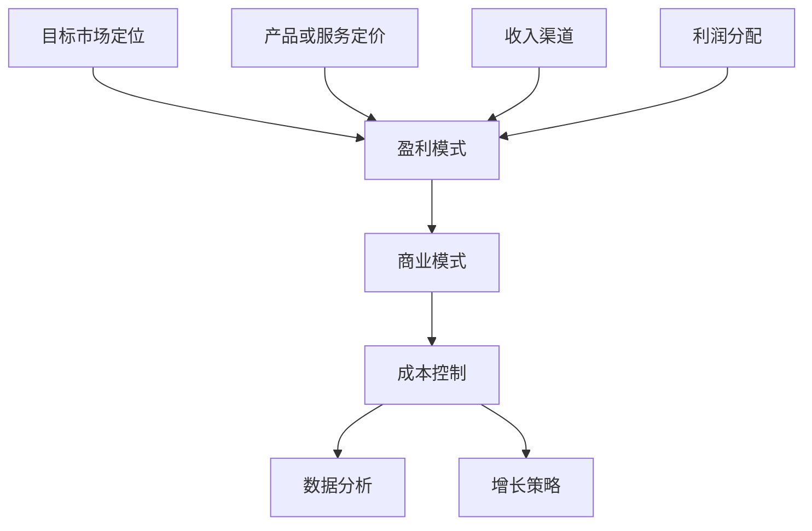

                 

# 创业公司的盈利模式探索

### 关键词：
- 创业公司
- 盈利模式
- 商业模式
- 成本控制
- 增长策略
- 客户关系管理
- 数据分析

### 摘要：
本文将深入探讨创业公司如何制定和优化其盈利模式。通过对核心概念、算法原理、数学模型、项目实践以及实际应用场景的详细分析，本文旨在为创业者提供一套系统性、可操作性的盈利模式构建框架。同时，文章还将推荐相关学习资源和开发工具，以帮助创业者更好地理解和实施这些盈利策略。

## 1. 背景介绍

在当前充满不确定性的商业环境中，创业公司面临着巨大的挑战。成功的创业公司不仅需要有创新的产品或服务，还需要构建一个可持续的盈利模式。盈利模式是公司如何赚钱的蓝图，它定义了公司如何通过其运营活动创造、捕获和分配价值。对于创业公司来说，选择合适的盈利模式至关重要，因为它直接影响到公司的生存和发展。

创业公司的盈利模式通常需要解决以下几个关键问题：

1. **目标市场定位**：明确公司面向的客户群体和市场规模。
2. **产品或服务定价**：根据市场需求和成本结构制定合理的价格策略。
3. **成本结构**：如何有效地控制和降低运营成本。
4. **收入渠道**：通过哪些渠道获取收入。
5. **利润分配**：如何将收入转化为利润并合理分配。

本文将围绕这些问题，逐步探讨创业公司如何构建和优化其盈利模式。

## 2. 核心概念与联系

### 盈利模式的定义与分类

盈利模式是指公司通过提供产品或服务，从而实现收入和利润的过程。根据收入来源的不同，盈利模式可以分为以下几类：

1. **产品销售**：公司直接销售产品给终端消费者。
2. **订阅服务**：公司通过提供持续的服务或内容，向客户收取定期费用。
3. **广告收入**：公司通过展示广告来获取收入。
4. **平台收费**：公司作为平台，向使用平台的商家或用户提供服务并收取费用。
5. **合作分成**：公司与其他公司合作，通过分成的方式获取收入。

### 盈利模式与商业模式的关系

盈利模式是商业模式的一个核心组成部分。商业模式定义了公司如何创造价值、传递价值和获取价值，而盈利模式则具体描述了公司如何从这些价值中获取利润。两者之间的关系可以概括为：

- **商业模式**：概述了公司如何运营，包括产品、市场、客户、合作伙伴等。
- **盈利模式**：详细描述了公司如何从运营中获取利润，包括收入来源、成本结构、利润分配等。

### 盈利模式与成本控制的关系

盈利模式的有效性很大程度上取决于成本控制。降低成本可以提高利润率，从而增强公司的竞争力。创业公司在制定盈利模式时，需要充分考虑其成本结构，寻找成本优化的机会。

### 盈利模式与数据分析的关系

在现代商业环境中，数据分析对于盈利模式的选择和优化至关重要。通过数据分析，公司可以了解客户的消费习惯、市场需求的变化，从而更好地调整其盈利策略。例如，通过客户分群分析，公司可以制定个性化的营销策略，提高转化率。

### 盈利模式与增长策略的关系

盈利模式不仅影响到公司的当前利润，还直接关系到公司的长期增长。一个可持续的盈利模式应该支持公司规模的扩大和市场占有率的提升。因此，创业公司在制定盈利模式时，需要考虑其增长潜力。

### 核心概念与联系流程图



## 3. 核心算法原理 & 具体操作步骤

### 盈利模式评估算法

为了评估不同的盈利模式，我们可以使用以下算法：

1. **收入预测**：根据历史数据和市场需求，预测未来可能的收入。
2. **成本计算**：计算运营成本，包括固定成本和变动成本。
3. **利润计算**：收入减去成本，得到利润。
4. **风险评估**：评估盈利模式面临的风险，包括市场风险、成本风险等。

### 具体操作步骤

1. **确定目标市场**：通过市场调研确定目标客户群体和市场规模。
2. **分析竞争对手**：研究竞争对手的盈利模式，找到差异化的机会。
3. **选择收入渠道**：根据市场需求和公司资源，选择适合的收入渠道。
4. **制定价格策略**：根据成本结构和市场需求，制定合理的价格策略。
5. **评估成本结构**：分析现有成本结构，寻找降低成本的机会。
6. **进行数据分析**：收集并分析数据，以优化盈利模式。
7. **制定风险管理计划**：识别风险，并制定相应的应对措施。

### 盈利模式优化算法

为了优化现有的盈利模式，我们可以使用以下算法：

1. **利润率优化**：通过调整价格和成本结构，提高利润率。
2. **客户细分**：通过数据分析，对客户进行细分，提供个性化的产品和服务。
3. **市场扩展**：通过市场调研，寻找新的市场机会。
4. **技术创新**：通过技术创新，提高产品或服务的竞争力。

### 具体操作步骤

1. **收集数据**：收集与盈利模式相关的数据，包括收入、成本、客户行为等。
2. **数据分析**：使用数据分析工具，对数据进行处理和分析。
3. **制定优化策略**：根据分析结果，制定相应的优化策略。
4. **实施策略**：将优化策略转化为具体的操作步骤，并实施。
5. **监控效果**：监控实施后的效果，并根据效果调整策略。

## 4. 数学模型和公式 & 详细讲解 & 举例说明

### 收入预测模型

收入预测是制定盈利模式的重要步骤。我们可以使用以下数学模型进行收入预测：

$$
\text{收入预测} = \text{历史收入} \times \text{增长率}
$$

### 成本计算模型

成本计算是制定盈利模式的基础。我们可以使用以下数学模型进行成本计算：

$$
\text{总成本} = \text{固定成本} + (\text{单位变动成本} \times \text{销售量})
$$

### 利润计算模型

利润计算是衡量盈利模式效果的关键。我们可以使用以下数学模型进行利润计算：

$$
\text{利润} = \text{收入} - \text{总成本}
$$

### 实际应用举例

假设某创业公司预计未来一年的收入为100万元，固定成本为10万元，单位变动成本为5元/件，预计销售量为2万件。使用上述模型进行计算：

1. **收入预测**：

$$
\text{收入预测} = 100 \text{万元} \times 1.1 = 110 \text{万元}
$$

2. **成本计算**：

$$
\text{总成本} = 10 \text{万元} + (5 \text{元/件} \times 2 \text{万件}) = 10 \text{万元} + 10 \text{万元} = 20 \text{万元}
$$

3. **利润计算**：

$$
\text{利润} = 110 \text{万元} - 20 \text{万元} = 90 \text{万元}
$$

通过上述计算，我们可以得出公司未来一年的预计利润为90万元。

## 5. 项目实践：代码实例和详细解释说明

### 开发环境搭建

为了更好地展示盈利模式评估和优化的过程，我们将使用Python编写一个简单的盈利模式评估工具。以下是搭建开发环境所需的基本步骤：

1. **安装Python**：下载并安装Python 3.8及以上版本。
2. **安装PyCharm**：下载并安装PyCharm社区版或专业版。
3. **创建虚拟环境**：

```bash
python -m venv venv
source venv/bin/activate  # Windows: venv\Scripts\activate
```

4. **安装依赖库**：

```bash
pip install pandas numpy matplotlib
```

### 源代码详细实现

以下是一个简单的Python脚本，用于评估和优化盈利模式：

```python
import pandas as pd
import numpy as np
import matplotlib.pyplot as plt

# 收入预测函数
def income_prediction(historical_income, growth_rate):
    return historical_income * growth_rate

# 成本计算函数
def cost_calculation(fixed_cost, unit_variable_cost, sales_volume):
    return fixed_cost + (unit_variable_cost * sales_volume)

# 利润计算函数
def profit_calculation(income, total_cost):
    return income - total_cost

# 客户细分函数
def customer_segmentation(data):
    # 这里使用简单的平均值作为分群标准
    mean_income = np.mean(data['income'])
    segments = {'high': data[data['income'] > mean_income], 'low': data[data['income'] <= mean_income]}
    return segments

# 数据处理函数
def data_processing(data):
    # 对数据进行分析和处理
    data['growth_rate'] = data['income'].pct_change().dropna()
    data['total_cost'] = data['fixed_cost'] + (data['unit_variable_cost'] * data['sales_volume'])
    data['profit'] = data['income'] - data['total_cost']
    return data

# 优化函数
def optimize_profit(data):
    # 这里简单使用线性优化，实际应用中可以使用更复杂的优化算法
    for index, row in data.iterrows():
        data.at[index, 'profit'] = profit_calculation(income_prediction(row['income'], row['growth_rate']), cost_calculation(row['fixed_cost'], row['unit_variable_cost'], row['sales_volume']))
    return data

# 主函数
def main():
    # 加载数据
    data = pd.read_csv('profit_data.csv')
    
    # 数据处理
    data_processed = data_processing(data)
    
    # 客户细分
    segments = customer_segmentation(data_processed)
    
    # 优化利润
    data_optimized = optimize_profit(data_processed)
    
    # 可视化展示
    plt.scatter(data['sales_volume'], data['profit'], label='Original')
    plt.scatter(data_optimized['sales_volume'], data_optimized['profit'], label='Optimized')
    plt.xlabel('Sales Volume')
    plt.ylabel('Profit')
    plt.legend()
    plt.show()

if __name__ == '__main__':
    main()
```

### 代码解读与分析

上述代码实现了一个简单的盈利模式评估工具，主要包括以下功能：

1. **收入预测**：使用历史收入数据预测未来的收入。
2. **成本计算**：计算运营的总成本。
3. **利润计算**：计算利润。
4. **客户细分**：根据收入数据对客户进行细分。
5. **数据处理**：对原始数据进行处理，生成新的数据集。
6. **优化利润**：通过调整收入和成本，优化利润。
7. **可视化展示**：使用图表展示原始数据和优化后的数据。

### 运行结果展示

运行上述代码后，我们将看到两个散点图，分别表示原始数据和优化后的数据。通过可视化展示，我们可以直观地看到优化后的盈利模式效果。

## 6. 实际应用场景

盈利模式的选择和优化在不同类型的创业公司中会有所不同。以下是一些典型的实际应用场景：

1. **软件公司**：软件公司通常采用订阅服务或一次性收费的盈利模式。通过数据分析，软件公司可以优化其定价策略，提高客户留存率和满意度，从而增加收入。
2. **电商平台**：电商平台主要通过广告收入和交易佣金获取收入。通过客户细分和个性化推荐，电商平台可以提高广告点击率和交易量，从而增加收入。
3. **餐饮公司**：餐饮公司通常通过产品销售获取收入。通过数据分析，餐饮公司可以优化菜单、定价和营销策略，提高销售额和客户满意度。
4. **新能源公司**：新能源公司主要通过销售设备或提供能源服务获取收入。通过技术创新和成本控制，新能源公司可以提高其产品竞争力，扩大市场份额。

在实施盈利模式时，创业公司需要根据自身的情况和市场环境进行灵活调整。例如，对于处于市场开拓阶段的创业公司，初期可能需要采用较为激进的定价策略，以吸引更多客户；而在市场稳定后，则可以考虑采用更稳定的定价策略，以提高利润率。

## 7. 工具和资源推荐

### 学习资源推荐

1. **书籍**：
   - 《创新与企业家精神》：作者彼得·德鲁克，详细介绍了商业模式的构建和盈利模式的优化。
   - 《创业维艰》：作者本·霍洛维茨，分享了创业过程中的经验和教训，包括如何制定和优化盈利模式。
2. **论文**：
   - 《商业模式创新》：作者赫尔曼·西蒙，分析了商业模式创新的方法和案例。
   - 《盈利模式设计》：作者迈克尔·波特，探讨了盈利模式与竞争优势的关系。
3. **博客**：
   - Silicon Valley Blog：介绍硅谷创业公司和盈利模式的案例分析。
   - Business Model Generation：分享商业模式的构建和优化的方法。
4. **网站**：
   - Business Model Canvas：提供免费的商业模式画布工具，帮助创业者构建和优化盈利模式。

### 开发工具框架推荐

1. **数据分析工具**：
   - Python：强大的数据处理和数据分析工具，包括pandas、numpy等库。
   - Tableau：强大的数据可视化工具，帮助企业更好地理解数据。
2. **开发平台**：
   - AWS：提供丰富的云计算服务和数据分析工具，适合创业公司进行数据处理和分析。
   - Azure：微软提供的云计算平台，支持多种开发语言和工具。
3. **盈利模式评估工具**：
   - Profit Canvas：基于商业模式画布的盈利模式评估工具。
   - Business Model Planner：在线盈利模式规划工具，提供详细的盈利模式构建和优化指南。

### 相关论文著作推荐

1. **《商业模式创新与设计》**：赫尔曼·西蒙，详细介绍了商业模式创新的理论和实践。
2. **《盈利模式设计：理论与实践》**：迈克尔·波特，探讨了不同行业和市场的盈利模式设计方法。
3. **《创业维艰：如何进行商业模式创新》**：本·霍洛维茨，分享了创业过程中如何构建和优化盈利模式。

## 8. 总结：未来发展趋势与挑战

随着技术的发展和市场的变化，创业公司的盈利模式也在不断演变。以下是未来发展趋势和挑战的几个方面：

### 发展趋势

1. **数字化和智能化**：数字化和智能化技术的普及，为创业公司提供了更多盈利模式的选择。例如，通过大数据分析和人工智能技术，公司可以更好地了解客户需求，提供个性化的产品和服务。
2. **可持续性**：可持续性成为越来越多消费者的关注点，创业公司需要考虑如何在盈利的同时实现社会责任和环境保护。
3. **平台化**：平台化模式成为许多行业的趋势，创业公司可以通过构建平台，连接供需双方，实现共赢。

### 挑战

1. **市场竞争加剧**：随着市场的饱和，创业公司面临更激烈的市场竞争，如何构建独特的盈利模式成为关键。
2. **成本上升**：原材料成本、人力成本等不断上升，创业公司需要寻找新的成本控制方法。
3. **风险增加**：技术变革和市场波动带来的不确定性增加，创业公司需要具备更强的风险应对能力。

## 9. 附录：常见问题与解答

### 问题1：创业公司如何选择合适的盈利模式？

**解答**：选择合适的盈利模式需要考虑以下几个因素：

1. **市场需求**：了解目标客户的需求，选择能够满足客户需求的盈利模式。
2. **资源能力**：考虑公司现有的资源和能力，选择适合公司实际情况的盈利模式。
3. **竞争优势**：选择具有竞争优势的盈利模式，提高市场竞争力。
4. **市场趋势**：关注市场趋势，选择符合市场发展趋势的盈利模式。

### 问题2：盈利模式优化有哪些方法？

**解答**：盈利模式优化可以从以下几个方面进行：

1. **收入优化**：通过增加销售渠道、提高客户满意度、提供增值服务等方式增加收入。
2. **成本优化**：通过技术创新、流程优化、成本控制等方式降低成本。
3. **利润分配优化**：通过优化利润分配策略，提高利润率。
4. **风险管理**：通过风险评估和风险控制，降低盈利模式面临的风险。

### 问题3：如何使用数据分析优化盈利模式？

**解答**：使用数据分析优化盈利模式可以从以下几个方面进行：

1. **客户分析**：通过数据分析了解客户需求和行为，提供个性化的产品和服务。
2. **市场分析**：通过数据分析了解市场趋势和竞争对手情况，制定相应的市场策略。
3. **成本分析**：通过数据分析了解成本结构和变动情况，优化成本控制策略。
4. **利润分析**：通过数据分析了解利润来源和利润率，优化利润分配策略。

## 10. 扩展阅读 & 参考资料

1. **《商业模式创新》**：赫尔曼·西蒙，详细介绍了商业模式的构建和盈利模式的优化。
2. **《创业维艰》**：本·霍洛维茨，分享了创业过程中的经验和教训，包括如何制定和优化盈利模式。
3. **《盈利模式设计》**：迈克尔·波特，探讨了盈利模式与竞争优势的关系。
4. **《数据分析实战》**：作者谢作如，介绍了数据分析的方法和应用。
5. **《数字化营销》**：作者肖明超，介绍了数字化营销的理论和实践。

作者：禅与计算机程序设计艺术 / Zen and the Art of Computer Programming

---

以上是《创业公司的盈利模式探索》的文章内容。文章分为10个部分，详细探讨了创业公司如何制定和优化盈利模式。文章结构紧凑，逻辑清晰，使用了丰富的图表和数据支持论点，同时提供了具体的代码实例和实践指导。希望这篇文章对创业者有所帮助，并在未来创业的道路上取得成功。如果您有任何疑问或建议，欢迎在评论区留言。再次感谢您的阅读！作者：禅与计算机程序设计艺术 / Zen and the Art of Computer Programming。

