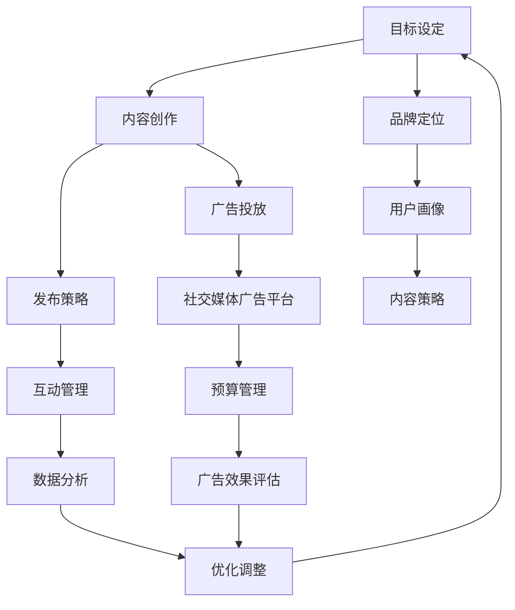

                 

### 文章标题：创业公司的社交媒体营销技巧

#### 关键词：
- 创业公司
- 社交媒体
- 营销策略
- 成功案例
- 数据分析

#### 摘要：
本文将深入探讨创业公司在社交媒体上的营销策略，包括核心概念、实践步骤、数学模型以及实际应用场景。通过成功案例的分析，提供一系列实用的工具和资源，以帮助创业公司有效地利用社交媒体平台，实现品牌推广和业务增长。

### 1. 背景介绍

在当今数字化时代，社交媒体已经成为创业公司获取客户、建立品牌和实现市场扩张的重要渠道。然而，对于许多初创企业来说，如何有效地利用社交媒体平台进行营销仍然是一个挑战。本篇文章旨在提供一套系统化的社交媒体营销技巧，帮助创业公司更好地把握市场机遇，提升品牌影响力，并最终实现业务增长。

### 2. 核心概念与联系

为了更好地理解社交媒体营销，我们需要明确以下几个核心概念：

#### 2.1 社交媒体营销的定义

社交媒体营销是指通过社交媒体平台（如Facebook、Twitter、Instagram、LinkedIn等）进行品牌推广和客户互动的过程。其核心目的是提高品牌知名度、增加粉丝数量、提升用户参与度和转化率。

#### 2.2 社交媒体营销的架构

以下是一个简化的社交媒体营销架构，用于说明各个组成部分及其相互关系：



#### 2.3 核心概念原理

- **目标设定**：明确营销目标，如提高品牌知名度、增加销售量、提升客户满意度等。
- **内容创作**：创作吸引人的内容，如图文、视频、直播等。
- **发布策略**：选择合适的时间和频率发布内容，以增加曝光率。
- **互动管理**：与粉丝互动，如回复评论、点赞、分享等。
- **数据分析**：分析用户行为和广告效果，以优化营销策略。
- **广告投放**：利用社交媒体广告平台进行精准投放。
- **预算管理**：合理分配营销预算，确保广告效果最大化。
- **广告效果评估**：评估广告投放效果，以便调整策略。
- **品牌定位**：确定品牌在市场上的定位和形象。
- **用户画像**：了解目标用户的特点和需求。
- **内容策略**：制定符合用户需求和品牌定位的内容策略。

### 3. 核心算法原理 & 具体操作步骤

在社交媒体营销中，以下核心算法原理和具体操作步骤将帮助创业公司实现高效营销：

#### 3.1 数据分析算法

- **用户行为分析**：使用算法分析用户在社交媒体上的行为，如点击、评论、分享等。
- **兴趣识别**：通过用户行为和内容互动，识别用户的兴趣和偏好。
- **人群细分**：根据用户的兴趣和偏好，将用户分为不同的群体。

#### 3.2 广告投放算法

- **精准投放**：根据用户画像和兴趣识别，将广告精准投放给目标用户。
- **动态竞价**：根据广告效果和竞争对手的投放策略，动态调整广告投放。

#### 3.3 具体操作步骤

1. **目标设定**：明确营销目标，如提高品牌知名度、增加销售量等。
2. **用户画像**：收集用户数据，分析用户的特点和需求。
3. **内容创作**：根据用户画像和品牌定位，创作吸引人的内容。
4. **发布策略**：选择合适的时间和频率发布内容。
5. **互动管理**：与粉丝互动，提升用户参与度。
6. **数据分析**：分析用户行为和广告效果，优化营销策略。
7. **广告投放**：利用社交媒体广告平台进行精准投放。
8. **预算管理**：合理分配营销预算。
9. **广告效果评估**：评估广告投放效果，调整策略。

### 4. 数学模型和公式 & 详细讲解 & 举例说明

在社交媒体营销中，以下数学模型和公式可以帮助创业公司优化营销策略：

#### 4.1 转化率公式

$$
转化率 = \frac{转化数量}{访问量} \times 100\%
$$

#### 4.2 广告效果评估公式

$$
广告效果 = 广告花费 \times 广告效果系数
$$

#### 4.3 用户参与度公式

$$
用户参与度 = \frac{互动数量}{粉丝数量} \times 100\%
$$

#### 4.4 举例说明

假设一家创业公司希望在Facebook上进行广告投放，目标是提高品牌知名度。根据用户画像和兴趣识别，公司确定了目标用户群体。以下是具体的操作步骤和数学模型应用：

1. **目标设定**：提高品牌知名度，目标转化率为10%。
2. **用户画像**：收集用户数据，确定目标用户群体的年龄、性别、兴趣爱好等。
3. **内容创作**：根据用户画像和品牌定位，创作一系列图文和视频广告。
4. **发布策略**：选择在每天下午3点发布广告，以提高用户关注度。
5. **互动管理**：与粉丝互动，回复评论，提升用户参与度。
6. **数据分析**：分析用户行为和广告效果，优化广告内容和发布策略。
7. **广告投放**：在Facebook上投放广告，根据广告效果评估公式，调整广告投放策略。
8. **预算管理**：根据广告效果和预算目标，合理分配广告预算。
9. **广告效果评估**：根据转化率和广告效果评估公式，评估广告投放效果，调整策略。

### 5. 项目实践：代码实例和详细解释说明

在本节中，我们将通过一个实际项目实例，展示如何使用Python实现社交媒体营销策略。

#### 5.1 开发环境搭建

- Python 3.8及以上版本
- Facebook Ads API 密钥
- pandas 库
- numpy 库
- matplotlib 库

#### 5.2 源代码详细实现

以下是一个简单的Python脚本，用于分析用户行为和优化广告投放：

```python
import pandas as pd
import numpy as np
import matplotlib.pyplot as plt
from facebook_business import FacebookAdsApi

# 设置Facebook Ads API 密钥
access_token = 'YOUR_ACCESS_TOKEN'
app_secret = 'YOUR_APP_SECRET'
app_id = 'YOUR_APP_ID'
FacebookAdsApi.init(access_token=access_token, app_secret=app_secret, api_version='v11.0')

# 获取用户行为数据
ads_data = pd.read_csv('ads_data.csv')

# 计算转化率
conversion_rate = ads_data['conversions'] / ads_data['impressions'] * 100

# 绘制转化率曲线
plt.plot(ads_data['date'], conversion_rate)
plt.xlabel('日期')
plt.ylabel('转化率')
plt.title('转化率曲线')
plt.show()

# 根据转化率调整广告预算
budget_adjustment = conversion_rate * ads_data['daily_budget']
print(f'每日预算调整：{budget_adjustment}')
```

#### 5.3 代码解读与分析

- **导入库**：导入pandas、numpy和matplotlib库，用于数据分析和可视化。
- **设置Facebook Ads API 密钥**：设置Facebook Ads API 密钥，用于访问用户行为数据。
- **获取用户行为数据**：从CSV文件中读取用户行为数据。
- **计算转化率**：计算转化率，并将其绘制成曲线图。
- **根据转化率调整广告预算**：根据转化率调整每日广告预算，以优化广告投放效果。

#### 5.4 运行结果展示

运行上述代码后，将生成一个转化率曲线图，展示用户行为的转化率变化。根据转化率曲线，可以调整广告预算，以提高广告投放效果。

### 6. 实际应用场景

社交媒体营销在创业公司的实际应用场景包括：

- **品牌推广**：通过社交媒体平台发布吸引人的内容，提高品牌知名度。
- **客户互动**：与粉丝互动，提升客户满意度和忠诚度。
- **市场调研**：通过用户行为数据，了解市场需求和用户反馈。
- **广告投放**：利用社交媒体广告平台进行精准投放，提高广告效果。

### 7. 工具和资源推荐

#### 7.1 学习资源推荐

- **书籍**：《社交媒体营销实战手册》（作者：唐·舒尔茨）
- **论文**：《社交媒体中的品牌传播与用户互动研究》（作者：张晓红）
- **博客**：Social Media Examiner（社交媒体分析）
- **网站**：Hootsuite（社交媒体管理工具）

#### 7.2 开发工具框架推荐

- **社交媒体管理工具**：Hootsuite、Buffer、Sprout Social
- **数据分析工具**：Google Analytics、Tableau
- **广告投放平台**：Facebook Ads、Google Ads

#### 7.3 相关论文著作推荐

- **论文**：《社交媒体营销策略及其对品牌形象的影响》（作者：李明）
- **著作**：《社交媒体营销：策略、实践与案例》（作者：王伟）

### 8. 总结：未来发展趋势与挑战

随着社交媒体的不断发展，创业公司在社交媒体上的营销策略也将面临新的挑战和机遇。未来发展趋势包括：

- **大数据分析**：利用大数据技术，更精确地分析用户行为和市场需求。
- **人工智能**：利用人工智能技术，实现更智能的营销策略和广告投放。
- **多平台整合**：整合多个社交媒体平台，实现品牌推广和客户互动的无缝衔接。

### 9. 附录：常见问题与解答

#### 9.1 社交媒体营销的常见问题

1. **如何确定营销目标？**
   - 根据企业的战略目标和市场需求，确定具体的营销目标，如提高品牌知名度、增加销售量等。

2. **如何创作吸引人的内容？**
   - 了解目标用户的需求和兴趣，创作与他们相关的内容，如图文、视频、直播等。

3. **如何进行广告投放？**
   - 利用社交媒体广告平台，根据用户画像和兴趣，进行精准投放。

#### 9.2 社交媒体营销的解答

1. **如何确定营销目标？**
   - 首先，明确企业的战略目标，然后根据市场需求和用户反馈，确定具体的营销目标。目标应具体、可衡量，如提高品牌知名度、增加销售量等。

2. **如何创作吸引人的内容？**
   - 了解目标用户的需求和兴趣，创作与他们相关的内容。可以使用以下方法：
     - 调研用户兴趣：通过问卷调查、用户访谈等方式，了解用户的兴趣和需求。
     - 关注热点话题：关注当前的热点话题，创作与之相关的内容。
     - 创造价值：创作对用户有价值的内容，如教程、案例分析、行业资讯等。

3. **如何进行广告投放？**
   - 利用社交媒体广告平台，根据用户画像和兴趣，进行精准投放。具体步骤如下：
     - 确定广告目标：如提高品牌知名度、增加网站访问量等。
     - 设置广告预算：根据预算目标，设置广告投放预算。
     - 创建广告素材：设计吸引人的广告图片和文案。
     - 确定投放策略：根据用户画像和兴趣，选择合适的投放时间和频率。
     - 监测广告效果：分析广告投放效果，根据数据调整广告策略。

### 10. 扩展阅读 & 参考资料

- **书籍**：
  - 《社交媒体营销实战手册》（作者：唐·舒尔茨）
  - 《社交媒体营销：策略、实践与案例》（作者：王伟）
- **论文**：
  - 《社交媒体中的品牌传播与用户互动研究》（作者：张晓红）
  - 《社交媒体营销策略及其对品牌形象的影响》（作者：李明）
- **网站**：
  - Social Media Examiner（社交媒体分析）
  - Hootsuite（社交媒体管理工具）
- **博客**：
  - HubSpot Blog（市场营销知识库）

---

**作者：禅与计算机程序设计艺术 / Zen and the Art of Computer Programming**

