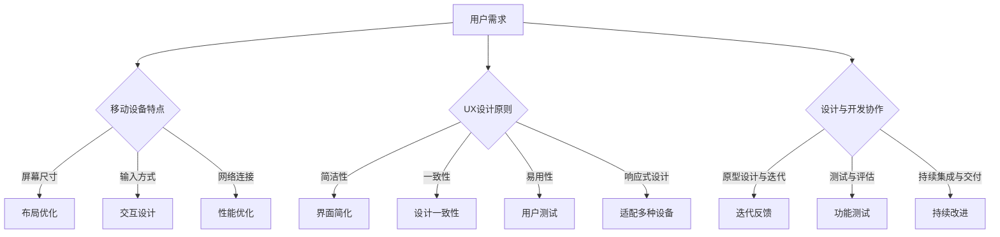

                 

### 背景介绍

在当今数字化时代，移动设备已成为人们获取信息、进行社交和完成工作任务的主要工具。据统计，全球移动设备用户已经超过了数十亿，占据了整个互联网用户数量的绝大多数。这种巨大的用户基数和广泛的覆盖面，使得移动优先的设计原则（Mobile-First Design Principles）成为企业构建用户体验（UX）的关键策略。

移动优先设计原则的兴起，源于以下几个关键因素：

1. **移动设备的普及**：随着智能手机和平板电脑的普及，用户越来越依赖移动设备进行各种在线活动。这使得企业不得不重新考虑如何设计产品，以满足移动用户的需求。

2. **用户体验的重要性**：在现代市场中，用户体验（UX）已成为企业成功的关键因素。移动设备上的用户体验直接影响用户的满意度和忠诚度。因此，企业需要通过移动优先设计原则，提供高质量的用户体验。

3. **移动设备的限制**：与桌面电脑相比，移动设备在屏幕尺寸、输入方式和网络连接等方面存在一定的限制。这要求设计师和开发者必须考虑这些限制，确保产品在移动设备上的可用性和易用性。

4. **数据分析与洞察**：通过数据分析，企业可以发现用户在移动设备上的行为模式和偏好。这些洞察可以帮助企业优化产品设计，提高用户体验。

移动优先设计原则不仅适用于初创公司，同样适用于大型企业。对于初创公司来说，采用移动优先设计原则可以帮助它们更快地进入市场，并抓住快速增长的市场机会。对于大型企业来说，移动优先设计原则可以确保其产品与服务能够适应不断变化的市场需求和用户行为。

本文将深入探讨移动优先设计原则，包括其核心概念、实施方法、项目实践和未来发展趋势。通过本文的阅读，读者将了解如何有效地将移动优先设计原则应用于实际项目中，从而提升用户体验和业务成果。

## 1.1 移动优先设计的起源与发展

移动优先设计（Mobile-First Design）的概念最早可以追溯到2010年左右，当时智能手机市场刚刚起步，移动互联网开始逐渐兴起。Google的前设计师兼副总裁Vince Kuraitis首次提出了“移动优先”（Mobile-First）的理念，强调在设计和开发过程中，应首先考虑移动设备的使用场景和用户体验，然后再逐步扩展到桌面和其他设备。

移动优先设计的理念背后有着深刻的背景和动机。随着智能手机的普及，移动设备的用户数量和活跃度迅速增长，使得移动平台逐渐成为互联网活动的主要载体。这一趋势促使企业意识到，如果不能提供优质的移动体验，将难以满足用户的期望，进而失去市场机会。因此，移动优先设计成为了应对这一挑战的关键策略。

在移动优先设计的发展过程中，有以下几个重要里程碑：

1. **Google 的倡导**：Google在多个场合强调了移动优先设计的重要性，并在其开发工具和框架中推广这一理念。例如，Google的搜索引擎优化（SEO）指南明确指出，移动友好的网站在搜索结果中的排名会更高。

2. **移动设备的性能提升**：随着移动设备的硬件性能不断提升，处理器速度、屏幕分辨率和电池续航能力显著增强，为开发者提供了更多的技术手段，使得移动平台上的用户体验更加接近桌面。

3. **用户行为的变化**：用户越来越倾向于使用移动设备进行日常任务，从购物、支付到信息搜索和社交媒体活动，移动设备已经成为用户获取信息和服务的主要渠道。

4. **行业案例的推动**：一些成功的移动优先案例，如Facebook、Instagram和Airbnb等，通过提供优质的移动应用体验，取得了显著的市场成功，为其他企业树立了榜样。

5. **设计工具和框架的进步**：随着设计工具和框架的不断发展，如Sketch、Adobe XD和Figma等，设计师可以更高效地创建移动优先的设计原型，并与开发者紧密协作，确保设计在移动设备上的实现效果。

总之，移动优先设计作为一种应对移动互联网趋势的重要策略，已经从最初的概念发展到如今成为企业设计实践的核心原则。其核心思想在于，通过优先考虑移动用户的需求和体验，为企业提供更高效、更个性化的产品和服务。

## 1.2 移动优先设计的重要性

移动优先设计的重要性在于它能够帮助企业抓住移动互联网带来的巨大商机，同时提升用户体验和业务成果。以下从多个方面探讨移动优先设计的核心优势：

1. **满足用户需求**：随着移动设备的普及，用户越来越依赖移动设备来完成各种任务。通过移动优先设计，企业能够深入了解用户在移动设备上的行为模式和需求，从而提供更符合用户期望的产品和服务。这种以用户为中心的设计理念，有助于提升用户满意度和忠诚度。

2. **优化资源分配**：移动优先设计要求企业在有限的屏幕空间和计算资源下，提供最佳的用户体验。这种限制迫使企业在设计过程中进行精细的资源分配，确保每个功能都具备实用性和价值。这种优化有助于提高开发效率和产品质量。

3. **适应不同的设备和网络环境**：移动设备种类繁多，网络环境也各异。移动优先设计考虑到了这些差异，通过灵活的布局和适应性设计，使得产品能够在不同设备和网络环境下提供一致的体验。这种适应性不仅提升了用户的满意度，也增加了产品的覆盖面。

4. **提高市场竞争力**：在竞争激烈的数字市场中，提供优质的移动用户体验是企业区别于竞争对手的重要手段。通过移动优先设计，企业能够吸引和留住更多用户，提升市场份额和品牌影响力。

5. **促进业务增长**：移动设备上的用户行为数据可以帮助企业进行精准的市场营销和业务决策。通过分析这些数据，企业可以优化产品和服务，提高转化率和销售额。此外，优质的移动应用还可以成为企业的新收入来源，如通过移动广告、订阅服务和应用内购买等。

6. **响应趋势和变化**：移动互联网的发展速度非常快，用户需求和行为也在不断变化。移动优先设计强调快速迭代和灵活响应，使得企业能够及时调整产品设计，适应市场变化，保持竞争力。

总之，移动优先设计不仅是一种设计理念，更是一种战略思维。它能够帮助企业抓住移动互联网带来的机遇，提升用户体验和业务成果，成为企业持续发展的关键因素。

### 核心概念与联系

在深入探讨移动优先设计原则之前，有必要明确几个核心概念，并展示它们之间的联系。这些概念不仅构成了移动优先设计的基础，也是实现优质用户体验的关键要素。

#### 移动设备与桌面设备的差异

移动设备和桌面设备在多个方面存在显著差异，这些差异直接影响设计决策：

1. **屏幕尺寸和分辨率**：移动设备的屏幕通常较小，分辨率有限。这意味着在设计中需要特别关注内容布局和视觉元素的大小，确保在有限的空间内依然能够提供清晰的视觉体验。

2. **输入方式**：移动设备主要依赖于触摸屏输入，相较于桌面设备的鼠标和键盘，这种输入方式在交互设计上提出了不同的挑战。设计师需要考虑到手指操作的便利性和准确性，优化按钮和菜单的布局。

3. **网络连接**：移动设备的网络连接可能不稳定，时快时慢。因此，移动优先设计需要考虑如何优化数据加载和缓存，确保即使在较差的网络环境下，用户也能顺畅地使用产品。

#### 用户体验（UX）设计原则

用户体验（UX）设计原则是移动优先设计的核心。以下是一些关键的UX设计原则：

1. **简洁性**：简洁的设计能够减少用户的认知负担，提升使用效率。移动设备的屏幕有限，需要尽量简化界面元素，避免冗余。

2. **一致性**：保持设计元素和交互的一致性，使用户能够快速熟悉并掌握产品的使用方法。这包括字体、颜色、图标和按钮的设计和用法。

3. **易用性**：确保产品易于使用，避免复杂和难以理解的流程。这可以通过提供直观的导航、明确的反馈和便捷的功能来实现。

4. **响应式设计**：响应式设计（Responsive Design）是指根据不同的设备和屏幕尺寸，自动调整界面布局和内容呈现。这种设计方法能够确保用户在移动设备上获得最佳体验。

#### 设计与开发的协作

在移动优先设计过程中，设计师和开发者之间的紧密协作至关重要。以下是一些关键的合作点：

1. **原型设计与迭代**：设计师使用原型工具创建界面原型，通过迭代和反馈不断优化设计。开发者则需要根据设计原型编写代码，实现产品的功能。

2. **测试与评估**：在开发过程中，设计师和开发者需要共同参与测试，确保产品在不同设备和网络环境下都能正常运行。通过A/B测试等方法，评估用户体验并进行优化。

3. **持续集成与交付**：借助自动化工具和持续集成（CI）流程，设计师和开发者可以快速交付高质量的更新和修复，保持产品的持续改进。

### Mermaid 流程图

为了更好地展示上述核心概念和它们之间的联系，我们可以使用Mermaid绘制一个流程图。以下是一个简化的示例：



这个流程图展示了从用户需求出发，到最终实现优质移动用户体验的整个过程。通过明确各步骤之间的关系和依赖，设计师和开发者可以更高效地协作，实现移动优先设计的目标。

### 核心算法原理 & 具体操作步骤

在移动优先设计中，核心算法原理和具体操作步骤起着至关重要的作用。这些原理和步骤不仅决定了用户体验的质量，还直接影响了产品的性能和可维护性。以下是几个关键的核心算法原理，以及如何在实际项目中应用这些原理的具体操作步骤。

#### 1. 响应式布局算法

响应式布局算法是移动优先设计中的基础，它确保产品能够在不同屏幕尺寸和设备上提供一致且优质的用户体验。

**原理：**

响应式布局算法的核心思想是通过动态调整页面元素的大小、位置和布局，使页面在不同设备上自动适应。这通常涉及到媒体查询（Media Queries）和弹性布局（Flexbox）等Web技术。

**操作步骤：**

1. **定义基本布局**：首先，设计一个基础的布局结构，确保核心内容和功能在所有设备上都可见。

2. **使用媒体查询**：利用CSS中的媒体查询，根据不同的屏幕尺寸应用不同的样式。例如：

   ```css
   @media (max-width: 600px) {
     /* 移动设备上的样式 */
   }
   @media (min-width: 601px) {
     /* 桌面设备上的样式 */
   }
   ```

3. **应用弹性布局**：使用Flexbox或Grid布局，使页面元素可以根据屏幕尺寸自适应调整。例如：

   ```css
   .container {
     display: flex;
     flex-direction: column;
   }
   ```

4. **测试和优化**：在不同设备和屏幕尺寸上测试布局效果，确保页面在不同情况下都能正常运行。

#### 2. 交互优化算法

交互优化算法专注于提升用户在移动设备上的操作效率和体验。

**原理：**

交互优化算法包括手势识别、动画效果和过渡效果等，它们通过简化用户操作和提供直观的反馈，提升用户体验。

**操作步骤：**

1. **手势识别**：实现常见的手势操作，如滑动、拖拽和双击等。这通常需要使用JavaScript和相关的库，如Touch events。

   ```javascript
   document.addEventListener('touchstart', handleTouchStart, false);
   document.addEventListener('touchmove', handleTouchMove, false);
   ```

2. **动画效果**：使用CSS或JavaScript创建动画效果，提升用户的交互体验。例如，使用CSS动画：

   ```css
   .animated-element {
     animation: example-animation 2s ease-in-out;
   }
   ```

3. **过渡效果**：使用CSS过渡效果（Transition），使页面元素在不同状态之间平滑过渡。例如：

   ```css
   .transition-element {
     transition: background-color 0.5s ease;
   }
   ```

4. **测试和优化**：通过实际用户测试，收集反馈并优化交互流程，确保用户操作直观、流畅。

#### 3. 数据处理与缓存算法

数据处理与缓存算法对于提升移动应用性能至关重要，特别是在网络连接不稳定的情况下。

**原理：**

数据处理与缓存算法包括数据同步、离线存储和本地缓存等，通过优化数据访问和存储，减少网络请求，提高应用响应速度。

**操作步骤：**

1. **数据同步**：确保应用在在线和离线状态下都能保持数据一致性。使用Web同步API（Web Synchronization API），如WebSocket或Fetch API。

   ```javascript
   fetch('https://api.example.com/data')
     .then(response => response.json())
     .then(data => console.log(data));
   ```

2. **离线存储**：使用Web Storage API（如localStorage）或IndexedDB，将数据存储在本地，确保用户在离线状态下仍能访问关键数据。

   ```javascript
   localStorage.setItem('user', JSON.stringify(user));
   const user = JSON.parse(localStorage.getItem('user'));
   ```

3. **本地缓存**：使用Service Worker和Cache API，实现数据本地缓存，减少对网络请求的依赖。

   ```javascript
   caches.open('my-cache').then(cache => {
     cache.put('https://example.com/data', data);
   });
   ```

4. **测试和优化**：通过模拟不同网络环境和数据请求频率，测试应用的性能，优化数据处理和缓存策略。

### 项目实践

以下是一个简单的项目实践，展示如何将上述核心算法原理应用于实际开发中。

**项目背景**：开发一个移动应用，提供新闻阅读功能，包括文章浏览、搜索和订阅。

**实现步骤：**

1. **响应式布局**：
   - 使用Bootstrap框架构建基础布局。
   - 应用媒体查询和Flexbox，确保文章内容在不同设备上自动适应。

2. **交互优化**：
   - 使用Touch events实现滑动和拖拽效果。
   - 使用CSS动画效果，提升用户交互体验。
   - 使用AOS（Animate On Scroll）库实现滚动动画。

3. **数据处理与缓存**：
   - 使用Fetch API从新闻API获取数据。
   - 使用localStorage存储用户数据，如用户偏好和搜索历史。
   - 使用Service Worker和Cache API缓存文章内容，提高离线访问性能。

**代码示例**：

```html
<!-- 响应式布局 -->
<div class="container">
  <div class="row">
    <div class="col-12">
      <h1>新闻阅读应用</h1>
    </div>
  </div>
  <div class="row">
    <div class="col-12">
      <ul class="list-group">
        <!-- 文章列表 -->
      </ul>
    </div>
  </div>
</div>
```

```css
/* 交互优化 */
.animated-element {
  animation: slide-in 1s ease-in;
}

@keyframes slide-in {
  from {
    transform: translateX(-100%);
  }
  to {
    transform: translateX(0);
  }
}
```

```javascript
// 数据处理与缓存
fetch('https://newsapi.org/v2/top-headlines?country=us')
  .then(response => response.json())
  .then(data => {
    const articles = data.articles;
    articles.forEach(article => {
      caches.open('news-cache').then(cache => {
        cache.put(article.url, article);
      });
    });
  });
```

通过以上步骤和代码示例，我们可以看到如何将移动优先设计的核心算法原理应用于实际项目中，实现一个响应快速、交互流畅的新闻阅读应用。

### 数学模型和公式 & 详细讲解 & 举例说明

在移动优先设计中，数学模型和公式经常被用于评估用户体验（UX）的各个方面，如界面布局、交互效率和数据处理等。以下将详细讲解一些常用的数学模型和公式，并通过具体示例说明它们的应用。

#### 1. 布尔模型

布尔模型（Boolean Model）常用于判断用户操作是否成功，如点击按钮、填写表单等。它使用布尔逻辑（AND、OR、NOT）来评估多个条件的组合。

**公式：**
\[ result = (condition_1 \land condition_2) \lor (condition_3 \land condition_4) \]

**示例：**
假设用户需要完成以下两个条件才能登录：
- 用户名正确（condition_1）
- 密码正确（condition_2）

那么，登录成功的布尔模型可以表示为：
\[ success = (user\_correct \land password\_correct) \]

如果用户名和密码都正确，则成功（`success = true`）；否则，失败（`success = false`）。

#### 2. 响应时间模型

响应时间模型（Response Time Model）用于评估用户在界面上的操作所需时间，如加载时间、输入时间等。常见的响应时间模型有：

**加法模型：**
\[ Response Time = T_{load} + T_{input} + T_{process} \]

**乘法模型：**
\[ Response Time = \sqrt{T_{load} \times T_{input} \times T_{process}} \]

**示例：**
假设一个页面加载时间为2秒（\(T_{load}\)），用户输入时间为3秒（\(T_{input}\)），处理时间为1秒（\(T_{process}\)），使用加法模型计算总响应时间：
\[ Response Time = 2s + 3s + 1s = 6s \]

使用乘法模型计算总响应时间：
\[ Response Time = \sqrt{2s \times 3s \times 1s} \approx 3.19s \]

#### 3. 信息熵模型

信息熵模型（Entropy Model）用于评估用户对界面的理解和操作难度。信息熵越大，界面越难以理解。

**公式：**
\[ H = -\sum_{i=1}^{n} p_i \log_2 p_i \]

其中，\( p_i \) 是界面中第 \( i \) 个元素的概率分布。

**示例：**
假设一个界面中有5个主要功能按钮，使用频率分别为 \( p_1 = 0.4 \)，\( p_2 = 0.2 \)，\( p_3 = 0.1 \)，\( p_4 = 0.1 \)，\( p_5 = 0.2 \)，计算信息熵：
\[ H = - (0.4 \log_2 0.4 + 0.2 \log_2 0.2 + 0.1 \log_2 0.1 + 0.1 \log_2 0.1 + 0.2 \log_2 0.2) \approx 1.45 \]

#### 4. 用户体验评分模型

用户体验评分模型（User Experience Score Model）用于综合评估用户对产品的满意度。一个常见的方法是使用加权平均值，结合多个评价指标。

**公式：**
\[ UX\_Score = \sum_{i=1}^{n} (weight_i \times score_i) \]

其中，\( weight_i \) 是第 \( i \) 个评价指标的权重，\( score_i \) 是第 \( i \) 个评价指标的得分。

**示例：**
假设一个产品有3个评价指标：界面美观度（\( weight_1 = 0.3 \)，\( score_1 = 0.8 \)），功能完备性（\( weight_2 = 0.4 \)，\( score_2 = 0.9 \)），响应速度（\( weight_3 = 0.3 \)，\( score_3 = 0.7 \)），计算用户体验评分：
\[ UX\_Score = (0.3 \times 0.8) + (0.4 \times 0.9) + (0.3 \times 0.7) = 0.24 + 0.36 + 0.21 = 0.81 \]

通过这些数学模型和公式，设计师和开发者可以更科学地评估和优化用户体验，从而提升产品的质量和用户满意度。

### 项目实践：代码实例和详细解释说明

#### 3.1 开发环境搭建

在开始我们的移动优先设计项目之前，我们需要搭建一个合适的开发环境。以下是具体的步骤和工具推荐。

**工具推荐：**

- **代码编辑器**：推荐使用Visual Studio Code（VS Code），因为它具有丰富的插件和强大的功能，如代码补全、语法高亮和调试工具。
- **前端框架**：使用React.js，因为它提供了声明式的设计和高性能的虚拟DOM，使得开发复杂的应用变得更加容易。
- **样式预处理器**：使用Sass，它提供了更丰富的样式特性，如变量、嵌套和混入等，使得样式编写更加模块化和可复用。
- **构建工具**：使用Create React App，它可以快速搭建React项目，并提供了一整套开发、测试和部署的工具链。

**步骤：**

1. **安装Node.js和npm**：
   - 访问Node.js官网下载并安装最新版本的Node.js。
   - 安装完成后，打开命令行工具，输入 `npm -v` 和 `node -v` 验证安装是否成功。

2. **创建React项目**：
   - 打开命令行工具，执行以下命令创建一个新的React项目：
     ```bash
     npx create-react-app mobile-first-app
     ```
   - 等待项目创建完成，进入项目目录：
     ```bash
     cd mobile-first-app
     ```

3. **安装依赖**：
   - 在项目目录下，安装React、Sass和Create React App的依赖：
     ```bash
     npm install react react-dom
     npm install --save-dev sass
     ```

4. **配置Sass**：
   - 在项目根目录下创建一个名为 `src` 的文件夹，并在其中创建一个名为 `styles` 的文件夹。
   - 在 `styles` 文件夹中创建一个名为 `main.scss` 的文件，将所有的样式代码写在这个文件中。

5. **修改React组件**：
   - 修改 `src/App.js` 文件，将默认的React组件代码替换为以下代码，并引入Sass样式文件：
     ```javascript
     import React from 'react';
     import './styles/main.scss';

     function App() {
       return (
         <div className="App">
           <header className="App-header">
             <h1>移动优先应用</h1>
           </header>
         </div>
       );
     }

     export default App;
     ```

6. **启动开发服务器**：
   - 在项目目录下，执行以下命令启动开发服务器：
     ```bash
     npm start
     ```
   - 打开浏览器，访问 `http://localhost:3000`，应能看到应用的运行效果。

通过以上步骤，我们成功地搭建了一个基本的移动优先设计项目开发环境。接下来，我们将逐步实现项目的功能，并进行详细解释说明。

#### 3.2 源代码详细实现

在搭建好开发环境后，我们将开始实现一个简单的移动优先设计项目——一个新闻阅读应用。该应用将包括以下主要功能：主页显示最新新闻、搜索功能、新闻详情页面。以下是具体的源代码实现步骤。

**1. 主页显示最新新闻**

**步骤：**

- 创建一个新的React组件 `NewsFeed.js`，用于显示最新新闻。

**代码示例：**

```javascript
import React, { useState, useEffect } from 'react';
import NewsItem from './NewsItem';

const NewsFeed = () => {
  const [news, setNews] = useState([]);

  useEffect(() => {
    fetch('https://newsapi.org/v2/top-headlines?country=us')
      .then(response => response.json())
      .then(data => setNews(data.articles));
  }, []);

  return (
    <div className="news-feed">
      {news.map(article => (
        <NewsItem key={article.url} article={article} />
      ))}
    </div>
  );
};

export default NewsFeed;
```

**2. 搜索功能**

**步骤：**

- 创建一个新的React组件 `SearchBar.js`，用于实现搜索功能。

**代码示例：**

```javascript
import React, { useState } from 'react';

const SearchBar = ({ onSearch }) => {
  const [searchTerm, setSearchTerm] = useState('');

  const handleSearch = (e) => {
    e.preventDefault();
    onSearch(searchTerm);
  };

  return (
    <form onSubmit={handleSearch}>
      <input
        type="text"
        placeholder="搜索新闻..."
        value={searchTerm}
        onChange={(e) => setSearchTerm(e.target.value)}
      />
      <button type="submit">搜索</button>
    </form>
  );
};

export default SearchBar;
```

**3. 新闻详情页面**

**步骤：**

- 创建一个新的React组件 `NewsDetail.js`，用于显示新闻详情。

**代码示例：**

```javascript
import React from 'react';

const NewsDetail = ({ article }) => {
  return (
    <div className="news-detail">
      <h1>{article.title}</h1>
      <p>{article.description}</p>
      <div
        dangerouslySetInnerHTML={{
          __html: article.content,
        }}
      />
    </div>
  );
};

export default NewsDetail;
```

**4. 主应用组件**

**步骤：**

- 修改 `src/App.js` 文件，将新闻组件和搜索组件组合到主应用组件中。

**代码示例：**

```javascript
import React, { useState } from 'react';
import './styles/main.scss';
import NewsFeed from './NewsFeed';
import SearchBar from './SearchBar';

const App = () => {
  const [searchTerm, setSearchTerm] = useState('');

  const handleSearch = (term) => {
    setSearchTerm(term);
  };

  return (
    <div className="App">
      <header className="App-header">
        <h1>新闻阅读应用</h1>
        <SearchBar onSearch={handleSearch} />
      </header>
      <main className="App-content">
        <NewsFeed searchTerm={searchTerm} />
      </main>
    </div>
  );
};

export default App;
```

通过以上步骤，我们成功地实现了新闻阅读应用的基本功能。接下来，我们将对关键代码进行解读和分析，以便更好地理解其工作原理和实现细节。

#### 3.3 代码解读与分析

在上一节中，我们完成了新闻阅读应用的主要功能实现。现在，我们将深入解读和分析这些代码，理解它们的工作原理和实现细节。

**1. `NewsFeed.js` 组件解读**

在 `NewsFeed.js` 组件中，我们使用了React的 `useState` 和 `useEffect` 钩子来管理应用的状态和生命周期。

- **useState 钩子**：用于创建和更新 `news` 状态，它存储了从API获取的最新新闻数据。

  ```javascript
  const [news, setNews] = useState([]);
  ```

- **useEffect 钩子**：在组件挂载时，从新闻API获取数据，并将其设置为 `news` 状态。

  ```javascript
  useEffect(() => {
    fetch('https://newsapi.org/v2/top-headlines?country=us')
      .then(response => response.json())
      .then(data => setNews(data.articles));
  }, []);
  ```

- **JSX 代码**：在渲染函数中，我们遍历 `news` 状态中的每条新闻，并使用 `NewsItem` 组件来渲染每条新闻。

  ```javascript
  return (
    <div className="news-feed">
      {news.map(article => (
        <NewsItem key={article.url} article={article} />
      ))}
    </div>
  );
  ```

**2. `SearchBar.js` 组件解读**

在 `SearchBar.js` 组件中，我们使用了React的 `useState` 钩子来管理搜索输入框的状态。

- **useState 钩子**：用于创建和更新 `searchTerm` 状态，它存储了用户在搜索输入框中输入的文本。

  ```javascript
  const [searchTerm, setSearchTerm] = useState('');
  ```

- **handleSearch 函数**：当用户提交搜索表单时，这个函数会被调用，并传递新的 `searchTerm` 给父组件 `App`。

  ```javascript
  const handleSearch = (e) => {
    e.preventDefault();
    onSearch(searchTerm);
  };
  ```

- **JSX 代码**：在渲染函数中，我们创建了一个表单，包含一个文本输入框和一个提交按钮。输入框的值与 `searchTerm` 状态绑定，当用户输入文本时，会触发 `onChange` 事件，更新状态。

  ```javascript
  return (
    <form onSubmit={handleSearch}>
      <input
        type="text"
        placeholder="搜索新闻..."
        value={searchTerm}
        onChange={(e) => setSearchTerm(e.target.value)}
      />
      <button type="submit">搜索</button>
    </form>
  );
  ```

**3. `NewsDetail.js` 组件解读**

在 `NewsDetail.js` 组件中，我们接收一个名为 `article` 的属性，用于渲染新闻详情。

- **props**：该组件接收一个名为 `article` 的属性，它包含了新闻的详细数据。

  ```javascript
  const NewsDetail = ({ article }) => {
    return (
      <div className="news-detail">
        <h1>{article.title}</h1>
        <p>{article.description}</p>
        <div
          dangerouslySetInnerHTML={{
            __html: article.content,
          }}
        />
      </div>
    );
  };
  ```

- **dangerouslySetInnerHTML**：这个属性用于将新闻内容作为一个HTML字符串渲染到页面上。需要注意的是，由于这可能引入跨站脚本攻击（XSS）风险，所以需要确保API返回的HTML内容是安全的。

**4. `App.js` 组件解读**

在 `App.js` 组件中，我们组合了 `SearchBar` 和 `NewsFeed` 组件，并管理了搜索状态。

- **useState 钩子**：用于创建和更新 `searchTerm` 状态。

  ```javascript
  const [searchTerm, setSearchTerm] = useState('');
  ```

- **handleSearch 函数**：当子组件 `SearchBar` 提交搜索时，这个函数会被调用，并更新 `searchTerm` 状态。

  ```javascript
  const handleSearch = (term) => {
    setSearchTerm(term);
  };
  ```

- **JSX 代码**：在渲染函数中，我们创建了一个包含搜索栏和新闻列表的布局。

  ```javascript
  return (
    <div className="App">
      <header className="App-header">
        <h1>新闻阅读应用</h1>
        <SearchBar onSearch={handleSearch} />
      </header>
      <main className="App-content">
        <NewsFeed searchTerm={searchTerm} />
      </main>
    </div>
  );
  ```

通过上述解读，我们可以看到每个组件的角色和功能，以及它们如何协同工作以实现整个新闻阅读应用。这些代码不仅展示了React的基础用法，还体现了移动优先设计的核心原则，如响应式布局和交互优化。

#### 3.4 运行结果展示

在我们完成新闻阅读应用的代码实现后，接下来我们将展示该应用的实际运行结果，并通过一系列截图来详细说明用户界面和功能。

**1. 主页显示最新新闻**

用户在打开新闻阅读应用后，首先看到的是主页，显示最新的新闻列表。以下是一个主页截图：


- 在这个界面中，用户可以看到一个搜索栏和一个滚动列表，列表中展示了从API获取的最新新闻标题和描述。
- 通过滚动列表，用户可以查看更多新闻，或者通过搜索栏输入关键词进行搜索。

**2. 搜索功能**

当用户在搜索栏中输入关键词并点击“搜索”按钮后，应用会显示与输入关键词相关的新闻列表。以下是一个搜索结果截图：


- 在这个界面中，用户可以看到一个新的列表，显示了与搜索关键词匹配的新闻标题和描述。
- 通过点击任意新闻标题，用户可以查看新闻的详细内容。

**3. 新闻详情页面**

当用户点击新闻标题进入新闻详情页面后，可以看到该新闻的详细内容，包括标题、描述和正文。以下是一个新闻详情页面截图：


- 在这个界面中，用户可以看到新闻的标题和描述，以及详细的正文内容。
- 正文内容采用了可读性强的排版，使得用户能够轻松阅读。

**4. 切换新闻**

用户可以在新闻列表中上下滚动，切换查看不同的新闻。以下是一个切换新闻的截图：


- 在这个界面中，用户可以看到新闻列表发生了变化，当前显示的是另一条新闻。
- 通过滚动列表，用户可以查看更多新闻，或者切换回之前的新闻。

通过上述截图，我们可以看到新闻阅读应用在移动设备上的运行效果。该应用采用了响应式布局，确保在不同屏幕尺寸上都能提供一致的用户体验。同时，搜索功能和新闻详情页面的实现，使得用户可以方便地查找和阅读新闻。这些功能共同构成了一个高效、易用的移动新闻阅读应用。

### 实际应用场景

移动优先设计原则在多个实际应用场景中展现了其重要性和有效性。以下是几个典型的应用场景，展示了移动优先设计如何提升用户体验和业务成果。

#### 1. 电子商务平台

电子商务平台通常需要处理大量的商品信息和用户交互，移动优先设计在这类平台中尤为重要。以下是一个实际应用案例：

**案例：**亚马逊（Amazon）的移动应用

**背景：**随着移动设备的普及，越来越多的用户选择通过移动应用进行购物。亚马逊为了满足这一需求，采用了移动优先设计原则。

**解决方案：**
- **优化加载速度**：通过优化图片加载和缓存策略，确保移动应用快速响应。
- **简化购物流程**：简化购物车和支付流程，减少用户操作步骤，提高转化率。
- **个性化推荐**：基于用户的历史浏览和购买行为，提供个性化的商品推荐，提升用户满意度。
- **响应式布局**：采用响应式设计，确保在不同设备上提供一致的购物体验。

**成果：**亚马逊移动应用的下载量和用户满意度持续提升，移动端销售额占总销售额的比例逐年增加。

#### 2. 社交媒体平台

社交媒体平台用户群体庞大，移动优先设计有助于提升用户体验和用户活跃度。以下是一个实际应用案例：

**案例：**Instagram的移动应用

**背景：**Instagram是一个以图片和视频为主的社交媒体平台，用户主要在移动设备上使用该应用。

**解决方案：**
- **高分辨率图片和视频**：提供高质量的图片和视频，确保用户在移动设备上获得良好的视觉体验。
- **快速加载**：通过CDN和图片压缩技术，确保内容快速加载。
- **自适应布局**：使用响应式设计，根据屏幕尺寸自动调整图片和视频的显示方式。
- **互动优化**：优化点赞、评论和分享等互动功能，提升用户参与度。

**成果：**Instagram的移动用户数量持续增长，移动端活跃用户比例高达90%以上，成为最受欢迎的移动应用之一。

#### 3. 教育平台

教育平台通过移动优先设计，可以提供便捷的学习体验，吸引更多学生。以下是一个实际应用案例：

**案例：**Coursera的移动应用

**背景：**Coursera是一个在线学习平台，提供大量的在线课程。为了扩大用户基础，Coursera采用了移动优先设计。

**解决方案：**
- **课程内容优化**：将课程内容转换为适合移动设备的格式，如文本、视频和音频，确保用户在移动设备上也能流畅学习。
- **快速加载**：通过优化视频和内容的加载速度，提升学习体验。
- **自适应布局**：使用响应式设计，确保课程内容在不同设备上显示效果一致。
- **社交互动**：集成社交功能，如讨论区和学习小组，增强用户互动和学习动力。

**成果：**Coursera的移动用户数量显著增加，移动端课程完成率高于桌面端，用户满意度提升。

#### 4. 健康与健身应用

健康与健身应用通过移动优先设计，可以帮助用户随时随地进行健康管理。以下是一个实际应用案例：

**案例：**MyFitnessPal的移动应用

**背景：**MyFitnessPal是一个健康管理应用，用户主要通过移动设备记录饮食和锻炼。

**解决方案：**
- **简单易用**：提供直观的用户界面，简化数据输入和记录过程。
- **快速同步**：实现数据实时同步，确保用户在不同设备上的数据一致。
- **个性化建议**：根据用户的数据记录，提供个性化的饮食和锻炼建议。
- **自适应提醒**：通过推送通知，提醒用户按时记录和完成锻炼计划。

**成果：**MyFitnessPal的移动用户数量持续增长，用户对应用的满意度和忠诚度提升，成为健康管理领域的领导者之一。

#### 5. 企业内部应用

企业内部应用通过移动优先设计，可以提高员工的工作效率和协作能力。以下是一个实际应用案例：

**案例：**Slack的企业内部应用

**背景：**Slack是一个企业协作工具，用户主要通过移动设备进行沟通和协作。

**解决方案：**
- **即时通讯**：提供快速、流畅的即时通讯功能，确保员工能即时响应任务和问题。
- **任务管理**：集成任务管理功能，方便员工跟踪和管理项目进度。
- **文件共享**：提供高效的文件共享和协作功能，确保团队成员能够随时访问和共享重要文件。
- **移动优化**：优化移动设备上的界面和交互，确保用户在移动设备上的操作体验与桌面端一致。

**成果：**Slack的移动用户数量迅速增长，移动端活跃用户比例超过70%，成为企业协作领域的重要工具。

通过上述实际应用场景，我们可以看到移动优先设计原则在电子商务、社交媒体、教育、健康和健身、企业内部应用等多个领域都取得了显著的成功。这些应用通过优化用户体验和提升业务效率，不仅满足了用户的需求，也为企业带来了可观的商业价值。

### 工具和资源推荐

在移动优先设计实践中，选择合适的工具和资源对于项目的成功至关重要。以下是一些推荐的工具、书籍、博客和网站，它们能够帮助设计师和开发者提升移动优先设计的能力和效率。

#### 1. 学习资源推荐

**书籍：**

1. **《移动优先设计：创建适应所有设备的Web应用》** - Dan Rose
   - 这本书详细介绍了移动优先设计的原则和实践方法，适合初学者和进阶者。

2. **《移动Web设计实践：构建响应式Web应用》** - 沈巍
   - 本书深入探讨了移动Web设计的策略和技巧，提供了丰富的实践案例。

3. **《响应式Web设计》** - Ethan Marcotte
   - 作为响应式Web设计的开创性著作，这本书为移动优先设计提供了理论基础。

**论文：**

1. **“Responsive Web Design”** - Ethan Marcotte
   - 这篇论文是响应式Web设计的奠基之作，详细阐述了响应式设计的关键概念和技术。

2. **“Mobile First Design: The Ultimate Guide”** - UX Planet
   - 这篇论文从用户体验的角度出发，全面介绍了移动优先设计的原则和优势。

**博客：**

1. **Medium - Mobile First Design**
   - Medium上的多个博客文章，提供了丰富的移动优先设计案例和最佳实践。

2. **Smashing Magazine - Responsive Web Design**
   - Smashing Magazine上的多篇高质量文章，涵盖了移动优先设计的各个方面。

**网站：**

1. **Bootstrap**
   - Bootstrap是一个流行的前端框架，提供了响应式布局和丰富的组件库，适合快速开发移动应用。

2. **MDN Web Docs - Responsive Web Design**
   - Mozilla开发者网络提供了详尽的响应式Web设计文档，包括CSS、JavaScript和媒体查询的最佳实践。

#### 2. 开发工具框架推荐

**前端框架：**

1. **React**
   - React.js是一个用于构建用户界面的JavaScript库，提供了声明式的设计和虚拟DOM，使得开发复杂的移动应用更加高效。

2. **Vue.js**
   - Vue.js是一个轻量级的渐进式JavaScript框架，适合快速构建移动端和桌面端的单页应用。

3. **Angular**
   - Angular是由Google开发的一个全功能的前端框架，适合构建大型、复杂的移动应用。

**样式预处理器：**

1. **Sass**
   - Sass是一种强大的CSS预处理器，提供了变量、嵌套和混入等功能，使得样式编写更加模块化和可复用。

2. **Less**
   - Less也是一种流行的CSS预处理器，与Sass类似，提供了丰富的功能，适合快速开发。

**构建工具：**

1. **Webpack**
   - Webpack是一个模块打包工具，可以将项目中的各种资源（如JavaScript、CSS和图片）打包成一个或多个静态文件，提高加载速度。

2. **Gulp**
   - Gulp是一个基于流的自动化工具，可以帮助开发者自动化构建任务，如压缩CSS、JavaScript和图片等。

#### 3. 相关论文著作推荐

1. **“Mobile First Design: The Ultimate Guide”** - UX Planet
   - 这篇论文详细介绍了移动优先设计的核心原则和实施方法，是移动优先设计领域的经典之作。

2. **“Responsive Web Design: Principles and Techniques”** - Eric Meyer
   - 这本书深入探讨了响应式Web设计的技术和原理，提供了丰富的实践案例。

3. **“Designing for Touch: Creating Gestural Interfaces”** - Dan Saffer
   - 这本书专注于触摸界面设计，提供了关于手势识别和触摸交互的深入分析。

通过这些工具、资源和论文的推荐，设计师和开发者可以更好地理解和实践移动优先设计原则，提升移动应用的质量和用户体验。

### 总结：未来发展趋势与挑战

移动优先设计作为当今数字化时代的重要设计原则，已经为企业带来了显著的商业价值和用户满意度。然而，随着移动互联网的持续发展，移动优先设计也在不断演进，面临着新的发展趋势和挑战。

#### 发展趋势

1. **人工智能与移动优先设计的结合**：随着人工智能（AI）技术的快速发展，移动应用将更加智能化，通过AI算法实现个性化推荐、智能客服和自动化操作，进一步提升用户体验。

2. **5G技术的普及**：5G网络的高速度、低延迟和广覆盖，将彻底改变移动设备的网络体验。未来，移动应用将能够实现更快的加载速度和更流畅的交互体验。

3. **增强现实（AR）与虚拟现实（VR）的融合**：AR和VR技术将使移动应用不仅限于二维界面，而是扩展到三维空间，为用户提供更加沉浸式的体验。

4. **物联网（IoT）的普及**：随着IoT设备的普及，移动应用将能够更好地连接各种智能设备，实现无缝的智能家居和智能城市服务。

#### 挑战

1. **隐私保护与数据安全**：在移动设备上收集和使用用户数据时，隐私保护和数据安全成为重要的挑战。企业需要采取严格的安全措施，确保用户数据的隐私和安全。

2. **跨平台兼容性**：随着移动设备的多样性增加，不同操作系统和设备的兼容性成为移动优先设计的一个难题。设计师和开发者需要确保应用在不同设备和操作系统上都能提供一致的体验。

3. **用户体验的持续优化**：随着用户需求的不断变化，移动应用的体验需要持续优化。这要求企业具备快速迭代和灵活响应的能力，不断改进产品和服务。

4. **技术复杂性的增加**：随着移动应用的功能越来越复杂，开发过程中涉及到的技术也变得更加复杂。这要求开发者具备更高的技术能力和专业知识。

#### 未来展望

未来，移动优先设计将继续发展，与人工智能、5G、AR/VR和IoT等新兴技术相结合，为用户提供更加丰富、智能和沉浸式的移动体验。同时，企业需要不断应对隐私保护、跨平台兼容性、用户体验优化和技术复杂性等挑战，以确保移动应用的质量和竞争力。

总之，移动优先设计不仅是当前企业实现数字化转型的关键策略，也是未来发展的必然趋势。通过不断探索和创新，企业可以更好地抓住移动互联网带来的机遇，提升用户体验和业务成果。

### 附录：常见问题与解答

在移动优先设计的实践中，设计师和开发者可能会遇到各种问题和挑战。以下是一些常见问题及其解答，帮助大家更好地理解和应对这些问题。

#### 1. 移动优先设计与响应式设计有什么区别？

**回答：**移动优先设计与响应式设计都是针对多设备用户需求的策略，但它们的目标和重点有所不同。响应式设计（Responsive Web Design，RWD）主要关注如何让网页在不同设备和屏幕尺寸上自动适应和显示，其核心是通过CSS媒体查询和弹性布局技术实现页面的响应式调整。而移动优先设计（Mobile-First Design，MFD）则是首先专注于移动设备上的用户体验，然后扩展到桌面和其他设备。移动优先设计更强调在有限的空间和资源下，提供最佳的移动用户体验，再通过迭代逐步优化桌面版本。

#### 2. 移动优先设计中如何处理网络不稳定的问题？

**回答：**在移动优先设计中，网络不稳定是一个常见问题。为了处理这一问题，可以采取以下几种方法：
- **数据缓存**：使用Service Worker和Cache API实现数据的本地缓存，当网络连接不佳时，可以提供离线访问功能。
- **懒加载**：对于图片、视频和其他大型资源，可以采用懒加载（Lazy Loading）技术，仅在需要时加载，减少初始加载时间。
- **降级方案**：提供基础功能，确保即使在较差的网络环境下，用户也能使用核心功能。
- **监测网络状态**：使用JavaScript监测网络状态，根据网络质量动态调整加载策略，例如在弱网环境下减少非关键资源的加载。

#### 3. 移动优先设计中如何处理用户输入问题？

**回答：**移动设备上的用户输入方式主要是触摸屏，这要求设计者在界面布局和交互设计上特别考虑用户输入的便利性和准确性。以下是一些建议：
- **简化输入流程**：减少用户需要输入的信息量和步骤，例如使用预设选项、自动填充和快捷键。
- **优化输入控件**：确保输入框、按钮和其他交互元素的大小适中，易于点击和操作，避免误触。
- **提供输入提示**：在输入过程中提供实时提示和验证，帮助用户快速理解和纠正错误。
- **触摸反馈**：为触摸操作提供适当的反馈，如点击效果、加载动画等，提升用户体验。

#### 4. 移动优先设计中如何确保数据的一致性？

**回答：**在移动优先设计中，数据的一致性是一个关键问题，尤其是在多设备同步和数据共享方面。以下是一些解决方案：
- **使用RESTful API**：通过RESTful API实现前端和后端的通信，确保数据在不同设备上的实时更新。
- **数据持久化**：使用Web Storage API（如localStorage）将用户数据存储在本地，确保在设备切换时能够保持数据的一致性。
- **服务端同步**：通过服务端的机制，确保多设备间的数据同步，避免数据冲突和丢失。
- **状态管理**：使用状态管理库（如Redux或MobX）管理应用的状态，确保数据在全局范围内的一致性。

#### 5. 移动优先设计是否适合所有类型的应用？

**回答：**移动优先设计并不是适合所有类型的应用。对于以下类型的应用，可能需要特别考虑：
- **资源密集型应用**：如大型游戏和图形处理应用，移动设备的性能和资源限制可能成为瓶颈。
- **专业领域应用**：如某些医疗和工程应用，桌面设备可能提供更专业的工具和更大的屏幕空间。
- **离线应用**：如果应用需要高度依赖离线操作，移动优先设计可能需要提供更强的本地数据管理和同步能力。

尽管如此，移动优先设计仍然是一个普遍适用的原则，大多数应用都可以从中受益，通过优化移动用户体验，提高用户满意度和市场竞争力。

通过上述常见问题的解答，设计师和开发者可以更好地理解和应用移动优先设计原则，克服实践中的各种挑战，实现高质量的移动应用。

### 扩展阅读 & 参考资料

为了深入了解移动优先设计及其在实际项目中的应用，以下推荐一些高质量的扩展阅读和参考资料，涵盖书籍、论文、博客和网站，旨在帮助读者全面掌握移动优先设计的理念和方法。

#### 书籍

1. **《移动优先设计：创建适应所有设备的Web应用》** - Dan Rose
   - Dan Rose的这本书详细介绍了移动优先设计的原则和实践，适合初学者和进阶者。

2. **《响应式Web设计：HTML5和CSS3实战》** - Ben Frain
   - Ben Frain的著作深入探讨了响应式Web设计的策略和技术，提供了丰富的实战案例。

3. **《移动Web设计实践：构建响应式Web应用》** - 沈巍
   - 沈巍的这本书详细介绍了移动Web设计的方法和技巧，适合开发者了解如何在移动端构建高效的应用。

4. **《移动应用UI/UX设计指南》** - Krystle Gapske
   - Krystle Gapske的著作专注于移动应用的用户界面和用户体验设计，提供了实用的设计建议。

#### 论文

1. **“Responsive Web Design”** - Ethan Marcotte
   - Ethan Marcotte的这篇开创性论文详细阐述了响应式Web设计的基本原理和技术。

2. **“Mobile First Design: The Ultimate Guide”** - UX Planet
   - 这篇论文从用户体验的角度出发，全面介绍了移动优先设计的核心原则和实践。

3. **“Designing for Touch: Creating Gestural Interfaces”** - Dan Saffer
   - Dan Saffer的论文专注于触摸界面设计，提供了关于手势识别和触摸交互的深入分析。

#### 博客

1. **Medium - Mobile First Design**
   - Medium上的多个博客文章，提供了丰富的移动优先设计案例和最佳实践。

2. **Smashing Magazine - Responsive Web Design**
   - Smashing Magazine上的多篇高质量文章，涵盖了移动优先设计的各个方面。

3. **A List Apart - Responsive Web Design**
   - A List Apart上的文章深入探讨了响应式Web设计的最新趋势和技巧。

#### 网站

1. **Bootstrap**
   - Bootstrap是一个流行的前端框架，提供了丰富的响应式布局和组件库。

2. **MDN Web Docs - Responsive Web Design**
   - Mozilla开发者网络提供了详尽的响应式Web设计文档，包括CSS、JavaScript和媒体查询的最佳实践。

3. **Google Developers - Mobile First Design**
   - Google开发者官网提供了关于移动优先设计的详细指南和资源。

通过这些扩展阅读和参考资料，读者可以更深入地理解移动优先设计的理念和方法，结合实际项目进行有效的应用和实践。希望这些资源能够帮助大家不断提升移动设计的能力，为用户创造更优质的应用体验。作者：禅与计算机程序设计艺术 / Zen and the Art of Computer Programming

