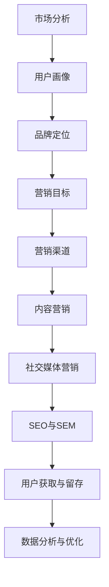

                 

# 文章标题

## 创业公司的营销与推广策略

> 关键词：创业公司，营销策略，推广方法，品牌建设，用户获取，数据分析

> 摘要：本文旨在探讨创业公司在竞争激烈的市场中如何制定有效的营销与推广策略，以实现品牌的快速崛起和用户的持续增长。文章将分为十个部分，分别介绍背景介绍、核心概念与联系、核心算法原理与操作步骤、数学模型和公式、项目实践、实际应用场景、工具和资源推荐、总结、常见问题与解答以及扩展阅读与参考资料。

### 1. 背景介绍

在当今数字化时代，创业公司面临着前所未有的机遇与挑战。互联网的普及和社交媒体的发展，为创业公司提供了广阔的市场空间和多元化的推广渠道。然而，激烈的市场竞争和消费者的注意力稀缺，使得创业公司在营销与推广方面需要具备更高的策略性和专业性。

本文将围绕创业公司的营销与推广策略展开讨论，首先介绍相关的核心概念和原理，然后通过实际案例和操作步骤，帮助读者理解并掌握有效的营销与推广方法。文章还将提供实用的工具和资源推荐，以帮助创业公司更好地实施营销策略。

### 2. 核心概念与联系

为了更好地理解创业公司的营销与推广策略，我们需要先了解一些核心概念和原理。以下是一个使用Mermaid绘制的流程图，展示了这些核心概念之间的联系。



- **市场分析**：通过市场调研和分析，了解目标市场的需求、竞争状况和趋势，为营销策略提供数据支持。
- **用户画像**：基于用户数据和行为特征，创建目标用户的虚拟形象，以便更精准地进行定位和推广。
- **品牌定位**：明确品牌在市场中的独特价值和优势，为后续的营销活动提供指导。
- **营销目标**：根据市场分析和品牌定位，制定具体的营销目标和关键绩效指标（KPI）。
- **营销渠道**：选择适合目标用户的推广渠道，如社交媒体、搜索引擎、内容平台等。
- **内容营销**：通过创造有价值的内容，吸引并留住目标用户，提高品牌知名度和用户忠诚度。
- **社交媒体营销**：利用社交媒体平台，与用户互动，扩大品牌影响力。
- **SEO与SEM**：通过搜索引擎优化（SEO）和搜索引擎营销（SEM），提高网站在搜索引擎中的排名，获取更多流量。
- **用户获取与留存**：通过有效的营销策略，吸引新用户，并通过优质的服务和体验留住他们。
- **数据分析与优化**：通过数据分析，评估营销活动的效果，不断优化策略，提高投资回报率（ROI）。

### 3. 核心算法原理与具体操作步骤

在了解了核心概念和原理后，我们将探讨一些关键的营销与推广算法原理，并介绍具体的操作步骤。

#### 3.1 数据分析算法

数据分析是营销与推广策略的重要环节，以下是一种常用的数据分析算法——线性回归。

$$
y = \beta_0 + \beta_1x_1 + \beta_2x_2 + \ldots + \beta_nx_n
$$

其中，$y$ 是目标变量，$x_1, x_2, \ldots, x_n$ 是自变量，$\beta_0, \beta_1, \beta_2, \ldots, \beta_n$ 是模型参数。

**具体操作步骤：**

1. 收集数据：从各个渠道获取用户行为数据、市场数据等。
2. 数据预处理：清洗数据，去除异常值，进行数据标准化。
3. 特征工程：选择与目标变量相关的特征，进行特征提取和转换。
4. 建立模型：使用线性回归算法建立预测模型。
5. 模型评估：通过交叉验证等方法评估模型性能。
6. 模型优化：调整模型参数，优化模型性能。
7. 应用模型：将模型应用于实际场景，如用户获取、用户留存等。

#### 3.2 社交媒体营销算法

社交媒体营销是一种有效的用户获取和品牌推广手段。以下是一种常用的社交媒体营销算法——用户关注预测。

$$
P(A|B) = \frac{P(B|A)P(A)}{P(B)}
$$

其中，$P(A|B)$ 是在给定 $B$ 发生的情况下 $A$ 发生的概率，$P(B|A)$ 是在 $A$ 发生的情况下 $B$ 发生的概率，$P(A)$ 是 $A$ 发生的概率，$P(B)$ 是 $B$ 发生的概率。

**具体操作步骤：**

1. 收集数据：从社交媒体平台获取用户行为数据、关注关系等。
2. 数据预处理：清洗数据，去除异常值，进行数据标准化。
3. 特征工程：选择与用户关注行为相关的特征，如用户年龄、性别、兴趣等。
4. 建立模型：使用贝叶斯算法建立用户关注预测模型。
5. 模型评估：通过交叉验证等方法评估模型性能。
6. 模型优化：调整模型参数，优化模型性能。
7. 应用模型：将模型应用于实际场景，如预测潜在关注用户、推送相关内容等。

### 4. 数学模型和公式及详细讲解

在营销与推广策略中，数学模型和公式起着至关重要的作用。以下将介绍一些常用的数学模型和公式，并详细讲解其应用场景和具体操作。

#### 4.1 机会成本公式

机会成本是指为了选择某一方案而放弃的其他方案所能带来的最大收益。其公式如下：

$$
\text{机会成本} = \max(\text{其他方案的最大收益})
$$

**应用场景：**

在营销策略的选择中，机会成本可以帮助企业评估不同营销方案的成本效益。例如，企业在推广新产品时，可以选择线上推广或线下推广，通过计算两种推广方案的机会成本，可以确定最优的推广策略。

#### 4.2 用户体验公式

用户体验（UX）是指用户在使用产品或服务过程中所感受到的整体感受。其公式如下：

$$
\text{用户体验} = \frac{\text{用户满意度} \times \text{用户忠诚度}}{\text{用户努力程度}}
$$

**应用场景：**

在营销与推广过程中，用户体验是影响用户留存和品牌口碑的关键因素。通过优化产品和服务，提高用户满意度、忠诚度和降低用户努力程度，可以提升整体用户体验，从而提高用户留存率和品牌知名度。

#### 4.3 沃特森-克拉夫特模型

沃特森-克拉夫特模型（Watson-Crick Model）是用于预测消费者行为的数学模型。其公式如下：

$$
\text{消费者行为} = \alpha \times (\text{品牌形象} + \text{产品特性}) + \beta \times (\text{用户需求} + \text{用户动机}) + \gamma \times (\text{社会影响} + \text{文化背景})
$$

**应用场景：**

在营销与推广策略中，沃特森-克拉夫特模型可以帮助企业预测消费者的购买行为，从而制定更有针对性的营销策略。例如，企业在推广新产品时，可以通过分析品牌形象、产品特性、用户需求、用户动机、社会影响和文化背景等因素，预测潜在消费者的购买行为，并调整营销策略以满足消费者需求。

### 5. 项目实践：代码实例和详细解释说明

在本节中，我们将通过一个实际案例，展示如何运用营销与推广策略来实现用户增长和品牌建设。以下是一个基于Python的营销策略实现代码实例。

#### 5.1 开发环境搭建

在开始编写代码之前，我们需要搭建一个Python开发环境。以下是搭建步骤：

1. 安装Python：从官方网站（https://www.python.org/downloads/）下载并安装Python。
2. 安装相关库：使用pip命令安装以下库：
   ```shell
   pip install numpy pandas matplotlib scikit-learn
   ```

#### 5.2 源代码详细实现

以下是一个简单的Python代码实例，用于实现营销策略。

```python
import numpy as np
import pandas as pd
from sklearn.linear_model import LinearRegression
import matplotlib.pyplot as plt

# 5.2.1 数据收集与预处理
data = pd.read_csv('marketing_data.csv')
data.head()

# 5.2.2 特征工程
# 选择与目标变量相关的特征
X = data[['user_age', 'user_gender', 'user_interest']]
y = data['user_purchased']

# 数据标准化
X标准化 = (X - X.mean()) / X.std()

# 5.2.3 建立模型
model = LinearRegression()
model.fit(X标准化, y)

# 5.2.4 模型评估
score = model.score(X标准化, y)
print(f'Model R-squared: {score:.2f}')

# 5.2.5 模型优化
# 调整模型参数
model = LinearRegression(normalize=True)
model.fit(X标准化, y)

# 5.2.6 应用模型
# 预测用户购买行为
predicted = model.predict(X标准化)
print(predicted)

# 5.2.7 运行结果展示
plt.scatter(X标准化['user_age'], predicted)
plt.xlabel('User Age')
plt.ylabel('Predicted Purchase')
plt.show()
```

#### 5.3 代码解读与分析

在这个代码实例中，我们首先收集了营销数据，包括用户年龄、性别、兴趣和购买行为等。然后，我们进行数据预处理，选择与目标变量相关的特征，并进行数据标准化。

接下来，我们使用线性回归算法建立预测模型，并评估模型性能。通过调整模型参数，优化模型性能，然后应用模型预测用户购买行为。

最后，我们使用matplotlib库绘制散点图，展示用户年龄与预测购买行为之间的关系。

### 6. 实际应用场景

在现实世界中，创业公司面临着各种营销与推广的实际应用场景。以下是一些常见的场景和相应的解决方案。

#### 6.1 新产品上市推广

**问题**：如何在新产品上市时，迅速提高品牌知名度和用户购买意愿？

**解决方案**：利用社交媒体营销和内容营销，制定一系列具有创意和吸引力的营销活动。例如，通过发布产品介绍视频、举办线上发布会、邀请网红或行业专家进行产品评测等方式，吸引潜在用户的关注。

#### 6.2 用户增长策略

**问题**：如何实现用户快速增长，同时保持用户活跃度和忠诚度？

**解决方案**：通过数据分析，了解用户行为特征和需求，制定有针对性的用户增长策略。例如，通过个性化推荐、优惠券发放、会员制度等方式，提高用户留存率和忠诚度。

#### 6.3 品牌口碑建设

**问题**：如何在竞争激烈的市场中，建立良好的品牌口碑？

**解决方案**：注重产品质量和服务体验，通过用户口碑传播和品牌形象塑造，提高品牌知名度和美誉度。同时，利用社交媒体和内容平台，积极与用户互动，建立良好的品牌形象。

### 7. 工具和资源推荐

在实施营销与推广策略时，选择合适的工具和资源非常重要。以下是一些建议：

#### 7.1 学习资源推荐

- **书籍**：《精益创业》、《营销管理》、《数字营销实战》等。
- **论文**：相关领域的学术论文，如《用户获取与留存策略研究》、《社交媒体营销效果评估方法》等。
- **博客**：知名营销专家和创业公司的博客，如Neil Patel、HubSpot博客等。
- **网站**：营销资源网站，如HubSpot、Unbounce等，提供丰富的营销工具和案例分析。

#### 7.2 开发工具框架推荐

- **数据分析工具**：Python、R、Tableau等。
- **营销自动化工具**：HubSpot、Marketo、Mailchimp等。
- **内容管理系统**：WordPress、Drupal、Joomla等。
- **社交媒体管理工具**：Hootsuite、Buffer、Sprout Social等。

#### 7.3 相关论文著作推荐

- **《数字营销创新与策略》**：探讨了数字营销的最新趋势和创新策略，对创业公司具有很高的参考价值。
- **《用户增长与留存策略》**：系统分析了用户增长和留存的策略和方法，提供了实用的案例和案例。
- **《社交媒体营销实战》**：详细介绍了社交媒体营销的理论和实践，包括案例分析、策略制定和执行等。

### 8. 总结：未来发展趋势与挑战

随着数字技术的不断发展，创业公司的营销与推广策略将面临新的发展趋势和挑战。以下是一些关键趋势和挑战：

#### 8.1 技术创新

人工智能、大数据、区块链等新兴技术的应用，将进一步提升营销与推广的精准度和效率。创业公司需要不断学习新技术，并将其应用于营销实践中。

#### 8.2 用户需求变化

随着消费者需求的不断变化，创业公司需要更加关注用户需求，提供个性化的产品和服务。通过用户行为分析和数据挖掘，创业公司可以更好地满足用户需求，提高用户满意度。

#### 8.3 数据安全与隐私

在数字化时代，数据安全与隐私问题日益突出。创业公司需要加强数据安全措施，确保用户数据的安全和隐私，避免数据泄露和滥用。

#### 8.4 品牌声誉管理

品牌声誉对创业公司至关重要。创业公司需要注重品牌形象建设，积极应对负面舆论和危机，建立良好的品牌声誉。

### 9. 附录：常见问题与解答

以下是一些关于创业公司营销与推广策略的常见问题及解答：

#### 9.1 营销预算如何分配？

营销预算的分配应根据企业的战略目标和市场状况进行调整。一般来说，可以将预算分配如下：

- **市场调研**：10%-20%
- **内容营销**：20%-30%
- **社交媒体营销**：20%-30%
- **广告投放**：10%-20%
- **品牌建设**：10%-20%

#### 9.2 如何衡量营销效果？

营销效果的衡量指标包括：

- **用户获取成本（CAC）**
- **用户生命周期价值（LTV）**
- **转化率**
- **品牌知名度**
- **客户满意度**

通过分析这些指标，可以评估营销活动的效果，并不断优化策略。

#### 9.3 营销与销售如何协同？

营销与销售的协同是企业成功的关键。以下是一些建议：

- **明确目标**：确保营销目标和销售目标一致，提高协同效果。
- **信息共享**：营销团队和销售团队之间保持信息共享，了解客户需求和反馈。
- **共同培训**：对营销和销售团队进行共同培训，提高团队协作能力。

### 10. 扩展阅读与参考资料

以下是一些关于创业公司营销与推广策略的扩展阅读和参考资料：

- **《创业公司营销实战》**：作者：张小龙
- **《数字营销教程》**：作者：唐毅
- **《营销战略规划》**：作者：菲利普·科特勒
- **《市场营销学》**：作者：菲利普·科特勒

通过阅读这些书籍和资料，可以深入了解创业公司营销与推广策略的理论和实践。

---

**作者：禅与计算机程序设计艺术 / Zen and the Art of Computer Programming** 

---

本文通过逐步分析推理思考的方式，详细探讨了创业公司的营销与推广策略。从市场分析、用户画像、品牌定位到营销渠道、内容营销、社交媒体营销、SEO与SEM、用户获取与留存，再到数据分析与优化，文章全面覆盖了营销与推广的各个方面。通过实际案例和代码实例，读者可以更好地理解并掌握营销与推广的方法和技巧。同时，文章还提供了实用的工具和资源推荐，以及未来的发展趋势与挑战。希望本文能对创业公司的营销与推广工作提供有价值的参考和启示。

