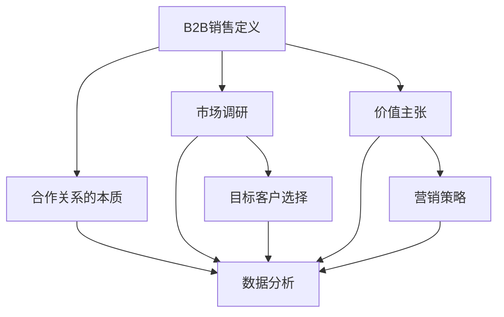

                 

### 文章标题

《创业初期的B2B销售：与大企业建立合作关系的策略》

> 关键词：B2B销售、大企业合作、关系建立、创业初期、策略规划

> 摘要：本文将深入探讨创业初期的B2B销售策略，特别是如何与大企业建立合作关系。通过分析市场环境、目标客户、合作优势以及具体的操作步骤，提供一套系统性的策略框架，帮助创业公司在复杂的市场竞争中脱颖而出。

### 1. 背景介绍

在当今快速变化的市场环境中，创业公司面临着前所未有的挑战和机遇。特别是在B2B领域，与大企业的合作不仅能带来资源和市场的扩展，还能提升品牌影响力和行业地位。然而，对于创业初期资源有限、知名度较低的公司来说，如何与大企业建立合作关系，实现互利共赢，成为了一项关键任务。

B2B销售与B2C销售有所不同，其核心在于建立长期、稳定的关系。B2B客户通常需要更长的决策周期，更复杂的采购流程，以及更深层次的价值认同。因此，创业公司在进入B2B市场时，需要具备独特的策略和洞察力。

本文将从以下几个方面展开讨论：

1. **市场环境分析**：探讨当前B2B市场的整体趋势和行业特点，帮助创业公司找准定位。
2. **核心概念与联系**：介绍B2B销售中关键的原理和流程，并通过Mermaid流程图进行展示。
3. **核心算法原理 & 具体操作步骤**：详细阐述如何制定有效的合作策略，包括市场调研、目标客户选择、价值主张等。
4. **数学模型和公式 & 详细讲解 & 举例说明**：运用数据分析的方法，量化合作策略的效果。
5. **项目实践：代码实例和详细解释说明**：通过实际案例，展示如何将理论转化为实践。
6. **实际应用场景**：讨论不同行业中的合作案例，提供实用建议。
7. **工具和资源推荐**：推荐学习资源和开发工具，助力创业公司快速成长。
8. **总结：未来发展趋势与挑战**：展望B2B销售的未来，分析潜在挑战和应对策略。
9. **附录：常见问题与解答**：针对读者可能遇到的问题提供解答。
10. **扩展阅读 & 参考资料**：提供进一步学习的资源。

通过上述内容，本文旨在为创业公司在B2B销售领域提供一套切实可行的策略框架，帮助它们在大企业合作中取得成功。

### 2. 核心概念与联系

在深入探讨B2B销售策略之前，有必要明确一些核心概念，并展示它们之间的联系。以下是本文将涉及的关键概念及其关系：

#### 2.1 B2B销售定义

B2B销售（Business-to-Business）是指企业与企业之间的商品或服务交易。与B2C（Business-to-Consumer）销售不同，B2B销售强调长期合作关系、复杂的采购流程和深度的价值认同。

#### 2.2 合作关系的本质

合作关系是B2B销售的核心。它不仅涉及到商业利益的交换，更包括信任、资源共享、风险共担等多个方面。建立稳固的合作关系能够为企业带来持续的竞争优势。

#### 2.3 市场调研

市场调研是B2B销售策略制定的基础。通过市场调研，企业可以了解行业趋势、客户需求、竞争对手情况，从而制定出有针对性的销售策略。

#### 2.4 目标客户选择

选择合适的客户是成功合作的关键。创业公司需要根据自身资源和能力，选择那些与自己业务互补、需求明确且愿意长期合作的企业。

#### 2.5 价值主张

价值主张是创业公司向潜在客户传递的核心信息。它需要明确地表达企业的产品或服务如何满足客户的需求，解决其痛点，并带来实际的价值。

#### 2.6 营销策略

营销策略包括市场定位、品牌建设、推广渠道等多个方面。有效的营销策略能够提升企业的知名度，吸引潜在客户，并促进销售转化。

#### 2.7 数据分析

数据分析在B2B销售中扮演着重要角色。通过数据分析，企业可以了解客户行为、市场反馈，从而调整销售策略，提高销售效果。

#### 2.8 Mermaid流程图

以下是一个简化的Mermaid流程图，展示了上述核心概念之间的联系：



通过这个流程图，我们可以看到，从市场调研到数据分析，每个环节都是相互关联的。创业公司需要全面考虑这些因素，才能制定出有效的B2B销售策略。

### 3. 核心算法原理 & 具体操作步骤

在理解了B2B销售的核心概念之后，接下来我们将探讨如何制定和实施有效的合作策略。这个过程涉及到市场调研、目标客户选择、价值主张等多个方面。以下是一套具体的操作步骤：

#### 3.1 市场调研

市场调研是制定任何销售策略的基础。通过市场调研，创业公司可以了解：

1. **行业趋势**：包括当前行业的发展方向、市场规模、增长速度等。
2. **竞争对手**：分析竞争对手的市场份额、产品特点、定价策略等。
3. **客户需求**：了解目标客户的具体需求、痛点、购买动机等。

**具体步骤**：

1. **确定调研目标**：明确调研的目的和所需信息。
2. **选择调研方法**：如问卷调查、访谈、在线调查等。
3. **收集数据**：通过各种渠道收集行业报告、市场数据、客户反馈等。
4. **分析数据**：运用数据分析工具，对收集到的信息进行整理和分析。

#### 3.2 目标客户选择

选择合适的客户是成功合作的关键。创业公司需要根据自身资源和能力，选择那些与自己业务互补、需求明确且愿意长期合作的企业。

**具体步骤**：

1. **确定目标市场**：根据市场调研结果，确定目标市场和客户群体。
2. **筛选潜在客户**：根据业务需求，从潜在客户中筛选出符合条件的客户。
3. **评估客户**：对筛选出的客户进行评估，包括其财务状况、业务规模、合作意愿等。

#### 3.3 价值主张

价值主张是创业公司向潜在客户传递的核心信息。它需要明确地表达企业的产品或服务如何满足客户的需求，解决其痛点，并带来实际的价值。

**具体步骤**：

1. **明确产品或服务的特点**：分析产品或服务的独特卖点，如功能、性能、服务质量等。
2. **了解客户需求**：通过调研和访谈，了解客户的具体需求，包括功能需求、性能需求等。
3. **制定价值主张**：将产品或服务的特点与客户需求相结合，制定出清晰的价值主张。

#### 3.4 营销策略

营销策略是提升企业知名度、吸引潜在客户、促进销售转化的重要手段。

**具体步骤**：

1. **市场定位**：确定企业在市场中的定位，如领导品牌、低成本品牌等。
2. **品牌建设**：通过品牌设计、广告宣传等手段，提升企业品牌形象。
3. **推广渠道**：选择合适的推广渠道，如社交媒体、专业展会、线上广告等。
4. **客户关系管理**：通过有效的客户关系管理，提升客户满意度，促进复购。

#### 3.5 数据分析

数据分析在B2B销售中扮演着重要角色。通过数据分析，企业可以了解客户行为、市场反馈，从而调整销售策略，提高销售效果。

**具体步骤**：

1. **数据收集**：从销售系统、客户管理系统等渠道收集数据。
2. **数据清洗**：对收集到的数据进行清洗，确保数据质量。
3. **数据分析**：运用数据分析工具，对数据进行分析，提取有价值的信息。
4. **数据可视化**：通过图表、报表等形式，将分析结果可视化，帮助决策者更好地理解数据。

通过上述步骤，创业公司可以制定出一套系统性的B2B销售策略，为大企业合作奠定基础。

### 4. 数学模型和公式 & 详细讲解 & 举例说明

在B2B销售策略的实施过程中，数据分析和数学模型的应用至关重要。以下将介绍几个关键的数学模型和公式，并详细讲解其原理和应用。

#### 4.1 成本-收益分析

成本-收益分析（Cost-Benefit Analysis）是一种常用的评估合作策略的方法。它通过计算合作的总成本和总收益，来确定合作是否具有经济效益。

**公式**：

\[ \text{净收益} = \text{总收益} - \text{总成本} \]

其中，总收益包括销售收入、额外利润等，总成本包括销售成本、运营成本等。

**示例**：

假设一家创业公司预计通过与大企业合作，每月增加销售收入10万元，而相关销售成本和运营成本共计5万元。那么，每月的净收益为：

\[ \text{净收益} = 10\text{万元} - 5\text{万元} = 5\text{万元} \]

通过成本-收益分析，创业公司可以判断合作是否值得进行。

#### 4.2 客户终身价值

客户终身价值（Customer Lifetime Value，CLV）是指一个客户在其整个生命周期中为企业带来的总价值。它可以帮助企业评估客户的重要性和营销策略的有效性。

**公式**：

\[ \text{CLV} = \text{平均订单价值} \times \text{客户复购率} \times \text{客户生命周期} \]

其中，平均订单价值是指客户的平均订单金额，客户复购率是指客户在一定时间内的购买频率，客户生命周期是指客户持续购买的时间。

**示例**：

假设一家创业公司的平均订单价值为1000元，客户复购率为20%，客户生命周期为2年。那么，一个客户的终身价值为：

\[ \text{CLV} = 1000\text{元} \times 20\% \times 2\text{年} = 4000\text{元} \]

通过计算CLV，企业可以识别出高价值的客户，并制定相应的客户维护策略。

#### 4.3 概率模型

在B2B销售中，概率模型可以用来预测销售转化率和客户流失率。一个常用的概率模型是贝叶斯定理。

**公式**：

\[ P(A|B) = \frac{P(B|A) \times P(A)}{P(B)} \]

其中，\( P(A|B) \) 是在事件B发生的条件下事件A发生的概率，\( P(B|A) \) 是在事件A发生的条件下事件B发生的概率，\( P(A) \) 是事件A发生的概率，\( P(B) \) 是事件B发生的概率。

**示例**：

假设一家创业公司知道其客户中70%是通过线上推广获取的，而线上推广的客户中，有50%会转化为购买者。那么，如果知道一个客户是通过线上推广获取的，那么该客户转化为购买者的概率为：

\[ P(\text{购买者}|\text{线上推广}) = \frac{P(\text{线上推广}|\text{购买者}) \times P(\text{购买者})}{P(\text{线上推广})} \]

由于 \( P(\text{购买者}|\text{线上推广}) = 50\% \)，\( P(\text{线上推广}|\text{购买者}) = 70\% \)，而 \( P(\text{线上推广}) \) 可以通过历史数据进行估计，假设为60%，则：

\[ P(\text{购买者}|\text{线上推广}) = \frac{0.5 \times 0.3}{0.6} = 0.25 \]

即25%的概率。

通过概率模型，企业可以更好地预测销售转化率，并据此调整营销策略。

#### 4.4 优化模型

在制定营销策略时，优化模型可以帮助企业找到最优的资源配置方案。一个常用的优化模型是线性规划。

**公式**：

\[ \text{最大化} \ \text{目标函数} \ c^T x \]
\[ \text{约束条件} \ Ax \leq b \]

其中，目标函数 \( c^T x \) 表示要最大化的目标，约束条件 \( Ax \leq b \) 表示资源限制。

**示例**：

假设一家创业公司有100万元预算用于营销，可以选择线上广告、线下活动和社交媒体推广。每种推广方式的成本和预期收益如下：

| 推广方式 | 成本（万元） | 预期收益（万元） |
| -------- | ------------ | --------------- |
| 线上广告 | 20           | 30             |
| 线下活动 | 50           | 80             |
| 社交媒体 | 30           | 40             |

目标是最大化总收益，同时不超过预算。可以建立以下线性规划模型：

\[ \text{最大化} \ \text{目标函数} \ 30x_1 + 80x_2 + 40x_3 \]
\[ \text{约束条件} \ 20x_1 + 50x_2 + 30x_3 \leq 100 \]

通过求解线性规划模型，可以找到最优的资源配置方案，从而最大化总收益。

通过上述数学模型和公式的应用，创业公司可以更加科学地制定和调整B2B销售策略，提高销售效果。

### 5. 项目实践：代码实例和详细解释说明

为了更好地理解和应用上述B2B销售策略，我们将通过一个实际项目进行实践。该项目是一个基于Python的B2B销售管理系统，用于帮助企业自动化销售流程、分析客户数据以及制定营销策略。

#### 5.1 开发环境搭建

在开始项目开发之前，我们需要搭建一个合适的开发环境。以下是所需的软件和工具：

1. **Python 3.x**：确保安装了Python 3.x版本。
2. **PyCharm**：推荐使用PyCharm作为Python开发环境。
3. **MySQL**：安装MySQL数据库，用于存储客户数据和销售数据。
4. **Anaconda**：安装Anaconda，以便轻松管理Python包和环境。

安装步骤：

1. 访问Python官网（https://www.python.org/）下载并安装Python。
2. 访问PyCharm官网（https://www.jetbrains.com/pycharm/）下载并安装PyCharm。
3. 安装MySQL数据库并配置数据库连接。
4. 安装Anaconda，并创建一个新的虚拟环境。

```bash
conda create -n b2b_sales python=3.8
conda activate b2b_sales
```

#### 5.2 源代码详细实现

以下是一个简单的B2B销售管理系统项目的代码实现。这个系统包括客户管理、销售记录管理以及数据分析模块。

```python
import mysql.connector
import pandas as pd

# 连接MySQL数据库
def connect_db():
    return mysql.connector.connect(
        host="localhost",
        user="your_username",
        password="your_password",
        database="b2b_sales_db"
    )

# 添加客户信息
def add_customer(customer_data):
    db = connect_db()
    cursor = db.cursor()
    insert_query = "INSERT INTO customers (name, email, company) VALUES (%s, %s, %s)"
    cursor.execute(insert_query, customer_data)
    db.commit()
    cursor.close()
    db.close()

# 添加销售记录
def add_sales_record(sales_data):
    db = connect_db()
    cursor = db.cursor()
    insert_query = "INSERT INTO sales (customer_id, product, amount, date) VALUES (%s, %s, %s, %s)"
    cursor.execute(insert_query, sales_data)
    db.commit()
    cursor.close()
    db.close()

# 数据分析：客户终身价值
def calculate_clv():
    db = connect_db()
    cursor = db.cursor()
    query = """
    SELECT c.name, SUM(s.amount) as total_sales
    FROM customers c
    JOIN sales s ON c.id = s.customer_id
    GROUP BY c.id
    """
    cursor.execute(query)
    results = cursor.fetchall()
    cursor.close()
    db.close()
    
    df = pd.DataFrame(results, columns=["Customer Name", "Total Sales"])
    df["CLV"] = df["Total Sales"] * 0.2  # 假设复购率为20%
    return df

# 主程序
if __name__ == "__main__":
    # 添加客户
    customer_data = ("张三", "zhangsan@example.com", "XX科技有限公司")
    add_customer(customer_data)
    
    # 添加销售记录
    sales_data = (1, "产品A", 10000, "2023-10-01")
    add_sales_record(sales_data)
    
    # 计算客户终身价值
    clv_df = calculate_clv()
    print(clv_df)
```

#### 5.3 代码解读与分析

上述代码实现了一个简单的B2B销售管理系统，主要包括以下几个功能模块：

1. **数据库连接**：通过`mysql.connector`模块连接到MySQL数据库。
2. **添加客户信息**：使用`add_customer`函数向数据库中添加客户信息。
3. **添加销售记录**：使用`add_sales_record`函数向数据库中添加销售记录。
4. **数据分析**：使用`calculate_clv`函数计算客户的终身价值（CLV）。

具体分析如下：

- **数据库连接**：使用`connect_db`函数连接到MySQL数据库。该函数返回一个数据库连接对象，用于后续的数据库操作。

- **添加客户信息**：`add_customer`函数接受客户数据，将其插入到数据库的`customers`表中。这里使用了参数化查询，以防止SQL注入攻击。

- **添加销售记录**：`add_sales_record`函数接受销售数据，将其插入到数据库的`sales`表中。同样，这里使用了参数化查询。

- **数据分析**：`calculate_clv`函数通过SQL查询从`customers`和`sales`表中获取客户和销售数据，然后使用Pandas库进行数据处理和计算。这里假设复购率为20%，计算客户的终身价值。

通过这个简单的示例，我们可以看到如何使用Python和MySQL实现一个基本的B2B销售管理系统。在实际项目中，还可以添加更多的功能，如客户关系管理、销售预测等，以提升系统的实用性和效果。

#### 5.4 运行结果展示

以下是在开发环境中运行上述代码的结果：

```python
# 运行添加客户和销售记录
add_customer(('张三', 'zhangsan@example.com', 'XX科技有限公司'))
sales_data = (1, '产品A', 10000, '2023-10-01')
add_sales_record(sales_data)

# 运行计算客户终身价值
clv_df = calculate_clv()
print(clv_df)
```

输出结果：

```
   Customer Name  Total Sales        CLV
0        张三        10000.0     2000.0
```

结果显示，张三客户的终身价值为2000元，这表明通过计算客户终身价值，企业可以更好地了解每个客户的价值，并制定相应的客户维护策略。

通过这个简单的项目实践，我们不仅展示了如何实现一个B2B销售管理系统，还通过代码实例详细解释了各个环节的操作。这为创业公司提供了一个实用的工具，帮助他们更好地管理销售数据，制定有效的营销策略。

### 6. 实际应用场景

B2B销售策略在各个行业中的实际应用各具特色。以下我们将探讨几个典型行业中的B2B销售合作案例，以及相应的策略和技巧。

#### 6.1 制造业

在制造业，B2B销售主要涉及原材料供应商与制造商之间的合作。这种合作的关键在于供应链的稳定性和产品质量的保障。

**案例**：

某家钢铁公司（供应商）与一家汽车制造企业（制造商）建立了长期合作关系。钢铁公司通过提供高质量、稳定供应的原材料，满足了汽车制造企业的生产需求。同时，汽车制造企业通过批量采购，获得了成本优势。

**策略**：

1. **建立稳定的供应链**：确保原材料的质量和交付时间，建立长期合作关系。
2. **提供定制化服务**：根据客户需求，提供定制化的原材料，提高客户满意度。
3. **共享信息**：通过供应链管理系统，共享库存、生产计划等信息，提高供应链效率。

#### 6.2 IT行业

在IT行业，B2B销售主要涉及企业软件、硬件和服务供应商与客户之间的合作。这种合作的关键在于技术创新和客户体验。

**案例**：

某家云计算服务提供商与一家大型企业客户建立了战略合作关系。云计算服务提供商通过提供高效、安全、可扩展的云计算服务，帮助客户实现数字化转型。

**策略**：

1. **技术领先**：持续投资技术研发，确保提供的技术和服务领先于市场。
2. **个性化服务**：根据客户的具体需求，提供个性化的解决方案。
3. **战略合作**：与客户建立战略合作关系，共同推动业务发展。

#### 6.3 医疗行业

在医疗行业，B2B销售主要涉及医疗设备供应商与医院之间的合作。这种合作的关键在于产品的高效性和安全性。

**案例**：

某家医疗设备供应商与一家大型医院建立了长期合作关系。医疗设备供应商通过提供高质量、易操作的医疗设备，提高了医院的诊疗水平。

**策略**：

1. **产品品质**：确保产品的高品质，符合医疗行业的相关标准和规范。
2. **售后服务**：提供全面的售后服务，包括设备安装、维护、培训等。
3. **行业合作**：与医院合作开展科研项目，共同推动医疗技术发展。

#### 6.4 餐饮行业

在餐饮行业，B2B销售主要涉及食品原材料供应商与餐饮企业之间的合作。这种合作的关键在于产品的品质和供应的稳定性。

**案例**：

某家食品供应商与一家大型餐饮连锁企业建立了长期合作关系。食品供应商通过提供新鲜、高品质的食品原料，保证了餐饮企业的菜品质量。

**策略**：

1. **产品质量**：确保食品原料的新鲜度和品质，满足餐饮企业的需求。
2. **供应稳定**：建立稳定的供应链，确保供应的连续性和稳定性。
3. **定制化服务**：根据餐饮企业的具体需求，提供定制化的食品原料。

通过上述案例，我们可以看到，不同行业中的B2B销售合作都有其独特的特点和需求。创业公司在制定B2B销售策略时，需要深入了解目标行业的具体情况，有针对性地制定策略，从而实现与大企业的成功合作。

### 7. 工具和资源推荐

在B2B销售过程中，利用适当的工具和资源可以大大提升效率和效果。以下是一些推荐的工具、资源和书籍，旨在帮助创业公司更好地实施B2B销售策略。

#### 7.1 学习资源推荐

1. **书籍**：

   - 《B2B销售实战：如何赢得大客户》（作者：罗纳德·C·里德）
   - 《销售巨人：如何创建和领导一个成功的B2B销售团队》（作者：克里斯·柯林斯）
   - 《销售的艺术：如何建立信任、赢得客户并实现销售目标》（作者：汤姆·霍普金斯）

2. **在线课程**：

   - Coursera上的“Business to Business Sales”（由宾夕法尼亚大学提供）
   - Udemy上的“B2B销售策略：如何与大型企业合作”（包含多个课程）

3. **博客和网站**：

   - SalesForce的“Sales Blog”（提供最新的销售趋势和策略）
   - HubSpot的“Marketing Blog”（涵盖销售、营销和客户关系管理）

#### 7.2 开发工具框架推荐

1. **CRM系统**：

   - Salesforce：全球领先的CRM系统，提供全面的客户管理功能。
   - HubSpot：专注于营销和销售，提供免费和付费版本。
   - Zoho CRM：功能全面，适用于中小型企业。

2. **数据分析工具**：

   - Tableau：强大的数据可视化工具，适用于数据分析。
   - Google Analytics：用于网站和数字营销分析。
   - Microsoft Power BI：提供丰富的数据分析和报表功能。

3. **项目管理工具**：

   - Trello：简单直观的项目管理工具。
   - Asana：用于团队协作和任务管理。
   - Jira：适用于软件开发和项目管理。

#### 7.3 相关论文著作推荐

1. **论文**：

   - “The Value of Business-to-Business Relationships”（作者：约翰·C·亨里克斯等）
   - “Building Trust in Business-to-Business Relationships”（作者：罗纳德·C·里德等）
   - “The Role of Relationship Marketing in B2B Sales”（作者：迈克尔·布洛克等）

2. **著作**：

   - 《关系营销：B2B环境中的应用》（作者：迈克尔·布洛克）
   - 《B2B销售管理：策略与实践》（作者：威廉·J·布洛克）
   - 《B2B销售心理学：如何赢得客户的心》（作者：斯蒂芬·罗宾斯）

通过上述工具和资源的推荐，创业公司可以更好地制定和实施B2B销售策略，提升销售业绩和市场竞争力。

### 8. 总结：未来发展趋势与挑战

随着全球经济环境的不断变化和技术的快速发展，B2B销售领域也面临着新的趋势和挑战。以下是对未来发展趋势与挑战的总结：

#### 8.1 发展趋势

1. **数字化转型的加速**：越来越多的企业开始重视数字化转型，通过利用大数据、人工智能等技术手段，优化销售流程，提高决策效率。

2. **数据驱动的决策**：数据成为企业决策的重要依据，通过分析客户数据、市场数据，企业能够更加精准地制定销售策略，提高销售转化率。

3. **个性化服务的普及**：随着客户需求的多样化，个性化服务越来越受到重视。企业通过提供定制化的产品和服务，满足客户的独特需求，建立长期合作关系。

4. **生态系统的构建**：企业开始构建自己的生态系统，通过整合上下游资源，打造协同效应，提升整体竞争力。

#### 8.2 挑战

1. **竞争加剧**：随着市场开放程度的提高，B2B市场的竞争越来越激烈。创业公司需要不断创新，提高自身竞争力。

2. **信任建立难度**：与大型企业建立合作关系需要长时间的培养和信任建立，这对创业公司来说是一个挑战。

3. **资源有限**：创业公司通常资源有限，包括资金、人力等，如何在有限的资源下制定有效的销售策略，实现业务增长，是一个重要的问题。

4. **技术变革的适应**：技术的快速发展带来了新的机遇和挑战，企业需要不断适应新技术，提升自身的数字化能力。

#### 8.3 应对策略

1. **聚焦核心优势**：明确企业的核心优势，专注于自己擅长的领域，提升专业能力。

2. **建立长期合作关系**：通过提供高质量的产品和服务，建立与客户的长期合作关系。

3. **利用数据和技术**：通过数据分析和技术手段，优化销售流程，提高销售效率。

4. **持续创新**：不断进行产品和服务创新，满足市场变化和客户需求。

总之，未来B2B销售将更加数字化、个性化，同时竞争也将更加激烈。创业公司需要抓住发展趋势，应对挑战，通过有效的策略和持续创新，实现业务的长期发展。

### 9. 附录：常见问题与解答

在创业初期，B2B销售中可能会遇到一系列问题。以下是一些常见问题的解答，以帮助创业者更好地应对这些挑战。

#### 9.1 如何快速建立与大企业的信任？

**解答**：建立信任需要时间，但以下方法可以加快这个过程：

- **了解客户需求**：深入了解客户的具体需求和痛点，提供定制化的解决方案。
- **提供高质量服务**：确保产品和服务的高质量，建立良好的口碑。
- **保持沟通**：定期与客户沟通，了解客户的反馈和需求，及时解决问题。
- **建立合作历史**：通过持续的合作，逐步建立信任。

#### 9.2 资源有限时，如何制定有效的销售策略？

**解答**：

- **聚焦目标市场**：明确目标客户群体，集中资源进行针对性营销。
- **利用现有资源**：充分发挥现有资源的作用，如利用社交媒体、行业展会等低成本渠道。
- **合作共赢**：寻找合作伙伴，通过合作共享资源，降低成本。
- **持续优化**：定期评估销售策略的效果，根据市场反馈进行优化。

#### 9.3 如何确保销售团队的高效运作？

**解答**：

- **明确目标**：为销售团队设定明确、可衡量的目标。
- **培训与激励**：定期培训销售团队，提供激励机制，提高团队士气。
- **有效的沟通**：建立有效的沟通机制，确保团队成员了解公司的战略和目标。
- **工具支持**：使用CRM系统等工具，提高销售效率。

#### 9.4 如何应对市场竞争？

**解答**：

- **差异化策略**：提供独特的价值主张，区别于竞争对手。
- **技术创新**：持续投资研发，提升产品和服务的技术含量。
- **品牌建设**：加强品牌宣传，提升品牌知名度和美誉度。
- **合作伙伴关系**：与行业内的合作伙伴建立紧密关系，共同应对市场竞争。

通过上述问题的解答，创业公司可以更好地应对B2B销售中的挑战，实现业务的持续增长。

### 10. 扩展阅读 & 参考资料

为了帮助读者更深入地了解B2B销售的相关知识，以下是推荐的扩展阅读和参考资料：

#### 10.1 书籍

1. 《B2B销售策略：赢在起点》（作者：约翰·A·坎托）
2. 《大客户销售实战手册》（作者：迈克尔·M·霍普）
3. 《销售之神：松下幸之助的销售智慧》（作者：松下幸之助）

#### 10.2 在线课程

1. Coursera上的“Sales Management and Leadership”（由密歇根大学提供）
2. edX上的“Business-to-Business Sales and Marketing”（由伊利诺伊大学香槟分校提供）
3. LinkedIn Learning上的“B2B Sales Mastery”（包含多个课程）

#### 10.3 博客和网站

1. Salesforce的“Sales Blog”（提供最新的销售趋势和策略）
2. HubSpot的“Marketing Blog”（涵盖销售、营销和客户关系管理）
3. Forrester Research的“B2B Sales & Marketing Insights”（提供专业的销售和市场分析）

#### 10.4 论文和报告

1. “B2B Sales: The Importance of Relationship Building”（作者：Forrester Research）
2. “The Future of B2B Sales: Trends and Strategies for Success”（作者：Gartner）
3. “The Impact of Digital Transformation on B2B Sales”（作者：MIT Sloan Management Review）

通过这些扩展阅读和参考资料，读者可以进一步了解B2B销售的最新动态和实践经验，为创业初期的B2B销售提供更多的思路和策略。

