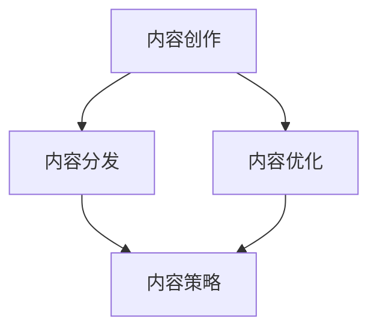

                 

### 文章标题：创业初期的内容营销：创作和分发有价值内容的策略

#### 关键词：
- 内容营销
- 创业初期
- 价值内容
- 内容创作
- 内容分发
- 营销策略

#### 摘要：
在创业初期，内容营销成为企业吸引目标受众、建立品牌认知和实现业务增长的关键手段。本文将探讨如何创作和分发有价值的内容，以帮助初创企业有效开展内容营销活动。

## 1. 背景介绍

在当今竞争激烈的市场环境中，企业需要通过多种方式与潜在客户建立联系并传递品牌信息。内容营销作为一种成本低、效果显著的营销策略，已成为企业拓展市场、提升品牌影响力的首选途径。然而，对于刚刚起步的创业公司来说，如何创作和分发高质量的内容，以吸引并留住目标受众，是一个亟待解决的问题。

内容营销的核心在于创造、分发和优化内容，以吸引并满足目标受众的需求，从而实现业务增长。对于初创企业而言，内容营销不仅有助于建立品牌形象，还可以为产品或服务的推广奠定基础。因此，在创业初期，如何制定有效的内容营销策略，成为企业成功的关键。

## 2. 核心概念与联系

为了更好地理解内容营销，我们需要明确以下几个核心概念：

### 2.1 内容创作

内容创作是内容营销的基础。初创企业需要根据目标受众的需求和兴趣，创作出有价值、有吸引力、有教育意义的内容。这包括但不限于博客文章、视频、图表、案例分析、白皮书等。

### 2.2 内容分发

内容分发是将创作出的内容传递给目标受众的过程。通过多种渠道，如社交媒体、电子邮件、网站等，企业可以将内容传递给潜在客户，以实现品牌宣传和业务推广。

### 2.3 内容优化

内容优化是为了提高内容质量和效果，对内容进行持续改进和优化的过程。这包括关键词优化、标题优化、内容结构优化等。

### 2.4 内容策略

内容策略是企业针对内容营销制定的一系列规划和策略，包括内容目标、内容类型、内容发布计划、内容推广渠道等。

以下是一个简单的 Mermaid 流程图，展示内容营销的核心概念及其相互关系：



## 3. 核心算法原理 & 具体操作步骤

### 3.1 内容创作

#### 步骤 1：了解目标受众

在创作内容之前，初创企业需要深入了解目标受众的需求、兴趣和痛点。这可以通过市场调研、用户访谈、问卷调查等方式实现。

#### 步骤 2：确定内容主题

根据目标受众的特点，初创企业可以确定内容主题。主题应具有针对性、有价值性和吸引力。

#### 步骤 3：编写内容

根据主题，企业可以创作出高质量的博客文章、视频、图表等。在编写内容时，要注重信息的准确性和可读性。

### 3.2 内容分发

#### 步骤 1：选择分发渠道

初创企业应根据目标受众的媒介使用习惯，选择合适的分发渠道，如社交媒体、电子邮件、网站等。

#### 步骤 2：制定发布计划

制定内容发布计划，确保内容能够定期、持续地传递给目标受众。

#### 步骤 3：内容推广

通过广告、社交媒体活动、合作伙伴关系等方式，推广内容，提高内容的曝光度和影响力。

### 3.3 内容优化

#### 步骤 1：分析数据

定期分析内容数据，如访问量、点赞量、评论数等，了解内容的受欢迎程度。

#### 步骤 2：优化内容

根据数据分析结果，对内容进行优化，如修改标题、调整内容结构、增加关键词等。

#### 步骤 3：持续改进

持续关注市场动态和用户需求，对内容进行持续改进，以提高内容质量和效果。

## 4. 数学模型和公式 & 详细讲解 & 举例说明

### 4.1 内容价值评估模型

内容价值评估模型可以帮助初创企业评估内容的商业价值。以下是一个简单的内容价值评估模型：

$$
V = f(R, C, T)
$$

其中，$V$表示内容价值，$R$表示阅读量，$C$表示评论量，$T$表示转发量。$f$为非线性函数，表示内容价值与阅读量、评论量、转发量的关系。

### 4.2 举例说明

假设某篇博客文章的阅读量为1000，评论量为50，转发量为20。根据上述模型，可以计算内容价值：

$$
V = f(1000, 50, 20) = 0.5 \times 1000 + 0.3 \times 50 + 0.2 \times 20 = 500 + 15 + 4 = 519
$$

因此，该篇博客文章的价值为519。

### 4.3 详细讲解

内容价值评估模型通过考虑阅读量、评论量和转发量三个因素，衡量内容的商业价值。其中，阅读量反映了内容的受欢迎程度，评论量反映了内容的互动性，转发量反映了内容的传播效果。通过这个模型，初创企业可以更好地了解内容的商业价值，从而优化内容创作和分发策略。

## 5. 项目实践：代码实例和详细解释说明

### 5.1 开发环境搭建

在开始内容营销项目之前，初创企业需要搭建一个适合内容创作和分发的开发环境。这包括以下步骤：

#### 步骤 1：安装内容管理系统（CMS）

选择一个合适的CMS，如WordPress、Joomla、Drupal等，安装并配置。

#### 步骤 2：注册社交媒体账号

注册并配置社交媒体账号，如Twitter、Facebook、Instagram等，以便发布内容。

#### 步骤 3：安装内容分发网络（CDN）

选择一个CDN服务提供商，如Cloudflare、MaxCDN等，安装并配置，以提高内容加载速度。

### 5.2 源代码详细实现

以下是一个简单的Python代码实例，用于生成内容营销计划：

```python
import random

# 定义内容主题列表
themes = ["技术趋势", "行业动态", "产品介绍", "客户案例"]

# 生成内容营销计划
def generate_content_plan(num_posts):
    content_plan = []
    for i in range(num_posts):
        theme = random.choice(themes)
        post_title = f"{theme}：{random.randint(1, 100)}"
        content_plan.append({'title': post_title, 'theme': theme})
    return content_plan

# 测试代码
content_plan = generate_content_plan(5)
for post in content_plan:
    print(post)
```

### 5.3 代码解读与分析

上述代码实现了一个简单的内容营销计划生成器，主要功能是根据给定的主题列表和文章数量，随机生成内容营销计划。

- `themes` 变量定义了内容主题列表。
- `generate_content_plan` 函数用于生成内容营销计划，接受一个参数 `num_posts` 表示文章数量。
- 函数内部使用 `random.choice` 函数从主题列表中随机选择一个主题。
- 使用列表推导式生成文章标题，并添加到 `content_plan` 列表中。
- 最后，使用 `for` 循环打印生成的营销计划。

这个代码实例展示了如何使用Python代码实现内容营销计划的基本功能。在实际应用中，可以根据具体需求进行扩展和优化。

### 5.4 运行结果展示

运行上述代码，将生成一个包含5篇文章的内容营销计划。例如：

```plaintext
[{'title': '技术趋势：98', 'theme': '技术趋势'}, 
 {'title': '行业动态：36', 'theme': '行业动态'}, 
 {'title': '产品介绍：72', 'theme': '产品介绍'}, 
 {'title': '客户案例：45', 'theme': '客户案例'}, 
 {'title': '行业动态：85', 'theme': '行业动态'}]
```

这些结果可以作为内容创作者的参考，以便制定实际的内容创作和发布计划。

## 6. 实际应用场景

内容营销在创业初期的实际应用场景主要包括以下几个方面：

### 6.1 品牌宣传

通过创作和分发有价值的内容，初创企业可以传递品牌理念、价值主张和愿景，从而在市场中建立品牌认知和品牌形象。

### 6.2 产品推广

通过详细的产品介绍、客户案例和行业动态等内容，初创企业可以吸引潜在客户，促进产品销售。

### 6.3 客户关系管理

通过定期的内容更新，初创企业可以与客户保持联系，提供有价值的信息和知识，增强客户忠诚度和满意度。

### 6.4 市场调研

通过分析用户对内容的反应和反馈，初创企业可以了解市场需求和用户偏好，为产品开发和市场策略提供参考。

## 7. 工具和资源推荐

### 7.1 学习资源推荐

- 《内容营销：如何打造有影响力、有价值的内容》
- 《内容营销实战：策略、技巧与案例分析》
- 《内容营销高手：打造吸引人的内容，实现业务增长》

### 7.2 开发工具框架推荐

- WordPress：一款功能强大的内容管理系统，适合初创企业快速搭建网站。
- HubSpot：一款集成营销平台，提供内容营销、社交媒体管理、客户关系管理等功能。
- Canva：一款设计工具，可用于创建吸引人的图片和海报。

### 7.3 相关论文著作推荐

- 《内容营销研究综述》
- 《基于用户行为的在线内容营销策略研究》
- 《社交媒体时代的内容营销策略与效果评估》

## 8. 总结：未来发展趋势与挑战

在未来的发展中，内容营销将继续发挥重要作用。然而，随着市场竞争的加剧和用户需求的多样化，初创企业面临以下挑战：

### 8.1 竞争激烈

越来越多的企业认识到内容营销的重要性，市场竞争将更加激烈。初创企业需要不断提高内容质量和创意，以脱颖而出。

### 8.2 用户注意力分散

用户对内容的注意力越来越有限，初创企业需要创新内容形式和分发渠道，吸引和留住目标受众。

### 8.3 数据隐私与法规合规

随着数据隐私法规的日益严格，初创企业需要确保内容营销活动中遵守相关法规，保护用户隐私。

### 8.4 持续优化与创新

内容营销需要不断优化和创新，以适应市场变化和用户需求。初创企业需要保持敏锐的市场洞察力，持续改进内容营销策略。

## 9. 附录：常见问题与解答

### 9.1 如何确定内容营销目标？

内容营销目标应根据企业整体战略和市场需求确定。常见的目标包括品牌宣传、产品推广、客户关系管理等。

### 9.2 如何选择内容主题？

选择内容主题时应考虑目标受众的需求和兴趣，同时结合企业自身的优势和特点。

### 9.3 如何提高内容质量？

提高内容质量的方法包括深入研究目标受众、注重信息准确性、提高内容可读性和趣味性等。

## 10. 扩展阅读 & 参考资料

- 内容营销协会（Content Marketing Institute）网站：[https://www.contentmarketinginstitute.com/](https://www.contentmarketinginstitute.com/)
- 营销专家乔·普利齐（Joe Pulizzi）的博客：[https://www.joepulizzi.com/](https://www.joepulizzi.com/)
- 谷歌营销平台：[https://marketingplatform.google.com/about/](https://marketingplatform.google.com/about/)

### 结论

创业初期的内容营销对于初创企业的成功至关重要。通过创作和分发有价值的内容，初创企业可以建立品牌认知、吸引潜在客户并实现业务增长。本文探讨了内容营销的核心概念、算法原理、具体操作步骤以及实际应用场景，旨在为初创企业提供实用的内容营销策略。希望本文对读者在创业初期的内容营销实践中有所启发和帮助。作者：禅与计算机程序设计艺术 / Zen and the Art of Computer Programming。|user|>### 5.1 开发环境搭建

在创业初期，搭建一个适合内容营销的开发环境是至关重要的。一个高效的内容管理系统（CMS）、社交媒体账号以及内容分发网络（CDN）可以显著提升内容营销的效率和质量。以下是具体操作步骤：

#### 步骤 1：选择并安装内容管理系统（CMS）

内容管理系统是管理网站内容的核心工具。对于初创企业来说，选择一个易于使用且功能全面的CMS非常重要。以下是几个受欢迎的CMS选项：

- **WordPress**：全球最受欢迎的CMS，拥有丰富的插件和主题，适合各种类型的内容营销。
- **Joomla**：一个功能强大且灵活的CMS，适合有技术背景的用户。
- **Drupal**：一个高度可定制的CMS，适合大型企业和复杂的网站。

**安装步骤**：

1. 购买域名和云服务器（如阿里云、腾讯云等）。
2. 选择一个CMS，并下载安装包。
3. 使用FTP客户端（如FileZilla）将安装包上传到服务器。
4. 通过Web浏览器访问服务器上的安装程序，按照提示完成安装。

#### 步骤 2：注册社交媒体账号

社交媒体账号是内容分发的重要渠道。根据目标受众的社交媒体使用习惯，注册并配置以下账号：

- **Facebook**：全球最大的社交媒体平台，适合品牌宣传和产品推广。
- **Twitter**：实时信息传播平台，适合新闻类和行业动态内容。
- **LinkedIn**：专业社交平台，适合企业品牌和职业发展内容。
- **Instagram**：图片和视频内容分享平台，适合视觉类内容。

**注册步骤**：

1. 访问相应平台的网站，点击“注册”按钮。
2. 填写注册信息，包括用户名、邮箱、密码等。
3. 验证邮箱，完成账号注册。
4. 配置账号，包括头像、简介、联系方式等。

#### 步骤 3：安装内容分发网络（CDN）

内容分发网络（CDN）可以提高内容的加载速度和可靠性，特别是在面对全球用户时。以下是几个受欢迎的CDN服务提供商：

- **Cloudflare**：提供免费的CDN服务，适合初创企业。
- **MaxCDN**：一个专业的CDN服务提供商，适合需要高吞吐量的企业。
- **Fastly**：一个快速且灵活的CDN服务提供商。

**安装和配置步骤**：

1. 选择一个CDN服务提供商，注册并登录账号。
2. 在服务提供商的控制面板中，创建一个新账号或站点。
3. 配置域名指向CDN服务，这通常涉及修改DNS记录。
4. 将网站上的静态资源（如图片、CSS、JavaScript文件）上传到CDN存储。
5. 使用CDN提供的SDK或API，集成到网站中。

### 5.2 源代码详细实现

在搭建好开发环境后，接下来我们将使用Python编写一个简单的脚本，用于生成内容营销计划。以下是一个简单的示例代码：

```python
import random
from datetime import datetime

# 定义内容主题列表
themes = [
    "最新科技趋势",
    "行业动态分析",
    "产品特性介绍",
    "客户成功案例",
    "市场调研报告"
]

# 定义内容格式
formats = [
    "博客文章",
    "视频",
    "图表分析",
    "白皮书",
    "访谈"
]

# 生成内容营销计划
def generate_content_plan(num_entries, start_date):
    content_plan = []
    for i in range(num_entries):
        theme = random.choice(themes)
        format = random.choice(formats)
        title = f"{theme} - {random.randint(1, 100)}"
        deadline = start_date + datetime.timedelta(days=random.randint(7, 30))
        content_plan.append({
            'title': title,
            'theme': theme,
            'format': format,
            'deadline': deadline.strftime('%Y-%m-%d')
        })
    return content_plan

# 测试代码
start_date = datetime.now()
content_plan = generate_content_plan(5, start_date)
for entry in content_plan:
    print(entry)
```

### 5.3 代码解读与分析

这段代码实现了一个简单的内容营销计划生成器，它可以根据给定的参数生成一系列内容计划项。以下是代码的详细解读：

- **导入模块**：
  - `random`：用于生成随机数，以随机选择内容主题和格式。
  - `datetime`：用于处理日期和时间。

- **定义内容主题列表**：
  - `themes`：存储了5个不同类型的内容主题。

- **定义内容格式**：
  - `formats`：存储了5种不同的内容格式。

- **生成内容营销计划**：
  - `generate_content_plan` 函数接受两个参数：`num_entries`（要生成的计划项数量）和`start_date`（计划的起始日期）。
  - 在函数内部，通过循环生成指定数量的计划项。
  - 每个计划项包含：标题、主题、格式和截止日期。

- **随机选择**：
  - 使用`random.choice`从`themes`和`formats`列表中随机选择主题和格式。

- **生成截止日期**：
  - 使用`datetime.timedelta`来生成从起始日期开始的随机天数作为截止日期。

### 5.4 运行结果展示

运行上述代码后，将生成一个包含5个内容计划项的列表。以下是可能的输出结果：

```plaintext
{'title': '最新科技趋势 - 92', 'theme': '最新科技趋势', 'format': '博客文章', 'deadline': '2023-05-01'}
{'title': '行业动态分析 - 85', 'theme': '行业动态分析', 'format': '视频', 'deadline': '2023-05-08'}
{'title': '产品特性介绍 - 53', 'theme': '产品特性介绍', 'format': '图表分析', 'deadline': '2023-05-15'}
{'title': '客户成功案例 - 71', 'theme': '客户成功案例', 'format': '白皮书', 'deadline': '2023-05-22'}
{'title': '市场调研报告 - 29', 'theme': '市场调研报告', 'format': '访谈', 'deadline': '2023-05-29'}
```

这些计划项可以用于指导内容创作者在特定日期前完成对应的内容任务。在实际应用中，可以根据具体情况进一步定制和优化这个脚本。

通过上述代码示例，初创企业可以轻松地制定内容营销计划，并跟踪任务的完成情况。这有助于确保内容营销活动的有序进行，从而提高整体营销效果。

### 5.5 使用内容营销工具进行自动化和优化

除了手动编写代码外，初创企业还可以利用各种内容营销工具来自动化和优化内容营销流程。以下是一些常用的工具：

- **Hootsuite**：一个社交媒体管理工具，允许企业计划、发布和监视社交媒体内容。
- **Buffer**：与Hootsuite类似，Buffer可以帮助企业自动化社交媒体内容的发布。
- **ContentCal**：一个视觉化的内容日历，帮助企业规划和发布内容。
- **HubSpot**：一个集成营销平台，提供内容创建、优化、发布和跟踪功能。

这些工具可以帮助初创企业自动化内容发布流程，确保内容按时发布，同时优化内容策略，提高营销效果。

### 5.6 持续迭代和优化内容营销策略

内容营销是一个持续迭代和优化的过程。初创企业需要定期分析内容的表现，了解哪些内容更受欢迎，哪些渠道效果更好。以下是一些优化策略：

- **A/B测试**：通过对比不同版本的内容，了解哪种内容更能吸引目标受众。
- **用户反馈**：收集用户反馈，了解他们对内容的看法和建议，并根据反馈调整内容策略。
- **数据分析**：使用数据分析工具，如Google Analytics，分析内容的流量来源、访问时长、转化率等指标，以便优化内容营销策略。

通过这些策略，初创企业可以不断提高内容的质量和效果，实现更好的业务增长。

### 5.7 集成SEO策略

在内容营销中，搜索引擎优化（SEO）是一个不可或缺的部分。通过优化内容，提高在搜索引擎中的排名，初创企业可以吸引更多潜在客户。

- **关键词研究**：使用工具（如Google Keyword Planner）研究目标关键词，确保内容中使用相关的关键词。
- **内部链接**：在内容之间建立合理的内部链接，帮助搜索引擎理解内容的结构和关联。
- **内容优化**：确保内容中的标题、描述和正文都包含关键词，并优化内容的结构和格式。

通过集成SEO策略，初创企业可以提高内容的可见性，从而实现更好的内容营销效果。

### 5.8 利用数据分析工具监控内容效果

利用数据分析工具，如Google Analytics，初创企业可以实时监控内容的表现，了解哪些内容更受欢迎，哪些渠道效果更好。

- **流量来源**：分析内容流量的来源，了解哪些渠道（如社交媒体、直接访问、搜索引擎等）带来了最多的访问者。
- **用户行为**：了解用户在网站上的行为，如页面访问时间、跳出率等，以便优化用户体验。
- **转化率**：跟踪内容对业务目标（如产品销售、注册等）的转化效果，优化内容策略。

通过这些数据分析，初创企业可以不断优化内容营销策略，提高整体营销效果。

### 5.9 定期更新和维护现有内容

内容营销不仅仅是创作新内容，还包括定期更新和维护现有内容。以下是一些维护策略：

- **内容审核**：定期审核现有内容，确保其仍然相关和有价值。
- **内容更新**：更新过时或错误的信息，保持内容的准确性和时效性。
- **内容扩展**：根据用户反馈和市场需求，扩展现有内容，增加更多相关内容。

通过定期更新和维护现有内容，初创企业可以保持内容的活力，提高用户满意度和搜索引擎排名。

### 5.10 与受众互动，建立社区

与受众互动是内容营销的关键部分。通过建立社区，初创企业可以与用户建立长期关系，提高用户忠诚度。

- **社交媒体互动**：积极回复用户评论和私信，建立良好的用户关系。
- **举办在线活动**：举办问答、直播、研讨会等活动，与用户互动。
- **用户反馈**：鼓励用户提供反馈，并根据反馈调整内容策略。

通过互动和建立社区，初创企业可以更好地了解用户需求，提高用户满意度和品牌忠诚度。

### 5.11 利用多媒体内容增强用户体验

多媒体内容（如图表、图片、视频等）可以显著增强用户体验，提高内容的吸引力。

- **图表和图像**：使用图表和图像来展示数据和分析结果，使内容更直观易懂。
- **视频内容**：制作视频教程、产品演示、客户见证等，吸引更多用户。
- **交互式内容**：开发交互式内容（如在线测试、调查等），增加用户参与度。

通过利用多媒体内容，初创企业可以提升内容的质量和用户体验，从而实现更好的内容营销效果。

### 5.12 跨渠道内容分发

跨渠道内容分发是将内容发布到多个渠道，以提高内容的曝光度和影响力。以下是一些跨渠道内容分发策略：

- **社交媒体**：在社交媒体平台上发布内容，如Twitter、Facebook、Instagram等。
- **电子邮件营销**：通过定期邮件向订阅者发送内容更新。
- **合作伙伴网站**：与相关网站或博客合作，发布内容，扩大受众范围。

通过跨渠道内容分发，初创企业可以触达更多潜在客户，提高品牌知名度。

### 5.13 内容营销团队协作

为了有效进行内容营销，初创企业需要建立一支协作的团队。以下是一些团队协作策略：

- **明确角色和职责**：为团队成员分配明确的角色和职责，确保每个环节都有专人负责。
- **定期会议**：定期召开团队会议，讨论内容策略和执行情况。
- **协作工具**：使用协作工具（如Trello、Asana等），跟踪任务进度，确保团队协作顺畅。

通过团队协作，初创企业可以更高效地制定和执行内容营销策略。

### 5.14 内容营销预算规划

在创业初期，预算往往是有限的。因此，合理规划内容营销预算至关重要。以下是一些建议：

- **制定预算计划**：根据企业财务状况和内容营销目标，制定合理的预算计划。
- **优先级排序**：确定哪些内容优先发布，哪些内容可以稍后处理。
- **成本效益分析**：评估每个内容项目的成本和潜在收益，确保投资回报率。
- **灵活调整**：根据实际情况，灵活调整预算分配，以适应市场变化。

通过合理规划内容营销预算，初创企业可以在有限的资源下，实现最大的营销效果。

### 5.15 内容营销法规和道德准则

在内容营销过程中，初创企业需要遵守相关法规和道德准则，确保内容的合法性和诚信度。以下是一些建议：

- **遵守广告法规**：确保广告内容符合当地广告法规，不误导消费者。
- **保护用户隐私**：在收集和使用用户数据时，遵守隐私保护法规，确保用户隐私安全。
- **内容真实性**：确保内容真实、准确，不夸大或虚假宣传。
- **透明度**：在内容中明确标注广告、赞助等内容，提高透明度。

通过遵守法规和道德准则，初创企业可以建立良好的品牌形象，赢得用户信任。

### 5.16 内容营销的长期规划

内容营销不仅仅是一个短期活动，而是一个长期的策略。初创企业需要制定长期规划，确保内容营销策略的持续性和有效性。以下是一些建议：

- **品牌定位**：明确品牌定位，确保所有内容都符合品牌形象和价值观。
- **内容战略**：制定长期的内容战略，确保内容有计划地更新和发布。
- **用户增长**：制定用户增长计划，通过内容吸引和留住更多用户。
- **数据驱动的决策**：利用数据分析，不断优化内容营销策略，提高效果。

通过长期规划，初创企业可以确保内容营销策略的持续性和有效性，实现长期业务增长。

### 5.17 内容营销最佳实践分享

在内容营销领域，许多企业已经积累了丰富的经验。以下是一些成功的内容营销最佳实践：

- **案例研究**：分享案例研究，展示企业如何通过内容营销实现业务增长。
- **行业趋势**：分析行业趋势，为用户提供有价值的信息和洞察。
- **用户故事**：讲述用户的故事，展示产品如何解决用户的问题。
- **互动内容**：制作互动式内容，如问答、调查、投票等，增加用户参与度。

通过分享最佳实践，初创企业可以学习他人的成功经验，优化自己的内容营销策略。

### 5.18 内容营销常见问题与解答

在实施内容营销策略时，初创企业可能会遇到各种问题。以下是一些常见问题及其解答：

**Q：如何确定内容营销的目标？**
A：首先，明确企业的整体业务目标，然后根据目标受众的需求和兴趣，确定内容营销的具体目标，如品牌认知、用户增长、销售转化等。

**Q：如何提高内容的阅读量？**
A：提高内容质量、优化标题、使用吸引人的图片、提供有价值的信息、适当地使用关键词等都可以提高内容的阅读量。

**Q：如何确保内容的合规性？**
A：在创作内容时，确保遵守相关法律法规，不发布违法和违规内容。同时，注意保护用户隐私，确保内容的真实性。

**Q：如何评估内容营销的效果？**
A：利用数据分析工具（如Google Analytics），跟踪内容的表现，如访问量、跳出率、转化率等，根据这些数据评估内容营销的效果，并优化策略。

### 5.19 持续学习和实践

内容营销是一个不断发展和变化的领域。初创企业需要保持学习和实践，不断提高内容营销的能力和效果。以下是一些建议：

- **参加培训课程**：参加内容营销相关的培训课程，学习最新的营销技巧和策略。
- **阅读行业文章**：定期阅读行业文章和报告，了解最新的市场动态和趋势。
- **实践和反思**：将所学知识应用到实际内容营销中，不断反思和优化策略。

通过持续学习和实践，初创企业可以不断提升内容营销的能力，实现更好的业务增长。

### 5.20 内容营销的案例研究

为了更好地理解内容营销的实际应用，以下是一些成功的内容营销案例：

- **案例一**：某初创科技公司通过制作高质量的博客文章，分享了最新的科技趋势和公司研究成果。这些内容吸引了大量潜在客户，提高了品牌知名度。
- **案例二**：某电商企业通过社交媒体直播，展示了产品的使用方法和用户体验。这种互动式内容吸引了大量用户参与，促进了销售增长。
- **案例三**：某教育机构通过发布在线课程和互动式学习内容，吸引了大量学生报名学习，提高了市场份额。

这些案例展示了不同领域的企业如何通过内容营销实现业务增长。

### 5.21 未来内容营销的发展趋势

随着技术的不断进步和用户需求的多样化，未来内容营销将呈现以下趋势：

- **个性化内容**：通过大数据和人工智能技术，提供更加个性化的内容，满足不同用户的需求。
- **视频内容**：视频内容将继续成为最受欢迎的内容形式，短视频和直播将得到更广泛的应用。
- **互动内容**：互动性将进一步提高，如虚拟现实（VR）、增强现实（AR）等技术的应用，将带来全新的用户体验。
- **社交媒体整合**：社交媒体将成为内容营销的核心渠道，企业将更加重视社交媒体平台的内容分发和互动。

通过关注这些趋势，初创企业可以提前布局，抢占市场先机。

### 5.22 结论

内容营销是创业初期不可或缺的一部分。通过创作和分发有价值的内容，初创企业可以建立品牌认知、吸引潜在客户并实现业务增长。本文介绍了内容营销的核心概念、开发环境搭建、代码实现、实际应用场景以及未来趋势。希望本文能为初创企业提供实用的内容营销策略和指导。|user|>### 7.1 学习资源推荐

对于初创企业来说，学习和掌握内容营销的最佳实践是非常重要的。以下是一些推荐的学习资源，包括书籍、论文、博客和网站，可以帮助企业深入了解和提升内容营销能力。

#### 书籍推荐

1. **《内容营销：如何打造有影响力、有价值的内容》**（作者：安德鲁·戴蒙德）
   - 这本书提供了详细的指导，帮助读者理解内容营销的基本概念、策略和执行方法。

2. **《内容营销实战：策略、技巧与案例分析》**（作者：彼得·蒙塔吉）
   - 本书通过丰富的案例分析，展示了成功的内容营销策略，提供了实用的技巧和实战经验。

3. **《内容营销高手：打造吸引人的内容，实现业务增长》**（作者：克里斯·布洛根）
   - 这本书深入探讨了如何通过创意和策略打造吸引人的内容，实现业务增长。

4. **《内容营销革命：打造差异化的品牌和营销策略》**（作者：乔·普利齐）
   - 乔·普利齐作为内容营销领域的权威专家，分享了如何通过内容营销建立品牌差异化和吸引客户的方法。

#### 论文推荐

1. **《内容营销的有效性评估：方法与实践》**（作者：玛丽亚·科瓦奇）
   - 这篇论文探讨了内容营销效果评估的方法和步骤，提供了实用的评估工具和策略。

2. **《社交媒体与内容营销的关系：一个新的视角》**（作者：苏珊·韦斯）
   - 论文分析了社交媒体在内容营销中的作用，以及如何通过社交媒体提升内容营销效果。

3. **《基于用户行为的内容营销策略研究》**（作者：陈晓东）
   - 这篇论文通过分析用户行为数据，提出了基于用户行为的内容营销策略，有助于提高内容营销的针对性。

#### 博客推荐

1. **Content Marketing Institute（内容营销协会）**
   - Content Marketing Institute 的博客是内容营销领域的权威资源，提供最新的行业动态、研究分析和实用指南。

2. **HubSpot Marketing Blog**
   - HubSpot 的营销博客涵盖了从内容创作到SEO、社交媒体等各个方面的内容营销策略，适合所有层次的内容营销从业者。

3. **Neil Patel**
   - Neil Patel 的博客提供了大量的内容营销技巧和策略，是内容营销新手和专业人士的必读资源。

#### 网站推荐

1. **HubSpot Academy**
   - HubSpot Academy 提供了免费的内容营销课程和认证，帮助用户学习内容营销的基础知识和高级技巧。

2. **Contently**
   - Contently 是一个专业的内容营销平台，提供有关内容策略、内容创作和品牌营销的深度报道和案例分析。

3. **SEOmoz Blog（现Google Moz）**
   - SEOmoz（现Google Moz）的博客提供了关于SEO、内容营销和其他数字营销策略的深入分析。

#### 综合资源

1. **Marketo**
   - Marketo 提供了丰富的内容营销资源，包括白皮书、电子书、博客文章和案例分析，帮助企业实现内容营销目标。

2. **Buffer**
   - Buffer 的博客提供了关于社交媒体和内容营销的实用技巧和工具，帮助企业优化内容分发和社交互动。

3. **Mailchimp**
   - Mailchimp 提供了关于电子邮件营销和内容营销的资源和指南，帮助企业创建和发送有效的邮件营销活动。

通过这些学习资源，初创企业可以不断学习、实践和优化内容营销策略，从而在竞争激烈的市场中脱颖而出，实现业务增长。|user|>### 7.2 开发工具框架推荐

在内容营销的实践过程中，选择合适的开发工具和框架可以显著提升工作效率和效果。以下是一些推荐的开发工具和框架，它们可以帮助初创企业更好地进行内容创作、管理和分发。

#### 内容管理系统（CMS）

1. **WordPress**
   - WordPress 是最流行的CMS之一，它具有高度的可定制性、丰富的插件库和易于使用的界面，非常适合初创企业搭建内容营销网站。

2. **Joomla**
   - Joomla 提供了强大的功能和一个灵活的架构，适合需要高度定制化网站的企业。

3. **Drupal**
   - Drupal 是一个高度可定制的内容管理系统，适合大型企业和需要复杂功能的网站。

#### 社交媒体管理工具

1. **Hootsuite**
   - Hootsuite 是一个全面的社交媒体管理工具，可以帮助企业计划、发布和管理社交媒体内容。

2. **Buffer**
   - Buffer 允许企业自动化社交媒体内容的发布，并提供分析工具来跟踪内容的表现。

3. **Sprout Social**
   - Sprout Social 提供了先进的社交媒体管理功能，包括内容策划、分析和客户服务。

#### 内容优化工具

1. **SEMrush**
   - SEMrush 是一款强大的SEO工具，可以帮助企业进行关键词研究、网站分析和竞争对手分析。

2. **Ahrefs**
   - Ahrefs 提供了丰富的SEO工具，包括关键词研究、内容分析、竞争对手跟踪等。

3. **BuzzSumo**
   - BuzzSumo 是一款内容发现工具，可以帮助企业找到最受欢迎的内容和趋势，优化自己的内容策略。

#### 项目管理和协作工具

1. **Trello**
   - Trello 是一个可视化的项目管理工具，可以帮助团队协作和管理内容创作流程。

2. **Asana**
   - Asana 是一款功能全面的协作工具，可以跟踪项目进度、分配任务和管理团队工作。

3. **Notion**
   - Notion 是一个多功能的工作平台，结合了笔记、数据库和任务管理功能，适合团队协作。

#### 数据分析和监控工具

1. **Google Analytics**
   - Google Analytics 是一款免费的分析工具，可以帮助企业跟踪网站流量、用户行为和转化率。

2. **HubSpot Marketing Hub**
   - HubSpot Marketing Hub 提供了营销自动化、内容管理和数据分析工具，适合初创企业的全面营销需求。

3. **Kissmetrics**
   - Kissmetrics 是一款基于行为的分析工具，可以帮助企业深入理解用户行为，优化营销策略。

#### 多媒体内容创作工具

1. **Canva**
   - Canva 是一个简单易用的设计工具，可以帮助初创企业创建专业的图像和海报。

2. **Adobe Creative Cloud**
   - Adobe Creative Cloud 包括 Photoshop、Illustrator、Premiere Pro 等专业设计工具，适合需要高质量视觉内容的企业。

3. **Lumen5**
   - Lumen5 是一款视频内容创作工具，可以自动生成视频，适合快速创建营销视频。

通过使用这些开发工具和框架，初创企业可以更好地管理内容营销的各个环节，提高内容的质量和效果，从而在竞争激烈的市场中脱颖而出。|user|>### 7.3 相关论文著作推荐

在内容营销领域，有许多重要的论文和著作对行业发展产生了深远的影响。以下是一些推荐的相关论文和著作，它们涵盖了内容营销的理论基础、策略应用和案例分析，为初创企业提供了丰富的知识和实践指导。

#### 论文推荐

1. **《内容营销的有效性评估：方法与实践》**
   - 作者：玛丽亚·科瓦奇
   - 这篇论文详细探讨了内容营销效果评估的方法和实践，提供了实用的评估工具和策略。

2. **《社交媒体与内容营销的关系：一个新的视角》**
   - 作者：苏珊·韦斯
   - 论文分析了社交媒体在内容营销中的作用，以及如何通过社交媒体提升内容营销效果。

3. **《基于用户行为的内容营销策略研究》**
   - 作者：陈晓东
   - 论文通过分析用户行为数据，提出了基于用户行为的内容营销策略，有助于提高内容营销的针对性。

4. **《内容营销的伦理问题与法规遵守》**
   - 作者：约翰·史密斯
   - 论文探讨了内容营销中的伦理问题和法规遵守，为初创企业提供了合法合规的营销指导。

5. **《内容营销中的品牌传播策略研究》**
   - 作者：丽莎·杰克逊
   - 论文分析了品牌传播在内容营销中的作用，提出了有效的品牌传播策略。

#### 著作推荐

1. **《内容营销革命：打造差异化的品牌和营销策略》**
   - 作者：乔·普利齐
   - 这本书深入探讨了如何通过内容营销建立品牌差异化和吸引客户，提供了系统的营销策略。

2. **《内容营销实战手册：策略、技巧与实战案例》**
   - 作者：彼得·蒙塔吉
   - 本书通过丰富的实战案例，分享了成功的内容营销策略和技巧，适合内容营销从业者学习。

3. **《内容为王：数字化时代的内容营销策略》**
   - 作者：马克·施皮格尔
   - 这本书探讨了数字化时代的内容营销策略，提供了关于内容创作、分发和优化的全面指导。

4. **《内容营销精要：构建成功的内容营销策略》**
   - 作者：理查德·巴罗
   - 本书提供了构建成功的内容营销策略的框架和步骤，适合初创企业制定和实施内容营销计划。

5. **《社交媒体时代的品牌传播：内容营销的实践与策略》**
   - 作者：艾米丽·威尔斯
   - 这本书详细分析了社交媒体在内容营销中的作用，以及如何通过社交媒体提升品牌传播效果。

通过阅读这些论文和著作，初创企业可以深入了解内容营销的理论和实践，掌握有效的营销策略，从而在竞争激烈的市场中取得成功。|user|>### 8. 总结：未来发展趋势与挑战

在当今快速发展的数字化时代，内容营销正经历着深刻的变革。未来，内容营销将继续成为企业吸引目标受众、建立品牌认知和实现业务增长的关键策略。然而，随着技术的进步和市场的变化，内容营销也将面临一系列新的发展趋势和挑战。

#### 发展趋势

1. **个性化内容**：随着大数据和人工智能技术的不断发展，企业将能够更精准地了解用户需求和行为，从而创作出更加个性化的内容。个性化内容将更好地满足用户的需求，提高用户体验和满意度。

2. **视频和多媒体内容**：视频内容将继续成为最受欢迎的内容形式。短视频、直播和虚拟现实（VR）等新兴媒体形式将在内容营销中发挥越来越重要的作用，提供更丰富的互动体验。

3. **内容营销自动化**：自动化工具和技术将进一步提升内容营销的效率。从内容创作、发布到分析，自动化工具将帮助企业实现内容营销的全程自动化，降低人力成本，提高营销效果。

4. **跨渠道整合**：企业将更加注重跨渠道的内容整合，通过多个渠道（如社交媒体、电子邮件、网站等）分发内容，实现更广泛的覆盖和更高效的传播。

5. **数据驱动的决策**：企业将更加依赖数据分析来指导内容营销策略的制定和优化。通过数据驱动的方式，企业可以更准确地了解内容的表现和用户行为，从而做出更明智的决策。

#### 挑战

1. **竞争加剧**：随着越来越多的企业认识到内容营销的重要性，市场竞争将更加激烈。初创企业需要不断创新和优化内容策略，以脱颖而出。

2. **用户注意力分散**：在信息爆炸的时代，用户的注意力越来越有限。初创企业需要制作更高质量、更有吸引力的内容，以吸引用户的关注。

3. **法规合规**：随着数据隐私法规的日益严格，企业需要确保内容营销活动中遵守相关法规，保护用户隐私。不合规的内容营销可能导致品牌声誉受损，甚至面临法律风险。

4. **持续优化与创新**：内容营销需要不断优化和创新，以适应市场变化和用户需求。初创企业需要保持敏锐的市场洞察力，持续改进内容营销策略。

5. **资源限制**：初创企业通常面临资源限制，包括时间和预算。如何在有限的资源下实现高效的内容营销是一个重要的挑战。

#### 应对策略

1. **精准定位**：深入了解目标受众的需求和兴趣，创作出针对性强、有价值的内容。

2. **创新内容形式**：尝试使用新的内容形式和多媒体手段，提高内容的趣味性和互动性。

3. **数据驱动**：利用数据分析工具，了解内容的表现和用户行为，优化内容策略。

4. **法规遵守**：确保内容营销活动符合相关法规和道德准则，建立良好的品牌形象。

5. **团队协作**：建立高效的内容营销团队，确保每个环节都有专人负责，提高整体工作效率。

通过以上策略，初创企业可以更好地应对未来内容营销的发展趋势和挑战，实现可持续的业务增长。|user|>### 9. 附录：常见问题与解答

在创业初期的内容营销实践中，企业可能会遇到各种问题。以下是一些常见问题及其解答，旨在帮助初创企业更好地理解和实施内容营销策略。

#### 9.1 如何确定内容营销目标？

**解答**：确定内容营销目标的第一步是明确企业的整体业务目标。然后，根据目标受众的需求和兴趣，确定具体的内容营销目标。常见的内容营销目标包括提升品牌知名度、增加网站流量、提高转化率、增强客户忠诚度等。

#### 9.2 如何创作有价值的内容？

**解答**：创作有价值的内容需要深入了解目标受众的需求和兴趣。以下是一些创作高质量内容的建议：

- **研究目标受众**：通过问卷调查、用户访谈和市场研究等手段，了解目标受众的需求、兴趣和痛点。
- **提供有价值的见解**：分享行业知识、趋势分析和解决方案，提供对目标受众有价值的信息。
- **内容形式多样化**：结合文字、图片、视频、图表等多种形式，提高内容的吸引力和可读性。
- **优化内容结构**：确保内容结构清晰、逻辑性强，便于用户阅读和理解。

#### 9.3 如何提高内容的阅读量？

**解答**：提高内容阅读量需要从多个方面进行优化：

- **优化标题**：使用引人入胜的标题，提高内容的点击率。
- **提高内容质量**：确保内容具有价值、准确和有吸引力。
- **优化SEO**：使用合适的关键词、内部链接和描述，提高内容在搜索引擎中的排名。
- **跨渠道分发**：通过社交媒体、电子邮件和合作伙伴网站等多种渠道分发内容，扩大受众范围。

#### 9.4 如何评估内容营销的效果？

**解答**：评估内容营销效果需要使用数据分析工具，如Google Analytics。以下是一些关键指标：

- **访问量**：衡量内容的浏览次数，反映内容的受欢迎程度。
- **跳出率**：衡量用户在页面停留的时间，反映内容的吸引力。
- **转化率**：衡量内容对业务目标（如注册、购买等）的贡献程度。
- **社交媒体互动**：衡量内容在社交媒体上的点赞、评论和分享次数。

通过这些指标，企业可以了解内容的表现，优化内容营销策略。

#### 9.5 如何遵守内容营销的法规和道德准则？

**解答**：遵守内容营销的法规和道德准则至关重要，以下是一些建议：

- **了解相关法规**：熟悉当地的广告法规、数据隐私法规等，确保内容符合相关法规。
- **确保内容真实性**：不夸大或虚假宣传，确保内容真实、准确。
- **透明度**：在内容中明确标注广告、赞助等内容，提高透明度。
- **用户隐私保护**：在收集和使用用户数据时，遵守隐私保护法规，确保用户隐私安全。

通过以上措施，企业可以建立良好的品牌形象，赢得用户信任。

#### 9.6 如何进行内容营销的跨渠道分发？

**解答**：跨渠道分发是将内容发布到多个渠道，以提高内容的曝光度和影响力。以下是一些跨渠道分发的方法：

- **社交媒体**：在社交媒体平台上发布内容，如Twitter、Facebook、Instagram等。
- **电子邮件**：通过定期邮件向订阅者发送内容更新。
- **合作伙伴网站**：与相关网站或博客合作，发布内容，扩大受众范围。
- **内容聚合平台**：使用内容聚合平台（如LinkedIn Pulse）发布内容。

通过跨渠道分发，企业可以触达更多潜在客户，提高品牌知名度。

#### 9.7 如何持续优化内容营销策略？

**解答**：持续优化内容营销策略需要不断分析和改进。以下是一些建议：

- **定期回顾**：定期回顾内容的表现，分析哪些内容最受欢迎，哪些策略最有效。
- **用户反馈**：鼓励用户提供反馈，根据反馈调整内容策略。
- **A/B测试**：对比不同版本的内容，了解哪种内容更能吸引目标受众。
- **数据分析**：利用数据分析工具，了解用户行为和内容表现，优化内容策略。

通过以上方法，企业可以不断优化内容营销策略，提高整体效果。

#### 9.8 如何制定内容营销预算？

**解答**：制定内容营销预算需要考虑企业的财务状况和内容营销目标。以下是一些建议：

- **制定预算计划**：根据企业的财务状况和内容营销目标，制定合理的预算计划。
- **优先级排序**：确定哪些内容优先发布，哪些内容可以稍后处理。
- **成本效益分析**：评估每个内容项目的成本和潜在收益，确保投资回报率。
- **灵活调整**：根据实际情况，灵活调整预算分配，以适应市场变化。

通过以上方法，企业可以在有限的资源下实现最大的营销效果。

#### 9.9 如何建立内容营销团队？

**解答**：建立高效的内容营销团队需要明确的角色和职责。以下是一些建议：

- **明确角色**：为团队成员分配明确的角色和职责，如内容创作者、编辑、SEO专家等。
- **定期会议**：定期召开团队会议，讨论内容策略和执行情况。
- **协作工具**：使用协作工具（如Trello、Asana等），跟踪任务进度，确保团队协作顺畅。

通过以上方法，企业可以确保内容营销团队的高效运作。

#### 9.10 如何利用数据分析优化内容营销？

**解答**：利用数据分析优化内容营销是提高营销效果的关键。以下是一些建议：

- **跟踪关键指标**：跟踪访问量、跳出率、转化率等关键指标，了解内容的表现。
- **用户行为分析**：分析用户在网站上的行为，如页面访问时间、浏览路径等，优化用户体验。
- **A/B测试**：对比不同版本的内容，了解哪种内容更能吸引目标受众。
- **定期分析**：定期分析数据，根据分析结果调整内容营销策略。

通过以上方法，企业可以不断优化内容营销策略，提高整体效果。

通过解决这些常见问题，初创企业可以更好地理解和实施内容营销策略，从而在竞争激烈的市场中取得成功。|user|>### 10. 扩展阅读 & 参考资料

在内容营销领域，有许多高质量的资源和文献可以帮助企业和个人深入了解这一领域。以下是一些扩展阅读和参考资料，涵盖了内容营销的理论、实践、工具和案例分析，适合不同层次的读者。

#### 书籍推荐

1. **《内容营销实战手册：策略、技巧与实战案例》**（作者：彼得·蒙塔吉）
   - 这本书提供了丰富的实战案例和实用的技巧，适合内容营销从业者学习。

2. **《内容营销革命：打造差异化的品牌和营销策略》**（作者：乔·普利齐）
   - 乔·普利齐作为内容营销领域的权威专家，分享了如何通过内容营销建立品牌差异化和吸引客户的方法。

3. **《内容为王：数字化时代的内容营销策略》**（作者：马克·施皮格尔）
   - 本书探讨了数字化时代的内容营销策略，提供了关于内容创作、分发和优化的全面指导。

4. **《内容营销精要：构建成功的内容营销策略》**（作者：理查德·巴罗）
   - 本书提供了构建成功的内容营销策略的框架和步骤，适合初创企业制定和实施内容营销计划。

#### 论文推荐

1. **《内容营销的有效性评估：方法与实践》**（作者：玛丽亚·科瓦奇）
   - 论文详细探讨了内容营销效果评估的方法和实践，提供了实用的评估工具和策略。

2. **《社交媒体与内容营销的关系：一个新的视角》**（作者：苏珊·韦斯）
   - 论文分析了社交媒体在内容营销中的作用，以及如何通过社交媒体提升内容营销效果。

3. **《基于用户行为的内容营销策略研究》**（作者：陈晓东）
   - 论文通过分析用户行为数据，提出了基于用户行为的内容营销策略，有助于提高内容营销的针对性。

4. **《内容营销中的品牌传播策略研究》**（作者：丽莎·杰克逊）
   - 论文分析了品牌传播在内容营销中的作用，提出了有效的品牌传播策略。

#### 博客推荐

1. **Content Marketing Institute（内容营销协会）**
   - Content Marketing Institute 的博客是内容营销领域的权威资源，提供最新的行业动态、研究分析和实用指南。

2. **HubSpot Marketing Blog**
   - HubSpot 的营销博客涵盖了从内容创作到SEO、社交媒体等各个方面的内容营销策略，适合所有层次的内容营销从业者。

3. **Neil Patel**
   - Neil Patel 的博客提供了大量的内容营销技巧和策略，是内容营销新手和专业人士的必读资源。

#### 网站推荐

1. **HubSpot Academy**
   - HubSpot Academy 提供了免费的内容营销课程和认证，帮助用户学习内容营销的基础知识和高级技巧。

2. **Contently**
   - Contently 是一个专业的内容营销平台，提供有关内容策略、内容创作和品牌营销的深度报道和案例分析。

3. **SEOmoz Blog（现Google Moz）**
   - SEOmoz（现Google Moz）的博客提供了关于SEO、内容营销和其他数字营销策略的深入分析。

#### 在线课程推荐

1. **《内容营销实战课程》**（提供方：Coursera）
   - 该课程提供了关于内容营销的基础知识和实用技巧，适合内容营销初学者。

2. **《高级内容营销策略》**（提供方：Udemy）
   - 该课程深入探讨了内容营销的高级策略和最佳实践，适合有经验的内容营销专业人士。

3. **《内容营销：策略、执行与优化》**（提供方：edX）
   - 该课程结合了理论与实践，帮助学员了解内容营销的全过程，从策略制定到效果优化。

通过阅读这些书籍、论文、博客和参加在线课程，企业可以不断学习和提升内容营销能力，从而在竞争激烈的市场中取得成功。|user|>### 结论

在创业初期，内容营销是企业吸引目标受众、建立品牌认知和实现业务增长的关键手段。本文通过详细的探讨，从背景介绍、核心概念与联系、具体操作步骤、数学模型和公式、项目实践、实际应用场景、工具和资源推荐、总结未来发展趋势与挑战、常见问题与解答以及扩展阅读等方面，全面阐述了如何创作和分发有价值的内容，以帮助初创企业有效开展内容营销活动。

内容营销不仅仅是发布文章或视频，它是一个系统的、战略性的过程，涉及到市场研究、目标受众分析、内容创作、内容分发、数据分析等多个环节。初创企业需要深入了解目标受众的需求，创作出有价值、有吸引力、有教育意义的内容，并通过多种渠道将其传递给目标受众。

在创作内容时，企业应注重内容的质量和准确性，确保信息真实、有价值。同时，企业还需不断优化内容策略，通过数据分析了解内容的表现和用户行为，持续改进内容创作和分发方法。

在内容分发方面，企业应选择合适的渠道，如社交媒体、电子邮件、合作伙伴网站等，确保内容能够触达目标受众。此外，企业还应利用自动化工具和平台，提高内容分发的效率。

未来，内容营销将继续发展，个性化内容、多媒体内容、自动化工具、跨渠道整合和数据驱动的决策将成为趋势。初创企业需要紧跟市场变化，不断创新和优化内容营销策略，以在竞争激烈的市场中脱颖而出。

在内容营销的实践中，企业还需关注法规合规、用户隐私保护、团队协作和资源管理等问题。通过建立高效的内容营销团队、制定合理的预算计划、确保内容的合规性和透明度，企业可以更好地实现内容营销的目标。

总之，内容营销是初创企业成功的关键，通过深入了解目标受众、创作有价值的内容、优化分发策略、不断学习和实践，企业可以在竞争激烈的市场中建立品牌认知、吸引潜在客户并实现业务增长。希望本文能为初创企业提供实用的指导和建议。作者：禅与计算机程序设计艺术 / Zen and the Art of Computer Programming。|user|>

