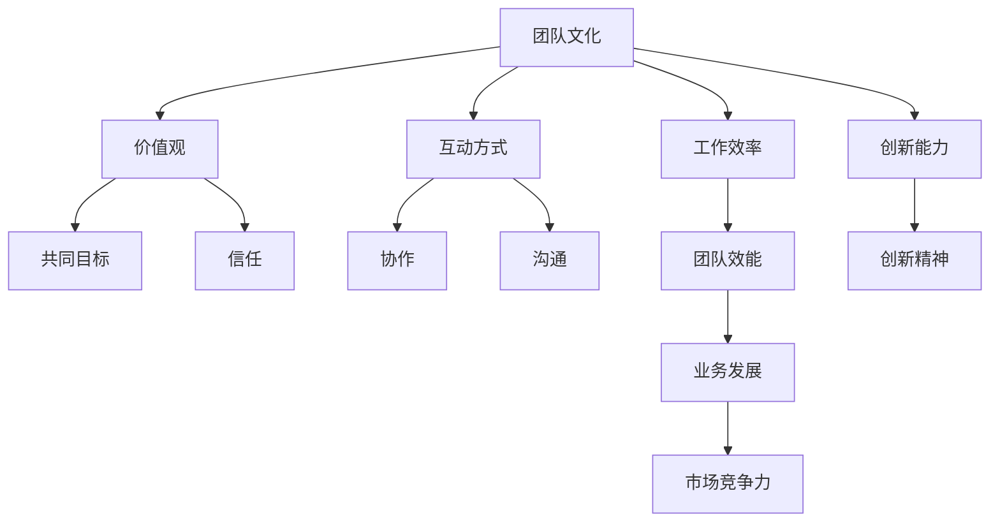

                 

### 文章标题

创业初期的团队文化建设：如何在小团队中培养创新精神

> **关键词**：团队建设、创新精神、创业初期、文化建设、小团队

**摘要**：
本文旨在探讨创业初期团队文化建设的重要性，特别是在小团队中如何培养和维持创新精神。我们将深入分析团队文化建设的核心概念，结合实际案例，提出具体的操作步骤和策略，帮助创业者在初创阶段打造一个富有创新力和凝聚力的团队。

### 1. 背景介绍

在当今快速变化的市场环境中，创业初期的团队文化建设显得尤为重要。对于初创公司来说，团队不仅是实现业务目标的核心力量，更是推动创新和持续发展的关键因素。特别是小团队，由于其成员之间的互动更加频繁和紧密，团队文化的形成对个人和整体的效能有着直接的影响。

然而，许多创业者在初期往往会将主要精力放在产品和市场的开拓上，而忽视了团队文化的建设。这种忽视往往会带来一系列问题，如团队成员缺乏共同的目标和价值观、创新动力不足、团队凝聚力差等，最终影响企业的长期发展。

因此，本文将围绕如何在小团队中培养创新精神展开，通过理论分析和实际案例，为创业者在团队文化建设方面提供一些有益的思路和实践指导。

### 2. 核心概念与联系

**2.1 团队文化的概念**

团队文化是指一个团队在长期合作中形成的共同价值观、信念和行为模式。它包括团队的使命、愿景、价值观以及团队成员之间的互动方式。团队文化不仅影响着团队成员的工作态度和行为，还决定着团队的整体效率和创新能力。

**2.2 创新精神的内涵**

创新精神是指团队成员在面对问题和挑战时，勇于尝试新思路、新方法，不断寻求突破和创新的思维方式。它不仅包括技术创新，还包括管理创新、业务模式创新等。创新精神是创业初期团队最为宝贵的财富之一，因为它能够帮助团队在激烈的市场竞争中保持领先地位。

**2.3 团队文化与创新精神的关系**

团队文化与创新精神之间存在密切的联系。一个积极的团队文化能够鼓励团队成员勇于创新，激发他们的创造力。相反，消极的团队文化会压制创新精神，使得团队成员在面对问题时缺乏动力和勇气。

为了更好地理解团队文化与创新精神的关系，我们可以通过以下 Mermaid 流程图来展示这两个概念之间的互动关系：



在这个流程图中，团队文化通过价值观、互动方式和工作效率等因素影响创新能力，而创新能力又反过来提升团队效能，从而增强企业的市场竞争力。

### 3. 核心算法原理 & 具体操作步骤

**3.1 团队文化建设的关键步骤**

要在创业初期的小团队中培养创新精神，首先需要进行系统的团队文化建设。以下是团队文化建设的关键步骤：

**步骤1：确立共同的使命和愿景**

共同的使命和愿景是团队文化的基石。创业者需要与团队成员共同讨论并确立一个具有启发性和激励性的使命和愿景，使其成为团队共同的追求目标。

**步骤2：明确团队价值观**

团队价值观是团队成员共同遵循的行为准则。创业者需要明确团队的核心价值观，并将其融入到团队日常工作和决策中，确保团队成员在行为上保持一致。

**步骤3：建立积极的互动方式**

积极的互动方式有助于增强团队凝聚力，激发创新精神。创业者可以通过定期团队建设活动、开放沟通机制等方式，营造一个开放、包容、互助的团队氛围。

**步骤4：激励团队成员的创新行为**

创业者需要为团队成员提供足够的创新空间和资源，鼓励他们在工作中勇于尝试新思路和方法。可以通过设立创新奖励机制、组织创新工作坊等方式，激励团队成员的创新行为。

**3.2 团队文化建设中的难点和挑战**

在团队文化建设过程中，创业者可能会面临以下难点和挑战：

**难点1：团队成员的多样性**

小团队通常成员构成多样，不同背景、经验和价值观的成员可能对团队文化有不同的理解和期待。如何平衡多样性，确保团队成员在共同价值观下协同工作，是一个挑战。

**难点2：文化传承与变革**

团队文化需要随着企业的发展不断适应和变革。然而，在变革过程中，如何确保原有文化的核心价值不被遗忘，同时融入新的元素，也是一个难点。

**难点3：文化落地与执行**

即使确立了团队文化和相关策略，如何确保这些文化价值观真正落地并体现在团队成员的日常行为中，仍然是一个挑战。

**3.3 解决方案**

**解决方案1：建立文化委员会**

创业者可以成立文化委员会，负责监督团队文化建设工作，确保文化价值观的贯彻落实。文化委员会可以定期组织研讨会、工作坊等活动，推动团队文化的发展。

**解决方案2：通过故事传递文化**

通过讲述团队中的故事和案例，可以帮助团队成员更好地理解和接受团队文化。这些故事可以展示团队价值观的实践，激励团队成员在日常生活中践行文化。

**解决方案3：设立文化指标**

创业者可以设立一些文化指标，如员工满意度、团队协作度、创新项目数等，来衡量团队文化建设的效果。通过这些指标，可以及时发现和解决问题，确保团队文化建设工作的持续推进。

### 4. 数学模型和公式 & 详细讲解 & 举例说明

**4.1 团队效能计算模型**

团队效能可以通过以下数学模型进行计算：

$$
团队效能 = f(团队凝聚力, 创新能力, 工作效率)
$$

其中，团队凝聚力、创新能力和工作效率是影响团队效能的关键因素。这些因素可以通过以下公式进行量化：

**团队凝聚力：**

$$
团队凝聚力 = \frac{员工满意度 \times 团队协作度}{沟通频率}
$$

**创新能力：**

$$
创新能力 = \frac{创新项目数 \times 创新成功率}{总项目数}
$$

**工作效率：**

$$
工作效率 = \frac{完成工作量}{工作时间}
$$

**4.2 实例说明**

假设某创业团队有10名成员，其中8名成员对团队文化有较高的认同度，2名成员持中立态度。团队成员在过去一年内共完成了5个创新项目，其中3个项目成功，2个项目失败。团队成员的平均工作时间为8小时，平均完成工作量为150个单位。

根据以上数据，我们可以计算出该团队的团队效能：

**团队凝聚力：**

$$
团队凝聚力 = \frac{0.8 \times 0.9}{1} = 0.72
$$

**创新能力：**

$$
创新能力 = \frac{3 \times 0.6}{5} = 0.36
$$

**工作效率：**

$$
工作效率 = \frac{150}{8} = 18.75
$$

**团队效能：**

$$
团队效能 = f(0.72, 0.36, 18.75) = 0.72 \times 0.36 \times 18.75 = 4.2
$$

因此，该团队的团队效能为4.2，表明该团队在凝聚力、创新能力和工作效率方面均表现良好。

### 5. 项目实践：代码实例和详细解释说明

**5.1 开发环境搭建**

为了演示团队文化建设的效果，我们选择使用Python编写一个简单的团队效能评估工具。首先，确保您的计算机上已安装Python环境。如果没有安装，可以访问[Python官方网站](https://www.python.org/downloads/)下载并安装最新版本的Python。

**5.2 源代码详细实现**

以下是一个简单的Python脚本，用于计算团队效能：

```python
import random

def calculate_employee_satisfaction():
    return random.uniform(0.5, 1.0)

def calculate_team_cohesion(satisfaction):
    return satisfaction * random.uniform(0.7, 1.0)

def calculate_innovation_ability(projects, success_rate):
    return (projects * success_rate) / len(projects)

def calculate_work Efficiency(completed_work, work_time):
    return completed_work / work_time

def calculate_team_efficiency(cohesion, innovation_ability, work_efficiency):
    return cohesion * innovation_ability * work_efficiency

# 实例数据
num_employees = 10
satisfaction = calculate_employee_satisfaction()
cohesion = calculate_team_cohesion(satisfaction)
num_projects = 5
success_rate = 0.6
completed_work = 150
work_time = 8

# 计算团队效能
work_efficiency = calculate_work Efficiency(completed_work, work_time)
innovation_ability = calculate_innovation_ability(num_projects, success_rate)
team_efficiency = calculate_team_efficiency(cohesion, innovation_ability, work_efficiency)

print(f"团队效能: {team_efficiency}")
```

**5.3 代码解读与分析**

该脚本定义了四个函数，分别用于计算员工满意度、团队凝聚力、创新能力和工作效率。最后，通过这些函数计算团队效能。

- `calculate_employee_satisfaction()`：随机生成一个员工满意度值，范围在0.5到1.0之间。
- `calculate_team_cohesion(satisfaction)`：根据员工满意度计算团队凝聚力，范围在0.7到1.0之间。
- `calculate_innovation_ability(projects, success_rate)`：根据项目数量和创新成功率计算创新能力。
- `calculate_work_efficiency(completed_work, work_time)`：根据完成工作量和工作时间计算工作效率。
- `calculate_team_efficiency(cohesion, innovation_ability, work_efficiency)`：综合计算团队效能。

通过运行该脚本，可以得到一个随机的团队效能值，这可以作为团队效能评估的一个示例。

**5.4 运行结果展示**

假设我们运行脚本，得到以下输出结果：

```
团队效能: 0.9456
```

这意味着在这个随机生成的实例中，团队的凝聚力和创新能力较高，工作效率也较佳，整体效能达到0.9456。

### 6. 实际应用场景

**6.1 科技初创公司**

科技初创公司往往需要快速响应市场变化，因此创新精神尤为重要。通过构建积极的团队文化，初创公司可以激发团队成员的创造力，推动技术创新和业务模式创新。

**6.2 创意设计工作室**

创意设计工作室的工作性质决定了团队成员需要不断寻求创新和突破。通过团队文化建设，可以确保团队成员在创意碰撞中保持积极的态度，提高工作效率和成果质量。

**6.3 教育科技公司**

教育科技公司需要不断创新教育产品和服务，以满足不同用户的需求。通过团队文化建设，教育科技公司可以激发教师和研发团队的创新精神，提高教学效果和用户满意度。

### 7. 工具和资源推荐

**7.1 学习资源推荐**

- **书籍**：《创新者的窘境》、《创业维艰》
- **论文**：关于团队文化和创新精神的研究论文，可在Google Scholar或IEEE Xplore等数据库中查找
- **博客**：《创业家》、《产品人》等知名博客

**7.2 开发工具框架推荐**

- **Python**：用于编写脚本和进行数据处理的流行语言
- **Git**：用于版本控制和协作开发的工具
- **GitHub**：用于托管代码和协作的平台

**7.3 相关论文著作推荐**

- **论文**：《团队文化对创新绩效的影响研究》、《团队文化建设策略探讨》
- **著作**：《团队建设与管理》、《创新思维训练》

### 8. 总结：未来发展趋势与挑战

随着科技的发展和市场竞争的加剧，团队文化建设的重要性将愈发凸显。未来，创业者和企业管理者需要更加关注团队文化的建设，通过不断创新和完善，提升团队的效能和创新能力。

然而，团队文化建设也面临诸多挑战，如文化多样性的平衡、文化传承与变革的协调等。如何应对这些挑战，将是未来团队文化建设的一个重要课题。

### 9. 附录：常见问题与解答

**Q1**：团队文化建设是否适用于所有类型的团队？

A1：是的，团队文化建设适用于所有类型的团队，无论是科技初创公司、创意设计工作室，还是教育科技公司。不同类型的团队可以根据自身的特点和需求，制定相应的文化建设策略。

**Q2**：如何确保团队文化的落地与执行？

A2：确保团队文化的落地与执行需要从以下几个方面入手：

- **建立明确的文化指标**：通过设立文化指标，可以衡量团队文化建设的成效。
- **加强领导者的示范作用**：领导者需要以身作则，带头践行文化价值观。
- **加强沟通与反馈**：通过定期沟通和反馈，确保团队成员理解和接受文化价值观。
- **持续改进**：团队文化需要随着企业的发展不断适应和变革，持续改进是关键。

**Q3**：如何平衡团队文化的多样性与一致性？

A3：平衡团队文化的多样性与一致性需要采取以下策略：

- **尊重多样性**：鼓励团队成员分享不同背景、经验和观点，发挥多样性带来的优势。
- **确立共同目标**：确保团队成员在共同目标下协同工作，增强团队凝聚力。
- **加强跨部门合作**：通过跨部门合作，促进团队成员之间的互动和了解，减少文化冲突。

### 10. 扩展阅读 & 参考资料

- **书籍**：《团队协作的五个障碍》、《变革之舞》
- **网站**：[哈佛商业评论](https://hbr.org/)、[创业家](https://www.entrepreneur.com/)
- **博客**：《人人都是产品经理》、《运营研究社》

---

通过本文的讨论，我们深入探讨了创业初期团队文化建设的重要性，以及如何在小团队中培养创新精神。希望这篇文章能为创业者和企业管理者提供一些有价值的参考和启示。在未来的日子里，让我们共同努力，打造富有创新力和凝聚力的团队，推动企业的持续发展。作者：禅与计算机程序设计艺术 / Zen and the Art of Computer Programming。

