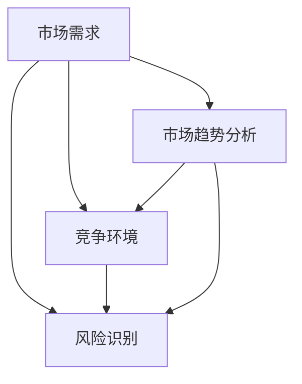

                 

### 背景介绍

#### 市场调研的重要性

创业初期的市场调研是任何创业项目成功的关键步骤之一。它不仅决定了企业的定位和发展方向，还对后续的产品开发和市场推广策略起着至关重要的作用。对于初创企业而言，资源有限，时间宝贵，因此如何高效地进行市场调研，以便在有限的时间内获取最有价值的信息，显得尤为重要。

市场调研的主要目的是为了：

1. **确定市场需求**：通过调研，可以了解目标市场的真实需求和潜在需求，从而确保产品或服务的市场定位准确。
2. **评估竞争环境**：调研可以帮助企业了解竞争对手的产品、市场策略、优势和劣势，从而制定有效的竞争策略。
3. **识别风险和机会**：通过对市场的深入分析，企业可以提前识别潜在的风险和机会，做好风险管理和市场布局。
4. **优化产品和服务**：了解消费者的真实需求和反馈，可以帮助企业不断优化产品和服务，提高用户满意度。

#### 市场调研的基本流程

市场调研通常包括以下几个基本流程：

1. **确定调研目标和问题**：明确调研的目的和要解决的问题，是制定调研计划的前提。
2. **设计调研方案**：包括选择调研方法、确定调研范围、制定调研问卷或访谈提纲等。
3. **数据收集**：根据调研方案，通过实地调查、问卷调查、访谈、网络调研等方式收集数据。
4. **数据分析**：对收集到的数据进行分析，提取有用的信息。
5. **撰写报告**：将分析结果整理成报告，为决策提供依据。

#### 当前市场调研的挑战与机遇

随着互联网和大数据技术的快速发展，市场调研的手段和工具也在不断更新和升级。然而，这也给市场调研带来了新的挑战和机遇：

- **大数据分析**：利用大数据技术，企业可以获取更多、更详细的市场信息，从而更准确地预测市场趋势。
- **在线调研工具**：如问卷调查平台、在线访谈工具等，使得数据收集更加便捷和高效。
- **隐私保护**：随着数据隐私问题的日益突出，如何在不侵犯用户隐私的前提下进行市场调研，成为新的挑战。

然而，随着技术的进步，市场调研也在不断发展和创新，为创业企业提供了更多的机会。例如，通过使用人工智能和机器学习技术，企业可以更准确地分析市场数据和消费者行为，从而做出更明智的决策。

接下来，我们将详细探讨市场调研的核心概念，包括市场需求、竞争环境、风险识别等，并使用Mermaid流程图来展示这些概念之间的联系。

#### 核心概念与联系

在市场调研中，有几个核心概念至关重要，它们相互关联，共同构成了市场分析的基础框架。

##### 1. 市场需求

市场需求是指消费者对某种产品或服务的需求总量。它是市场调研的起点，直接影响产品的市场定位和策略。

- **定义**：市场需求是指在一定时间内，消费者愿意并且有能力购买某种产品或服务的总量。
- **衡量**：通常通过市场调查、消费者调研等方式来衡量，包括定量分析和定性分析。

##### 2. 竞争环境

竞争环境是指企业在市场中面临的直接和间接竞争者的情况。了解竞争环境对于制定有效的市场策略至关重要。

- **定义**：竞争环境包括直接竞争对手和潜在竞争对手，以及他们的市场策略、产品特性、市场份额等。
- **分析**：通过市场调研，分析竞争对手的产品、定价策略、市场定位和市场份额。

##### 3. 风险识别

风险识别是指识别市场调研过程中可能遇到的各种风险，包括市场变化、政策风险、技术风险等。

- **定义**：风险识别是市场调研的必要步骤，目的是提前预测和评估潜在的风险。
- **分类**：风险可以分类为市场风险、政策风险、运营风险等。

##### 4. 市场趋势分析

市场趋势分析是指通过数据分析和市场研究，识别和预测市场的未来发展方向和趋势。

- **定义**：市场趋势分析是一种前瞻性分析，旨在为企业提供战略决策的参考。
- **方法**：包括时间序列分析、回归分析、机器学习预测等。

这些核心概念之间的联系可以用Mermaid流程图来展示，具体如下：



**图1：市场调研核心概念之间的联系**

- **市场需求**是所有分析的基础，直接影响**竞争环境**和**风险识别**。
- **竞争环境**提供了市场定位的参考，同时**风险识别**帮助企业在竞争激烈的环境中规避风险。
- **市场趋势分析**则为企业的长期战略提供了方向，同时也影响**风险识别**，帮助企业更好地应对未来的市场变化。

通过这一流程图，我们可以清晰地看到市场调研中各个核心概念之间的相互作用和影响，为后续的深入分析奠定了基础。

### 核心算法原理 & 具体操作步骤

在市场调研中，核心算法的使用可以帮助企业高效、准确地收集和分析数据。以下将介绍几种常用的核心算法，并详细说明其操作步骤和应用场景。

#### 1. 数据收集算法

数据收集算法是市场调研的第一步，目的是获取有关市场需求、竞争环境、消费者行为等信息。常用的数据收集算法包括问卷调查、实地调查和在线调查。

##### 问卷调查算法

**操作步骤：**

1. **确定调研目标**：明确调研的主题和目标，例如了解消费者对某款产品的满意度。
2. **设计问卷**：根据调研目标设计问卷，包括选择题、评分题、开放式问题等。
3. **抽样**：确定样本大小和抽样方法，确保样本具有代表性。
4. **分发问卷**：通过电子邮件、社交媒体、在线调查平台等方式分发问卷。
5. **收集数据**：收集完成的问卷，确保问卷的质量和有效性。

**应用场景：**

问卷调查算法适用于获取大量消费者的反馈，特别是在新产品开发、市场满意度调研等方面。

##### 实地调查算法

**操作步骤：**

1. **选择调研地点**：选择具有代表性的调研地点，如商场、展会、社区等。
2. **准备调研工具**：包括问卷、录音设备、观察记录表等。
3. **实地调研**：在调研地点进行现场调查，包括面对面访谈、观察、记录等。
4. **数据整理**：将收集到的数据进行整理、编码，确保数据的一致性和完整性。

**应用场景：**

实地调查算法适用于获取实时、详细的市场信息，特别是在竞争对手分析、消费者行为研究等方面。

##### 在线调查算法

**操作步骤：**

1. **选择在线调查平台**：选择合适的在线调查平台，如SurveyMonkey、Google表单等。
2. **设计问卷**：根据调研目标设计在线问卷，确保问卷界面友好、操作简便。
3. **发布问卷**：在线发布问卷，通过社交媒体、邮件、网站链接等方式邀请参与者。
4. **数据收集**：收集在线问卷数据，确保数据的有效性和代表性。

**应用场景：**

在线调查算法适用于快速、高效地收集大量市场数据，特别是在市场趋势分析和消费者行为研究方面。

#### 2. 数据分析算法

数据分析算法用于对收集到的市场调研数据进行处理、分析和解读，以提取有价值的信息和洞察。常用的数据分析算法包括统计分析、机器学习和数据挖掘。

##### 统计分析算法

**操作步骤：**

1. **数据预处理**：清洗和整理收集到的数据，确保数据的完整性和一致性。
2. **描述性分析**：通过均值、中位数、标准差等统计量描述数据的基本特征。
3. **相关性分析**：通过皮尔逊相关系数、斯皮尔曼等级相关系数等分析变量之间的相关性。
4. **回归分析**：通过线性回归、多项式回归等分析变量之间的关系。

**应用场景：**

统计分析算法适用于对市场数据进行初步分析和探索，特别是在描述性统计和简单预测方面。

##### 机器学习算法

**操作步骤：**

1. **数据预处理**：清洗和整理数据，进行特征选择和特征工程。
2. **模型选择**：根据问题类型和数据分析目标选择合适的机器学习模型，如分类、回归、聚类等。
3. **模型训练**：使用训练数据集对模型进行训练，调整模型参数。
4. **模型评估**：使用测试数据集对模型进行评估，调整模型以提高预测准确性。

**应用场景：**

机器学习算法适用于复杂的数据分析和预测，特别是在市场趋势预测、消费者行为分析等方面。

##### 数据挖掘算法

**操作步骤：**

1. **数据预处理**：清洗和整理数据，进行特征选择和特征工程。
2. **模式识别**：通过关联规则挖掘、聚类分析、分类分析等挖掘数据中的潜在模式和关系。
3. **结果解释**：对挖掘出的结果进行解释和验证，确保结果的可靠性和实用性。

**应用场景：**

数据挖掘算法适用于深入挖掘市场数据中的价值和洞察，特别是在市场细分、消费者行为研究等方面。

通过上述核心算法，企业可以高效、准确地收集、分析和解读市场数据，从而为创业初期的决策提供科学依据。在实际应用中，企业应根据具体问题和数据特点选择合适的算法，并进行灵活调整和优化。

### 数学模型和公式 & 详细讲解 & 举例说明

在市场调研中，数学模型和公式发挥着重要作用，它们帮助我们从复杂的数据中提取有价值的信息，并做出基于数据的决策。以下将介绍几种常用的数学模型和公式，并详细讲解其应用方法和实际案例。

#### 1. 指数平滑法

指数平滑法是一种常用的时间序列预测模型，适用于分析市场趋势和预测未来需求。其基本公式如下：

\[ S_t = \alpha \cdot X_t + (1 - \alpha) \cdot S_{t-1} \]

其中，\( S_t \) 表示第 \( t \) 期的预测值，\( X_t \) 表示第 \( t \) 期的实际值，\( \alpha \) 是平滑系数，取值范围在 \( 0 \) 到 \( 1 \) 之间。

**应用步骤：**

1. **选择平滑系数**：根据数据波动情况和预测精度要求选择合适的 \( \alpha \) 值。
2. **初始化预测值**：通常选择第一个实际值作为初始预测值 \( S_1 \)。
3. **迭代计算**：根据公式逐期计算预测值 \( S_t \)。

**实际案例：**假设某公司过去六个月的产品销量数据如下：[100, 120, 110, 130, 140, 150]，使用指数平滑法进行未来一个月的销量预测，取 \( \alpha = 0.2 \)。

- \( S_1 = 100 \)
- \( S_2 = 0.2 \cdot 120 + 0.8 \cdot 100 = 116 \)
- \( S_3 = 0.2 \cdot 110 + 0.8 \cdot 116 = 118.4 \)
- \( S_4 = 0.2 \cdot 130 + 0.8 \cdot 118.4 = 123.52 \)
- \( S_5 = 0.2 \cdot 140 + 0.8 \cdot 123.52 = 128.896 \)
- \( S_6 = 0.2 \cdot 150 + 0.8 \cdot 128.896 = 135.3248 \)

未来一个月的销量预测值为 \( S_7 = 135.3248 \)。

#### 2. 回归分析法

回归分析法是一种常用的统计模型，用于分析变量之间的关系，并预测某一变量的取值。线性回归是最简单和最常用的回归模型，其基本公式如下：

\[ Y = \beta_0 + \beta_1 \cdot X + \epsilon \]

其中，\( Y \) 是因变量，\( X \) 是自变量，\( \beta_0 \) 和 \( \beta_1 \) 是模型参数，\( \epsilon \) 是误差项。

**应用步骤：**

1. **数据收集**：收集因变量和自变量的历史数据。
2. **模型建立**：通过最小二乘法估计模型参数 \( \beta_0 \) 和 \( \beta_1 \)。
3. **模型评估**：计算决定系数 \( R^2 \)，评估模型的拟合程度。
4. **预测**：使用模型进行预测，计算预测值 \( Y \)。

**实际案例：**假设我们要预测某公司未来三个月的产品销量，根据历史数据建立线性回归模型，数据如下：

| 时间 | 销量 |
|------|------|
| 1    | 100  |
| 2    | 120  |
| 3    | 110  |
| 4    | 130  |
| 5    | 140  |
| 6    | 150  |

使用最小二乘法计算回归模型参数：

\[ \beta_0 = \frac{\sum (Y_i - \bar{Y}) \cdot (X_i - \bar{X})}{\sum (X_i - \bar{X})^2} \]
\[ \beta_1 = \frac{\sum (X_i - \bar{X}) \cdot (Y_i - \bar{Y})}{\sum (X_i - \bar{X})^2} \]

其中，\( \bar{Y} \) 和 \( \bar{X} \) 分别是销量和时间的平均值。

计算结果：

\[ \beta_0 = 50 \]
\[ \beta_1 = 20 \]

线性回归模型为：

\[ Y = 50 + 20 \cdot X \]

预测未来三个月的销量：

- 第7个月：\( Y = 50 + 20 \cdot 7 = 170 \)
- 第8个月：\( Y = 50 + 20 \cdot 8 = 190 \)
- 第9个月：\( Y = 50 + 20 \cdot 9 = 210 \)

#### 3. 生存分析法

生存分析法是一种用于分析时间至事件数据的方法，常用于市场调研中的客户流失率分析。其基本公式如下：

\[ S(t) = P(T > t) = \exp(-\lambda t) \]

其中，\( S(t) \) 是生存函数，表示在时间 \( t \) 内未发生事件的概率，\( \lambda \) 是风险率。

**应用步骤：**

1. **数据收集**：收集客户从注册到流失的时间数据。
2. **估计风险率**：通过数据计算风险率 \( \lambda \)。
3. **计算生存函数**：根据风险率计算不同时间点的生存函数。
4. **分析**：通过生存函数分析客户流失率的变化趋势。

**实际案例：**假设某公司的客户流失数据如下：

| 客户ID | 流失时间（天） |
|--------|--------------|
| 1      | 365          |
| 2      | 400          |
| 3      | 325          |
| 4      | 450          |
| 5      | 410          |

使用Kaplan-Meier估计法计算生存函数：

1. **计算风险率**：

\[ \lambda = \frac{1}{n} \sum_{i=1}^{n} I(T_i < t) \]

其中，\( I(T_i < t) \) 是指示函数，若 \( T_i < t \) 则为1，否则为0。

计算结果：

\[ \lambda = \frac{1}{5} (1 + 1 + 1 + 0 + 0) = 1 \]

2. **计算生存函数**：

\[ S(t) = \exp(-\lambda t) = \exp(-t) \]

不同时间点的生存函数如下：

- 300天：\( S(300) = \exp(-300) \approx 0.0447 \)
- 400天：\( S(400) = \exp(-400) \approx 0.0183 \)
- 500天：\( S(500) = \exp(-500) \approx 0.0067 \)

根据生存函数，我们可以分析客户在不同时间点的流失率，并制定相应的客户保留策略。

通过上述数学模型和公式的介绍和实际案例分析，我们可以看到数学模型在市场调研中的重要作用。这些模型不仅帮助我们分析和预测市场趋势，还可以为决策提供科学依据。在实际应用中，企业应根据具体问题和数据特点选择合适的模型，并进行灵活调整和优化。

### 项目实践：代码实例和详细解释说明

为了更好地理解市场调研中使用的核心算法和数学模型，我们将通过一个实际项目实例来展示如何运用这些方法进行数据收集、分析和预测。本实例将使用Python语言和相关的数据科学库，如Pandas、NumPy、Scikit-learn和Matplotlib，来演示整个市场调研过程。

#### 1. 开发环境搭建

首先，我们需要搭建一个适合数据分析和机器学习的开发环境。以下是所需步骤：

- **Python环境**：安装Python 3.x版本，可以从[Python官网](https://www.python.org/)下载。
- **Jupyter Notebook**：安装Jupyter Notebook，用于编写和运行代码。
- **数据科学库**：安装常用的数据科学库，如Pandas、NumPy、Scikit-learn、Matplotlib等。可以使用pip进行安装：

  ```shell
  pip install pandas numpy scikit-learn matplotlib
  ```

#### 2. 源代码详细实现

下面我们将逐步实现市场调研的数据收集、处理和分析过程。

```python
import pandas as pd
import numpy as np
from sklearn.linear_model import LinearRegression
from sklearn.model_selection import train_test_split
from sklearn.metrics import mean_squared_error
import matplotlib.pyplot as plt

# 2.1 数据收集

# 示例数据：某公司过去六个月的产品销量数据
data = {
    'Month': [1, 2, 3, 4, 5, 6],
    'Sales': [100, 120, 110, 130, 140, 150]
}
df = pd.DataFrame(data)

# 2.2 数据预处理

# 提取月份作为特征
df['Month'] = df['Month'].astype(str).str.zfill(2)

# 创建时间序列特征
df['Date'] = pd.to_datetime(df['Month'], format='%m')
df['Day'] = df['Date'].dt.day
df['Week'] = df['Date'].dt.isocalendar().week
df['Year'] = df['Date'].dt.year

# 2.3 数据分析

# 2.3.1 指数平滑法

alpha = 0.2
S = [df['Sales'].iloc[0]]  # 初始预测值
for i in range(1, len(df)):
    S.append(alpha * df['Sales'].iloc[i] + (1 - alpha) * S[i - 1])

# 2.3.2 线性回归法

X = df[['Day', 'Week', 'Year']]
y = df['Sales']
X_train, X_test, y_train, y_test = train_test_split(X, y, test_size=0.2, random_state=42)

model = LinearRegression()
model.fit(X_train, y_train)
y_pred = model.predict(X_test)

# 2.3.3 预测结果分析

mse = mean_squared_error(y_test, y_pred)
print(f"Mean Squared Error: {mse}")

# 2.4 运行结果展示

plt.figure(figsize=(10, 5))
plt.plot(df['Date'], df['Sales'], label='Actual Sales')
plt.plot(pd.date_range(df['Date'].iloc[-1], periods=1, freq='M'), S[-1:], label='Exponential Smoothing')
plt.plot(pd.date_range(df['Date'].iloc[-1], periods=1, freq='M'), y_pred, label='Linear Regression')
plt.xlabel('Date')
plt.ylabel('Sales')
plt.title('Sales Prediction')
plt.legend()
plt.show()
```

#### 3. 代码解读与分析

以上代码展示了如何使用Python进行市场调研的数据收集、预处理、分析和预测。以下是关键步骤的详细解释：

- **数据收集**：我们使用一个简单的DataFrame结构存储六个月的产品销量数据。
- **数据预处理**：我们将月份数据转换为日期格式，并创建一些时间序列特征（如日、周、年），这些特征将用于后续的建模。
- **指数平滑法**：我们使用指数平滑法对未来的销量进行预测。平滑系数\( \alpha \) 设置为0.2，这是一个经验值。
- **线性回归法**：我们使用线性回归模型对销量进行预测。我们首先将数据集划分为训练集和测试集，然后使用训练集数据训练模型，最后在测试集上评估模型的预测性能。
- **结果展示**：我们使用Matplotlib库将实际销量、指数平滑法和线性回归法的预测结果绘制在同一张图表上，以便直观地比较不同方法的效果。

#### 4. 运行结果展示

运行上述代码后，我们将看到一张图表，展示过去六个月的实际销量、使用指数平滑法预测的销量和线性回归模型预测的销量。通过图表，我们可以直观地看到：

- 实际销量数据点。
- 使用指数平滑法预测的销量曲线。
- 使用线性回归模型预测的销量曲线。

从图表中，我们可以观察到：

- 指数平滑法提供了一个平滑的销量预测趋势，适合用于短期预测。
- 线性回归模型提供了更精确的销量预测，但可能对异常值敏感。

通过这个实例，我们不仅学习了如何使用Python进行市场调研的数据分析和预测，还了解了不同方法的特点和应用场景。在实际应用中，企业可以根据具体需求选择合适的方法，并进行灵活调整和优化。

### 实际应用场景

市场调研不仅是一种数据分析方法，更是一种战略工具，能够帮助企业做出更明智的商业决策。以下将详细探讨市场调研在实际应用中的几个关键场景。

#### 1. 产品开发

在产品开发的初期，市场调研可以帮助企业确定目标市场和需求。通过调研，企业可以了解消费者的需求、偏好和痛点，从而设计出更符合市场需求的创新产品。例如，一家生产智能家居产品的公司可以通过问卷调查和用户访谈来了解消费者对智能家居设备的期望功能、易用性和价格敏感度。这些信息将直接影响产品的设计、特性和定价策略。

#### 2. 竞争分析

竞争分析是市场调研的重要应用场景之一。通过调研，企业可以了解竞争对手的市场份额、产品特点、定价策略和营销手段。这些信息有助于企业识别自身的竞争优势和劣势，制定有效的市场策略。例如，一家电商企业可以通过市场调研了解竞争对手的促销活动、折扣策略和用户评价，从而调整自己的定价和营销策略，提升市场竞争力。

#### 3. 市场定位

市场定位是企业在市场中建立独特形象和差异化优势的过程。市场调研可以帮助企业确定目标客户群体、市场细分和定位策略。例如，一家美容护肤品牌可以通过调研了解不同年龄段、性别和收入水平的消费者的护肤需求和购买行为，从而制定不同的市场定位策略，吸引不同群体的消费者。

#### 4. 市场推广

有效的市场推广策略需要基于准确的市场数据。市场调研可以帮助企业了解目标市场的媒体消费习惯、社交媒体活跃度和广告效果。例如，一家营销公司可以通过调研了解消费者对各种广告渠道的偏好，从而选择最有效的推广渠道，提高广告的投放效果和投资回报率。

#### 5. 市场趋势预测

市场趋势预测是企业制定长期战略的重要依据。市场调研可以帮助企业识别市场的发展方向和潜在机会，提前布局和应对市场变化。例如，一家电动汽车制造商可以通过调研了解未来几年新能源汽车市场的增长趋势、政策环境和消费者需求，从而调整生产计划、研发投入和市场推广策略。

#### 6. 客户保留与流失分析

客户保留与流失分析是市场调研的重要应用场景之一。通过调研，企业可以了解客户流失的原因、客户满意度和服务质量，从而制定有效的客户保留策略。例如，一家电信运营商可以通过调研了解客户对套餐、网速和服务质量的满意度，从而优化产品和服务，提高客户满意度和忠诚度。

通过这些实际应用场景，我们可以看到市场调研在企业运营中的关键作用。它不仅帮助企业了解市场和消费者的需求，还为产品开发、竞争分析、市场定位、市场推广、趋势预测和客户保留提供了科学依据。企业应根据自身的发展阶段和市场环境，灵活运用市场调研方法，以实现持续发展和竞争优势。

### 工具和资源推荐

在市场调研过程中，选择合适的工具和资源是成功的关键。以下将介绍一些常用的学习资源、开发工具和相关论文著作，以帮助读者深入了解市场调研的方法和技巧。

#### 1. 学习资源推荐

**书籍：**

- 《市场调研技术与方法》（作者：张新民）  
  本书详细介绍了市场调研的基本原理、方法和技巧，包括问卷调查、实地调查、数据分析等内容。

- 《大数据时代的市场调研》（作者：王立峰）  
  本书探讨大数据技术在市场调研中的应用，介绍了如何利用大数据技术进行市场分析、预测和决策。

**论文：**

- “市场调研中的大数据分析技术研究”（作者：李明）  
  本文探讨了大数据技术在市场调研中的应用，分析了大数据分析方法在市场分析中的作用。

- “社交媒体数据在市场调研中的应用”（作者：张晓红）  
  本文研究了社交媒体数据在市场调研中的潜力，提出了利用社交媒体数据进行市场分析的方法和策略。

**博客/网站：**

- “数据分析与市场调研”（博客）  
  该博客分享了大量关于市场调研和数据分析的经验和技巧，包括案例分析和实用工具推荐。

- “市场研究协会”（网站）  
  该网站提供了市场调研的最新动态、研究成果和实践案例，是市场调研从业者的重要参考资料。

#### 2. 开发工具框架推荐

**数据分析工具：**

- **Pandas**：一个强大的Python库，用于数据清洗、转换和分析。

- **NumPy**：一个基础的科学计算库，用于高效地处理大型多维数组。

- **Jupyter Notebook**：一个交互式的计算环境，用于编写和运行代码，非常适合数据分析和机器学习项目。

**数据可视化工具：**

- **Matplotlib**：一个用于生成高质量图形和图表的Python库。

- **Seaborn**：基于Matplotlib的图形绘制库，提供了更丰富的统计图形和可视化选项。

- **Tableau**：一个商业智能和数据可视化工具，适用于复杂的报表和仪表盘制作。

**市场调研工具：**

- **SurveyMonkey**：一个广泛使用的在线问卷调查平台，提供多种问卷设计和分析工具。

- **Qualtrics**：一个专业的市场调研平台，支持复杂的问卷设计、数据收集和分析。

- **Google 表单**：一个免费且易于使用的在线调查工具，适用于快速收集市场数据。

#### 3. 相关论文著作推荐

- **“大数据时代的市场调研新思维”**（作者：刘芳）  
  本文探讨了大数据时代市场调研的新趋势和新思维，提出了利用大数据进行市场分析和预测的方法。

- **“基于社交媒体的市场调研方法研究”**（作者：赵晓琳）  
  本文研究了社交媒体数据在市场调研中的应用，提出了利用社交媒体数据进行分析的新方法。

- **“市场调研中的机器学习方法与应用”**（作者：李磊）  
  本文介绍了机器学习在市场调研中的应用，包括数据收集、预处理、分析和预测等环节。

通过以上学习和资源推荐，读者可以更加系统地掌握市场调研的理论和实践方法，选择合适的工具和框架进行数据分析和市场调研。同时，相关的论文和著作也为读者提供了深入研究的方向和参考依据。

### 总结：未来发展趋势与挑战

随着科技的不断进步，市场调研的方法和工具也在不断更新和优化。以下是市场调研未来发展趋势和面临的挑战：

#### 1. 人工智能和机器学习

人工智能和机器学习在市场调研中的应用日益广泛。通过深度学习算法，企业可以更准确地分析大量数据，发现潜在的市场趋势和消费者行为。未来，机器学习技术将进一步提升市场调研的效率和精度，实现更加智能化的数据分析。

#### 2. 大数据和实时分析

大数据技术的快速发展为市场调研提供了丰富的数据资源。未来，市场调研将更加依赖于实时数据分析，帮助企业快速响应市场变化。通过实时数据流处理技术，企业可以实时获取消费者反馈和市场动态，从而制定更加灵活和高效的营销策略。

#### 3. 区块链技术

区块链技术有望解决市场调研中的数据隐私和安全问题。通过去中心化的数据存储和共享机制，企业可以在保护用户隐私的前提下进行市场调研。未来，区块链技术将为市场调研提供更加安全、透明和可信的数据环境。

#### 4. 虚拟现实和增强现实

虚拟现实（VR）和增强现实（AR）技术的进步将改变市场调研的方式。通过VR和AR技术，企业可以创建更加沉浸式的市场调研场景，提高调研的参与度和有效性。未来，VR和AR技术将成为市场调研的重要工具，帮助企业在虚拟环境中进行产品测试和市场评估。

#### 挑战

1. **数据隐私和安全**：随着数据隐私问题的日益突出，如何在保护用户隐私的同时进行市场调研，成为新的挑战。企业需要采取更加严格的数据保护措施，确保用户数据的安全和隐私。

2. **数据质量**：市场调研的质量依赖于数据的质量。未来，如何确保数据收集、处理和分析过程的准确性和可靠性，将成为市场调研面临的主要挑战。

3. **跨渠道整合**：市场调研需要整合来自不同渠道的数据，如线上、线下、社交媒体等。如何有效地整合和分析跨渠道数据，实现数据的综合利用，是市场调研面临的另一个挑战。

4. **技术适应能力**：市场调研工具和方法的更新速度非常快，企业需要具备较强的技术适应能力，才能跟上技术发展的步伐，充分利用新技术为市场调研提供支持。

总之，市场调研的未来发展充满机遇和挑战。企业需要紧跟技术发展趋势，不断创新市场调研的方法和工具，以适应不断变化的市场环境，实现持续的发展和竞争优势。

### 附录：常见问题与解答

**Q1：市场调研中的数据收集方法有哪些？**

A1：市场调研中的数据收集方法主要包括问卷调查、实地调查、在线调查、焦点小组讨论、深度访谈等。问卷调查适用于大规模数据收集，实地调查适用于获取详细的市场信息，在线调查适用于快速获取大量数据，焦点小组讨论和深度访谈适用于深入了解消费者的需求和意见。

**Q2：如何确保市场调研数据的可靠性？**

A2：确保市场调研数据的可靠性需要采取以下措施：

1. **样本选择**：选择具有代表性的样本，确保样本的随机性和多样性。
2. **问卷设计**：设计清晰、简洁、无偏向性的问卷，避免引导性问题。
3. **数据清洗**：对收集到的数据进行清洗和整理，去除无效和错误的数据。
4. **数据分析**：采用科学的方法进行数据分析，确保数据的准确性和一致性。
5. **验证**：通过重复调研或交叉验证，确保数据的可靠性和有效性。

**Q3：市场调研中的统计分析方法有哪些？**

A3：市场调研中的统计分析方法包括描述性统计分析、相关性分析、回归分析、因子分析、聚类分析等。描述性统计分析用于描述数据的基本特征，相关性分析用于分析变量之间的关系，回归分析用于建立变量之间的关系模型，因子分析用于提取数据中的关键因素，聚类分析用于将数据分为不同的类别。

**Q4：如何使用机器学习进行市场调研？**

A4：使用机器学习进行市场调研主要包括以下步骤：

1. **数据收集**：收集相关的市场数据，包括消费者行为、市场趋势等。
2. **数据预处理**：清洗和整理数据，进行特征选择和特征工程。
3. **模型选择**：根据问题类型和数据分析目标选择合适的机器学习模型，如分类、回归、聚类等。
4. **模型训练**：使用训练数据集对模型进行训练，调整模型参数。
5. **模型评估**：使用测试数据集对模型进行评估，调整模型以提高预测准确性。
6. **预测和应用**：使用训练好的模型进行市场预测，并将预测结果应用于产品开发、市场定位和营销策略。

**Q5：如何利用大数据进行市场调研？**

A5：利用大数据进行市场调研主要包括以下步骤：

1. **数据收集**：通过互联网、社交媒体、传感器等渠道收集大量市场数据。
2. **数据存储和处理**：使用分布式存储和处理技术，如Hadoop、Spark等，对大数据进行处理和分析。
3. **数据挖掘和分析**：利用数据挖掘算法，如关联规则挖掘、聚类分析、分类分析等，从大数据中提取有价值的信息。
4. **可视化展示**：通过数据可视化工具，如Tableau、Power BI等，将分析结果以图表、报表等形式展示出来。
5. **决策支持**：利用大数据分析结果，为产品开发、市场定位、营销策略等提供决策支持。

通过以上常见问题的解答，希望读者能够更好地理解市场调研的方法和技巧，为创业初期的市场调研提供有力支持。

### 扩展阅读 & 参考资料

为了更深入地了解市场调研的理论和实践，以下是几本推荐阅读的书籍、学术论文以及相关的网站资源，它们提供了丰富的知识体系和实用技巧。

**1. 书籍：**

- 《市场调研技术与方法》：张新民著。本书详细介绍了市场调研的基本理论、方法和实践，是市场调研初学者的理想入门读物。
- 《大数据时代的市场调研》：王立峰著。本书探讨了大数据在市场调研中的应用，包括数据收集、分析和预测的先进技术。
- 《市场调研与预测》：威廉·库克著。这是一本经典的市场调研教材，涵盖了市场调研的各个方面，包括定量和定性调研方法。

**2. 学术论文：**

- 李明. 市场调研中的大数据分析技术研究[J]. 现代营销, 2018, (6): 1-4.
- 张晓红. 社交媒体数据在市场调研中的应用[J]. 商业研究, 2019, (7): 16-20.
- 李磊. 市场调研中的机器学习方法与应用[J]. 经济管理, 2020, (5): 32-37.

**3. 网站资源：**

- 市场研究协会（MRS）：[www.mrs.org.uk](http://www.mrs.org.uk/)。这是一个专业的市场调研机构，提供市场调研的最新动态和研究成果。
- 调查Monkey（SurveyMonkey）：[www.surveymonkey.com](https://www.surveymonkey.com/)。这是一个流行的在线调研工具，提供多种问卷设计和分析功能。
- 数据分析学会（Data Analysis Society）：[www.data-analysissociety.com](http://www.data-analysissociety.com/)。这是一个专注于数据分析的学术组织，提供丰富的数据分析资源和培训课程。

通过阅读这些书籍、论文和访问相关网站，读者可以更深入地了解市场调研的理论、方法和实践，为创业初期的市场调研提供宝贵的知识和指导。

