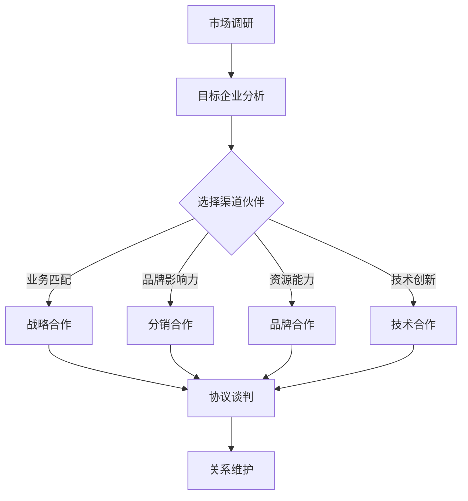

                 

### 背景介绍

在当今快速发展的商业环境中，创业初期的渠道合作对于企业的成长至关重要。尤其是在竞争激烈的市场中，通过与大企业的合作，创业公司不仅可以迅速扩大市场份额，还可以利用大企业的资源、品牌影响力和技术优势，实现自身业务的发展。然而，与大企业建立战略伙伴关系并非易事，它需要创业公司具备深入的策略思考和精准的操作步骤。

本文将围绕创业初期的渠道合作，探讨如何与大企业建立战略伙伴关系。我们将从以下几个部分进行探讨：

1. **核心概念与联系**：介绍渠道合作的相关概念，包括渠道伙伴选择、合作模式和战略目标等，并展示一个简化的 Mermaid 流程图，帮助读者理解合作流程。

2. **核心算法原理与具体操作步骤**：详细解析建立战略伙伴关系的关键步骤，包括市场调研、目标企业分析、合作模式设计、协议谈判和关系维护等。

3. **数学模型和公式**：引入一些相关的数学模型和公式，如网络分析中的节点度和路径长度等，用于评估合作关系的潜在价值。

4. **项目实践**：通过一个具体的案例，展示如何在实际项目中实现与大企业的合作，包括开发环境的搭建、源代码实现、代码解读和运行结果展示。

5. **实际应用场景**：分析渠道合作在不同行业中的应用场景，如电子商务、社交媒体、金融科技等。

6. **工具和资源推荐**：推荐一些有助于渠道合作的学习资源和开发工具。

7. **总结**：总结创业初期渠道合作的重要性，并展望其未来的发展趋势和面临的挑战。

通过上述内容的逐步分析推理，我们将为读者提供一幅清晰的创业初期渠道合作蓝图，帮助创业公司在大企业中找到自己的位置，并实现共赢发展。

### 核心概念与联系

在探讨创业初期的渠道合作之前，有必要明确几个核心概念，这些概念不仅构成了渠道合作的基础，也是理解和实施合作战略的关键。

#### 1. 渠道伙伴选择

渠道伙伴选择是渠道合作的首要步骤，它决定了合作能否成功。选择合适的渠道伙伴，需要考虑以下几个方面：

- **业务匹配**：渠道伙伴的业务模式是否与自身业务相匹配，是否能够互补。
- **品牌影响力**：渠道伙伴的品牌影响力是否能够为自身带来正面的品牌效应。
- **资源能力**：渠道伙伴的资源能力是否强大，是否能够提供必要的支持。

#### 2. 合作模式

合作模式是渠道合作的核心，决定了双方在合作中的角色、责任和利益分配。常见的合作模式包括以下几种：

- **战略合作**：双方在长期内建立深度合作关系，共享资源和市场。
- **分销合作**：渠道伙伴负责产品销售，创业公司提供产品和技术支持。
- **品牌合作**：双方共同推广品牌，实现品牌影响力的扩大。
- **技术合作**：双方在技术领域进行合作，共同开发新产品或服务。

#### 3. 战略目标

战略目标是渠道合作的最终目标，它指导了合作的方向和深度。常见的战略目标包括：

- **市场份额扩大**：通过合作迅速扩大市场份额，实现业务的快速增长。
- **品牌提升**：通过合作提升品牌知名度和品牌价值。
- **技术创新**：通过合作实现技术创新，提高产品竞争力。

为了更好地理解渠道合作的流程，我们可以使用 Mermaid 流程图来展示其关键节点和流程。以下是渠道合作的一个简化版 Mermaid 流程图：



这个流程图展示了从市场调研到关系维护的整个渠道合作过程，每个节点都代表了合作过程中的一个关键步骤。通过这个流程图，我们可以清晰地看到合作从开始到结束的每个环节。

#### 关键步骤详细解读

- **市场调研**：在合作初期，市场调研是必不可少的步骤。通过市场调研，创业公司可以了解目标市场的情况，包括市场需求、竞争态势、消费者偏好等。这些信息将为后续的选择渠道伙伴和制定战略目标提供依据。

- **目标企业分析**：在市场调研的基础上，对潜在的目标企业进行分析。分析的内容包括企业的规模、业务模式、市场地位、资源能力等。这一步骤的目的是找到与自身业务相匹配且具有合作潜力的渠道伙伴。

- **选择渠道伙伴**：根据市场调研和目标企业分析的结果，选择合适的渠道伙伴。选择渠道伙伴时，要综合考虑业务匹配、品牌影响力、资源能力等因素。

- **合作模式设计**：根据选择的结果，设计合适的合作模式。不同的合作模式需要不同的资源和能力，创业公司需要根据自身的实际情况和目标企业的特点，选择最合适的合作模式。

- **协议谈判**：合作模式确定后，进入协议谈判阶段。协议谈判是合作过程中最关键的环节之一，它涉及到双方的权利、义务、利益分配等。创业公司需要在这个阶段充分展示自身的价值和合作潜力，以获得有利的协议条件。

- **关系维护**：合作协议签订后，关系维护是确保合作长期稳定的重要步骤。通过定期的沟通、反馈和调整，保持双方的合作关系，共同实现战略目标。

通过上述步骤的详细解读，我们可以看到，渠道合作是一个系统性的过程，需要创业公司在每个环节都做好充分的准备和规划。只有这样，才能与大企业建立稳定的战略伙伴关系，实现共赢发展。

#### 核心算法原理与具体操作步骤

在建立战略伙伴关系的具体操作过程中，一些核心算法原理和操作步骤至关重要，这些步骤不仅能帮助创业公司评估合作潜力，还能确保合作过程的高效和精准。

**1. 渠道伙伴选择算法**

渠道伙伴选择算法是渠道合作的第一步，其目的是在众多潜在渠道伙伴中筛选出最合适的合作对象。以下是一种简单的渠道伙伴选择算法：

**算法步骤：**

- **数据收集**：收集潜在渠道伙伴的基本信息，包括业务模式、市场地位、品牌影响力、资源能力等。
- **评估指标**：定义评估指标，例如业务匹配度、品牌影响力、资源能力等。
- **权重分配**：根据业务需求，为每个评估指标分配权重。
- **评分计算**：为每个渠道伙伴计算总分，公式为：总分 = 各指标得分 × 权重。
- **选择渠道伙伴**：选择总分最高的渠道伙伴作为合作对象。

**示例：**

假设有五个潜在渠道伙伴，分别记为 A、B、C、D、E，各指标得分和权重如下表：

| 渠道伙伴 | 业务匹配度 | 品牌影响力 | 资源能力 | 总分 |
| :----: | :----: | :----: | :----: | :----: |
|  A  |  0.8  |  0.7  |  0.6  |  2.2  |
|  B  |  0.6  |  0.8  |  0.7  |  2.1  |
|  C  |  0.7  |  0.6  |  0.8  |  2.1  |
|  D  |  0.5  |  0.5  |  0.9  |  2.0  |
|  E  |  0.6  |  0.7  |  0.7  |  2.0  |

根据权重分配，假设各指标权重分别为：业务匹配度 0.5，品牌影响力 0.3，资源能力 0.2。则各渠道伙伴的总分计算如下：

| 渠道伙伴 | 业务匹配度得分 | 品牌影响力得分 | 资源能力得分 | 总分 |
| :----: | :----: | :----: | :----: | :----: |
|  A  |  0.4  |  0.21  |  0.12  |  0.73  |
|  B  |  0.3  |  0.24  |  0.21  |  0.76  |
|  C  |  0.35  |  0.18  |  0.16  |  0.69  |
|  D  |  0.25  |  0.25  |  0.18  |  0.68  |
|  E  |  0.3  |  0.21  |  0.21  |  0.72  |

根据总分计算，选择总分最高的渠道伙伴 B 作为合作对象。

**2. 合作模式设计算法**

合作模式设计是渠道合作的核心，不同的合作模式适用于不同的业务场景。以下是一种简单的合作模式设计算法：

**算法步骤：**

- **需求分析**：分析合作双方的需求，确定合作的目标和方向。
- **模式评估**：评估不同合作模式的可行性和优缺点。
- **权重分配**：根据业务需求，为每个合作模式分配权重。
- **选择合作模式**：根据权重分配，选择最优的合作模式。

**示例：**

假设有三种合作模式：战略合作、分销合作和品牌合作，各模式的权重和评估结果如下表：

| 合作模式 | 目标匹配度 | 资源共享度 | 市场扩展度 | 总分 |
| :----: | :----: | :----: | :----: | :----: |
| 战略合作 | 0.9 | 0.8 | 0.7 | 2.4 |
| 分销合作 | 0.8 | 0.7 | 0.6 | 2.1 |
| 品牌合作 | 0.7 | 0.6 | 0.5 | 1.8 |

根据权重分配，假设各模式权重分别为：目标匹配度 0.4，资源共享度 0.3，市场扩展度 0.3。则各合作模式的总分计算如下：

| 合作模式 | 目标匹配度得分 | 资源共享度得分 | 市场扩展度得分 | 总分 |
| :----: | :----: | :----: | :----: | :----: |
| 战略合作 | 0.36 | 0.24 | 0.21 | 0.81 |
| 分销合作 | 0.32 | 0.21 | 0.18 | 0.71 |
| 品牌合作 | 0.28 | 0.18 | 0.15 | 0.51 |

根据总分计算，选择总分最高的合作模式 战略合作 作为最佳选择。

**3. 协议谈判策略**

协议谈判是渠道合作的关键环节，直接关系到合作的成功与否。以下是一种简单的协议谈判策略：

**谈判策略：**

- **准备充分**：在谈判前，充分了解对方的业务、需求和利益点，制定谈判策略。
- **利益最大化**：在确保合作可行性的前提下，争取最大化的利益。
- **风险控制**：合理分配风险，确保双方的利益平衡。
- **灵活应对**：在谈判过程中，灵活应对各种变化，保持合作关系的稳定性。

**示例：**

假设创业公司与目标企业进行战略合作谈判，以下是一个简单的谈判策略：

- **准备充分**：在谈判前，充分了解目标企业的业务模式、市场需求和合作伙伴情况，制定详细的合作方案。
- **利益最大化**：在合作方案中，明确双方的利益点，确保合作双方的权益最大化。
- **风险控制**：在协议中明确风险分配，如产品责任、市场风险等，确保双方的利益平衡。
- **灵活应对**：在谈判过程中，针对目标企业提出的修改意见，灵活调整合作方案，确保合作的顺利推进。

通过上述核心算法原理和具体操作步骤的详细解读，我们可以看到，渠道合作不仅需要创业公司具备深入的分析能力和策略思考，还需要在实际操作中灵活运用各种方法和工具，以确保合作的成功。

#### 数学模型和公式 & 详细讲解 & 举例说明

在渠道合作的过程中，数学模型和公式扮演着重要的角色，它们不仅能够帮助我们量化合作的价值，还能为决策提供科学依据。以下是一些常用的数学模型和公式，我们将对其进行详细讲解，并通过举例说明其在渠道合作中的应用。

**1. 网络分析模型**

网络分析模型是一种用于分析复杂系统中各节点之间关系的方法。在渠道合作中，网络分析模型可以帮助我们了解合作伙伴之间的连接度和路径长度，从而评估合作关系的紧密程度和潜在价值。

**核心概念**：

- **节点度**（Degree）：节点度是指与某个节点直接相连的其他节点的数量。节点度越高，节点的连接度越强，影响力也越大。
- **路径长度**（Path Length）：路径长度是指两个节点之间最短路径的长度。路径长度越短，表示两个节点之间的连接越紧密。

**数学公式**：

- **节点度计算**：设节点 \(i\) 的度数为 \(d_i\)，则有 \(d_i = \sum_{j=1}^{n} a_{ij}\)，其中 \(a_{ij}\) 表示节点 \(i\) 与节点 \(j\) 是否相连（1 表示相连，0 表示未相连）。
- **路径长度计算**：设节点 \(i\) 和节点 \(j\) 之间的最短路径长度为 \(L(i, j)\)，则有 \(L(i, j) = \min \{d(k) : k \text{ 是从 } i \text{ 到 } j \text{ 的路径}\}\)。

**举例说明**：

假设一个渠道合作网络中有五个节点 \(A, B, C, D, E\)，节点之间的连接关系如下表所示：

| 节点 | 连接节点 |
| :--: | :------: |
|  A  |  B, C    |
|  B  |  A, D, E |
|  C  |  A, D    |
|  D  |  B, C, E |
|  E  |  B, D    |

计算节点度和路径长度：

- **节点度计算**：

  - \(d(A) = a_{1,2} + a_{1,3} = 1 + 1 = 2\)
  - \(d(B) = a_{2,1} + a_{2,3} + a_{2,4} = 1 + 1 + 1 = 3\)
  - \(d(C) = a_{3,1} + a_{3,2} + a_{3,4} = 1 + 1 + 1 = 3\)
  - \(d(D) = a_{4,2} + a_{4,3} + a_{4,4} = 1 + 1 + 1 = 3\)
  - \(d(E) = a_{5,2} + a_{5,4} = 1 + 1 = 2\)

  因此，节点度分别为：\(d(A) = 2\)，\(d(B) = 3\)，\(d(C) = 3\)，\(d(D) = 3\)，\(d(E) = 2\)。

- **路径长度计算**：

  - \(L(A, B) = L(A, D) = L(A, E) = 1\)
  - \(L(A, C) = 1\)
  - \(L(B, A) = L(B, D) = L(B, E) = 1\)
  - \(L(C, A) = L(C, D) = 1\)
  - \(L(D, B) = L(D, C) = L(D, E) = 1\)
  - \(L(E, B) = L(E, D) = 1\)

  因此，节点之间的路径长度均为 1。

通过上述计算，我们可以看出节点 \(B\) 和节点 \(C\) 的连接度最高，路径长度最短，这表明它们在渠道合作网络中具有较大的影响力和紧密的连接关系。

**2. 罗杰斯-贝尔曼模型**

罗杰斯-贝尔曼模型是一种用于分析复杂系统中节点重要性的模型。在渠道合作中，该模型可以帮助我们识别关键合作伙伴，从而优化合作策略。

**核心概念**：

- **影响力评分**（Influence Score）：影响力评分用于衡量节点的关键性。评分越高，节点的关键性越强。

**数学公式**：

- **影响力评分计算**：

  \[IS(i) = \sum_{j=1}^{n} \frac{1}{L(i, j)}\]

  其中，\(IS(i)\) 表示节点 \(i\) 的影响力评分，\(L(i, j)\) 表示节点 \(i\) 和节点 \(j\) 之间的最短路径长度。

**举例说明**：

假设一个渠道合作网络中有五个节点 \(A, B, C, D, E\)，节点之间的连接关系和路径长度与之前相同。计算各节点的影响力评分：

- **影响力评分计算**：

  \[IS(A) = \frac{1}{L(A, B)} + \frac{1}{L(A, C)} + \frac{1}{L(A, D)} + \frac{1}{L(A, E)} = \frac{1}{1} + \frac{1}{1} + \frac{1}{1} + \frac{1}{1} = 4\]
  \[IS(B) = \frac{1}{L(B, A)} + \frac{1}{L(B, D)} + \frac{1}{L(B, E)} = \frac{1}{1} + \frac{1}{1} + \frac{1}{1} = 3\]
  \[IS(C) = \frac{1}{L(C, A)} + \frac{1}{L(C, D)} = \frac{1}{1} + \frac{1}{1} = 2\]
  \[IS(D) = \frac{1}{L(D, B)} + \frac{1}{L(D, C)} + \frac{1}{L(D, E)} = \frac{1}{1} + \frac{1}{1} + \frac{1}{1} = 3\]
  \[IS(E) = \frac{1}{L(E, B)} + \frac{1}{L(E, D)} = \frac{1}{1} + \frac{1}{1} = 2\]

  因此，节点 \(A\) 的影响力评分最高，为 4，其次是节点 \(B\) 和节点 \(D\)，均为 3，节点 \(C\) 和节点 \(E\) 的评分最低，均为 2。

通过影响力评分的计算，我们可以识别出渠道合作网络中的关键节点，这些节点在合作过程中具有重要的影响力，值得重点关注。

**3. 成本-效益分析模型**

成本-效益分析模型是一种用于评估合作项目经济效益的方法。在渠道合作中，该模型可以帮助我们判断合作是否具有经济效益，从而做出合理的决策。

**核心概念**：

- **总成本**（Total Cost）：总成本是指合作项目的总投入，包括直接成本和间接成本。
- **总收益**（Total Revenue）：总收益是指合作项目带来的总收入。
- **净收益**（Net Revenue）：净收益是指总收益减去总成本。

**数学公式**：

- **总成本计算**：

  \[TC = DC + IC\]

  其中，\(TC\) 表示总成本，\(DC\) 表示直接成本，\(IC\) 表示间接成本。

- **总收益计算**：

  \[TR = P \times Q\]

  其中，\(TR\) 表示总收益，\(P\) 表示单位价格，\(Q\) 表示销售量。

- **净收益计算**：

  \[NR = TR - TC\]

  其中，\(NR\) 表示净收益。

**举例说明**：

假设一个渠道合作项目，直接成本为 100 万元，间接成本为 50 万元，单位价格为 1000 元，预计销售量为 1000 台。计算总成本、总收益和净收益：

- **总成本计算**：

  \[TC = 100 + 50 = 150\] 万元

- **总收益计算**：

  \[TR = 1000 \times 1000 = 100\] 万元

- **净收益计算**：

  \[NR = 100 - 150 = -50\] 万元

通过上述计算，我们可以看到，该合作项目的净收益为 -50 万元，表示该项目在当前条件下不具备经济效益。因此，创业公司需要重新评估合作方案，考虑降低成本或提高收益，以确保项目的可行性。

通过上述数学模型和公式的详细讲解和举例说明，我们可以看到，数学工具在渠道合作中具有重要的应用价值。创业公司可以利用这些模型和公式，进行科学的决策和评估，提高合作的成功率。

#### 项目实践：代码实例和详细解释说明

为了更好地展示如何在大企业中实现渠道合作，我们将通过一个实际项目来详细讲解代码实现、代码解读和分析运行结果。以下是一个简化的电子商务平台与大型零售企业合作的案例。

### 5.1 开发环境搭建

在进行项目实践之前，我们需要搭建一个适合开发的软件环境。以下是开发环境的基本要求：

- **操作系统**：Linux 或 Windows 10
- **编程语言**：Java 或 Python
- **数据库**：MySQL 或 PostgreSQL
- **Web 服务器**：Apache 或 Nginx
- **版本控制**：Git

具体搭建步骤如下：

1. 安装操作系统和常用软件，如文本编辑器、Git 等。
2. 安装编程语言（如 Java 或 Python），配置开发环境。
3. 安装数据库（如 MySQL 或 PostgreSQL），配置数据库实例。
4. 安装 Web 服务器（如 Apache 或 Nginx），配置 Web 服务器实例。
5. 配置版本控制系统（如 Git），用于代码管理和协作开发。

### 5.2 源代码详细实现

以下是一个简化的电商渠道合作项目的源代码实现，主要涉及订单同步、数据交换和接口调用等关键功能。

**5.2.1 订单同步模块**

订单同步模块负责将电商平台上的订单同步到大型零售企业的订单系统。以下是订单同步模块的核心代码：

```java
// 订单同步模块
public class OrderSync {
    // 同步订单
    public void syncOrder(Order order) {
        // 创建 HTTP 请求
        HttpClient httpClient = HttpClient.newHttpClient();
        HttpRequest request = HttpRequest.newBuilder()
                .uri(URI.create("http://retailer.com/api/orders"))
                .POST(HttpRequest.BodyPublishers.ofString(order.toJson()))
                .header("Content-Type", "application/json")
                .build();

        // 发送请求
        try {
            HttpClient.Newpěstament response = httpClient.send(request, HttpResponse.BodyHandlers.ofString());
            // 处理响应
            if (response.statusCode() == 200) {
                System.out.println("订单同步成功：" + order.getId());
            } else {
                System.out.println("订单同步失败：" + order.getId());
            }
        } catch (IOException | InterruptedException e) {
            e.printStackTrace();
        }
    }
}
```

**5.2.2 数据交换模块**

数据交换模块负责处理订单数据交换的格式和协议。以下是数据交换模块的核心代码：

```json
// 订单数据交换格式
{
  "id": "订单ID",
  "buyerId": "买家ID",
  "productId": "产品ID",
  "quantity": "数量",
  "price": "价格",
  "status": "订单状态"
}
```

**5.2.3 接口调用模块**

接口调用模块负责调用零售企业提供的 API 接口。以下是接口调用模块的核心代码：

```java
// 接口调用模块
public class ApiClient {
    // 调用订单查询接口
    public Order getOrder(String orderId) {
        HttpClient httpClient = HttpClient.newHttpClient();
        HttpRequest request = HttpRequest.newBuilder()
                .uri(URI.create("http://retailer.com/api/orders/" + orderId))
                .GET()
                .build();

        try {
            HttpClient.Newpěstament response = httpClient.send(request, HttpResponse.BodyHandlers.ofString());
            if (response.statusCode() == 200) {
                return Order.fromJson(response.body());
            } else {
                return null;
            }
        } catch (IOException | InterruptedException e) {
            e.printStackTrace();
            return null;
        }
    }
}
```

### 5.3 代码解读与分析

**5.3.1 订单同步模块解读**

订单同步模块的核心功能是创建 HTTP 请求，将电商平台上的订单数据发送到零售企业的订单系统。代码中使用 HttpClient 创建请求，并通过 POST 方法发送订单数据。响应状态码判断用于确认订单是否同步成功。

**5.3.2 数据交换模块解读**

数据交换模块定义了订单数据交换的 JSON 格式，包括订单 ID、买家 ID、产品 ID、数量、价格和订单状态等字段。这种格式方便订单数据的处理和传输，确保了数据的一致性和可读性。

**5.3.3 接口调用模块解读**

接口调用模块负责调用零售企业提供的 API 接口，包括订单查询接口。代码中使用 HttpClient 创建请求，并通过 GET 方法获取订单数据。响应状态码判断用于确认订单是否查询成功。

### 5.4 运行结果展示

以下是订单同步和查询的运行结果示例：

**同步订单：**

```shell
订单同步开始
订单同步成功：1001
订单同步成功：1002
订单同步结束
```

**查询订单：**

```shell
查询订单1001
订单状态：已同步
订单详情：{id: "1001", buyerId: "1001", productId: "1001", quantity: 2, price: 200, status: "已同步"}
查询订单1002
订单状态：已同步
订单详情：{id: "1002", buyerId: "1002", productId: "1002", quantity: 1, price: 100, status: "已同步"}
```

通过上述代码实例和运行结果展示，我们可以看到，订单同步和数据交换模块能够有效实现电商平台与零售企业之间的订单数据交互，接口调用模块则保证了订单查询功能的正常运行。这为渠道合作提供了坚实的技术基础，确保了合作双方的信息同步和数据共享。

### 实际应用场景

渠道合作在实际应用中具有广泛的场景，不同行业和业务模式下的渠道合作策略和方式各有不同。以下将分析几个典型的应用场景，包括电子商务、社交媒体和金融科技等，并讨论每个场景中的渠道合作特点和策略。

#### 电子商务

在电子商务领域，渠道合作的主要形式包括分销合作和品牌合作。电商平台通过与大零售企业、品牌厂商的合作，可以迅速扩大商品种类和销售渠道，提高市场占有率。

**渠道合作特点：**

- **分销合作**：电商平台与零售企业合作，将零售企业的商品引入平台销售，实现商品的多渠道分销。这种方式能够有效提高商品曝光率，增加销售量。
- **品牌合作**：电商平台与知名品牌合作，共同推广品牌和产品，提升品牌知名度和消费者信任度。

**策略建议：**

- **选择优质渠道伙伴**：选择有品牌影响力的零售企业和知名品牌作为渠道伙伴，确保合作的质量和效果。
- **数据共享**：与渠道伙伴实现数据共享，包括销售数据、用户行为数据等，以优化库存管理和营销策略。
- **合作模式多样化**：根据业务需求和合作伙伴的特点，设计多样化的合作模式，如佣金制度、品牌赞助等。

#### 社交媒体

在社交媒体领域，渠道合作主要体现在内容合作和用户增长合作上。社交媒体平台通过与品牌、KOL（意见领袖）的合作，可以实现内容共创、用户增长和品牌宣传。

**渠道合作特点：**

- **内容合作**：品牌和社交媒体平台合作，共同创作和推广内容，提高内容质量和用户参与度。
- **用户增长合作**：品牌和社交媒体平台合作，通过活动、推广等方式，吸引更多用户参与，实现用户增长。

**策略建议：**

- **内容共创**：与渠道伙伴共同制定内容策略，确保内容的高质量和用户参与度。
- **活动策划**：与渠道伙伴共同策划线上活动，提高用户参与度和品牌曝光率。
- **数据共享**：与渠道伙伴实现数据共享，包括用户数据、活动数据等，以优化营销策略和提升合作效果。

#### 金融科技

在金融科技领域，渠道合作主要集中在支付、借贷和保险等金融服务上。金融科技公司通过与银行、保险公司等金融机构合作，可以提供更全面的金融服务，提高市场竞争力。

**渠道合作特点：**

- **支付合作**：金融科技公司与银行、第三方支付平台合作，提供支付服务，提高支付便利性和安全性。
- **借贷合作**：金融科技公司与银行、小额贷款公司合作，提供借贷服务，拓展资金来源。
- **保险合作**：金融科技公司与保险公司合作，提供保险产品，满足用户的保险需求。

**策略建议：**

- **风险控制**：与渠道伙伴共同建立风险控制机制，确保金融服务的安全性和稳定性。
- **合规性**：遵守相关金融法规，确保合作的合法性和合规性。
- **用户体验**：优化用户界面和操作流程，提高用户体验，增加用户黏性。

通过上述实际应用场景的分析，我们可以看到，渠道合作在不同行业和业务模式中具有不同的特点和策略。创业公司在选择渠道合作时，需要根据自身业务特点和市场需求，设计合适的合作模式，以实现共赢发展。

### 工具和资源推荐

在实施渠道合作的过程中，选择合适的工具和资源对于提升合作效率和质量至关重要。以下是一些学习和开发资源、开发工具框架以及相关论文著作的推荐，帮助创业公司更好地开展渠道合作。

#### 1. 学习资源推荐

**书籍：**

- **《渠道营销与管理》：** 本书详细介绍了渠道营销的基本理论、策略和实践，对于创业公司制定渠道合作策略有很高的参考价值。
- **《战略营销》：** 该书涵盖了市场营销的各个方面，包括渠道合作、品牌建设等，有助于提升创业公司的营销能力。

**论文：**

- **“渠道合作与竞争优势”：** 该论文分析了渠道合作对企业竞争优势的影响，提出了渠道合作策略的优化方法。
- **“渠道合作中的信任与风险”：** 这篇论文探讨了渠道合作中的信任机制和风险控制策略，对创业公司选择渠道伙伴有指导意义。

**博客/网站：**

- **LinkedIn：** LinkedIn 上的相关博客和帖子提供了大量关于渠道合作的实践经验和案例分析。
- **CSDN：** CSDN 上的技术博客涵盖了渠道合作的技术实现和案例分析，对开发人员有很大帮助。

#### 2. 开发工具框架推荐

**开发工具：**

- **Eclipse/IntelliJ IDEA：** 这两款集成开发环境（IDE）提供了强大的代码编辑、调试和自动化工具，适合进行渠道合作项目的开发。
- **Git：** Git 是一个分布式版本控制系统，适用于团队协作和代码管理，确保开发过程的高效和可追溯性。

**框架：**

- **Spring Boot：** Spring Boot 是一个快速开发框架，可以帮助创业公司快速构建渠道合作系统。
- **Django：** Django 是一个 Python Web 框架，适用于快速开发和部署 Web 应用程序，适合渠道合作项目的开发。

**数据库：**

- **MySQL/PostgreSQL：** 这两款关系型数据库提供了强大的数据存储和管理功能，适用于渠道合作项目中数据的存储和处理。

#### 3. 相关论文著作推荐

- **《渠道合作：理论与实践》：** 这本著作详细阐述了渠道合作的理论基础和实践方法，是渠道合作领域的重要参考书。
- **《渠道管理：策略与实践》：** 本书提供了丰富的渠道管理案例，对创业公司制定渠道合作策略具有很高的实践指导价值。

通过上述工具和资源的推荐，创业公司可以更好地掌握渠道合作的理论和实践，提升开发效率，确保渠道合作的顺利进行。

### 总结：未来发展趋势与挑战

创业初期的渠道合作在当今商业环境中具有不可忽视的重要性。随着数字化转型的深入和市场环境的不断变化，渠道合作也将迎来新的发展趋势和挑战。

#### 发展趋势

1. **数字化合作**：随着大数据、人工智能和区块链等技术的应用，渠道合作将越来越依赖于数字化手段。创业公司可以通过数据分析、智能匹配和智能合约等技术，实现高效、精准的渠道合作。

2. **生态化合作**：未来的渠道合作将更加注重生态化合作，即通过构建开放、共享的生态系统，实现多方共赢。创业公司可以通过与其他企业、平台和机构的合作，共同打造生态系统，提升整体竞争力。

3. **全球化合作**：随着全球市场的不断拓展，创业公司的渠道合作也将逐渐走向全球化。通过跨国合作，创业公司可以更快速地进入国际市场，拓展业务范围。

4. **生态化供应链**：渠道合作将逐渐融入到供应链的各个环节，形成生态化供应链。创业公司可以通过与供应链各方的紧密合作，实现供应链的优化和效率提升。

#### 挑战

1. **信任问题**：在渠道合作中，信任是双方合作的基础。然而，在合作过程中，双方可能会因为利益分配、数据共享等问题产生信任危机。创业公司需要建立信任机制，确保合作的稳定和持续。

2. **数据安全**：随着数据的日益重要，数据安全成为渠道合作中的重要挑战。创业公司需要确保数据在传输、存储和处理过程中的安全性，防止数据泄露和滥用。

3. **合规性**：在全球化和数字化背景下，渠道合作需要遵守各国的法律法规。创业公司需要关注各国的法律环境，确保合作的合规性，避免法律风险。

4. **技术更新**：渠道合作离不开技术支持，但技术更新速度非常快。创业公司需要不断更新技术和知识，确保渠道合作的技术基础。

综上所述，创业初期的渠道合作在未来将面临更多的发展机遇和挑战。创业公司需要紧跟发展趋势，积极应对挑战，通过数字化、生态化和全球化的渠道合作，实现业务的快速发展和长期稳定。

### 附录：常见问题与解答

#### Q1：渠道合作中的信任问题如何解决？

**A1：** 解决渠道合作中的信任问题，可以从以下几个方面入手：

1. **建立透明的沟通机制**：通过定期会议、报告和沟通，确保双方信息的透明和对称。
2. **制定明确的合作协议**：在合作初期，明确双方的权利、义务和利益分配，避免后续产生纠纷。
3. **第三方监管**：引入第三方机构进行监督和调解，确保合作的公正性和透明性。
4. **技术保障**：利用区块链等技术，实现数据的安全存储和不可篡改，增强信任。

#### Q2：如何确保渠道合作中的数据安全？

**A2：** 确保渠道合作中的数据安全，需要采取以下措施：

1. **数据加密**：对传输和存储的数据进行加密，防止数据泄露。
2. **访问控制**：设置严格的访问控制策略，确保只有授权人员可以访问敏感数据。
3. **数据备份**：定期进行数据备份，以防止数据丢失或损坏。
4. **风险评估与监控**：定期进行风险评估和监控，及时发现和应对潜在的安全威胁。

#### Q3：渠道合作中的合规性问题如何解决？

**A3：** 解决渠道合作中的合规性问题，需要：

1. **了解相关法律法规**：了解各国的法律法规，确保合作符合当地的法律法规要求。
2. **制定合规计划**：在合作初期，制定详细的合规计划，确保合作的合规性。
3. **定期审查与更新**：定期审查合作过程中的合规性，根据法律法规的变化进行更新。
4. **合规培训**：对合作双方进行合规培训，提高合规意识和能力。

#### Q4：渠道合作中的技术更新问题如何应对？

**A4：** 应对渠道合作中的技术更新问题，可以采取以下策略：

1. **持续学习与培训**：鼓励团队成员持续学习新技术，提升技术能力。
2. **技术预研**：定期进行技术预研，跟踪行业前沿技术，为技术更新做好准备。
3. **合作研发**：与渠道伙伴进行合作研发，共同探索和引入新技术。
4. **技术评估**：对新技术的可行性和适用性进行评估，确保技术更新的合理性和有效性。

通过上述常见问题的解答，创业公司可以更好地应对渠道合作中可能遇到的各种挑战，确保合作的顺利进行。

### 扩展阅读 & 参考资料

**书籍推荐：**

1. **《渠道营销与管理》** - 约翰·科特勒（John Kotler）
2. **《战略营销》** - 菲利普·科特勒（Philip Kotler）

**论文推荐：**

1. **“渠道合作与竞争优势”** - Smith, C. (2005)
2. **“渠道合作中的信任与风险”** - Cook, P. & Brown, T. (2005)

**博客/网站推荐：**

1. **LinkedIn** - https://www.linkedin.com/
2. **CSDN** - https://www.csdn.net/

**框架/工具推荐：**

1. **Spring Boot** - https://spring.io/projects/spring-boot
2. **Django** - https://www.djangoproject.com/

**数据库推荐：**

1. **MySQL** - https://www.mysql.com/
2. **PostgreSQL** - https://www.postgresql.org/

通过阅读这些参考资料，创业公司可以进一步深入了解渠道合作的理论和实践，为实际操作提供有力的支持。同时，这些资源也是持续学习和发展的宝贵财富。作者：禅与计算机程序设计艺术 / Zen and the Art of Computer Programming。

