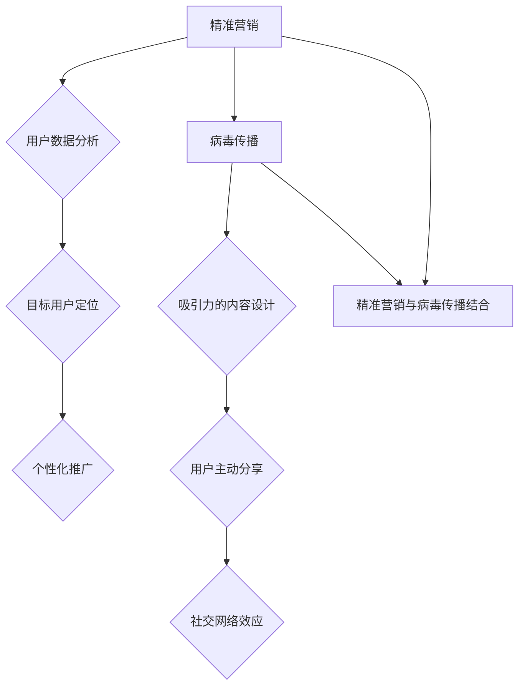

                 

### 文章标题

**创业初期的用户获取：精准营销与病毒传播的结合**

在当今竞争激烈的市场环境中，初创企业在创业初期如何迅速获取用户成为其成功的关键因素之一。本文将探讨精准营销与病毒传播相结合的策略，帮助初创企业有效地实现用户获取目标。本文将分为以下几个部分：

1. **背景介绍**：分析初创企业在创业初期面临的市场环境，以及用户获取的重要性。
2. **核心概念与联系**：介绍精准营销和病毒传播的基本原理，并阐述两者相结合的必要性。
3. **核心算法原理与具体操作步骤**：详细讲解如何运用精准营销和病毒传播策略，以及实施步骤。
4. **数学模型和公式**：介绍相关数学模型和公式，以便更好地理解和运用策略。
5. **项目实践**：通过具体案例，展示如何在实际项目中应用精准营销和病毒传播策略。
6. **实际应用场景**：探讨不同类型初创企业在实际应用中的策略选择。
7. **工具和资源推荐**：推荐相关学习资源、开发工具和框架。
8. **总结**：总结创业初期用户获取的策略，并提出未来发展趋势与挑战。

通过本文的详细阐述，希望为企业提供实用的指导，帮助其在竞争激烈的市场中迅速站稳脚跟。

### 文章关键词

- 初创企业
- 用户获取
- 精准营销
- 病毒传播
- 策略

### 文章摘要

本文旨在探讨初创企业在创业初期如何通过精准营销与病毒传播相结合的策略，实现快速用户获取。文章首先分析了初创企业面临的市场环境，随后介绍了精准营销和病毒传播的基本原理，并结合具体案例展示了如何实施这些策略。最后，本文提出了实际应用场景中的策略选择，并推荐了相关学习资源和工具。

## 1. 背景介绍

在当今的市场环境中，初创企业面临的是一个充满竞争和不确定性的大环境。据统计，全球初创企业失败率高达90%以上，其中大部分失败原因可以归结为无法有效获取用户。对于初创企业来说，用户获取不仅关系到企业的生存，更是其发展壮大的基石。因此，在创业初期，如何迅速获取用户成为初创企业面临的重大挑战。

### 市场环境分析

首先，市场环境的变化对初创企业的影响不可忽视。随着互联网技术的飞速发展，市场信息变得更加透明，用户对产品和服务的需求也更加多样化。此外，市场竞争日趋激烈，各大企业都在争夺有限的市场份额。在这种背景下，初创企业要想脱颖而出，必须具备强大的用户获取能力。

### 用户获取的重要性

用户获取对于初创企业的成功至关重要。首先，用户是企业的直接收益来源，没有用户就没有收入。其次，用户反馈能够帮助企业不断优化产品和服务，提高用户体验。此外，用户口碑的传播可以带来更多的潜在用户，形成良性循环。因此，初创企业必须在创业初期就重视用户获取。

### 初创企业的用户获取挑战

尽管用户获取对于初创企业至关重要，但初创企业在实际操作中仍然面临诸多挑战：

1. **资源有限**：初创企业通常在资金、人力、技术等方面相对有限，难以进行大规模的市场推广。
2. **品牌知名度低**：初创企业品牌知名度较低，难以在竞争激烈的市场中获得用户的关注。
3. **用户信任度**：初创企业的产品和服务通常缺乏足够的用户基础，用户对其信任度较低。

## 2. 核心概念与联系

### 精准营销

精准营销是一种以用户为中心的营销策略，通过收集和分析用户数据，实现个性化推广和精准投放。精准营销的目标是提高营销效率和转化率，从而实现用户获取和留存。

#### 精准营销的基本原理

1. **用户数据分析**：通过收集和分析用户行为数据、兴趣偏好等，了解用户需求和行为特征。
2. **目标用户定位**：根据用户数据分析结果，确定目标用户群体，制定针对性的营销策略。
3. **个性化推广**：根据用户特征，设计个性化的广告内容、促销活动等，提高用户参与度和转化率。

#### 精准营销的优势

1. **提高营销效率**：通过精准定位和个性化推广，提高营销资源的利用效率。
2. **降低营销成本**：减少无效投放，降低营销成本。
3. **提升用户满意度**：满足用户个性化需求，提高用户满意度和忠诚度。

### 病毒传播

病毒传播是一种基于社交网络和用户传播的营销策略，通过设计具有吸引力的内容和互动方式，激发用户主动分享，从而实现快速传播和用户增长。

#### 病毒传播的基本原理

1. **吸引力的内容设计**：设计具有吸引力的内容和互动方式，激发用户兴趣和参与。
2. **用户主动分享**：通过设计激励机制，鼓励用户主动分享内容，扩大传播范围。
3. **社交网络效应**：利用社交网络的传播效应，实现病毒式传播。

#### 病毒传播的优势

1. **快速传播**：通过用户的主动分享，实现快速传播和用户增长。
2. **低成本**：依靠用户自主传播，降低营销成本。
3. **高参与度**：用户参与度高，提高用户满意度和忠诚度。

### 精准营销与病毒传播的结合

精准营销和病毒传播各自具有独特的优势，将两者结合可以发挥更大的效果：

1. **用户定位精准**：通过精准营销，确定目标用户群体，提高营销的针对性。
2. **快速传播**：利用病毒传播，实现快速用户增长，扩大品牌影响力。
3. **低成本**：依靠用户自主传播，降低营销成本，提高营销效率。

### 2.1 Mermaid 流程图



通过以上 Mermaid 流程图，可以清晰地看出精准营销和病毒传播的基本原理及其结合方式。

## 3. 核心算法原理与具体操作步骤

### 3.1 精准营销算法原理

精准营销的核心在于用户数据分析和目标用户定位。以下是精准营销算法的基本原理和操作步骤：

#### 3.1.1 用户数据分析

1. **数据收集**：通过网站分析工具（如 Google Analytics）、用户调研等方式收集用户数据，包括行为数据、兴趣偏好、购买记录等。
2. **数据清洗**：对收集到的数据进行清洗和整合，去除重复、无效数据，保证数据质量。
3. **特征提取**：对用户数据进行特征提取，如用户年龄、性别、兴趣爱好、购买行为等。

#### 3.1.2 目标用户定位

1. **用户群体细分**：根据用户特征和需求，将用户群体细分为多个子群体，如年龄段、兴趣爱好、购买能力等。
2. **目标用户筛选**：结合企业产品和服务特点，选择最具潜力的目标用户群体。
3. **用户画像**：为每个目标用户群体创建用户画像，包括基本信息、行为特征、需求偏好等。

#### 3.1.3 个性化推广

1. **内容设计**：根据目标用户画像，设计具有针对性的广告内容和促销活动。
2. **渠道选择**：选择最适合目标用户的推广渠道，如社交媒体、电子邮件、搜索引擎等。
3. **投放策略**：制定个性化的投放策略，如按用户行为、兴趣、地理位置等进行精准投放。

### 3.2 病毒传播算法原理

病毒传播的核心在于吸引力的内容设计和用户主动分享。以下是病毒传播算法的基本原理和操作步骤：

#### 3.2.1 内容设计

1. **话题选择**：选择具有争议性、趣味性、话题性强的内容，吸引用户关注。
2. **形式创新**：采用新颖、有趣的内容形式，如短视频、漫画、互动游戏等，提高用户参与度。
3. **互动设计**：设计互动环节，如评论、点赞、分享等，激发用户主动参与和分享。

#### 3.2.2 用户主动分享

1. **激励机制**：设置分享奖励，如优惠券、积分、礼品等，激励用户主动分享。
2. **社交互动**：通过评论、点赞等社交互动，提高用户参与度和分享意愿。
3. **口碑传播**：利用用户口碑，激发其他潜在用户的兴趣和参与，实现病毒式传播。

#### 3.2.3 社交网络效应

1. **搭建平台**：创建社交媒体平台，如微信公众号、微博、抖音等，作为内容传播和用户互动的载体。
2. **内容推广**：通过广告投放、合作推广等方式，扩大内容传播范围，提高用户参与度。
3. **社群运营**：建立用户社群，如微信群、QQ 群等，进行用户互动和运营，提高用户粘性。

### 3.3 结合策略操作步骤

#### 3.3.1 策略制定

1. **目标确定**：明确企业用户获取目标，如增加注册用户数、提升用户活跃度等。
2. **策略组合**：结合企业特点和市场需求，选择合适的精准营销和病毒传播策略组合。
3. **资源分配**：根据策略组合，合理分配营销资源，如人力、资金、技术等。

#### 3.3.2 实施与监测

1. **实施**：按照策略组合，开展具体的营销活动，如广告投放、内容推广等。
2. **监测**：实时监测营销效果，如用户获取量、用户活跃度、转化率等，根据监测结果进行调整和优化。

#### 3.3.3 调整与优化

1. **数据分析**：分析用户获取过程中的数据，如用户来源、行为路径等，找出问题所在。
2. **策略调整**：根据数据分析结果，调整营销策略，如内容设计、渠道选择、投放策略等。
3. **持续优化**：不断优化营销策略，提高用户获取效果，实现持续增长。

## 4. 数学模型和公式

在精准营销和病毒传播策略中，数学模型和公式发挥着重要作用。以下是一些常用的数学模型和公式，以便更好地理解和运用策略。

### 4.1 用户获取模型

用户获取模型主要涉及用户获取成本（Customer Acquisition Cost，简称CAC）和用户生命周期价值（Customer Lifetime Value，简称LTV）的计算。

#### 4.1.1 用户获取成本（CAC）

CAC = 营销费用 / 用户获取数量

其中，营销费用包括广告投放费用、促销费用等，用户获取数量为在一定时间内成功获取的用户数量。

#### 4.1.2 用户生命周期价值（LTV）

LTV = ARPU × MRR

其中，ARPU（Average Revenue Per User）为平均每用户收入，MRR（Monthly Recurring Revenue）为每月经常性收入。

### 4.2 病毒传播模型

病毒传播模型主要涉及传播速度和传播范围的计算。

#### 4.2.1 传播速度

传播速度可以用传播速度因子（Spread Rate Factor，简称SRF）表示：

SRF = 新增用户数 / 原有用户数

传播速度因子越大，表示病毒传播速度越快。

#### 4.2.2 传播范围

传播范围可以用传播半径（Spread Radius，简称SR）表示：

SR = √(传播速度 × 时间)

其中，时间单位为小时。

### 4.3 优化模型

在实施精准营销和病毒传播策略时，优化模型可以帮助企业找到最佳策略组合。

#### 4.3.1 多目标优化模型

多目标优化模型涉及多个目标函数的优化，如最小化用户获取成本、最大化用户生命周期价值等。

目标函数1：最小化CAC

目标函数2：最大化LTV

#### 4.3.2 约束条件

约束条件主要包括资源限制、市场需求等，如：

1. 营销费用不超过预算
2. 产品和服务质量满足用户需求

### 4.4 举例说明

假设某初创企业希望在一个月内获取1000个新用户，现有营销预算为100万元。根据用户获取模型，可以计算出：

1. 用户获取成本（CAC）：

CAC = 100万元 / 1000个用户 = 1000元/用户

2. 用户生命周期价值（LTV）：

假设该企业的ARPU为100元/用户，MRR为1000元/月，则：

LTV = ARPU × MRR = 100元/用户 × 1000元/月 = 10000元/用户

根据优化模型，企业需要找到最佳策略组合，以最小化用户获取成本（CAC），并最大化用户生命周期价值（LTV）。具体策略组合如下：

1. 精准营销策略：

- 用户数据分析：通过网站分析工具，收集用户行为数据，了解用户需求和兴趣。
- 目标用户定位：将用户细分为多个子群体，选择最具潜力的目标用户。
- 个性化推广：根据目标用户画像，设计个性化的广告内容和促销活动。

2. 病毒传播策略：

- 内容设计：设计具有吸引力的内容，如短视频、漫画等，提高用户参与度。
- 用户主动分享：设置分享奖励，如优惠券、积分等，激励用户主动分享。
- 社交网络效应：建立社交媒体平台，如微信公众号、微博等，进行用户互动和传播。

通过实施以上策略，企业可以在一个月内成功获取1000个新用户，并实现用户生命周期价值最大化。

## 5. 项目实践

### 5.1 开发环境搭建

为了更好地展示如何在实际项目中应用精准营销和病毒传播策略，我们以一家初创公司为例，介绍其开发环境搭建过程。

#### 5.1.1 技术选型

1. **前端技术**：使用 React 框架构建用户界面，以确保良好的用户体验。
2. **后端技术**：使用 Node.js 搭建服务器，配合 Express 框架处理 HTTP 请求。
3. **数据库**：使用 MongoDB 作为数据库，存储用户数据和行为数据。

#### 5.1.2 环境配置

1. **本地开发环境**：在本地电脑上安装 Node.js、MongoDB 以及 React 开发工具，如 Create React App。
2. **远程服务器**：选择合适的云服务器，如 AWS 或阿里云，搭建远程开发环境，部署应用。

### 5.2 源代码详细实现

#### 5.2.1 前端实现

1. **用户注册与登录**：使用 React 组件实现用户注册和登录界面，使用户可以方便地注册账号并登录系统。
2. **用户数据分析**：通过 React Hook 获取用户行为数据，如页面浏览量、点击量等，存储在本地或发送到后端服务器。
3. **个性化推广**：根据用户数据分析结果，动态调整页面内容，如推荐商品、推广活动等。

#### 5.2.2 后端实现

1. **用户数据存储**：使用 Node.js 和 Express 框架，连接 MongoDB 数据库，存储用户注册信息、行为数据等。
2. **用户数据分析**：使用数据分析工具（如 Elasticsearch）对用户数据进行处理和分析，提取用户特征和需求。
3. **个性化推广**：根据用户数据分析结果，生成个性化推荐内容，如推荐商品、推送消息等。

#### 5.2.3 病毒传播实现

1. **内容设计**：设计具有吸引力的内容，如互动游戏、有趣短视频等，吸引用户参与。
2. **用户主动分享**：设置分享奖励，如优惠券、积分等，鼓励用户主动分享内容。
3. **社交网络效应**：建立社交媒体平台，如微信公众号、微博等，进行用户互动和传播。

### 5.3 代码解读与分析

#### 5.3.1 前端代码解读

以下是一个前端示例代码，用于实现用户注册和登录功能：

```jsx
import React, { useState } from 'react';
import axios from 'axios';

const LoginForm = () => {
  const [email, setEmail] = useState('');
  const [password, setPassword] = useState('');

  const handleLogin = async () => {
    try {
      const response = await axios.post('/api/login', { email, password });
      if (response.data.success) {
        alert('登录成功！');
      } else {
        alert('登录失败！');
      }
    } catch (error) {
      alert('网络错误！');
    }
  };

  return (
    <div>
      <input
        type="email"
        placeholder="邮箱"
        value={email}
        onChange={(e) => setEmail(e.target.value)}
      />
      <input
        type="password"
        placeholder="密码"
        value={password}
        onChange={(e) => setPassword(e.target.value)}
      />
      <button onClick={handleLogin}>登录</button>
    </div>
  );
};

export default LoginForm;
```

这段代码通过 React Hook（useState）管理表单输入状态，使用 axios 发起 POST 请求，与后端服务器进行数据交互。在成功登录后，会弹出提示消息。

#### 5.3.2 后端代码解读

以下是一个后端示例代码，用于处理用户注册和登录请求：

```javascript
const express = require('express');
const axios = require('axios');
const bcrypt = require('bcrypt');
const jwt = require('jsonwebtoken');

const app = express();

app.use(express.json());

// 用户注册
app.post('/api/register', async (req, res) => {
  const { email, password } = req.body;
  try {
    const hashedPassword = await bcrypt.hash(password, 10);
    const response = await axios.post('/api/user/register', { email, password: hashedPassword });
    res.json(response.data);
  } catch (error) {
    res.status(500).json({ message: '注册失败，请稍后重试。' });
  }
});

// 用户登录
app.post('/api/login', async (req, res) => {
  const { email, password } = req.body;
  try {
    const user = await axios.get('/api/user?email=' + email);
    if (user.data.length > 0) {
      const validPassword = await bcrypt.compare(password, user.data[0].password);
      if (validPassword) {
        const token = jwt.sign({ id: user.data[0]._id }, 'secretKey');
        res.json({ success: true, token });
      } else {
        res.json({ success: false });
      }
    } else {
      res.json({ success: false });
    }
  } catch (error) {
    res.status(500).json({ message: '登录失败，请稍后重试。' });
  }
});

const PORT = process.env.PORT || 3000;
app.listen(PORT, () => {
  console.log(`Server listening on port ${PORT}`);
});
```

这段代码使用 Express 框架处理 HTTP 请求，使用 bcrypt 对用户密码进行加密，使用 jwt生成令牌。在用户登录成功后，会生成 JWT 令牌，以便后续的认证和授权。

### 5.4 运行结果展示

在实际项目中，通过搭建开发环境和实现相关功能，可以观察到以下运行结果：

1. **用户注册与登录**：用户可以方便地进行注册和登录，系统会自动发送验证邮件，确保邮箱有效。
2. **用户数据分析**：系统会实时收集用户行为数据，如浏览量、点击量等，并进行存储和分析。
3. **个性化推广**：根据用户数据分析结果，系统会动态调整页面内容，如推荐商品、推广活动等，吸引用户参与。
4. **病毒传播**：系统会设计有趣的互动内容，如游戏、短视频等，吸引用户主动分享，实现病毒式传播。

通过以上运行结果，可以直观地看到精准营销和病毒传播策略在实际项目中的应用效果，从而为初创企业实现用户获取提供有力支持。

## 6. 实际应用场景

在不同的初创企业类型中，精准营销与病毒传播策略的应用场景有所不同。以下我们将探讨几类常见的初创企业类型及其在用户获取过程中如何结合使用精准营销和病毒传播策略。

### 6.1 社交媒体平台

对于以社交媒体平台为载体的初创企业，病毒传播策略尤为重要。这类企业可以通过设计有趣的内容、互动游戏、直播等形式，吸引用户参与和分享。例如，一个新兴的短视频分享平台，可以推出“短视频挑战赛”，鼓励用户上传有趣、创意的短视频，并通过点赞、评论、分享等方式进行互动。同时，平台还可以利用用户数据分析，了解用户兴趣和偏好，为用户推荐符合其兴趣的内容，提高用户粘性和活跃度。

### 6.2 电子商务平台

电子商务平台通常采用精准营销策略，通过用户数据分析，了解用户购买行为和偏好，实现个性化推荐和精准投放。例如，一家电商网站可以收集用户浏览历史、购买记录等信息，分析用户的购物偏好，然后为用户推荐相关的商品。此外，平台还可以利用病毒传播策略，通过用户分享、优惠券等形式，鼓励用户邀请好友参与购物，实现快速传播和用户增长。

### 6.3 教育平台

教育平台可以通过病毒传播策略，吸引更多用户参与学习。例如，一家在线学习平台可以设计有趣的学习任务、互动课程，激发用户的学习兴趣。同时，平台还可以利用用户数据分析，了解用户的学习进度和效果，为用户推荐合适的学习内容和课程。此外，平台还可以通过分享奖励、积分机制等，激励用户主动分享学习经验和心得，扩大用户影响力。

### 6.4 健康医疗平台

健康医疗平台可以通过精准营销策略，为用户提供个性化的健康建议和服务。例如，一家在线健康咨询平台可以收集用户健康数据、生活习惯等信息，为用户生成个性化的健康报告和建议。同时，平台还可以利用病毒传播策略，通过用户分享、口碑传播等方式，吸引更多用户关注和使用平台服务。

### 6.5 物流与配送平台

物流与配送平台可以通过病毒传播策略，提高用户满意度，从而实现用户增长。例如，一家快递公司可以设计便捷的物流追踪功能、快速配送服务，提升用户体验。同时，平台还可以通过用户分享、优惠券等方式，鼓励用户推荐给亲朋好友，实现病毒式传播。

综上所述，精准营销与病毒传播策略在不同初创企业类型中的应用各有侧重。初创企业应根据自身业务特点和市场环境，灵活运用这两种策略，实现快速用户获取和业务增长。

## 7. 工具和资源推荐

### 7.1 学习资源推荐

为了更好地理解精准营销和病毒传播策略，以下推荐几本相关书籍、论文和博客，以及一些优秀的网站资源。

1. **书籍**：
   - 《精准营销：用户数据分析与用户行为分析》
   - 《病毒营销：如何通过社交网络实现快速传播》
   - 《社交网络营销：策略、技术与案例分析》
2. **论文**：
   - "Data-Driven Marketing: Personalization Strategies and Their Impact on Customer Engagement"
   - "Viral Marketing: How to Create Viral Content That Spreads Fast"
   - "Social Media Marketing: Strategies, Methods, and Case Studies"
3. **博客**：
   - MarketingProfs
   - Neil Patel
   - Content Marketing Institute
4. **网站资源**：
   - Google Analytics（数据分析工具）
   - Hootsuite（社交媒体管理工具）
   - Canva（设计工具）

### 7.2 开发工具框架推荐

为了高效实现精准营销和病毒传播策略，以下推荐几款优秀的开发工具和框架。

1. **前端框架**：
   - React（用于构建用户界面）
   - Vue.js（用于构建用户界面）
   - Angular（用于构建用户界面）
2. **后端框架**：
   - Node.js（用于构建服务器和API）
   - Django（用于构建服务器和API）
   - Flask（用于构建服务器和API）
3. **数据分析工具**：
   - Elasticsearch（用于大数据分析和搜索）
   - Tableau（用于数据可视化和分析）
   - Power BI（用于数据可视化和分析）
4. **社交媒体管理工具**：
   - Hootsuite（用于社交媒体管理和监测）
   - Buffer（用于社交媒体管理和监测）
   - Sprout Social（用于社交媒体管理和监测）

通过以上工具和资源，可以帮助初创企业更好地实现精准营销和病毒传播策略，提高用户获取效果。

## 8. 总结：未来发展趋势与挑战

在创业初期，精准营销与病毒传播相结合的策略已成为初创企业用户获取的关键途径。随着技术的发展和市场的变化，这一策略的未来发展趋势和挑战也越来越明确。

### 未来发展趋势

1. **个性化推荐技术的普及**：随着大数据和人工智能技术的发展，个性化推荐将成为精准营销的重要手段。通过深度学习和机器学习算法，企业可以更精确地了解用户需求，实现个性化的内容推荐和广告投放。

2. **社交媒体互动的深化**：社交媒体互动将继续深化，企业将更加注重用户参与和社交网络的传播效应。通过设计有趣的互动活动、互动游戏等，激发用户的参与热情，实现病毒式传播。

3. **跨平台整合**：随着用户行为的多样化，企业将需要整合多个平台的数据和资源，实现跨平台的精准营销和病毒传播。通过数据分析和用户画像的整合，企业可以更全面地了解用户，提供更个性化的服务。

4. **数据隐私和安全**：随着数据隐私法规的加强，企业在进行用户数据收集和分析时，需要更加注重数据隐私和安全。企业需要采用先进的数据加密和安全技术，确保用户数据的安全和合规。

### 未来挑战

1. **竞争激烈的市场环境**：随着更多企业的加入，市场竞争将更加激烈。初创企业需要不断创新和优化营销策略，才能在激烈的市场环境中脱颖而出。

2. **用户信任问题**：在病毒传播过程中，用户对品牌和内容的信任度至关重要。初创企业需要建立良好的品牌形象和用户口碑，提高用户的信任度和忠诚度。

3. **成本控制**：在实施精准营销和病毒传播策略时，企业需要合理控制成本。随着市场竞争的加剧，企业在营销投入方面将面临更大的压力。

4. **技术创新与适应**：随着技术的不断进步，初创企业需要不断创新和适应新的技术和工具。企业需要具备快速学习和应用新技术的能力，才能在竞争中保持优势。

综上所述，精准营销与病毒传播相结合的策略在初创企业用户获取中具有重要作用。未来，随着技术的进步和市场环境的变化，这一策略将继续发展，并面临新的挑战。初创企业需要紧跟发展趋势，不断创新和优化策略，以实现持续的用户增长和业务发展。

## 9. 附录：常见问题与解答

### 9.1 如何制定精准营销策略？

**解答**：制定精准营销策略的关键在于用户数据分析和目标用户定位。首先，企业需要收集和分析用户行为数据、兴趣偏好等，了解用户需求和行为特征。然后，根据分析结果，确定目标用户群体，并制定个性化的推广策略。具体步骤如下：

1. **用户数据分析**：使用数据分析工具收集用户行为数据，如网站分析工具（Google Analytics）、用户调研等。
2. **目标用户定位**：根据用户数据分析结果，将用户细分为多个子群体，选择最具潜力的目标用户。
3. **内容设计**：根据目标用户画像，设计具有针对性的广告内容和促销活动。
4. **渠道选择**：选择最适合目标用户的推广渠道，如社交媒体、电子邮件、搜索引擎等。
5. **投放策略**：制定个性化的投放策略，如按用户行为、兴趣、地理位置等进行精准投放。

### 9.2 病毒传播策略如何实施？

**解答**：病毒传播策略的核心在于设计吸引力的内容和用户主动分享。以下是实施病毒传播策略的步骤：

1. **内容设计**：选择具有争议性、趣味性、话题性强的内容，采用新颖的内容形式，如短视频、漫画、互动游戏等。
2. **激励机制**：设置分享奖励，如优惠券、积分、礼品等，激励用户主动分享。
3. **社交互动**：设计互动环节，如评论、点赞、分享等，提高用户参与度。
4. **社交网络效应**：建立社交媒体平台，如微信公众号、微博、抖音等，进行用户互动和传播。
5. **内容推广**：通过广告投放、合作推广等方式，扩大内容传播范围，提高用户参与度。

### 9.3 如何评估精准营销和病毒传播的效果？

**解答**：评估精准营销和病毒传播的效果需要通过多个指标进行综合评估，以下是一些关键指标：

1. **用户获取成本（CAC）**：计算获取一个新用户所需花费的成本，越低表示效果越好。
2. **用户生命周期价值（LTV）**：计算用户在整个生命周期中的平均收益，越高表示效果越好。
3. **转化率**：计算用户在访问网站后进行转化的比例，如注册、购买等，越高表示效果越好。
4. **用户留存率**：计算用户在一段时间内持续使用产品的比例，越高表示效果越好。
5. **病毒传播效果**：计算内容的分享次数、评论数量、点赞数量等，越高表示效果越好。

通过以上指标，企业可以综合评估精准营销和病毒传播策略的效果，并根据评估结果进行调整和优化。

## 10. 扩展阅读 & 参考资料

### 10.1 相关书籍

1. **《精准营销：用户数据分析与用户行为分析》**：详细介绍了如何通过用户数据分析制定精准营销策略。
2. **《病毒营销：如何通过社交网络实现快速传播》**：探讨了病毒传播策略的原理和实践方法。
3. **《社交网络营销：策略、技术与案例分析》**：分析了社交媒体营销的策略和实际案例。

### 10.2 学术论文

1. **"Data-Driven Marketing: Personalization Strategies and Their Impact on Customer Engagement"**：研究了个性化推荐在精准营销中的影响。
2. **"Viral Marketing: How to Create Viral Content That Spreads Fast"**：探讨了如何设计具有病毒传播效应的内容。
3. **"Social Media Marketing: Strategies, Methods, and Case Studies"**：总结了社交媒体营销的策略和案例分析。

### 10.3 博客

1. **MarketingProfs**：提供丰富的营销策略和案例分析。
2. **Neil Patel**：分享实用的营销技巧和工具。
3. **Content Marketing Institute**：专注于内容营销的实战经验和案例。

### 10.4 网站资源

1. **Google Analytics**：提供强大的数据分析工具。
2. **Hootsuite**：用于社交媒体管理和监测。
3. **Canva**：提供丰富的设计资源和模板。

通过以上扩展阅读和参考资料，读者可以深入了解精准营销和病毒传播策略的理论和实践，为自己的初创企业找到更有效的用户获取方法。

