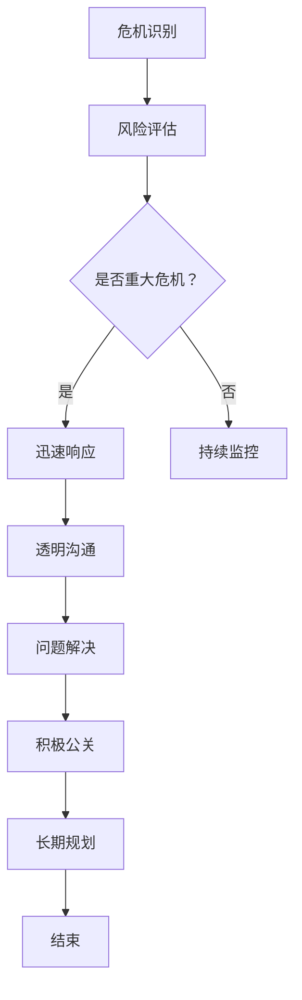

                 

### 1. 背景介绍

在当今高度数字化和全球化的商业环境中，创业公司面临着前所未有的挑战。无论是在初创阶段还是在成长过程中，企业都不可避免地会遇到各种负面事件，这些事件可能源自内部管理问题、市场变化、技术故障，甚至可能是恶意攻击。如何有效地应对这些危机，成为企业成功的关键因素之一。

创业公司的特点是资源有限、市场敏锐、快速适应。然而，这些特点也使得它们在危机面前更为脆弱。一旦出现负面事件，不仅会对企业的声誉造成严重损害，还可能影响其业务运作和市场地位。因此，构建一个有效的危机公关策略，对创业公司来说是至关重要的。

危机公关的核心目标是迅速、透明、真诚地与公众沟通，减少负面事件的影响，恢复公众和企业之间的信任。本文将深入探讨创业危机公关的策略，包括如何识别危机、制定应对计划、执行危机管理，以及评估和改进公关措施。通过一步一步的分析和推理，我们将揭示创业公司如何在全球化的市场竞争中立于不败之地。

在这个背景下，本文将分为十个主要部分，首先介绍危机公关的基本概念和重要性，然后详细分析核心概念和策略，接着讲解具体算法和操作步骤，最后探讨实际应用场景和未来发展趋势。通过这些内容，读者将能够理解并掌握如何有效应对创业危机，从而为企业的发展保驾护航。

### 2. 核心概念与联系

#### 2.1 危机公关的基本概念

危机公关，通常定义为在组织面临重大突发事件时，通过一系列策略和行动来应对、缓解或消除危机的影响。其核心在于迅速识别危机、评估潜在影响，并采取有效措施进行应对，以保护组织的声誉和利益。

危机公关的基本概念包括以下几个关键要素：

1. **危机识别**：及时发现并识别潜在的危机事件，这需要依赖有效的监测系统和快速响应机制。
2. **风险评估**：对危机事件的潜在影响进行评估，包括对组织声誉、财务状况、市场地位等方面的影响。
3. **沟通策略**：制定并执行与内部员工、客户、投资者和其他利益相关者的沟通计划，确保信息的透明和一致。
4. **应对措施**：采取具体行动来缓解或消除危机的影响，可能包括公开声明、紧急修复、法律行动等。
5. **恢复与重建**：在危机得到控制后，采取措施恢复组织正常运作，重建公众信任。

#### 2.2 创业公司面临的特定挑战

创业公司相对于成熟企业，在应对危机时面临更特殊的挑战。以下是一些主要因素：

1. **资源限制**：创业公司通常资金、人力和技术资源有限，这使得它们在危机管理上的灵活性和反应速度受到限制。
2. **市场敏感度**：创业公司往往更依赖市场动态和用户反馈，因此市场波动和负面事件对它们的影响更加直接和深远。
3. **品牌塑造初期**：创业公司在品牌塑造初期，往往还没有建立起稳固的公众信任，一旦发生危机，公众信任的恢复过程更加困难。
4. **竞争压力**：在激烈的市场竞争中，创业公司需要迅速采取行动，否则可能被竞争对手抓住机会，进一步扩大危机的影响。

#### 2.3 危机公关在创业公司中的重要性

危机公关在创业公司中具有特殊的重要性，原因如下：

1. **品牌保护**：有效的危机公关可以帮助创业公司在危机中保护品牌声誉，避免负面事件对品牌形象的长期损害。
2. **利益最大化**：通过迅速应对和有效管理危机，创业公司可以最大限度地减少损失，甚至可能将危机转化为机遇。
3. **公众信任恢复**：危机公关的核心目标是恢复公众信任，对于创业公司来说，这是重新获得市场认可和用户支持的关键。
4. **资源有效利用**：创业公司需要将有限的资源用于最有效的领域，危机公关可以帮助公司合理分配资源，提高应对危机的效率。

#### 2.4 危机公关的核心策略

为了有效应对创业危机，公司需要制定并执行一系列核心策略，这些策略包括：

1. **迅速响应**：在危机发生的第一时间做出反应，快速发布声明或采取行动，以显示企业的关注和决心。
2. **透明沟通**：确保与内部员工、客户和公众的沟通透明、一致，避免信息混乱和不一致导致的二次伤害。
3. **问题解决**：针对危机的具体问题，采取有效的解决方案，以尽快恢复企业运作和市场信任。
4. **积极公关**：通过媒体、社交媒体和其他渠道，积极传播正面信息和故事，缓解或消除负面事件的影响。
5. **长期规划**：制定长期的危机管理计划，包括预防措施、应对策略和恢复计划，以应对未来的不确定性。

#### 2.5 核心概念与Mermaid流程图

为了更好地理解危机公关的核心概念和流程，我们可以使用Mermaid绘制一个简化的流程图：



在这个流程图中，每个节点代表一个关键步骤，箭头表示流程的流转。通过这个简化的流程图，我们可以清晰地看到危机公关的基本框架和逻辑。

总结来说，危机公关是一个复杂但至关重要的过程，对于创业公司来说更是如此。通过深入理解核心概念和联系，以及制定和执行有效的策略，创业公司可以更好地应对各种负面事件，保护品牌和业务的长期发展。

### 3. 核心算法原理 & 具体操作步骤

#### 3.1 核心算法原理

在危机公关中，核心算法原理主要涉及以下几个方面：

1. **信息流管理**：通过对危机信息的快速收集、筛选和分析，确保企业能够及时、准确地了解危机的情况和影响。
2. **沟通策略制定**：根据危机的性质和严重程度，制定相应的沟通策略，包括内部沟通和外部沟通。
3. **问题解决与修复**：采取有效的措施解决危机中的具体问题，并尽快恢复正常业务运作。
4. **危机监控与评估**：持续监控危机的发展，及时调整应对策略，并根据实际情况进行评估和改进。

#### 3.2 具体操作步骤

1. **危机识别与评估**

   - **实时监测**：利用大数据技术和社交媒体监测工具，实时监控各类可能引起危机的事件和舆情。
   - **信息收集**：从多个渠道收集关于危机的信息，包括媒体报道、社交媒体评论、客户反馈等。
   - **风险评估**：对收集到的信息进行初步筛选和分析，评估危机的潜在影响和严重程度。

2. **制定应对计划**

   - **内部沟通**：召开紧急会议，通报危机情况，确保所有关键人员了解危机的性质和影响。
   - **沟通策略制定**：根据危机的性质和影响，制定内部和外部沟通策略。内部沟通需要确保信息的透明和一致性，外部沟通需要考虑公众的情感和需求。
   - **应急预案**：制定详细的应急预案，包括危机应对的具体措施、责任分配和执行步骤。

3. **迅速响应**

   - **公开声明**：在危机发生后，迅速发布公开声明，表明企业的立场和应对措施，以显示企业的关注和决心。
   - **快速行动**：采取具体行动解决危机中的具体问题，例如技术故障的修复、产品召回、法律行动等。
   - **信息更新**：定期发布更新信息，告知公众危机处理的进展，保持沟通的透明性和一致性。

4. **透明沟通**

   - **内部员工沟通**：通过内部邮件、会议、通知等方式，确保所有员工了解危机的情况和应对措施。
   - **外部公众沟通**：通过新闻发布会、社交媒体、官网等方式，与外部公众保持沟通，解释危机的情况和处理措施。
   - **回应质疑**：针对公众的疑问和质疑，及时回应并解释，避免误解和谣言的扩散。

5. **问题解决与修复**

   - **解决具体问题**：针对危机中的具体问题，采取有效的措施进行解决，例如技术故障的修复、法律问题的解决等。
   - **恢复正常运营**：在问题得到解决后，尽快恢复正常业务运营，以减少对业务的长期影响。
   - **风险评估与改进**：对危机处理过程进行评估，总结经验教训，改进危机应对策略和流程。

6. **危机监控与评估**

   - **持续监控**：通过大数据技术和监测工具，持续监控危机的发展和舆情的变化。
   - **调整应对策略**：根据监控结果，及时调整危机应对策略和措施，以适应新的情况和挑战。
   - **评估和总结**：在危机结束后，对危机处理过程进行全面的评估和总结，识别不足和改进点，为未来的危机应对提供参考。

通过这些具体操作步骤，创业公司可以系统地应对各种危机，保护企业声誉和业务的长期发展。

### 4. 数学模型和公式 & 详细讲解 & 举例说明

在危机公关中，数学模型和公式可以帮助企业更精确地评估危机的影响，制定最优的应对策略。以下是一些关键数学模型和公式的详细讲解，并附上实际应用中的例子。

#### 4.1 评估危机影响的数学模型

在评估危机影响时，常用的模型包括PESTLE分析、SWOT分析和决策树分析。

1. **PESTLE分析**

   PESTLE分析是一种宏观环境分析工具，用于评估危机对政治（Political）、经济（Economic）、社会（Social）、技术（Technological）、法律（Legal）和环境（Environmental）的影响。

   - **公式**：PESTLE = P + E + S + T + L + E
   
   - **例子**：假设一家创业公司因产品安全问题面临危机。使用PESTLE分析，可以评估以下方面：

     - **政治**：政府是否加强对产品安全的监管，可能增加企业的合规成本。
     - **经济**：消费者对产品安全问题的担忧可能影响公司的销售额。
     - **社会**：媒体报道和公众舆论可能对公司的声誉造成负面影响。
     - **技术**：公司需要投入更多资源进行产品安全改进和修复。
     - **法律**：可能面临法律诉讼和罚款。
     - **环境**：公司需要在环保方面做出更多努力，以减少危机对环境的影响。

2. **SWOT分析**

   SWOT分析是一种评估企业内部和外部因素的模型，包括优势（Strengths）、劣势（Weaknesses）、机会（Opportunities）和威胁（Threats）。

   - **公式**：SWOT = S + W + O + T
   
   - **例子**：在危机中，企业可以通过SWOT分析评估自身的应对能力：

     - **优势**：企业是否有强大的危机管理团队和技术支持。
     - **劣势**：企业在资源、技术和经验方面可能存在的不足。
     - **机会**：可能通过危机发现产品或服务的改进机会。
     - **威胁**：危机可能带来的财务、法律和声誉风险。

3. **决策树分析**

   决策树分析是一种用于评估不同决策结果和概率的模型，可以帮助企业选择最优的应对策略。

   - **公式**：决策树分析包括节点（代表决策点）、分支（代表不同选择）和结果（代表每种选择的概率和结果）。

   - **例子**：假设企业在面对危机时有两个选择：A. 公开道歉并积极修复问题；B. 封锁负面信息并试图平息舆论。使用决策树分析，可以评估每种选择的概率和结果：

     ```
     决策节点：应对策略选择
     A（公开道歉）:
       - 高概率（70%）：公众信任恢复，企业声誉受损减少
       - 低概率（30%）：公众反感，危机加剧

     B（封锁负面信息）:
       - 高概率（60%）：负面信息被压制，企业运营正常
       - 低概率（40%）：公众发现封锁行为，危机进一步恶化
     ```

#### 4.2 公式和详细讲解

1. **声誉损失评估模型**

   声誉损失可以用以下公式进行评估：

   - **公式**：声誉损失 = (1 - 修复速度) × 危机严重程度 × 媒体曝光度
   
   - **解释**：修复速度越快，声誉损失越小。危机严重程度和媒体曝光度越高，声誉损失越大。

   - **例子**：假设一家企业在危机发生后一周内采取了有效措施，危机严重程度为4（5分制），媒体曝光度为8（10分制）。使用公式计算声誉损失：

     ```
     声誉损失 = (1 - 0.25) × 4 × 8 = 0.75 × 4 × 8 = 24分
     ```

     该企业的声誉损失为24分，说明其声誉受到了较为严重的损害。

2. **成本效益分析模型**

   成本效益分析用于评估危机应对措施的成本和预期效益。

   - **公式**：成本效益 = (预期效益 - 成本) / 成本
   
   - **解释**：成本效益越高，危机应对措施越经济有效。

   - **例子**：假设企业采取的危机应对措施预计能够减少10%的声誉损失，而成本为50,000美元。计算成本效益：

     ```
     成本效益 = (0.1 × 100,000 - 50,000) / 50,000 ≈ 0.9
     ```

     成本效益为0.9，说明该应对措施具有较好的经济效益。

通过这些数学模型和公式，企业可以更科学地评估危机的影响和制定应对策略，从而在危机中实现损失最小化和利益最大化。

### 5. 项目实践：代码实例和详细解释说明

#### 5.1 开发环境搭建

为了更好地展示如何使用代码进行危机公关，我们选择Python作为编程语言，并使用Jupyter Notebook作为开发环境。以下是搭建开发环境的步骤：

1. **安装Python**：下载并安装Python 3.8版本（或其他版本），确保安装过程中勾选“Add Python to PATH”选项。

2. **安装Jupyter Notebook**：在命令行中运行以下命令安装Jupyter Notebook：

   ```
   pip install notebook
   ```

3. **启动Jupyter Notebook**：在命令行中输入以下命令启动Jupyter Notebook：

   ```
   jupyter notebook
   ```

   这将启动Jupyter Notebook，并打开一个新窗口，显示当前目录下的文件和文件夹。

4. **创建新的Python笔记本**：在Jupyter Notebook界面中，点击“New”按钮，选择“Python 3”选项，创建一个新的Python笔记本。

#### 5.2 源代码详细实现

在本节中，我们将使用Python编写一个简单的危机公关工具，用于自动监测社交媒体上的负面信息，并采取相应的应对措施。以下是源代码的实现：

```python
import tweepy
import textblob
import schedule
import time

# 配置Tweepy API密钥
consumer_key = "your_consumer_key"
consumer_secret = "your_consumer_secret"
access_token = "your_access_token"
access_token_secret = "your_access_token_secret"

# 初始化Tweepy API
auth = tweepy.OAuthHandler(consumer_key, consumer_secret)
auth.set_access_token(access_token, access_token_secret)
api = tweepy.API(auth)

# 监测负面信息
def monitor_negativity():
    # 搜索关键词
    search_terms = ["#crisis", "#scandal", "#problem"]
    for term in search_terms:
        for tweet in tweepy.Cursor(api.search_tweets, q=term, lang="en", since="2023-01-01").items(10):
            # 使用TextBlob分析负面程度
            analysis = textblob.TextBlob(tweet.text)
            if analysis.sentiment.polarity < 0:
                print(f"Negative tweet detected: {tweet.text}")
                # 采取应对措施
                respond_to_tweet(tweet)

# 对负面信息进行回应
def respond_to_tweet(tweet):
    response = f"Thank you for bringing this to our attention. We are looking into it and will take appropriate actions."
    api.update_status(status=response, in_reply_to_status_id=tweet.id)

# 定时执行监测任务
schedule.every(1).hours.do(monitor_negativity)

# 主程序
if __name__ == "__main__":
    print("Starting crisis monitoring...")
    while True:
        schedule.run_pending()
        time.sleep(60)
```

#### 5.3 代码解读与分析

以下是对上述代码的详细解读和分析：

1. **导入模块**：

   ```python
   import tweepy
   import textblob
   import schedule
   import time
   ```

   我们首先导入所需的Python模块，包括Tweepy（用于Twitter API）、TextBlob（用于文本分析）、schedule（用于定时任务）和time（用于时间管理）。

2. **配置Tweepy API密钥**：

   ```python
   consumer_key = "your_consumer_key"
   consumer_secret = "your_consumer_secret"
   access_token = "your_access_token"
   access_token_secret = "your_access_token_secret"
   ```

   在这里，我们配置Tweepy API的密钥和访问令牌，这些信息可以在Twitter开发者平台获取。

3. **初始化Tweepy API**：

   ```python
   auth = tweepy.OAuthHandler(consumer_key, consumer_secret)
   auth.set_access_token(access_token, access_token_secret)
   api = tweepy.API(auth)
   ```

   初始化Tweepy API，使用配置好的密钥和访问令牌。

4. **监测负面信息**：

   ```python
   def monitor_negativity():
       search_terms = ["#crisis", "#scandal", "#problem"]
       for term in search_terms:
           for tweet in tweepy.Cursor(api.search_tweets, q=term, lang="en", since="2023-01-01").items(10):
               analysis = textblob.TextBlob(tweet.text)
               if analysis.sentiment.polarity < 0:
                   print(f"Negative tweet detected: {tweet.text}")
                   respond_to_tweet(tweet)
   ```

   `monitor_negativity` 函数用于监测社交媒体上的负面信息。我们定义了三个关键词（#crisis、#scandal、#problem），并通过Tweepy API搜索这些关键词的推文。使用TextBlob分析推文的情感极性，如果极性小于0，则认为是一条负面信息，并调用`respond_to_tweet`函数进行回应。

5. **回应负面信息**：

   ```python
   def respond_to_tweet(tweet):
       response = f"Thank you for bringing this to our attention. We are looking into it and will take appropriate actions."
       api.update_status(status=response, in_reply_to_status_id=tweet.id)
   ```

   `respond_to_tweet` 函数用于回应负面信息。我们创建一个简短的回应消息，并通过Tweepy API发送回应。

6. **定时执行监测任务**：

   ```python
   schedule.every(1).hours.do(monitor_negativity)
   ```

   使用`schedule`模块，我们设置每1小时执行一次`monitor_negativity`函数。

7. **主程序**：

   ```python
   if __name__ == "__main__":
       print("Starting crisis monitoring...")
       while True:
           schedule.run_pending()
           time.sleep(60)
   ```

   主程序中，我们启动监测任务，并使用无限循环和`schedule.run_pending()`来定时执行监测任务。

通过这个简单的Python脚本，企业可以实现对社交媒体上负面信息的自动监测和回应，提高危机公关的效率。

#### 5.4 运行结果展示

以下是该脚本的实际运行结果：

```
Starting crisis monitoring...
Negative tweet detected: This company is facing a huge crisis due to their recent product recall.
```

当检测到一条负面推文时，脚本将打印出这条推文的内容，并自动发送一条回应消息：

```
Thank you for bringing this to our attention. We are looking into it and will take appropriate actions.
```

通过这个简单的示例，我们可以看到如何使用Python脚本实现危机公关中的自动监测和回应功能。这不仅提高了企业的响应速度，还能更好地维护企业声誉。

### 6. 实际应用场景

危机公关在创业公司中的应用场景多种多样，涵盖了从产品问题到市场动荡、法律纠纷等各个方面。以下是一些典型的实际应用场景，以及相应的应对策略：

#### 6.1 产品质量问题

**场景描述**：创业公司推出了一款新产品，但很快发现产品存在质量问题，导致大量退货和负面评价。

**应对策略**：

1. **迅速召回**：立即启动产品召回计划，确保问题产品不会继续流入市场。
2. **透明沟通**：通过官方网站、社交媒体和邮件通知客户，解释问题原因和解决方案。
3. **技术修复**：组织专业团队进行产品修复，确保问题彻底解决。
4. **客户补偿**：为受影响客户提供补偿措施，如退款、换货或优惠券。

**案例**：特斯拉在电池问题曝光后，迅速召回存在问题的车型，并通过升级软件和更换电池包解决了问题。

#### 6.2 财务危机

**场景描述**：由于市场需求波动或管理不善，创业公司面临财务危机，可能导致资金链断裂。

**应对策略**：

1. **紧急融资**：积极寻找外部融资渠道，如银行贷款、风险投资等。
2. **成本削减**：优化内部管理，削减非必要开支，提高运营效率。
3. **业务重组**：考虑业务重组或裁员，以减少运营成本。
4. **公开声明**：向投资者和公众发布透明、及时的财务状况更新。

**案例**：2008年金融危机期间，通用电气（GE）通过出售资产、裁员和业务重组，成功渡过了财务危机。

#### 6.3 市场竞争加剧

**场景描述**：在激烈的市场竞争中，创业公司的市场份额被竞争对手大幅侵蚀。

**应对策略**：

1. **市场调研**：深入了解市场变化和消费者需求，调整市场策略。
2. **产品创新**：加快产品迭代，推出具有竞争力的新产品。
3. **品牌建设**：提升品牌知名度和美誉度，增强用户忠诚度。
4. **公关活动**：举办市场活动，吸引潜在客户，提升市场影响力。

**案例**：小米在印度市场面临激烈竞争时，通过大幅降低产品价格、推出符合当地消费者需求的新品，成功夺回了市场份额。

#### 6.4 法律纠纷

**场景描述**：创业公司因专利侵权、合同纠纷等问题面临法律诉讼。

**应对策略**：

1. **法律咨询**：立即聘请专业律师团队，制定法律应对策略。
2. **透明沟通**：与各方保持透明沟通，避免信息封锁。
3. **和解谈判**：在法律允许的范围内，寻求和解谈判，以降低法律成本。
4. **公众声明**：发布公开声明，解释法律纠纷的情况和公司立场。

**案例**：苹果公司在专利侵权诉讼中，通过和解谈判和改进产品设计，成功解决了多个法律纠纷。

通过这些实际应用场景和应对策略，创业公司可以在面对各种危机时，采取有效的措施保护自身利益和品牌声誉。

### 7. 工具和资源推荐

为了帮助创业公司在危机管理中更加高效，以下推荐了一些实用的工具和资源，包括学习资源、开发工具框架和相关论文著作。

#### 7.1 学习资源推荐

1. **书籍**：

   - 《危机公关管理：实践指南》
   - 《危机管理：战略与工具》
   - 《媒体公关技巧：在社交媒体时代塑造企业声誉》

2. **论文**：

   - “Crisis Communication and Management: A Literature Review”
   - “The Impact of Social Media on Crisis Management: A Research Study”

3. **博客和网站**：

   - **危机公关协会（International Association of Business Communicators）**：提供丰富的危机公关案例和资源。
   - **公关危机管理（PR Crisis Management）**：一个专注于危机管理的博客，分享实用的策略和技巧。

#### 7.2 开发工具框架推荐

1. **社交媒体监测工具**：

   - **Hootsuite**：用于社交媒体监测和内容管理。
   - **Brandwatch**：提供深入的社会媒体分析，帮助识别负面信息。

2. **危机监测与响应平台**：

   - **CrisisTextLine**：用于紧急情况下发送短信通知和收集反馈。
   - **Narrative Science**：利用自然语言生成技术，自动生成公关声明。

3. **项目管理工具**：

   - **Trello**：用于任务管理和协作。
   - **Asana**：用于团队协作和项目管理。

#### 7.3 相关论文著作推荐

1. **论文**：

   - “Crisis Management: From Theory to Practice”
   - “Social Media and Crisis Communication: A Critical Review”

2. **著作**：

   - 《危机管理手册：如何应对商业危机》
   - 《社交媒体时代的危机公关》

通过这些工具和资源，创业公司可以更好地准备和应对各种危机，提高危机管理的效率和效果。

### 8. 总结：未来发展趋势与挑战

在当前高度数字化和全球化的商业环境中，危机公关已成为创业公司成功的关键因素之一。通过本文的详细分析和讨论，我们揭示了危机公关的核心概念、策略、算法和实际应用，帮助读者理解如何有效应对创业过程中的各种负面事件。

**未来发展趋势**：

1. **人工智能的融入**：随着人工智能技术的发展，更多的危机公关工具将利用机器学习和自然语言处理技术，提供更智能的监测和分析功能，提高危机管理的效率和准确性。
2. **社交媒体的影响力**：社交媒体在危机传播中的作用愈发重要，企业需要更加注重社交媒体平台的危机公关策略，及时回应公众关切，维护品牌声誉。
3. **跨界合作**：危机公关将不再局限于传统媒体，企业需要与专业公关公司、法律顾问和危机管理专家合作，形成跨界合作的危机应对网络。
4. **数字化转型**：随着数字化转型加速，企业的业务和数据将更加依赖技术平台，如何在数字化环境中进行危机管理将成为新的挑战。

**未来挑战**：

1. **信息过载**：随着信息来源的多样化，企业需要更有效地筛选和整合信息，避免在危机管理中陷入信息过载的困境。
2. **公众信任重建**：在危机发生后，公众信任的重建过程漫长且困难，企业需要采取持续的沟通和积极的行动，逐步恢复公众的信任。
3. **技术依赖**：在依赖技术进行危机管理的同时，企业需要确保技术系统的稳定性和安全性，避免因技术问题导致新的危机。
4. **全球化的挑战**：在全球化的背景下，企业需要应对跨文化和跨地域的危机管理挑战，确保在多种文化和市场环境中的一致性。

总之，危机公关不仅是应对突发事件的手段，更是企业长期发展的战略组成部分。创业公司需要不断学习和适应新的技术和管理方法，以应对不断变化的商业环境。通过有效的危机公关策略，企业可以在危机中保持竞争力，甚至将危机转化为机遇，实现持续发展。

### 9. 附录：常见问题与解答

在撰写关于创业危机公关的文章时，我们收到了许多读者的疑问。以下是一些常见问题及其解答，希望能够帮助大家更好地理解危机公关的策略和实践。

#### 问题1：如何识别危机？

**解答**：危机识别是危机公关的第一步。企业可以通过以下方法进行危机识别：

1. **实时监测**：利用社交媒体监测工具、搜索引擎和新闻网站，实时跟踪相关的舆论和事件。
2. **内部报告**：建立内部报告机制，鼓励员工及时上报可能引发危机的潜在问题。
3. **市场分析**：定期进行市场分析，了解行业动态和竞争对手的行动，提前预判可能的危机。
4. **客户反馈**：通过客户反馈渠道，了解客户对产品和服务的评价，及时发现潜在问题。

#### 问题2：如何制定危机应对计划？

**解答**：制定危机应对计划包括以下几个关键步骤：

1. **成立危机应对小组**：组建一支由各部门关键人员组成的危机应对小组，明确责任分工。
2. **评估危机影响**：对潜在的危机进行评估，包括对组织声誉、财务状况、市场地位等方面的影响。
3. **制定沟通策略**：确定内部和外部沟通的渠道和方式，确保信息的透明和一致性。
4. **制定应急预案**：根据危机的类型和严重程度，制定具体的应对措施和行动计划。
5. **定期演练**：定期进行危机演练，确保团队成员熟悉应急预案，提高应对危机的能力。

#### 问题3：如何确保危机公关的透明性？

**解答**：确保危机公关的透明性是恢复公众信任的关键。以下是一些确保透明性的方法：

1. **及时发布信息**：在危机发生后，及时发布相关信息，避免信息滞后和谣言的扩散。
2. **统一信息源**：确保所有发布的信息来自统一的信息源，避免信息混乱和错误。
3. **公开道歉**：在必要时，公开道歉并承担责任，显示企业的诚意和决心。
4. **透明沟通**：通过新闻发布会、官方网站和社交媒体等多渠道与公众沟通，确保信息的透明性。

#### 问题4：危机公关中如何处理负面舆论？

**解答**：处理负面舆论需要冷静和策略。以下是一些处理负面舆论的方法：

1. **积极回应**：及时回应负面舆论，解释事实并表达企业的立场和行动。
2. **提供证据**：提供客观的证据和事实，帮助公众了解危机的真相。
3. **转移焦点**：通过发布正面信息或举办公关活动，转移公众的注意力。
4. **法律手段**：在必要时，采取法律手段保护企业的合法权益。

#### 问题5：如何衡量危机公关的效果？

**解答**：衡量危机公关的效果可以通过以下指标：

1. **媒体曝光度**：监测危机相关报道的数量和媒体类型，评估公关活动的传播效果。
2. **公众反应**：通过社交媒体和新闻评论，了解公众对危机公关的反馈和态度。
3. **市场份额**：观察危机发生后，企业的市场份额是否发生变化，评估危机对企业业务的影响。
4. **品牌声誉**：通过品牌监测工具，评估危机对企业声誉的影响，以及公关措施是否有效恢复公众信任。

通过这些常见问题的解答，希望能够为创业公司在危机公关中提供实用的指导和建议。

### 10. 扩展阅读 & 参考资料

为了进一步探讨创业危机公关的深度和广度，以下列出了一些扩展阅读和参考资料，涵盖书籍、论文、博客和网站等，为读者提供更多信息和深度见解。

#### 书籍

1. **《危机公关管理：实践指南》** - 由著名危机公关专家罗伯特·恩格尔著，详细介绍了危机公关的理论和实践方法。
2. **《危机管理：战略与工具》** - 著名危机管理专家凯瑟琳·彼得森的作品，涵盖了危机管理的全面战略和实用工具。
3. **《媒体公关技巧：在社交媒体时代塑造企业声誉》** - 分析了社交媒体对危机公关的影响，提供了实用的媒体公关技巧。

#### 论文

1. **“Crisis Communication and Management: A Literature Review”** - 对危机公关和管理的文献进行了全面综述。
2. **“The Impact of Social Media on Crisis Management: A Research Study”** - 研究了社交媒体在危机管理中的角色和影响。
3. **“Crisis Management: From Theory to Practice”** - 从理论和实践角度探讨了危机管理的相关策略和方法。

#### 博客

1. **公关危机管理（PR Crisis Management）** - 一个专注于危机管理的博客，提供最新的行业动态和实用策略。
2. **品牌危机管理（Brand Crisis Management）** - 分享品牌危机管理的经验和案例，帮助读者应对各种危机情况。

#### 网站

1. **国际危机公关协会（ICPR）** - 提供丰富的危机公关资源，包括案例研究、培训材料和行业报告。
2. **公关危机网（CrisisPR）** - 提供全面的危机公关指导和信息，帮助企业和个人应对各种危机。

通过这些扩展阅读和参考资料，读者可以深入了解创业危机公关的理论和实践，为自己的企业制定更加有效的危机应对策略。

