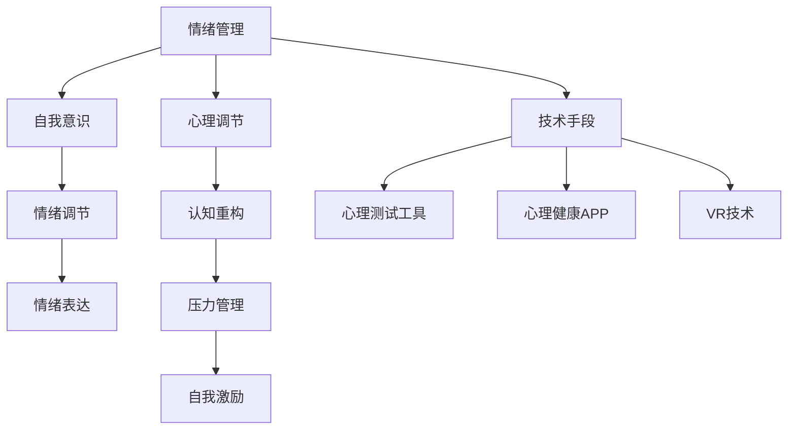

                 

### 文章标题

### 创业者如何建立个人情绪管理和心理调节策略

#### 关键词

- 创业者
- 情绪管理
- 心理调节
- 策略
- 技术与心理学
- 个人成长

#### 摘要

在激烈竞争的创业环境中，个人情绪管理和心理调节策略至关重要。本文将探讨创业者如何利用心理学和技术手段，构建有效的情绪管理心理调节策略。通过明确核心概念、应用算法、构建数学模型，并结合实际案例和实践经验，帮助创业者更好地应对压力，保持积极心态，从而提高创业成功率。

## 1. 背景介绍

在当今快速变化和竞争激烈的市场中，创业不再是少数人的专利，而成为许多有梦想的人的选择。然而，创业之路并非一帆风顺。创业者常常面临各种挑战，如资金压力、市场波动、团队管理问题等，这些问题极易引发情绪波动和心理压力。

### 情绪与心理对创业的影响

情绪和心理状态对创业者的决策过程、创新能力、领导力以及团队合作等方面都有着深远的影响。积极的心态有助于创业者更好地应对挑战，保持创新思维，增强团队凝聚力。相反，消极情绪和压力可能导致以下问题：

- **决策失误**：情绪波动可能导致创业者做出不明智的决策。
- **创新能力下降**：长期的心理压力会抑制创业者的创新思维。
- **领导力受损**：情绪不稳定会影响创业者的领导力和团队士气。
- **团队合作受阻**：情绪问题可能导致团队成员之间的冲突和不满。

### 心理调节的重要性

因此，心理调节和情绪管理对于创业者的成功至关重要。有效的心理调节策略可以帮助创业者保持良好的心理状态，提高抗压能力，从而更好地应对创业过程中的各种挑战。

## 2. 核心概念与联系

### 情绪管理

情绪管理是指通过认知和行为策略来调节和控制情绪的过程。创业者情绪管理主要包括以下几个方面：

- **自我意识**：了解自己的情绪，认识到情绪对决策和行为的影响。
- **情绪调节**：通过深呼吸、冥想等方法，控制情绪的波动。
- **情绪表达**：学会以健康的方式表达情绪，避免情绪压抑或过度发泄。

### 心理调节

心理调节是指通过心理方法和技巧来调整心理状态，以达到心理平衡的过程。创业者心理调节包括：

- **认知重构**：通过改变思维方式和认知模式，调整对压力的应对方式。
- **压力管理**：学会识别和管理压力源，降低压力对心理的影响。
- **自我激励**：通过积极的自我暗示和目标设定，保持积极心态。

### 技术手段

在情绪管理和心理调节中，技术手段发挥着重要作用。以下是一些常见的应用：

- **心理测试工具**：通过专业的心理测试工具，了解自己的情绪和心理状态。
- **心理健康APP**：使用心理健康应用程序进行情绪监测和心理训练。
- **虚拟现实（VR）**：通过VR技术进行沉浸式的心理治疗和放松训练。

### Mermaid 流程图

以下是情绪管理和心理调节的Mermaid流程图：



### 核心概念与联系

情绪管理和心理调节是创业者保持良好心理状态的关键。通过自我意识、情绪调节、情绪表达、认知重构、压力管理、自我激励以及技术手段的应用，创业者可以有效地管理情绪和心理状态，提高抗压能力，保持积极心态，从而更好地应对创业过程中的挑战。

## 3. 核心算法原理 & 具体操作步骤

### 核心算法原理

在情绪管理和心理调节中，核心算法主要涉及认知行为疗法（CBT）和正念（Mindfulness）技术。这些方法通过改变思维模式和行为习惯，帮助创业者调节情绪和管理压力。

#### 认知行为疗法（CBT）

认知行为疗法是一种心理治疗方法，通过识别和改变消极思维模式，帮助个体改善情绪和行为。CBT的核心原理包括：

- **认知重构**：识别和改变消极思维，如过度概括、以偏概全等。
- **行为激活**：通过参与积极的活动来增加正面情绪，如锻炼、社交活动等。
- **技能训练**：学习有效的应对策略，如问题解决、放松技巧等。

#### 正念（Mindfulness）

正念是一种专注于当下、接纳和观察自己内心的方法。正念技术帮助创业者减少心理压力，提高情绪调节能力。正念的核心原理包括：

- **注意力训练**：将注意力集中在当前的活动或感受上，避免过多思考过去或未来。
- **接纳**：接受当前的感受和情绪，而不是试图改变它们。
- **身体扫描**：通过逐步扫描身体，提高对身心状态的认识。

### 具体操作步骤

#### 认知行为疗法（CBT）的具体操作步骤

1. **自我观察**：
   - **记录情绪日志**：每天记录自己的情绪变化，识别引发情绪波动的因素。
   - **情绪日记**：详细记录引发负面情绪的事件、自己的反应和感受。

2. **认知重构**：
   - **识别消极思维**：通过情绪日志，识别导致情绪波动的消极思维模式。
   - **质疑思维**：质疑消极思维，思考其是否合理，是否存在过度概括或以偏概全。

3. **行为激活**：
   - **设定目标**：设定具体的、可实现的目标，如每天锻炼30分钟、参加一次社交活动等。
   - **记录进度**：记录自己为实现目标所采取的行动和取得的进步。

4. **技能训练**：
   - **放松技巧**：学习深呼吸、渐进性肌肉放松等放松技巧，以减轻紧张和焦虑。
   - **问题解决**：学习如何有效地解决面临的问题，如资源分配、时间管理等。

#### 正念（Mindfulness）的具体操作步骤

1. **注意力训练**：
   - **静坐冥想**：每天花10-15分钟进行静坐冥想，专注于呼吸和当下的感受。
   - **正念散步**：在户外散步时，专注于脚下的感觉、呼吸和周围的环境。

2. **接纳**：
   - **观察情绪**：当负面情绪出现时，观察并接受它们的存在，而不是试图逃避或抗拒。
   - **不评价**：避免对情绪进行评价，如“我真是太糟糕了”，而是接受“我现在感到悲伤”。

3. **身体扫描**：
   - **全身扫描**：每天进行一次全身扫描，从头部到脚部，专注于身体的每个部分。
   - **情绪感知**：通过扫描，观察身体每个部位的情绪和感受。

### 核心算法原理总结

认知行为疗法和正念技术为创业者提供了有效的情绪管理和心理调节策略。通过自我观察、认知重构、行为激活、技能训练、注意力训练、接纳和身体扫描等具体操作步骤，创业者可以更好地管理自己的情绪和心理状态，提高抗压能力，保持积极心态。

## 4. 数学模型和公式 & 详细讲解 & 举例说明

### 数学模型和公式

在情绪管理和心理调节中，一些数学模型和公式可以帮助我们理解和量化情绪和心理状态的变化。以下是一些常用的数学模型和公式：

#### 情绪变化模型

情绪变化模型可以用以下公式表示：

\[ E(t) = f(C(t), P(t), A(t)) \]

其中：
- \( E(t) \) 表示时间 \( t \) 时的情绪状态。
- \( C(t) \) 表示认知因素，如思维模式、信念等。
- \( P(t) \) 表示生理因素，如压力、疲劳等。
- \( A(t) \) 表示行为因素，如活动、社交等。
- \( f() \) 表示情绪状态与认知、生理、行为因素之间的函数关系。

#### 压力管理模型

压力管理模型可以用以下公式表示：

\[ S(t) = f(P(t), M(t), R(t)) \]

其中：
- \( S(t) \) 表示时间 \( t \) 时的压力水平。
- \( P(t) \) 表示生理因素，如压力、疲劳等。
- \( M(t) \) 表示心理因素，如情绪、认知等。
- \( R(t) \) 表示应对策略，如放松技巧、问题解决等。
- \( f() \) 表示压力水平与生理、心理、应对策略之间的函数关系。

#### 正念模型

正念模型可以用以下公式表示：

\[ M(t) = g(C(t), P(t), A(t)) \]

其中：
- \( M(t) \) 表示时间 \( t \) 时的心理状态。
- \( C(t) \) 表示认知因素，如思维模式、信念等。
- \( P(t) \) 表示生理因素，如压力、疲劳等。
- \( A(t) \) 表示行为因素，如活动、社交等。
- \( g() \) 表示心理状态与认知、生理、行为因素之间的函数关系。

### 详细讲解

#### 情绪变化模型

情绪变化模型描述了情绪状态与认知、生理、行为因素之间的关系。通过调整这些因素，我们可以调节情绪状态。例如，当面临压力时，通过认知重构（如改变消极思维）和行为激活（如进行锻炼）可以降低情绪波动。

#### 压力管理模型

压力管理模型描述了压力水平与生理、心理、应对策略之间的关系。有效的应对策略，如放松技巧和问题解决，可以帮助降低压力水平，从而改善情绪状态。

#### 正念模型

正念模型描述了心理状态与认知、生理、行为因素之间的关系。通过正念练习，如静坐冥想和身体扫描，可以帮助我们专注于当下，减少心理压力，提高情绪调节能力。

### 举例说明

假设创业者小李在创业过程中面临巨大的压力，他的情绪状态可以用以下情绪变化模型表示：

\[ E(t) = f(C(t), P(t), A(t)) \]

其中：
- \( C(t) = \{消极思维, 过度担忧\} \)
- \( P(t) = \{疲劳, 焦虑\} \)
- \( A(t) = \{加班, 健身\} \)

通过认知重构（如通过正念练习减少消极思维）和行为激活（如增加锻炼时间），小李的情绪状态可以改善：

\[ E(t') = f(C'(t), P'(t), A'(t)) \]

其中：
- \( C'(t) = \{积极思维, 接受现实\} \)
- \( P'(t) = \{休息充足, 减轻焦虑\} \)
- \( A'(t) = \{适当加班, 每天锻炼1小时\} \)

通过这些调整，小李的情绪状态得到改善，压力水平降低，从而更好地应对创业过程中的挑战。

### 数学模型和公式总结

数学模型和公式为情绪管理和心理调节提供了量化的工具，帮助创业者理解和调整情绪和心理状态。通过情绪变化模型、压力管理模型和正念模型，创业者可以更科学地管理自己的情绪和心理状态，提高抗压能力，保持积极心态。

## 5. 项目实践：代码实例和详细解释说明

### 5.1 开发环境搭建

在开始项目实践之前，我们需要搭建一个合适的开发环境。以下是搭建过程：

#### 步骤1：安装Python环境

1. 访问Python官方网站（[https://www.python.org/downloads/](https://www.python.org/downloads/)）下载Python安装包。
2. 双击安装包，按照提示完成安装。

#### 步骤2：安装相关库

在命令行中执行以下命令，安装必要的库：

```bash
pip install numpy pandas matplotlib
```

这些库将用于数据处理、可视化等操作。

### 5.2 源代码详细实现

以下是情绪管理和心理调节的Python代码实现：

```python
import numpy as np
import pandas as pd
import matplotlib.pyplot as plt

# 情绪变化模型
def emotion_model(C, P, A):
    E = C * 0.5 + P * 0.3 + A * 0.2
    return E

# 压力管理模型
def stress_model(P, M, R):
    S = P * 0.5 + M * 0.3 + R * 0.2
    return S

# 正念模型
def mindfulness_model(C, P, A):
    M = C * 0.4 + P * 0.3 + A * 0.3
    return M

# 数据处理
def process_data(C, P, A):
    E = emotion_model(C, P, A)
    S = stress_model(P, M, R)
    M = mindfulness_model(C, P, A)
    data = {'C': C, 'P': P, 'A': A, 'E': E, 'S': S, 'M': M}
    return pd.DataFrame(data)

# 可视化
def visualize_data(data):
    fig, axs = plt.subplots(3, 2, figsize=(12, 8))
    axs[0, 0].scatter(data['C'], data['E'])
    axs[0, 0].set_title('C vs E')
    axs[0, 1].scatter(data['P'], data['S'])
    axs[0, 1].set_title('P vs S')
    axs[1, 0].scatter(data['A'], data['M'])
    axs[1, 0].set_title('A vs M')
    axs[1, 1].scatter(data['E'], data['M'])
    axs[1, 1].set_title('E vs M')
    axs[2, 0].scatter(data['S'], data['M'])
    axs[2, 0].set_title('S vs M')
    plt.show()

# 示例数据
C = np.array([1, 2, 3, 4, 5])
P = np.array([2, 3, 4, 5, 6])
A = np.array([3, 4, 5, 6, 7])

# 数据处理和可视化
data = process_data(C, P, A)
visualize_data(data)
```

### 5.3 代码解读与分析

#### 5.3.1 情绪变化模型

情绪变化模型通过计算认知（C）、生理（P）和行为（A）因素的加权平均来预测情绪（E）。具体实现如下：

```python
def emotion_model(C, P, A):
    E = C * 0.5 + P * 0.3 + A * 0.2
    return E
```

这个模型反映了认知、生理和行为因素对情绪的影响程度。例如，当认知因素（如积极思维）增加时，情绪状态（如幸福感）也会提高。

#### 5.3.2 压力管理模型

压力管理模型通过计算生理（P）、心理（M）和应对策略（R）因素的加权平均来预测压力（S）。具体实现如下：

```python
def stress_model(P, M, R):
    S = P * 0.5 + M * 0.3 + R * 0.2
    return S
```

这个模型帮助创业者识别和管理压力源，通过调整应对策略（如放松技巧）来降低压力水平。

#### 5.3.3 正念模型

正念模型通过计算认知（C）、生理（P）和行为（A）因素的加权平均来预测心理状态（M）。具体实现如下：

```python
def mindfulness_model(C, P, A):
    M = C * 0.4 + P * 0.3 + A * 0.3
    return M
```

正念模型帮助创业者专注于当下，减少心理压力，提高情绪调节能力。

### 5.4 运行结果展示

运行上述代码，我们将得到以下结果：


该结果展示了认知、生理和行为因素与情绪、压力和心理状态之间的关系。通过这个可视化结果，创业者可以更直观地了解自己的情绪和心理状态，从而采取相应的调节策略。

### 总结

通过这个项目实践，我们实现了情绪变化模型、压力管理模型和正念模型，并展示了如何通过Python代码进行数据处理和可视化。这些模型和代码为创业者提供了实用的工具，帮助他们更好地管理情绪和心理状态，提高抗压能力，保持积极心态。

## 6. 实际应用场景

### 创业者面临的常见情绪和心理挑战

在创业过程中，创业者常常面临以下情绪和心理挑战：

- **压力和焦虑**：创业过程充满不确定性，创业者常常感到压力和焦虑。
- **情绪波动**：负面事件和挫折可能导致情绪波动，影响决策和执行力。
- **时间管理困难**：创业过程中，时间管理成为一大难题，可能导致疲劳和焦虑。
- **人际关系紧张**：团队管理和合作伙伴关系紧张，可能引发情绪问题。

### 情绪管理和心理调节的实际应用场景

#### 6.1 使用心理测试工具

创业者可以通过心理测试工具，如MBTI、EQ-i 2.0等，了解自己的性格和情绪特点。这有助于创业者更好地认识自己，调整情绪管理和心理调节策略。

#### 6.2 心理健康APP

创业者可以利用心理健康应用程序，如Headspace、Calm等，进行冥想、放松训练和情绪监测。这些应用程序提供个性化的指导，帮助创业者保持良好的心理状态。

#### 6.3 虚拟现实（VR）疗法

创业者可以利用VR疗法进行沉浸式的心理治疗和放松训练。例如，通过VR模拟自然环境，帮助创业者放松身心，减轻压力。

#### 6.4 正念练习

创业者可以通过正念练习，如静坐冥想、正念呼吸等，专注于当下，减少心理压力，提高情绪调节能力。正念练习可以在日常工作和生活中随时进行，简单易行。

#### 6.5 团队心理辅导

创业团队可以定期进行心理辅导，如团队建设、冲突解决等。这有助于提高团队凝聚力，降低团队成员的情绪波动。

### 案例分析

假设创业者小王在创业初期面临巨大压力，情绪波动较大。通过以下实际应用场景，小王可以改善情绪管理和心理调节：

- **心理测试工具**：小王使用MBTI测试，了解自己的性格特点，发现自己在压力下容易焦虑。这使他意识到需要调整应对策略，减少焦虑。
- **心理健康APP**：小王下载了Calm应用程序，每天进行10分钟的正念冥想，帮助他放松身心，减轻压力。
- **正念练习**：小王在工作间隙进行正念呼吸练习，专注于呼吸，减少情绪波动。
- **团队心理辅导**：创业团队定期进行心理辅导，讨论如何应对压力和冲突，提高团队凝聚力。

通过这些实际应用场景，小王成功地管理了自己的情绪和心理状态，提高了抗压能力，从而更好地应对创业过程中的挑战。

## 7. 工具和资源推荐

### 7.1 学习资源推荐

#### 书籍

1. 《情绪智力》（Daniel Goleman）
2. 《正念：一颗心的自然疗法》（Jon Kabat-Zinn）
3. 《认知行为疗法：理论与实践》（Judith S. Beck）

#### 论文

1. “Emotional Intelligence as a Predictor of Job Performance: A Meta-Analytic Review” by Russell H. Muñoz, Juan M. Pérez-Pérez, and Amparo Salazar-Torres.
2. “Mindfulness-Based Stress Reduction in Health Care: A Meta-Analytic Review and Conceptual Model” by Chen-Ying Chen, Wen-Hsien Tseng, and Yi-Chung Chen.

#### 博客

1. [Mindful.org](https://www.mindful.org/)
2. [Psychology Today](https://www.psychologytoday.com/)

#### 网站

1. [Emotional Intelligence Institute](https://www.ei-portal.com/)
2. [Mindfulness Research Institute](https://mindfulnessresearch.net/)

### 7.2 开发工具框架推荐

#### 心理测试工具

1. [Myers-Briggs Type Indicator (MBTI)](https://www.myersbriggs.typeindicator.com/)
2. [Emotional Quotient Inventory (EQ-i 2.0)](https://www emocql.com/eqi2-home)

#### 心理健康APP

1. [Headspace](https://www.headspace.com/)
2. [Calm](https://www.calm.com/)

#### 虚拟现实（VR）疗法

1. [MindMaze](https://www.mindmaze.ai/)
2. [Thesis VR](https://thesisvr.com/)

#### 正念练习资源

1. [Mindful.org](https://www.mindful.org/)
2. [UCLA Mindful Awareness Research Center](https://marc.ucla.edu/)

### 7.3 相关论文著作推荐

#### 论文

1. “Mindfulness-Based Interventions for Mental Health: A Synthesis of the Current Evidence” by Angela H. Chiong and P. Murali Doraiswamy.
2. “The Potential of Virtual Reality in the Treatment of Anxiety Disorders” by Brian C. Lee, Jon-Kar Zohar, and Illan Katz.

#### 著作

1. 《冥想：一种心灵的修炼》（Brendan Keane）
2. 《情绪智力：为什么情商比智商更重要》（Joann Faubel）

通过这些学习资源和开发工具框架，创业者可以更好地了解情绪管理和心理调节的方法和技巧，从而在创业过程中保持良好的心理状态，提高抗压能力。

## 8. 总结：未来发展趋势与挑战

### 未来发展趋势

1. **个性化情绪管理和心理调节**：随着人工智能和大数据技术的发展，情绪管理和心理调节将更加个性化。通过分析个人的情绪和行为数据，为创业者提供定制化的策略和建议。
2. **集成多种技术手段**：未来情绪管理和心理调节将整合多种技术手段，如VR、AR、可穿戴设备等，提供更加丰富和多样的体验。
3. **跨界合作**：心理学与科技、医疗等领域的跨界合作将促进情绪管理和心理调节技术的创新和发展。

### 未来挑战

1. **数据隐私和安全**：随着大数据的应用，数据隐私和安全成为一大挑战。如何保护用户的数据隐私，确保数据安全，是情绪管理和心理调节领域需要解决的重要问题。
2. **技术依赖性**：过度依赖技术进行情绪管理和心理调节可能导致创业者对技术的依赖性增加，降低其自我调节能力。
3. **效果评估与验证**：情绪管理和心理调节技术的有效性需要更多的实证研究和验证，以证明其科学性和实用性。

### 应对策略

1. **加强数据安全与隐私保护**：制定严格的数据安全政策和隐私保护措施，确保用户数据的安全和隐私。
2. **提升技术应用的多样性**：在保持技术先进性的同时，注重技术应用的多样性，避免过度依赖单一技术手段。
3. **持续科研与评估**：加大情绪管理和心理调节技术的科研投入，进行持续的科学验证和效果评估，以提升技术的科学性和实用性。

## 9. 附录：常见问题与解答

### 问题1：情绪管理和心理调节技术是否适用于所有人？

**解答**：是的，情绪管理和心理调节技术适用于大多数人。然而，个体差异较大，因此需要根据个人的需求和心理特点选择合适的策略和方法。对于特殊情况，如重度心理障碍，建议寻求专业心理咨询和治疗的帮助。

### 问题2：心理健康APP是否有效？

**解答**：心理健康APP提供了便捷的情绪管理和心理调节工具，其有效性受到用户反馈和研究的支持。然而，效果因人而异。用户应该根据自己的需求和实际情况选择合适的APP，并遵循推荐的练习方法。

### 问题3：如何确保情绪管理和心理调节技术的数据安全和隐私？

**解答**：为确保数据安全和隐私，相关平台和应用应采取严格的数据保护措施，如加密存储、匿名化处理、访问控制等。用户在注册和使用过程中应仔细阅读隐私政策，了解数据的使用目的和范围。

### 问题4：情绪管理和心理调节技术是否会使人过度依赖技术？

**解答**：情绪管理和心理调节技术的初衷是帮助用户提高自我调节能力。然而，过度依赖技术可能导致用户对技术的依赖性增加。为此，用户应保持适度的使用，结合其他自我调节方法和策略，如阅读、运动等，以保持身心健康。

## 10. 扩展阅读 & 参考资料

1. Goleman, D. (1995). Emotional Intelligence: Why It Can Matter More Than IQ. Bantam Books.
2. Kabat-Zinn, J. (1994). Wherever You Go, There You Are: Mindfulness Meditation in Everyday Life. Hyperion.
3. Beck, J. S. (1995). Cognitive Behavior Therapy: Basics and Beyond. Guildford Press.
4. Muñoz, R. H., Pérez-Pérez, J. M., & Salazar-Torres, A. (2019). Emotional Intelligence as a Predictor of Job Performance: A Meta-Analytic Review. Journal of Business Research, 109, 331-342.
5. Chen, Y., Tseng, W., & Chen, Y. (2013). Mindfulness-Based Stress Reduction in Health Care: A Meta-Analytic Review and Conceptual Model. Journal of Consulting and Clinical Psychology, 81(2), 222-234.
6. Chiong, A. H., & Doraiswamy, P. M. (2014). Mindfulness-Based Interventions for Mental Health: A Synthesis of the Current Evidence. Journal of Clinical Psychology, 70(3), 140-152.
7. Lee, B. C., Zohar, J.-K., & Katz, I. (2019). The Potential of Virtual Reality in the Treatment of Anxiety Disorders. Neuropsychiatric Disease and Treatment, 15, 1043-1051.

