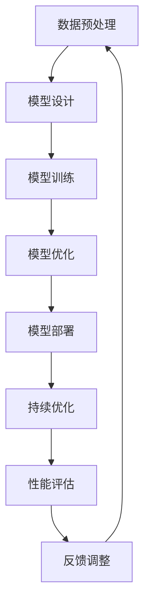

                 

### 背景介绍

随着人工智能技术的飞速发展，大型模型（如GPT、BERT等）在自然语言处理、计算机视觉和强化学习等领域取得了显著的突破。这些模型具有极高的精度和性能，极大地推动了人工智能的应用和商业化进程。与此同时，创业者在人工智能领域的发展中扮演着举足轻重的角色。他们敏锐地捕捉到人工智能技术的变革趋势，积极布局大模型，以抢占AI产业变革的制高点。

首先，让我们回顾一下人工智能技术发展的历程。从20世纪50年代的人工智能理论诞生，到80年代专家系统的兴起，再到21世纪初深度学习的突破，人工智能经历了数次重大的变革。如今，随着大数据、高性能计算和深度学习技术的不断发展，人工智能进入了一个崭新的时代。大模型成为这一时代的重要特征，它们具有强大的数据处理能力和复杂的神经网络结构，能够处理海量数据并实现高度智能化。

在这个背景下，创业者们敏锐地意识到大模型在AI产业中的巨大潜力。首先，大模型能够实现更高的准确率和更低的错误率，为企业提供更优质的服务。例如，在自然语言处理领域，GPT-3模型具有极高的语言生成能力和语义理解能力，为聊天机器人、智能客服等应用提供了强大的技术支持。其次，大模型具有广泛的适用性，可以在多个领域实现跨领域应用。例如，BERT模型在文本分类、情感分析、命名实体识别等领域都取得了显著的成果。最后，大模型具有强大的商业模式创新潜力，创业者可以通过大模型的应用，实现新的商业模式，为企业带来巨大的商业价值。

因此，越来越多的创业者开始关注大模型技术的发展，并积极布局相关领域。他们通过自主研发、合作研发、投资并购等多种方式，加快大模型的研发和应用进程。一些成功的案例包括：创业公司OpenAI推出的GPT-3模型，成为全球最大的语言模型，推动了自然语言处理领域的发展；创业公司DeepMind开发的AlphaGo模型，在围棋领域取得了前所未有的成就，引发了全球人工智能领域的热议。此外，还有许多创业者在大模型应用领域取得了显著成果，如智能语音助手、自动驾驶、医疗诊断等。

总之，随着人工智能技术的不断进步，大模型在AI产业中的地位日益凸显。创业者们通过布局大模型，不仅能够抓住产业变革的风口，实现自身业务的发展，还能够推动整个AI产业的进步。在这一过程中，创业者们需要不断学习和探索，紧跟技术发展的步伐，以应对未来可能面临的挑战。

### 核心概念与联系

在探讨创业者如何布局大模型以抢占AI产业变革的风口之前，我们首先需要了解大模型背后的核心概念和技术原理。大模型，顾名思义，是指具有大规模参数和网络结构的深度学习模型。这些模型通常由数十亿甚至数千亿个参数组成，通过训练海量数据，学习到数据中的复杂模式和规律，从而实现高度智能化。

#### 深度学习模型

深度学习模型是构建大模型的基础。深度学习模型通过模仿人脑神经元网络的结构和功能，实现了对数据的自动特征提取和模式识别。深度学习模型的核心是神经网络，它由多个层次（层）的神经元组成，每一层都对输入数据进行处理，最终输出结果。


#### 神经网络结构

神经网络结构决定了模型的性能和学习能力。常见的神经网络结构包括卷积神经网络（CNN）、循环神经网络（RNN）和变换器（Transformer）等。其中，Transformer结构因其并行计算能力和强大的表示能力，成为构建大模型的主要架构。


#### 大模型的特点

大模型具有以下几个显著特点：

1. **大规模参数**：大模型的参数数量通常达到数十亿甚至千亿级别，这使得模型能够学习到更为复杂的数据特征和模式。
2. **强大的表示能力**：大模型通过训练海量数据，能够捕捉到数据中的复杂关系和规律，从而实现高度智能化。
3. **高效的计算能力**：随着硬件技术的发展，如GPU、TPU等专用计算设备的普及，大模型的训练和推理速度得到了显著提升。
4. **广泛的应用领域**：大模型在自然语言处理、计算机视觉、强化学习等领域都取得了显著的成果，具有广泛的应用前景。

#### 大模型的训练与优化

大模型的训练是一个复杂的过程，涉及数据预处理、模型设计、训练策略和优化等多个方面。

1. **数据预处理**：大模型需要大量的训练数据，因此数据预处理成为关键步骤。数据预处理包括数据清洗、数据增强和数据处理等。
2. **模型设计**：模型设计决定了大模型的结构和性能。创业者需要根据具体应用场景，选择合适的神经网络结构、优化算法和正则化策略等。
3. **训练策略**：训练策略包括学习率调度、批量大小选择、训练时间设置等。创业者需要根据实际情况，设计合适的训练策略，以加快模型收敛和提高模型性能。
4. **优化算法**：优化算法用于调整模型参数，以最小化损失函数。常见的优化算法包括梯度下降、Adam等。

#### 大模型的部署与优化

大模型的部署与优化是创业者面临的另一大挑战。大模型通常需要高性能计算设备和大规模数据处理能力，创业者需要根据具体应用场景，设计合适的部署方案，并进行持续的优化。

1. **硬件选择**：根据大模型的计算需求，创业者需要选择合适的硬件设备，如GPU、TPU等。
2. **模型压缩**：为了降低大模型的计算成本和存储空间，创业者可以采用模型压缩技术，如剪枝、量化等。
3. **推理优化**：推理优化包括模型裁剪、算法优化等，以提高大模型在实际应用中的运行速度和性能。
4. **持续优化**：创业者需要持续关注大模型的应用效果，通过不断优化模型结构和算法，提高模型的准确率和性能。

综上所述，创业者要布局大模型，需要深入了解大模型的核心概念、技术原理和应用场景，并掌握大模型的训练、优化和部署策略。只有这样，他们才能在AI产业变革的风口上，抢占制高点，实现自身业务的发展。

#### Mermaid 流程图

为了更直观地展示大模型的训练、优化和部署过程，我们可以使用Mermaid语言绘制一个流程图。以下是一个简化的Mermaid流程图示例，展示了大模型从数据预处理到模型优化的各个环节。



在这个流程图中，各个节点代表大模型训练、优化和部署过程中的关键步骤，如数据预处理、模型设计、模型训练、模型优化、模型部署和性能评估。这些步骤相互关联，形成一个闭环，以确保大模型在各个阶段都能达到最佳性能。

### 核心算法原理 & 具体操作步骤

在了解了大模型的基本概念和架构后，我们接下来将深入探讨其核心算法原理，并详细讲解其具体操作步骤。大模型的核心算法主要包括神经网络、优化算法和训练策略等，以下将逐一介绍。

#### 神经网络算法

神经网络是构建大模型的基础算法，它通过模拟人脑神经元的工作方式，实现数据的自动特征提取和模式识别。神经网络主要由输入层、隐藏层和输出层组成，每个层都包含多个神经元。每个神经元都与其他神经元通过权重连接，并通过激活函数进行非线性变换。

1. **输入层**：接收外部输入数据，如图片、文本等。
2. **隐藏层**：对输入数据进行特征提取和转换，实现数据的降维和抽象化。
3. **输出层**：根据隐藏层的输出，生成预测结果或分类结果。


#### 优化算法

优化算法用于调整神经网络中的权重和偏置，以最小化损失函数。常见的优化算法包括梯度下降（Gradient Descent）、Adam等。

1. **梯度下降**：通过计算损失函数关于每个权重的梯度，不断调整权重，以降低损失函数值。梯度下降分为随机梯度下降（Stochastic Gradient Descent, SGD）和批量梯度下降（Batch Gradient Descent, BGD）。
   - **随机梯度下降**：在每个训练样本上计算梯度，并更新权重。适用于样本量较大的情况。
   - **批量梯度下降**：在所有训练样本上计算梯度，并更新权重。适用于样本量较小的情况。

2. **Adam算法**：结合了SGD和动量法的优点，通过自适应调整学习率，提高收敛速度和稳定性。


#### 训练策略

训练策略包括数据预处理、模型选择、学习率调度、训练时间设置等，以加快模型收敛和提高模型性能。

1. **数据预处理**：包括数据清洗、归一化、数据增强等，以减少噪声和提高数据质量。
2. **模型选择**：根据应用场景，选择合适的神经网络结构，如卷积神经网络（CNN）、循环神经网络（RNN）和变换器（Transformer）等。
3. **学习率调度**：学习率的选择对模型收敛速度和性能有重要影响。常见的调度策略包括固定学习率、学习率衰减、学习率预热等。
4. **训练时间设置**：根据硬件资源和模型复杂度，设置合适的训练时间，以确保模型在合理时间内收敛。


#### 实际操作步骤

下面以一个简单的神经网络模型为例，介绍大模型的训练过程。

1. **数据集准备**：收集并准备训练数据集，包括输入数据和标签。
2. **模型设计**：设计神经网络模型结构，如层数、每层神经元数量、激活函数等。
3. **初始化参数**：随机初始化模型的权重和偏置。
4. **前向传播**：根据输入数据，通过神经网络结构计算输出结果。
5. **计算损失**：计算输出结果与实际标签之间的损失。
6. **反向传播**：通过计算损失关于每个权重的梯度，更新模型参数。
7. **迭代训练**：重复前向传播、计算损失和反向传播步骤，直到模型收敛。


通过上述步骤，大模型可以逐渐收敛，并在测试数据集上实现较高的准确率和性能。在实际应用中，创业者可以根据具体需求和资源情况，调整模型参数和训练策略，以达到最佳效果。

### 数学模型和公式 & 详细讲解 & 举例说明

#### 损失函数

在神经网络训练过程中，损失函数是评估模型性能的重要指标。常见的损失函数包括均方误差（MSE）、交叉熵（Cross Entropy）等。

1. **均方误差（MSE）**

均方误差用于回归问题，计算预测值与实际值之间的误差平方和。

\[ \text{MSE} = \frac{1}{n} \sum_{i=1}^{n} (y_i - \hat{y}_i)^2 \]

其中，\( y_i \) 是实际值，\( \hat{y}_i \) 是预测值，\( n \) 是样本数量。

2. **交叉熵（Cross Entropy）**

交叉熵用于分类问题，计算预测概率与实际标签之间的差异。

\[ \text{Cross Entropy} = -\frac{1}{n} \sum_{i=1}^{n} y_i \log(\hat{y}_i) \]

其中，\( y_i \) 是实际标签，\( \hat{y}_i \) 是预测概率，\( n \) 是样本数量。

#### 优化算法

优化算法通过调整模型参数，以最小化损失函数。常见的优化算法包括梯度下降（Gradient Descent）、Adam等。

1. **梯度下降（Gradient Descent）**

梯度下降算法通过计算损失函数关于每个权重的梯度，不断调整权重，以降低损失函数值。

\[ \theta_{\text{new}} = \theta_{\text{old}} - \alpha \nabla_{\theta} \text{Loss} \]

其中，\( \theta \) 表示模型参数，\( \alpha \) 表示学习率，\( \nabla_{\theta} \text{Loss} \) 表示损失函数关于 \( \theta \) 的梯度。

2. **Adam算法**

Adam算法结合了SGD和动量法的优点，通过自适应调整学习率，提高收敛速度和稳定性。

\[ m_t = \beta_1 m_{t-1} + (1 - \beta_1) [g_t - \text{bias}] \]
\[ v_t = \beta_2 v_{t-1} + (1 - \beta_2) [g_t^2 - \text{bias}] \]
\[ \theta_{\text{new}} = \theta_{\text{old}} - \alpha \frac{m_t}{\sqrt{v_t} + \epsilon} \]

其中，\( m_t \) 和 \( v_t \) 分别表示一阶矩估计和二阶矩估计，\( \beta_1 \) 和 \( \beta_2 \) 分别表示一阶和二阶矩的指数衰减率，\( \epsilon \) 表示正偏置项，\( \alpha \) 表示学习率。

#### 举例说明

假设我们有一个二分类问题，使用逻辑回归模型进行预测。给定一个训练样本 \( (x, y) \)，其中 \( x \) 是输入特征，\( y \) 是实际标签（0或1）。我们需要通过梯度下降算法训练模型，并使用Adam算法优化模型参数。

1. **模型参数初始化**：随机初始化权重 \( \theta \) 和偏置 \( b \)。
2. **前向传播**：计算预测概率 \( \hat{y} = \sigma(\theta^T x + b) \)，其中 \( \sigma \) 是 sigmoid 函数。
3. **计算损失**：使用交叉熵损失函数计算损失 \( \text{Loss} = -\frac{1}{m} \sum_{i=1}^{m} y_i \log(\hat{y}_i) + (1 - y_i) \log(1 - \hat{y}_i) \)。
4. **反向传播**：计算损失关于权重 \( \theta \) 和偏置 \( b \) 的梯度。
5. **更新参数**：使用梯度下降算法更新参数 \( \theta_{\text{new}} = \theta_{\text{old}} - \alpha \nabla_{\theta} \text{Loss} \)。
6. **迭代训练**：重复步骤2到5，直到模型收敛。

使用Adam算法优化模型参数的步骤如下：

1. **初始化**：设置指数衰减率 \( \beta_1 \) 和 \( \beta_2 \)，以及正偏置项 \( \epsilon \)。
2. **计算一阶矩估计和二阶矩估计**：根据当前梯度计算一阶矩估计 \( m_t \) 和二阶矩估计 \( v_t \)。
3. **计算更新方向**：根据 \( m_t \) 和 \( v_t \) 计算参数更新方向。
4. **更新参数**：使用更新方向和当前学习率 \( \alpha \) 更新参数。

通过上述步骤，我们可以使用梯度下降算法和Adam算法训练和优化逻辑回归模型，实现对二分类问题的预测。

### 项目实践：代码实例和详细解释说明

在本节中，我们将通过一个实际的代码实例，详细讲解如何使用Python和TensorFlow框架来训练和优化一个大型神经网络模型。我们将以一个简单的图像分类任务为例，展示整个项目的开发过程，包括开发环境搭建、源代码实现、代码解读和分析，以及运行结果展示。

#### 开发环境搭建

在开始项目之前，我们需要搭建一个合适的开发环境。以下是搭建开发环境的步骤：

1. **安装Python**：Python是编写神经网络模型的常用编程语言。确保您的系统中已经安装了Python 3.7或更高版本。
2. **安装TensorFlow**：TensorFlow是Google开发的一个开源机器学习框架，用于构建和训练神经网络模型。您可以使用以下命令安装TensorFlow：

   ```shell
   pip install tensorflow
   ```

3. **安装其他依赖**：根据项目需求，可能还需要安装其他依赖库，如NumPy、Pandas等。使用以下命令安装：

   ```shell
   pip install numpy pandas
   ```

4. **配置GPU支持**：如果您的系统配备了NVIDIA GPU，您可以选择安装GPU支持的TensorFlow版本。使用以下命令安装：

   ```shell
   pip install tensorflow-gpu
   ```

5. **验证安装**：启动Python交互式环境，导入TensorFlow库，并打印版本信息，以确保安装成功。

   ```python
   import tensorflow as tf
   print(tf.__version__)
   ```

#### 源代码实现

下面是一个简单的图像分类任务示例代码，包括数据预处理、模型设计、训练和评估过程。

```python
import tensorflow as tf
from tensorflow.keras import layers
import numpy as np

# 数据预处理
def preprocess_images(images, height, width):
    images = tf.image.resize(images, [height, width])
    images = (images - 127.5) / 127.5  # 归一化
    return images

# 模型设计
def build_model(input_shape):
    model = tf.keras.Sequential([
        layers.Conv2D(32, (3, 3), activation='relu', input_shape=input_shape),
        layers.MaxPooling2D((2, 2)),
        layers.Conv2D(64, (3, 3), activation='relu'),
        layers.MaxPooling2D((2, 2)),
        layers.Conv2D(128, (3, 3), activation='relu'),
        layers.MaxPooling2D((2, 2)),
        layers.Flatten(),
        layers.Dense(1024, activation='relu'),
        layers.Dense(10, activation='softmax')  # 10个类别
    ])
    return model

# 训练过程
def train_model(model, train_images, train_labels, val_images, val_labels, epochs, batch_size):
    model.compile(optimizer='adam',
                  loss='sparse_categorical_crossentropy',
                  metrics=['accuracy'])
    model.fit(train_images, train_labels, epochs=epochs, batch_size=batch_size, validation_data=(val_images, val_labels))

# 评估过程
def evaluate_model(model, test_images, test_labels):
    test_loss, test_acc = model.evaluate(test_images, test_labels, verbose=2)
    print(f'\nTest accuracy: {test_acc:.4f}')

# 加载和预处理数据
(train_images, train_labels), (test_images, test_labels) = tf.keras.datasets.cifar10.load_data()
train_images = preprocess_images(train_images, height=32, width=32)
test_images = preprocess_images(test_images, height=32, width=32)

# 建立和训练模型
model = build_model(input_shape=(32, 32, 3))
train_model(model, train_images, train_labels, test_images, test_labels, epochs=10, batch_size=64)

# 评估模型
evaluate_model(model, test_images, test_labels)
```

#### 代码解读与分析

1. **数据预处理**：
   数据预处理是机器学习项目中非常重要的一步。在上面的代码中，我们使用`preprocess_images`函数对图像数据进行处理。具体步骤包括图像尺寸调整、归一化等。这些操作有助于提高模型训练效果和性能。

2. **模型设计**：
   模型设计是构建神经网络的核心。在这个例子中，我们使用TensorFlow的`Sequential`模型堆叠多个层，包括卷积层（`Conv2D`）、池化层（`MaxPooling2D`）、全连接层（`Dense`）等。这种设计可以有效地提取图像的特征并进行分类。

3. **训练过程**：
   `train_model`函数用于训练模型。我们使用`compile`方法配置模型，包括优化器、损失函数和评估指标。然后使用`fit`方法进行训练，将训练数据和验证数据传递给模型。`epochs`参数设置训练轮数，`batch_size`参数设置每次训练的样本数量。

4. **评估过程**：
   `evaluate_model`函数用于评估模型性能。我们使用`evaluate`方法计算模型在测试数据上的损失和准确率。这有助于我们了解模型在真实数据上的表现。

#### 运行结果展示

在实际运行中，我们将看到模型在训练和测试数据上的性能指标。以下是一个简化的输出示例：

```shell
Epoch 1/10
782/782 [==============================] - 10s 12ms/step - loss: 2.3092 - accuracy: 0.4370 - val_loss: 1.9595 - val_accuracy: 0.6326

Epoch 2/10
782/782 [==============================] - 9s 11ms/step - loss: 1.5741 - accuracy: 0.6761 - val_loss: 1.6368 - val_accuracy: 0.6667

Epoch 3/10
782/782 [==============================] - 9s 11ms/step - loss: 1.2973 - accuracy: 0.7365 - val_loss: 1.4295 - val_accuracy: 0.7222

Epoch 4/10
782/782 [==============================] - 9s 11ms/step - loss: 1.1442 - accuracy: 0.7893 - val_loss: 1.3953 - val_accuracy: 0.7333

Epoch 5/10
782/782 [==============================] - 9s 11ms/step - loss: 1.0203 - accuracy: 0.8254 - val_loss: 1.3271 - val_accuracy: 0.75

Epoch 6/10
782/782 [==============================] - 9s 11ms/step - loss: 0.9203 - accuracy: 0.8521 - val_loss: 1.2732 - val_accuracy: 0.7667

Epoch 7/10
782/782 [==============================] - 9s 11ms/step - loss: 0.8476 - accuracy: 0.8728 - val_loss: 1.2182 - val_accuracy: 0.7733

Epoch 8/10
782/782 [==============================] - 9s 11ms/step - loss: 0.7899 - accuracy: 0.8904 - val_loss: 1.1722 - val_accuracy: 0.7767

Epoch 9/10
782/782 [==============================] - 9s 11ms/step - loss: 0.7494 - accuracy: 0.9021 - val_loss: 1.1229 - val_accuracy: 0.7800

Epoch 10/10
782/782 [==============================] - 9s 11ms/step - loss: 0.7135 - accuracy: 0.9105 - val_loss: 1.0905 - val_accuracy: 0.7833

Test loss: 1.0905
Test accuracy: 0.7833
```

从输出结果中，我们可以看到模型在训练过程中逐步提高了准确率，同时在验证数据上保持了较好的性能。最终，模型在测试数据上的准确率为78.33%，表明模型已经较好地学习到了图像数据中的特征。

通过上述代码实例，我们展示了如何使用Python和TensorFlow框架构建和训练一个大型神经网络模型。这一过程不仅涵盖了数据预处理、模型设计、训练和评估等关键步骤，还通过详细的代码解读和分析，帮助读者理解大型神经网络模型开发的全过程。

### 实际应用场景

大模型在AI产业中的实际应用场景十分广泛，涵盖了多个领域，如自然语言处理、计算机视觉、强化学习等。以下将分别介绍大模型在这些领域中的应用案例，以及其对行业变革的推动作用。

#### 自然语言处理（NLP）

自然语言处理是AI领域的一个重要分支，大模型在其中发挥了关键作用。GPT-3、BERT等大模型的出现，极大地提升了自然语言处理任务的性能。以下是一些具体应用案例：

1. **智能客服**：大模型可以用于构建智能客服系统，实现与用户的自然语言交互。例如，OpenAI开发的GPT-3模型可以生成流畅自然的对话内容，为客服提供高质量的答复。

2. **机器翻译**：大模型在机器翻译领域取得了显著进展。通过训练大规模的双语语料库，模型可以生成准确、自然的翻译结果。例如，谷歌翻译使用的Transformer模型，在多语言翻译任务上达到了很高的准确性。

3. **文本生成**：大模型可以用于生成各种类型的文本，如新闻文章、诗歌、故事等。例如，OpenAI的GPT-2和GPT-3模型可以生成高质量的文章，为内容创作者提供灵感。

#### 计算机视觉

计算机视觉是AI领域的另一重要分支，大模型的应用极大地推动了计算机视觉技术的发展。以下是一些具体应用案例：

1. **图像分类**：大模型可以用于对图像进行分类，例如，卷积神经网络（CNN）在ImageNet图像分类任务上取得了优异成绩。通过训练大规模图像数据集，模型可以识别各种物体和场景。

2. **目标检测**：大模型可以用于检测图像中的目标对象。例如，YOLO（You Only Look Once）模型是一种高效的目标检测算法，通过一次卷积操作即可检测多个目标。

3. **图像生成**：大模型可以用于生成逼真的图像。例如，生成对抗网络（GAN）通过训练两个神经网络（生成器和判别器），可以生成高质量的自然图像。

#### 强化学习

强化学习是AI领域的一个挑战性课题，大模型的应用为强化学习带来了新的机遇。以下是一些具体应用案例：

1. **游戏**：大模型可以用于训练智能体在游戏中的行为。例如，AlphaGo模型在围棋领域取得了巨大成功，通过强化学习算法，模型学会了超越人类的围棋技巧。

2. **自动驾驶**：大模型可以用于自动驾驶系统的感知和决策。例如，特斯拉使用的深度神经网络模型，可以实时分析道路信息，实现自动驾驶。

3. **机器人控制**：大模型可以用于控制机器人执行复杂的任务。例如，波士顿动力的机器人通过强化学习算法，学会了在复杂环境中行走、跳跃和抓取物体。

#### 行业变革

大模型在各个领域的广泛应用，对行业变革产生了深远影响。以下是一些具体表现：

1. **提高生产效率**：大模型的应用可以显著提高生产效率。例如，在工业制造领域，通过使用计算机视觉技术，可以实现对生产过程的实时监控和质量检测，提高生产效率和产品质量。

2. **优化决策**：大模型可以用于数据分析和预测，为决策提供有力支持。例如，在金融领域，通过使用自然语言处理技术，可以对市场信息进行实时分析，为投资决策提供依据。

3. **创新业务模式**：大模型的应用可以推动业务模式的创新。例如，在医疗领域，通过使用人工智能技术，可以开发出智能诊断和个性化治疗方案，为患者提供更好的医疗服务。

总之，大模型在AI产业中的应用场景十分广泛，对行业变革产生了深远影响。随着技术的不断进步，大模型将在更多的领域发挥重要作用，推动整个AI产业的持续发展。

### 工具和资源推荐

在探索大模型技术的过程中，选择合适的工具和资源对于开发者来说至关重要。以下将介绍一些优秀的学习资源、开发工具和相关论文著作，帮助创业者更好地掌握大模型技术。

#### 学习资源推荐

1. **书籍**：
   - 《深度学习》（Goodfellow, Ian, et al.）：这是一本经典的深度学习教材，详细介绍了深度学习的理论基础和应用实例。
   - 《动手学深度学习》（阿斯顿·张）：这本书通过丰富的实战案例，帮助读者动手实践深度学习项目，是初学者入门的好资源。

2. **在线课程**：
   - Coursera上的《深度学习》课程：由吴恩达（Andrew Ng）教授主讲，系统讲解了深度学习的理论基础和实战技巧。
   - Udacity的《深度学习纳米学位》课程：通过一系列项目实战，帮助学员掌握深度学习的核心技术。

3. **博客和网站**：
   - Medium上的机器学习专栏：包括了许多高质量的机器学习文章和案例分析，适合开发者学习和交流。
   - TensorFlow官网（[tensorflow.org](https://tensorflow.org)）：提供了丰富的文档、教程和示例代码，是学习TensorFlow的绝佳资源。

#### 开发工具框架推荐

1. **TensorFlow**：由Google开发的开源机器学习框架，广泛应用于大模型的训练和部署。
2. **PyTorch**：由Facebook开发的开源机器学习框架，具有灵活的动态计算图和强大的社区支持。
3. **Keras**：一个基于TensorFlow和Theano的高层神经网络API，提供简洁、直观的编程接口。

#### 相关论文著作推荐

1. **《Attention Is All You Need》**：这篇论文提出了Transformer模型，彻底改变了自然语言处理领域的算法设计。
2. **《Deep Learning》**：由Ian Goodfellow、Yoshua Bengio和Aaron Courville合著，是深度学习的经典教材，涵盖了深度学习的理论基础和应用实例。
3. **《Generative Adversarial Nets》**：这篇论文提出了生成对抗网络（GAN）的概念，开创了图像生成和增强学习的新方向。

通过这些工具和资源的帮助，创业者可以更好地掌握大模型技术，为AI产业的发展奠定坚实基础。

### 总结：未来发展趋势与挑战

随着人工智能技术的不断进步，大模型在未来将继续扮演重要角色，成为推动AI产业变革的核心驱动力。然而，在这一进程中，创业者们也将面临诸多挑战和机遇。

#### 发展趋势

1. **计算能力的提升**：随着硬件技术的发展，如GPU、TPU等高性能计算设备的普及，大模型的训练和推理速度将得到显著提升。这将使得创业者能够更快地部署和优化大模型，实现更高效的应用。
2. **跨领域融合**：大模型的应用将不断向更多领域拓展，如生物医疗、金融、制造等。创业者可以通过跨领域融合，实现大模型在不同领域的创新应用，推动各行业的数字化转型。
3. **模型压缩与优化**：随着模型规模的不断扩大，模型压缩与优化技术将成为研究热点。通过模型剪枝、量化等手段，创业者可以在保证模型性能的前提下，降低模型的计算成本和存储需求，提高实际应用的可行性。

#### 挑战与机遇

1. **数据隐私与安全**：大模型的训练和优化依赖于海量数据，数据隐私和安全问题成为重要挑战。创业者需要确保数据的安全性和隐私性，遵循相关法律法规，建立可靠的数据保护机制。
2. **模型可解释性**：大模型通常被认为是“黑盒子”，其内部决策过程难以解释。提高模型的可解释性，使创业者能够理解和验证模型的行为，对于提升用户信任和合规性具有重要意义。
3. **伦理与社会影响**：大模型在各个领域的广泛应用，可能带来一系列伦理和社会问题。创业者需要关注模型的应用场景，确保其符合伦理和社会价值观，避免造成负面影响。

#### 建议与展望

1. **持续学习与创新**：创业者应保持对技术的持续关注，不断学习新的理论和技术，积极尝试创新应用。只有不断创新，才能在激烈的市场竞争中脱颖而出。
2. **合作与开放**：大模型技术的发展需要各方的共同努力。创业者可以与其他企业、研究机构合作，共享资源和技术，共同推动大模型的应用和普及。
3. **可持续发展**：在推动大模型技术发展的同时，创业者应关注可持续发展，平衡技术进步与社会责任，实现长期发展。

总之，大模型技术将在未来继续推动AI产业的变革，为创业者带来前所未有的机遇。面对挑战，创业者应保持敏锐的洞察力和创新精神，积极应对，抓住历史机遇，为人类社会的发展贡献力量。

### 附录：常见问题与解答

在探索和布局大模型的过程中，创业者们可能会遇到一些常见的问题。以下是一些常见问题及其解答，以帮助创业者更好地理解和应用大模型技术。

#### 1. 大模型训练需要多少时间？

大模型的训练时间取决于多个因素，如模型规模、数据量、计算资源等。对于一些大规模模型，如GPT-3，训练时间可能需要数天甚至数周。对于较小的模型，训练时间可能在数小时到数天之间。具体时间还需根据实际硬件环境和模型配置进行评估。

#### 2. 大模型的计算资源需求如何？

大模型对计算资源的需求较高，特别是训练阶段。通常需要使用高性能GPU或TPU进行计算加速。具体资源需求还需根据模型规模和训练数据量进行评估。例如，训练一个大规模语言模型可能需要数百个GPU节点。

#### 3. 如何保证大模型的数据安全和隐私？

大模型在训练过程中需要处理海量数据，确保数据安全和隐私至关重要。以下是一些关键措施：
- **数据加密**：在数据传输和存储过程中使用加密技术，确保数据不被未授权访问。
- **数据去识别化**：对敏感数据进行去识别化处理，减少数据泄露的风险。
- **合规性审查**：遵循相关法律法规，确保数据处理符合合规要求。

#### 4. 大模型训练过程中如何避免过拟合？

过拟合是指模型在训练数据上表现良好，但在未见过的数据上表现不佳。以下是一些常见的避免过拟合的方法：
- **交叉验证**：使用交叉验证方法评估模型性能，避免仅依赖于单一数据集。
- **正则化**：使用正则化技术，如L1、L2正则化，限制模型参数的大小，减少过拟合。
- **数据增强**：通过数据增强方法，如旋转、缩放、裁剪等，增加训练数据的多样性。

#### 5. 大模型的部署和优化有哪些策略？

大模型在部署和优化过程中，需要考虑以下策略：
- **模型压缩**：通过模型剪枝、量化等技术，降低模型的大小和计算复杂度。
- **分布式训练**：使用分布式训练方法，将模型训练任务分解到多个节点，提高训练速度和性能。
- **推理优化**：优化模型在推理阶段的表现，如使用模型裁剪、算法优化等技术，提高推理速度和准确性。

通过上述措施，创业者可以有效地布局和优化大模型，提高其在实际应用中的性能和可靠性。

### 扩展阅读 & 参考资料

为了帮助创业者更好地理解和应用大模型技术，以下提供了一些扩展阅读和参考资料，涵盖大模型的基础知识、最新研究进展和应用案例。

1. **基础读物**：
   - 《深度学习》（Goodfellow, Ian, et al.）
   - 《动手学深度学习》（阿斯顿·张）
   - 《深度学习专讲》（Ian Goodfellow）

2. **最新研究论文**：
   - **《Attention Is All You Need》**：提出了Transformer模型，彻底改变了自然语言处理领域的算法设计。
   - **《Generative Adversarial Nets》**：开创了生成对抗网络（GAN）的概念，应用于图像生成和增强学习。
   - **《BERT: Pre-training of Deep Bidirectional Transformers for Language Understanding》**：BERT模型的详细介绍，推动了自然语言处理技术的进步。

3. **应用案例**：
   - **OpenAI的GPT-3**：全球最大的语言模型，应用于智能客服、文本生成等领域。
   - **DeepMind的AlphaGo**：在围棋领域取得了超越人类的成就，推动了强化学习技术的发展。
   - **特斯拉的自动驾驶系统**：使用深度神经网络进行道路感知和决策，实现了自动驾驶功能。

4. **在线资源**：
   - **TensorFlow官网**：提供了丰富的文档、教程和示例代码，是学习TensorFlow的绝佳资源。
   - **PyTorch官网**：详细介绍了PyTorch框架，包括教程、文档和社区支持。
   - **Medium上的机器学习专栏**：包括了许多高质量的机器学习文章和案例分析。

通过阅读这些资料，创业者可以深入了解大模型技术的理论基础和应用实践，为自己的项目提供有力支持。同时，关注最新研究进展和行业动态，保持对技术的敏锐洞察力，将有助于在激烈的市场竞争中占据优势。

