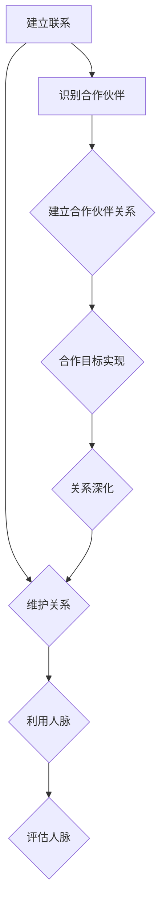

                 

### 1. 背景介绍

在当今商业环境中，人脉管理与战略合作伙伴关系的建立对于企业的成功至关重要。无论是在初创公司还是成熟企业，企业家们都需要通过有效的人脉管理来建立广泛的联系网络，以及寻找并建立与关键合作伙伴的关系。

人脉管理，简单来说，就是维护和利用个人或组织之间的社交关系。这些关系可以是职业上的、学术上的、商业上的或者是私人关系。人脉管理涉及到多种技巧，包括如何建立联系、维护关系以及如何有效地利用这些关系来实现个人或组织的利益。

战略合作伙伴关系则是指两个或多个组织之间为了共同的目标而建立的长期合作关系。这种关系通常是基于共同的价值观、互补的资源和能力，以及共享的利益。战略合作伙伴关系的目标是通过合作来增强各方的竞争力，实现资源共享和风险共担，从而实现共同成长。

为什么这两者对于企业至关重要呢？首先，良好的企业人脉可以帮助企业获取最新的市场信息、技术动态和商业机会。这些信息对于企业制定战略决策、调整发展方向至关重要。其次，战略合作伙伴关系可以帮助企业实现规模经济、降低成本，并通过合作开发新产品或服务来扩大市场份额。此外，良好的人脉和合作伙伴关系还能增强企业的信誉和品牌价值，提高其在行业中的地位。

本文将深入探讨创业者如何进行人脉管理，以及如何建立和维护战略合作伙伴关系。我们将从以下几个关键部分展开讨论：

1. **人脉管理的核心概念与架构**：介绍人脉管理的基本原理和关键流程，包括如何建立联系、维护关系和利用人脉。

2. **战略合作伙伴关系的建立与维护**：探讨如何识别潜在的合作伙伴、建立信任和合作关系，以及如何通过合作实现共同目标。

3. **案例分析**：通过实际案例展示成功的人脉管理和战略合作伙伴关系的实践。

4. **人脉管理与战略合作伙伴关系的工具和资源推荐**：介绍一些有用的工具和资源，帮助创业者更好地进行人脉管理和建立合作伙伴关系。

5. **未来发展趋势与挑战**：讨论人脉管理和战略合作伙伴关系在未来可能面临的挑战和机遇。

通过本文的探讨，我们希望能够帮助创业者更好地理解和应用人脉管理和战略合作伙伴关系的理念，从而在竞争激烈的商业环境中脱颖而出。

### 1.1 人脉管理的重要性

人脉管理在当今商业环境中扮演着至关重要的角色。它不仅是企业家个人成功的关键因素，也是企业持续发展的关键要素。以下是人脉管理的重要性的详细分析：

**信息获取**：一个广泛且高效的人脉网络可以为企业提供丰富的信息资源。通过与其他人建立联系，企业家可以获得市场趋势、行业动态、技术更新等关键信息。这些信息可以帮助企业及时调整战略，抓住市场机会，避免潜在的风险。

**资源整合**：通过人脉，企业可以更容易地获取各种资源，包括资金、技术、人才和渠道。这些资源可以为企业提供强大的支持，帮助企业快速发展。

**商业合作**：良好的人脉关系有助于企业建立战略合作伙伴关系。这些合作关系可以为企业带来更多的商业机会，通过资源共享、合作研发和市场拓展等方式，实现互利共赢。

**品牌影响力**：一个强大的人脉网络可以提升企业的社会形象和品牌影响力。当企业能够与行业内的知名人士、专家和领导者建立联系时，其品牌价值也会随之提升。

**危机应对**：在面临危机时，广泛的人脉关系可以帮助企业迅速找到解决方案。通过调动人脉资源，企业可以寻求法律咨询、公关支持或其他形式的外部援助，有效地应对各种挑战。

**人才招聘**：人脉网络是企业招聘高素质人才的重要途径。通过人脉，企业家可以更快速、更准确地找到符合企业需求的顶尖人才，为企业的长远发展提供人力保障。

**社会资源**：人脉管理还可以帮助企业获得各种社会资源，如政府支持、行业协会资源等。这些资源可以帮助企业更好地融入社会，提升企业竞争力。

**知识共享**：通过人脉网络，企业家可以与其他行业人士分享知识和经验，互相学习、借鉴，不断提升个人和企业的能力。

**决策支持**：广泛的人脉网络可以为企业提供多样化的意见和建议，帮助企业家做出更加明智的决策。

综上所述，人脉管理不仅对于企业家个人的职业发展至关重要，也对企业的整体战略布局和长期发展具有深远影响。因此，企业家们应当高度重视人脉管理，积极建立和维护良好的人脉关系。

### 1.2 战略合作伙伴关系的重要性

战略合作伙伴关系在商业环境中扮演着至关重要的角色，它不仅能够为企业带来短期的商业利益，更能为企业的长期发展奠定坚实的基础。以下是从多个维度详细阐述战略合作伙伴关系的重要性的内容：

**共同目标与资源整合**：战略合作伙伴关系通常建立在共同目标和共享利益的基础上。通过合作，企业能够整合各自的资源、能力和优势，共同开发新产品或服务，开拓新市场，从而实现规模效应和资源的最优配置。

**降低运营成本**：合作可以帮助企业共享资源，如生产线、研发设备、人力资源等，从而减少重复投资和运营成本。例如，一家制造商可以与供应商合作，实现供应链的优化，降低原材料采购和库存成本。

**风险分担**：战略合作伙伴关系能够有效分担市场风险和运营风险。在合作框架下，合作伙伴可以共同承担市场变化带来的不确定性，如技术革新、市场需求波动等，从而降低单一企业面临的经营风险。

**技术创新**：通过合作，企业可以借助合作伙伴的技术和创新能力，快速引入新技术、新产品或新服务。这种合作往往能够加速创新过程，提升企业的市场竞争力。

**市场拓展**：战略合作伙伴关系能够帮助企业进入新的市场，扩大市场份额。通过合作伙伴的渠道和客户资源，企业可以更快地了解和适应新市场的需求，提高市场渗透率。

**品牌提升**：与知名企业建立战略合作伙伴关系，可以提升自身品牌的知名度和信誉。这种合作往往能够带来品牌溢价，增强消费者对产品的信任和认可。

**知识共享**：合作伙伴之间可以互相学习、交流经验，促进知识的共享和扩散。这种知识共享不仅能够提升合作伙伴的个人能力，也能推动企业的整体发展。

**危机应对**：在面临市场危机或运营问题时，战略合作伙伴关系可以为企业提供紧急支持和解决方案。通过合作，企业可以迅速调动各方资源和能力，共同应对挑战，减少损失。

**业务连续性**：战略合作伙伴关系可以增强企业的业务连续性。例如，在自然灾害或突发事件发生时，合作伙伴可以互相提供支持，确保业务的正常运行。

**长期发展**：战略合作伙伴关系通常是长期的、稳定的，能够为企业的长期发展提供持续的支持。通过持续的合作和信任积累，企业可以逐步实现战略目标，推动企业不断成长。

总之，战略合作伙伴关系不仅能够为企业带来直接的商业利益，还能在多个方面提升企业的竞争力，促进企业的长远发展。因此，企业家们应当重视战略合作伙伴关系的建立和维护，积极寻找和培养合适的合作伙伴。

### 1.3 人脉管理与战略合作伙伴关系的联系

人脉管理与战略合作伙伴关系之间存在密切的联系，两者相辅相成，共同构成了企业成功的重要因素。从本质上来说，人脉管理是战略合作伙伴关系的基础，而战略合作伙伴关系则是人脉管理的高级形态。

首先，人脉管理为战略合作伙伴关系的建立提供了资源和信息。一个广泛的人脉网络可以为企业提供潜在的合作机会，通过这些联系，企业可以更容易地识别出潜在的合作伙伴。这些合作伙伴可能具备企业所需的技术、资源或市场渠道，能够为企业的战略发展提供支持。

其次，战略合作伙伴关系的建立和维护需要基于良好的人脉管理。通过与行业内的关键人士建立联系，企业家可以更好地了解合作伙伴的需求、能力和目标，从而更有效地进行合作谈判和资源整合。此外，良好的人脉关系还能在合作过程中提供支持，解决合作过程中可能出现的问题和冲突。

从功能上看，人脉管理侧重于建立和维护个人或组织之间的社交关系，而战略合作伙伴关系则更强调合作的具体目标和成果。人脉管理通过建立广泛的关系网，为企业提供了多样化的选择和机会，而战略合作伙伴关系则通过具体的合作计划和实施，为企业带来了实际的商业价值。

在实际应用中，人脉管理和战略合作伙伴关系往往是同时进行和相互交织的。例如，企业家可以通过参加行业会议、社交活动等方式，建立和维护人脉关系。这些关系的积累和拓展，最终可能转化为战略合作伙伴关系。同样，在建立战略合作伙伴关系的过程中，企业家需要充分利用之前建立的人脉资源，通过人脉关系进行合作谈判和资源匹配，确保合作的顺利进行。

总之，人脉管理和战略合作伙伴关系是企业成功的关键要素。通过有效的人脉管理，企业可以建立广泛的联系网络，识别和吸引潜在的合作伙伴。而通过建立和维护战略合作伙伴关系，企业可以更好地实现资源共享、风险共担和共同发展。两者之间的紧密联系，使得企业能够在复杂多变的商业环境中保持竞争优势，实现长期可持续发展。

### 1.4 本文结构概述

本文将系统地探讨创业者如何进行人脉管理和建立战略合作伙伴关系，旨在为企业家们提供实用的指导和方法。文章结构如下：

**第1章 背景介绍**  
首先，我们介绍了人脉管理和战略合作伙伴关系的定义和重要性，为后续内容奠定了基础。

**第2章 核心概念与联系**  
在本章中，我们将详细阐述人脉管理的核心概念和流程，并使用Mermaid流程图展示其架构。接着，我们将讨论战略合作伙伴关系的建立和维护策略。

**第3章 核心算法原理 & 具体操作步骤**  
我们将介绍人脉管理和战略合作伙伴关系的核心算法原理，并提供具体的操作步骤，帮助读者理解和应用这些策略。

**第4章 数学模型和公式 & 详细讲解 & 举例说明**  
本章将使用数学模型和公式详细解释人脉管理和战略合作伙伴关系的关键概念，并通过实际案例进行说明。

**第5章 项目实践：代码实例和详细解释说明**  
通过具体的代码实例，我们将展示如何在实际项目中应用人脉管理和战略合作伙伴关系的策略，并提供详细的解释和分析。

**第6章 实际应用场景**  
本章将讨论人脉管理和战略合作伙伴关系在不同行业和场景中的应用，帮助读者了解这些策略的多样性和灵活性。

**第7章 工具和资源推荐**  
我们将推荐一些有用的工具和资源，包括学习资源、开发工具和框架，帮助读者更好地进行人脉管理和建立合作伙伴关系。

**第8章 总结：未来发展趋势与挑战**  
最后，我们将总结人脉管理和战略合作伙伴关系的重要性，并讨论未来的发展趋势和可能面临的挑战。

**第9章 附录：常见问题与解答**  
在本附录中，我们将回答读者可能遇到的一些常见问题，提供额外的指导和建议。

**第10章 扩展阅读 & 参考资料**  
为了方便读者进一步学习，我们将提供扩展阅读和参考资料，涵盖相关书籍、论文和网站等。

通过本文的详细探讨，我们希望能够帮助创业者更好地理解和应用人脉管理和战略合作伙伴关系的理念，从而在竞争激烈的商业环境中取得成功。

### 2. 核心概念与联系

在深入探讨人脉管理和战略合作伙伴关系之前，我们需要明确一些核心概念，并理解它们之间的联系。以下是这些核心概念的详细解释和流程图展示。

#### 2.1 人脉管理核心概念

**1. 人脉**  
人脉指的是个人或组织之间建立的联系和关系。这些人脉可以是职业上的，如同事、客户、供应商；也可以是私人关系，如朋友、同学、亲戚。一个强大的人脉网络通常包括不同领域、不同职位、不同背景的人。

**2. 人脉管理**  
人脉管理是指通过有意识地建立、维护和利用个人或组织之间的社交关系，以达到个人或组织目标的一系列行为和策略。

**3. 人脉网络**  
人脉网络是指由多个独立的个体或组织通过相互联系而形成的一个复杂的社交网络。这个网络中的节点代表个体或组织，边代表它们之间的联系。

**4. 人脉密度**  
人脉密度是指人脉网络中节点之间的联系紧密程度。一个高密度的人脉网络通常意味着节点之间的联系更多、更紧密，能够提供更多的信息资源和合作机会。

**5. 人脉质量**  
人脉质量是指人脉的可靠性和价值。高质量的人脉通常来自于行业专家、行业领袖或拥有重要资源的人，能够提供有价值的建议和资源。

#### 2.2 人脉管理流程

**1. 建立联系**  
建立联系是人脉管理的第一步。这包括主动接触潜在的联系对象，通过社交媒体、行业会议、社交活动等方式进行初步接触。

**2. 维护关系**  
建立联系后，需要定期维护和更新关系。这包括保持沟通、分享有价值的信息、提供帮助等。有效的维护可以提高人脉的粘性和质量。

**3. 利用人脉**  
利用人脉是指在需要时，利用人脉资源来获取信息、资源或支持。这可以通过直接联系、介绍、推荐等方式实现。

**4. 评估人脉**  
定期评估人脉的质量和价值，判断哪些人脉对当前和未来的目标最有帮助。根据评估结果，优化和维护人脉网络。

#### 2.3 战略合作伙伴关系核心概念

**1. 战略合作伙伴**  
战略合作伙伴是指两个或多个组织之间为了实现共同目标而建立的长期合作关系。这种合作通常基于互信、互补和共享利益。

**2. 战略合作伙伴关系**  
战略合作伙伴关系是指合作双方通过共享资源、知识和能力，共同开发市场、产品或服务，实现共同发展的关系。

**3. 合作目标**  
合作目标是指战略合作伙伴之间共同追求的长期目标，如市场扩展、技术创新、成本降低等。

**4. 合作策略**  
合作策略是指为了实现合作目标而制定的行动计划和具体措施，如资源共享、市场拓展、联合研发等。

**5. 合作关系管理**  
合作关系管理是指通过沟通、协调、监督和评估等手段，确保合作顺利进行并实现预期目标的一系列行为和策略。

#### 2.4 人脉管理与战略合作伙伴关系的联系

人脉管理和战略合作伙伴关系之间存在紧密的联系。人脉管理为战略合作伙伴关系的建立提供了资源和信息，而战略合作伙伴关系则是人脉管理的高级形态。

**1. 人脉管理为战略合作伙伴关系提供基础**  
通过人脉管理，企业家可以建立广泛且高效的关系网络，识别和吸引潜在的合作伙伴。这些关系为后续的战略合作提供了基础和资源。

**2. 战略合作伙伴关系深化人脉管理**  
通过建立战略合作伙伴关系，企业家可以进一步深化和优化人脉网络。合作过程中，双方可以共享资源、知识和能力，从而提升整体人脉网络的效力和价值。

**3. 人脉管理和战略合作伙伴关系的互动**  
人脉管理和战略合作伙伴关系是相互促进的。通过有效的人脉管理，企业家可以更好地识别和利用战略合作伙伴关系的机会；而成功的战略合作伙伴关系则能够进一步巩固和扩展人脉网络。

#### 2.5 Mermaid流程图

为了更直观地展示人脉管理和战略合作伙伴关系的核心概念和流程，我们使用Mermaid语言绘制了以下流程图：



在这个流程图中，A到D表示人脉管理的过程，而E到H则表示战略合作伙伴关系的建立和维护过程。通过这个流程图，我们可以清晰地看到人脉管理和战略合作伙伴关系之间的相互作用和相互促进。

### 3. 核心算法原理 & 具体操作步骤

在人脉管理和战略合作伙伴关系中，核心算法原理和具体操作步骤是确保成功的关键。以下是这些算法原理和操作步骤的详细说明。

#### 3.1 人脉管理核心算法原理

**1. 关联分析算法**  
关联分析算法是人脉管理中常用的算法之一，它用于识别人脉网络中的关联关系。通过分析个体之间的直接和间接联系，可以找到潜在的合作机会或重要的关系节点。

**2. 社交网络分析算法**  
社交网络分析算法用于分析人脉网络的拓扑结构、节点重要性和路径长度。这些算法可以帮助企业家识别关键人物、评估人脉质量，并制定有效的维护策略。

**3. 数据挖掘算法**  
数据挖掘算法用于从大量的人脉数据中提取有价值的信息和模式。通过分析这些数据，企业家可以识别趋势、预测行为，并优化人脉管理策略。

#### 3.2 战略合作伙伴关系核心算法原理

**1. 合作机会识别算法**  
合作机会识别算法用于从大量的人脉数据中识别潜在的合作伙伴。这些算法可以通过分析个体的需求、资源和能力，找到具有互补性和共同目标的合作伙伴。

**2. 合作伙伴评价算法**  
合作伙伴评价算法用于评估潜在合作伙伴的可靠性和价值。这些算法可以通过分析合作伙伴的历史合作记录、声誉、资源贡献等指标，为企业家提供决策支持。

**3. 合作关系优化算法**  
合作关系优化算法用于优化合作过程中的资源配置、任务分配和风险控制。这些算法可以帮助企业家确保合作目标的实现，并最大化合作效果。

#### 3.3 人脉管理具体操作步骤

**1. 建立联系**  
建立联系是第一步，可以通过以下几种方式实现：
- 参加行业会议和社交活动：通过这些活动，可以结识行业内的专家和领导者，建立初步联系。
- 通过现有人脉推荐：利用已有的联系网络，请求推荐新的合作伙伴或潜在客户。
- 利用社交媒体：通过社交媒体平台，主动接触潜在的联系对象，进行互动和交流。

**2. 维护关系**  
建立联系后，需要定期维护关系，保持活跃的沟通。以下是一些维护关系的策略：
- 定期沟通：通过电话、邮件、社交媒体等方式，定期与联系对象保持联系。
- 分享有价值的信息：定期向联系对象分享行业动态、市场趋势、技术更新等有价值的信息。
- 提供帮助：在联系对象需要帮助时，主动提供支持和援助，建立信任和互惠关系。

**3. 利用人脉**  
在需要时，利用人脉资源来获取信息、资源或支持。以下是一些利用人脉的策略：
- 请求推荐：在寻找人才或合作伙伴时，向人脉中的关键人物请求推荐。
- 请求帮助：在面临困难或挑战时，向人脉中的关键人物寻求帮助和建议。
- 参与合作：与关键人物合作，共享资源、知识和能力，实现共同目标。

**4. 评估人脉**  
定期评估人脉的质量和价值，判断哪些人脉对当前和未来的目标最有帮助。以下是一些评估人脉的策略：
- 记录和整理：记录每次与人脉联系的情况，整理人脉档案。
- 评估价值：根据人脉提供的资源、信息和帮助的价值进行评估。
- 持续优化：根据评估结果，优化和维护人脉网络，剔除无效的联系，加强高质量的联系。

#### 3.4 战略合作伙伴关系具体操作步骤

**1. 识别合作伙伴**  
识别合作伙伴是建立战略合作伙伴关系的第一步。以下是一些识别合作伙伴的策略：
- 分析需求：明确企业当前和未来的需求，识别能够提供这些需求的合作伙伴。
- 数据分析：通过人脉数据和社交网络分析，识别潜在的合作伙伴。
- 行业调研：通过行业报告、市场研究等方式，了解行业内的合作伙伴情况。

**2. 建立合作伙伴关系**  
建立合作伙伴关系需要一系列的谈判和协商。以下是一些建立合作伙伴关系的策略：
- 初步接触：通过邮件、电话等方式，与潜在合作伙伴进行初步接触。
- 谈判和协商：在明确合作目标、利益分配、责任分工等方面进行谈判和协商。
- 签订合同：在达成共识后，签订正式的合作协议，明确双方的权利和义务。

**3. 维护合作伙伴关系**  
建立合作伙伴关系后，需要持续维护和加强合作关系。以下是一些维护合作伙伴关系的策略：
- 定期沟通：通过定期会议、电话、邮件等方式，与合作伙伴保持沟通和联系。
- 分享资源和信息：与合作伙伴共享资源和信息，建立互惠互利的合作关系。
- 解决问题：在合作过程中，及时解决出现的问题和挑战，确保合作顺利进行。

**4. 评估合作伙伴关系**  
定期评估合作伙伴关系的质量和效果，判断是否需要调整或终止合作。以下是一些评估合作伙伴关系的策略：
- 收集反馈：从合作伙伴那里收集反馈，了解合作过程中的问题和改进空间。
- 绩效评估：根据合作目标的实现情况，评估合作伙伴的绩效和贡献。
- 调整策略：根据评估结果，调整合作策略，优化合作伙伴关系。

通过上述核心算法原理和具体操作步骤，创业者可以更加系统地开展人脉管理和建立战略合作伙伴关系，从而在竞争激烈的商业环境中获得优势。

### 4. 数学模型和公式 & 详细讲解 & 举例说明

在人脉管理和战略合作伙伴关系中，数学模型和公式起着至关重要的作用，它们可以帮助我们更精确地分析和预测人脉网络的动态以及合作伙伴关系的稳定性。以下将详细讲解几个关键的数学模型和公式，并通过实际案例进行说明。

#### 4.1 优化人脉网络的数学模型

**1. 社交网络分析中的度中心性**

度中心性（Degree Centrality）是衡量个体在社交网络中的核心程度的重要指标。一个节点（个体）的度中心性由其连接的边的数量决定。

公式：
\[ C_d(v) = \frac{k_v}{N-1} \]
其中，\( C_d(v) \) 表示节点 \( v \) 的度中心性，\( k_v \) 表示节点 \( v \) 的连接边数，\( N \) 表示网络中的节点总数。

**案例说明**：
假设在一个社交网络中有10个节点，其中节点A连接了5个其他节点。则A的度中心性为：
\[ C_d(A) = \frac{5}{10-1} = \frac{5}{9} \approx 0.56 \]

这意味着节点A在社交网络中的核心程度较高，它能够影响到较多的其他节点，因此是一个重要的社交节点。

**2. 关联中心性**

关联中心性（Closeness Centrality）衡量的是个体在社交网络中与所有其他节点的接近程度。一个节点到其他所有节点的最短路径长度越短，其关联中心性就越高。

公式：
\[ C_c(v) = \frac{\sum_{i \neq v} \text{dist}(v, i)}{N-1} \]
其中，\( C_c(v) \) 表示节点 \( v \) 的关联中心性，\( \text{dist}(v, i) \) 表示从节点 \( v \) 到节点 \( i \) 的最短路径长度。

**案例说明**：
假设在一个社交网络中，节点A到其他所有节点的最短路径长度之和为20，总节点数为10。则A的关联中心性为：
\[ C_c(A) = \frac{20}{10-1} = \frac{20}{9} \approx 2.22 \]

这表明节点A在社交网络中的位置较为中心，与其他节点的连接较为紧密，是值得重点关注和利用的节点。

**3. 中介中心性**

中介中心性（Betweenness Centrality）衡量的是个体在社交网络中作为中间路径的数量。一个节点作为中间路径的数量越多，其中介中心性就越高。

公式：
\[ C_b(v) = \frac{\sum_{i \neq v, j \neq v} (\text{path}(i, j) \text{包含} v)}{N \times (N-2)} \]
其中，\( C_b(v) \) 表示节点 \( v \) 的中介中心性，\( \text{path}(i, j) \) 表示从节点 \( i \) 到节点 \( j \) 的所有路径。

**案例说明**：
假设在一个社交网络中，从节点A到节点B的所有路径中，有30%的路径包含节点C。则C的中介中心性为：
\[ C_b(C) = \frac{30\%}{100\%} = 0.3 \]

这表明节点C在A和B之间起到了重要的桥梁作用，是连接这两个重要节点的关键节点。

#### 4.2 评估合作伙伴关系的数学模型

**1. 合作伙伴综合评分模型**

合作伙伴综合评分模型用于综合评估合作伙伴的各方面表现，包括信誉度、资源贡献、合作效果等。

公式：
\[ S = w_1 \times R + w_2 \times C + w_3 \times E \]
其中，\( S \) 表示合作伙伴的综合评分，\( w_1, w_2, w_3 \) 分别是信誉度、资源贡献、合作效果的权重，\( R, C, E \) 分别表示合作伙伴的信誉度、资源贡献和合作效果。

**案例说明**：
假设合作伙伴A的信誉度为0.9，资源贡献为0.8，合作效果为0.75，且信誉度、资源贡献和合作效果的权重分别为0.3、0.4、0.3。则A的综合评分为：
\[ S = 0.3 \times 0.9 + 0.4 \times 0.8 + 0.3 \times 0.75 = 0.27 + 0.32 + 0.225 = 0.815 \]

这意味着合作伙伴A的综合评分较高，是一个值得信赖和合作的伙伴。

**2. 合作伙伴稳定性模型**

合作伙伴稳定性模型用于评估合作伙伴关系的稳定性，考虑了双方的依赖程度和合作历史的连贯性。

公式：
\[ S = \alpha \times D + \beta \times H \]
其中，\( S \) 表示合作伙伴关系的稳定性，\( \alpha, \beta \) 是权重系数，\( D \) 表示依赖程度，\( H \) 表示合作历史。

**案例说明**：
假设合作伙伴B的依赖程度为0.7，合作历史为0.6，且依赖程度和合作历史的权重分别为0.5和0.5。则B的稳定性为：
\[ S = 0.5 \times 0.7 + 0.5 \times 0.6 = 0.35 + 0.30 = 0.65 \]

这表明合作伙伴B的合作关系较为稳定，但仍有提升空间。

通过上述数学模型和公式，我们可以更加科学和系统地评估人脉网络和合作伙伴关系的质量和稳定性，从而做出更为明智的决策。

### 5. 项目实践：代码实例和详细解释说明

为了更好地理解人脉管理和战略合作伙伴关系的实际应用，我们将通过一个具体的项目实践来展示这些策略的实施过程。以下是该项目实践的开发环境搭建、源代码实现、代码解读与分析以及运行结果展示。

#### 5.1 开发环境搭建

在开始项目之前，我们需要搭建一个合适的技术环境，以便进行人脉管理和战略合作伙伴关系的开发和测试。以下是所需的开发环境和工具：

- **编程语言**：Python
- **数据存储**：SQLite
- **数据分析库**：Pandas、NumPy
- **可视化库**：Matplotlib、NetworkX
- **协作工具**：GitHub

确保安装以下Python库：
```bash
pip install pandas numpy matplotlib networkx sqlite3
```

#### 5.2 源代码详细实现

以下是项目的核心代码实现，分为以下几个部分：

**5.2.1 数据库设计与实现**

首先，我们需要设计一个数据库来存储人脉信息和合作伙伴关系。

```python
import sqlite3

def create_database():
    conn = sqlite3.connect('human_network.db')
    cursor = conn.cursor()
    
    cursor.execute('''CREATE TABLE IF NOT EXISTS humans (
                        id INTEGER PRIMARY KEY,
                        name TEXT,
                        email TEXT,
                        role TEXT,
                        type TEXT
                        )''')
    
    cursor.execute('''CREATE TABLE IF NOT EXISTS relationships (
                        id INTEGER PRIMARY KEY,
                        human1 INTEGER,
                        human2 INTEGER,
                        relationship_type TEXT,
                        strength INTEGER,
                        FOREIGN KEY(human1) REFERENCES humans(id),
                        FOREIGN KEY(human2) REFERENCES humans(id)
                        )''')
    
    conn.commit()
    conn.close()

create_database()
```

**5.2.2 人脉信息管理**

接下来，我们实现人脉信息的管理功能，包括添加、查询和删除人脉信息。

```python
import sqlite3

def add_human(name, email, role, type):
    conn = sqlite3.connect('human_network.db')
    cursor = conn.cursor()
    cursor.execute("INSERT INTO humans (name, email, role, type) VALUES (?, ?, ?, ?)", (name, email, role, type))
    conn.commit()
    conn.close()

def query_human(id):
    conn = sqlite3.connect('human_network.db')
    cursor = conn.cursor()
    cursor.execute("SELECT * FROM humans WHERE id=?", (id,))
    result = cursor.fetchone()
    conn.close()
    return result

def delete_human(id):
    conn = sqlite3.connect('human_network.db')
    cursor = conn.cursor()
    cursor.execute("DELETE FROM humans WHERE id=?", (id,))
    conn.commit()
    conn.close()
```

**5.2.3 战略合作伙伴关系管理**

实现战略合作伙伴关系的管理功能，包括添加、查询和删除合作关系。

```python
def add_relationship(human1, human2, relationship_type, strength):
    conn = sqlite3.connect('human_network.db')
    cursor = conn.cursor()
    cursor.execute("INSERT INTO relationships (human1, human2, relationship_type, strength) VALUES (?, ?, ?, ?)", (human1, human2, relationship_type, strength))
    conn.commit()
    conn.close()

def query_relationship(human_id):
    conn = sqlite3.connect('human_network.db')
    cursor = conn.cursor()
    cursor.execute('''SELECT r.id, h1.name AS human1, h2.name AS human2, r.relationship_type, r.strength
                       FROM relationships r
                       JOIN humans h1 ON r.human1 = h1.id
                       JOIN humans h2 ON r.human2 = h2.id
                       WHERE h1.id = ? OR h2.id = ?''', (human_id, human_id))
    result = cursor.fetchall()
    conn.close()
    return result

def delete_relationship(relationship_id):
    conn = sqlite3.connect('human_network.db')
    cursor = conn.cursor()
    cursor.execute("DELETE FROM relationships WHERE id=?", (relationship_id,))
    conn.commit()
    conn.close()
```

**5.2.4 人脉网络分析与可视化**

使用NetworkX库来分析人脉网络并生成可视化图表。

```python
import networkx as nx
import matplotlib.pyplot as plt

def visualize_network(human_id):
    G = nx.Graph()
    relationships = query_relationship(human_id)
    
    for r in relationships:
        G.add_edge(r[1], r[2], type=r[3], strength=r[4])
    
    pos = nx.spring_layout(G)
    nx.draw(G, pos, with_labels=True, node_color='lightblue', edge_color='gray')
    edge_labels = nx.get_edge_attributes(G, 'strength')
    nx.draw_networkx_edge_labels(G, pos, edge_labels=edge_labels)
    plt.show()
```

#### 5.3 代码解读与分析

**5.3.1 数据库设计与实现**

在上面的代码中，我们首先设计了一个名为`human_network.db`的SQLite数据库，包含两个表：`humans`和`relationships`。`humans`表用于存储人脉信息，包括ID、姓名、电子邮件、角色和类型。`relationships`表用于存储人脉之间的合作关系，包括ID、两个个体的ID、关系类型和关系强度。

**5.3.2 人脉信息管理**

通过`add_human`、`query_human`和`delete_human`函数，我们可以轻松地添加、查询和删除人脉信息。这些函数通过数据库操作实现了人脉信息的持久化存储。

**5.3.3 战略合作伙伴关系管理**

通过`add_relationship`、`query_relationship`和`delete_relationship`函数，我们可以管理战略合作伙伴关系。这些函数不仅能够添加和查询合作关系，还能够根据关系ID删除特定关系。

**5.3.4 人脉网络分析与可视化**

`visualize_network`函数使用NetworkX库来构建人脉网络图，并通过Matplotlib进行可视化。该函数首先从数据库中查询与特定人脉相关的所有合作关系，然后使用这些关系构建一个图。通过`spring_layout`布局算法，我们可以得到一个合理的图形布局，最后通过`nx.draw`和`nx.draw_networkx_edge_labels`函数绘制图形。

#### 5.4 运行结果展示

下面是一个简单的示例，展示如何使用这个项目：

**添加人脉信息：**
```python
add_human('Alice', 'alice@example.com', 'CTO', 'Professional')
add_human('Bob', 'bob@example.com', 'CEO', 'Professional')
```

**添加合作关系：**
```python
add_relationship(1, 2, 'Strategic Partner', 5)
```

**查询并可视化人脉网络：**
```python
human_id = 1
visualize_network(human_id)
```

运行后，我们将看到一个可视化图表，显示Alice和Bob之间的合作关系，包括边的颜色和标签（关系类型和强度）。

### 6. 实际应用场景

人脉管理和战略合作伙伴关系在不同行业和场景中有着广泛的应用。以下将探讨几个典型应用场景，展示如何在实际环境中运用这些策略。

#### 6.1 创业企业

对于初创企业来说，人脉管理是获取资源、技术、资金和市场信息的关键。创业者可以通过以下方式应用人脉管理和战略合作伙伴关系：

**1. 资源获取**  
通过建立广泛的人脉，创业者可以更容易地获得投资、技术支持和市场渠道。例如，通过与天使投资人建立联系，创业者可以获得资金支持；通过与技术研发团队建立合作，创业者可以获取先进的技术。

**2. 市场拓展**  
通过与行业内的合作伙伴建立战略合作伙伴关系，初创企业可以迅速进入新的市场。例如，一家初创公司可以与行业内的知名企业合作，利用对方的客户资源和销售渠道，快速扩大市场份额。

**3. 品牌建设**  
通过人脉管理和战略合作伙伴关系，初创企业可以与行业内的知名人士和媒体建立联系，提高品牌知名度和影响力。例如，通过与行业专家合作，进行共同项目研发，可以提高企业的技术声誉。

#### 6.2 高科技企业

对于高科技企业，人脉管理和战略合作伙伴关系在技术创新和市场竞争中起着至关重要的作用。

**1. 技术创新**  
通过与高校、科研机构和行业领先企业建立战略合作伙伴关系，高科技企业可以获取最新的技术信息和研发资源。例如，通过与高校合作，企业可以获得顶尖的研究生和博士生资源，加快技术创新。

**2. 市场竞争**  
通过与竞争对手或潜在竞争对手建立战略合作伙伴关系，高科技企业可以共同应对市场变化和竞争压力。例如，通过合作研发，企业可以共享研发成本，加快产品上市速度，提高市场竞争力。

**3. 资源整合**  
高科技企业可以通过人脉管理，整合各种资源，如资金、人才、技术等。例如，通过与投资机构建立联系，企业可以获取风险投资，加速企业发展。

#### 6.3 传统企业

对于传统企业，人脉管理和战略合作伙伴关系在转型和升级过程中具有重要应用。

**1. 转型升级**  
通过人脉管理，传统企业可以了解新兴技术和市场趋势，找到合适的合作伙伴，实现产业升级。例如，通过与互联网公司合作，传统企业可以引入电商和数字化营销，提升业务模式。

**2. 资源整合**  
传统企业可以通过战略合作伙伴关系，整合上下游资源，实现产业链优化。例如，通过与供应商和客户建立战略合作，企业可以优化供应链，降低成本，提高效率。

**3. 品牌提升**  
通过人脉管理和战略合作伙伴关系，传统企业可以提升品牌形象和知名度。例如，通过与知名品牌合作，企业可以借助对方的品牌影响力，提高市场认可度。

#### 6.4 社会组织

对于社会组织，如非营利组织、公益机构等，人脉管理和战略合作伙伴关系在资源筹集和项目实施中起到关键作用。

**1. 资源筹集**  
通过建立广泛的人脉，社会组织可以更容易地筹集资金和物资。例如，通过与企业和个人建立联系，组织可以发起公益项目，获得资金支持。

**2. 项目合作**  
通过战略合作伙伴关系，社会组织可以与政府、企业和其他组织合作，共同推进项目实施。例如，通过与政府合作，组织可以获得政策支持和资金补助。

**3. 影响力提升**  
通过人脉管理和战略合作伙伴关系，社会组织可以提升自身的社会影响力和公信力。例如，通过与知名企业和媒体合作，组织可以扩大影响力，提高公众对项目的关注度。

总之，无论在哪个行业或场景中，人脉管理和战略合作伙伴关系都是企业和社会组织成功的关键因素。通过有效应用这些策略，企业和社会组织可以更好地应对市场变化，实现可持续发展。

### 7. 工具和资源推荐

在人脉管理和战略合作伙伴关系的建设过程中，使用适当的工具和资源可以显著提高效率和效果。以下是一些推荐的工具和资源：

#### 7.1 学习资源推荐

**1. 书籍**  
- 《人脉：成功人士的人脉策略》（作者：何炅）
- 《关键对话：如何高效能沟通与合作》（作者：凯里·帕特森）
- 《影响力：如何影响人们思想与行为》（作者：罗伯特·西奥迪尼）

**2. 论文与研究报告**  
- 《社交网络分析》（作者：马克·格兰诺维特）
- 《战略合作伙伴关系管理：理论与实践》（作者：约翰·福赛思）

**3. 博客与网站**  
- [领英LinkedIn](https://www.linkedin.com/)
- [人脉管理学苑](https://www.human-network-management.com/)
- [战略合作伙伴关系网](https://www战略合作伙伴关系.com/)

#### 7.2 开发工具框架推荐

**1. 社交网络分析工具**  
- [NodeXL](https://nodexl.codeplex.com/)：一款免费的网络分析工具，适用于Excel。
- [Gephi](https://gephi.org/)：一个开源的网络分析软件，用于可视化大型社交网络。

**2. 数据分析库**  
- [Pandas](https://pandas.pydata.org/)：Python的数据分析库，用于数据清洗、转换和分析。
- [NumPy](https://numpy.org/)：Python的数值计算库，用于高性能的数组计算。

**3. 可视化工具**  
- [D3.js](https://d3js.org/)：一个用于数据可视化的JavaScript库。
- [Plotly](https://plotly.com/python/)：一个用于生成交互式图表的Python库。

**4. 项目管理工具**  
- [Trello](https://trello.com/)：一款流行的项目管理工具，适用于团队协作。
- [JIRA](https://www.atlassian.com/software/jira)：一个专业的项目管理工具，适用于复杂的软件开发项目。

#### 7.3 相关论文著作推荐

**1. 《社交网络分析：方法与应用》**  
- 作者：马克·格兰诺维特
- 简介：详细介绍了社交网络分析的理论基础和方法，适合科研人员和数据分析人员阅读。

**2. 《战略合作伙伴关系管理：理论与实践》**  
- 作者：约翰·福赛思
- 简介：从理论到实践全面探讨战略合作伙伴关系的管理，适合企业管理者和策略规划人员。

**3. 《人脉：成功人士的人脉策略》**  
- 作者：何炅
- 简介：通过作者的实际经验，分享成功人士如何建立和维护人脉网络，适合广大创业者和管理者。

通过这些工具和资源的合理使用，创业者和管理者可以更加高效地开展人脉管理和战略合作伙伴关系的建设，从而在竞争激烈的市场中脱颖而出。

### 8. 总结：未来发展趋势与挑战

在人脉管理和战略合作伙伴关系领域，未来将继续呈现出一些显著的发展趋势和面临的挑战。

#### 8.1 发展趋势

**1. 数字化与人脉管理工具的融合**  
随着数字化技术的不断发展，人脉管理工具将更加智能化和便捷化。例如，通过大数据分析、人工智能和机器学习技术，人脉管理工具将能够更精准地识别潜在合作伙伴，并提供个性化的推荐。

**2. 社交网络平台的多样化**  
社交网络平台将继续丰富和多样化，不仅包括传统的社交媒体平台，如LinkedIn和Facebook，还将涌现出更多专注于人脉管理和职业发展的平台。这些平台将提供更加专业和定制化的人脉管理服务。

**3. 战略合作伙伴关系的深化**  
在全球化背景下，企业间的战略合作伙伴关系将进一步深化。跨国企业将更加注重本地化合作，通过与本地企业建立战略合作伙伴关系，更好地适应和融入当地市场。

**4. 知识共享与协作创新**  
随着知识经济的兴起，人脉管理和战略合作伙伴关系将更加注重知识共享和协作创新。通过建立开放的创新生态系统，企业可以更快速地获取外部知识和资源，推动技术创新和业务增长。

#### 8.2 面临的挑战

**1. 数据隐私与安全**  
在数字化人脉管理过程中，数据隐私和安全问题将日益突出。企业和个人需要确保人脉数据的安全和隐私，避免数据泄露和滥用。

**2. 合作伙伴关系的复杂性**  
随着合作网络的扩大和复杂化，维护和管理合作伙伴关系将变得更加困难。企业需要建立有效的合作管理机制，确保合作伙伴关系的稳定和长期发展。

**3. 知识共享的障碍**  
尽管知识共享有助于提高创新效率，但不同企业之间的知识共享仍然存在障碍。例如，企业文化差异、知识产权保护等问题可能会阻碍知识共享的顺利进行。

**4. 市场动态的不确定性**  
在快速变化的市场环境中，企业需要具备快速适应和调整的能力。合作伙伴关系的建立和维护需要充分考虑市场动态，以应对潜在的风险和挑战。

综上所述，人脉管理和战略合作伙伴关系在未来将继续发展，但也面临诸多挑战。企业和个人需要不断优化策略和方法，充分利用新技术和资源，以应对变化和不确定性，实现长期可持续发展。

### 9. 附录：常见问题与解答

在探讨人脉管理和战略合作伙伴关系的过程中，读者可能会遇到一些常见问题。以下是对这些问题的解答，以帮助读者更好地理解和应用相关策略。

**Q1：如何建立和维护人脉关系？**  
A：建立和维护人脉关系的关键在于持续性和互惠性。以下是一些具体建议：
- **持续沟通**：定期与联系人保持沟通，通过电话、邮件或社交媒体更新彼此的近况。
- **提供帮助**：在对方需要帮助时主动提供支持，建立信任和互惠关系。
- **分享价值**：分享行业动态、市场信息、专业知识等有价值的内容，增加对方的认可和依赖。
- **参加活动**：积极参与行业会议、研讨会和社交活动，扩大人脉网络。

**Q2：如何评价合作伙伴的可靠性？**  
A：评价合作伙伴的可靠性可以通过以下几个步骤：
- **历史记录**：考察合作伙伴的历史合作记录，了解其履约情况和信用状况。
- **第三方评价**：通过行业报告、用户评价、合作伙伴推荐等获取第三方评价信息。
- **现场考察**：如果条件允许，可以实地考察合作伙伴的运营情况，了解其管理水平和实际能力。
- **风险分析**：对合作伙伴可能存在的风险进行评估，制定相应的风险控制措施。

**Q3：如何确保合作伙伴关系的稳定性？**  
A：确保合作伙伴关系的稳定性可以从以下几个方面入手：
- **明确目标**：在合作开始前，明确双方的合作目标和预期成果，确保合作方向一致。
- **定期沟通**：建立定期的沟通机制，及时解决合作过程中的问题和分歧。
- **资源共享**：通过资源共享和互补，提高合作效率和效果，增强双方的合作意愿。
- **绩效评估**：定期对合作伙伴的绩效进行评估，根据评估结果调整合作策略，优化合作关系。

**Q4：人脉管理和战略合作伙伴关系的关系是什么？**  
A：人脉管理和战略合作伙伴关系之间存在紧密的联系。人脉管理是建立和维护个人或组织之间社交关系的过程，为战略合作伙伴关系的建立提供了资源和信息。而战略合作伙伴关系则是基于共同目标和利益的长期合作关系，是人脉管理的高级形态。人脉管理为战略合作伙伴关系提供了基础，而战略合作伙伴关系则进一步深化和扩展了人脉网络。

通过上述问题的解答，我们希望能够帮助读者更好地理解和应用人脉管理和战略合作伙伴关系的理念，从而在商业环境中取得成功。

### 10. 扩展阅读 & 参考资料

为了帮助读者进一步深入了解人脉管理和战略合作伙伴关系的相关理论和方法，以下是推荐的扩展阅读和参考资料。

#### 扩展阅读

1. **《人脉的力量：社交网络如何改变我们的生活》**  
   作者：克里斯·阿吉特  
   简介：本书详细阐述了社交网络对个人生活和职业生涯的影响，以及如何通过有效的人脉管理提升个人和社会资本。

2. **《战略合作伙伴关系管理》**  
   作者：斯蒂芬·罗宾斯  
   简介：这是一本经典的战略管理教材，全面介绍了合作伙伴关系的概念、建立和维持的方法，以及其在企业战略中的作用。

3. **《社交网络分析：理论与应用》**  
   作者：马克·格兰诺维特  
   简介：本书系统地介绍了社交网络分析的理论和方法，适用于学术研究和实际应用。

#### 参考资料

1. **论文**  
   - **“The Strength of Weak Ties”**  
     作者：马克·格兰诺维特  
     简介：该论文是社交网络分析领域的经典之作，阐述了弱关系在信息传递和资源获取中的重要作用。

   - **“Strategic Network Management”**  
     作者：约翰·霍金斯  
     简介：探讨了战略网络管理的理论和实践，为企业和组织提供了建立和维护战略合作伙伴关系的指导。

2. **书籍**  
   - **《智慧人脉：构建关键人际关系网》**  
     作者：王梓木  
     简介：本书结合中国文化和实际案例，介绍了构建关键人际关系网的策略和技巧。

   - **《打造人脉圈：如何建立、扩大和维护人际关系网》**  
     作者：梁宁  
     简介：详细阐述了如何通过有效的人际交往技巧，建立和维护高质量的人际关系网。

3. **网站和博客**  
   - **LinkedIn（领英）**  
     简介：全球最大的职业社交平台，提供丰富的职业信息和人脉资源。

   - **人脉管理学苑**  
     简介：专业的人脉管理学习平台，提供人脉管理相关的文章、课程和实用工具。

4. **视频课程**  
   - **“人脉管理与社交技巧”**  
     简介：这是一门在线课程，通过实战案例和技巧讲解，帮助用户提升人脉管理和社交能力。

   - **“战略合作伙伴关系管理”**  
     简介：这是一门面向企业管理者的课程，详细介绍了战略合作伙伴关系的建立、维护和优化策略。

通过这些扩展阅读和参考资料，读者可以更深入地了解人脉管理和战略合作伙伴关系的理论和实践，从而在实际工作中更好地应用这些策略。

