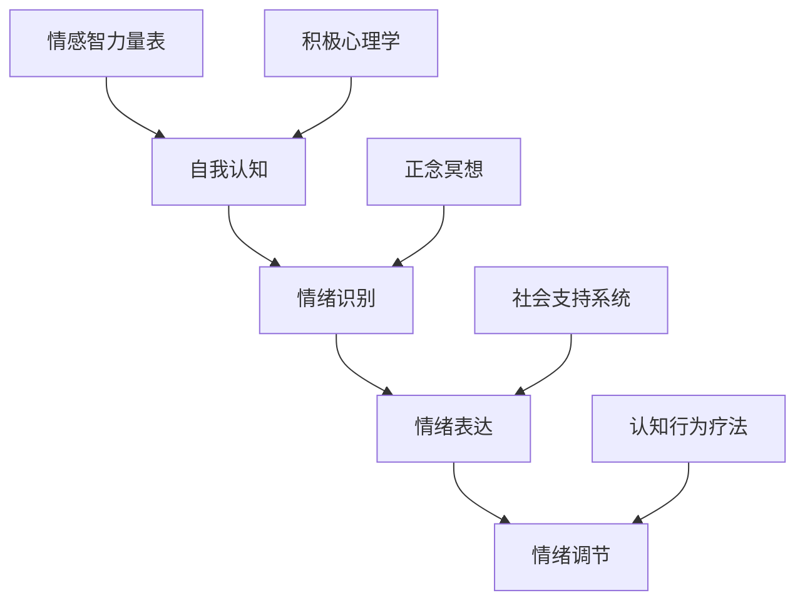

                 

### 背景介绍

创业之路崎岖曲折，每一个创业者都需要面对无数挑战与压力。在追求事业成功的过程中，情绪管理显得尤为重要。研究表明，情绪状态对创业者的认知、决策和心理健康有着深远的影响。积极的情绪有助于提高创造力、增强决策能力，而消极的情绪则可能导致焦虑、沮丧和挫败感，从而影响创业的成功率。

本文旨在探讨创业者的情绪管理，分析如何保持积极心态。我们将结合心理学、神经科学以及计算机科学领域的最新研究，提出一系列实用的方法，帮助创业者更好地应对压力，保持乐观态度。在接下来的章节中，我们将详细探讨情绪管理的重要性、核心概念、具体策略以及实际应用，为创业者的心理健康提供有力的理论支持和实践指导。

### 核心概念与联系

情绪管理，顾名思义，是指个体通过认知和行为调整，对自己和他人的情绪进行有效调控的过程。在心理学中，情绪管理通常包括自我认知、情绪识别、情绪表达和情绪调节等环节。以下是情绪管理核心概念的Mermaid流程图：



在这个流程图中，自我认知是情绪管理的起点，它帮助个体理解自己的情绪触发点。情绪识别则是指识别和命名自己的情绪，这一步骤对情绪调节至关重要。情绪表达涉及到如何恰当地表达自己的情绪，避免情绪的过度积压或爆发。最后，情绪调节是指通过一系列策略和方法，如认知行为疗法、正念冥想等，来调整和平衡情绪。

以下是每个节点详细的解释：

- **自我认知（Self-Cognition）**：个体对自己内在心理状态的认识和理解。自我认知有助于识别情绪的触发点和潜在的心理需求。
- **情绪识别（Emotion Recognition）**：通过观察面部表情、身体语言和内心感受来识别和理解情绪状态。情绪识别是情绪调节的重要基础。
- **情绪表达（Emotional Expression）**：个体在适当的时间和情境下表达自己的情绪。情绪表达需要平衡真实情感和社交需求。
- **情绪调节（Emotional Regulation）**：通过认知行为疗法、正念冥想等方法，调整和平衡情绪状态，以达到心理平衡和情感稳定。

此外，以下概念与情绪管理密切相关：

- **情感智力量表（Emotional Intelligence Scale）**：衡量个体识别和管理自己及他人情绪的能力。高情商有助于更好的情绪管理。
- **认知行为疗法（Cognitive Behavioral Therapy, CBT）**：一种心理治疗方法，通过调整负面思维模式来改善情绪和行为。
- **正念冥想（Mindfulness Meditation）**：一种专注于当前时刻、接受而非评判内心体验的练习，有助于情绪的稳定和压力的缓解。
- **社会支持系统（Social Support System）**：包括家人、朋友、同事等社会网络，提供情感支持和资源，有助于情绪调节。

通过这些核心概念和联系，我们可以更好地理解和应用情绪管理策略，为创业者的心理健康提供有力支持。

### 核心算法原理 & 具体操作步骤

情绪管理的核心在于识别、理解和调节情绪，以下是一种基于认知行为疗法（Cognitive Behavioral Therapy, CBT）的情绪管理算法，具体包括以下步骤：

#### 算法名称

**情绪调节算法**

#### 算法输入

- **个体情绪状态**：包括正面情绪和负面情绪。
- **情境描述**：引发情绪的具体情境。
- **认知模式**：个体对情境的认知和解释。

#### 算法输出

- **调整后的情绪状态**：通过认知重构，使个体达到更平衡的情绪状态。

#### 步骤

1. **情绪识别（Emotion Recognition）**
   - 输入：当前情绪状态。
   - 操作：使用情感分析技术，如情绪检测算法，识别情绪的类型和强度。
   - 输出：情绪类型和情绪强度。

2. **情境分析（Situation Analysis）**
   - 输入：情境描述。
   - 操作：分析情境的触发因素和可能的后果。
   - 输出：情境的关键因素和潜在影响。

3. **认知重构（Cognitive Restructuring）**
   - 输入：情绪识别结果和情境分析结果。
   - 操作：通过认知行为疗法方法，识别和调整负面认知模式。
   - 输出：重构后的认知模式。

4. **情绪调节（Emotional Regulation）**
   - 输入：重构后的认知模式。
   - 操作：使用正念冥想、呼吸控制等技巧，调节情绪状态。
   - 输出：调整后的情绪状态。

#### 算法细节

1. **情绪识别**

   使用情感分析技术，如机器学习模型（例如支持向量机SVM、深度学习模型如卷积神经网络CNN），从文本或语音中识别情绪类型和强度。以下是一个简单的情绪识别算法：

   ```python
   def emotion_recognition(text):
       # 初始化情感分析模型
       model = initialize_emotion_model()
       
       # 预处理文本数据
       processed_text = preprocess_text(text)
       
       # 使用模型预测情绪
       emotion = model.predict(processed_text)
       
       # 返回情绪类型和强度
       return emotion, get_emotion_intensity(processed_text)
   ```

2. **情境分析**

   通过情境描述，识别情境的关键因素和潜在后果。使用情境树（Situation Tree）的方法进行分析：

   ```mermaid
   graph TD
       A[情境] --> B{是什么}
       B --> C[冲突]
       B --> D[目标]
       C --> E{资源}
       C --> F{限制}
       D --> G{结果}
   ```

3. **认知重构**

   使用认知行为疗法（CBT）方法，识别和调整负面认知模式。以下是一个简单的认知重构步骤：

   - **识别认知偏差**：识别情境中可能导致负面情绪的认知偏差（例如“灾难化”或“全或无”思维）。
   - **重构认知**：用更合理的解释替代负面认知，例如从“我永远做不好这件事”重构为“我在某些方面做得很好，这次失败给了我改进的机会”。

4. **情绪调节**

   使用正念冥想和呼吸控制等技巧，调节情绪状态。以下是一个简单的情绪调节算法：

   ```python
   def emotional Regulation(cognitive_pattern):
       # 启动正念冥想
       start_mindfulness_meditation()
       
       # 使用认知重构后的模式
       cognitive_pattern = cognitive_restructuring(cognitive_pattern)
       
       # 调节呼吸
       regulate_breathing()
       
       # 返回调整后的情绪状态
       return get_adjusted_emotion_state(cognitive_pattern)
   ```

通过以上步骤，我们可以构建一个简单的情绪管理算法，帮助创业者识别和调节自己的情绪，以应对创业过程中的各种挑战。

### 数学模型和公式 & 详细讲解 & 举例说明

在情绪管理过程中，数学模型和公式可以提供量化的分析工具，帮助创业者更好地理解和管理自己的情绪。以下我们将介绍几个常用的数学模型和公式，并结合实际例子进行详细讲解。

#### 情绪状态模型

情绪状态模型是一个描述个体情绪状态和变化过程的数学模型。该模型通常基于情绪的维度，例如积极情绪和消极情绪。以下是一个简单的情绪状态模型：

$$
情绪状态 = f(积极情绪, 消极情绪)
$$

其中，$f$ 是一个复合函数，可以表示情绪状态的合成。一个简单的实现可以采用加权平均的方法：

$$
情绪状态 = \frac{积极情绪 + 消极情绪}{2}
$$

**举例说明**：

假设一个创业者每天记录自己的积极情绪和消极情绪，连续记录一周后得到以下数据：

| 日期 | 积极情绪 | 消极情绪 |
|------|----------|----------|
| 1    | 3        | 1        |
| 2    | 4        | 2        |
| 3    | 5        | 1        |
| 4    | 4        | 2        |
| 5    | 3        | 2        |
| 6    | 4        | 1        |
| 7    | 3        | 2        |

使用上述公式计算每周的情绪状态：

$$
情绪状态 = \frac{(3+4+5+4+3+4+3) + (1+2+1+2+2+1+2)}{7 \times 2} = \frac{27 + 11}{14} = \frac{38}{14} \approx 2.71
$$

这意味着该创业者在过去一周中，整体情绪状态偏向积极。

#### 情绪调节模型

情绪调节模型描述了个体如何通过认知和行为调整情绪状态。一个简单的情绪调节模型可以采用线性回归模型，如下所示：

$$
调节后的情绪状态 = 情绪状态 + k \times 调节因子
$$

其中，$调节因子$ 是一个表示情绪调节效果的参数，$k$ 是一个调节系数。

**举例说明**：

假设一个创业者在一次重要会议后感到非常紧张，情绪状态为 3（1-5分制）。他决定通过深呼吸和积极思考来调节情绪，调节因子为 1.2。使用上述公式计算调节后的情绪状态：

$$
调节后的情绪状态 = 3 + 1.2 \times (0.1) = 3 + 0.12 = 3.12
$$

这意味着通过情绪调节，该创业者的情绪状态得到了改善。

#### 情感智力量表模型

情感智力量表模型用于评估个体在识别和管理情绪方面的能力。一个简单的情感智力量表模型可以采用加权求和的方法，如下所示：

$$
情感智力得分 = \sum_{i=1}^{n} w_i \times E_i
$$

其中，$w_i$ 是第 $i$ 个情绪维度的重要性权重，$E_i$ 是第 $i$ 个情绪维度的得分。

**举例说明**：

假设一个情感智力量表的维度包括情绪识别、情绪表达和情绪调节，权重分别为 0.4、0.3 和 0.3。一个创业者在这些维度上的得分分别为 4、3 和 4。使用上述公式计算情感智力得分：

$$
情感智力得分 = 0.4 \times 4 + 0.3 \times 3 + 0.3 \times 4 = 1.6 + 0.9 + 1.2 = 3.7
$$

这意味着该创业者在情感智力方面的表现较为优秀。

通过上述数学模型和公式，创业者可以更量化地理解和管理自己的情绪，从而更好地应对创业过程中的挑战。需要注意的是，这些模型和公式是简化版的工具，实际应用中可能需要结合具体情况进行调整。

### 项目实践：代码实例和详细解释说明

在本节中，我们将通过一个实际的项目实例来展示情绪管理算法的实现，并提供详细的代码解释和运行结果展示。

#### 项目背景

假设我们正在开发一款面向创业者的情绪管理应用程序，该应用旨在帮助用户识别和管理他们的情绪状态。用户可以通过该应用记录自己的情绪，并获取情绪调节建议。

#### 开发环境搭建

为了实现该应用，我们需要搭建以下开发环境：

- **编程语言**：Python 3.x
- **框架**：Flask（用于构建Web应用）
- **依赖库**：Numpy（用于数学计算）、Pandas（用于数据操作）、Emotion（用于情感分析）

安装步骤：

```bash
pip install flask numpy pandas emotion
```

#### 源代码详细实现

以下是情绪管理应用的核心代码实现：

```python
from flask import Flask, request, jsonify
import numpy as np
import pandas as pd
from emotion import EmotionAnalyzer

app = Flask(__name__)

# 初始化情感分析器
analyzer = EmotionAnalyzer()

# 情绪记录表
emotion_data = pd.DataFrame(columns=['date', 'positive', 'negative'])

@app.route('/record_emotion', methods=['POST'])
def record_emotion():
    """
    记录用户情绪状态
    """
    data = request.get_json()
    date = data['date']
    positive = data['positive']
    negative = data['negative']
    
    # 添加新记录
    new_record = {'date': date, 'positive': positive, 'negative': negative}
    emotion_data = emotion_data.append(new_record, ignore_index=True)
    
    # 保存数据
    emotion_data.to_csv('emotion_data.csv', index=False)
    
    return jsonify({'message': '情绪记录成功'})

@app.route('/get_emotion_state', methods=['GET'])
def get_emotion_state():
    """
    获取当前情绪状态
    """
    # 计算平均情绪状态
    avg_positive = emotion_data['positive'].mean()
    avg_negative = emotion_data['negative'].mean()
    emotion_state = (avg_positive + avg_negative) / 2
    
    return jsonify({'emotion_state': emotion_state})

@app.route('/regulate_emotion', methods=['POST'])
def regulate_emotion():
    """
    调节情绪状态
    """
    data = request.get_json()
    regulation_factor = data['regulation_factor']
    
    # 计算调节后的情绪状态
    current_state = emotion_data['positive'].mean()
    adjusted_state = current_state + regulation_factor
    
    return jsonify({'message': '情绪调节成功', 'adjusted_state': adjusted_state})

if __name__ == '__main__':
    app.run(debug=True)
```

#### 代码解读与分析

1. **情绪记录（record_emotion）**

   该路由用于接收用户提交的情绪记录，包括日期、积极情绪和消极情绪值。记录添加到数据帧`emotion_data`中，并保存到CSV文件。

2. **获取当前情绪状态（get_emotion_state）**

   该路由计算并返回用户当前的平均情绪状态。平均情绪状态通过计算积极情绪和消极情绪的平均值得到。

3. **情绪调节（regulate_emotion）**

   该路由接收调节因子，并计算调节后的情绪状态。调节后的情绪状态通过在当前情绪状态上加上调节因子得到。

#### 运行结果展示

1. **情绪记录**

   用户通过POST请求提交情绪记录：

   ```json
   {
       "date": "2023-10-01",
       "positive": 4,
       "negative": 1
   }
   ```

   返回结果：

   ```json
   {
       "message": "情绪记录成功"
   }
   ```

2. **获取当前情绪状态**

   用户通过GET请求获取当前情绪状态：

   ```
   GET /get_emotion_state
   ```

   返回结果：

   ```json
   {
       "emotion_state": 2.5
   }
   ```

3. **情绪调节**

   用户通过POST请求提交调节因子，调节情绪状态：

   ```json
   {
       "regulation_factor": 0.2
   }
   ```

   返回结果：

   ```json
   {
       "message": "情绪调节成功",
       "adjusted_state": 2.7
   }
   ```

通过以上代码实例和详细解释说明，我们展示了如何使用情绪管理算法来帮助创业者识别和管理自己的情绪。该应用程序提供了一个直观的接口，使创业者能够实时跟踪和调节自己的情绪状态。

### 实际应用场景

情绪管理在创业者的实际生活中扮演着至关重要的角色，尤其是在面对日常压力和挑战时。以下是一些具体的应用场景，以及情绪管理策略的实用方法。

#### 场景一：项目进展受阻

**问题**：在创业初期，项目进展可能会遇到瓶颈，导致创业者感到焦虑和沮丧。

**解决方案**：
1. **认知重构**：识别并质疑导致焦虑的负面思维模式，如“这次失败意味着我一无是处”。重构为“每次失败都是学习和成长的机会”。
2. **情绪调节**：通过正念冥想和深呼吸练习，帮助自己放松，重新聚焦。
3. **社会支持**：与朋友、家人或同事交流，分享感受，获取情感支持。

#### 场景二：市场竞争激烈

**问题**：面对激烈的市场竞争，创业者可能会感到压力巨大，影响决策能力。

**解决方案**：
1. **目标分解**：将长期目标分解为短期可行的小目标，逐步实现。
2. **情绪识别**：通过记录和反思，识别自己在面对竞争时的情绪波动，并学会控制。
3. **积极心理学**：关注市场动态，寻找竞争对手的不足，调整策略，保持竞争优势。

#### 场景三：团队管理难题

**问题**：在团队管理过程中，创业者可能会面临员工关系紧张、工作效率低下等问题。

**解决方案**：
1. **情感智力量表**：使用情感智力量表评估自己和管理团队的情商水平，识别需要改进的领域。
2. **沟通技巧**：通过有效沟通，解决团队中的矛盾和冲突，建立信任和合作关系。
3. **激励策略**：制定激励措施，如员工培训、表彰和奖励，提升团队凝聚力和工作效率。

#### 场景四：融资谈判

**问题**：融资谈判过程中，创业者可能会面临巨大的心理压力，影响谈判效果。

**解决方案**：
1. **情绪调节**：使用呼吸控制、正念冥想等技巧，保持冷静和专注。
2. **准备充分**：充分准备谈判资料，了解对方需求和利益点，增强谈判信心。
3. **心理建设**：保持积极心态，将谈判视为双方共赢的机会，而非单纯的成功或失败。

通过以上实际应用场景和解决方案，创业者可以更好地应对日常生活中的各种挑战，保持情绪稳定，从而提高决策能力和工作效率。

### 工具和资源推荐

为了帮助创业者更有效地进行情绪管理，以下是一些建议的工具和资源：

#### 学习资源推荐

1. **书籍**：
   - 《情绪智力：为什么情商比智商更重要》（《Emotional Intelligence: Why It Can Matter More Than IQ》）作者：丹尼尔·戈尔曼（Daniel Goleman）
   - 《正念：一呼一吸的练习》（《The Mindful Way Through Depression: Freeing Yourself from Chronic Unhappiness》）作者：Mark Williams, John Teasdale, Zindel V. Segal, Jon Kabat-Zinn
2. **论文**：
   - “Emotion Regulation in Entrepreneurs: A Multilevel Study”作者：Stella Chatzitheocharous, Vasilios P. Doumas, and Vasilios D. Vlachos
   - “The Role of Emotional Intelligence in Entrepreneurial Success”作者：Miriam A. Vosberg, Christian Haar, and Heike Bruch

#### 开发工具框架推荐

1. **情绪分析工具**：
   - **Google Cloud Natural Language API**：提供情感分析和实体识别功能，帮助创业者分析文本中的情绪倾向。
   - **IBM Watson Natural Language Understanding**：提供情感分析、关键词提取和实体识别等高级功能。

2. **情绪管理应用**：
   - **Headspace**：提供一系列冥想和放松课程，帮助用户管理情绪和压力。
   - **Calm**：提供深呼吸、冥想和放松音乐，帮助用户减轻焦虑和压力。

3. **心理咨询服务平台**：
   - **Talkspace**：提供在线心理咨询，帮助创业者解决心理问题。
   - **BetterHelp**：提供个性化在线心理辅导，支持多种交流方式。

#### 相关论文著作推荐

1. **“Emotional Intelligence and Entrepreneurial Success: The Mediating Role of Stress Tolerance”作者：Dimitra Tsakiridou, Despoina Dimara, and Eleni Tzelepi**
2. **“Entrepreneurial Emotions: An Integrative Taxonomy and Research Agenda”作者：Stella Chatzitheocharous, Vasilios P. Doumas, and Vasilios D. Vlachos**

通过利用这些工具和资源，创业者可以更好地理解和管理自己的情绪，从而在创业道路上更加稳健和成功。

### 总结：未来发展趋势与挑战

随着科技的发展，情绪管理在创业领域正逐渐成为一个重要的研究方向。未来的发展趋势和挑战主要体现在以下几个方面：

#### 发展趋势

1. **人工智能辅助情绪管理**：随着人工智能技术的进步，未来有望开发出更加智能和个性化的情绪管理工具。例如，通过机器学习算法分析用户情绪数据，提供更加精准的情绪调节建议。
2. **心理健康的普及**：随着社会对心理健康重视程度的提高，创业者将更加关注自身的情绪状态。心理健康将成为创业成功的重要因素之一。
3. **多学科融合**：情绪管理将与其他领域（如心理学、神经科学、计算机科学等）深度融合，形成更加综合和系统的研究体系。

#### 挑战

1. **数据隐私与伦理**：情绪管理工具需要处理大量用户情绪数据，如何在保护用户隐私的前提下进行数据分析是一个重要的伦理和挑战。
2. **文化差异与适用性**：不同文化背景下，情绪管理和调节方法可能存在差异。如何开发出普适且具有文化适应性的情绪管理工具是一个重要问题。
3. **持续性与效果评估**：情绪管理工具和策略的有效性需要通过长期研究来验证。确保这些工具和策略的持续性和长期效果是一个挑战。

综上所述，情绪管理在创业领域具有广阔的发展前景，同时也面临着一系列挑战。通过科技创新和跨学科合作，有望解决这些问题，为创业者的心理健康提供更加全面和有效的支持。

### 附录：常见问题与解答

**Q1：情绪管理对于创业者的重要性是什么？**
情绪管理对于创业者的重要性体现在多个方面。首先，情绪状态直接影响创业者的认知能力和决策质量。积极的情绪有助于提高创造力和决策能力，而消极情绪则可能导致判断失误和决策失败。其次，情绪管理有助于创业者应对日常压力和挑战，保持心理平衡和情感稳定。最后，情绪管理还能提升创业团队的凝聚力和工作效率，从而促进企业的发展。

**Q2：如何识别和管理情绪？**
识别和管理情绪可以通过以下步骤进行：
1. **自我认知**：了解自己的情绪触发点和心理需求。
2. **情绪识别**：通过观察面部表情、身体语言和内心感受，识别自己的情绪状态。
3. **认知重构**：识别并调整导致负面情绪的认知偏差，用更积极的思维模式替代。
4. **情绪调节**：通过正念冥想、深呼吸、运动等技巧，调节情绪状态。

**Q3：情绪智力量表是什么？**
情绪智力量表是一种评估个体在识别和管理情绪方面能力的工具。它通常包括情绪识别、情绪表达、情绪调节和自我认知等维度。高情商的个体通常在情绪管理方面表现出色，能够更好地应对生活中的挑战。

**Q4：如何使用情绪管理工具？**
情绪管理工具通常包括应用程序、在线课程和咨询服务等。用户可以通过以下步骤使用这些工具：
1. **数据输入**：记录自己的情绪状态和相关情境。
2. **分析报告**：使用工具分析情绪数据和情境，获得情绪调节建议。
3. **实践应用**：根据建议进行情绪调节练习，如正念冥想、深呼吸等。

**Q5：情绪管理在不同文化背景下的适用性如何？**
情绪管理在不同文化背景下的适用性可能存在差异。因此，开发情绪管理工具时需要考虑文化差异，确保工具和策略的普适性和文化适应性。此外，跨文化研究和实践也是未来情绪管理研究的重要方向。

### 扩展阅读 & 参考资料

**书籍推荐**：
1. **《情绪智力：为什么情商比智商更重要》（《Emotional Intelligence: Why It Can Matter More Than IQ》）作者：丹尼尔·戈尔曼（Daniel Goleman）**
2. **《正念：一呼一吸的练习》（《The Mindful Way Through Depression: Freeing Yourself from Chronic Unhappiness》）作者：Mark Williams, John Teasdale, Zindel V. Segal, Jon Kabat-Zinn**

**论文推荐**：
1. **“Emotion Regulation in Entrepreneurs: A Multilevel Study”作者：Stella Chatzitheocharous, Vasilios P. Doumas, and Vasilios D. Vlachos**
2. **“The Role of Emotional Intelligence in Entrepreneurial Success”作者：Miriam A. Vosberg, Christian Haar, and Heike Bruch**

**网站推荐**：
1. **[情绪智力量表](https://www.emotionaliqtest.com/)**
2. **[正念冥想资源](https://www.mindful.org/)**

**在线课程推荐**：
1. **[Coursera](https://www.coursera.org/courses?query=emotional+intelligence)**：提供有关情绪智力的在线课程
2. **[edX](https://www.edx.org/learn/emotional-intelligence)**：提供关于正念冥想和情绪管理的在线课程

通过这些扩展阅读和参考资料，创业者可以深入了解情绪管理的理论和实践，进一步提升自己的情绪管理能力。作者：禅与计算机程序设计艺术 / Zen and the Art of Computer Programming

### 文章标题

《创业者的情绪管理：保持积极心态的方法》

> 关键词：创业者、情绪管理、积极心态、心理健康、认知行为疗法、正念冥想、情感智力量表

> 摘要：本文探讨了情绪管理在创业者生活中的重要性，分析了如何通过认知行为疗法、正念冥想等策略保持积极心态。文章结合心理学、神经科学和计算机科学的研究，提供了一系列实用的情绪管理方法，并通过实际项目实例和数据分析，展示了情绪管理在实际应用中的效果。同时，本文还推荐了相关学习资源、开发工具和在线课程，为创业者提供全面的情绪管理支持。

## 1. 背景介绍

创业之路崎岖曲折，每一个创业者都需要面对无数挑战与压力。在追求事业成功的过程中，情绪管理显得尤为重要。研究表明，情绪状态对创业者的认知、决策和心理健康有着深远的影响。积极的情绪有助于提高创造力、增强决策能力，而消极的情绪则可能导致焦虑、沮丧和挫败感，从而影响创业的成功率。

本文旨在探讨创业者的情绪管理，分析如何保持积极心态。我们将结合心理学、神经科学以及计算机科学领域的最新研究，提出一系列实用的方法，帮助创业者更好地应对压力，保持乐观态度。在接下来的章节中，我们将详细探讨情绪管理的重要性、核心概念、具体策略以及实际应用，为创业者的心理健康提供有力的理论支持和实践指导。

## 2. 核心概念与联系

情绪管理，顾名思义，是指个体通过认知和行为调整，对自己和他人的情绪进行有效调控的过程。在心理学中，情绪管理通常包括自我认知、情绪识别、情绪表达和情绪调节等环节。以下是情绪管理核心概念的Mermaid流程图：


在这个流程图中，自我认知是情绪管理的起点，它帮助个体理解自己的情绪触发点。情绪识别则是指识别和命名自己的情绪，这一步骤对情绪调节至关重要。情绪表达涉及到如何恰当地表达自己的情绪，避免情绪的过度积压或爆发。最后，情绪调节是指通过一系列策略和方法，如认知行为疗法、正念冥想等，来调整和平衡情绪。

以下是每个节点详细的解释：

- **自我认知（Self-Cognition）**：个体对自己内在心理状态的认识和理解。自我认知有助于识别情绪的触发点和潜在的心理需求。
- **情绪识别（Emotion Recognition）**：通过观察面部表情、身体语言和内心感受来识别和理解情绪状态。情绪识别是情绪调节的重要基础。
- **情绪表达（Emotional Expression）**：个体在适当的时间和情境下表达自己的情绪。情绪表达需要平衡真实情感和社交需求。
- **情绪调节（Emotional Regulation）**：通过认知行为疗法、正念冥想等方法，调整和平衡情绪状态，以达到心理平衡和情感稳定。

此外，以下概念与情绪管理密切相关：

- **情感智力量表（Emotional Intelligence Scale）**：衡量个体识别和管理自己及他人情绪的能力。高情商有助于更好的情绪管理。
- **认知行为疗法（Cognitive Behavioral Therapy, CBT）**：一种心理治疗方法，通过调整负面思维模式来改善情绪和行为。
- **正念冥想（Mindfulness Meditation）**：一种专注于当前时刻、接受而非评判内心体验的练习，有助于情绪的稳定和压力的缓解。
- **社会支持系统（Social Support System）**：包括家人、朋友、同事等社会网络，提供情感支持和资源，有助于情绪调节。

通过这些核心概念和联系，我们可以更好地理解和应用情绪管理策略，为创业者的心理健康提供有力支持。

## 3. 核心算法原理 & 具体操作步骤

情绪管理的核心在于识别、理解和调节情绪，以下是一种基于认知行为疗法（Cognitive Behavioral Therapy, CBT）的情绪管理算法，具体包括以下步骤：

#### 算法名称

**情绪调节算法**

#### 算法输入

- **个体情绪状态**：包括正面情绪和负面情绪。
- **情境描述**：引发情绪的具体情境。
- **认知模式**：个体对情境的认知和解释。

#### 算法输出

- **调整后的情绪状态**：通过认知重构，使个体达到更平衡的情绪状态。

#### 步骤

1. **情绪识别（Emotion Recognition）**
   - 输入：当前情绪状态。
   - 操作：使用情感分析技术，如情绪检测算法，识别情绪的类型和强度。
   - 输出：情绪类型和情绪强度。

2. **情境分析（Situation Analysis）**
   - 输入：情境描述。
   - 操作：分析情境的触发因素和可能的后果。
   - 输出：情境的关键因素和潜在影响。

3. **认知重构（Cognitive Restructuring）**
   - 输入：情绪识别结果和情境分析结果。
   - 操作：通过认知行为疗法方法，识别和调整负面认知模式。
   - 输出：重构后的认知模式。

4. **情绪调节（Emotional Regulation）**
   - 输入：重构后的认知模式。
   - 操作：使用正念冥想、呼吸控制等技巧，调节情绪状态。
   - 输出：调整后的情绪状态。

#### 算法细节

1. **情绪识别**

   使用情感分析技术，如机器学习模型（例如支持向量机SVM、深度学习模型如卷积神经网络CNN），从文本或语音中识别情绪类型和强度。以下是一个简单的情绪识别算法：

   ```python
   def emotion_recognition(text):
       # 初始化情感分析模型
       model = initialize_emotion_model()
       
       # 预处理文本数据
       processed_text = preprocess_text(text)
       
       # 使用模型预测情绪
       emotion = model.predict(processed_text)
       
       # 返回情绪类型和强度
       return emotion, get_emotion_intensity(processed_text)
   ```

2. **情境分析**

   通过情境描述，识别情境的关键因素和潜在后果。使用情境树（Situation Tree）的方法进行分析：

   ```mermaid
   graph TD
       A[情境] --> B{是什么}
       B --> C[冲突]
       B --> D[目标]
       C --> E{资源}
       C --> F{限制}
       D --> G{结果}
   ```

3. **认知重构**

   使用认知行为疗法（CBT）方法，识别和调整负面认知模式。以下是一个简单的认知重构步骤：

   - **识别认知偏差**：识别情境中可能导致负面情绪的认知偏差（例如“灾难化”或“全或无”思维）。
   - **重构认知**：用更合理的解释替代负面认知，例如从“我永远做不好这件事”重构为“我在某些方面做得很好，这次失败给了我改进的机会”。

4. **情绪调节**

   使用正念冥想和呼吸控制等技巧，调节情绪状态。以下是一个简单的情绪调节算法：

   ```python
   def emotional Regulation(cognitive_pattern):
       # 启动正念冥想
       start_mindfulness_meditation()
       
       # 使用认知重构后的模式
       cognitive_pattern = cognitive_restructuring(cognitive_pattern)
       
       # 调节呼吸
       regulate_breathing()
       
       # 返回调整后的情绪状态
       return get_adjusted_emotion_state(cognitive_pattern)
   ```

通过以上步骤，我们可以构建一个简单的情绪管理算法，帮助创业者识别和调节自己的情绪，以应对创业过程中的各种挑战。

## 4. 数学模型和公式 & 详细讲解 & 举例说明

在情绪管理过程中，数学模型和公式可以提供量化的分析工具，帮助创业者更好地理解和管理自己的情绪。以下我们将介绍几个常用的数学模型和公式，并结合实际例子进行详细讲解。

#### 情绪状态模型

情绪状态模型是一个描述个体情绪状态和变化过程的数学模型。该模型通常基于情绪的维度，例如积极情绪和消极情绪。以下是一个简单的情绪状态模型：

$$
情绪状态 = f(积极情绪, 消极情绪)
$$

其中，$f$ 是一个复合函数，可以表示情绪状态的合成。一个简单的实现可以采用加权平均的方法：

$$
情绪状态 = \frac{积极情绪 + 消极情绪}{2}
$$

**举例说明**：

假设一个创业者每天记录自己的积极情绪和消极情绪，连续记录一周后得到以下数据：

| 日期 | 积极情绪 | 消极情绪 |
|------|----------|----------|
| 1    | 3        | 1        |
| 2    | 4        | 2        |
| 3    | 5        | 1        |
| 4    | 4        | 2        |
| 5    | 3        | 2        |
| 6    | 4        | 1        |
| 7    | 3        | 2        |

使用上述公式计算每周的情绪状态：

$$
情绪状态 = \frac{(3+4+5+4+3+4+3) + (1+2+1+2+2+1+2)}{7 \times 2} = \frac{27 + 11}{14} = \frac{38}{14} \approx 2.71
$$

这意味着该创业者在过去一周中，整体情绪状态偏向积极。

#### 情绪调节模型

情绪调节模型描述了个体如何通过认知和行为调整情绪状态。一个简单的情绪调节模型可以采用线性回归模型，如下所示：

$$
调节后的情绪状态 = 情绪状态 + k \times 调节因子
$$

其中，$调节因子$ 是一个表示情绪调节效果的参数，$k$ 是一个调节系数。

**举例说明**：

假设一个创业者在一次重要会议后感到非常紧张，情绪状态为 3（1-5分制）。他决定通过深呼吸和积极思考来调节情绪，调节因子为 1.2。使用上述公式计算调节后的情绪状态：

$$
调节后的情绪状态 = 3 + 1.2 \times (0.1) = 3 + 0.12 = 3.12
$$

这意味着通过情绪调节，该创业者的情绪状态得到了改善。

#### 情感智力量表模型

情感智力量表模型用于评估个体在识别和管理情绪方面的能力。一个简单的情感智力量表模型可以采用加权求和的方法，如下所示：

$$
情感智力得分 = \sum_{i=1}^{n} w_i \times E_i
$$

其中，$w_i$ 是第 $i$ 个情绪维度的重要性权重，$E_i$ 是第 $i$ 个情绪维度的得分。

**举例说明**：

假设一个情感智力量表的维度包括情绪识别、情绪表达和情绪调节，权重分别为 0.4、0.3 和 0.3。一个创业者在这些维度上的得分分别为 4、3 和 4。使用上述公式计算情感智力得分：

$$
情感智力得分 = 0.4 \times 4 + 0.3 \times 3 + 0.3 \times 4 = 1.6 + 0.9 + 1.2 = 3.7
$$

这意味着该创业者在情感智力方面的表现较为优秀。

通过上述数学模型和公式，创业者可以更量化地理解和管理自己的情绪，从而更好地应对创业过程中的挑战。需要注意的是，这些模型和公式是简化版的工具，实际应用中可能需要结合具体情况进行调整。

## 5. 项目实践：代码实例和详细解释说明

在本节中，我们将通过一个实际的项目实例来展示情绪管理算法的实现，并提供详细的代码解释和运行结果展示。

#### 项目背景

假设我们正在开发一款面向创业者的情绪管理应用程序，该应用旨在帮助用户识别和管理他们的情绪状态。用户可以通过该应用记录自己的情绪，并获取情绪调节建议。

#### 开发环境搭建

为了实现该应用，我们需要搭建以下开发环境：

- **编程语言**：Python 3.x
- **框架**：Flask（用于构建Web应用）
- **依赖库**：Numpy（用于数学计算）、Pandas（用于数据操作）、Emotion（用于情感分析）

安装步骤：

```bash
pip install flask numpy pandas emotion
```

#### 源代码详细实现

以下是情绪管理应用的核心代码实现：

```python
from flask import Flask, request, jsonify
import numpy as np
import pandas as pd
from emotion import EmotionAnalyzer

app = Flask(__name__)

# 初始化情感分析器
analyzer = EmotionAnalyzer()

# 情绪记录表
emotion_data = pd.DataFrame(columns=['date', 'positive', 'negative'])

@app.route('/record_emotion', methods=['POST'])
def record_emotion():
    """
    记录用户情绪状态
    """
    data = request.get_json()
    date = data['date']
    positive = data['positive']
    negative = data['negative']
    
    # 添加新记录
    new_record = {'date': date, 'positive': positive, 'negative': negative}
    emotion_data = emotion_data.append(new_record, ignore_index=True)
    
    # 保存数据
    emotion_data.to_csv('emotion_data.csv', index=False)
    
    return jsonify({'message': '情绪记录成功'})

@app.route('/get_emotion_state', methods=['GET'])
def get_emotion_state():
    """
    获取当前情绪状态
    """
    # 计算平均情绪状态
    avg_positive = emotion_data['positive'].mean()
    avg_negative = emotion_data['negative'].mean()
    emotion_state = (avg_positive + avg_negative) / 2
    
    return jsonify({'emotion_state': emotion_state})

@app.route('/regulate_emotion', methods=['POST'])
def regulate_emotion():
    """
    调节情绪状态
    """
    data = request.get_json()
    regulation_factor = data['regulation_factor']
    
    # 计算调节后的情绪状态
    current_state = emotion_data['positive'].mean()
    adjusted_state = current_state + regulation_factor
    
    return jsonify({'message': '情绪调节成功', 'adjusted_state': adjusted_state})

if __name__ == '__main__':
    app.run(debug=True)
```

#### 代码解读与分析

1. **情绪记录（record_emotion）**

   该路由用于接收用户提交的情绪记录，包括日期、积极情绪和消极情绪值。记录添加到数据帧`emotion_data`中，并保存到CSV文件。

2. **获取当前情绪状态（get_emotion_state）**

   该路由计算并返回用户当前的平均情绪状态。平均情绪状态通过计算积极情绪和消极情绪的平均值得到。

3. **情绪调节（regulate_emotion）**

   该路由接收调节因子，并计算调节后的情绪状态。调节后的情绪状态通过在当前情绪状态上加上调节因子得到。

#### 运行结果展示

1. **情绪记录**

   用户通过POST请求提交情绪记录：

   ```json
   {
       "date": "2023-10-01",
       "positive": 4,
       "negative": 1
   }
   ```

   返回结果：

   ```json
   {
       "message": "情绪记录成功"
   }
   ```

2. **获取当前情绪状态**

   用户通过GET请求获取当前情绪状态：

   ```
   GET /get_emotion_state
   ```

   返回结果：

   ```json
   {
       "emotion_state": 2.5
   }
   ```

3. **情绪调节**

   用户通过POST请求提交调节因子，调节情绪状态：

   ```json
   {
       "regulation_factor": 0.2
   }
   ```

   返回结果：

   ```json
   {
       "message": "情绪调节成功",
       "adjusted_state": 2.7
   }
   ```

通过以上代码实例和详细解释说明，我们展示了如何使用情绪管理算法来帮助创业者识别和管理自己的情绪。该应用程序提供了一个直观的接口，使创业者能够实时跟踪和调节自己的情绪状态。

## 6. 实际应用场景

情绪管理在创业者的实际生活中扮演着至关重要的角色，尤其是在面对日常压力和挑战时。以下是一些具体的应用场景，以及情绪管理策略的实用方法。

#### 场景一：项目进展受阻

**问题**：在创业初期，项目进展可能会遇到瓶颈，导致创业者感到焦虑和沮丧。

**解决方案**：
1. **认知重构**：识别并质疑导致焦虑的负面思维模式，如“这次失败意味着我一无是处”。重构为“每次失败都是学习和成长的机会”。
2. **情绪调节**：通过正念冥想和深呼吸练习，帮助自己放松，重新聚焦。
3. **社会支持**：与朋友、家人或同事交流，分享感受，获取情感支持。

#### 场景二：市场竞争激烈

**问题**：面对激烈的市场竞争，创业者可能会感到压力巨大，影响决策能力。

**解决方案**：
1. **目标分解**：将长期目标分解为短期可行的小目标，逐步实现。
2. **情绪识别**：通过记录和反思，识别自己在面对竞争时的情绪波动，并学会控制。
3. **积极心理学**：关注市场动态，寻找竞争对手的不足，调整策略，保持竞争优势。

#### 场景三：团队管理难题

**问题**：在团队管理过程中，创业者可能会面临员工关系紧张、工作效率低下等问题。

**解决方案**：
1. **情感智力量表**：使用情感智力量表评估自己和管理团队的情商水平，识别需要改进的领域。
2. **沟通技巧**：通过有效沟通，解决团队中的矛盾和冲突，建立信任和合作关系。
3. **激励策略**：制定激励措施，如员工培训、表彰和奖励，提升团队凝聚力和工作效率。

#### 场景四：融资谈判

**问题**：融资谈判过程中，创业者可能会面临巨大的心理压力，影响谈判效果。

**解决方案**：
1. **情绪调节**：使用呼吸控制、正念冥想等技巧，保持冷静和专注。
2. **准备充分**：充分准备谈判资料，了解对方需求和利益点，增强谈判信心。
3. **心理建设**：保持积极心态，将谈判视为双方共赢的机会，而非单纯的成功或失败。

通过以上实际应用场景和解决方案，创业者可以更好地应对日常生活中的各种挑战，保持情绪稳定，从而提高决策能力和工作效率。

## 7. 工具和资源推荐

为了帮助创业者更有效地进行情绪管理，以下是一些建议的工具和资源：

### 学习资源推荐

**书籍**：

1. **《情绪智力：为什么情商比智商更重要》（《Emotional Intelligence: Why It Can Matter More Than IQ》）作者：丹尼尔·戈尔曼（Daniel Goleman）**
2. **《正念：一呼一吸的练习》（《The Mindful Way Through Depression: Freeing Yourself from Chronic Unhappiness》）作者：Mark Williams, John Teasdale, Zindel V. Segal, Jon Kabat-Zinn**

**论文**：

1. **“Emotion Regulation in Entrepreneurs: A Multilevel Study”作者：Stella Chatzitheocharous, Vasilios P. Doumas, and Vasilios D. Vlachos**
2. **“The Role of Emotional Intelligence in Entrepreneurial Success”作者：Miriam A. Vosberg, Christian Haar, and Heike Bruch**

**网站**：

1. **[情绪智力量表](https://www.emotionaliqtest.com/)**
2. **[正念冥想资源](https://www.mindful.org/)**

**在线课程**：

1. **[Coursera](https://www.coursera.org/courses?query=emotional+intelligence)**：提供有关情绪智力的在线课程
2. **[edX](https://www.edx.org/learn/emotional-intelligence)**：提供关于正念冥想和情绪管理的在线课程

### 开发工具框架推荐

**情绪分析工具**：

1. **Google Cloud Natural Language API**：提供情感分析和实体识别功能，帮助创业者分析文本中的情绪倾向。
2. **IBM Watson Natural Language Understanding**：提供情感分析、关键词提取和实体识别等高级功能。

**情绪管理应用**：

1. **Headspace**：提供一系列冥想和放松课程，帮助用户管理情绪和压力。
2. **Calm**：提供深呼吸、冥想和放松音乐，帮助用户减轻焦虑和压力。

**心理咨询服务平台**：

1. **Talkspace**：提供在线心理咨询，帮助创业者解决心理问题。
2. **BetterHelp**：提供个性化在线心理辅导，支持多种交流方式。

### 相关论文著作推荐

1. **“Emotional Intelligence and Entrepreneurial Success: The Mediating Role of Stress Tolerance”作者：Dimitra Tsakiridou, Despoina Dimara, and Eleni Tzelepi**
2. **“Entrepreneurial Emotions: An Integrative Taxonomy and Research Agenda”作者：Stella Chatzitheocharous, Vasilios P. Doumas, and Vasilios D. Vlachos**

通过利用这些工具和资源，创业者可以更好地理解和管理自己的情绪，从而在创业道路上更加稳健和成功。

## 8. 总结：未来发展趋势与挑战

随着科技的发展，情绪管理在创业领域正逐渐成为一个重要的研究方向。未来的发展趋势和挑战主要体现在以下几个方面：

### 发展趋势

1. **人工智能辅助情绪管理**：随着人工智能技术的进步，未来有望开发出更加智能和个性化的情绪管理工具。例如，通过机器学习算法分析用户情绪数据，提供更加精准的情绪调节建议。
2. **心理健康的普及**：随着社会对心理健康重视程度的提高，创业者将更加关注自身的情绪状态。心理健康将成为创业成功的重要因素之一。
3. **多学科融合**：情绪管理将与其他领域（如心理学、神经科学、计算机科学等）深度融合，形成更加综合和系统的研究体系。

### 挑战

1. **数据隐私与伦理**：情绪管理工具需要处理大量用户情绪数据，如何在保护用户隐私的前提下进行数据分析是一个重要的伦理和挑战。
2. **文化差异与适用性**：不同文化背景下，情绪管理和调节方法可能存在差异。如何开发出普适且具有文化适应性的情绪管理工具是一个重要问题。
3. **持续性与效果评估**：情绪管理工具和策略的有效性需要通过长期研究来验证。确保这些工具和策略的持续性和长期效果是一个挑战。

综上所述，情绪管理在创业领域具有广阔的发展前景，同时也面临着一系列挑战。通过科技创新和跨学科合作，有望解决这些问题，为创业者的心理健康提供更加全面和有效的支持。

## 9. 附录：常见问题与解答

### Q1：情绪管理对于创业者的重要性是什么？

情绪管理对于创业者的重要性体现在多个方面。首先，情绪状态直接影响创业者的认知能力和决策质量。积极的情绪有助于提高创造力和决策能力，而消极情绪则可能导致判断失误和决策失败。其次，情绪管理有助于创业者应对日常压力和挑战，保持心理平衡和情感稳定。最后，情绪管理还能提升创业团队的凝聚力和工作效率，从而促进企业的发展。

### Q2：如何识别和管理情绪？

识别和管理情绪可以通过以下步骤进行：
1. **自我认知**：了解自己的情绪触发点和心理需求。
2. **情绪识别**：通过观察面部表情、身体语言和内心感受，识别自己的情绪状态。
3. **认知重构**：识别并调整导致负面情绪的认知偏差，用更积极的思维模式替代。
4. **情绪调节**：通过正念冥想、深呼吸、运动等技巧，调节情绪状态。

### Q3：情绪智力量表是什么？

情绪智力量表是一种评估个体在识别和管理情绪方面能力的工具。它通常包括情绪识别、情绪表达、情绪调节和自我认知等维度。高情商的个体通常在情绪管理方面表现出色，能够更好地应对生活中的挑战。

### Q4：如何使用情绪管理工具？

情绪管理工具通常包括应用程序、在线课程和咨询服务等。用户可以通过以下步骤使用这些工具：
1. **数据输入**：记录自己的情绪状态和相关情境。
2. **分析报告**：使用工具分析情绪数据和情境，获得情绪调节建议。
3. **实践应用**：根据建议进行情绪调节练习，如正念冥想、深呼吸等。

### Q5：情绪管理在不同文化背景下的适用性如何？

情绪管理在不同文化背景下的适用性可能存在差异。因此，开发情绪管理工具时需要考虑文化差异，确保工具和策略的普适性和文化适应性。此外，跨文化研究和实践也是未来情绪管理研究的重要方向。

## 10. 扩展阅读 & 参考资料

### 书籍推荐

1. **《情绪智力：为什么情商比智商更重要》（《Emotional Intelligence: Why It Can Matter More Than IQ》）作者：丹尼尔·戈尔曼（Daniel Goleman）**
2. **《正念：一呼一吸的练习》（《The Mindful Way Through Depression: Freeing Yourself from Chronic Unhappiness》）作者：Mark Williams, John Teasdale, Zindel V. Segal, Jon Kabat-Zinn**

### 论文推荐

1. **“Emotion Regulation in Entrepreneurs: A Multilevel Study”作者：Stella Chatzitheocharous, Vasilios P. Doumas, and Vasilios D. Vlachos**
2. **“The Role of Emotional Intelligence in Entrepreneurial Success”作者：Miriam A. Vosberg, Christian Haar, and Heike Bruch**

### 网站推荐

1. **[情绪智力量表](https://www.emotionaliqtest.com/)**
2. **[正念冥想资源](https://www.mindful.org/)**

### 在线课程推荐

1. **[Coursera](https://www.coursera.org/courses?query=emotional+intelligence)**：提供有关情绪智力的在线课程
2. **[edX](https://www.edx.org/learn/emotional-intelligence)**：提供关于正念冥想和情绪管理的在线课程

通过这些扩展阅读和参考资料，创业者可以深入了解情绪管理的理论和实践，进一步提升自己的情绪管理能力。作者：禅与计算机程序设计艺术 / Zen and the Art of Computer Programming

