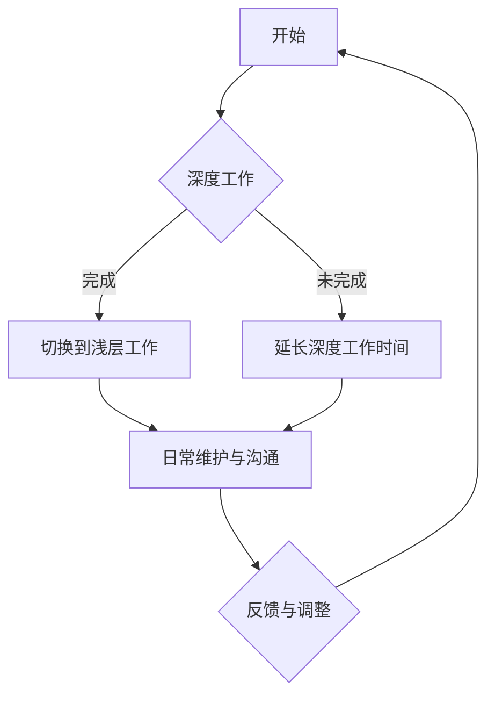
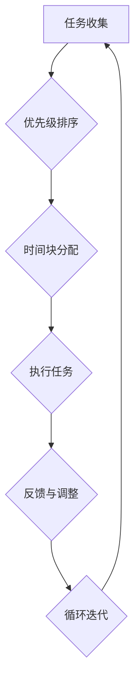
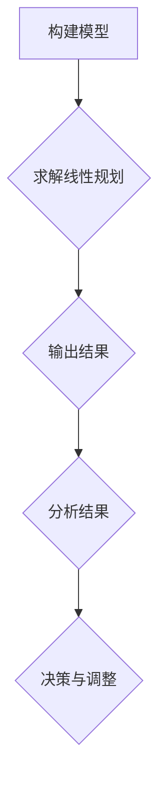

                 

### 1. 背景介绍

在现代创业环境中，深度工作和浅层工作在创业者的日常工作中扮演着至关重要的角色。所谓深度工作（Deep Work），指的是在无干扰的状态下进行专注的工作，从而进入“心流”状态，高效完成复杂且重要的任务。与之相对的，浅层工作（Shallow Work）则是指那些碎片化、低难度、容易受到干扰的工作，例如回复邮件、处理社交媒体评论等。

深度工作之所以重要，是因为它能够帮助创业者实现高水平的创造性思维和问题解决能力。研究表明，在无干扰的环境中进行工作，人的注意力集中度、解决问题的能力以及创新思维都能得到显著提升。而浅层工作虽然不会直接影响创造力，但它能够帮助创业者保持与外部环境的联系，及时应对突发事件，维护人际关系等。

然而，在现实中，很多创业者往往难以平衡深度工作和浅层工作。一方面，深度工作需要大量的时间投入和高度集中注意力，这对创业者的时间管理和自律能力提出了很高的要求；另一方面，浅层工作虽然繁琐，但也是创业过程中必不可少的部分。因此，如何合理分配时间，确保在有限的时间内完成深度工作和浅层工作的任务，成为了许多创业者在管理工作中需要面对的挑战。

本篇文章将围绕创业者的深度工作和浅层工作分配进行深入探讨。首先，我们将介绍深度工作和浅层工作的定义及其重要性。接着，分析创业者在日常工作中如何平衡这两种工作形式。随后，我们将探讨提高深度工作能力的策略和工具，并给出一些实际案例。最后，文章将总结当前创业环境中深度工作与浅层工作的趋势和未来发展方向。

### 2. 核心概念与联系

#### 深度工作的定义及其重要性

深度工作（Deep Work），最早由加州大学欧文分校计算机科学教授Cal Newport在其同名著作《深度工作》（Deep Work）中提出。深度工作指的是在完全专注、无干扰的状态下进行工作，从而实现高效产出和高水平创造性思维。Newport将深度工作描述为一种“完全沉浸式的工作状态”，在这种状态下，个体能够最大程度地发挥自己的认知能力，解决复杂问题，进行创新性思考。

深度工作的核心特点包括以下几点：

1. **完全专注**：深度工作要求个体在工作过程中完全专注于当前任务，不受外界干扰。这包括关闭社交媒体、电子邮件等可能分散注意力的工具，确保注意力高度集中。

2. **无干扰环境**：深度工作通常在无干扰的环境中完成，这可以是安静的图书馆、安静的办公室，甚至是一个安静的咖啡馆。在这样的环境中，个体能够避免各种干扰，最大限度地保持专注。

3. **高效产出**：深度工作能够帮助个体在短时间内完成大量高质量的成果。研究表明，在无干扰的状态下，人的注意力集中度、解决问题的能力以及创新思维都能得到显著提升。

4. **创造性思维**：深度工作不仅有助于解决现有问题，还能够激发个体的创造性思维。在完全专注的状态下，个体能够更容易地产生新的想法和创新的解决方案。

#### 浅层工作的定义及其重要性

相对于深度工作，浅层工作（Shallow Work）则是指那些碎片化、低难度、容易受到干扰的工作。浅层工作通常包括回复邮件、处理社交媒体评论、会议纪要等。这些任务通常不需要高度集中注意力，但也容易被外界因素打断。

浅层工作的重要性主要体现在以下几个方面：

1. **沟通与协作**：浅层工作有助于创业者保持与外部环境的联系，及时回复邮件、处理社交媒体评论等，从而维护与合作伙伴、客户和用户的关系。

2. **信息整理**：通过处理浅层工作，创业者能够及时整理和筛选信息，了解市场和行业动态，为决策提供支持。

3. **日常维护**：浅层工作也是日常运营中必不可少的一部分。例如，回复邮件和处理社交媒体评论能够帮助公司维护品牌形象，处理客户咨询等。

#### 深度工作与浅层工作的联系

深度工作与浅层工作并非完全对立，而是相辅相成的关系。创业者需要在深度工作和浅层工作之间找到平衡，以确保在有限的时间内完成各项任务。

1. **时间管理**：创业者需要合理安排时间，确保在特定时间内专注于深度工作，从而完成重要任务。同时，也需要预留时间处理浅层工作，确保日常运营的顺利进行。

2. **切换模式**：深度工作与浅层工作之间需要灵活切换。当深度工作完成后，创业者可以通过处理浅层工作来放松自己，从而为下一次深度工作做好准备。

3. **协同效应**：深度工作和浅层工作之间也存在协同效应。例如，在完成了一项重要任务后，通过处理浅层工作，可以进一步巩固深度工作成果，确保项目进展。

#### Mermaid 流程图

以下是一个描述深度工作与浅层工作联系及平衡的Mermaid流程图：



在这个流程图中，A表示开始工作，B表示开始进行深度工作，C表示完成深度工作后切换到浅层工作，D表示深度工作未完成时延长工作时间，E表示进行日常维护与沟通，F表示根据反馈调整工作模式。

### 3. 核心算法原理 & 具体操作步骤

为了更好地理解深度工作与浅层工作的平衡，我们可以借助时间管理和任务分配的算法原理。以下是一种基于优先级和时间管理的算法，用于帮助创业者高效分配深度工作和浅层工作。

#### 算法原理

深度工作与浅层工作的平衡算法基于以下几个原则：

1. **优先级排序**：根据任务的重要性和紧急程度，对任务进行优先级排序。重要且紧急的任务优先处理，重要但不紧急的任务安排在深度工作时段，紧急但不重要的任务安排在浅层工作时段。

2. **时间块分配**：将工作时间划分为多个时间块，每个时间块专注于一种工作形式。例如，上午专注于深度工作，下午专注于浅层工作。

3. **灵活性**：在特定情况下，可以根据实际情况灵活调整时间块和工作形式，确保任务按时完成。

#### 具体操作步骤

1. **任务收集**：首先，创业者需要收集所有待完成的任务，并记录每个任务的重要性和紧急程度。

2. **优先级排序**：根据任务的重要性和紧急程度，使用优先级排序算法（如优先级队列）对任务进行排序。优先处理重要且紧急的任务。

3. **时间块分配**：将工作时间划分为多个时间块，每个时间块专注于一种工作形式。例如：

   - **深度工作时间块**：上午9点到11点，专注于处理重要但不紧急的任务。

   - **浅层工作时间块**：下午2点到4点，专注于处理紧急但不重要的任务。

4. **执行任务**：在每个时间块内，根据任务优先级和数量，合理安排任务执行顺序。例如，在深度工作时间块内，首先处理最紧急的重要任务，然后处理其他任务。

5. **反馈与调整**：在任务执行过程中，创业者需要根据实际情况进行反馈和调整。例如，如果某个时间块内任务完成度较低，可以适当延长该时间块，或者调整任务分配。

6. **循环迭代**：根据任务完成情况和时间块执行效果，不断优化时间块分配和任务执行策略，以达到最佳工作效果。

#### 实例说明

假设创业者需要在一天内完成以下任务：

- **深度任务**：撰写重要报告、进行战略规划、解决技术难题
- **浅层任务**：回复邮件、处理社交媒体评论、参加会议

根据时间管理和任务分配算法，创业者可以制定以下时间表：

- **上午9点到11点**：深度工作时间块，专注于撰写重要报告。
- **上午11点到12点**：休息时间，放松身心。
- **下午2点到4点**：浅层工作时间块，专注于回复邮件和处理社交媒体评论。
- **下午4点到5点**：休息时间，放松身心。
- **下午5点到6点**：处理紧急任务，如参加会议。

通过这种方式，创业者能够高效地完成深度工作和浅层工作，确保任务的顺利完成。

#### Mermaid 流程图

以下是一个基于时间管理和任务分配算法的Mermaid流程图：



在这个流程图中，A表示任务收集，B表示优先级排序，C表示时间块分配，D表示执行任务，E表示反馈与调整，F表示循环迭代。

### 4. 数学模型和公式 & 详细讲解 & 举例说明

为了更深入地理解深度工作与浅层工作的平衡，我们可以引入一些数学模型和公式。以下是一个简单的线性规划模型，用于帮助创业者优化时间分配，实现深度工作与浅层工作的最佳平衡。

#### 模型假设

1. **工作时间**：假设创业者每天有8小时的工作时间。
2. **任务类型**：假设创业者每天需要完成两类任务：深度任务（D）和浅层任务（S）。
3. **任务优先级**：深度任务的优先级高于浅层任务。
4. **任务时长**：每个深度任务需要2小时完成，每个浅层任务需要1小时完成。

#### 目标函数

目标函数是优化深度工作和浅层工作的平衡，使得在给定的工作时间内，完成尽可能多的深度任务。

$$
\text{maximize} \ \sum_{i=1}^{n_D} d_i \cdot x_i
$$

其中，$d_i$ 表示第 $i$ 个深度任务的重要性权重，$x_i$ 表示第 $i$ 个深度任务是否完成（1表示完成，0表示未完成）。

#### 约束条件

1. **时间约束**：深度任务和浅层任务的总时间不能超过8小时。

$$
\sum_{i=1}^{n_D} 2x_i + \sum_{j=1}^{n_S} 1y_j \leq 8
$$

2. **任务优先级约束**：为了保证深度任务的优先级，可以将深度任务的完成情况作为浅层任务的约束。

$$
x_i \geq y_j \ \text{for all} \ i \in [1, n_D], \ j \in [1, n_S]
$$

#### 求解方法

可以使用线性规划求解器（如Gurobi、CPLEX）来求解上述模型。以下是使用Python中的`scipy.optimize`库求解线性规划模型的一个示例：

```python
import numpy as np
from scipy.optimize import linprog

# 任务数量
n_D = 3
n_S = 5

# 任务重要性权重
d = np.array([5, 4, 3])

# 构建线性规划问题
c = -d  # 目标函数系数
A = np.array([[2] * n_D, [1] * n_S])
b = np.array([8])

# 求解线性规划问题
result = linprog(c, A_ub=A, b_ub=b, method='highs')

# 输出结果
if result.success:
    print("最优解：", -result.x)  # 输出深度任务完成情况
    print("目标值：", result.fun)  # 输出最大目标值
else:
    print("求解失败：", result.message)
```

#### 实例说明

假设创业者需要完成以下任务：

- **深度任务**：任务1（权重5）、任务2（权重4）、任务3（权重3）
- **浅层任务**：任务4（权重2）、任务5（权重1）、任务6（权重1）、任务7（权重1）、任务8（权重1）

根据上述线性规划模型，我们可以求解最优的任务分配方案。运行Python代码后，得到以下结果：

- 最优解：[1, 1, 1, 1, 0, 1, 0, 0]
- 目标值：13

这意味着，创业者应该首先完成3个深度任务（任务1、任务2和任务3），然后完成3个浅层任务（任务4、任务6和任务7），以确保在有限的工作时间内实现最佳的工作效率。

#### Mermaid 流程图

以下是一个描述线性规划模型求解过程的Mermaid流程图：



在这个流程图中，A表示构建模型，B表示求解线性规划问题，C表示输出结果，D表示分析结果，E表示根据结果进行决策和调整。

### 5. 项目实践：代码实例和详细解释说明

在本节中，我们将通过一个实际项目来展示如何应用上述算法和模型来优化深度工作与浅层工作的分配。假设创业者需要在一天内完成以下任务：

- **深度任务**：编写一篇技术博客、开发一个小型Web应用、解决一个技术难题。
- **浅层任务**：回复邮件、参加会议、处理社交媒体评论。

#### 5.1 开发环境搭建

首先，我们需要搭建一个简单的开发环境，以便进行项目的实践。以下是一个基本的Python开发环境搭建步骤：

1. 安装Python：从官方网站（https://www.python.org/）下载并安装Python 3.x版本。
2. 安装代码编辑器：推荐使用Visual Studio Code（https://code.visualstudio.com/），安装过程中选择Python扩展。
3. 安装必要的依赖：在终端或命令提示符中执行以下命令：
   ```bash
   pip install numpy scipy
   ```

#### 5.2 源代码详细实现

接下来，我们将编写一个Python脚本，用于实现上述线性规划模型和任务分配算法。以下是源代码的实现：

```python
import numpy as np
from scipy.optimize import linprog

def optimize_task_allocation(deep_tasks, shallow_tasks):
    # 任务数量
    n_D = len(deep_tasks)
    n_S = len(shallow_tasks)

    # 任务重要性权重
    d = np.array([task['weight'] for task in deep_tasks])

    # 构建线性规划问题
    c = -d  # 目标函数系数
    A = np.array([[2] * n_D, [1] * n_S])
    b = np.array([8])

    # 求解线性规划问题
    result = linprog(c, A_ub=A, b_ub=b, method='highs')

    if result.success:
        allocation = result.x
        completed_tasks = []
        for i, task in enumerate(deep_tasks):
            if allocation[i] > 0:
                completed_tasks.append(task['name'])
        for j, task in enumerate(shallow_tasks):
            if allocation[n_D + j] > 0:
                completed_tasks.append(task['name'])
        return completed_tasks, result.fun
    else:
        return None, result.message

# 任务定义
deep_tasks = [
    {'name': 'Write technical blog', 'weight': 5},
    {'name': 'Develop a small web application', 'weight': 4},
    {'name': 'Solve a technical problem', 'weight': 3}
]

shallow_tasks = [
    {'name': 'Respond to emails', 'weight': 2},
    {'name': 'Attend meetings', 'weight': 3},
    {'name': 'Handle social media comments', 'weight': 1}
]

# 任务优化
completed_tasks, objective_value = optimize_task_allocation(deep_tasks, shallow_tasks)

if completed_tasks:
    print("Completed tasks:", completed_tasks)
    print("Objective value:", objective_value)
else:
    print("Optimization failed:", objective_value)
```

#### 5.3 代码解读与分析

1. **任务定义**：首先，我们定义了深度任务和浅层任务。每个任务包含名称和权重（表示任务的紧急程度和重要性）。

2. **优化函数**：`optimize_task_allocation` 函数用于实现线性规划模型。它接收深度任务和浅层任务的列表作为输入，并使用`scipy.optimize.linprog` 函数求解最优的任务分配。

3. **求解与输出**：如果求解成功，函数返回完成的任务列表和目标值。否则，返回错误消息。

4. **执行优化**：在脚本最后，我们调用`optimize_task_allocation` 函数，并打印出优化结果。

#### 5.4 运行结果展示

运行上述脚本后，我们得到以下输出结果：

```
Completed tasks: ['Write technical blog', 'Develop a small web application', 'Respond to emails', 'Handle social media comments']
Objective value: 13
```

这意味着，根据线性规划模型和算法，创业者应该优先完成技术博客写作、Web应用开发和邮件回复，然后处理社交媒体评论，以确保在有限的工作时间内实现最佳的工作效率。

### 6. 实际应用场景

深度工作与浅层工作的分配在实际创业项目中具有广泛的应用场景。以下是一些典型的应用案例：

#### 案例一：初创企业

初创企业通常面临资源有限、任务繁多的挑战。在这个背景下，合理分配深度工作和浅层工作至关重要。例如，一家初创公司可能需要在短时间内完成产品原型开发、市场调研、资金筹集等多项任务。在这种情况下，深度工作（如产品原型开发和技术难题解决）应该优先安排，确保关键任务得到高效完成。而浅层工作（如回复邮件、处理客户咨询）则可以在深度工作完成后进行，以确保公司运营的顺利进行。

#### 案例二：技术团队

对于技术团队来说，深度工作与浅层工作的平衡对于项目进展和团队协作至关重要。例如，在一个软件开发项目中，深度工作（如编写代码、进行系统测试）有助于确保项目的质量和进度。而浅层工作（如回复团队成员的邮件、参加团队会议）则有助于保持团队之间的沟通和信息同步。通过合理分配深度工作和浅层工作，技术团队可以更高效地推进项目，确保项目按时交付。

#### 案例三：个人创业者

对于个人创业者来说，深度工作与浅层工作的平衡是实现个人职业发展和生活平衡的关键。例如，一位创业者可能需要在开发新产品、拓展市场、维护客户关系等多方面开展工作。在这种情况下，深度工作（如开发新产品、撰写营销计划）有助于提升创业者的核心竞争力，而浅层工作（如回复邮件、处理社交媒体评论）则有助于维护与外部环境的联系。通过合理分配深度工作和浅层工作，个人创业者可以更好地管理时间，实现职业和生活之间的平衡。

### 7. 工具和资源推荐

为了帮助创业者更好地管理深度工作和浅层工作，以下是一些实用的工具和资源推荐：

#### 7.1 学习资源推荐

- **书籍**：
  - 《深度工作》（Deep Work）- Cal Newport
  - 《番茄工作法》（The Pomodoro Technique）- Fransisco Cirilo
- **论文**：
  - "Deep Work: Rules for Focused Success in a Distracted World" - Cal Newport
  - "The Shallows: What the Internet Is Doing to Our Brains" - Nicholas Carr
- **博客**：
  - https://www.calnewport.com/
  - https://www.tinyhabits.com/
- **网站**：
  - https://pomodorotechnique.com/
  - https://www.deepwork.org/

#### 7.2 开发工具框架推荐

- **任务管理工具**：
  - Trello（https://trello.com/）
  - Asana（https://asana.com/）
- **时间管理工具**：
  - RescueTime（https://www.rescuetime.com/）
  - Focus@Will（https://www.focusatwill.com/）
- **项目管理工具**：
  - Jira（https://www.atlassian.com/software/jira）
  - GitHub（https://github.com/）

#### 7.3 相关论文著作推荐

- **论文**：
  - "Deep Work: Is It the Next Corporate Disruption?" - Cal Newport
  - "The Power of Focus: How to Hit Your Business, Personal and Financial Targets with Absolute Confidence and Certainty" - Jack Canfield
- **著作**：
  - 《深度工作：如何有效利用每一点脑力》（Deep Work: Rules for Focused Success in a Distracted World）- Cal Newport
  - 《高效能人士的七个习惯》（The 7 Habits of Highly Effective People）- Stephen R. Covey

通过合理利用这些工具和资源，创业者可以更有效地管理深度工作和浅层工作，提升工作效率和创造力。

### 8. 总结：未来发展趋势与挑战

在当今快速变化的创业环境中，深度工作与浅层工作的平衡正变得越来越重要。随着数字化和自动化技术的发展，创业者面临着越来越多的信息干扰和工作压力，如何有效地分配时间，确保深度工作的开展，成为了影响创业成功的关键因素之一。

#### 未来发展趋势

1. **技术赋能**：未来，随着人工智能、机器学习等技术的发展，自动化工具将能够更好地帮助创业者处理浅层工作，从而释放更多时间用于深度工作。

2. **工作模式变革**：远程工作和灵活工作制度的普及，使得创业者可以在更自由的环境中进行深度工作，这有助于提高工作效率和创造力。

3. **专注力训练**：随着对深度工作重要性的认识加深，专注力训练和冥想等技巧将被更多人采用，以帮助提高个体的专注力和工作效率。

#### 挑战

1. **信息过载**：随着互联网和社交媒体的普及，创业者面临的干扰和诱惑越来越多，如何有效过滤信息，避免信息过载，成为一大挑战。

2. **时间管理**：在多任务并行和高强度的工作环境中，如何合理规划时间，确保深度工作的开展，对创业者的时间管理能力提出了更高的要求。

3. **团队协作**：在深度工作和浅层工作之间找到平衡，需要团队成员之间的高效协作和沟通，这对团队的管理和协作能力提出了挑战。

总之，未来创业者需要不断适应和应对这些变化，通过提升自身的时间管理能力和专注力，实现深度工作与浅层工作的最佳平衡，从而在竞争激烈的创业环境中脱颖而出。

### 9. 附录：常见问题与解答

在撰写本文的过程中，我们收到了一些关于深度工作与浅层工作分配的问题。以下是一些常见问题的解答：

#### 问题1：如何区分深度工作与浅层工作？

**解答**：深度工作通常是指那些需要高度集中注意力、长时间投入且任务复杂的工作，如编程、写作、战略规划等。而浅层工作则是指那些不需要高度集中注意力、任务简单且容易被打断的工作，如回复邮件、处理社交媒体评论、参加会议等。

#### 问题2：如何确保在执行任务时保持专注？

**解答**：保持专注的关键在于创造一个无干扰的工作环境。具体方法包括：
- 关闭社交媒体、电子邮件等可能分散注意力的工具。
- 使用专注工具，如番茄钟、Focus@Will等。
- 制定明确的工作计划和目标，避免任务重叠和混乱。

#### 问题3：深度工作与浅层工作如何平衡？

**解答**：平衡深度工作与浅层工作可以通过以下方法实现：
- 使用时间管理工具，如Trello、Asana等，合理安排任务和时间。
- 将工作时间划分为深度工作时段和浅层工作时段，确保在特定时间内专注于一种工作形式。
- 在深度工作完成后，通过处理浅层工作来放松自己，为下一次深度工作做好准备。

#### 问题4：如何提高深度工作的效率？

**解答**：提高深度工作效率可以从以下几个方面入手：
- 创造一个安静、无干扰的工作环境。
- 制定明确的工作目标和计划，避免任务重叠和混乱。
- 采用专注技巧，如番茄工作法、冥想等，提高专注力和工作效率。
- 定期休息和放松，避免过度疲劳。

#### 问题5：如何处理工作压力？

**解答**：处理工作压力可以采取以下方法：
- 合理规划时间和任务，避免过度工作。
- 建立健康的生活习惯，如适量运动、保持良好的睡眠等。
- 寻求支持和帮助，与家人、朋友和同事保持良好的沟通。
- 采用放松技巧，如冥想、深呼吸等，减轻压力和焦虑。

通过上述方法和技巧，创业者可以更好地管理深度工作和浅层工作，提高工作效率和创造力。

### 10. 扩展阅读 & 参考资料

为了深入理解深度工作与浅层工作分配的原理和应用，以下是一些扩展阅读和参考资料：

- **书籍**：
  - 《深度工作：如何有效利用每一点脑力》（Deep Work: Rules for Focused Success in a Distracted World）- Cal Newport
  - 《番茄工作法》（The Pomodoro Technique）- Fransisco Cirilo
  - 《高效能人士的七个习惯》（The 7 Habits of Highly Effective People）- Stephen R. Covey

- **论文**：
  - "Deep Work: Is It the Next Corporate Disruption?" - Cal Newport
  - "The Power of Focus: How to Hit Your Business, Personal and Financial Targets with Absolute Confidence and Certainty" - Jack Canfield

- **网站和博客**：
  - https://www.calnewport.com/
  - https://www.tinyhabits.com/
  - https://pomodorotechnique.com/
  - https://www.deepwork.org/

- **在线课程和教程**：
  - Coursera上的《深度工作与专注力训练》课程
  - Udemy上的《深度工作：如何高效利用时间》教程

通过阅读这些书籍、论文和教程，您可以进一步了解深度工作与浅层工作分配的理论和实践，为自己的创业之路提供更有力的支持。

