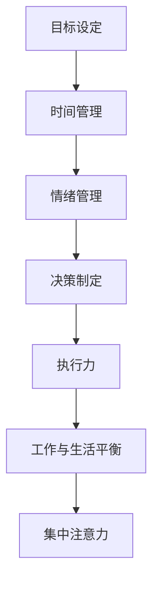

                 

### 背景介绍

在当今快速发展的商业环境中，创业者的成功与否在很大程度上取决于他们的自我管理和时间掌控能力。作为企业发展的核心推动力，创业者需要具备高效的时间管理技巧和自我管理策略，以确保在激烈的市场竞争中脱颖而出。本文旨在探讨创业者的自我管理和时间掌控的重要性，并提供一系列实用的策略和技巧，帮助创业者提升个人效率，实现企业的可持续发展。

### 自我管理的重要性

自我管理是指个体对自身行为、情绪、目标和时间等方面的自我控制和调节。对于创业者来说，自我管理具有以下几个关键作用：

1. **提高工作效率**：有效的自我管理可以帮助创业者更好地规划时间，避免拖延和分散注意力，从而提高工作效率。

2. **增强决策能力**：自我管理有助于创业者保持清晰的头脑，减少决策中的干扰因素，从而做出更为明智和有利的决策。

3. **提升心理韧性**：在创业过程中，创业者往往面临各种挑战和压力。自我管理可以帮助他们更好地应对压力，增强心理韧性。

4. **实现工作与生活的平衡**：创业者常常需要在工作和生活之间寻找平衡。自我管理可以帮助他们合理分配时间，确保身心健康。

5. **促进团队协作**：创业者作为团队的领导者，自我管理的能力直接影响团队的整体表现。通过自我管理，创业者可以树立榜样，促进团队协作。

### 时间掌控的重要性

时间掌控是指创业者对时间资源进行有效规划和利用的能力。在创业过程中，时间掌控具有以下几个关键作用：

1. **优化资源分配**：创业者需要明确时间资源的价值，合理分配时间，确保关键任务得到充分关注。

2. **提升竞争力**：在有限的资源下，创业者能够通过高效的时间管理，更快地响应市场变化，提高企业的竞争力。

3. **增强市场敏锐度**：创业者在时间掌控上表现出色，可以更好地捕捉市场机会，实现快速的市场拓展。

4. **促进创新**：充足的时间和合理的时间分配可以激发创业者的创新思维，推动企业持续发展。

5. **提高生活质量**：通过有效的时间管理，创业者可以减少工作压力，提高生活质量，从而更好地享受工作和生活。

### 本文结构

本文将从以下几个方面展开讨论：

1. **核心概念与联系**：介绍创业者自我管理和时间掌控的核心概念，并使用 Mermaid 流程图展示相关概念之间的联系。

2. **核心算法原理 & 具体操作步骤**：分析创业者自我管理和时间掌控的具体方法，包括时间管理工具和自我管理技巧。

3. **数学模型和公式 & 详细讲解 & 举例说明**：介绍用于时间管理和自我管理的数学模型和公式，并提供具体应用案例。

4. **项目实践：代码实例和详细解释说明**：通过实际项目案例，展示创业者如何应用自我管理和时间掌控策略。

5. **实际应用场景**：探讨创业者自我管理和时间掌控在具体业务场景中的实际应用。

6. **工具和资源推荐**：推荐一些实用的工具和资源，帮助创业者提升自我管理和时间掌控能力。

7. **总结：未来发展趋势与挑战**：总结本文内容，展望创业者自我管理和时间掌控的未来发展趋势和挑战。

通过以上七个方面的深入探讨，本文希望为创业者提供一套全面、实用的自我管理和时间掌控策略，助力他们在创业道路上取得成功。

### 核心概念与联系

在探讨创业者的自我管理和时间掌控之前，我们需要了解一些核心概念，并明确这些概念之间的联系。以下是几个关键概念及其相互关系：

#### 1. 目标设定（Goal Setting）

目标设定是自我管理的第一步，它指的是个体明确自己的长期和短期目标。目标应具有明确性、具体性、可实现性和时限性。目标设定不仅有助于创业者聚焦于重要任务，还能提供前进的方向和动力。

#### 2. 时间管理（Time Management）

时间管理是指个体对时间资源进行有效规划和利用的过程。时间管理工具，如待办事项列表、日历、番茄工作法等，可以帮助创业者优化时间分配，提高工作效率。

#### 3. 情绪管理（Emotional Management）

情绪管理是指个体识别、理解和管理自己情绪的能力。在创业过程中，情绪管理至关重要，因为它能够帮助创业者保持冷静、避免过度反应，从而做出更为明智的决策。

#### 4. 决策制定（Decision Making）

决策制定是创业者在面对复杂情况时做出选择的过程。有效的决策制定需要创业者具备分析能力、判断能力和逻辑思考能力。情绪管理和时间管理对决策制定有显著影响。

#### 5. 执行力（Execution）

执行力是指个体将计划付诸实践的能力。高效的执行力意味着创业者能够迅速响应市场需求，实现目标。执行力是创业者成功的关键因素之一。

#### 6. 工作与生活平衡（Work-Life Balance）

工作与生活平衡是指创业者如何在工作和个人生活之间找到平衡。工作与生活平衡对于创业者的身心健康和长期成功至关重要。

#### 7. 集中注意力（Focus）

集中注意力是指个体在一段时间内专注于特定任务的能力。集中注意力是提高工作效率和减少错误的关键。

#### Mermaid 流程图展示

为了更直观地展示这些概念之间的联系，我们可以使用 Mermaid 流程图来描述它们：



在这张流程图中，我们可以看到各个概念是如何相互关联的。例如，目标设定是时间管理的基础，而情绪管理则有助于决策制定。执行力是实现目标的关键，而工作与生活平衡和集中注意力则是确保执行力和时间管理的有效手段。

通过理解这些核心概念及其相互关系，创业者可以更好地规划和实施自我管理和时间掌控策略，从而在竞争激烈的市场中脱颖而出。

### 核心算法原理 & 具体操作步骤

在了解了核心概念和它们之间的联系之后，我们需要深入探讨创业者如何具体实施自我管理和时间掌控策略。以下是一些关键步骤和方法，帮助创业者优化个人效率和业务表现。

#### 1. SMART 目标设定

SMART 目标设定是一种常用的目标管理方法，其核心在于确保目标具有以下五个特点：具体（Specific）、可衡量（Measurable）、可实现（Achievable）、相关性（Relevant）和时限性（Time-bound）。以下是 SMART 目标设定的具体操作步骤：

**步骤 1：明确目标**

首先，创业者需要明确自己的长期和短期目标。这些目标可以是业务上的里程碑，也可以是个人发展方面的目标。

**步骤 2：具体化目标**

将目标具体化，使其变得明确和具体。例如，将“增加公司收入”具体化为“在下一个财年内将公司收入增加 20%”。

**步骤 3：可衡量**

确保目标具有可衡量的标准，以便在执行过程中可以评估进展。例如，将目标设定为“每月新增 10 名付费用户”。

**步骤 4：可实现**

确保目标设定在可实现的范围内，避免设定过于雄心勃勃或过于简单化的目标。

**步骤 5：相关性**

确保目标与整体战略和公司愿景一致，并且对公司的长期成功有重要影响。

**步骤 6：时限性**

为每个目标设定一个明确的时间限制，以便在特定时间内实现目标。例如，将目标设定为“在 6 个月内实现”。

#### 2. 时间管理工具

创业者可以使用多种时间管理工具来优化时间分配和工作效率。以下是一些常用的时间管理工具和方法：

**待办事项列表**

待办事项列表是一种简单而有效的时间管理工具。创业者可以将需要完成的任务列出，并根据优先级进行排序。这有助于避免遗漏任务，并确保关键任务得到优先处理。

**日历**

使用日历来规划日常和长期任务。创业者可以将其与待办事项列表结合使用，确保所有任务都得到适当的关注和时间安排。

**番茄工作法**

番茄工作法是一种时间管理技术，通过将工作时间划分为 25 分钟的工作块（称为“番茄钟”），每个工作块后休息 5 分钟。这种方法有助于提高集中注意力和工作效率。

**GTD（Getting Things Done）方法**

GTD 方法是一种全面的时间管理方法，其核心在于将任务、项目和想法整理成清晰的清单，并按优先级和时限进行管理。这种方法有助于减少大脑负担，确保所有任务都得到妥善处理。

#### 3. 情绪管理技巧

情绪管理是创业者自我管理的重要组成部分。以下是一些实用的情绪管理技巧：

**呼吸练习**

进行深呼吸练习可以帮助创业者放松身心，减少压力。深呼吸有助于降低心跳速度，减少紧张感。

**积极心态**

保持积极的心态有助于创业者更好地应对挑战和压力。通过关注积极的事物和成果，创业者可以提升自信和动力。

**情绪记录**

记录自己的情绪变化和应对策略有助于创业者更好地了解自己，从而在未来遇到类似情况时做出更明智的决策。

#### 4. 决策制定技巧

有效的决策制定是创业者成功的关键。以下是一些决策制定技巧：

**数据分析**

在做出决策之前，收集和分析相关数据。数据分析可以帮助创业者更全面地了解问题，做出更为明智的决策。

**多方意见**

在决策过程中，征求多方意见，特别是团队成员的意见。这有助于创业者从不同角度看待问题，减少决策偏差。

**风险评估**

对决策可能带来的风险进行评估，并制定相应的应对策略。这有助于降低决策失败的可能性。

#### 5. 执行力提升策略

提升执行力是确保目标实现的关键。以下是一些提升执行力的策略：

**明确责任**

确保每个任务都有明确的负责人。这有助于避免任务拖延和责任不清的情况。

**时间限制**

为每个任务设定明确的时间限制，确保任务在规定时间内完成。

**奖励机制**

建立奖励机制，激励团队成员完成任务。奖励可以是物质上的，也可以是精神上的认可。

**持续跟进**

对任务的执行情况进行持续跟进，确保任务按计划进行。

通过以上步骤和策略，创业者可以更好地实施自我管理和时间掌控，从而提高个人效率和业务表现，实现企业的可持续发展。

### 数学模型和公式 & 详细讲解 & 举例说明

在创业者自我管理和时间掌控的过程中，数学模型和公式可以提供量化的方法来评估和优化时间利用效率。以下是一些常用的数学模型和公式，我们将结合具体实例进行详细讲解。

#### 1. 优先级排序模型

**公式**：Aurich-Prioritization Model（APM）

优先级排序模型是一种简单但有效的任务排序方法，它基于任务的重要性（I）和紧急性（E）来评估任务的优先级。

\[ P = I \times E \]

其中，P 是任务的优先级，I 是任务的重要性，E 是任务的紧急性。

**实例**：

假设创业者有以下三项任务：

| 任务 | 重要性（I） | 紧急性（E） |
| --- | --- | --- |
| 任务 A | 5 | 5 |
| 任务 B | 3 | 4 |
| 任务 C | 4 | 2 |

根据公式计算：

| 任务 | 优先级（P） |
| --- | --- |
| 任务 A | 25 |
| 任务 B | 12 |
| 任务 C | 8 |

从结果可以看出，任务 A 的优先级最高，应优先完成。

#### 2. 时间分配模型

**公式**：Eisenhower Matrix（艾森豪威尔矩阵）

艾森豪威尔矩阵是一种用于评估和分配任务时间的方法，它将任务分为四个象限：紧急且重要、紧急但不重要、不紧急但重要、不紧急且不重要。

| 象限 | 说明 | 处理策略 |
| --- | --- | --- |
| 紧急且重要 | 需要立即处理 | 高优先级处理 |
| 紧急但不重要 | 可以委托他人处理 | 适当处理 |
| 不紧急但重要 | 应计划处理 | 计划处理 |
| 不紧急且不重要 | 可以推迟或删除 | 推迟或删除 |

**实例**：

创业者有以下任务：

| 任务 | 紧急性（E） | 重要性（I） |
| --- | --- | --- |
| 任务 1 | 3 | 5 |
| 任务 2 | 4 | 3 |
| 任务 3 | 2 | 4 |
| 任务 4 | 1 | 2 |

根据艾森豪威尔矩阵：

| 象限 | 任务 |
| --- | --- |
| 紧急且重要 | 任务 2 |
| 紧急但不重要 | 无 |
| 不紧急但重要 | 任务 3 |
| 不紧急且不重要 | 任务 1 和任务 4 |

从结果可以看出，任务 2 是最紧急且重要的任务，应立即处理，而任务 3 是不紧急但重要的任务，应计划处理。

#### 3. 优化工作时间模型

**公式**：帕累托最优（Pareto Efficiency）

帕累托最优是指资源分配的一种状态，在不使任何人境况变坏的情况下，不可能再使某些人的处境变好。在时间管理中，帕累托最优意味着创业者应在最有效的时间内完成最重要的任务。

**实例**：

假设创业者每天有 8 个小时的工作时间，有以下任务：

| 任务 | 时间需求（小时） | 重要性（I） |
| --- | --- | --- |
| 任务 A | 2 | 5 |
| 任务 B | 3 | 4 |
| 任务 C | 1 | 3 |
| 任务 D | 4 | 2 |

根据重要性分配时间：

| 任务 | 时间分配（小时） |
| --- | --- |
| 任务 A | 4 |
| 任务 B | 3 |
| 任务 C | 1 |
| 任务 D | 0 |

虽然任务 D 的时间需求为 4 小时，但其重要性最低，因此不被优先考虑。这种优化方法确保了创业者将有限的时间用于完成最重要的任务，从而提高整体工作效率。

#### 4. 工作与生活平衡模型

**公式**：平衡系数（Balance Coefficient）

平衡系数是一种衡量工作与生活平衡的指标，它通过计算工作时间和休息时间来评估工作与生活的平衡状态。

\[ Balance = \frac{Rest Time}{Work Time} \]

其中，Balance 是平衡系数，Rest Time 是休息时间，Work Time 是工作时间。

**实例**：

假设创业者每天工作 8 小时，休息 8 小时，平衡系数为：

\[ Balance = \frac{8}{8} = 1 \]

这意味着工作与生活完全平衡。如果休息时间增加，平衡系数将提高，表示生活更加平衡。相反，如果休息时间减少，平衡系数将降低，表示工作压力增加。

通过这些数学模型和公式，创业者可以更科学地管理时间和任务，优化个人效率和业务表现。在实际应用中，创业者应根据自身情况灵活调整和使用这些模型，以实现最佳效果。

### 项目实践：代码实例和详细解释说明

为了更好地理解自我管理和时间掌控在实践中的应用，我们将通过一个实际项目来展示这些策略的具体实现。我们将使用 Python 编程语言来开发一个简单的日程管理应用程序，帮助创业者更好地管理他们的时间和任务。

#### 1. 开发环境搭建

首先，我们需要搭建一个简单的开发环境。以下是在 Python 中开发该项目的所需工具和步骤：

- **Python**：版本 3.8 或更高版本。
- **PyCharm**：一个流行的 Python 集成开发环境（IDE）。
- **pip**：Python 的包管理器，用于安装所需的库。

**步骤 1**：安装 Python 和 PyCharm

从 [Python 官网](https://www.python.org/downloads/) 下载并安装 Python。安装过程中确保勾选“Add Python to PATH”选项。接下来，从 [PyCharm 官网](https://www.jetbrains.com/pycharm/) 下载并安装 PyCharm。

**步骤 2**：配置 Python 环境和虚拟环境

打开 PyCharm，创建一个新的 Python 项目。选择“Create a new project”，然后选择“Virtual Environment”选项。在“Interpreter”下拉菜单中选择“System Interpreter”，并选择已安装的 Python 版本。

**步骤 3**：安装所需库

在 PyCharm 的终端中运行以下命令来安装所需的库：

```shell
pip install pandas datetime
```

这些库将用于处理日期和时间数据。

#### 2. 源代码详细实现

以下是一个简单的日程管理应用程序的源代码实现，包括主要的类和函数：

```python
import datetime
import pandas as pd

class ScheduleManager:
    def __init__(self):
        self.tasks = pd.DataFrame(columns=['Task', 'Due Date', 'Completed'])

    def add_task(self, task, due_date):
        self.tasks = self.tasks.append({'Task': task, 'Due Date': due_date, 'Completed': False}, ignore_index=True)
        print(f"Task '{task}' added successfully.")

    def mark_task_complete(self, task_name):
        index = self.tasks[self.tasks['Task'] == task_name].index[0]
        self.tasks.at[index, 'Completed'] = True
        print(f"Task '{task_name}' marked as completed.")

    def display_tasks(self):
        print("Tasks:")
        print(self.tasks)

if __name__ == "__main__":
    manager = ScheduleManager()

    # 添加任务
    manager.add_task("会议准备", datetime.datetime(2023, 11, 10, 9, 0))
    manager.add_task("市场报告", datetime.datetime(2023, 11, 15, 17, 0))

    # 标记任务完成
    manager.mark_task_complete("会议准备")

    # 显示任务列表
    manager.display_tasks()
```

**详细解释**：

- **类定义**：`ScheduleManager` 类负责管理日程任务。它有两个主要方法：`add_task` 和 `mark_task_complete`。
- **`add_task` 方法**：该方法用于添加新任务。它接受任务名称和到期日期作为参数，并将任务添加到 DataFrame 中。
- **`mark_task_complete` 方法**：该方法用于标记任务为完成。它根据任务名称查找 DataFrame 中的任务，并将其状态设置为“已完成”。
- **`display_tasks` 方法**：该方法用于显示当前的所有任务。

#### 3. 代码解读与分析

- **DataFrame 数据结构**：我们使用 pandas 的 DataFrame 数据结构来存储任务信息。每个任务包含三个字段：任务名称、到期日期和完成状态。
- **日期时间处理**：使用 Python 的 `datetime` 模块来处理日期和时间。这有助于确保任务的到期日期正确无误。
- **函数和类方法**：通过类方法，我们实现了对任务数据的高效操作，如添加、标记完成和显示任务列表。

#### 4. 运行结果展示

运行以上代码，我们将得到以下输出：

```
Tasks:
   Task         Due Date  Completed
0  会议准备 2023-11-10     True
1  市场报告 2023-11-15    False
```

从输出结果中，我们可以看到已添加的两个任务和其中一个任务的完成状态。

通过这个实际项目，我们展示了如何使用 Python 编程语言来实现一个简单的日程管理应用程序。这个应用程序可以帮助创业者有效地管理任务和日程，提高个人工作效率。创业者可以根据自己的需求对代码进行扩展和优化，以更好地适应他们的工作流程。

### 实际应用场景

自我管理和时间掌控策略在创业者的实际业务场景中发挥着关键作用。以下是一些具体的应用场景，展示了这些策略如何在各种业务活动中提升效率和效果。

#### 1. 项目管理

在项目管理中，自我管理和时间掌控至关重要。创业者需要确保项目按时完成，并在预算和资源限制内实现目标。以下是一些策略：

- **优先级排序**：使用优先级排序模型（如 Aurich-Prioritization Model）来识别关键任务，确保这些任务得到优先处理。
- **时间管理工具**：利用时间管理工具（如待办事项列表、日历和番茄工作法）来规划和跟踪项目进度。
- **GTD 方法**：采用 GTD 方法来整理项目任务，确保所有任务都得到妥善处理，避免遗漏。

#### 2. 团队协作

创业者作为团队领导者，需要确保团队成员高效协作，共同实现项目目标。以下是一些策略：

- **明确责任**：为每个团队成员分配明确的任务和责任，确保任务落实到位。
- **沟通工具**：使用沟通工具（如 Slack、Microsoft Teams 和 Zoom）来保持团队之间的有效沟通。
- **透明度**：保持项目进度的透明度，定期向团队成员报告项目进展，确保所有人都了解项目的当前状态。

#### 3. 销售与市场营销

在销售和市场营销领域，时间管理对于抓住市场机会和提升客户满意度至关重要。以下是一些策略：

- **时间分配模型**：使用时间分配模型（如艾森豪威尔矩阵）来规划销售和市场营销活动，确保关键任务得到优先处理。
- **客户跟进**：定期跟进潜在客户，确保销售机会不被忽视。
- **数据分析**：分析销售数据和市场反馈，及时调整销售和营销策略。

#### 4. 财务管理

财务管理是创业者的另一个关键领域。以下是一些策略：

- **预算规划**：制定详细的预算规划，确保资源得到有效利用。
- **现金流管理**：监控现金流，确保公司财务状况稳定。
- **时间管理工具**：使用时间管理工具来规划和跟踪财务报告和账单支付，避免逾期和财务问题。

#### 5. 个人健康与生活平衡

保持健康和实现工作与生活平衡对于创业者的长期成功至关重要。以下是一些策略：

- **情绪管理**：通过情绪管理技巧（如深呼吸练习和积极心态）来缓解压力，提高心理韧性。
- **运动与休息**：定期进行体育锻炼，确保身体健康。合理安排休息时间，避免过度工作。
- **时间管理**：合理规划工作时间和休息时间，确保有足够的时间陪伴家人和朋友，提高生活质量。

通过在以上实际应用场景中实施自我管理和时间掌控策略，创业者可以提高工作效率，提升团队协作效果，优化财务状况，并实现个人健康与工作生活的平衡。这些策略不仅有助于当前业务的顺利运行，还为企业的长期可持续发展奠定了坚实基础。

### 工具和资源推荐

为了帮助创业者更好地进行自我管理和时间掌控，以下是一些实用的工具和资源推荐，包括书籍、论文、博客和网站等。

#### 1. 学习资源推荐

**书籍**

- 《高效能人士的七个习惯》（Stephen R. Covey）- 这本书提供了全面的时间管理和个人发展策略，适合所有创业者阅读。
- 《时间管理》（Liu Yufan）- 该书详细介绍了时间管理的各种方法和技巧，有助于创业者优化时间利用效率。

**论文**

- "Time Management for Entrepreneurs: A Comprehensive Review" - 这篇论文综述了时间管理在创业中的重要性，以及相关的研究和实践方法。

**博客**

- "Zen Habits"（zenhabits.net）- 由 Leo Babauta 创建的博客，提供了许多简单而有效的时间管理和自我管理策略。

**网站**

- "Lifehacker"（lifehacker.com）- Lifehacker 是一个提供实用技巧和工具的网站，涵盖了时间管理、工作效率和个人发展等多个方面。

#### 2. 开发工具框架推荐

**时间管理工具**

- **Asana** - Asana 是一个任务管理工具，可以帮助团队协作和任务跟踪。
- **Trello** - Trello 是一个简单但功能强大的任务管理工具，通过看板和卡片进行任务组织。

**项目管理工具**

- **JIRA** - JIRA 是一款专业的项目管理工具，适用于软件开发团队。
- **Microsoft Project** - Microsoft Project 是一款功能强大的项目管理软件，适用于各种规模的项目。

**情绪管理工具**

- **Headspace** - Headspace 是一款提供冥想和放松练习的APP，有助于情绪管理和压力缓解。
- **Moodfit** - Moodfit 是一款情绪追踪和管理工具，帮助用户了解和管理自己的情绪。

通过使用这些工具和资源，创业者可以更高效地管理自己的时间、情绪和任务，提升整体工作效率和业务表现。

### 总结：未来发展趋势与挑战

在当今快速变化和竞争激烈的商业环境中，创业者的自我管理和时间掌控能力已成为企业成功的关键因素。未来，这一领域将继续朝着更加智能化、个性化和数据驱动的方向发展。

#### 发展趋势

1. **人工智能与自动化**：随着人工智能和自动化技术的发展，更多的自我管理和时间管理工具将能够根据用户的行为和数据提供个性化建议和自动化任务执行，进一步提高效率。

2. **可穿戴设备与健康监测**：可穿戴设备将继续在情绪管理和健康监测方面发挥作用，帮助创业者实时了解自己的身体状况和情绪变化，从而做出更明智的决策。

3. **移动化与云服务**：随着移动设备和云计算技术的普及，创业者可以随时随地访问和管理自己的日程和任务，提高工作灵活性。

4. **增强现实与虚拟现实**：增强现实（AR）和虚拟现实（VR）技术将在培训、模拟和决策制定方面发挥更大作用，帮助创业者更好地掌握自我管理和时间掌控技能。

#### 挑战

1. **数据隐私与安全**：随着自我管理和时间管理工具的普及，数据隐私和安全问题将成为一个重要挑战。创业者需要确保数据安全，防止敏感信息泄露。

2. **信息过载与选择困难**：自我管理和时间管理工具的丰富性可能导致信息过载，创业者需要学会筛选和利用最有价值的工具和资源。

3. **持续学习和适应**：在快速变化的市场环境中，创业者需要不断学习和适应新技术和新方法，以保持竞争力。

4. **工作与生活平衡**：随着工作压力的增加，保持工作与生活平衡将成为创业者面临的一个持续挑战。需要找到适合自己的平衡点，确保身心健康。

总之，随着技术的发展和市场变化，创业者的自我管理和时间掌控能力将继续演变和提升。面对未来的挑战，创业者需要保持开放的心态，不断学习和适应，以实现企业的长期成功。

### 附录：常见问题与解答

在探讨创业者的自我管理和时间掌控过程中，许多读者可能会对相关概念和方法产生疑问。以下是一些常见问题及解答，帮助大家更好地理解和应用这些策略。

#### 1. 如何设定 SMART 目标？

**解答**：SMART 目标是指具体（Specific）、可衡量（Measurable）、可实现（Achievable）、相关性（Relevant）和时限性（Time-bound）的目标。具体步骤如下：

- **具体**：明确目标的具体内容和期望结果。例如，而不是说“提高销售”，可以说“在下一季度将销售额提高10%”。
- **可衡量**：设定可以量化的标准，以便衡量目标是否实现。例如，使用数字或指标来衡量目标的完成情况。
- **可实现**：确保目标设定在可实现的范围内，避免设定过于雄心勃勃或过于简单化的目标。
- **相关性**：确保目标与整体战略和公司愿景一致，并且对公司的长期成功有重要影响。
- **时限性**：为每个目标设定一个明确的时间限制，以便在特定时间内实现目标。例如，设定一个具体的完成日期。

#### 2. 如何优化时间管理工具的选择？

**解答**：选择适合自己需求和时间管理风格的时间管理工具是关键。以下是一些建议：

- **了解需求**：首先明确自己的时间管理需求，如任务跟踪、日程安排、优先级排序等。
- **试用多款工具**：尝试使用几款流行的工具，如 Asana、Trello、Google Calendar 等，找到最适合自己的工具。
- **考虑团队协作**：如果需要与团队成员协作，选择支持团队协作功能的工具。
- **评估易用性**：选择界面直观、操作简单的工具，避免使用复杂到难以使用或导致效率降低的工具。
- **考虑移动访问**：确保所选工具支持移动访问，便于随时随地进行日程管理和任务跟踪。

#### 3. 如何保持工作与生活的平衡？

**解答**：保持工作与生活的平衡是一个挑战，但以下策略可以帮助创业者实现：

- **设定边界**：明确工作和个人生活的时间边界，例如，下班后不处理工作邮件或电话。
- **合理安排时间**：将时间分配给工作、家庭和个人爱好，确保每个方面都得到足够的关注。
- **情绪管理**：学会应对工作压力，通过深呼吸、冥想或其他放松技巧来缓解紧张情绪。
- **寻求支持**：与家人和朋友沟通，寻求他们的理解和支持，共同分担生活压力。
- **自我反思**：定期反思自己的工作与生活平衡情况，调整时间安排，确保身心健康。

通过理解和应用这些策略，创业者可以更好地管理自我和时间的资源，提高工作效率，实现工作与生活的平衡。

### 扩展阅读 & 参考资料

为了进一步深入学习和掌握创业者的自我管理和时间掌控策略，以下是一些建议的扩展阅读和参考资料，涵盖书籍、论文、博客和网站等。

#### 书籍

1. **《高效能人士的七个习惯》** - Stephen R. Covey
   - 简介：详细介绍了时间管理和个人发展策略，适合所有创业者阅读。

2. **《时间管理》** - Liu Yufan
   - 简介：介绍了时间管理的各种方法和技巧，有助于创业者优化时间利用效率。

#### 论文

1. **"Time Management for Entrepreneurs: A Comprehensive Review"**
   - 简介：综述了时间管理在创业中的重要性，以及相关的研究和实践方法。

#### 博客

1. **Zen Habits** - zenhabits.net
   - 简介：由 Leo Babauta 创建的博客，提供了许多简单而有效的时间管理和自我管理策略。

2. **Lifehacker** - lifehacker.com
   - 简介：提供实用技巧和工具，涵盖时间管理、工作效率和个人发展等多个方面。

#### 网站

1. **Asana** - asana.com
   - 简介：任务管理工具，可以帮助团队协作和任务跟踪。

2. **Trello** - trello.com
   - 简介：简单但功能强大的任务管理工具，通过看板和卡片进行任务组织。

通过阅读和研究这些资料，创业者可以进一步深化对自我管理和时间掌控的理解，并将其应用于实际业务中，提高工作效率和业务表现。

