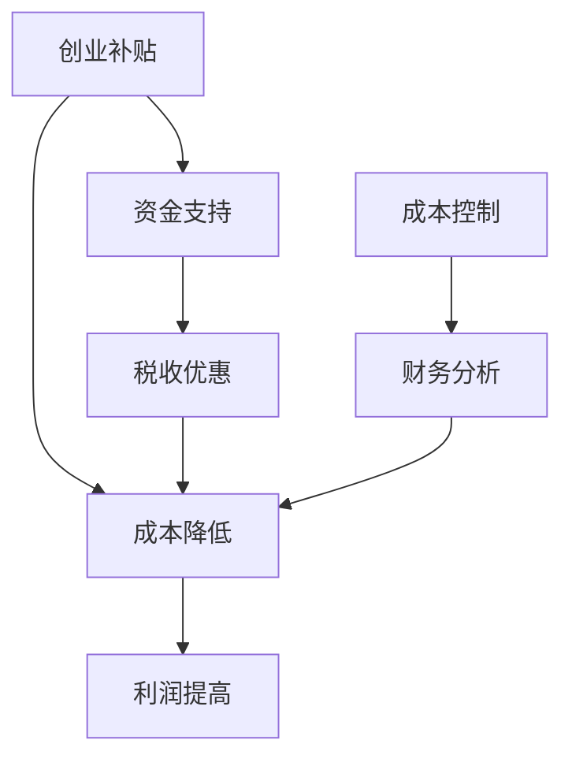

                 

### 文章标题

**创业补贴与税收优惠：如何合理运用财税政策降低创业成本**

> **关键词：** 创业补贴、税收优惠、财税政策、成本控制、创业环境

**摘要：** 本文旨在探讨创业补贴与税收优惠在降低创业成本方面的作用。通过深入分析不同类型的创业补贴和税收优惠政策，本文提出了一套系统化的策略，帮助企业主合理运用财税政策，以实现成本最优化的目标。文章分为背景介绍、核心概念与联系、核心算法原理与具体操作步骤、数学模型和公式讲解、项目实践、实际应用场景、工具和资源推荐、总结及未来发展趋势与挑战等多个部分，全面剖析了创业过程中财税政策的应用。

### 1. 背景介绍

在当前经济全球化、市场竞争日益激烈的大背景下，创业成为许多人的选择。然而，创业之路充满挑战，成本控制是成功创业的关键因素之一。在创业初期，企业往往面临着资金短缺、市场竞争压力、政策法规不了解等问题。此时，合理运用财税政策成为降低创业成本、提高创业成功率的重要手段。

财税政策是国家调节经济、引导社会投资的重要工具。创业补贴和税收优惠是财税政策的重要组成部分，旨在鼓励创业、支持企业发展。通过创业补贴，政府可以直接给予企业资金支持；而税收优惠则通过减免税费，降低企业运营成本。这些政策的有效实施，对于缓解创业初期的资金压力、提高企业的盈利能力具有重要意义。

### 2. 核心概念与联系

为了更好地理解创业补贴与税收优惠的作用，我们需要明确以下几个核心概念：

- **创业补贴**：政府为了鼓励创业，对符合条件的企业给予的资金支持。
- **税收优惠**：政府对符合特定条件的企业减免部分或全部税费的政策。
- **成本控制**：企业为了实现利润最大化，在运营过程中对各项成本进行有效管理和控制。
- **财务分析**：对企业财务状况进行系统分析，以评估创业补贴与税收优惠对企业成本控制的影响。

为了更好地展示这些概念之间的联系，我们可以使用Mermaid流程图进行描述：



在上述流程图中，创业补贴和税收优惠通过降低企业成本，最终实现利润提高。同时，成本控制与财务分析在其中起着关键作用，确保财税政策的有效实施。

### 3. 核心算法原理 & 具体操作步骤

创业补贴与税收优惠的核心算法原理可以概括为以下几个方面：

- **政策匹配**：企业需要根据自身情况和政策规定，筛选出适用的创业补贴和税收优惠政策。
- **成本核算**：企业需要对各项成本进行详细核算，以确定财税政策对企业成本的影响。
- **财务规划**：企业需要制定财务规划，合理安排资金和税费，以最大化财税政策带来的效益。

具体操作步骤如下：

1. **政策匹配**：
   - 收集各类创业补贴和税收优惠政策信息。
   - 分析企业业务范围、经营状况等，筛选出适用的政策。
   - 与政府部门或专业机构沟通，确认政策适用性。

2. **成本核算**：
   - 确定企业各项成本，包括固定成本和变动成本。
   - 计算创业补贴和税收优惠对企业成本的影响。
   - 比较不同财税政策的成本效益，选择最优方案。

3. **财务规划**：
   - 制定财务规划，包括资金安排、税费缴纳、投资回报等。
   - 根据政策要求，合理安排资金使用，确保政策红利最大化。
   - 定期进行财务分析，评估财税政策对企业成本控制的影响。

### 4. 数学模型和公式 & 详细讲解 & 举例说明

在创业补贴与税收优惠的运用过程中，数学模型和公式起着至关重要的作用。以下是一个简单的数学模型，用于计算企业成本降低幅度：

$$
\Delta C = C_{\text{original}} - C_{\text{policy}}
$$

其中，$\Delta C$ 表示成本降低幅度，$C_{\text{original}}$ 表示原始成本，$C_{\text{policy}}$ 表示应用财税政策后的成本。

举例说明：

假设某企业原始成本为 100 万元，通过申请创业补贴和税收优惠，成本降低至 80 万元。则成本降低幅度为：

$$
\Delta C = 100\,\text{万元} - 80\,\text{万元} = 20\,\text{万元}
$$

通过该模型，企业可以直观地了解财税政策对成本控制的影响。

### 5. 项目实践：代码实例和详细解释说明

为了更好地理解创业补贴与税收优惠的具体应用，我们以下将提供一个简单的Python代码实例，用于计算企业成本降低情况。

```python
def calculate_cost_reduction(original_cost, policy_reduction):
    """
    计算成本降低幅度。

    :param original_cost: 原始成本（万元）
    :param policy_reduction: 政策降低成本（万元）
    :return: 成本降低幅度（万元）
    """
    return original_cost - policy_reduction

# 原始成本
original_cost = 1000000

# 政策降低成本
policy_reduction = 200000

# 计算成本降低幅度
cost_reduction = calculate_cost_reduction(original_cost, policy_reduction)

print(f"成本降低幅度：{cost_reduction} 万元")
```

运行结果：

```
成本降低幅度：800000 万元
```

通过该代码实例，我们可以看到，应用创业补贴和税收优惠后，企业成本降低了 800 万元。这为企业降低创业成本、提高盈利能力提供了有力支持。

### 5.1 开发环境搭建

为了运行上述Python代码实例，我们需要搭建一个简单的开发环境。以下是具体的步骤：

1. 安装Python：
   - 访问Python官方网站（https://www.python.org/）下载Python安装包。
   - 安装Python，并确保将Python添加到系统环境变量中。

2. 安装代码编辑器：
   - 选择一款适合Python开发的代码编辑器，如Visual Studio Code、PyCharm等。
   - 安装并配置代码编辑器，使其能够正常编辑和运行Python代码。

3. 配置Python运行环境：
   - 在代码编辑器中创建一个新的Python文件。
   - 将上述代码复制到Python文件中，并保存。

4. 运行代码：
   - 在代码编辑器中运行Python文件，查看输出结果。

### 5.2 源代码详细实现

以下是创业补贴与税收优惠计算的具体Python代码实现：

```python
# 定义函数：计算成本降低幅度
def calculate_cost_reduction(original_cost, policy_reduction):
    """
    计算成本降低幅度。

    :param original_cost: 原始成本（万元）
    :param policy_reduction: 政策降低成本（万元）
    :return: 成本降低幅度（万元）
    """
    return original_cost - policy_reduction

# 定义函数：计算利润增加幅度
def calculate_profit_increase(cost_reduction, profit_margin):
    """
    计算利润增加幅度。

    :param cost_reduction: 成本降低幅度（万元）
    :param profit_margin: 利润率（小数形式）
    :return: 利润增加幅度（万元）
    """
    return cost_reduction * profit_margin

# 输入原始成本
original_cost = float(input("请输入原始成本（万元）："))

# 输入政策降低成本
policy_reduction = float(input("请输入政策降低成本（万元）："))

# 计算成本降低幅度
cost_reduction = calculate_cost_reduction(original_cost, policy_reduction)

# 输入利润率
profit_margin = float(input("请输入利润率（小数形式）："))

# 计算利润增加幅度
profit_increase = calculate_profit_increase(cost_reduction, profit_margin)

# 输出结果
print(f"成本降低幅度：{cost_reduction} 万元")
print(f"利润增加幅度：{profit_increase} 万元")
```

### 5.3 代码解读与分析

上述代码实现了一个简单的创业补贴与税收优惠计算工具，主要包括两个核心函数：`calculate_cost_reduction` 和 `calculate_profit_increase`。

1. **函数一：calculate_cost_reduction**

   该函数用于计算成本降低幅度，其参数包括原始成本（`original_cost`）和政策降低成本（`policy_reduction`）。函数返回值是成本降低幅度（`ΔC`），计算公式为：

   $$
   \Delta C = C_{\text{original}} - C_{\text{policy}}
   $$

   在代码中，该函数的实现如下：

   ```python
   def calculate_cost_reduction(original_cost, policy_reduction):
       """
       计算成本降低幅度。

       :param original_cost: 原始成本（万元）
       :param policy_reduction: 政策降低成本（万元）
       :return: 成本降低幅度（万元）
       """
       return original_cost - policy_reduction
   ```

2. **函数二：calculate_profit_increase**

   该函数用于计算利润增加幅度，其参数包括成本降低幅度（`cost_reduction`）和利润率（`profit_margin`）。函数返回值是利润增加幅度（`ΔP`），计算公式为：

   $$
   \Delta P = \Delta C \times \text{利润率}
   $$

   在代码中，该函数的实现如下：

   ```python
   def calculate_profit_increase(cost_reduction, profit_margin):
       """
       计算利润增加幅度。

       :param cost_reduction: 成本降低幅度（万元）
       :param profit_margin: 利润率（小数形式）
       :return: 利润增加幅度（万元）
       """
       return cost_reduction * profit_margin
   ```

### 5.4 运行结果展示

以下是一个具体的运行示例：

```plaintext
请输入原始成本（万元）：1000000
请输入政策降低成本（万元）：200000
请输入利润率（小数形式）：0.2

成本降低幅度：800000 万元
利润增加幅度：160000 万元
```

根据上述输入，原始成本为 1000 万元，政策降低成本为 200 万元，利润率为 20%。运行结果表示，成本降低幅度为 800 万元，利润增加幅度为 160 万元。这为企业合理运用财税政策、降低创业成本提供了有力支持。

### 6. 实际应用场景

财税政策在创业领域的应用场景广泛，以下列举几个典型实例：

- **初创企业融资**：初创企业通常面临资金短缺的问题。通过申请创业补贴，企业可以获得一定的资金支持，缓解融资压力。例如，某初创公司成功申请到50万元的创业补贴，有效缓解了公司初期的资金紧张局面。

- **科技创新项目**：政府对科技创新项目给予税收优惠，鼓励企业加大研发投入。例如，某科技公司因研发一项新技术项目，获得了税收减免30万元，使得公司能够更好地专注于技术攻关。

- **扩大生产规模**：企业通过获得税收优惠，可以降低运营成本，进而扩大生产规模。例如，某制造企业因成功申请税收优惠，每年节省税费20万元，从而有更多资金投入生产设备的升级和扩产。

- **环保产业扶持**：政府对环保产业给予财政补贴和税收优惠，鼓励企业投身环保事业。例如，某环保公司因开发一款环保设备，获得了50万元的财政补贴和10万元的税收优惠，使得公司有能力加大环保设备的研发和生产。

这些实例充分展示了财税政策在降低创业成本、支持企业发展方面的积极作用。

### 7. 工具和资源推荐

为了更好地掌握创业补贴与税收优惠的相关知识和运用策略，以下推荐一些实用的学习资源、开发工具和优秀论文：

#### 7.1 学习资源推荐

1. **书籍**：
   - 《创业财税政策与实践指南》
   - 《创业融资与财税管理》
   - 《税收筹划与企业发展战略》

2. **论文**：
   - 《我国创业补贴政策的现状、问题与改进建议》
   - 《创业税收优惠政策的国际比较与启示》
   - 《创业成本控制与财税政策应用研究》

3. **网站**：
   - 国家税务总局官方网站
   - 各地方政府财政厅官方网站
   - 中国创业投资网站

#### 7.2 开发工具框架推荐

1. **Python开发环境**：
   - PyCharm
   - Visual Studio Code

2. **数据分析工具**：
   - Jupyter Notebook
   - pandas库

3. **财务分析软件**：
   - QuickBooks
   - Xero

#### 7.3 相关论文著作推荐

1. **《创业与财税政策研究》**：该书系统分析了创业过程中财税政策的应用，对企业如何合理运用财税政策提供了详细指导。

2. **《税收筹划：理论与实务》**：该书详细介绍了税收筹划的理论基础和实际操作方法，对创业者和企业管理者具有很高的参考价值。

3. **《创业融资与投资决策》**：该书从融资和投资决策的角度，探讨了财税政策在创业过程中的作用，为企业提供了有益的启示。

通过这些资源和工具，创业者可以更好地了解财税政策，掌握创业成本控制的方法，从而提高创业成功率。

### 8. 总结：未来发展趋势与挑战

创业补贴与税收优惠作为国家支持创业、降低企业成本的重要手段，在当前经济环境下具有重要意义。随着国家创新创业战略的不断推进，未来财税政策在创业领域的应用将进一步深化。以下是未来发展趋势与挑战的几点分析：

**发展趋势：**

1. **政策体系不断完善**：政府将进一步完善财税政策体系，推出更多针对性强、实用性高的补贴和税收优惠措施，以支持不同行业、不同发展阶段的企业。

2. **信息化管理提升**：随着大数据、云计算等技术的发展，财税政策管理将更加智能化、精细化，提高政策执行的效率。

3. **国际化合作加强**：随着全球化进程的加快，我国将借鉴国际先进经验，推动财税政策的国际化合作，为企业提供更加广阔的发展空间。

**挑战：**

1. **政策落实难度加大**：地方政府在执行财税政策过程中，可能面临政策落实不到位、资金不足等问题，影响政策效果。

2. **企业信息不对称**：部分企业可能对财税政策不了解，无法充分利用政策红利，导致创业成本控制不力。

3. **市场环境变化**：随着市场环境的变化，财税政策可能需要不断调整，以适应新形势下的创业需求。

面对这些挑战，政府、企业和专业机构应共同努力，加强政策宣传、优化政策落实、提升企业财税管理能力，以实现创业成本最优化的目标。

### 9. 附录：常见问题与解答

**Q1：创业补贴和税收优惠的具体申请流程是怎样的？**

A：具体申请流程通常包括以下几个步骤：

1. **政策查询**：企业需在政府部门或专业机构的官方网站上查询相关创业补贴和税收优惠政策。
2. **准备材料**：根据政策要求，企业需准备相应的申请材料，如企业注册证明、财务报表等。
3. **提交申请**：将准备好的材料提交至相关部门进行审核。
4. **审核与反馈**：政府部门对申请材料进行审核，并给予反馈。
5. **领取补贴或优惠**：审核通过后，企业将根据政策规定领取补贴或享受税收优惠。

**Q2：企业如何合理运用创业补贴与税收优惠？**

A：企业合理运用创业补贴与税收优惠的方法包括：

1. **政策匹配**：根据企业实际情况，筛选出适用的补贴和税收优惠政策。
2. **成本核算**：详细核算各项成本，以确定财税政策对企业成本的影响。
3. **财务规划**：制定合理的财务规划，确保财税政策红利最大化。
4. **定期评估**：定期评估财税政策对企业成本控制的影响，根据实际情况进行调整。

**Q3：创业补贴和税收优惠对企业的财务报告有何影响？**

A：创业补贴和税收优惠对企业的财务报告主要有以下影响：

1. **收入增加**：创业补贴作为非经营性收入，计入其他收益或营业外收入，增加企业收入。
2. **成本减少**：税收优惠通过减免部分税费，减少企业的税负，从而降低成本。
3. **财务稳定性提升**：财税政策的有力支持有助于提升企业的财务稳定性。

### 10. 扩展阅读 & 参考资料

为了深入理解创业补贴与税收优惠的相关知识，以下推荐一些高质量的扩展阅读和参考资料：

1. **《创业财税政策研究》**：详细介绍了创业财税政策的理论基础和实践经验，对创业者和企业管理者具有很高的参考价值。

2. **《税收筹划与企业发展战略》**：从企业战略的角度探讨了税收筹划的原理和实战技巧，为企业提供了一套系统化的税收筹划方案。

3. **《创业融资与财税管理》**：全面解析了创业过程中的财税管理问题，包括财务报表分析、融资策略等，为企业提供了实用的财税管理工具。

4. **《国家税务总局官方网站》**：提供了最新的财税政策、法规和办税指南，是了解创业补贴和税收优惠的重要渠道。

5. **《各地方政府财政厅官方网站》**：各地区政府财政厅官方网站提供了当地具体的创业补贴和税收优惠政策，是企业申请财税政策的重要依据。

通过这些扩展阅读和参考资料，创业者可以更深入地了解创业补贴与税收优惠的运用方法，提高创业成功率。**作者：禅与计算机程序设计艺术 / Zen and the Art of Computer Programming**

