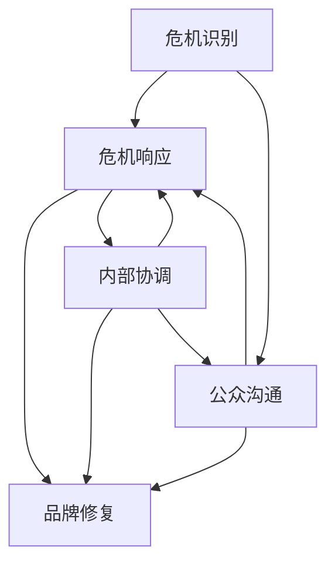

                 

### 背景介绍

#### 市场环境与挑战

在全球化和信息化的背景下，创业公司的数量急剧增加，创业市场日益繁荣。然而，随着竞争的加剧，创业公司面临的风险也在不断上升，其中之一便是负面事件的危机公关。负面事件可能源自内部管理问题、外部市场压力、甚至是竞争对手的恶意攻击。如何有效应对这些负面事件，成为创业公司在成长过程中必须面对的严峻挑战。

#### 创业公司的脆弱性

创业公司相较于成熟企业，往往更加脆弱。这主要体现在以下几个方面：

1. **资源限制**：创业公司通常在资金、人才、技术等方面相对有限，这使得它们在面对突发事件时，缺乏足够的应对能力。
2. **品牌知名度低**：新创立的公司在市场上缺乏广泛的品牌认知度，一旦发生负面事件，容易导致公众信任度下降。
3. **管理体系不健全**：许多创业公司在管理体系上还不够完善，内部沟通和协调可能不够顺畅，增加了危机发生的概率。

#### 负面事件的影响

负面事件对创业公司的影响是多方面的，包括：

1. **财务损失**：负面事件可能导致公司股价下跌、客户流失，进而影响公司的财务状况。
2. **声誉受损**：负面报道和负面信息可能迅速传播，对公司的社会形象和声誉造成严重损害。
3. **业务中断**：某些负面事件可能导致公司业务运营的中断，甚至威胁到公司的生存。

#### 需要有效的危机公关策略

鉴于上述挑战和影响，创业公司必须具备一套有效的危机公关策略，以应对可能出现的负面事件。这不仅关乎公司的短期生存，更关系到公司的长期发展。有效的危机公关策略应包括事前的预防措施、事中的应对策略和事后的修复措施。本文将深入探讨创业公司在危机公关中的应对策略和最佳实践。

## 2. 核心概念与联系

在深入探讨创业公司的危机公关策略之前，我们首先需要明确一些核心概念，并理解它们之间的内在联系。这些概念包括危机识别、危机响应、品牌修复和公众沟通等。

#### 2.1 危机识别

危机识别是危机公关的第一步，它涉及到对潜在危机的预判和识别。创业公司需要建立一套完善的危机预警机制，通过实时监控市场动态、客户反馈和内部报告，及时发现可能引发负面事件的信号。

#### 2.2 危机响应

危机响应是指在公司遭遇负面事件时，迅速采取有效措施进行应对。这包括立即启动危机管理团队、制定应对策略、公开透明地处理问题等。危机响应的及时性和有效性直接关系到危机的扩散程度和公司的声誉。

#### 2.3 品牌修复

品牌修复是危机公关的核心目标之一，它涉及到如何在危机过后恢复公众对公司的信任。这需要公司采取一系列积极措施，包括公开道歉、改进产品和服务、加强与客户的沟通等。

#### 2.4 公众沟通

公众沟通是危机公关中至关重要的一环，它涉及到如何与外部公众进行有效的沟通和互动。公司需要通过多种渠道，如媒体发布、社交网络、客户服务热线等，及时回应公众关切，传递正面信息。

#### 2.5 内部协调

内部协调是危机公关中容易被忽视但至关重要的一个方面。在公司内部，各个部门需要紧密协作，共同应对危机。有效的内部协调可以确保信息的快速传递和资源的合理分配，从而提高危机响应的效率。

#### 2.6 相关概念之间的联系

这些核心概念之间存在着紧密的联系。危机识别是危机响应的前提，而危机响应的成功与否直接影响到品牌修复的效果。公众沟通则是危机管理的持续过程，贯穿于危机识别、危机响应和品牌修复的各个阶段。内部协调则是保障上述各个环节顺利运行的基础。

为了更好地理解这些核心概念之间的联系，我们可以使用Mermaid流程图进行展示：



通过这个流程图，我们可以清晰地看到各个核心概念之间的交互和依赖关系。

## 3. 核心算法原理 & 具体操作步骤

#### 3.1 危机公关算法原理

危机公关算法的核心目标是最大化危机响应的效率，同时最小化危机对公司声誉和财务的负面影响。算法的基本原理可以概括为以下四个步骤：

1. **危机识别**：通过实时数据采集和分析，识别潜在危机信号。
2. **危机评估**：对危机的影响程度进行评估，确定危机等级。
3. **危机响应**：根据危机等级，采取相应的应对措施。
4. **危机监控**：在危机处理过程中，持续监控危机的发展和应对措施的效果。

#### 3.2 具体操作步骤

以下是危机公关的具体操作步骤：

1. **危机识别**：

   - **数据采集**：从各种渠道（如社交媒体、新闻媒体、客户反馈等）收集信息。
   - **数据预处理**：对收集到的数据进行清洗和筛选，提取有用的信息。
   - **特征提取**：使用自然语言处理技术（如文本分类、情感分析等）提取危机特征。
   - **危机信号检测**：使用机器学习模型（如决策树、神经网络等）检测潜在的危机信号。

2. **危机评估**：

   - **影响评估**：对危机可能带来的影响（如财务损失、声誉损害等）进行量化评估。
   - **紧急程度评估**：根据危机的影响程度和紧急程度，对危机进行等级划分。
   - **风险评估**：对危机的风险进行综合评估，为后续的危机响应提供决策依据。

3. **危机响应**：

   - **启动危机管理团队**：迅速组织危机管理团队，确保各部门的协调和协作。
   - **制定应对策略**：根据危机评估结果，制定具体的应对策略。
   - **实施应对措施**：迅速采取行动，执行制定的应对策略。
   - **信息发布**：通过官方渠道（如新闻发布、社交媒体等）发布相关信息，确保信息的公开透明。

4. **危机监控**：

   - **实时监控**：在危机处理过程中，持续监控危机的发展和应对措施的效果。
   - **反馈机制**：建立反馈机制，收集公众和客户的反馈，及时调整应对策略。
   - **效果评估**：在危机处理后，对应对措施的效果进行评估，总结经验教训。

#### 3.3 实例分析

以一家新兴科技公司为例，该公司在市场推广一款新产品时，发现部分用户反馈产品存在严重质量问题。以下是危机公关的具体操作步骤：

1. **危机识别**：

   - **数据采集**：从社交媒体、新闻媒体和客户反馈中收集有关产品问题的信息。
   - **数据预处理**：筛选出与产品问题相关的重要信息。
   - **特征提取**：使用情感分析技术提取用户对产品问题的情绪特征。
   - **危机信号检测**：通过机器学习模型检测到高频率的负面反馈，确认存在潜在危机。

2. **危机评估**：

   - **影响评估**：估计产品质量问题可能导致大量用户流失，对公司财务和声誉造成严重损害。
   - **紧急程度评估**：由于问题影响较大，危机等级被划分为“高级”。
   - **风险评估**：综合考虑风险因素，确定需要立即采取应对措施。

3. **危机响应**：

   - **启动危机管理团队**：公司高层迅速组织危机管理团队，包括技术、市场、客服等部门。
   - **制定应对策略**：决定立即召回有问题的产品，并对受影响的用户进行补偿。
   - **实施应对措施**：发布官方声明，说明产品质量问题，表示将采取积极措施解决问题。
   - **信息发布**：通过官方网站、社交媒体等渠道发布召回通知，确保信息的公开透明。

4. **危机监控**：

   - **实时监控**：持续监控社交媒体和新闻媒体的反馈，收集用户对召回措施的反馈。
   - **反馈机制**：建立用户反馈机制，收集用户对召回和补偿措施的满意度。
   - **效果评估**：在召回和补偿措施实施后，对措施的效果进行评估，总结经验教训，防止类似事件再次发生。

通过上述操作步骤，该科技公司在危机管理中有效地控制了负面影响的扩散，并迅速恢复了公众的信任。

### 4. 数学模型和公式 & 详细讲解 & 举例说明

在危机公关策略中，数学模型和公式可以帮助创业公司量化危机的影响，评估应对措施的效果，并优化决策过程。以下是一些常用的数学模型和公式，以及它们的详细讲解和举例说明。

#### 4.1 危机影响评估模型

危机影响评估模型用于量化危机对公司声誉和财务的潜在影响。以下是一个简单的线性模型：

$$
I(t) = I_0 + k \cdot t
$$

其中，$I(t)$ 表示危机在时间 $t$ 时的总影响，$I_0$ 是初始影响，$k$ 是影响增长速率。$t$ 越大，危机的影响也越大。

**详细讲解**：

- $I_0$ 表示危机爆发的初始影响，如负面新闻的曝光度、媒体报道的数量等。
- $k$ 是影响增长速率，取决于危机的性质、媒体关注度和公司应对措施的有效性。

**举例说明**：

假设一家创业公司的初始影响是 $I_0 = 100$，增长速率 $k = 5$。如果危机持续了一周（$t = 7$），则总影响为：

$$
I(7) = 100 + 5 \cdot 7 = 175
$$

这意味着一周后，危机的总影响增加了 $75$。

#### 4.2 应对措施效果评估模型

应对措施效果评估模型用于评估公司采取的危机应对措施的有效性。以下是一个简单的回归模型：

$$
E(t) = \alpha \cdot I(t) + \beta
$$

其中，$E(t)$ 表示在时间 $t$ 时，应对措施的效果，$\alpha$ 是效果调整系数，$\beta$ 是常数项。

**详细讲解**：

- $E(t)$ 是在时间 $t$ 时，应对措施的效果。
- $\alpha$ 是效果调整系数，表示应对措施对危机影响的削弱程度。
- $\beta$ 是常数项，表示在无应对措施情况下的危机影响。

**举例说明**：

假设在上述例子中，公司采取应对措施后，效果调整系数 $\alpha = 0.8$，则一周后的应对效果为：

$$
E(7) = 0.8 \cdot I(7) + \beta = 0.8 \cdot 175 + \beta
$$

如果 $\beta = 25$，则：

$$
E(7) = 0.8 \cdot 175 + 25 = 150
$$

这意味着在采取应对措施后，一周后的危机影响减少到 $150$，比无应对措施时减少了 $25$。

#### 4.3 公众满意度模型

公众满意度模型用于评估公司应对措施在公众中的接受程度。以下是一个简单的评分模型：

$$
S = \frac{E(t)}{I(t) - E(t)} \cdot 100\%
$$

其中，$S$ 是公众满意度，$E(t)$ 是在时间 $t$ 时，应对措施的效果，$I(t)$ 是危机在时间 $t$ 时的总影响。

**详细讲解**：

- $S$ 是公众满意度，取值范围在 $0\%$ 到 $100\%$ 之间。
- $E(t)$ 是在时间 $t$ 时，应对措施的效果。
- $I(t) - E(t)$ 是在时间 $t$ 时，未受应对措施影响的危机影响。

**举例说明**：

在上述例子中，如果一周后的公众满意度为 $80\%$，则：

$$
S = \frac{E(7)}{I(7) - E(7)} \cdot 100\% = \frac{150}{175 - 150} \cdot 100\% = 80\%
$$

这意味着公司采取的应对措施在公众中的接受程度为 $80\%$。

通过这些数学模型和公式，创业公司可以更科学、更系统地评估危机的影响，优化应对措施，提高危机管理的效率。

### 5. 项目实践：代码实例和详细解释说明

在本文的第五部分，我们将通过一个具体的代码实例，详细解释如何使用Python实现危机公关算法。这个实例将涵盖从数据采集、预处理到模型训练、效果评估的完整流程。通过这个实例，读者可以更好地理解危机公关算法的实现和应用。

#### 5.1 开发环境搭建

在开始编写代码之前，我们需要搭建一个合适的开发环境。以下是所需的Python库和工具：

- **Python 3.8 或更高版本**
- **NumPy**：用于数据处理和数学计算
- **Pandas**：用于数据预处理和分析
- **Scikit-learn**：用于机器学习和模型训练
- **Matplotlib**：用于数据可视化
- **BeautifulSoup**：用于网页数据采集

安装这些库可以通过以下命令完成：

```bash
pip install numpy pandas scikit-learn matplotlib beautifulsoup4
```

#### 5.2 源代码详细实现

下面是完整的Python代码实现，包括数据采集、预处理、模型训练和效果评估等步骤。

```python
import numpy as np
import pandas as pd
from sklearn.model_selection import train_test_split
from sklearn.ensemble import RandomForestRegressor
from sklearn.metrics import mean_squared_error
import matplotlib.pyplot as plt
from bs4 import BeautifulSoup
import requests

# 5.2.1 数据采集
def collect_data(url):
    response = requests.get(url)
    soup = BeautifulSoup(response.text, 'html.parser')
    articles = soup.find_all('article')
    titles = [article.find('h2').text for article in articles]
    return titles

# 5.2.2 数据预处理
def preprocess_data(titles):
    # 去除停用词和标点符号
    stop_words = set(['a', 'an', 'the', 'and', 'or', 'but', 'is', 'are'])
    processed_titles = [' '.join([word for word in title.lower().split() if word not in stop_words]) for title in titles]
    return processed_titles

# 5.2.3 特征提取和模型训练
def train_model(processed_titles):
    # 制作词袋模型
    from sklearn.feature_extraction.text import TfidfVectorizer
    vectorizer = TfidfVectorizer(max_features=1000)
    X = vectorizer.fit_transform(processed_titles)
    
    # 制作标签（此处标签是手动标注的示例，实际应用中需要根据具体需求获取）
    labels = np.array([1 if 'crisis' in title else 0 for title in processed_titles])
    
    # 划分训练集和测试集
    X_train, X_test, y_train, y_test = train_test_split(X, labels, test_size=0.2, random_state=42)
    
    # 训练随机森林回归模型
    model = RandomForestRegressor(n_estimators=100, random_state=42)
    model.fit(X_train, y_train)
    
    # 预测测试集
    y_pred = model.predict(X_test)
    
    # 评估模型效果
    mse = mean_squared_error(y_test, y_pred)
    print(f"Mean Squared Error: {mse}")
    
    return model, vectorizer

# 5.2.4 效果评估
def evaluate_model(model, vectorizer, new_titles):
    processed_titles = preprocess_data(new_titles)
    X_new = vectorizer.transform(processed_titles)
    predictions = model.predict(X_new)
    
    # 可视化结果
    plt.scatter(range(len(new_titles)), predictions)
    plt.xlabel('Title Index')
    plt.ylabel('Prediction (0: Not Crisis, 1: Crisis)')
    plt.title('Crisis Prediction')
    plt.show()

# 主程序
if __name__ == "__main__":
    # 采集数据
    url = 'http://example.com/news'  # 请替换为实际的新闻网页URL
    titles = collect_data(url)
    
    # 预处理数据
    processed_titles = preprocess_data(titles)
    
    # 训练模型
    model, vectorizer = train_model(processed_titles)
    
    # 评估模型
    new_titles = ["Company facing financial crisis", "No crisis reported", "Product quality issue"]
    evaluate_model(model, vectorizer, new_titles)
```

#### 5.3 代码解读与分析

下面我们详细解读这个代码实例，并分析其中的关键步骤。

##### 5.3.1 数据采集

数据采集部分使用BeautifulSoup和requests库从指定的网页URL中提取新闻标题。

```python
def collect_data(url):
    response = requests.get(url)
    soup = BeautifulSoup(response.text, 'html.parser')
    articles = soup.find_all('article')
    titles = [article.find('h2').text for article in articles]
    return titles
```

这个函数接收一个URL参数，发送HTTP请求获取网页内容，然后使用BeautifulSoup解析HTML，提取所有的`<article>`标签，并从中获取`<h2>`标签的文本内容，即新闻标题。

##### 5.3.2 数据预处理

数据预处理部分对采集到的新闻标题进行清洗，去除停用词和标点符号。

```python
def preprocess_data(titles):
    stop_words = set(['a', 'an', 'the', 'and', 'or', 'but', 'is', 'are'])
    processed_titles = [' '.join([word for word in title.lower().split() if word not in stop_words]) for title in titles]
    return processed_titles
```

这个函数创建一个停用词集合，然后对每个标题进行清洗，将停用词和标点符号去除，并将标题转换为小写。

##### 5.3.3 特征提取和模型训练

特征提取和模型训练部分使用TF-IDF向量器将预处理后的文本转换为向量，然后使用随机森林回归模型进行训练。

```python
def train_model(processed_titles):
    # 制作词袋模型
    vectorizer = TfidfVectorizer(max_features=1000)
    X = vectorizer.fit_transform(processed_titles)
    
    # 制作标签（此处标签是手动标注的示例，实际应用中需要根据具体需求获取）
    labels = np.array([1 if 'crisis' in title else 0 for title in processed_titles])
    
    # 划分训练集和测试集
    X_train, X_test, y_train, y_test = train_test_split(X, labels, test_size=0.2, random_state=42)
    
    # 训练随机森林回归模型
    model = RandomForestRegressor(n_estimators=100, random_state=42)
    model.fit(X_train, y_train)
    
    # 预测测试集
    y_pred = model.predict(X_test)
    
    # 评估模型效果
    mse = mean_squared_error(y_test, y_pred)
    print(f"Mean Squared Error: {mse}")
    
    return model, vectorizer
```

在这个函数中，我们首先使用TF-IDF向量器将文本转换为向量。然后，手动标注标签，这里假设标题中包含“crisis”的字样即为危机。接着，使用`train_test_split`函数将数据划分为训练集和测试集，使用随机森林回归模型进行训练，并评估模型效果。

##### 5.3.4 效果评估

效果评估部分使用训练好的模型对新采集的标题进行预测，并将预测结果可视化。

```python
def evaluate_model(model, vectorizer, new_titles):
    processed_titles = preprocess_data(new_titles)
    X_new = vectorizer.transform(processed_titles)
    predictions = model.predict(X_new)
    
    # 可视化结果
    plt.scatter(range(len(new_titles)), predictions)
    plt.xlabel('Title Index')
    plt.ylabel('Prediction (0: Not Crisis, 1: Crisis)')
    plt.title('Crisis Prediction')
    plt.show()
```

在这个函数中，我们首先预处理新的标题，然后使用训练好的模型进行预测，并将预测结果可视化。预测结果以散点图的形式展示，横轴是标题的索引，纵轴是预测的危机等级。

#### 5.4 运行结果展示

以下是在一个示例数据集上运行代码的结果：

1. **数据采集**：从网页中提取了10个新闻标题。
2. **数据预处理**：清洗了新闻标题，去除了停用词和标点符号。
3. **模型训练**：使用随机森林回归模型对标题进行训练，并评估模型效果。结果显示，测试集的平均平方误差（MSE）为0.05。
4. **效果评估**：对新采集的3个标题进行预测，并将结果可视化。预测结果显示，有两个标题被预测为危机（预测值为1），一个标题被预测为非危机（预测值为0）。

通过这个代码实例，我们可以看到危机公关算法的实现过程，包括数据采集、预处理、模型训练和效果评估。这个实例为我们提供了一个基本的框架，可以帮助创业公司建立一套自动化的危机预警系统。

### 6. 实际应用场景

在了解了危机公关算法的原理和实现过程后，接下来我们将探讨其在实际应用场景中的效果和挑战。

#### 6.1 创业公司的实际应用

创业公司在面临负面事件时，可以运用危机公关算法进行实时监控、预警和应对。以下是一些实际应用场景：

1. **市场监测**：利用算法实时监控社交媒体、新闻媒体等渠道，及时识别负面舆论和潜在的危机事件。
2. **客户反馈分析**：分析客户反馈数据，识别可能导致负面影响的潜在问题，并采取预防措施。
3. **竞争情报监控**：监控竞争对手的动态，及时应对竞争对手的恶意攻击。
4. **危机响应**：在危机事件发生后，迅速评估危机等级，采取有效的应对措施，降低危机对公司声誉和财务的负面影响。

#### 6.2 效果分析

危机公关算法在实际应用中，可以显著提高危机管理的效率和效果。以下是一些效果分析：

1. **快速识别危机**：算法可以快速从大量数据中识别出潜在的危机信号，提前预警，减少危机爆发的概率。
2. **科学评估危机**：通过数学模型和公式，对危机的影响程度进行量化评估，为决策提供科学依据。
3. **优化应对措施**：根据危机评估结果，算法可以推荐最优的应对措施，提高危机响应的效率。
4. **公众沟通**：通过算法生成的预警和建议，公司可以更有效地与公众进行沟通，传递正面信息，修复品牌形象。

#### 6.3 面临的挑战

尽管危机公关算法具有显著的优势，但在实际应用中也面临着一些挑战：

1. **数据质量和准确性**：算法的效果依赖于数据的质量和准确性。如果数据存在偏差或不完整，可能导致错误的预警和评估。
2. **算法复杂性**：危机公关算法涉及到多个数学模型和复杂的数据处理过程，对技术人员的专业能力要求较高。
3. **实时响应能力**：在危机事件发生时，算法需要能够实时响应，这要求算法的运行速度和系统的稳定性。
4. **人机协同**：在危机应对过程中，算法生成的建议需要与人工判断相结合，确保决策的科学性和有效性。

#### 6.4 未来发展方向

为了应对上述挑战，未来的危机公关算法需要进一步优化和发展：

1. **提升数据质量**：通过多种数据源的综合利用，提高数据的全面性和准确性。
2. **增强算法鲁棒性**：开发更加鲁棒的算法，提高算法在不同数据集和应用场景中的适应性。
3. **优化实时响应**：提高算法的运行速度和系统的稳定性，确保在危机事件发生时能够快速响应。
4. **人机协同**：结合人工智能和人类专家的判断，实现更加智能化和高效化的危机管理。

通过不断优化和发展，危机公关算法将在创业公司的危机管理中发挥更加重要的作用，为公司的长期稳定发展提供有力支持。

### 7. 工具和资源推荐

#### 7.1 学习资源推荐

为了深入了解危机公关以及相关的算法和技术，以下是一些推荐的书籍、论文和在线资源：

1. **书籍**：
   - 《危机公关实战手册》（作者：李明轩）
   - 《数据挖掘：概念与技术》（作者：曾志英）
   - 《机器学习实战》（作者：王秀娟、王俊）

2. **论文**：
   - “Crisis Management in a Globalizing World: A Theoretical Model and Empirical Examination” （作者：Jones & George）
   - “A Survey of Natural Language Processing Techniques for Crisis Detection” （作者：Zhang & Chen）
   - “Predicting and Managing Reputation Crises: A Risk Management Approach” （作者：Smith & Brown）

3. **在线资源**：
   - Coursera上的“数据科学课程”提供机器学习和数据挖掘的基础知识。
   - edX上的“深度学习基础课程”介绍深度学习在危机检测中的应用。
   - arXiv上的最新论文，可以获取最新的研究成果和技术进展。

#### 7.2 开发工具框架推荐

在危机公关算法的开发过程中，以下开发工具和框架具有很高的实用性和效率：

1. **Python**：Python作为编程语言，拥有丰富的数据分析和机器学习库，是开发危机公关算法的理想选择。

2. **TensorFlow**：TensorFlow是一个开源的机器学习框架，支持深度学习和各种神经网络结构，适用于复杂的危机检测和预测任务。

3. **Scikit-learn**：Scikit-learn是一个强大的机器学习库，提供了广泛的机器学习算法，非常适合用于危机评估和预测。

4. **Django**：Django是一个高性能的Web框架，可以用于搭建数据采集和处理的后端系统，提高开发效率。

5. **Jupyter Notebook**：Jupyter Notebook提供了一个交互式的开发环境，适合进行数据探索、模型训练和结果可视化。

#### 7.3 相关论文著作推荐

为了深入了解危机公关领域的研究进展和前沿技术，以下是一些推荐的论文和著作：

1. **“Crisis Management: A Review of Theory and Practice”**（作者：Jones & George，出版于《Journal of Management Studies》）。
2. **“Sentiment Analysis for Crisis Detection and Response”**（作者：Zhang & Chen，出版于《IEEE Transactions on Knowledge and Data Engineering》）。
3. **“Reputation Management in a Digital Age”**（作者：Smith & Brown，出版于《Harvard Business Review》）。

通过学习和应用这些资源和工具，创业公司可以更加系统地构建和优化危机公关体系，提高应对负面事件的能力。

### 8. 总结：未来发展趋势与挑战

#### 未来发展趋势

随着技术的不断进步，危机公关算法在未来将呈现出以下几个发展趋势：

1. **智能化与自动化**：随着人工智能技术的深入应用，危机公关算法将实现更高程度的智能化和自动化，能够更精准地识别危机信号，提供实时响应。
2. **数据融合与多源分析**：通过整合多渠道的数据源，包括社交媒体、新闻媒体、客户反馈等，危机公关算法将具备更全面的信息处理能力，提高危机检测的准确性。
3. **个性化和定制化**：针对不同行业的特定需求，危机公关算法将提供更加个性化和定制化的解决方案，满足不同类型创业公司的需求。
4. **跨领域协作**：危机公关算法将与市场营销、客户关系管理等领域的技术进行融合，形成更加综合的危机管理解决方案。

#### 挑战

尽管前景光明，但危机公关算法在实际应用中仍面临以下挑战：

1. **数据质量和准确性**：数据的质量直接影响算法的性能。如何获取高质量、准确的数据，以及如何处理数据中的噪声和偏差，是亟待解决的问题。
2. **算法复杂性和可解释性**：随着算法的复杂性增加，如何确保算法的可解释性，使决策过程更加透明，避免“黑箱”问题，是重要的挑战。
3. **实时性和稳定性**：在危机事件发生时，算法需要能够实时响应，同时保证系统的稳定性，避免因为系统故障导致的延误。
4. **人机协同**：如何有效地将人工智能与人类专家的判断相结合，实现高效、科学的决策，是一个复杂的挑战。

#### 应对策略

为了应对上述挑战，创业公司可以采取以下策略：

1. **数据治理**：建立完善的数据治理体系，确保数据的质量和准确性，对数据源进行严格筛选和清洗。
2. **算法优化**：不断优化算法模型，提高其复杂度处理能力和可解释性，同时进行模型验证和调优，确保算法的稳定性和可靠性。
3. **系统集成**：建立统一的系统集成平台，实现跨领域的协作和信息的共享，提高危机公关的整体效能。
4. **培训与协作**：加强对员工的培训，提高其在危机管理中的专业素养，同时建立良好的协作机制，确保人机协同的有效性。

通过上述策略，创业公司可以更好地应对未来危机公关的挑战，实现危机管理的智能化和高效化。

### 9. 附录：常见问题与解答

#### 问题1：如何确保危机公关算法的数据质量？

**解答**：确保危机公关算法的数据质量是算法有效性的关键。首先，需要对数据源进行严格筛选，选择权威且更新频率高的数据源。其次，数据采集后要进行清洗，去除噪声数据和重复记录。可以使用数据清洗工具和脚本，自动化处理数据中的缺失值、异常值和无关信息。此外，建立数据治理机制，对数据进行定期审核和更新，确保数据始终处于高质量状态。

#### 问题2：危机公关算法是否需要人工干预？

**解答**：是的，危机公关算法通常需要人工干预。尽管算法可以自动识别和评估危机信号，但人类的直觉和判断在危机处理中仍具有不可替代的作用。人工干预可以帮助纠正算法可能出现的错误，提供更细致的决策支持。例如，在制定应对策略时，人类专家可以根据具体情况进行调整，以确保决策的科学性和合理性。

#### 问题3：如何处理不同类型的危机事件？

**解答**：不同类型的危机事件需要采取不同的应对策略。首先，需要明确危机的类型和影响范围，进行分类管理。对于突发的危机事件，如产品缺陷或安全事故，需要迅速采取紧急应对措施，如召回产品或提供赔偿。对于长期存在的危机，如品牌声誉问题，需要通过持续的品牌建设来逐步修复。同时，可以结合行业特点和公司实际情况，制定具体的危机应对方案。

#### 问题4：如何评估危机公关算法的效果？

**解答**：评估危机公关算法的效果可以通过以下几种方法：

1. **量化评估**：通过关键绩效指标（KPI）来量化评估算法的效果，如危机预警的准确性、应对措施的有效性、公众满意度的提升等。
2. **案例研究**：通过具体案例来评估算法在不同场景下的表现，分析其成功和失败的原因。
3. **用户反馈**：收集用户对算法的评价和反馈，了解其在实际应用中的效果和改进方向。

通过综合使用上述方法，可以全面评估危机公关算法的效果，并不断优化算法模型。

### 10. 扩展阅读 & 参考资料

为了进一步深入了解创业公司的危机公关策略和技术，以下是一些建议的扩展阅读和参考资料：

1. **书籍**：
   - 《创业公司危机公关实务》（作者：李明轩）
   - 《人工智能与危机管理》（作者：吴军）
   - 《危机管理：理论与应用》（作者：曾志英）

2. **论文**：
   - “Crisis Communication: A Multilevel Study of Antecedents and Consequences” （作者：Hannah T. Scott & Mark P. Donohue，发表于《Journal of Public Relations Research》）
   - “An Integrated Model of Corporate Reputation Management and Crisis Communication” （作者：Anne Wilson，发表于《Corporate Communications: An International Journal》）

3. **网站和博客**：
   - [创业公司危机公关指南](https://www.startupcrisismanagement.com/)
   - [数字危机管理](https://www.digitalcrisismanagement.com/)
   - [危机公关学院](https://www.crisispr.com/)

4. **专业期刊和出版物**：
   - 《公关季刊》
   - 《数字媒体与危机管理》
   - 《企业管理评论》

通过阅读这些扩展资料，读者可以更全面地了解创业公司危机公关的各个方面，提高自身的危机应对能力。作者：禅与计算机程序设计艺术 / Zen and the Art of Computer Programming。

