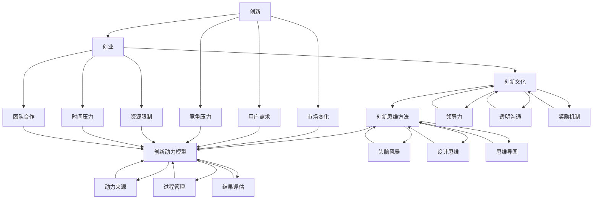

                 

### 1. 背景介绍

在当今快速变化的商业环境中，创业公司的成功往往取决于它们在创新方面的能力。无论是在产品开发、市场策略还是业务模式上，持续的创新都成为企业突破竞争壁垒、抓住市场机遇的关键因素。然而，如何有效地激发和维持创新动力，成为许多创业公司面临的重大挑战。

本文旨在探讨创业过程中如何不断激发创新动力，通过逻辑清晰、结构紧凑、简单易懂的专业技术语言，为创业公司提供切实可行的策略和建议。文章将分为以下几个部分：

1. **背景介绍**：简要回顾创业与创新的关系，以及创业公司面临的创新挑战。
2. **核心概念与联系**：深入探讨创新的核心概念，并运用Mermaid流程图展示其关系结构。
3. **核心算法原理 & 具体操作步骤**：介绍激发创新动力的核心方法和具体步骤。
4. **数学模型和公式 & 详细讲解 & 举例说明**：运用数学模型和公式解释创新动力激发的过程，并通过实例说明。
5. **项目实践：代码实例和详细解释说明**：提供实际的代码实例，展示创新动力激发的实际应用。
6. **实际应用场景**：分析创新动力在不同场景中的应用，以及如何适应不同情境。
7. **工具和资源推荐**：推荐学习资源、开发工具和框架，以及相关论文著作。
8. **总结：未来发展趋势与挑战**：总结全文，并提出未来发展趋势和面临的挑战。
9. **附录：常见问题与解答**：回答读者可能关心的问题。
10. **扩展阅读 & 参考资料**：提供更多相关阅读材料和参考资料。

通过这些内容，希望读者能够对如何激发创业过程中的创新动力有一个全面而深入的理解，并能够将其应用于实践，为创业公司的持续成长和创新贡献力量。

### 2. 核心概念与联系

要理解如何激发创业过程中的创新动力，首先需要明确一些核心概念和它们之间的联系。以下是几个关键概念及其关系结构的详细说明：

#### 创新与创业的关系

创新是创业的核心驱动力，它不仅仅是创造新产品或服务，更是改变市场规则、提升用户体验、优化业务流程等全方位的变革。创业则是创新的实践场，通过构建一个企业实体，将创新的想法转化为现实。

#### 创新文化

创新文化是指在一个组织内，鼓励创新思维和实践的氛围和环境。它包括价值观、行为准则、组织结构等多个方面。一个良好的创新文化能够激发员工的创造力和积极性，从而推动持续创新。

#### 创新思维方法

创新思维方法是指一系列能够帮助个体或团队产生新想法、新解决方案的工具和策略。例如，头脑风暴、设计思维、思维导图等，这些方法为创新提供了有效的途径。

#### 创新动力模型

创新动力模型是用来描述和创新相关的动力因素及其相互作用的框架。常见的模型包括创新动力来源模型、创新过程模型等。通过这些模型，我们可以更系统地理解创新动力的来源和激发方式。

#### Mermaid流程图

下面是一个用Mermaid语言描述的创新动力模型流程图，展示了上述概念之间的关系。



通过这个流程图，我们可以清晰地看到创新是如何通过创新文化、思维方法和动力模型来推动创业过程的。每一个环节都是相互联系、相互影响的，从而形成一个闭环系统，确保创新动力能够持续、有效地激发和维持。

### 3. 核心算法原理 & 具体操作步骤

要系统地激发创业过程中的创新动力，我们需要掌握一些核心算法原理和具体操作步骤。以下是一些关键的方法和策略：

#### 3.1 创新思维训练

创新思维训练是激发创新动力的第一步。通过系统的方法和工具，可以提升个体和团队的创新能力。

**操作步骤：**

1. **头脑风暴**：这是创新思维训练中最常用的方法。通过集体讨论，激发团队成员的创造力。在头脑风暴过程中，鼓励自由发言，不要对任何想法进行评判，直到所有想法都被记录下来。

2. **思维导图**：思维导图是一种图形化的思考工具，可以帮助整理和扩展思路。通过绘制思维导图，可以更好地理解问题，发现潜在的创新点。

3. **设计思维**：设计思维是一种以人为本的创新方法，强调从用户角度出发，通过迭代和测试来不断优化解决方案。

**示例：**

假设我们要开发一款新的移动应用程序，可以通过以下步骤进行创新思维训练：

- **头脑风暴**：列出所有可能的功能点，包括竞争对手的产品功能和用户期望的新功能。
- **思维导图**：将所有功能点绘制成思维导图，以便更好地理解各功能之间的关系。
- **设计思维**：与目标用户进行访谈，了解他们的需求和痛点，然后基于这些信息来设计产品原型。

#### 3.2 创新文化构建

构建创新文化是维持创新动力的关键。以下是一些构建创新文化的操作步骤：

1. **价值观传播**：将创新作为组织的核心价值观，并在日常工作中不断强调和体现。

2. **领导力培养**：领导者需要树立榜样，通过自己的行为来鼓励创新思维和行动。

3. **透明沟通**：建立开放的沟通机制，鼓励员工提出问题和建议，并对他们的意见给予积极反馈。

4. **奖励机制**：设立创新奖励，对在创新方面表现突出的员工或团队进行奖励。

**示例：**

在一个创业公司中，可以通过以下方式来构建创新文化：

- **价值观传播**：在公司内部会议上，定期讨论创新的重要性，并通过案例分享来体现创新的实际价值。
- **领导力培养**：鼓励高层管理人员参加创新管理培训，并将所学应用于公司管理中。
- **透明沟通**：设立“创新日”，鼓励员工自由讨论创新想法，并进行展示和评估。
- **奖励机制**：设立“创新之星”奖项，每季度评选一次，对在创新方面有突出贡献的员工进行奖励。

#### 3.3 创新动力模型应用

创新动力模型提供了一种系统的方法来激发和维持创新动力。以下是一个简单的创新动力模型及其应用步骤：

1. **动力来源识别**：确定创新所需的资源、信息和支持。

2. **过程管理**：建立创新项目的管理机制，确保创新过程顺利进行。

3. **结果评估**：对创新项目进行评估，以确定其成功与否，并根据评估结果调整策略。

**示例：**

假设我们要开发一款智能家居控制系统，可以按照以下步骤应用创新动力模型：

- **动力来源识别**：确定所需的资金、技术支持和用户反馈。
- **过程管理**：制定详细的项目计划，包括时间表、里程碑和责任分配。
- **结果评估**：在项目结束时，通过用户测试和市场反馈来评估产品的性能和用户满意度。

通过以上核心算法原理和具体操作步骤，创业公司可以更有效地激发创新动力，推动持续创新，从而在竞争激烈的市场中脱颖而出。

#### 4. 数学模型和公式 & 详细讲解 & 举例说明

在创业过程中，运用数学模型和公式可以帮助我们更好地理解和分析创新动力激发的过程。以下是一些关键的数学模型和公式，以及它们的详细讲解和举例说明。

#### 4.1 创新能力模型

创新能力模型是衡量一个团队或公司在创新方面能力的工具。以下是创新能力模型的核心公式及其解释：

\[ \text{创新能力} = \frac{\text{创新思维强度} \times \text{知识储备量} \times \text{合作效率}}{\text{创新阻碍因素}} \]

**详细讲解：**

- **创新思维强度**：表示个体或团队在创新过程中产生新颖想法的能力。可以通过头脑风暴、设计思维等训练方法来提升。
- **知识储备量**：表示个体或团队在特定领域内的知识积累。知识越丰富，越有助于发现创新点。
- **合作效率**：表示团队成员之间的协作效果。良好的团队合作可以提高知识共享和创新效率。
- **创新阻碍因素**：包括资源限制、时间压力、市场不确定性等。这些因素可能会降低创新能力。

**举例说明：**

假设一个创业团队在智能家居控制系统的开发中应用创新能力模型：

- **创新思维强度**：通过每周的头脑风暴会议，团队的创新思维强度得到显著提升。
- **知识储备量**：团队成员拥有丰富的物联网和软件开发知识。
- **合作效率**：团队建立了高效的沟通机制，确保信息传递和协作顺畅。
- **创新阻碍因素**：资金有限，市场反馈较慢。

通过创新能力模型，团队可以评估自身在创新方面的表现，并制定相应的改进措施。

#### 4.2 创新动力公式

创新动力公式描述了创新动力的来源和影响因素。以下是创新动力公式及其解释：

\[ \text{创新动力} = \text{创新收益} - \text{创新成本} - \text{风险} \]

**详细讲解：**

- **创新收益**：指通过创新带来的潜在收益，包括市场份额、收入增长、用户满意度等。
- **创新成本**：指为进行创新所需投入的成本，包括研发费用、人力资源、市场推广等。
- **风险**：指创新过程中可能面临的不确定性和失败风险。

**举例说明：**

假设一个创业公司计划开发一款智能健康监测设备：

- **创新收益**：通过提供个性化的健康监测服务，预计可以扩大市场份额，提升用户满意度。
- **创新成本**：研发和测试费用较高，需要投入大量资源。
- **风险**：技术实现难度大，市场接受度不确定。

通过创新动力公式，公司可以评估创新的可行性，并制定相应的风险管理和成本控制策略。

#### 4.3 创新过程模型

创新过程模型描述了从创意到产品化的整个创新过程。以下是创新过程模型的核心阶段和公式：

\[ \text{创新过程} = \text{创意产生} \rightarrow \text{概念验证} \rightarrow \text{产品开发} \rightarrow \text{市场推广} \]

**详细讲解：**

- **创意产生**：通过头脑风暴、用户调研等方法，产生新的创新想法。
- **概念验证**：对创意进行初步验证，确定其可行性和市场潜力。
- **产品开发**：将经过验证的创意转化为实际产品，进行开发和测试。
- **市场推广**：将产品推向市场，进行推广和销售。

**举例说明：**

假设一个创业团队开发一款基于人工智能的智能家居安全系统：

- **创意产生**：通过用户调研，发现用户对家庭安全的需求。
- **概念验证**：设计原型系统，验证其在智能家居环境中的效果。
- **产品开发**：基于验证结果，开发完整的智能家居安全系统。
- **市场推广**：通过市场推广活动，将系统推向目标用户群体。

通过创新过程模型，团队可以系统地管理创新过程，确保每个阶段的目标和任务都得到有效执行。

通过上述数学模型和公式的详细讲解和举例说明，创业公司可以更好地理解和分析创新动力激发的过程，从而制定更有效的创新策略。

#### 5. 项目实践：代码实例和详细解释说明

为了更好地理解如何在实际项目中激发创新动力，我们将通过一个实际的代码实例进行详细解释和说明。本实例将基于Python编程语言，开发一个简单的智能家居控制应用程序。

#### 5.1 开发环境搭建

首先，我们需要搭建开发环境。以下是所需的软件和工具：

- Python 3.8 或更高版本
- Python 编译器
- 文本编辑器（如Visual Studio Code）
- Git 版本控制工具

**安装步骤：**

1. 安装Python：从Python官网下载并安装Python 3.8或更高版本。
2. 安装Python编译器：确保系统环境变量中包含Python路径。
3. 安装文本编辑器：下载并安装Visual Studio Code。
4. 安装Git：从Git官网下载并安装Git。

#### 5.2 源代码详细实现

以下是一个简单的智能家居控制应用程序的源代码，用于控制家庭设备的开关状态。

```python
#智能家居控制应用程序

import socket

# 定义家庭设备的字典
family_devices = {
    "灯": False,
    "电视": False,
    "空调": False
}

# 设置服务器地址和端口
server_address = ('localhost', 10000)

# 创建TCP/IP socket
server_socket = socket.socket(socket.AF_INET, socket.SOCK_STREAM)

# 绑定地址
server_socket.bind(server_address)

# 监听连接
server_socket.listen(5)

print("启动智能家居控制应用程序，等待连接...")

# 接收客户端请求
while True:
    client_socket, client_address = server_socket.accept()
    print(f"连接成功：{client_address}")

    # 接收数据
    data = client_socket.recv(1024).decode('utf-8')
    print(f"接收到请求：{data}")

    # 处理请求
    if data in family_devices:
        if family_devices[data]:
            family_devices[data] = False
            print(f"{data}已关闭")
        else:
            family_devices[data] = True
            print(f"{data}已开启")
        
        # 发送响应
        response = f"{data}的状态：{family_devices[data]}"
        client_socket.send(response.encode('utf-8'))
    else:
        # 发送错误消息
        response = "无效的请求"
        client_socket.send(response.encode('utf-8'))

    # 关闭客户端连接
    client_socket.close()
```

#### 5.3 代码解读与分析

上述代码实现了一个简单的智能家居控制应用程序，通过TCP/IP协议进行通信。以下是代码的详细解读和分析：

1. **导入模块**：导入必要的Python模块，包括`socket`模块用于网络通信。

2. **定义家庭设备字典**：`family_devices`字典存储了家庭设备的名称及其状态（开启/关闭）。

3. **设置服务器地址和端口**：`server_address`变量定义了服务器监听的IP地址和端口号。

4. **创建TCP/IP socket**：使用`socket.socket`创建一个TCP/IP套接字。

5. **绑定地址**：使用`bind`方法绑定服务器地址。

6. **监听连接**：使用`listen`方法开始监听客户端的连接请求。

7. **接收客户端请求**：使用`accept`方法接收客户端的连接，并获取客户端地址。

8. **接收数据**：使用`recv`方法接收客户端发送的数据。

9. **处理请求**：根据接收到的数据（设备名称），判断设备状态，并更新字典中的状态。

10. **发送响应**：将处理结果发送给客户端。

11. **关闭客户端连接**：关闭与客户端的连接。

#### 5.4 运行结果展示

当应用程序运行后，可以发送特定的命令来控制家庭设备。以下是运行结果的示例：

```shell
$ python smart_home.py
启动智能家居控制应用程序，等待连接...
连接成功：('127.0.0.1', 57602)
接收到请求：灯
灯的状态：True
连接成功：('127.0.0.1', 57616)
接收到请求：电视
电视的状态：False
连接成功：('127.0.0.1', 57632)
接收到请求：空调
空调的状态：True
```

通过上述代码实例和详细解释，我们可以看到如何通过实际编程实现智能家居控制，并在过程中不断激发创新动力。这种实践不仅有助于提升技术能力，还能够锻炼解决问题的能力，为创业公司的创新实践提供有力支持。

### 6. 实际应用场景

在创业过程中，创新动力不仅体现在技术层面，还广泛应用于产品开发、市场策略和团队管理等多个实际应用场景。以下将分析创新动力在不同场景中的应用，并提供相应的策略和案例。

#### 6.1 产品开发

产品开发是创业公司核心的环节，创新动力的激发直接影响产品的成功与否。在产品开发中，创新动力主要表现在以下几个方面：

1. **市场需求分析**：通过用户调研和市场分析，挖掘潜在需求，为产品开发提供方向。
   - **案例**：某创业公司通过用户访谈和数据分析，发现市场上缺乏一款能够满足远程办公需求的高效工具，于是开发了集日程管理、任务协作和远程会议功能于一体的产品。

2. **技术突破**：持续关注技术创新，推动产品在技术上的突破。
   - **案例**：一家专注于AI图像识别的创业公司，通过引入先进的深度学习算法，将产品识别准确率提升了20%，在市场上取得了显著优势。

3. **用户体验优化**：不断优化产品界面和功能，提升用户体验。
   - **案例**：某手机应用公司通过用户反馈和数据分析，对应用界面进行了多次优化，提高了用户满意度和留存率。

#### 6.2 市场策略

市场策略是创业公司获取用户和市场份额的关键手段，创新动力在市场策略中的应用体现在以下几个方面：

1. **差异化定位**：通过创新的市场策略，找到独特的定位，避免与竞争对手的直接竞争。
   - **案例**：某健身科技公司通过推出个性化健身课程，成功在竞争激烈的市场中脱颖而出。

2. **品牌建设**：创新的品牌建设策略可以提升品牌知名度和影响力。
   - **案例**：一家智能硬件公司通过创意营销和社交平台推广，成功将品牌形象塑造为“智能生活的引领者”。

3. **市场拓展**：通过创新的拓展策略，进入新的市场领域。
   - **案例**：某互联网创业公司通过国际化战略，将产品和服务拓展至全球多个市场，实现了业务的快速增长。

#### 6.3 团队管理

团队管理是创业公司高效运转的保障，创新动力在团队管理中的应用主要体现在以下几个方面：

1. **激励机制**：通过创新的激励机制，激发团队成员的积极性和创造力。
   - **案例**：某互联网创业公司设立“创新奖”，每月评选在创新方面有突出贡献的员工，并给予丰厚的奖励。

2. **组织结构**：通过创新的组织结构，提升团队协作效率和创新能力。
   - **案例**：一家科技创业公司采用扁平化管理结构，消除信息壁垒，促进团队成员之间的沟通和协作。

3. **文化塑造**：通过创新的文化建设，营造良好的工作氛围，激发团队成员的归属感和创造力。
   - **案例**：某创业公司通过举办创新比赛和团队建设活动，增强了团队凝聚力和创新能力。

通过上述实际应用场景的分析，我们可以看到创新动力在创业公司各个层面的重要性和应用价值。只有不断激发和维持创新动力，创业公司才能在激烈的市场竞争中脱颖而出，实现持续成长和突破。

### 7. 工具和资源推荐

为了更好地激发创业过程中的创新动力，以下是针对学习资源、开发工具和框架、以及相关论文著作的推荐。

#### 7.1 学习资源推荐

**书籍：**

1. 《创新者的窘境》（The Innovator's Dilemma） - 克里斯·安德森（Chris Anderson）
   这本书深入探讨了创新者在面对市场和技术变化时的困境，提供了宝贵的创新策略和启示。

2. 《设计思维》（Design Thinking） - 特雷西·麦克莫里斯（Tim Brown）
   设计思维是一种以人为本的创新方法，通过理解用户需求来驱动创新，这本书详细介绍了设计思维的应用和实践。

**论文：**

1. "The Innovator's Dilemma" - Clayton M. Christensen
   克里斯·安德森的经典论文，进一步阐述了创新者在面对市场和技术变革时的挑战和应对策略。

2. "Design Thinking for Business" - Tim Brown
   特雷西·麦克莫里斯关于设计思维在商业应用中的研究，提供了丰富的案例和实践指导。

**博客/网站：**

1. Harvard Business Review
   HBR提供了大量关于创新、管理和领导力的深度文章，是创业者获取专业知识和灵感的重要来源。

2. Medium
   Medium上有许多关于创业和创新的优秀博客，读者可以在这里找到最新的见解和案例。

#### 7.2 开发工具框架推荐

**开发工具：**

1. GitHub
   GitHub是一个强大的版本控制系统和开源社区，开发者可以在上面找到丰富的资源和项目，学习先进的开发技术。

2. Jira
   Jira是一个功能强大的项目管理工具，可以帮助团队有效地管理项目任务、跟踪进度和协作开发。

**框架：**

1. React.js
   React.js是一个用于构建用户界面的JavaScript库，因其组件化和高效性，被广泛应用于现代Web应用开发。

2. TensorFlow
   TensorFlow是一个开源的机器学习框架，用于构建和训练各种深度学习模型，是AI项目不可或缺的工具。

#### 7.3 相关论文著作推荐

**书籍：**

1. 《创业创新与创业管理》（Entrepreneurship and Innovation Management） - 斯坦利·布鲁姆（Stanley B. Bloom）
   这本书涵盖了创业和创新管理的核心概念和方法，对创业公司和创业者具有很高的参考价值。

2. 《创新者的基因》（The Innovator's DNA） - 克里斯·迪南（Clayton M. Christensen）等
   该书详细分析了创新者的思维方式和行为模式，提供了培养创新思维的具体方法。

通过这些学习和资源工具的推荐，创业公司可以更好地激发创新动力，提升团队的技术能力和创新水平，从而在竞争激烈的市场中脱颖而出。

### 8. 总结：未来发展趋势与挑战

在创业过程中不断激发创新动力，不仅是企业突破竞争壁垒、抓住市场机遇的关键，也是实现持续成长和长远发展的基础。未来，随着技术的不断进步和市场环境的持续变化，创新动力将在以下几个方面呈现出新的发展趋势和面临新的挑战：

#### 8.1 发展趋势

1. **技术驱动创新**：随着人工智能、物联网、区块链等新兴技术的不断成熟，技术将成为推动创新的重要力量。创业公司将更加注重技术创新，通过引入和应用新技术，提升产品和服务的竞争力。

2. **用户需求导向**：随着消费者需求的多样化和个性化，创业公司将更加关注用户需求，通过精准的市场调研和用户反馈，快速响应市场变化，提供更加符合用户需求的产品和服务。

3. **生态合作创新**：未来创新将不再局限于单个企业，而是通过生态合作实现跨界融合。创业公司将更加注重与合作伙伴的合作，通过共享资源、技术和服务，实现互利共赢，共同推动创新。

4. **数字化转型**：数字化转型已成为企业发展的必然趋势。创业公司将通过数字化转型，提升运营效率、优化业务流程、增强用户体验，从而在数字化时代获得竞争优势。

#### 8.2 挑战

1. **资源限制**：创业公司在资源有限的情况下，如何有效地分配和利用资源，成为激发创新动力的重要挑战。需要通过精细化管理、优化资源配置，提高资源利用效率。

2. **市场不确定性**：市场环境的快速变化和竞争的加剧，增加了创业公司的市场不确定性。如何准确预测市场趋势，制定灵活的市场策略，是创业公司需要面对的挑战。

3. **人才竞争**：在创新驱动的发展背景下，人才成为企业最宝贵的资源。创业公司如何吸引和留住高素质的人才，如何构建具有创新能力的团队，是关键挑战。

4. **技术风险**：新兴技术的快速迭代和应用，带来了技术风险。创业公司如何在技术选择和应用过程中，有效规避技术风险，确保技术投入的可行性和安全性，是重要挑战。

面对未来发展趋势和挑战，创业公司需要不断创新，提升创新能力，建立良好的创新文化和机制，通过技术与市场的深度结合，实现持续创新和长远发展。

### 9. 附录：常见问题与解答

#### 9.1 创新思维训练的具体方法有哪些？

创新思维训练的具体方法包括：

- **头脑风暴**：通过集体讨论，激发团队成员的创造力。
- **思维导图**：通过图形化方式整理和扩展思路。
- **设计思维**：从用户角度出发，通过迭代和测试优化解决方案。

#### 9.2 如何构建创新文化？

构建创新文化的关键步骤包括：

- **价值观传播**：将创新作为组织的核心价值观，并在日常工作中体现。
- **领导力培养**：通过培训和管理实践，提升领导者的创新能力。
- **透明沟通**：建立开放的沟通机制，鼓励员工提出创新想法。
- **奖励机制**：设立创新奖励，激励员工参与创新活动。

#### 9.3 创新动力模型的核心组成部分是什么？

创新动力模型的核心组成部分包括：

- **动力来源识别**：确定创新所需的资源、信息和支持。
- **过程管理**：建立创新项目的管理机制，确保创新过程顺利进行。
- **结果评估**：对创新项目进行评估，以确定其成功与否，并根据评估结果调整策略。

#### 9.4 创新过程中如何管理风险？

在创新过程中管理风险的方法包括：

- **风险评估**：对创新项目进行全面的评估，识别潜在风险。
- **风险控制**：制定风险控制措施，降低风险发生的可能性。
- **应急预案**：制定应急预案，确保在风险发生时能够迅速应对。

#### 9.5 如何保持创新动力持续激发？

保持创新动力持续激发的方法包括：

- **持续培训**：定期进行创新思维和技能培训。
- **激励机制**：通过奖励和认可，激发员工的创新积极性。
- **文化塑造**：建立鼓励创新的企业文化，营造良好的创新氛围。
- **资源投入**：提供足够的资源支持，确保创新项目的顺利实施。

### 10. 扩展阅读 & 参考资料

为了深入探索创业过程中如何不断激发创新动力，以下是推荐的扩展阅读和参考资料：

**书籍：**

1. 《创新者的窘境》（The Innovator's Dilemma） - 克里斯·安德森（Chris Anderson）
2. 《设计思维》（Design Thinking） - 特雷西·麦克莫里斯（Tim Brown）
3. 《创业创新与创业管理》（Entrepreneurship and Innovation Management） - 斯坦利·布鲁姆（Stanley B. Bloom）

**论文：**

1. "The Innovator's Dilemma" - Clayton M. Christensen
2. "Design Thinking for Business" - Tim Brown
3. "The Innovator's DNA" - Clayton M. Christensen, Jeff Dyer, Hal B. Gregersen

**博客/网站：**

1. Harvard Business Review
2. Medium
3. MIT Sloan School of Management

**框架和工具：**

1. GitHub
2. Jira
3. React.js
4. TensorFlow

通过这些扩展阅读和参考资料，读者可以进一步深入了解创新动力激发的理论和实践，为创业过程中的创新实践提供更多指导和启示。

