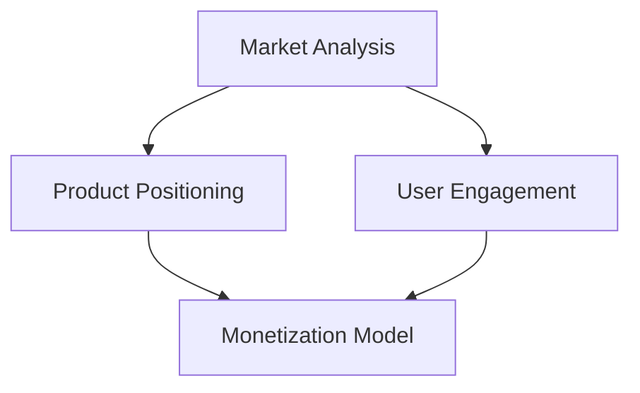

                 

### 文章标题：创建和销售数字产品的策略

#### 关键词：（Digital Product Creation, Sales Strategy, Market Analysis, User Engagement, Monetization Models）

> 摘要：本文将探讨创建和销售数字产品的策略，从市场分析、用户参与和货币化模式等多个方面进行分析。我们将逐步揭示如何打造成功的数字产品，并通过具体实例来阐明策略的实施过程。

#### 1. 背景介绍

随着互联网技术的快速发展，数字产品成为了市场上备受瞩目的热点。从应用程序、在线课程到虚拟商品，数字产品以其便捷性、多样性和可扩展性吸引了大量用户。然而，在竞争激烈的市场环境中，如何成功创建和销售数字产品成为了许多创业者和企业面临的挑战。

本文旨在为读者提供一套系统化的策略，帮助他们在创建和销售数字产品过程中做出明智的决策。我们将从市场分析、用户参与、货币化模式等多个方面进行探讨，并通过具体实例来说明这些策略的实际应用。

#### 2. 核心概念与联系

在讨论创建和销售数字产品的策略之前，我们需要了解一些核心概念。以下是几个关键概念及其相互联系：

**市场分析**：了解目标市场的需求和趋势，为产品定位和策略制定提供依据。

**用户参与**：提高用户对产品的忠诚度和参与度，增加用户粘性。

**货币化模式**：为产品创造收入来源，实现商业价值。

下面是这些核心概念之间的联系，通过Mermaid流程图展示：

**市场分析**是了解目标市场的需求和趋势的过程，它为产品定位提供依据。**用户参与**则是指通过提高用户对产品的忠诚度和参与度，增加用户粘性。而**货币化模式**则是指为产品创造收入来源，实现商业价值。这三个核心概念相互关联，共同决定了数字产品的成功与否。

#### 3. 核心算法原理 & 具体操作步骤

在了解核心概念后，我们将深入探讨创建和销售数字产品的具体策略。以下是核心算法原理和具体操作步骤：

**市场分析**

- **需求调研**：通过问卷调查、用户访谈等方式了解目标市场的需求。
- **竞争分析**：分析竞争对手的产品、市场策略和用户评价。
- **趋势分析**：研究市场趋势，为产品定位和策略制定提供依据。

**用户参与**

- **用户画像**：创建用户画像，了解用户需求和偏好。
- **社区建设**：建立线上社区，鼓励用户互动和分享。
- **个性化推荐**：根据用户画像和偏好，提供个性化内容和服务。

**货币化模式**

- **广告收入**：通过在产品中嵌入广告，获取广告收入。
- **订阅模式**：提供订阅服务，按月或按年收取费用。
- **付费增值服务**：为用户提供付费增值服务，如高级功能、个性化定制等。

#### 4. 数学模型和公式 & 详细讲解 & 举例说明

在创建和销售数字产品的过程中，数学模型和公式可以帮助我们更好地理解和优化策略。以下是一个简单的例子：

**用户生命周期价值（Customer Lifetime Value, CLV）**

$$
CLV = （用户平均消费金额 \times 用户平均消费周期）/ （1 + 资本成本率）
$$

**详细讲解：**

- **用户平均消费金额**：用户在产品上的平均消费金额。
- **用户平均消费周期**：用户在产品上的平均消费时长。
- **资本成本率**：企业的资本成本率，反映了企业的投资回报要求。

**举例说明：**

假设一个用户的平均消费金额为100元，平均消费周期为2年，资本成本率为10%。根据上述公式计算，该用户的生命周期价值为：

$$
CLV = （100 \times 2）/ （1 + 0.1） = 181.82元
$$

通过计算用户生命周期价值，企业可以更好地了解用户的潜在价值，从而制定相应的营销策略。

#### 5. 项目实践：代码实例和详细解释说明

在本节中，我们将通过一个简单的项目实例，展示如何应用上述策略。假设我们要创建一款在线学习平台，下面是项目实践的步骤：

**5.1 开发环境搭建**

- **技术栈**：选择适合开发在线学习平台的技术栈，如React、Node.js等。
- **数据库**：搭建数据库，存储用户数据和课程信息。

**5.2 源代码详细实现**

- **用户注册与登录**：实现用户注册和登录功能，使用JWT（JSON Web Token）进行身份验证。
- **课程浏览与搜索**：实现课程浏览和搜索功能，使用Elasticsearch提高搜索效率。
- **付费订阅**：实现付费订阅功能，使用第三方支付平台进行支付处理。

**5.3 代码解读与分析**

- **用户模块**：用户模块负责处理用户注册、登录和认证，实现用户身份验证和权限控制。
- **课程模块**：课程模块负责处理课程浏览、搜索和推荐，提高用户参与度和留存率。
- **支付模块**：支付模块负责处理订单生成、支付处理和退款，确保支付流程的顺利进行。

**5.4 运行结果展示**

- **用户界面**：展示用户界面，包括注册、登录、课程浏览和支付等模块。
- **数据统计**：展示平台运行数据，如用户数量、课程销量和收入等。

通过这个简单的项目实例，我们可以看到如何将创建和销售数字产品的策略应用到实际开发中。

#### 6. 实际应用场景

数字产品在各个领域都有广泛的应用场景，以下是一些实际应用案例：

- **教育领域**：在线学习平台、虚拟实验室等。
- **娱乐领域**：游戏、虚拟现实、社交媒体等。
- **医疗领域**：远程医疗咨询、健康管理应用等。
- **企业领域**：在线办公、客户关系管理、供应链管理等。

这些应用场景展示了数字产品的多样性和潜力，也为创业者和企业提供了广阔的发展空间。

#### 7. 工具和资源推荐

为了更好地创建和销售数字产品，以下是一些建议的工具和资源：

**7.1 学习资源推荐**

- **书籍**：《数字营销实战》、《精益创业》等。
- **论文**：相关领域的学术研究论文。
- **博客**：行业专家的技术博客和案例分析。

**7.2 开发工具框架推荐**

- **前端框架**：React、Vue.js等。
- **后端框架**：Node.js、Django等。
- **数据库**：MySQL、MongoDB等。

**7.3 相关论文著作推荐**

- **论文**：数字营销、用户参与和货币化模式等方面的学术论文。
- **著作**：《网络营销》、《电子商务概论》等。

这些工具和资源将为创建和销售数字产品提供有力支持。

#### 8. 总结：未来发展趋势与挑战

随着技术的不断进步，数字产品市场将迎来更多的发展机遇和挑战。以下是未来发展趋势和挑战：

- **人工智能与大数据**：人工智能和大数据技术的应用将进一步提升数字产品的个性化和服务水平。
- **区块链**：区块链技术的普及将为数字产品提供更安全、透明的交易和支付方式。
- **5G与物联网**：5G和物联网技术的发展将推动数字产品向更广阔的领域扩展。

然而，数字产品市场也面临着竞争加剧、用户隐私保护等挑战。创业者和企业需要不断创新，应对市场变化，抓住机遇，应对挑战。

#### 9. 附录：常见问题与解答

**Q：如何选择合适的货币化模式？**

A：选择合适的货币化模式需要考虑目标用户、市场需求和产品特性。以下是几种常见的货币化模式：

- **广告收入**：适用于用户规模较大、内容丰富的产品。
- **订阅模式**：适用于提供持续价值的产品，如在线课程、软件服务等。
- **付费增值服务**：适用于提供额外功能或服务的数字产品。

**Q：如何提高用户参与度？**

A：提高用户参与度需要从多个方面进行努力：

- **用户画像**：了解用户需求和偏好，提供个性化内容和服务。
- **社区建设**：建立线上社区，鼓励用户互动和分享。
- **用户反馈**：收集用户反馈，优化产品功能和体验。

**Q：如何进行市场分析？**

A：进行市场分析需要以下步骤：

- **需求调研**：通过问卷调查、用户访谈等方式了解目标市场的需求。
- **竞争分析**：分析竞争对手的产品、市场策略和用户评价。
- **趋势分析**：研究市场趋势，为产品定位和策略制定提供依据。

#### 10. 扩展阅读 & 参考资料

- **书籍**：《数字营销实战》、《精益创业》等。
- **论文**：相关领域的学术研究论文。
- **博客**：行业专家的技术博客和案例分析。
- **网站**：相关领域的技术社区和行业网站。

通过扩展阅读，您可以深入了解数字产品创建和销售的更多细节，为自己的项目提供更多启发和灵感。

### 作者署名

作者：禅与计算机程序设计艺术 / Zen and the Art of Computer Programming

---

以上就是本文的正文内容，希望对您在创建和销售数字产品过程中有所启发。在数字产品的世界里，只有不断探索和创新，才能找到属于自己的成功之路。祝愿每一位创业者都能在数字产品的海洋中乘风破浪，驶向成功的彼岸。

