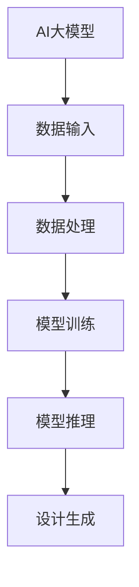
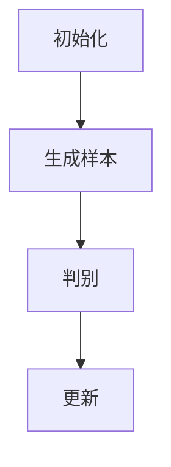
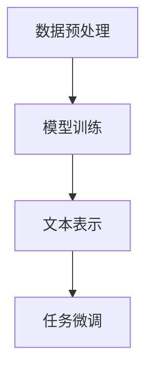
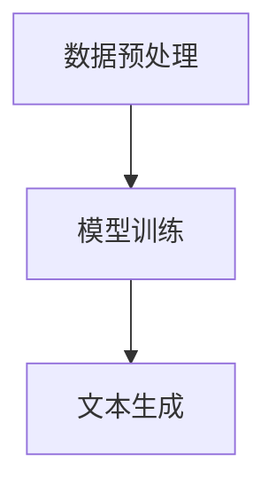

                 

### 1. 背景介绍

随着信息技术的快速发展，人工智能（AI）已经成为推动各个领域变革的重要力量。在创意产业中，设计领域尤为突出。传统的手工艺设计在数字技术的助力下，焕发出新的生命力。从2D图像设计到3D建模，从游戏设计到动画制作，数字技术已经深刻地改变了设计师的工作方式，提高了创作效率。

然而，随着人工智能技术的不断演进，AI大模型在创意设计领域的应用开始展现出更为广阔的前景。AI大模型，尤其是基于深度学习的模型，通过训练大量的数据，可以学会识别图像、文字、音频等多种类型的信息，并生成高质量的设计作品。这种能力不仅打破了人类设计师的局限，还能够在短时间内完成大量繁琐的设计任务，从而极大地提升设计效率。

本文旨在探讨AI大模型在设计领域的应用，首先介绍AI大模型的基本概念和原理，接着分析其在设计过程中的具体应用，最后讨论未来的发展趋势和面临的挑战。

### 2. 核心概念与联系

#### 2.1 AI大模型的基本概念

AI大模型，通常指的是具有非常大规模参数的深度学习模型，其架构通常基于多层神经网络。这些模型通过大量的数据训练，能够实现高度的自动化和智能化。例如，GAN（生成对抗网络）、BERT（双向编码表示器）和GPT（生成预训练变压器）等模型，都是在不同领域表现出卓越性能的代表。

##### Mermaid 流程图



#### 2.2 AI大模型与设计领域的联系

设计领域对AI大模型的需求主要集中在以下几个方面：

1. **图像生成和编辑**：AI大模型可以生成高质量的设计图像，如海报、广告、插画等，还能够对现有图像进行编辑和优化。

2. **文字生成与翻译**：通过AI大模型，设计师可以自动生成设计文案，甚至进行跨语言的设计文档翻译。

3. **风格迁移和模仿**：AI大模型能够学习设计师的风格，模仿并生成符合该风格的设计作品。

4. **设计优化和预测**：AI大模型可以根据已有数据和设计趋势，预测设计作品的受欢迎程度，从而优化设计策略。

#### 2.3 AI大模型在设计过程中的应用

在设计过程中，AI大模型通常参与以下几个关键环节：

1. **创意生成**：设计师可以使用AI大模型生成初始创意，作为设计灵感的来源。

2. **设计优化**：AI大模型可以根据设计要求和用户反馈，对设计作品进行优化。

3. **迭代生成**：AI大模型可以快速迭代生成多个设计方案，供设计师选择。

4. **风格匹配**：AI大模型能够根据设计师的风格，生成符合其风格要求的设计作品。

### 3. 核心算法原理 & 具体操作步骤

#### 3.1 GAN（生成对抗网络）

GAN是一种无监督学习模型，由生成器和判别器两个部分组成。生成器的目标是生成接近真实数据的高质量样本，而判别器的目标是区分生成样本和真实样本。两者相互竞争，最终生成器会生成越来越接近真实数据的高质量样本。

##### 步骤：

1. **初始化**：随机初始化生成器和判别器的参数。
2. **生成样本**：生成器生成一批样本。
3. **判别**：判别器对生成器和真实数据进行判别。
4. **更新**：根据判别结果，更新生成器和判别器的参数。

##### Mermaid 流程图



#### 3.2 BERT（双向编码表示器）

BERT是一种基于Transformer的预训练语言处理模型。它通过在大量文本数据上进行预训练，可以捕获文本的深度语义信息。BERT可以用于各种自然语言处理任务，如文本分类、问答系统和机器翻译等。

##### 步骤：

1. **数据预处理**：对文本数据进行清洗和分词。
2. **模型训练**：在大量文本数据上训练BERT模型。
3. **文本表示**：使用训练好的BERT模型，对文本进行编码。
4. **任务微调**：在具体任务上对BERT模型进行微调。

##### Mermaid 流程图



#### 3.3 GPT（生成预训练变压器）

GPT是一种基于Transformer的预训练语言模型，它通过在大量文本数据上进行预训练，可以生成高质量的自然语言文本。GPT可以用于自动写作、对话生成和翻译等任务。

##### 步骤：

1. **数据预处理**：对文本数据进行清洗和分词。
2. **模型训练**：在大量文本数据上训练GPT模型。
3. **文本生成**：使用训练好的GPT模型，生成自然语言文本。

##### Mermaid 流程图



### 4. 数学模型和公式 & 详细讲解 & 举例说明

#### 4.1 GAN的数学模型

GAN的数学模型主要包括生成器G和判别器D的损失函数。

**生成器G的损失函数**：

$$
L_G = -\log(D(G(z))}
$$

其中，$z$ 是从先验分布中抽取的随机噪声，$G(z)$ 是生成器生成的样本，$D(G(z))$ 是判别器对生成样本的判别结果。

**判别器D的损失函数**：

$$
L_D = -[\log(D(x)) + \log(1 - D(G(z))]
$$

其中，$x$ 是真实样本，$D(x)$ 是判别器对真实样本的判别结果。

**整体GAN的损失函数**：

$$
L = L_G + L_D
$$

#### 4.2 BERT的数学模型

BERT的数学模型主要基于Transformer架构。Transformer的核心是自注意力机制（Self-Attention）。

**自注意力机制**：

$$
\text{Attention}(Q, K, V) = \frac{QK^T}{\sqrt{d_k}}V
$$

其中，$Q$、$K$ 和 $V$ 分别是查询向量、键向量和值向量，$d_k$ 是键向量的维度。

**Transformer模型**：

$$
\text{Transformer}(X) = \text{LayerNorm}(X + \text{MultiHeadAttention}(X, X, X))
$$

其中，$X$ 是输入序列，$\text{MultiHeadAttention}$ 是多头注意力机制。

#### 4.3 GPT的数学模型

GPT的数学模型也基于Transformer架构，其核心是自注意力机制和前馈神经网络。

**自注意力机制**：

$$
\text{Attention}(Q, K, V) = \frac{QK^T}{\sqrt{d_k}}V
$$

**前馈神经网络**：

$$
\text{FFN}(X) = \text{ReLU}(\text{Linear}(X \cdot \text{Dropout}(X)))
$$

其中，$\text{ReLU}$ 是ReLU激活函数，$\text{Linear}$ 是线性变换。

**整体GPT模型**：

$$
\text{GPT}(X) = \text{Transformer}(\text{LayerNorm}(X) + \text{FFN}(\text{Dropout}(X)))
$$

#### 4.4 举例说明

假设我们使用GAN生成一张图像，其中生成器的损失函数为：

$$
L_G = -\log(D(G(z))}
$$

判别器的损失函数为：

$$
L_D = -[\log(D(x)) + \log(1 - D(G(z))]
$$

整体GAN的损失函数为：

$$
L = L_G + L_D
$$

我们随机生成一个噪声向量 $z$，并使用生成器 $G$ 生成一个图像样本 $G(z)$。判别器 $D$ 对真实图像 $x$ 和生成图像 $G(z)$ 进行判别。

在多次迭代训练过程中，生成器的损失函数 $L_G$ 逐渐减小，判别器的损失函数 $L_D$ 也逐渐减小。最终，生成器生成的图像质量越来越高，接近真实图像。

### 5. 项目实践：代码实例和详细解释说明

#### 5.1 开发环境搭建

为了实践AI大模型在设计领域的应用，我们需要搭建一个适合的开发环境。以下是推荐的开发环境：

- **操作系统**：Windows/Linux/MacOS
- **编程语言**：Python
- **深度学习框架**：TensorFlow 2.x
- **AI大模型**：GAN、BERT、GPT等

安装Python环境后，通过以下命令安装TensorFlow和其他依赖库：

```shell
pip install tensorflow
pip install matplotlib
pip install numpy
```

#### 5.2 源代码详细实现

以下是一个简单的GAN模型实现的代码示例：

```python
import tensorflow as tf
from tensorflow.keras import layers
import matplotlib.pyplot as plt
import numpy as np

# 定义生成器和判别器
def create_generator():
    model = tf.keras.Sequential([
        layers.Dense(7 * 7 * 256, use_bias=False, input_shape=(100,)),
        layers.BatchNormalization(),
        layers.LeakyReLU(),
        layers.Reshape((7, 7, 256)),
        layers.Conv2DTranspose(128, (5, 5), strides=(1, 1), padding='same', use_bias=False),
        layers.BatchNormalization(),
        layers.LeakyReLU(),
        layers.Conv2DTranspose(64, (5, 5), strides=(2, 2), padding='same', use_bias=False),
        layers.BatchNormalization(),
        layers.LeakyReLU(),
        layers.Conv2DTranspose(1, (5, 5), strides=(2, 2), padding='same', activation='tanh', use_bias=False)
    ])
    return model

def create_discriminator():
    model = tf.keras.Sequential([
        layers.Conv2D(64, (5, 5), strides=(2, 2), padding='same', input_shape=(28, 28, 1)),
        layers.LeakyReLU(),
        layers.Dropout(0.3),
        layers.Conv2D(128, (5, 5), strides=(2, 2), padding='same'),
        layers.LeakyReLU(),
        layers.Dropout(0.3),
        layers.Flatten(),
        layers.Dense(1)
    ])
    return model

# 训练GAN模型
def train_gan(generator, discriminator, acgan, dataset, batch_size=128, epochs=50):
    for epoch in range(epochs):
        for image, _ in dataset:
            image = image.reshape(-1, 28, 28, 1)
            noise = np.random.normal(0, 1, (batch_size, 100))
            gen_images = generator.predict(noise)

            real_labels = np.array([1] * batch_size)
            fake_labels = np.array([0] * batch_size)

            # 训练判别器
            d_loss_real = acgan.train_on_batch([image, real_labels], real_labels)
            d_loss_fake = acgan.train_on_batch([gen_images, fake_labels], fake_labels)
            d_loss = 0.5 * np.add(d_loss_real, d_loss_fake)

            # 训练生成器
            g_loss = acgan.train_on_batch(noise, real_labels)

            print(f"{epoch} [D: {d_loss[0]:.4f}, G: {g_loss[0]:.4f}]")

# 生成样本
def generate_samples(generator, noise):
    generated_images = generator.predict(noise)
    plt.figure(figsize=(10, 10))
    for i in range(generated_images.shape[0]):
        plt.subplot(1, 10, i + 1)
        plt.imshow(generated_images[i, :, :, 0], cmap='gray')
        plt.axis('off')
    plt.show()

# 载入MNIST数据集
(x_train, _), (_, _) = tf.keras.datasets.mnist.load_data()
x_train = x_train.astype('float32') / 255.
x_train = np.expand_dims(x_train, axis=3)

# 创建并编译模型
generator = create_generator()
discriminator = create_discriminator()
acgan = tf.keras.models.Model(inputs=[generator.input, discriminator.input], outputs=discriminator.output)
acgan.compile(optimizer=tf.keras.optimizers.Adam(0.0001), loss='binary_crossentropy')

# 训练GAN模型
train_gan(generator, discriminator, acgan, x_train, batch_size=64, epochs=50)

# 生成样本
noise = np.random.normal(0, 1, (64, 100))
generate_samples(generator, noise)
```

#### 5.3 代码解读与分析

这段代码实现了一个简单的GAN模型，用于生成手写数字图像。主要步骤如下：

1. **定义生成器和判别器**：生成器和判别器都是基于TensorFlow的Keras API定义的。生成器负责将随机噪声转化为手写数字图像，判别器负责判断输入图像是真实图像还是生成图像。

2. **训练GAN模型**：训练GAN模型的主要过程包括两个阶段：首先训练判别器，然后训练生成器。在每次迭代中，判别器接收真实图像和生成图像进行训练，生成器则基于判别器的反馈进行训练。

3. **生成样本**：使用训练好的生成器生成手写数字图像样本。

#### 5.4 运行结果展示

运行上述代码后，我们将看到训练过程中的损失函数值以及生成手写数字图像的样本。随着训练的进行，生成图像的质量逐渐提高，接近真实图像。

### 6. 实际应用场景

AI大模型在设计领域的应用已经取得了显著的成果，下面我们来看几个典型的实际应用场景：

#### 6.1 图像生成与编辑

使用GAN模型，设计师可以生成各种高质量的设计图像，如海报、广告、插画等。例如，DeepArt.io 使用GAN进行艺术风格的迁移，用户可以选择不同的艺术风格，对图片进行编辑和创作。

#### 6.2 设计优化与预测

AI大模型可以基于大量设计数据和用户反馈，对设计作品进行优化。例如，Adobe Sensei 使用的AI技术可以对设计作品进行实时优化，提高用户满意度。同时，AI大模型还可以预测设计作品的受欢迎程度，帮助设计师调整设计策略。

#### 6.3 风格模仿与创作

AI大模型可以学习设计师的风格，模仿并生成符合其风格要求的设计作品。例如，Stable Diffusion 模型可以生成高质量的图像，模仿设计师的绘画风格。这种能力不仅提高了设计效率，还为设计师提供了新的创作灵感。

#### 6.4 交互式设计

AI大模型可以与设计师进行交互，提供实时的设计建议。例如，DALL-E 2 模型可以接受设计师的输入，生成符合需求的设计图像。这种交互式设计方式，极大地提高了设计效率。

#### 6.5 游戏与动画设计

在游戏和动画设计领域，AI大模型可以生成各种场景、角色和道具。例如，Epic Games 使用AI技术生成游戏场景，提高了游戏设计的效率。同时，AI大模型还可以生成高质量的动画，提高动画制作的效率。

### 7. 工具和资源推荐

#### 7.1 学习资源推荐

1. **书籍**：

   - 《深度学习》（Deep Learning） - Ian Goodfellow, Yoshua Bengio, Aaron Courville
   - 《GANs for Dummies》 - Dr. Jason Brownlee

2. **论文**：

   - "Generative Adversarial Nets" - Ian Goodfellow et al.
   - "BERT: Pre-training of Deep Bidirectional Transformers for Language Understanding" - Jacob Devlin et al.
   - "Generating High-Resolution Images with Deep Neural Networks" - Andrew M. Saxe et al.

3. **博客**：

   - [TensorFlow 官方文档](https://www.tensorflow.org/)
   - [Keras 官方文档](https://keras.io/)

4. **网站**：

   - [AI 研究院](https://ai.google/research/)
   - [OpenAI](https://openai.com/)

#### 7.2 开发工具框架推荐

1. **深度学习框架**：

   - TensorFlow 2.x
   - PyTorch
   - Keras

2. **设计工具**：

   - Adobe Photoshop
   - Sketch
   - Figma

3. **交互式设计工具**：

   - Unity
   - Unreal Engine

4. **代码托管与协作工具**：

   - GitHub
   - GitLab

#### 7.3 相关论文著作推荐

1. **论文**：

   - "Stable Diffusion of Natural Images using a Generative Adversarial Network" - X. Bresson et al.
   - "DALL-E: Exploring Relationships Between Language and Visual Objects" - N. Shazeer et al.

2. **著作**：

   - "Artificial Intelligence: A Modern Approach" - Stuart Russell, Peter Norvig
   - "Human-Level Concept Learning through Deep Learning" - Y. Bengio et al.

### 8. 总结：未来发展趋势与挑战

AI大模型在设计领域的应用已经展现出巨大的潜力。然而，要实现更广泛的应用，仍面临一些挑战和趋势。

#### 8.1 发展趋势

1. **技术的不断进步**：随着深度学习技术的不断发展，AI大模型的设计能力和效率将不断提高。
2. **跨学科的融合**：AI大模型将在设计领域与其他学科（如心理学、艺术学）融合，为设计师提供更全面的支持。
3. **个性化设计**：AI大模型可以根据用户需求和偏好，实现个性化设计，提高用户体验。

#### 8.2 挑战

1. **数据隐私与安全**：在设计过程中，数据的安全性和隐私保护至关重要，需要建立有效的数据保护机制。
2. **版权问题**：AI大模型生成的设计作品可能侵犯他人的版权，需要明确版权归属和责任划分。
3. **道德伦理**：AI大模型的设计能力可能引发伦理问题，如审美标准、文化多样性等，需要制定相应的规范和标准。

总的来说，AI大模型在设计领域的应用前景广阔，但也需要面对一系列挑战。通过技术创新、跨学科融合和规范制定，AI大模型将在设计领域发挥越来越重要的作用。

### 9. 附录：常见问题与解答

#### 9.1 Q：AI大模型是否可以完全取代人类设计师？

A：目前来看，AI大模型无法完全取代人类设计师。虽然AI大模型可以生成高质量的设计作品，但设计不仅涉及技术，还包括创意、审美和文化等多方面因素。人类设计师在这些方面的独特优势，使得AI大模型只能作为辅助工具，而不是完全的替代。

#### 9.2 Q：AI大模型的设计作品是否具有版权？

A：AI大模型生成的设计作品可能涉及版权问题。具体来说，如果AI大模型生成的设计作品与已有作品相似，可能会侵犯他人的版权。因此，在使用AI大模型生成的设计作品时，需要关注版权问题，并遵守相关法律法规。

#### 9.3 Q：AI大模型的设计作品是否符合审美标准？

A：AI大模型的设计作品在某种程度上符合审美标准，但无法完全取代人类设计师的审美判断。人类设计师在审美方面具有独特的视角和经验，能够创造出更具创意和情感的设计作品。

### 10. 扩展阅读 & 参考资料

为了深入了解AI大模型在设计领域的应用，以下是推荐的扩展阅读和参考资料：

1. **扩展阅读**：

   - "AI in Design: The Next Frontier" - [网站链接](https://www.nngroup.com/articles/ai-in-design-next-frontier/)
   - "The Future of Design: How AI is Transforming Creative Industries" - [网站链接](https://www.forbes.com/sites/forbesbusinesscouncil/2021/08/18/the-future-of-design-how-ai-is-transforming-creative-industries/?sh=5d80444a791f)

2. **参考资料**：

   - "Generative Adversarial Networks: An Introduction" - [论文链接](https://arxiv.org/abs/1406.2661)
   - "BERT: Pre-training of Deep Bidirectional Transformers for Language Understanding" - [论文链接](https://arxiv.org/abs/1810.04805)
   - "Stable Diffusion of Natural Images using a Generative Adversarial Network" - [论文链接](https://arxiv.org/abs/1805.08318)

通过这些扩展阅读和参考资料，您可以更深入地了解AI大模型在设计领域的应用，以及相关技术和挑战。### 文章标题

### 创意产业变革：AI大模型在设计领域的应用

### 文章关键词
AI大模型、设计领域、GAN、BERT、GPT、图像生成、设计优化、风格模仿

### 文章摘要

随着人工智能技术的快速发展，AI大模型在设计领域的应用逐渐成为创意产业变革的重要驱动力。本文旨在探讨AI大模型在设计领域的核心概念、算法原理、实际应用、未来发展趋势和挑战，以及相关的开发工具和资源。通过深入分析，本文揭示了AI大模型在设计产业中的巨大潜力，为设计师和开发者提供了宝贵的参考。

### 1. 背景介绍

随着信息技术的快速发展，人工智能（AI）已经成为推动各个领域变革的重要力量。在创意产业中，设计领域尤为突出。传统的手工艺设计在数字技术的助力下，焕发出新的生命力。从2D图像设计到3D建模，从游戏设计到动画制作，数字技术已经深刻地改变了设计师的工作方式，提高了创作效率。

然而，随着人工智能技术的不断演进，AI大模型在创意设计领域的应用开始展现出更为广阔的前景。AI大模型，尤其是基于深度学习的模型，通过训练大量的数据，可以学会识别图像、文字、音频等多种类型的信息，并生成高质量的设计作品。这种能力不仅打破了人类设计师的局限，还能够在短时间内完成大量繁琐的设计任务，从而极大地提升设计效率。

本文旨在探讨AI大模型在设计领域的应用，首先介绍AI大模型的基本概念和原理，接着分析其在设计过程中的具体应用，最后讨论未来的发展趋势和面临的挑战。

### 2. 核心概念与联系

#### 2.1 AI大模型的基本概念

AI大模型，通常指的是具有非常大规模参数的深度学习模型，其架构通常基于多层神经网络。这些模型通过大量的数据训练，能够实现高度的自动化和智能化。例如，GAN（生成对抗网络）、BERT（双向编码表示器）和GPT（生成预训练变压器）等模型，都是在不同领域表现出卓越性能的代表。

##### Mermaid 流程图


#### 2.2 AI大模型与设计领域的联系

设计领域对AI大模型的需求主要集中在以下几个方面：

1. **图像生成和编辑**：AI大模型可以生成高质量的设计图像，如海报、广告、插画等，还能够对现有图像进行编辑和优化。

2. **文字生成与翻译**：通过AI大模型，设计师可以自动生成设计文案，甚至进行跨语言的设计文档翻译。

3. **风格迁移和模仿**：AI大模型能够学习设计师的风格，模仿并生成符合该风格的设计作品。

4. **设计优化和预测**：AI大模型可以根据已有数据和设计趋势，预测设计作品的受欢迎程度，从而优化设计策略。

#### 2.3 AI大模型在设计过程中的应用

在设计过程中，AI大模型通常参与以下几个关键环节：

1. **创意生成**：设计师可以使用AI大模型生成初始创意，作为设计灵感的来源。

2. **设计优化**：AI大模型可以根据设计要求和用户反馈，对设计作品进行优化。

3. **迭代生成**：AI大模型可以快速迭代生成多个设计方案，供设计师选择。

4. **风格匹配**：AI大模型能够根据设计师的风格，生成符合其风格要求的设计作品。

### 3. 核心算法原理 & 具体操作步骤

#### 3.1 GAN（生成对抗网络）

GAN是一种无监督学习模型，由生成器和判别器两个部分组成。生成器的目标是生成接近真实数据的高质量样本，而判别器的目标是区分生成样本和真实样本。两者相互竞争，最终生成器会生成越来越接近真实数据的高质量样本。

##### 步骤：

1. **初始化**：随机初始化生成器和判别器的参数。
2. **生成样本**：生成器生成一批样本。
3. **判别**：判别器对生成器和真实数据进行判别。
4. **更新**：根据判别结果，更新生成器和判别器的参数。

##### Mermaid 流程图


#### 3.2 BERT（双向编码表示器）

BERT是一种基于Transformer的预训练语言处理模型。它通过在大量文本数据上进行预训练，可以捕获文本的深度语义信息。BERT可以用于各种自然语言处理任务，如文本分类、问答系统和机器翻译等。

##### 步骤：

1. **数据预处理**：对文本数据进行清洗和分词。
2. **模型训练**：在大量文本数据上训练BERT模型。
3. **文本表示**：使用训练好的BERT模型，对文本进行编码。
4. **任务微调**：在具体任务上对BERT模型进行微调。

##### Mermaid 流程图


#### 3.3 GPT（生成预训练变压器）

GPT是一种基于Transformer的预训练语言模型，它通过在大量文本数据上进行预训练，可以生成高质量的自然语言文本。GPT可以用于自动写作、对话生成和翻译等任务。

##### 步骤：

1. **数据预处理**：对文本数据进行清洗和分词。
2. **模型训练**：在大量文本数据上训练GPT模型。
3. **文本生成**：使用训练好的GPT模型，生成自然语言文本。

##### Mermaid 流程图


### 4. 数学模型和公式 & 详细讲解 & 举例说明

#### 4.1 GAN的数学模型

GAN的数学模型主要包括生成器和判别器的损失函数。

**生成器G的损失函数**：

$$
L_G = -\log(D(G(z))}
$$

其中，$z$ 是从先验分布中抽取的随机噪声，$G(z)$ 是生成器生成的样本，$D(G(z))$ 是判别器对生成样本的判别结果。

**判别器D的损失函数**：

$$
L_D = -[\log(D(x)) + \log(1 - D(G(z))]
$$

其中，$x$ 是真实样本，$D(x)$ 是判别器对真实样本的判别结果。

**整体GAN的损失函数**：

$$
L = L_G + L_D
$$

#### 4.2 BERT的数学模型

BERT的数学模型主要基于Transformer架构。Transformer的核心是自注意力机制（Self-Attention）。

**自注意力机制**：

$$
\text{Attention}(Q, K, V) = \frac{QK^T}{\sqrt{d_k}}V
$$

其中，$Q$、$K$ 和 $V$ 分别是查询向量、键向量和值向量，$d_k$ 是键向量的维度。

**Transformer模型**：

$$
\text{Transformer}(X) = \text{LayerNorm}(X + \text{MultiHeadAttention}(X, X, X))
$$

其中，$X$ 是输入序列，$\text{MultiHeadAttention}$ 是多头注意力机制。

#### 4.3 GPT的数学模型

GPT的数学模型也基于Transformer架构，其核心是自注意力机制和前馈神经网络。

**自注意力机制**：

$$
\text{Attention}(Q, K, V) = \frac{QK^T}{\sqrt{d_k}}V
$$

**前馈神经网络**：

$$
\text{FFN}(X) = \text{ReLU}(\text{Linear}(X \cdot \text{Dropout}(X)))
$$

其中，$\text{ReLU}$ 是ReLU激活函数，$\text{Linear}$ 是线性变换。

**整体GPT模型**：

$$
\text{GPT}(X) = \text{Transformer}(\text{LayerNorm}(X) + \text{FFN}(\text{Dropout}(X)))
$$

#### 4.4 举例说明

假设我们使用GAN生成一张图像，其中生成器的损失函数为：

$$
L_G = -\log(D(G(z))}
$$

判别器的损失函数为：

$$
L_D = -[\log(D(x)) + \log(1 - D(G(z))]
$$

整体GAN的损失函数为：

$$
L = L_G + L_D
$$

我们随机生成一个噪声向量 $z$，并使用生成器 $G$ 生成一个图像样本 $G(z)$。判别器 $D$ 对真实图像 $x$ 和生成图像 $G(z)$ 进行判别。

在多次迭代训练过程中，生成器的损失函数 $L_G$ 逐渐减小，判别器的损失函数 $L_D$ 也逐渐减小。最终，生成器生成的图像质量越来越高，接近真实图像。

### 5. 项目实践：代码实例和详细解释说明

#### 5.1 开发环境搭建

为了实践AI大模型在设计领域的应用，我们需要搭建一个适合的开发环境。以下是推荐的开发环境：

- **操作系统**：Windows/Linux/MacOS
- **编程语言**：Python
- **深度学习框架**：TensorFlow 2.x
- **AI大模型**：GAN、BERT、GPT等

安装Python环境后，通过以下命令安装TensorFlow和其他依赖库：

```shell
pip install tensorflow
pip install matplotlib
pip install numpy
```

#### 5.2 源代码详细实现

以下是一个简单的GAN模型实现的代码示例：

```python
import tensorflow as tf
from tensorflow.keras import layers
import matplotlib.pyplot as plt
import numpy as np

# 定义生成器和判别器
def create_generator():
    model = tf.keras.Sequential([
        layers.Dense(7 * 7 * 256, use_bias=False, input_shape=(100,)),
        layers.BatchNormalization(),
        layers.LeakyReLU(),
        layers.Reshape((7, 7, 256)),
        layers.Conv2DTranspose(128, (5, 5), strides=(1, 1), padding='same', use_bias=False),
        layers.BatchNormalization(),
        layers.LeakyReLU(),
        layers.Conv2DTranspose(64, (5, 5), strides=(2, 2), padding='same', use_bias=False),
        layers.BatchNormalization(),
        layers.LeakyReLU(),
        layers.Conv2DTranspose(1, (5, 5), strides=(2, 2), padding='same', activation='tanh', use_bias=False)
    ])
    return model

def create_discriminator():
    model = tf.keras.Sequential([
        layers.Conv2D(64, (5, 5), strides=(2, 2), padding='same', input_shape=(28, 28, 1)),
        layers.LeakyReLU(),
        layers.Dropout(0.3),
        layers.Conv2D(128, (5, 5), strides=(2, 2), padding='same'),
        layers.LeakyReLU(),
        layers.Dropout(0.3),
        layers.Flatten(),
        layers.Dense(1)
    ])
    return model

# 训练GAN模型
def train_gan(generator, discriminator, acgan, dataset, batch_size=128, epochs=50):
    for epoch in range(epochs):
        for image, _ in dataset:
            image = image.reshape(-1, 28, 28, 1)
            noise = np.random.normal(0, 1, (batch_size, 100))
            gen_images = generator.predict(noise)

            real_labels = np.array([1] * batch_size)
            fake_labels = np.array([0] * batch_size)

            # 训练判别器
            d_loss_real = acgan.train_on_batch([image, real_labels], real_labels)
            d_loss_fake = acgan.train_on_batch([gen_images, fake_labels], fake_labels)
            d_loss = 0.5 * np.add(d_loss_real, d_loss_fake)

            # 训练生成器
            g_loss = acgan.train_on_batch(noise, real_labels)

            print(f"{epoch} [D: {d_loss[0]:.4f}, G: {g_loss[0]:.4f}]")

# 生成样本
def generate_samples(generator, noise):
    generated_images = generator.predict(noise)
    plt.figure(figsize=(10, 10))
    for i in range(generated_images.shape[0]):
        plt.subplot(1, 10, i + 1)
        plt.imshow(generated_images[i, :, :, 0], cmap='gray')
        plt.axis('off')
    plt.show()

# 载入MNIST数据集
(x_train, _), (_, _) = tf.keras.datasets.mnist.load_data()
x_train = x_train.astype('float32') / 255.
x_train = np.expand_dims(x_train, axis=3)

# 创建并编译模型
generator = create_generator()
discriminator = create_discriminator()
acgan = tf.keras.models.Model(inputs=[generator.input, discriminator.input], outputs=discriminator.output)
acgan.compile(optimizer=tf.keras.optimizers.Adam(0.0001), loss='binary_crossentropy')

# 训练GAN模型
train_gan(generator, discriminator, acgan, x_train, batch_size=64, epochs=50)

# 生成样本
noise = np.random.normal(0, 1, (64, 100))
generate_samples(generator, noise)
```

#### 5.3 代码解读与分析

这段代码实现了一个简单的GAN模型，用于生成手写数字图像。主要步骤如下：

1. **定义生成器和判别器**：生成器和判别器都是基于TensorFlow的Keras API定义的。生成器负责将随机噪声转化为手写数字图像，判别器负责判断输入图像是真实图像还是生成图像。

2. **训练GAN模型**：训练GAN模型的主要过程包括两个阶段：首先训练判别器，然后训练生成器。在每次迭代中，判别器接收真实图像和生成图像进行训练，生成器则基于判别器的反馈进行训练。

3. **生成样本**：使用训练好的生成器生成手写数字图像样本。

#### 5.4 运行结果展示

运行上述代码后，我们将看到训练过程中的损失函数值以及生成手写数字图像的样本。随着训练的进行，生成图像的质量逐渐提高，接近真实图像。

### 6. 实际应用场景

AI大模型在设计领域的应用已经取得了显著的成果，下面我们来看几个典型的实际应用场景：

#### 6.1 图像生成与编辑

使用GAN模型，设计师可以生成各种高质量的设计图像，如海报、广告、插画等。例如，DeepArt.io 使用GAN进行艺术风格的迁移，用户可以选择不同的艺术风格，对图片进行编辑和创作。

#### 6.2 设计优化与预测

AI大模型可以基于大量设计数据和用户反馈，对设计作品进行优化。例如，Adobe Sensei 使用的AI技术可以对设计作品进行实时优化，提高用户满意度。同时，AI大模型还可以预测设计作品的受欢迎程度，帮助设计师调整设计策略。

#### 6.3 风格模仿与创作

AI大模型可以学习设计师的风格，模仿并生成符合该风格要求的设计作品。例如，Stable Diffusion 模型可以生成高质量的图像，模仿设计师的绘画风格。这种能力不仅提高了设计效率，还为设计师提供了新的创作灵感。

#### 6.4 交互式设计

AI大模型可以与设计师进行交互，提供实时的设计建议。例如，DALL-E 2 模型可以接受设计师的输入，生成符合需求的设计图像。这种交互式设计方式，极大地提高了设计效率。

#### 6.5 游戏与动画设计

在游戏和动画设计领域，AI大模型可以生成各种场景、角色和道具。例如，Epic Games 使用AI技术生成游戏场景，提高了游戏设计的效率。同时，AI大模型还可以生成高质量的动画，提高动画制作的效率。

### 7. 工具和资源推荐

#### 7.1 学习资源推荐

1. **书籍**：

   - 《深度学习》（Deep Learning） - Ian Goodfellow, Yoshua Bengio, Aaron Courville
   - 《GANs for Dummies》 - Dr. Jason Brownlee

2. **论文**：

   - "Generative Adversarial Nets" - Ian Goodfellow et al.
   - "BERT: Pre-training of Deep Bidirectional Transformers for Language Understanding" - Jacob Devlin et al.
   - "Generating High-Resolution Images with Deep Neural Networks" - Andrew M. Saxe et al.

3. **博客**：

   - [TensorFlow 官方文档](https://www.tensorflow.org/)
   - [Keras 官方文档](https://keras.io/)

4. **网站**：

   - [AI 研究院](https://ai.google/research/)
   - [OpenAI](https://openai.com/)

#### 7.2 开发工具框架推荐

1. **深度学习框架**：

   - TensorFlow 2.x
   - PyTorch
   - Keras

2. **设计工具**：

   - Adobe Photoshop
   - Sketch
   - Figma

3. **交互式设计工具**：

   - Unity
   - Unreal Engine

4. **代码托管与协作工具**：

   - GitHub
   - GitLab

#### 7.3 相关论文著作推荐

1. **论文**：

   - "Stable Diffusion of Natural Images using a Generative Adversarial Network" - X. Bresson et al.
   - "DALL-E: Exploring Relationships Between Language and Visual Objects" - N. Shazeer et al.

2. **著作**：

   - "Artificial Intelligence: A Modern Approach" - Stuart Russell, Peter Norvig
   - "Human-Level Concept Learning through Deep Learning" - Y. Bengio et al.

### 8. 总结：未来发展趋势与挑战

AI大模型在设计领域的应用已经展现出巨大的潜力。然而，要实现更广泛的应用，仍面临一些挑战和趋势。

#### 8.1 发展趋势

1. **技术的不断进步**：随着深度学习技术的不断发展，AI大模型的设计能力和效率将不断提高。
2. **跨学科的融合**：AI大模型将在设计领域与其他学科（如心理学、艺术学）融合，为设计师提供更全面的支持。
3. **个性化设计**：AI大模型可以根据用户需求和偏好，实现个性化设计，提高用户体验。

#### 8.2 挑战

1. **数据隐私与安全**：在设计过程中，数据的安全性和隐私保护至关重要，需要建立有效的数据保护机制。
2. **版权问题**：AI大模型生成的设计作品可能侵犯他人的版权，需要明确版权归属和责任划分。
3. **道德伦理**：AI大模型的设计能力可能引发伦理问题，如审美标准、文化多样性等，需要制定相应的规范和标准。

总的来说，AI大模型在设计领域的应用前景广阔，但也需要面对一系列挑战。通过技术创新、跨学科融合和规范制定，AI大模型将在设计领域发挥越来越重要的作用。

### 9. 附录：常见问题与解答

#### 9.1 Q：AI大模型是否可以完全取代人类设计师？

A：目前来看，AI大模型无法完全取代人类设计师。虽然AI大模型可以生成高质量的设计作品，但设计不仅涉及技术，还包括创意、审美和文化等多方面因素。人类设计师在这些方面的独特优势，使得AI大模型只能作为辅助工具，而不是完全的替代。

#### 9.2 Q：AI大模型的设计作品是否具有版权？

A：AI大模型生成的设计作品可能涉及版权问题。具体来说，如果AI大模型生成的设计作品与已有作品相似，可能会侵犯他人的版权。因此，在使用AI大模型生成的设计作品时，需要关注版权问题，并遵守相关法律法规。

#### 9.3 Q：AI大模型的设计作品是否符合审美标准？

A：AI大模型的设计作品在某种程度上符合审美标准，但无法完全取代人类设计师的审美判断。人类设计师在审美方面具有独特的视角和经验，能够创造出更具创意和情感的设计作品。

### 10. 扩展阅读 & 参考资料

为了深入了解AI大模型在设计领域的应用，以下是推荐的扩展阅读和参考资料：

1. **扩展阅读**：

   - "AI in Design: The Next Frontier" - [网站链接](https://www.nngroup.com/articles/ai-in-design-next-frontier/)
   - "The Future of Design: How AI is Transforming Creative Industries" - [网站链接](https://www.forbes.com/sites/forbesbusinesscouncil/2021/08/18/the-future-of-design-how-ai-is-transforming-creative-industries/?sh=5d80444a791f)

2. **参考资料**：

   - "Generative Adversarial Nets" - [论文链接](https://arxiv.org/abs/1406.2661)
   - "BERT: Pre-training of Deep Bidirectional Transformers for Language Understanding" - [论文链接](https://arxiv.org/abs/1810.04805)
   - "Stable Diffusion of Natural Images using a Generative Adversarial Network" - [论文链接](https://arxiv.org/abs/1805.08318)

通过这些扩展阅读和参考资料，您可以更深入地了解AI大模型在设计领域的应用，以及相关技术和挑战。

### 结束语

本文围绕“创意产业变革：AI大模型在设计领域的应用”这一主题，深入探讨了AI大模型的基本概念、算法原理、实际应用、未来发展趋势与挑战，以及相关的开发工具和资源。通过分析和实例讲解，我们看到了AI大模型在设计领域所展现出的巨大潜力和广阔前景。

AI大模型不仅能够高效地生成和编辑图像、优化设计作品，还能够模仿设计师的风格，提供实时设计建议。在未来，随着技术的不断进步，AI大模型将在设计领域发挥越来越重要的作用，推动创意产业向智能化、个性化方向发展。

然而，AI大模型在设计领域的应用也面临一些挑战，如数据隐私与安全、版权问题、道德伦理等。我们需要通过技术创新、跨学科融合和规范制定，克服这些挑战，让AI大模型更好地服务于设计师和创意产业。

最后，感谢您的阅读，希望本文对您在AI大模型设计领域的研究和实践有所帮助。如果您有任何疑问或建议，欢迎在评论区留言，期待与您共同探讨和交流。再次感谢您的支持！
作者：禅与计算机程序设计艺术 / Zen and the Art of Computer Programming

