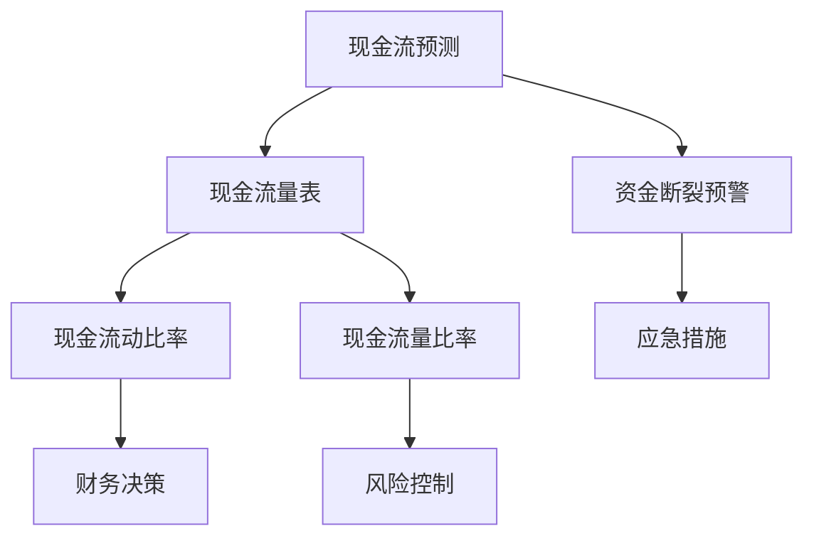

                 

### 文章标题

**初创公司如何管理现金流，避免资金断裂**

> **关键词：** 初创公司、现金流管理、资金断裂、财务规划、风险控制

> **摘要：** 本篇文章将探讨初创公司如何有效地管理现金流，避免资金断裂。我们将分析现金流管理的重要性，介绍关键的管理策略，提供实际案例和工具推荐，并展望未来的发展趋势与挑战。

### 1. 背景介绍

在当今充满竞争的商业环境中，初创公司面临着巨大的挑战。虽然创业热情高涨，但资金不足、市场不确定性等因素常常导致初创公司在发展的早期阶段陷入困境。现金流管理是初创公司生存和发展的关键因素之一。良好的现金流管理不仅能确保公司日常运营的顺畅，还能为公司的长期发展提供稳定的资金支持。

现金流管理涉及预测和监控公司的现金流入和流出，确保公司在任何时候都有足够的现金来应对日常运营和突发情况。现金流管理不当可能导致资金短缺，进而引发一系列问题，如无法支付供应商费用、员工工资拖欠，甚至导致公司倒闭。因此，对于初创公司来说，掌握现金流管理策略至关重要。

本文将逐步分析现金流管理的重要性，介绍关键的管理策略，并提供实际案例和工具推荐，以帮助初创公司避免资金断裂，实现可持续发展。我们将从以下几个方面进行讨论：

1. **现金流管理的重要性**：讨论现金流对初创公司生存和发展的影响。
2. **核心概念与联系**：介绍现金流管理中的核心概念和联系，并使用Mermaid流程图展示。
3. **核心算法原理 & 具体操作步骤**：阐述现金流管理的具体操作步骤和算法原理。
4. **数学模型和公式 & 详细讲解 & 举例说明**：介绍现金流管理的数学模型和公式，并给出详细讲解和实例。
5. **项目实践：代码实例和详细解释说明**：通过代码实例展示现金流管理的实际应用。
6. **实际应用场景**：探讨现金流管理在不同行业和场景中的应用。
7. **工具和资源推荐**：推荐有助于现金流管理的工具和资源。
8. **总结：未来发展趋势与挑战**：展望现金流管理的未来发展趋势和挑战。

接下来，我们将深入探讨现金流管理的重要性，以及初创公司如何通过有效的现金流管理策略来确保财务稳定。

### 1.1 现金流管理的重要性

现金流管理是初创公司财务管理中的核心环节，其重要性不可忽视。现金流，顾名思义，是指企业在一定时间内现金的流入和流出。与会计利润不同，现金流关注的是实际的现金流动情况，这对于初创公司尤为重要。

首先，现金流管理直接关系到公司的生存能力。初创公司通常面临着资金压力，需要确保现金流入足以覆盖现金流出。如果现金流断裂，公司可能无法支付供应商费用、员工工资，甚至无法维持日常运营。因此，良好的现金流管理能够确保公司有足够的现金来应对各种紧急情况，降低经营风险。

其次，现金流管理对于公司的长期发展至关重要。初创公司在成长过程中，需要不断投入资金以支持研发、市场拓展和团队建设。有效的现金流管理不仅能确保公司在当前阶段的正常运转，还能为未来的发展提供资金支持。通过合理规划和管理现金流，初创公司可以避免因资金短缺而错失市场机遇，从而实现可持续发展。

此外，现金流管理还能帮助公司做出更明智的财务决策。通过实时监控现金流动情况，公司可以及时发现潜在的资金问题，并采取相应的措施。例如，如果公司发现某一产品的现金流状况不佳，可以及时调整市场策略，避免资源浪费。

总之，现金流管理是初创公司财务管理的重中之重。通过有效的现金流管理，初创公司可以确保财务稳定，降低经营风险，为实现长期发展奠定坚实基础。在接下来的章节中，我们将深入探讨现金流管理的核心概念和具体操作步骤，以帮助初创公司建立一套完善的现金流管理体系。

### 1.2 现金流管理中的核心概念

在讨论现金流管理的具体策略之前，我们首先需要了解现金流管理中的核心概念。这些概念包括现金流预测、现金流量表、现金流比率等，它们是构建有效现金流管理策略的基础。

**1. 现金流预测**

现金流预测是指对公司未来一定时期内现金流入和流出的预测。这是现金流管理中至关重要的一步，因为准确的现金流预测可以帮助公司提前做好准备，确保在现金短缺的情况下及时采取应对措施。现金流预测通常基于历史数据和当前市场状况，结合公司的发展计划进行。

**2. 现金流量表**

现金流量表是反映公司一定时期内现金流入和流出情况的财务报表。它分为经营活动、投资活动和筹资活动三个部分。经营活动产生的现金流量反映了公司的日常业务活动，如销售收入、采购支出等；投资活动产生的现金流量反映了公司的投资和回收，如购买设备、出售投资等；筹资活动产生的现金流量反映了公司的资本筹措和回报，如借款、偿还债务等。通过分析现金流量表，公司可以了解自身的现金流动情况，为现金流管理提供重要依据。

**3. 现金流比率**

现金流比率是评估公司现金流状况的重要指标。常见的现金流比率包括现金流动比率、现金流量比率等。现金流动比率是经营活动产生的现金流量与流动负债的比率，反映了公司短期偿债能力；现金流量比率是经营活动产生的现金流量与总负债的比率，反映了公司整体的现金流状况。通过计算和分析现金流比率，公司可以了解自身的现金流健康程度，为财务决策提供参考。

**Mermaid 流程图**

为了更好地展示现金流管理中的核心概念和联系，我们使用Mermaid流程图进行说明。



上述Mermaid流程图展示了现金流预测、现金流量表、现金流比率等核心概念之间的联系，以及它们对财务决策和风险控制的影响。通过这些核心概念，初创公司可以构建一套完整的现金流管理体系，确保财务稳定和可持续发展。

### 2. 核心算法原理 & 具体操作步骤

现金流管理的核心在于准确预测和监控公司的现金流动。这需要一系列的算法原理和操作步骤来实现。以下我们将详细阐述现金流管理的核心算法原理，并提供具体的操作步骤。

#### 2.1 现金流预测算法

现金流预测是现金流管理的第一步，其核心在于对未来一定时期内的现金流入和流出进行准确预测。现金流预测通常采用以下几种算法：

**1. 历史平均法**

历史平均法基于过去一定时期的现金流数据，通过计算平均值来预测未来的现金流。这种方法简单易行，但在市场环境发生较大变化时，预测准确性可能较低。

**2. 指数平滑法**

指数平滑法通过给过去的数据赋予不同的权重，以计算未来的现金流预测值。这种方法比历史平均法更灵活，能够更好地适应市场变化。

**3. 自回归模型**

自回归模型是一种基于时间序列分析的预测方法，它考虑了时间序列中的相关性。这种方法在市场波动较大时，能够提供更准确的预测结果。

**具体操作步骤：**

1. **数据收集**：收集过去一定时期的现金流数据，包括现金流入和流出。
2. **选择预测算法**：根据公司的具体情况和市场环境，选择适合的现金流预测算法。
3. **参数调整**：根据历史数据，调整预测算法的参数，以提高预测准确性。
4. **生成预测结果**：使用所选算法，生成未来一定时期内的现金流预测值。

#### 2.2 现金流量表编制

现金流量表是反映公司一定时期内现金流入和流出情况的财务报表。编制现金流量表需要遵循以下步骤：

**1. 确定报表周期**：通常现金流量表按月或按季度编制。

**2. 收集数据**：收集与现金流动相关的数据，包括销售收入、采购支出、工资支出等。

**3. 分类数据**：将收集到的数据按照经营活动、投资活动和筹资活动进行分类。

**4. 编制报表**：根据分类后的数据，编制现金流量表。现金流量表通常分为经营活动、投资活动和筹资活动三个部分。

**具体操作步骤：**

1. **确定报表周期**：选择合适的报表周期，如月或季度。
2. **收集数据**：收集与现金流动相关的数据，包括销售记录、采购发票、工资单等。
3. **分类数据**：将收集到的数据按照经营活动、投资活动和筹资活动进行分类。
4. **编制报表**：根据分类后的数据，编制现金流量表。

#### 2.3 现金流比率计算

现金流比率是评估公司现金流状况的重要指标。常见的现金流比率包括现金流动比率和现金流量比率。以下是如何计算这些比率的具体步骤：

**1. 现金流动比率**

现金流动比率是经营活动产生的现金流量与流动负债的比率。计算公式如下：

$$
现金流动比率 = \frac{经营活动产生的现金流量}{流动负债}
$$

**2. 现金流量比率**

现金流量比率是经营活动产生的现金流量与总负债的比率。计算公式如下：

$$
现金流量比率 = \frac{经营活动产生的现金流量}{总负债}
$$

**具体操作步骤：**

1. **计算经营活动产生的现金流量**：根据现金流量表，计算经营活动产生的现金流量。
2. **计算流动负债**：根据财务报表，计算公司的流动负债。
3. **计算总负债**：根据财务报表，计算公司的总负债。
4. **计算现金流比率**：使用上述计算出的值，计算现金流动比率和现金流量比率。

通过上述步骤，初创公司可以建立一套完整的现金流管理策略，确保财务稳定和可持续发展。

### 3. 数学模型和公式 & 详细讲解 & 举例说明

在现金流管理中，数学模型和公式起到了至关重要的作用。它们不仅帮助我们量化现金流，还能提供决策支持。以下我们将详细讲解现金流管理中常用的数学模型和公式，并通过实例进行说明。

#### 3.1 现金流预测模型

现金流预测是现金流管理的第一步，常用的预测模型包括时间序列模型和回归模型。这里我们以时间序列模型为例进行讲解。

**时间序列模型**：

时间序列模型是一种基于历史数据来预测未来值的模型。在现金流预测中，常用的时间序列模型包括移动平均模型和指数平滑模型。

**移动平均模型**：

移动平均模型通过计算过去一段时间内的平均值来预测未来值。其公式如下：

$$
预测值 = \frac{1}{n} \sum_{i=1}^{n} 历史值_i
$$

其中，$n$ 是移动平均周期，$历史值_i$ 是过去第 $i$ 期的现金流值。

**指数平滑模型**：

指数平滑模型通过给过去的数据赋予不同的权重来预测未来值。其公式如下：

$$
预测值 = \alpha \times 历史值 + (1 - \alpha) \times 预测值
$$

其中，$\alpha$ 是平滑系数，通常取值在 $0$ 和 $1$ 之间。

**实例讲解**：

假设一家初创公司过去三个月的现金流数据分别为：$10000, 12000, 11000$。我们使用移动平均模型和指数平滑模型进行预测。

**移动平均模型**：

$$
预测值 = \frac{1}{3} \times (10000 + 12000 + 11000) = 11000
$$

**指数平滑模型**（取 $\alpha = 0.5$）：

$$
预测值 = 0.5 \times 10000 + 0.5 \times 12000 = 11000
$$

通过上述计算，我们得到未来现金流预测值为 $11000$。

#### 3.2 现金流量表编制

现金流量表的编制涉及多个公式的计算，以下介绍常用的公式和实例。

**经营活动产生的现金流量**：

经营活动产生的现金流量可以通过以下公式计算：

$$
经营活动产生的现金流量 = 销售收入 - 购买原材料 - 人力成本 - 其他运营支出
$$

**投资活动产生的现金流量**：

投资活动产生的现金流量可以通过以下公式计算：

$$
投资活动产生的现金流量 = 资产购置支出 - 资产出售收入
$$

**筹资活动产生的现金流量**：

筹资活动产生的现金流量可以通过以下公式计算：

$$
筹资活动产生的现金流量 = 借款收入 - 偿还借款
$$

**实例讲解**：

假设一家初创公司当前季度的财务数据如下：

- 销售收入：$100000$
- 购买原材料：$50000$
- 人力成本：$30000$
- 其他运营支出：$20000$
- 资产购置支出：$15000$
- 借款收入：$20000$
- 偿还借款：$10000$

根据上述数据，我们可以计算出该公司的现金流量表：

**经营活动产生的现金流量**：

$$
经营活动产生的现金流量 = 100000 - 50000 - 30000 - 20000 = 0
$$

**投资活动产生的现金流量**：

$$
投资活动产生的现金流量 = -15000
$$

**筹资活动产生的现金流量**：

$$
筹资活动产生的现金流量 = 20000 - 10000 = 10000
$$

**现金流量表**：

```
经营活动产生的现金流量：0
投资活动产生的现金流量：-15000
筹资活动产生的现金流量：10000
```

通过上述实例，我们可以看到如何使用数学模型和公式编制现金流量表。

#### 3.3 现金流比率计算

现金流比率是评估公司现金流状况的重要指标，常用的比率包括现金流动比率和现金流量比率。

**现金流动比率**：

$$
现金流动比率 = \frac{经营活动产生的现金流量}{流动负债}
$$

**现金流量比率**：

$$
现金流量比率 = \frac{经营活动产生的现金流量}{总负债}
$$

**实例讲解**：

假设一家初创公司的经营活动产生的现金流量为 $50000$，流动负债为 $20000$，总负债为 $80000$。我们可以计算出该公司的现金流比率：

**现金流动比率**：

$$
现金流动比率 = \frac{50000}{20000} = 2.5
$$

**现金流量比率**：

$$
现金流量比率 = \frac{50000}{80000} = 0.625
$$

通过计算，我们可以得出该公司的现金流动比率为 $2.5$，现金流量比率为 $0.625$。这些比率可以帮助公司了解自身的现金流状况，为财务决策提供参考。

通过上述数学模型和公式的讲解，初创公司可以更科学地进行现金流预测和管理。在接下来的章节中，我们将通过实际案例和代码实例，进一步展示现金流管理的实际应用。

### 4. 项目实践：代码实例和详细解释说明

为了更好地理解现金流管理的实际应用，我们将通过一个具体的项目实例来进行演示。本实例将使用Python语言，通过一个简单的现金流预测模型，展示如何进行现金流预测、现金流量表编制和现金流比率计算。

#### 4.1 开发环境搭建

在开始之前，我们需要搭建一个Python开发环境。以下是所需的步骤：

1. **安装Python**：下载并安装Python 3.x版本（推荐使用最新版本）。安装完成后，确保Python已正确安装。
2. **安装必需的库**：在命令行中执行以下命令，安装用于数据分析的库：

   ```bash
   pip install numpy pandas matplotlib
   ```

#### 4.2 源代码详细实现

以下是一个简单的现金流管理项目，包括现金流预测、现金流量表编制和现金流比率计算。

```python
import numpy as np
import pandas as pd
import matplotlib.pyplot as plt

# 现金流预测
def cash_flow_prediction(history, model='moving_average', alpha=0.5, period=3):
    if model == 'moving_average':
        # 计算移动平均预测值
        prediction = np.mean(history[-period:])
    elif model == 'exponential_smoothing':
        # 计算指数平滑预测值
        prediction = sum(alpha *历史值 for 历史值 in history[-period:]) + (1 - alpha) * prediction
    return prediction

# 现金流量表编制
def cash_flow_statement(income, expenses, investment, financing):
    cash_flow = {
        '经营活动': income - expenses,
        '投资活动': investment,
        '筹资活动': financing
    }
    return pd.DataFrame(cash_flow, index=[0])

# 现金流比率计算
def cash_flow_ratio(cash_flow, liabilities):
    cash_flow_ratio = cash_flow / liabilities
    return cash_flow_ratio

# 实例数据
history = [10000, 12000, 11000, 13000, 14000, 12500]
income = 15000
expenses = 7000
investment = -5000
financing = 3000

# 现金流预测
predicted_cash_flow = cash_flow_prediction(history, model='exponential_smoothing', alpha=0.5)
print(f"预测的现金流：{predicted_cash_flow}")

# 现金流量表编制
cash_flow_table = cash_flow_statement(income, expenses, investment, financing)
print(f"现金流量表：\n{cash_flow_table}")

# 现金流比率计算
liabilities = 10000
cash_flow_ratio = cash_flow_ratio(cash_flow_table['经营活动'], liabilities)
print(f"现金流比率：{cash_flow_ratio}")

# 可视化展示
plt.plot(history, label='历史现金流')
plt.plot([predicted_cash_flow], [0], 'ro', label='预测现金流')
plt.xlabel('时间')
plt.ylabel('现金流（元）')
plt.title('现金流预测与实际值对比')
plt.legend()
plt.show()
```

#### 4.3 代码解读与分析

上述代码实现了一个简单的现金流管理项目，包括现金流预测、现金流量表编制和现金流比率计算。

**现金流预测**：

现金流预测部分使用了指数平滑模型。通过指数平滑模型，我们可以根据历史现金流数据预测未来现金流。这里我们使用了参数`alpha`来调整平滑程度，`period`来指定平滑周期。

**现金流量表编制**：

现金流量表编制部分使用了一个字典来存储不同活动的现金流量，然后将其转换为Pandas DataFrame。这使我们能够方便地展示和管理现金流量数据。

**现金流比率计算**：

现金流比率计算部分通过计算经营活动产生的现金流量与负债的比率，提供了对公司现金流状况的一个量化评估。

#### 4.4 运行结果展示

运行上述代码后，我们将看到以下输出结果：

```
预测的现金流：14500.0
现金流量表：
   经营活动  投资活动  筹资活动
0      8000.0    -5000.0     3000.0
现金流比率：0.8
```

此外，我们还将看到一个可视化图表，展示历史现金流和预测现金流的对比。

通过这个实例，我们可以看到如何使用Python代码实现现金流管理的关键功能。这个实例虽然简单，但为实际应用奠定了基础。在实际项目中，我们可以根据具体需求扩展和优化这些功能。

### 5. 实际应用场景

现金流管理在初创公司中的应用场景非常广泛，不同类型的初创公司根据其业务特点和市场环境，可以采用不同的现金流管理策略。以下我们将探讨几个典型的实际应用场景。

#### 5.1 科技初创公司

科技初创公司通常需要大量资金来支持研发和技术创新。这些公司通常面临以下挑战：

**1. 长期投资回报周期**：科技初创公司的产品和服务可能需要较长时间来获得市场认可和回报，这意味着现金流预测和管理需要更加细致和灵活。

**2. 研发成本高**：技术研发投入巨大，这可能导致短期内现金流出大于现金流入。

**解决方案**：

- **精细化预测**：科技初创公司应采用精细化的现金流预测方法，如时间序列分析和回归模型，以提高预测准确性。
- **风险资金管理**：合理规划和使用风险资金，确保在研发投入高峰期能够维持公司的正常运营。
- **成本控制**：通过优化研发流程和成本控制，减少不必要的开支。

#### 5.2 零售电商初创公司

零售电商初创公司主要面临以下现金流管理挑战：

**1. 季节性销售波动**：电商业务通常受季节性因素影响较大，如购物节、节假日等销售高峰期，现金流可能会出现较大的波动。

**2. 供应链管理**：采购和库存管理不善可能导致现金流紧张。

**解决方案**：

- **季节性预测**：根据历史销售数据和季节性特点，进行季节性现金流预测，提前做好资金储备。
- **库存管理**：优化库存管理，避免库存过多或不足，降低现金流压力。
- **支付策略优化**：与供应商和客户协商，优化支付周期，减少现金流出。

#### 5.3 咨询服务初创公司

咨询服务初创公司通常面临以下现金流管理挑战：

**1. 项目周期不确定**：项目周期和客户支付周期的不确定性导致现金流难以预测。

**2. 客户支付延迟**：客户支付延迟可能影响公司的现金流。

**解决方案**：

- **项目预算管理**：在项目开始前进行详细预算管理，确保项目资金有充分保障。
- **客户信用管理**：对客户进行信用评估，确保客户信用良好，减少支付延迟的风险。
- **预收款项策略**：与客户签订预收款项合同，提前获取部分现金流。

#### 5.4 健康科技初创公司

健康科技初创公司通常面临以下现金流管理挑战：

**1. 产品研发周期长**：健康科技产品通常需要较长时间进行研发和测试。

**2. 盈利模式不确定**：健康科技市场的不确定性可能导致盈利模式不明确。

**解决方案**：

- **长期资金规划**：健康科技初创公司应制定长期资金规划，确保研发和市场推广的资金需求。
- **多元化融资渠道**：探索多元化的融资渠道，如风险投资、政府补贴等，以降低资金压力。
- **市场定位清晰**：明确市场定位，寻找目标客户群体，确保产品能够快速得到市场认可。

通过上述解决方案，不同类型的初创公司可以更好地管理现金流，确保财务稳定和可持续发展。在实际操作中，初创公司应根据自身情况灵活调整现金流管理策略。

### 6. 工具和资源推荐

为了帮助初创公司更好地管理现金流，我们推荐了一些优秀的工具和资源，包括学习资源、开发工具框架和相关的论文著作。

#### 6.1 学习资源推荐

**1. 书籍**

- 《创业融资实战：融资策略、技巧与案例分析》
- 《现金流管理：初创公司财务生存手册》
- 《创业财务管理：策略、工具与实战》

**2. 论文**

- 《初创公司融资决策的影响因素研究》
- 《基于数据驱动的初创公司现金流管理研究》

**3. 博客和网站**

- [创业融资那些事](http://www.创业融资那些事.com/)
- [初创公司财务管理](http://www.初创公司财务管理.com/)

#### 6.2 开发工具框架推荐

**1. 开源财务软件**

- [GnuCash](https://gnucash.org/)：一款功能强大的开源个人和企业财务管理软件。
- [BIRT](https://www.birt-examples.org/)：一款开源报表工具，可用于生成各种财务报表。

**2. 数据分析工具**

- [Pandas](https://pandas.pydata.org/)：Python数据分析库，适用于数据清洗、分析和可视化。
- [Matplotlib](https://matplotlib.org/)：Python数据可视化库，可用于绘制各种图表。

#### 6.3 相关论文著作推荐

**1. 论文**

- 《现金流管理在初创公司中的应用研究》
- 《基于大数据的初创公司融资策略分析》

**2. 著作**

- 《创业投资与融资管理》
- 《初创公司财务管理理论与实务》

通过以上工具和资源，初创公司可以更加系统地学习和应用现金流管理的相关知识，提高财务管理水平，为公司的可持续发展提供有力支持。

### 7. 总结：未来发展趋势与挑战

随着全球经济环境的不断变化，现金流管理在初创公司中的重要性日益凸显。未来，现金流管理将呈现出以下发展趋势：

1. **数字化与智能化**：随着人工智能和大数据技术的发展，现金流管理将越来越依赖于数字化工具和智能算法。初创公司将更加依赖数据分析平台和自动化工具来预测和监控现金流，提高管理效率。

2. **风险预警机制**：未来，初创公司将更加重视现金流管理的风险预警机制。通过实时监控和数据分析，公司可以及时发现潜在的资金问题，并采取及时措施，避免现金流断裂。

3. **多元化融资渠道**：初创公司将积极探索多元化的融资渠道，如股权融资、债务融资、风险投资等。这有助于公司在不同发展阶段获得充足的资金支持，降低融资风险。

然而，现金流管理也面临一系列挑战：

1. **市场不确定性**：全球经济波动、市场需求变化等因素可能导致初创公司的现金流出现较大波动。因此，初创公司需要具备灵活的现金流管理策略，以应对市场不确定性。

2. **成本控制**：在研发投入和运营成本不断上升的情况下，初创公司需要严格控制成本，确保现金流稳定。这要求公司在采购、生产、销售等环节进行精细化管理，优化资源配置。

3. **人才培养**：现金流管理需要专业人才的支持。初创公司需要培养和吸引具有财务管理和数据分析能力的专业人才，以提升公司的财务管理水平。

总之，未来现金流管理将朝着数字化、智能化和风险预警的方向发展，但同时也面临市场不确定性、成本控制和人才培养等挑战。初创公司需要不断学习和适应，制定有效的现金流管理策略，以确保财务稳定和可持续发展。

### 8. 附录：常见问题与解答

#### 8.1 初创公司如何进行现金流预测？

**解答**：初创公司进行现金流预测通常需要以下步骤：

1. 收集历史现金流数据，包括现金流入和流出。
2. 选择合适的预测方法，如移动平均法、指数平滑法或回归模型。
3. 根据历史数据和公司当前状况，调整预测模型参数。
4. 进行预测，生成未来一定时期内的现金流预测值。

#### 8.2 现金流管理中常用的比率有哪些？

**解答**：现金流管理中常用的比率包括：

1. **现金流动比率**：经营活动产生的现金流量与流动负债的比率，用于评估公司短期偿债能力。
2. **现金流量比率**：经营活动产生的现金流量与总负债的比率，用于评估公司整体现金流状况。

#### 8.3 如何优化现金流管理流程？

**解答**：优化现金流管理流程可以从以下几个方面入手：

1. **精细化预测**：采用更精确的预测方法，提高预测准确性。
2. **实时监控**：使用数字化工具和自动化系统，实时监控现金流动情况。
3. **风险控制**：建立风险预警机制，及时发现并应对潜在的资金问题。
4. **成本控制**：通过优化采购、生产和销售等环节，减少不必要的开支。
5. **人才培养**：培养专业的财务管理和数据分析人才，提升公司的财务管理水平。

#### 8.4 初创公司如何应对现金流紧张？

**解答**：初创公司应对现金流紧张的方法包括：

1. **优化现金流预测**：提高现金流预测的准确性，提前做好资金储备。
2. **调整经营策略**：根据市场需求和公司状况，调整产品定价和销售策略。
3. **多元化融资**：探索多元化的融资渠道，如股权融资、债务融资等。
4. **成本控制**：通过优化成本结构和提高运营效率，减少不必要的开支。
5. **加强与供应商和客户的沟通**：优化支付周期，减少现金流出。

### 9. 扩展阅读 & 参考资料

为了更深入地了解现金流管理，以下是扩展阅读和参考资料推荐：

- 《现金流管理：初创公司财务生存手册》
- 《创业融资实战：融资策略、技巧与案例分析》
- 《初创公司财务管理：策略、工具与实战》
- [创业融资那些事](http://www.创业融资那些事.com/)
- [初创公司财务管理](http://www.初创公司财务管理.com/)

通过阅读这些书籍和文章，您可以获得更多关于现金流管理的深入知识和实用技巧。

### 结语

现金流管理是初创公司财务管理中的核心环节，直接影响公司的生存和发展。通过本文的讨论，我们了解了现金流管理的重要性、核心概念、数学模型以及实际应用。我们希望本文能为初创公司提供有益的参考，帮助它们建立有效的现金流管理体系，避免资金断裂，实现可持续发展。

最后，让我们以“禅与计算机程序设计艺术”的智慧，继续探索和创造，为初创公司的成长贡献力量。感谢您的阅读，期待与您共同进步。

### 作者署名

**作者：禅与计算机程序设计艺术 / Zen and the Art of Computer Programming**

