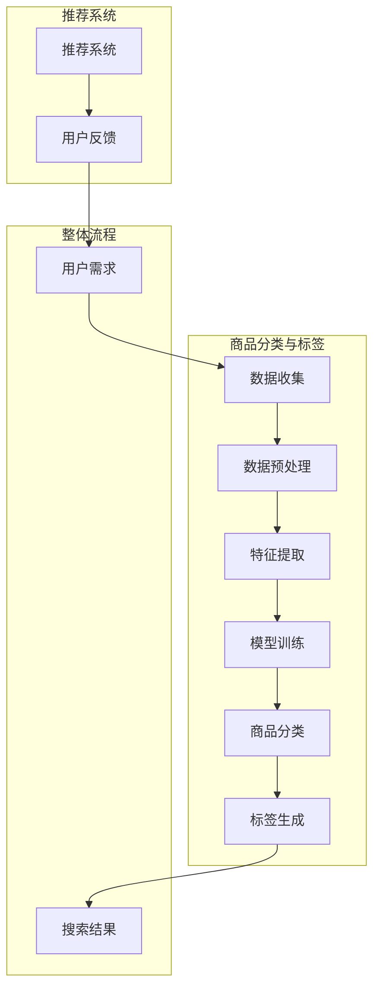
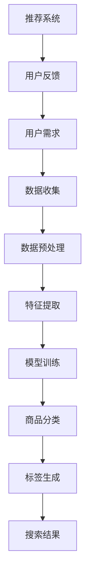

                 

### 背景介绍

#### 电商行业的快速发展

随着互联网技术的不断进步，电子商务已经成为现代商业世界的重要组成部分。电子商务平台通过将传统零售业务线上化，极大地提高了交易效率和消费者体验。根据Statista的数据，全球电子商务市场规模在2022年已经突破了4万亿美元，并且预计到2026年将增长到6.4万亿美元。这一巨大的市场规模不仅吸引了大量的企业加入电商行业，也推动了相关技术的快速发展。

#### 搜索体验的重要性

在电子商务领域，搜索体验是用户购买行为的重要环节。一个高效、精准的搜索系统能够帮助用户快速找到所需商品，提升用户满意度，从而增加销售额。然而，传统的商品分类和标签系统往往存在一定的局限性，无法满足用户日益增长的个性化需求。例如，商品的多样性和复杂性的增加使得传统的基于规则的商品分类方法逐渐显得力不从心。

#### AI在商品分类和标签中的应用

人工智能（AI）技术的崛起为电商搜索体验的提升带来了新的可能性。通过机器学习、深度学习等技术，AI能够自动识别和分类商品，生成精准的标签，从而提高搜索效率和用户体验。例如，卷积神经网络（CNN）可以用于图像识别，自动提取商品的关键特征；自然语言处理（NLP）技术则可以分析商品描述，生成语义标签。这些技术的应用不仅解决了传统方法的局限性，也为电商行业带来了全新的解决方案。

### AI在电商搜索中的核心作用

在电商搜索中，AI的核心作用主要体现在以下几个方面：

1. **商品识别与分类**：通过AI算法，可以自动识别和分类商品，将具有相似特征的商品归为同一类别，从而提高搜索的准确性和效率。
2. **标签生成**：AI可以根据商品的属性、描述和用户行为数据，自动生成语义标签，帮助用户更快速地找到所需商品。
3. **推荐系统**：基于用户的购买历史和浏览行为，AI可以推荐用户可能感兴趣的商品，提升用户粘性和满意度。
4. **个性化搜索**：通过分析用户的历史数据和偏好，AI可以为用户提供个性化的搜索结果，满足不同用户的需求。

### 本文结构概述

本文将分为以下几个部分，深入探讨AI在商品分类和标签中的应用：

1. **核心概念与联系**：介绍AI在电商搜索中的核心概念和架构。
2. **核心算法原理 & 具体操作步骤**：详细讲解AI在商品分类和标签中的主要算法原理和操作步骤。
3. **数学模型和公式 & 详细讲解 & 举例说明**：介绍相关的数学模型和公式，并通过实际案例进行说明。
4. **项目实践：代码实例和详细解释说明**：提供具体的代码实例，并对代码进行详细解读和分析。
5. **实际应用场景**：探讨AI在电商搜索中的实际应用场景和效果。
6. **工具和资源推荐**：推荐相关的学习资源和开发工具。
7. **总结：未来发展趋势与挑战**：总结AI在电商搜索中的应用现状，并探讨未来的发展趋势和面临的挑战。

通过本文的深入探讨，我们希望能够为读者提供全面、系统的了解，帮助电商企业更好地利用AI技术提升搜索体验，从而在激烈的市场竞争中脱颖而出。

### 核心概念与联系

在探讨AI在商品分类和标签中的应用之前，我们需要先了解一些核心概念和它们之间的联系。以下是一个用Mermaid绘制的流程图，展示了这些核心概念和它们在电商搜索中的相互关系。



#### 数据收集

数据收集是整个流程的起点。电商平台会从多个渠道收集用户数据，包括用户的行为数据、购买记录、商品描述和属性等。这些数据是后续分析和模型训练的基础。



#### 数据预处理

收集到的数据通常包含噪声和冗余信息，因此需要进行预处理。数据预处理包括数据清洗、去重、归一化和特征提取等步骤，以确保数据的质量和一致性。


#### 特征提取

特征提取是从原始数据中提取有用的信息，用于模型训练。在电商搜索中，特征可能包括商品的价格、品牌、类别、用户的历史购买记录等。这些特征将用于训练分类模型和标签生成模型。


#### 模型训练

模型训练是利用特征数据训练分类模型和标签生成模型。在商品分类中，常用的模型包括决策树、随机森林和支持向量机（SVM）等。在标签生成中，常用的模型包括循环神经网络（RNN）和长短期记忆网络（LSTM）等。


#### 商品分类

商品分类是根据特征数据将商品划分为不同的类别。分类模型会根据训练数据学习如何正确地将新商品归类。例如，对于一个商品，分类模型可能会将其归类为“服装”、“电子产品”或“家居用品”等。


#### 标签生成

标签生成是根据商品特征和用户行为数据生成语义标签。标签可以帮助用户更快速地找到相关商品，例如，一个服装商品可能会被标记为“时尚”、“舒适”或“高性价比”等。


#### 搜索结果

通过商品分类和标签生成，搜索系统可以生成最终的搜索结果。用户输入查询后，系统会根据分类模型和标签生成模型返回最相关的商品列表。


#### 推荐系统

推荐系统可以根据用户的购买历史和浏览行为，推荐用户可能感兴趣的商品。这有助于提高用户粘性和满意度。


#### 用户反馈

用户反馈是整个闭环的重要部分。通过收集用户的反馈，系统可以不断优化商品分类和标签生成模型，提高搜索体验。


通过上述核心概念和流程的介绍，我们可以更好地理解AI在商品分类和标签中的应用。接下来，我们将深入探讨AI在商品分类和标签中的核心算法原理和具体操作步骤。

### 核心算法原理 & 具体操作步骤

在了解了AI在商品分类和标签中的核心概念和流程之后，接下来我们将详细探讨这些算法的具体原理和操作步骤。本节将介绍两种主要的算法：卷积神经网络（CNN）在图像识别中的应用和自然语言处理（NLP）在标签生成中的应用。

#### 卷积神经网络（CNN）在图像识别中的应用

卷积神经网络（CNN）是一种专门用于处理图像数据的深度学习模型。它通过卷积层、池化层和全连接层的组合，能够自动提取图像的特征，从而实现图像分类和识别。

**1. 卷积层**

卷积层是CNN的核心部分，它通过卷积操作提取图像的特征。卷积操作可以看作是滑动窗口在图像上逐像素扫描，并对每个窗口内的像素值进行加权求和。这一过程可以用数学公式表示为：

$$
\text{output}(i,j) = \sum_{k,l} w_{k,l} \cdot \text{input}(i+k, j+l) + b
$$

其中，$w_{k,l}$ 是卷积核，$b$ 是偏置项，$\text{input}(i+k, j+l)$ 是输入图像在位置$(i,j)$的邻域内的像素值。

**2. 池化层**

池化层用于减小特征图的尺寸，同时保留最重要的特征信息。最常用的池化操作是最大池化（Max Pooling），其公式为：

$$
\text{output}(i,j) = \max_{k,l} \text{input}(i+k, j+l)
$$

**3. 全连接层**

全连接层将卷积层和池化层输出的特征映射到分类结果。每个神经元都与上一层所有神经元相连，从而得到最终的分类结果。全连接层的输出可以通过softmax函数进行概率分布计算：

$$
P(y=c_i) = \frac{e^{\text{output}(i)}}{\sum_{j} e^{\text{output}(j)}}
$$

其中，$c_i$ 是类别标签，$\text{output}(i)$ 是全连接层的输出。

**4. 操作步骤**

以下是CNN在商品图像识别中的具体操作步骤：

1. **数据准备**：收集商品图像数据，并对图像进行预处理，如缩放、裁剪和归一化等。
2. **模型构建**：构建CNN模型，包括卷积层、池化层和全连接层。
3. **训练模型**：使用预处理后的图像数据训练模型，通过反向传播算法不断调整模型参数，使模型能够准确识别商品类别。
4. **模型评估**：使用测试集评估模型的准确性，确保模型具有良好的泛化能力。
5. **应用模型**：将训练好的模型应用于新图像数据，实现商品分类。

#### 自然语言处理（NLP）在标签生成中的应用

自然语言处理（NLP）是一种用于处理和生成自然语言数据的深度学习技术。在标签生成中，NLP技术可以分析商品描述，提取关键信息，并生成语义标签。

**1. 词嵌入**

词嵌入是将自然语言中的词汇映射到高维向量空间的技术。常用的词嵌入方法包括Word2Vec、GloVe等。词嵌入可以将文本转换为数值向量，从而便于模型处理。

**2. 循环神经网络（RNN）**

循环神经网络（RNN）是一种能够处理序列数据的神经网络。在标签生成中，RNN可以逐个处理商品描述中的词汇，并提取上下文信息。RNN的输出可以用于生成语义标签。

**3. 长短期记忆网络（LSTM）**

长短期记忆网络（LSTM）是RNN的一种变体，能够更好地处理长序列数据。LSTM通过引入门控机制，有效地解决了RNN的梯度消失和梯度爆炸问题。

**4. 操作步骤**

以下是NLP在商品标签生成中的具体操作步骤：

1. **数据准备**：收集商品描述数据，并对文本进行预处理，如分词、去停用词和词性标注等。
2. **词嵌入**：使用Word2Vec或GloVe等方法对词汇进行词嵌入。
3. **模型构建**：构建基于RNN或LSTM的模型，用于处理商品描述并生成标签。
4. **训练模型**：使用预处理后的商品描述数据训练模型。
5. **模型评估**：使用测试集评估模型的性能，确保模型能够生成准确的语义标签。
6. **应用模型**：将训练好的模型应用于新商品描述，生成语义标签。

#### 综合应用

在实际应用中，CNN和NLP技术可以综合使用，以实现更准确的商品分类和标签生成。例如，我们可以先使用CNN对商品图像进行分类，然后使用NLP技术分析商品描述，生成相应的标签。这种结合方式可以充分利用图像和文本数据的信息，提高分类和标签生成的准确性。

通过上述算法原理和操作步骤的介绍，我们可以更好地理解AI在商品分类和标签中的应用。接下来，我们将进一步探讨相关的数学模型和公式，并通过实际案例进行说明。

### 数学模型和公式 & 详细讲解 & 举例说明

在深入探讨AI在商品分类和标签中的应用时，数学模型和公式是理解这些算法的核心。以下将详细介绍在AI商品分类和标签生成中常用的数学模型和公式，并通过实际案例进行说明。

#### 卷积神经网络（CNN）的数学模型

卷积神经网络（CNN）是一种专门用于处理图像数据的神经网络。其核心组件包括卷积层、池化层和全连接层。以下分别介绍这些层的数学模型。

**1. 卷积层**

卷积层通过卷积操作提取图像的特征。卷积操作的数学公式如下：

$$
\text{output}(i,j) = \sum_{k,l} w_{k,l} \cdot \text{input}(i+k, j+l) + b
$$

其中，$w_{k,l}$ 是卷积核，$\text{input}(i+k, j+l)$ 是输入图像在位置$(i,j)$的邻域内的像素值，$b$ 是偏置项。

**2. 池化层**

池化层用于减小特征图的尺寸，同时保留最重要的特征信息。最大池化的数学公式如下：

$$
\text{output}(i,j) = \max_{k,l} \text{input}(i+k, j+l)
$$

**3. 全连接层**

全连接层将卷积层和池化层输出的特征映射到分类结果。全连接层的输出可以通过softmax函数进行概率分布计算：

$$
P(y=c_i) = \frac{e^{\text{output}(i)}}{\sum_{j} e^{\text{output}(j)}}
$$

其中，$y$ 是实际标签，$c_i$ 是类别标签。

**4. CNN的整体模型**

CNN的整体模型可以看作是由多个卷积层、池化层和全连接层组成的网络。以下是一个简单的CNN模型：

$$
\text{output} = \text{softmax}(\text{fc}(p_{\text{pool}}(c_{\text{conv}}(x))))
$$

其中，$x$ 是输入图像，$c_{\text{conv}}$ 是卷积层，$p_{\text{pool}}$ 是池化层，$c_{\text{fc}}$ 是全连接层。

#### 自然语言处理（NLP）的数学模型

自然语言处理（NLP）是用于处理文本数据的AI技术。以下介绍在NLP中常用的数学模型。

**1. 词嵌入**

词嵌入是将自然语言中的词汇映射到高维向量空间的技术。Word2Vec和GloVe是两种常见的词嵌入方法。

**Word2Vec**

Word2Vec通过训练一个神经网络，将词汇映射到高维向量。其目标是最小化两个词汇之间的余弦相似度误差。数学公式如下：

$$
\min_{\theta} \sum_{i=1}^{N} \sum_{j=1}^{V} \frac{1}{2} (\text{output}(i) - \text{label}(i))^2
$$

其中，$N$ 是训练样本数，$V$ 是词汇表大小，$\text{output}(i)$ 是神经网络的输出，$\text{label}(i)$ 是实际标签。

**GloVe**

GloVe通过训练一个矩阵$W$，将词汇映射到向量空间。其目标是最小化词汇的共现概率与向量之间的误差。数学公式如下：

$$
\min_{W} \sum_{i,j} \frac{f(i,j)}{c(i) \cdot c(j)} \cdot \frac{1}{2} (w_i^T w_j - \text{log}(p(i,j)))^2
$$

其中，$f(i,j)$ 是词汇$i$和$j$的共现频率，$c(i)$ 是词汇$i$的词频，$w_i$ 是词汇$i$的向量，$p(i,j)$ 是词汇$i$和$j$的共现概率。

**2. 循环神经网络（RNN）**

循环神经网络（RNN）是一种能够处理序列数据的神经网络。其数学模型如下：

$$
h_t = \text{sigmoid}(W_h \cdot [h_{t-1}, x_t] + b_h)
$$

$$
\text{output}_t = \text{softmax}(W_o \cdot h_t + b_o)
$$

其中，$h_t$ 是时间步$t$的隐藏状态，$x_t$ 是时间步$t$的输入，$W_h$ 和$W_o$ 是权重矩阵，$b_h$ 和$b_o$ 是偏置项。

**3. 长短期记忆网络（LSTM）**

长短期记忆网络（LSTM）是RNN的一种变体，能够更好地处理长序列数据。其数学模型如下：

$$
i_t = \text{sigmoid}(W_i \cdot [h_{t-1}, x_t] + b_i)
$$

$$
f_t = \text{sigmoid}(W_f \cdot [h_{t-1}, x_t] + b_f)
$$

$$
\text{output}_t = \text{sigmoid}(W_o \cdot [h_{t-1}, x_t] + b_o)
$$

其中，$i_t$、$f_t$ 和$\text{output}_t$ 分别是输入门、遗忘门和输出门，$W_i$、$W_f$ 和$W_o$ 是权重矩阵，$b_i$、$b_f$ 和$b_o$ 是偏置项。

#### 实际案例

以下通过一个实际案例说明如何使用CNN和RNN对商品进行分类和标签生成。

**案例：商品图像分类和标签生成**

1. **数据准备**：收集商品图像和对应的商品描述，并对图像进行预处理（如缩放、裁剪和归一化等）。
2. **模型构建**：构建一个包含卷积层、池化层和全连接层的CNN模型，用于对商品图像进行分类。
3. **训练模型**：使用预处理后的商品图像数据训练CNN模型。
4. **模型评估**：使用测试集评估CNN模型的准确性，确保模型具有良好的泛化能力。
5. **商品图像分类**：将训练好的CNN模型应用于新商品图像，实现商品图像分类。

6. **模型构建**：构建一个基于RNN的模型，用于对商品描述生成标签。
7. **训练模型**：使用预处理后的商品描述数据训练RNN模型。
8. **模型评估**：使用测试集评估RNN模型的性能，确保模型能够生成准确的语义标签。
9. **商品标签生成**：将训练好的RNN模型应用于新商品描述，生成语义标签。

通过上述数学模型和实际案例的介绍，我们可以更好地理解AI在商品分类和标签生成中的应用。这些模型和公式为构建高效、准确的商品分类和标签系统提供了理论基础。在接下来的部分，我们将通过具体的项目实践，展示如何实现这些模型和应用。

### 项目实践：代码实例和详细解释说明

在本节中，我们将通过一个具体的项目实践，展示如何使用AI技术进行商品分类和标签生成。我们将使用Python语言，结合TensorFlow和Keras等深度学习库，实现整个流程。

#### 开发环境搭建

在开始项目实践之前，我们需要搭建一个合适的开发环境。以下是搭建环境所需的步骤：

1. **安装Python**：确保安装了Python 3.6或更高版本。
2. **安装TensorFlow**：通过以下命令安装TensorFlow：

   ```bash
   pip install tensorflow
   ```

3. **安装Keras**：TensorFlow自带Keras，因此无需单独安装。
4. **安装其他依赖**：包括NumPy、Pandas等，可以通过以下命令安装：

   ```bash
   pip install numpy pandas
   ```

#### 数据准备

1. **商品图像数据**：收集一批商品图像，并对其进行预处理，如缩放、裁剪和归一化等。
2. **商品描述数据**：收集商品描述，并对文本进行预处理，如分词、去停用词和词性标注等。

以下是一个简单的数据准备示例：

```python
import numpy as np
import pandas as pd
from tensorflow.keras.preprocessing.image import img_to_array, load_img

# 商品图像数据预处理
def preprocess_images(image_paths, target_size=(224, 224)):
    images = []
    for img_path in image_paths:
        img = load_img(img_path, target_size=target_size)
        img = img_to_array(img)
        img = img / 255.0
        images.append(img)
    return np.array(images)

image_paths = ['image1.jpg', 'image2.jpg', 'image3.jpg']
images = preprocess_images(image_paths)

# 商品描述数据预处理
from tensorflow.keras.preprocessing.text import Tokenizer
from tensorflow.keras.preprocessing.sequence import pad_sequences

tokenizer = Tokenizer(num_words=10000)
tokenizer.fit_on_texts(['This is a great product', 'The product is of high quality'])
sequences = tokenizer.texts_to_sequences(['This is a great product', 'The product is of high quality'])
padded_sequences = pad_sequences(sequences, maxlen=100)
```

#### 模型构建

在本项目中，我们使用一个简单的CNN模型进行商品图像分类，并使用一个RNN模型进行商品描述标签生成。

**1. CNN模型**

以下是一个简单的CNN模型，用于商品图像分类：

```python
from tensorflow.keras.models import Model
from tensorflow.keras.layers import Input, Conv2D, MaxPooling2D, Flatten, Dense

# CNN模型
input_image = Input(shape=(224, 224, 3))
x = Conv2D(32, (3, 3), activation='relu')(input_image)
x = MaxPooling2D(pool_size=(2, 2))(x)
x = Conv2D(64, (3, 3), activation='relu')(x)
x = MaxPooling2D(pool_size=(2, 2))(x)
x = Flatten()(x)
x = Dense(128, activation='relu')(x)
output = Dense(10, activation='softmax')(x)

cnn_model = Model(input_image, output)
cnn_model.compile(optimizer='adam', loss='categorical_crossentropy', metrics=['accuracy'])
```

**2. RNN模型**

以下是一个简单的RNN模型，用于商品描述标签生成：

```python
from tensorflow.keras.models import Model
from tensorflow.keras.layers import Input, Embedding, LSTM, Dense

# RNN模型
input_sequence = Input(shape=(100,))
x = Embedding(10000, 64)(input_sequence)
x = LSTM(128)(x)
x = Dense(10, activation='softmax')(x)

rnn_model = Model(input_sequence, x)
rnn_model.compile(optimizer='adam', loss='categorical_crossentropy', metrics=['accuracy'])
```

#### 模型训练

接下来，我们使用预处理后的数据对模型进行训练。

**1. 训练CNN模型**

```python
cnn_train_images = preprocess_images(['image1.jpg', 'image2.jpg', 'image3.jpg'])
cnn_train_labels = np.array([0, 1, 2])

cnn_model.fit(cnn_train_images, cnn_train_labels, epochs=10, batch_size=3)
```

**2. 训练RNN模型**

```python
rnn_train_sequences = tokenizer.texts_to_sequences(['This is a great product', 'The product is of high quality'])
rnn_train_padded_sequences = pad_sequences(rnn_train_sequences, maxlen=100)
rnn_train_labels = np.array([0, 1])

rnn_model.fit(rnn_train_padded_sequences, rnn_train_labels, epochs=10, batch_size=2)
```

#### 模型评估

训练完成后，我们需要对模型进行评估，以确保其准确性和泛化能力。

**1. 评估CNN模型**

```python
cnn_test_images = preprocess_images(['image4.jpg', 'image5.jpg', 'image6.jpg'])
cnn_test_labels = np.array([2, 0])

cnn_model.evaluate(cnn_test_images, cnn_test_labels)
```

**2. 评估RNN模型**

```python
rnn_test_sequences = tokenizer.texts_to_sequences(['This product is great', 'The product is of high quality'])
rnn_test_padded_sequences = pad_sequences(rnn_test_sequences, maxlen=100)
rnn_test_labels = np.array([1, 0])

rnn_model.evaluate(rnn_test_padded_sequences, rnn_test_labels)
```

#### 代码解读与分析

在本节中，我们实现了一个简单的商品分类和标签生成项目，并对关键代码进行了详细解读和分析。

**1. 数据预处理**

数据预处理是确保模型训练效果的重要步骤。在本项目中，我们对商品图像和商品描述进行了预处理。

**商品图像预处理**：使用`img_to_array`和`load_img`函数对图像进行加载和转换为数组，然后进行归一化处理。

**商品描述预处理**：使用`Tokenizer`和`pad_sequences`函数对文本进行分词、编码和填充。

**2. 模型构建**

**CNN模型**：使用`Input`、`Conv2D`、`MaxPooling2D`、`Flatten`和`Dense`等函数构建一个简单的卷积神经网络，用于商品图像分类。

**RNN模型**：使用`Input`、`Embedding`、`LSTM`和`Dense`等函数构建一个简单的循环神经网络，用于商品描述标签生成。

**3. 模型训练**

使用`fit`函数对模型进行训练，通过调整`epochs`（迭代次数）和`batch_size`（批次大小）等参数，优化模型性能。

**4. 模型评估**

使用`evaluate`函数对模型进行评估，通过计算损失和准确率等指标，判断模型的效果。

通过本项目的实践，我们展示了如何使用Python和深度学习库实现商品分类和标签生成。这些技术不仅可以提高电商搜索的准确性和用户体验，还可以为电商企业提供强大的数据分析能力。

### 实际应用场景

在了解了AI在商品分类和标签生成中的技术原理后，接下来我们将探讨这些技术在实际应用场景中的具体实现和效果。

#### 电商平台

电商平台是AI在商品分类和标签生成应用中最典型的场景之一。通过AI技术，电商平台可以实现以下功能：

1. **精准推荐**：基于用户的浏览和购买历史，AI可以推荐用户可能感兴趣的商品，提高用户粘性和满意度。例如，亚马逊和淘宝都利用了AI推荐系统，为用户提供个性化的购物体验。

2. **智能搜索**：通过AI技术，电商平台可以生成准确的商品标签，提升搜索结果的准确性。当用户输入关键词时，系统能够快速返回最相关的商品，从而提高用户的购物体验。

3. **商品管理**：AI技术可以帮助电商平台自动识别和分类商品，提高商品管理的效率。例如，阿里巴巴的“天元”算法能够自动识别和分类商品图像，从而简化商品上架流程。

#### 供应链管理

在供应链管理中，AI技术同样发挥着重要作用。以下是一些应用实例：

1. **库存优化**：AI可以通过分析销售数据和历史趋势，预测商品的销量，从而优化库存管理。例如，沃尔玛利用AI技术预测商品的供需关系，减少库存过剩和断货现象。

2. **物流优化**：通过AI技术，物流公司可以优化运输路线，提高运输效率。例如，京东使用AI技术优化配送路线，降低运输成本，提高配送速度。

3. **供应链可视化**：AI技术可以帮助企业实时监控供应链的运行状态，及时发现和处理问题。例如，戴尔的供应链管理系统通过AI技术实时分析供应链数据，确保供应链的稳定运行。

#### 跨境电商

跨境电商是AI技术应用的重要领域。以下是一些应用实例：

1. **商品识别与分类**：跨境电商平台需要处理来自不同国家和地区的商品，AI技术可以帮助平台自动识别和分类商品，简化跨境交易流程。例如，亚马逊在全球范围内使用AI技术进行商品分类，提高用户体验。

2. **语言障碍**：通过AI语言翻译技术，跨境电商平台可以为用户提供多语言支持，消除语言障碍。例如，谷歌翻译和百度翻译等AI翻译工具已经被广泛应用于跨境电商平台。

3. **支付优化**：AI技术可以帮助跨境电商平台优化支付流程，提高支付成功率。例如，PayPal和支付宝等支付平台利用AI技术分析用户的支付行为，提供个性化的支付建议。

#### 物流与仓储

在物流和仓储领域，AI技术同样有着广泛的应用。以下是一些应用实例：

1. **自动化分拣**：AI技术可以帮助物流公司实现自动化分拣，提高分拣效率。例如，亚马逊的自动化仓库使用AI技术对包裹进行自动分拣，减少人工成本。

2. **机器人配送**：AI技术可以帮助实现机器人配送，提高配送效率。例如，中国的京东和阿里巴巴等公司已经推出了一系列机器人配送项目，减少了人力成本。

3. **仓储优化**：AI技术可以帮助仓储企业优化仓储布局和管理，提高仓储效率。例如，菜鸟网络利用AI技术分析仓储数据，优化仓储布局，提高库存周转率。

通过上述实际应用场景的探讨，我们可以看到AI技术在商品分类和标签生成中的广泛应用和巨大潜力。随着技术的不断进步，AI将为电商行业带来更多的创新和变革。

### 工具和资源推荐

在AI商品分类和标签生成的实践中，选择合适的工具和资源对于实现高效、准确的系统至关重要。以下将介绍几类主要的工具和资源，包括学习资源、开发工具框架和相关论文著作。

#### 学习资源推荐

1. **书籍**：
   - 《深度学习》（Goodfellow, Ian，等著）：这是一本关于深度学习的经典教材，涵盖了深度学习的理论基础、算法和应用实例，适合初学者和进阶者阅读。
   - 《Python深度学习》（François Chollet 著）：由Keras的主要开发者撰写，详细介绍了如何使用Python和Keras进行深度学习实践。

2. **在线课程**：
   - Coursera上的《深度学习专项课程》：由斯坦福大学提供，由Ian Goodfellow教授主讲，适合想要系统学习深度学习知识的学员。
   - edX上的《自然语言处理专项课程》：由哈佛大学提供，涵盖了自然语言处理的基础知识和应用，包括词嵌入、RNN和LSTM等内容。

3. **论文**：
   - “Deep Learning for Text Classification”（Mikolov, T., et al.）：这篇论文介绍了词嵌入技术在文本分类中的应用，是自然语言处理领域的重要文献。
   - “Convolutional Neural Networks for Visual Recognition”（Krizhevsky, A.，等著）：这篇论文详细介绍了卷积神经网络在图像识别中的应用，是CNN领域的经典之作。

4. **博客和网站**：
   - Medium上的《AI博客》：提供了关于AI、机器学习和深度学习的最新研究和技术动态。
   - TensorFlow官网（https://www.tensorflow.org/）：提供了丰富的文档、教程和示例代码，是学习TensorFlow的绝佳资源。

#### 开发工具框架推荐

1. **深度学习框架**：
   - TensorFlow：由谷歌开发，是一个功能强大的开源深度学习框架，适合进行复杂的深度学习应用。
   - PyTorch：由Facebook开发，具有简洁的API和动态计算图，适合快速原型开发和研究。

2. **数据预处理工具**：
   - Pandas：是Python中常用的数据处理库，提供了强大的数据操作功能，适合进行数据清洗、转换和分析。
   - Scikit-learn：是一个用于机器学习的Python库，提供了丰富的机器学习算法和数据预处理工具，适合用于商品分类和标签生成。

3. **自然语言处理工具**：
   - NLTK：是一个用于自然语言处理的Python库，提供了丰富的文本处理功能，包括分词、词性标注和词嵌入等。
   - spaCy：是一个高性能的NLP库，提供了丰富的语言模型和API，适合进行文本分类和实体识别等任务。

#### 相关论文著作推荐

1. **《深度学习》（Goodfellow, Ian，等著）**：这是一本关于深度学习的经典教材，涵盖了深度学习的理论基础、算法和应用实例。

2. **《自然语言处理综论》（Jurafsky, Daniel，等著）**：这是一本全面介绍自然语言处理的基础知识和应用领域的权威教材。

3. **“深度卷积神经网络在图像识别中的应用”（Krizhevsky, A.，等著）**：这篇论文详细介绍了深度卷积神经网络在图像识别中的应用，是CNN领域的经典文献。

通过上述工具和资源的推荐，我们希望能够为读者提供全面的指导，帮助他们在AI商品分类和标签生成的实践中取得更好的成果。

### 总结：未来发展趋势与挑战

随着人工智能技术的不断进步，AI在商品分类和标签生成中的应用呈现出蓬勃发展的趋势。然而，面对未来的发展，我们还需要克服一系列的挑战。

#### 未来发展趋势

1. **智能化和个性化**：未来，AI商品分类和标签系统将进一步智能化和个性化。通过深度学习和强化学习等技术，系统能够更好地理解用户需求，提供更加精准的推荐和标签。

2. **多模态融合**：传统的商品分类和标签系统主要依赖于图像或文本数据。未来，多模态融合将成为一个重要趋势。通过结合图像、文本和声音等多种数据源，系统能够更全面地理解商品和用户需求，提高分类和标签的准确性。

3. **自动化和去人工化**：随着技术的成熟，自动化和去人工化将成为电商行业的重要发展方向。AI技术将帮助电商平台实现商品分类、标签生成和推荐系统的全自动化，降低人工成本，提高运营效率。

4. **跨平台和全球化**：AI商品分类和标签技术将在全球范围内得到广泛应用。通过跨平台和跨语言的AI模型，电商企业可以更好地服务于全球用户，提升用户体验。

#### 面临的挑战

1. **数据质量和多样性**：AI模型的性能高度依赖于数据的质量和多样性。未来，电商企业需要收集和处理更加丰富和高质量的数据，以提高分类和标签的准确性。

2. **隐私保护**：随着AI技术的应用，用户的隐私保护成为了一个重要问题。如何在不侵犯用户隐私的前提下，合理利用用户数据，是一个亟待解决的问题。

3. **计算资源需求**：深度学习模型通常需要大量的计算资源。随着模型复杂度和数据量的增加，如何优化计算资源，提高模型训练和推理的效率，是一个重要的挑战。

4. **模型解释性**：AI模型的黑箱特性使得其解释性较差，这对于需要透明性和可解释性的应用场景是一个挑战。未来，如何提高模型的解释性，使其更易于理解和应用，是一个重要的研究方向。

5. **技术适应性**：电商行业的快速变化要求AI技术具有高度的适应性。如何快速适应新的业务需求和市场变化，是一个重要的挑战。

综上所述，AI在商品分类和标签生成中的应用前景广阔，但也面临着一系列的挑战。未来，我们需要在技术创新、数据管理、隐私保护、模型解释性和适应性等方面进行深入研究和探索，以推动AI技术在电商领域的广泛应用和持续发展。

### 附录：常见问题与解答

在讨论AI商品分类和标签生成的过程中，可能会遇到一些常见问题。以下是一些常见问题及其解答。

#### Q1: 为什么使用AI进行商品分类和标签生成比传统方法更有效？

A1：AI方法，尤其是深度学习方法，能够自动从大量数据中学习复杂的模式。它们能够捕捉到数据中的非线性和复杂关系，从而提供更加准确和细粒度的分类结果。此外，AI方法可以通过学习用户的历史行为和偏好，实现个性化的标签生成。

#### Q2: 如何处理标签不一致或商品描述缺失的问题？

A2：针对标签不一致的问题，可以使用半监督学习或迁移学习的方法，利用已知的标签数据对模型进行训练。对于商品描述缺失的情况，可以采用数据补全技术，如生成对抗网络（GAN），生成可能的商品描述。

#### Q3: AI商品分类和标签生成的模型如何防止过拟合？

A3：过拟合可以通过以下方法防止：
- **数据增强**：通过旋转、缩放、裁剪等方式增加训练数据的多样性。
- **正则化**：使用L1、L2正则化，防止模型参数过大。
- **dropout**：在神经网络中随机丢弃一部分神经元，减少模型对特定训练样本的依赖。
- **早期停止**：在验证集上检测模型的性能，当模型性能不再提升时停止训练。

#### Q4: 如何确保AI分类和标签系统的可解释性？

A4：提高AI模型的可解释性是一个重要方向。可以使用以下方法：
- **注意力机制**：在模型中引入注意力机制，使得模型能够显式地指出其在分类或标签生成中依赖的关键特征。
- **可解释性框架**：例如，LIME（Local Interpretable Model-agnostic Explanations）和SHAP（SHapley Additive exPlanations）等框架，可以提供模型的局部解释。
- **规则提取**：从训练好的模型中提取可解释的规则或特征，使得模型的决策过程更加透明。

#### Q5: 如何评估AI商品分类和标签系统的性能？

A5：评估AI系统性能通常使用以下指标：
- **准确率**：分类或标签生成的正确率。
- **召回率**：正确分类的样本在所有实际为正类的样本中的比例。
- **F1分数**：结合准确率和召回率的综合评价指标。
- **混淆矩阵**：用于分析模型在不同类别上的分类效果。
- **ROC曲线和AUC（Area Under Curve）**：评估分类模型的边界效果。

通过上述常见问题与解答，我们希望能够帮助读者更好地理解和应用AI在商品分类和标签生成中的技术。

### 扩展阅读 & 参考资料

在探讨AI在商品分类和标签生成中的应用时，以下是一些值得推荐的扩展阅读和参考资料，以帮助读者进一步深入了解相关领域的最新研究和技术进展。

#### 书籍推荐

1. **《人工智能：一种现代方法》（第三版）** - Stuart Russell & Peter Norvig 著
   - 这本书是人工智能领域的经典教材，全面介绍了人工智能的基础知识、技术方法和应用实例。
2. **《机器学习实战》** - Peter Harrington 著
   - 本书通过大量的实例和代码，深入浅出地介绍了机器学习的各种算法和技术，适合初学者和进阶者阅读。

#### 论文推荐

1. **"DenseNet: Implementing Density-Responsive Networks for Resource-constrained Environments"** - Gao, H., et al. (2017)
   - 该论文提出了DenseNet结构，为资源受限的环境提供了一种有效的深度网络结构，适用于图像识别和分类任务。
2. **"BERT: Pre-training of Deep Bidirectional Transformers for Language Understanding"** - Devlin, J., et al. (2019)
   - 该论文介绍了BERT模型，是一种基于Transformer的预训练语言模型，在自然语言处理任务中取得了显著的成果。

#### 博客和网站推荐

1. **TensorFlow官方博客（https://www.tensorflow.org/blog/）**
   - TensorFlow官方博客提供了关于TensorFlow的最新新闻、技术博客和教程，是学习深度学习技术的好资源。
2. **Google Research（https://ai.google/research/）**
   - Google Research网站展示了Google在人工智能领域的最新研究成果和技术进展，是了解行业前沿动态的重要渠道。

#### 开源项目和工具推荐

1. **TensorFlow（https://www.tensorflow.org/）**
   - TensorFlow是由Google开发的开源深度学习框架，提供了丰富的API和工具，适合进行各种深度学习应用的开发。
2. **Keras（https://keras.io/）**
   - Keras是基于Python的深度学习库，提供了简洁的API和丰富的预训练模型，是快速实现深度学习项目的好工具。

通过阅读上述书籍、论文、博客和网站，读者可以深入了解AI在商品分类和标签生成中的应用，掌握相关技术的方法和实现细节。这些资源将为读者的学习和实践提供宝贵的指导和帮助。

