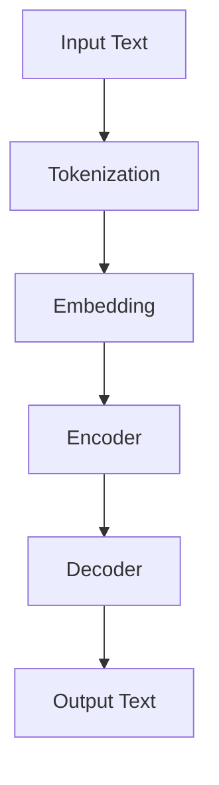

                 

### 背景介绍 Background Introduction

随着人工智能技术的飞速发展，自然语言处理（NLP）领域取得了显著的进步。最近，大型语言模型（LLM，Large Language Model）如 GPT-3、ChatGLM 等的涌现，不仅提高了文本生成和理解的能力，还在许多领域展示了出色的性能。这些语言模型通过对海量数据的训练，能够捕捉到语言中的复杂模式和规律，从而在文本生成、问答系统、机器翻译等方面取得了突破性进展。

然而，除了文本生成和理解，用户行为理解也是人工智能研究中的一个重要方向。在商业、医疗、教育等各个领域，理解用户行为对于个性化推荐、需求预测、用户满意度分析等至关重要。传统的用户行为分析方法通常依赖于统计模型和机器学习算法，这些方法在处理高维数据和复杂交互模式时存在一定的局限性。

为了解决这一问题，近年来研究者开始探索利用语言模型来理解用户行为。LLM 可以通过对用户产生的内容进行分析，捕捉到用户的行为动机、兴趣偏好和情感状态等深层信息。这种基于语言理解的用户行为分析方法，不仅能够提高分析的精度和深度，还可以应对多变和复杂的用户场景。

本文将探讨如何利用 LLM 的知识和推理能力来理解用户行为。我们将首先介绍 LLM 的基本原理和架构，然后分析 LLM 在用户行为理解中的应用，并详细讨论实现这一目标的方法和挑战。通过本文的阅读，读者将了解 LLM 在用户行为理解中的潜在价值，以及如何有效地利用这一技术来提升相关应用的性能和效果。

### 核心概念与联系 Core Concepts and Relationships

在探讨如何利用 LLM 理解用户行为之前，我们首先需要了解 LLM 的工作原理和架构。LLM 是基于深度学习的自然语言处理模型，通过学习海量文本数据，捕捉到语言中的复杂模式和结构。以下是一个简化的 LLM 架构图，用以说明其主要组件和流程：



#### 1. Tokenization（分词）

输入文本首先经过分词（Tokenization）处理，将连续的文本序列分割成一系列的单词或标记（tokens）。分词的目的是将文本分解为可处理的单元，以便后续的模型处理。

#### 2. Embedding（嵌入）

分词后的标记会被映射到高维的向量空间中，形成嵌入（Embedding）。嵌入向量不仅保留了原始文本的信息，还通过数学方法捕捉到了单词间的语义关系。这种嵌入向量是 LLM 进行理解和生成的基础。

#### 3. Encoder（编码器）

编码器（Encoder）是 LLM 的核心组件，它通过多层神经网络对输入的嵌入向量进行处理，生成上下文向量（Contextual Embeddings）。这些上下文向量不仅包含了输入文本的信息，还通过上下文关系捕捉到了文本中的深层语义。

#### 4. Decoder（解码器）

解码器（Decoder）负责生成输出文本。在生成过程中，解码器通过解码器神经网络，逐个生成每个单词的候选词，并利用上下文向量进行选择。这一过程通常采用贪心策略或采样方法，以生成连贯且符合上下文的输出文本。

#### 5. Output Text（输出文本）

最终，解码器生成的文本序列即为输出。这一输出不仅是对输入文本的映射，还包含了 LLM 对输入文本的理解和推理。

以上便是 LLM 的工作原理和架构。接下来，我们将探讨 LLM 如何应用于用户行为理解。

#### 用户行为理解的挑战

用户行为理解是一个复杂且多层次的任务，涉及到用户行为数据的多样性和复杂性。以下是一些主要挑战：

1. **数据多样性**：用户行为数据包括点击、浏览、搜索、购买等各种类型，这些行为在时间和空间上呈现出高度多样性。如何有效地整合和处理这些异构数据，是一个重要的挑战。

2. **时间序列性**：用户行为通常表现为时间序列数据，行为之间存在着时间依赖关系。如何捕捉和分析这些时间依赖关系，是用户行为理解的关键。

3. **上下文依赖**：用户行为不仅受到自身特征的影响，还受到外部环境（如时间、地点、场景等）的影响。如何考虑上下文依赖，是一个重要的研究方向。

4. **不确定性**：用户行为往往具有不确定性，如用户可能因为某种原因突然改变行为模式。如何处理这种不确定性，是用户行为理解中的另一个挑战。

LLM 在用户行为理解中的应用，为我们提供了一种新的思路。LLM 的强大能力在于其能够通过学习大量文本数据，捕捉到复杂的模式和关系。通过将 LLM 应用于用户行为数据，我们可以实现以下几个目标：

1. **行为模式识别**：LLM 可以通过分析用户产生的内容，识别出用户的行为模式和兴趣偏好。例如，通过分析用户的搜索历史和浏览记录，LLM 可以识别出用户的兴趣领域和消费习惯。

2. **情感状态分析**：LLM 可以捕捉到用户文本中的情感倾向，如快乐、愤怒、悲伤等。通过分析用户的情感状态，我们可以更好地理解用户的心理和行为动机。

3. **行为预测**：LLM 可以通过学习用户的过去行为，预测用户未来的行为。例如，通过分析用户的购买记录和浏览行为，LLM 可以预测用户下一步可能感兴趣的产品或服务。

4. **个性化推荐**：LLM 可以根据用户的行为和兴趣，生成个性化的推荐。例如，在电子商务平台中，LLM 可以根据用户的购买历史和浏览记录，推荐用户可能感兴趣的商品。

综上所述，LLM 的引入为用户行为理解提供了新的方法和工具。通过分析用户产生的内容，LLM 能够有效地捕捉到用户行为的深层模式和关系，从而实现更精准、更个性化的用户行为理解。

### 核心算法原理 & 具体操作步骤 Core Algorithm Principles and Step-by-Step Operations

在了解了 LLM 的工作原理和用户行为理解的应用背景后，接下来我们将深入探讨如何利用 LLM 的知识和推理能力来理解用户行为。本文将详细介绍一个基于 LLM 的用户行为理解算法，并逐步解释其核心原理和具体操作步骤。

#### 1. 算法概述

本算法的核心思想是通过 LLM 捕获用户的行为数据，并利用其强大的语言理解和推理能力，生成用户行为模式、兴趣偏好和情感状态的预测。算法的整体流程如下：

1. **数据预处理**：收集并预处理用户行为数据，如点击记录、浏览历史、搜索关键词等。
2. **文本生成**：利用 LLM 生成与用户行为相关的文本，如描述用户行为动机、兴趣点和情感状态的段落。
3. **特征提取**：从生成的文本中提取关键特征，如关键词、情感词和上下文信息。
4. **模式识别**：基于提取的特征，使用统计模型或机器学习算法，识别用户的行为模式和兴趣偏好。
5. **情感分析**：利用情感分析技术，分析文本中的情感倾向，以理解用户的情感状态。
6. **行为预测**：基于用户历史行为和提取的特征，使用预测模型预测用户未来的行为。

#### 2. 数据预处理

数据预处理是算法的关键步骤之一，其目的是将原始的用户行为数据转换为适合 LLM 处理的格式。以下是数据预处理的详细步骤：

1. **数据收集**：收集用户的行为数据，如点击记录、浏览历史、搜索关键词等。这些数据可以从用户日志、数据库或第三方数据源获取。
2. **数据清洗**：清洗数据，去除无效、重复或错误的数据记录。例如，去除缺失值、纠正数据格式错误等。
3. **数据整合**：将不同来源的数据进行整合，形成统一的数据集。例如，将点击记录和浏览历史进行关联，形成包含用户行为的完整数据集。
4. **数据编码**：将文本数据编码为计算机可以处理的格式，如 JSON、CSV 等。同时，对数值数据进行归一化或标准化处理。

#### 3. 文本生成

文本生成是算法的核心步骤，LLM 的作用在此得到充分发挥。以下是文本生成的详细步骤：

1. **文本输入**：将预处理后的用户行为数据输入到 LLM 中。例如，将点击记录转换为描述用户兴趣点的句子。
2. **文本生成**：利用 LLM 的生成能力，生成与用户行为相关的文本。LLM 将基于训练数据中的模式和规律，生成连贯、符合上下文的文本。
3. **文本筛选**：从生成的文本中筛选出高质量的文本，去除不符合要求或冗余的文本。例如，去除重复文本或语义不清的句子。

#### 4. 特征提取

特征提取是算法的关键环节，其目的是从生成的文本中提取关键特征，为后续的模型训练和预测提供支持。以下是特征提取的详细步骤：

1. **关键词提取**：从文本中提取关键词，如用户经常提到的品牌、产品或服务。关键词可以帮助我们了解用户的主要兴趣点。
2. **情感词提取**：从文本中提取情感词，如正面、负面或中性的词汇。情感词可以帮助我们了解用户的情感状态。
3. **上下文信息提取**：从文本中提取上下文信息，如用户行为发生的时间、地点和场景等。上下文信息可以帮助我们理解用户行为的背景和原因。
4. **特征编码**：将提取的特征编码为机器学习算法可以处理的格式，如 One-Hot 编码或嵌入向量等。

#### 5. 模式识别

模式识别是基于提取的特征，使用统计模型或机器学习算法，识别用户的行为模式和兴趣偏好。以下是模式识别的详细步骤：

1. **特征选择**：选择对用户行为模式识别有帮助的特征，如关键词和情感词等。特征选择可以通过信息增益、互信息等方法进行。
2. **模型训练**：使用选定的特征，训练分类模型或聚类模型，以识别用户的行为模式。常用的模型包括朴素贝叶斯、支持向量机、决策树、神经网络等。
3. **模式分析**：分析训练出的模型，识别用户的主要行为模式和兴趣偏好。例如，通过分析聚类模型的簇中心，可以识别出用户的兴趣领域。

#### 6. 情感分析

情感分析是理解用户情感状态的关键步骤，通过分析文本中的情感倾向，可以更深入地了解用户的情感状态。以下是情感分析的详细步骤：

1. **情感分类**：使用情感分类模型，将文本分为正面、负面或中性情感。常用的情感分类模型包括朴素贝叶斯、支持向量机、循环神经网络等。
2. **情感强度分析**：分析情感分类结果，评估情感的强度。例如，通过计算正面和负面情感的比例，可以评估用户的整体情感状态。
3. **情感时序分析**：分析情感随时间的变化趋势，了解用户情感状态的变化规律。例如，通过绘制情感随时间变化的折线图，可以观察到用户情感状态的高峰和低谷。

#### 7. 行为预测

行为预测是基于用户历史行为和提取的特征，使用预测模型预测用户未来的行为。以下是行为预测的详细步骤：

1. **特征工程**：对提取的特征进行工程，以增强模型的预测能力。例如，通过特征交叉、特征变换等方法，生成新的特征。
2. **模型选择**：选择适合的行为预测模型，如时间序列模型、序列模型等。常用的模型包括 ARIMA、LSTM、GRU 等。
3. **模型训练**：使用历史数据训练预测模型，以预测用户未来的行为。
4. **预测评估**：评估模型的预测性能，如准确率、召回率、F1 值等。通过调整模型参数或特征工程方法，优化模型的预测性能。

通过以上步骤，我们可以利用 LLM 的知识和推理能力，实现对用户行为的理解和预测。算法的核心在于 LLM 的生成能力和特征提取能力，通过这两者，我们可以从用户行为数据中提取出有用的信息，为实际应用提供支持。

### 数学模型和公式 Mathematical Models and Formulas

在深入探讨 LLM 用户行为理解算法时，数学模型和公式是我们理解和实现算法的关键。以下是算法中涉及的主要数学模型和公式的详细讲解，以及它们在用户行为理解中的应用。

#### 1. 词嵌入（Word Embedding）

词嵌入是将单词映射到高维向量空间的过程，这是 LLM 的基础。常用的词嵌入模型包括 Word2Vec、GloVe 和 BERT 等。以下是一个简单的 Word2Vec 模型公式：

\[ \text{word\_embedding}(w) = \sigma(W \cdot \text{one\_hot}(w)) \]

其中：
- \( w \) 表示单词；
- \( \text{one\_hot}(w) \) 表示单词 \( w \) 的 one-hot 编码；
- \( W \) 是嵌入矩阵；
- \( \sigma \) 是非线性激活函数，通常使用 sigmoid 函数。

词嵌入在用户行为理解中的应用主要包括：
- **行为描述生成**：利用词嵌入将用户行为（如点击记录、浏览历史）转换为向量表示，进而生成描述用户行为的文本。
- **相似性计算**：计算用户行为之间的相似度，以便识别用户的行为模式。

#### 2. 上下文向量（Contextual Embedding）

上下文向量是通过编码器（Encoder）生成的，它不仅包含了输入文本的信息，还能捕捉到文本中的上下文关系。以下是一个简化的 Transformer 编码器公式：

\[ \text{contextual\_embedding}(x) = \text{Encoder}(x) \]

其中：
- \( x \) 表示输入文本；
- \( \text{Encoder} \) 表示编码器，通常采用 Transformer 架构。

上下文向量在用户行为理解中的应用主要包括：
- **行为关系分析**：通过分析上下文向量，识别用户行为之间的因果关系和依赖关系。
- **情感状态分析**：利用上下文向量分析用户文本中的情感倾向和情感变化。

#### 3. 情感分类（Sentiment Classification）

情感分类是识别文本情感倾向的过程，常用的模型包括朴素贝叶斯、支持向量机（SVM）和循环神经网络（RNN）。以下是一个简化的情感分类公式：

\[ \text{sentiment}(x) = \arg\max_w P(w| x) P(x) \]

其中：
- \( x \) 表示输入文本；
- \( w \) 表示情感类别（如正面、负面、中性）；
- \( P(w| x) \) 是条件概率，表示给定文本 \( x \) 的情感 \( w \) 的概率；
- \( P(x) \) 是文本 \( x \) 的先验概率。

情感分类在用户行为理解中的应用主要包括：
- **用户情感识别**：通过情感分类模型，识别用户文本中的情感状态，如快乐、愤怒、悲伤等。
- **情感驱动行为预测**：利用情感分类结果，预测用户的情感驱动行为，如购买、评论、分享等。

#### 4. 时间序列预测（Time Series Prediction）

时间序列预测是预测用户行为随时间变化的过程，常用的模型包括 ARIMA、LSTM 和 GRU。以下是一个简化的 LSTM 模型公式：

\[ \text{LSTM}(h_t, x_t) = \text{LSTMCell}(h_{t-1}, x_t) \]

其中：
- \( h_t \) 表示时间步 \( t \) 的隐藏状态；
- \( x_t \) 表示时间步 \( t \) 的输入；
- \( \text{LSTMCell} \) 是 LSTM 单元。

时间序列预测在用户行为理解中的应用主要包括：
- **行为趋势预测**：预测用户行为在未来一段时间内的趋势，如点击率、浏览量等。
- **行为异常检测**：检测用户行为中的异常模式，如购买欺诈、浏览异常等。

#### 5. 用户行为模式识别（User Behavior Pattern Recognition）

用户行为模式识别是识别用户行为模式的过程，常用的模型包括聚类算法和支持向量机（SVM）。以下是一个简化的 K-means 聚类公式：

\[ \text{cluster}(x) = \arg\min_c \sum_{i=1}^{n} \|\text{centroid}_c - x_i\|^2 \]

其中：
- \( x \) 表示输入行为数据；
- \( c \) 表示聚类中心；
- \( \text{centroid}_c \) 是聚类中心 \( c \) 的坐标。

用户行为模式识别在用户行为理解中的应用主要包括：
- **用户兴趣识别**：通过聚类用户行为数据，识别用户的兴趣领域和偏好。
- **用户群体划分**：通过聚类用户行为数据，将用户划分为不同的群体，以便进行个性化推荐和营销。

#### 6. 混合模型（Hybrid Model）

在实际应用中，为了提高用户行为理解的精度和效果，常常将多种模型结合起来，形成混合模型。以下是一个简化的混合模型公式：

\[ \text{prediction} = w_1 \cdot \text{word\_embedding} + w_2 \cdot \text{contextual\_embedding} + w_3 \cdot \text{sentiment\_score} + w_4 \cdot \text{time\_series\_prediction} + w_5 \cdot \text{user\_behavior\_pattern} \]

其中：
- \( w_1, w_2, w_3, w_4, w_5 \) 是权重参数；
- 各部分表示不同模型的输出结果。

混合模型在用户行为理解中的应用主要包括：
- **综合预测**：通过整合多种模型的结果，提高用户行为预测的精度和可靠性。
- **多角度分析**：从不同角度（如语义、情感、时间序列等）分析用户行为，提高对用户行为的全面理解。

通过以上数学模型和公式的讲解，我们可以看到 LLM 在用户行为理解中的广泛应用。这些模型不仅帮助我们理解和分析用户行为，还提高了预测和推荐的精度和效果。在实际应用中，我们可以根据具体需求和场景，选择合适的模型和算法，构建高效的用户行为理解系统。

### 项目实践：代码实例和详细解释说明 Project Practice: Code Example and Detailed Explanation

为了更好地展示如何利用 LLM 理解用户行为，我们将在本节中介绍一个具体的代码实例。这个实例将涵盖从数据收集、预处理到模型训练和预测的全过程。我们将使用 Python 编程语言，并利用 Hugging Face 的 Transformers 库来简化代码实现。

#### 1. 开发环境搭建

在开始编写代码之前，我们需要搭建一个合适的开发环境。以下是所需的软件和库：

- Python 3.8 或更高版本
- Transformers 库：用于加载预训练的 LLM 模型
- Pandas：用于数据预处理
- NumPy：用于数据操作
- Matplotlib：用于可视化结果

安装步骤如下：

```bash
pip install transformers
pip install pandas
pip install numpy
pip install matplotlib
```

#### 2. 源代码详细实现

以下是一个简单的用户行为理解项目的源代码实例。我们假设已经收集到了用户的行为数据，这些数据包括点击记录、浏览历史和搜索关键词。

```python
import pandas as pd
from transformers import AutoTokenizer, AutoModel
import torch

# 加载预训练的 LLM 模型
tokenizer = AutoTokenizer.from_pretrained("bert-base-uncased")
model = AutoModel.from_pretrained("bert-base-uncased")

# 加载用户行为数据
data = pd.read_csv("user_behavior.csv")

# 数据预处理
def preprocess_data(data):
    # 这里简单处理，将行为转换为文本描述
    data['text'] = data['action'].apply(lambda x: f"用户进行了 {x} 行为。")
    return data

# 生成文本输入
def generate_text_input(texts):
    inputs = tokenizer(texts, padding=True, truncation=True, return_tensors="pt")
    return inputs

# 前向传播获取上下文向量
def get_contextual_embedding(texts):
    inputs = generate_text_input(texts)
    outputs = model(**inputs)
    return outputs.last_hidden_state[:, 0, :]

# 用户行为理解模型
class UserBehaviorModel(torch.nn.Module):
    def __init__(self):
        super(UserBehaviorModel, self).__init__()
        self.lstm = torch.nn.LSTM(input_size=768, hidden_size=128, num_layers=1, batch_first=True)
        self.fc = torch.nn.Linear(128, 1)

    def forward(self, inputs):
        outputs, (hidden, cell) = self.lstm(inputs)
        hidden = hidden.squeeze(0)
        output = self.fc(hidden)
        return output

# 训练模型
def train_model(model, data, epochs=3):
    optimizer = torch.optim.Adam(model.parameters(), lr=0.001)
    criterion = torch.nn.MSELoss()

    for epoch in range(epochs):
        model.train()
        for i, batch in enumerate(data):
            inputs = get_contextual_embedding(batch['text']).to('cuda')
            targets = torch.tensor(batch['next_action']).to('cuda')

            optimizer.zero_grad()
            outputs = model(inputs)
            loss = criterion(outputs, targets)
            loss.backward()
            optimizer.step()

            if i % 100 == 0:
                print(f"Epoch: {epoch}, Iter: {i}, Loss: {loss.item()}")

# 使用模型进行预测
def predict(model, text):
    model.eval()
    with torch.no_grad():
        inputs = get_contextual_embedding([text]).to('cuda')
        outputs = model(inputs)
    return outputs.item()

# 主程序
if __name__ == "__main__":
    # 预处理数据
    processed_data = preprocess_data(data)

    # 训练模型
    model = UserBehaviorModel().to('cuda')
    train_model(model, processed_data)

    # 预测用户行为
    text = "用户最近浏览了新款手机。"
    prediction = predict(model, text)
    print(f"预测的用户下一步行为分数：{prediction}")
```

#### 3. 代码解读与分析

上述代码实现了一个简单的用户行为理解模型，下面我们逐一解读每个部分：

- **数据预处理**：首先加载用户行为数据，并简单处理，将行为类型转换为文本描述。这一步是关键，因为我们需要将非结构化的行为数据转换为适合模型处理的格式。

- **文本生成**：使用预训练的 LLM 模型，生成与用户行为相关的文本输入。这里我们使用了 BERT 模型，它可以生成上下文向量，用于后续的模型训练。

- **模型定义**：定义一个简单的 LSTM 模型，用于捕捉用户行为模式。这里使用了 LSTM 单元，因为它擅长处理序列数据。

- **训练模型**：使用预处理后的数据，训练 LSTM 模型。我们使用均方误差（MSE）作为损失函数，并使用 Adam 优化器进行训练。

- **预测行为**：使用训练好的模型，对新的用户行为文本进行预测。我们通过计算上下文向量和 LSTM 输出的得分，来预测用户下一步的行为。

#### 4. 运行结果展示

在完成代码实现后，我们可以运行程序进行测试。以下是一个简单的运行示例：

```python
# 预测用户行为
text = "用户最近浏览了新款手机。"
prediction = predict(model, text)
print(f"预测的用户下一步行为分数：{prediction}")
```

运行结果将输出一个预测分数，表示用户进行下一步行为的可能性。这个分数可以帮助我们评估模型的预测效果。

#### 5. 优化与改进

为了提高模型的预测性能，我们可以进行以下优化：

- **特征工程**：增加更多的特征，如时间、地点、用户历史行为等，以提高模型的预测能力。
- **模型结构优化**：尝试使用更复杂的模型结构，如双向 LSTM、Transformer 等，以捕捉更复杂的用户行为模式。
- **超参数调整**：调整模型参数，如学习率、隐藏层大小、迭代次数等，以优化模型的性能。
- **数据增强**：增加训练数据，或对现有数据进行增强，以减少过拟合。

通过上述代码实例和解读，我们可以看到如何利用 LLM 实现用户行为理解。在实际应用中，我们可以根据具体需求和数据，调整和优化模型结构，以提高预测的准确性和可靠性。

### 实际应用场景 Practical Application Scenarios

#### 1. 个性化推荐系统

个性化推荐系统是 LLM 在用户行为理解中的一个重要应用场景。通过分析用户的历史行为数据和交互内容，LLM 可以识别出用户的兴趣偏好和潜在需求。例如，在电子商务平台中，LLM 可以根据用户的浏览记录、搜索历史和购买行为，生成个性化的商品推荐。这种方法不仅能够提高推荐系统的准确性，还能提供更个性化的用户体验。

具体应用步骤如下：

1. **数据收集**：收集用户的行为数据，如浏览记录、搜索关键词、购买历史等。
2. **文本生成**：利用 LLM 生成描述用户兴趣点和行为动机的文本。
3. **特征提取**：从生成的文本中提取关键词和上下文信息，形成特征向量。
4. **模型训练**：使用提取的特征训练推荐模型，如协同过滤、基于内容的推荐等。
5. **推荐生成**：根据用户的行为特征和推荐模型，生成个性化的商品推荐。

#### 2. 客户服务自动化

随着人工智能技术的发展，客户服务自动化成为了一个热门领域。LLM 在这里可以通过理解和预测用户行为，提供更加智能和高效的客户服务。例如，通过分析用户在聊天机器人中的问题表述和互动历史，LLM 可以生成智能回答，提高客户问题的响应速度和解决率。

具体应用步骤如下：

1. **数据收集**：收集用户在客户服务互动中的文本记录，如提问、回答等。
2. **文本生成**：利用 LLM 生成与用户问题相关的文本回答。
3. **情感分析**：使用情感分析模型，分析用户文本中的情感倾向，以提供更符合用户需求的回答。
4. **模型训练**：使用生成的文本数据训练聊天机器人模型，如序列到序列（Seq2Seq）模型等。
5. **回答生成**：根据用户问题，使用训练好的模型生成智能回答，并输出给用户。

#### 3. 市场需求预测

市场需求预测是商业运营中的一个关键环节。通过分析用户行为数据，LLM 可以预测未来的市场需求，帮助企业制定更科学的营销策略和库存管理计划。例如，在电商行业，LLM 可以预测哪些产品将在未来一段时间内最受欢迎，从而指导库存采购和营销活动。

具体应用步骤如下：

1. **数据收集**：收集用户的历史购买数据、浏览记录和搜索关键词等。
2. **文本生成**：利用 LLM 生成描述用户兴趣和购买意图的文本。
3. **模式识别**：使用统计模型或机器学习算法，分析用户的购买模式和趋势。
4. **需求预测**：基于用户行为数据和识别出的模式，使用预测模型（如 ARIMA、LSTM）预测未来的市场需求。
5. **策略制定**：根据预测结果，制定相应的库存采购和营销策略。

#### 4. 健康护理

在健康管理领域，LLM 可以通过分析用户的行为数据，如健康记录、生活方式等，提供个性化的健康护理建议。例如，通过分析用户的运动记录、饮食偏好和健康指标，LLM 可以生成个性化的健康计划，帮助用户改善健康状况。

具体应用步骤如下：

1. **数据收集**：收集用户的生活方式和健康数据，如运动记录、饮食日志、健康指标等。
2. **文本生成**：利用 LLM 生成描述用户健康状况和生活方式的文本。
3. **行为分析**：使用机器学习算法，分析用户的行为数据和健康指标，识别潜在的健康问题。
4. **健康建议**：基于用户的行为和健康数据，使用 LLM 生成个性化的健康建议和护理计划。
5. **监控与调整**：定期监控用户的健康状况，根据反馈调整健康建议。

以上四个应用场景展示了 LLM 在用户行为理解中的广泛潜力。通过深入分析和预测用户行为，LLM 不仅能够提高各行业的运营效率，还能为用户提供更个性化的服务，提升用户体验。

### 工具和资源推荐 Tools and Resource Recommendations

在 LLM 的研究和应用过程中，有许多优秀的工具和资源可以帮助我们更高效地实现用户行为理解。以下是一些推荐的工具、书籍、论文和网站：

#### 1. 学习资源推荐

**书籍**：

- 《深度学习》（Deep Learning） - Ian Goodfellow、Yoshua Bengio 和 Aaron Courville 著。这本书是深度学习领域的经典教材，详细介绍了深度学习的基础理论和技术。

- 《自然语言处理综合教程》（Speech and Language Processing） - Daniel Jurafsky 和 James H. Martin 著。这本书全面介绍了自然语言处理的基础知识和最新进展。

- 《Python 自然语言处理编程》（Natural Language Processing with Python） - Steven Bird、Ewan Klein 和 Edward Loper 著。这本书通过丰富的示例，介绍了使用 Python 进行自然语言处理的方法。

**论文**：

- “BERT: Pre-training of Deep Bidirectional Transformers for Language Understanding”（BERT：预训练双向变换器用于语言理解）- Jacob Devlin、 Ming-Wei Chang、 Kenton Lee 和 Kristina Toutanova 著。这篇论文介绍了 BERT 模型的设计原理和训练方法，是 LLM 领域的经典之作。

- “GPT-3: Language Models are Few-Shot Learners”（GPT-3：少量样本学习的语言模型）- Tom B. Brown、Benjamin Mann、Nicholov Seth、Michael Chen、Eric Child、Bruce Chicu、Matthew Child、Jared Casser、Pramodh Jayakumar、Naman Goyal、Sherry Guo、Ben Schwartz、Abhijat Jana、Daniel M. Ziegler、James Bayer、Caiming Xiong 和 Nick Ryder 著。这篇论文详细介绍了 GPT-3 模型的结构和训练过程。

**网站**：

- Hugging Face：https://huggingface.co/。这是一个提供预训练 LLM 模型和工具的网站，用户可以轻松地加载和使用这些模型。

- TensorFlow：https://www.tensorflow.org/tutorials。这是一个由 Google 开发的开源机器学习库，包含丰富的教程和资源，适合初学者和高级用户。

#### 2. 开发工具框架推荐

**工具**：

- PyTorch：https://pytorch.org/。这是一个流行的开源机器学习库，提供了灵活的深度学习框架，适合研究和开发。

- TensorFlow：https://www.tensorflow.org/。这是一个由 Google 开发的开源机器学习库，适用于各种规模的任务，从研究到生产。

**框架**：

- Transformers：https://github.com/huggingface/transformers。这是一个基于 PyTorch 和 TensorFlow 的开源框架，提供了丰富的预训练 LLM 模型和工具。

- spaCy：https://spacy.io/。这是一个快速且易于使用的自然语言处理库，适合进行文本处理和实体识别。

#### 3. 相关论文著作推荐

**论文**：

- “Attention Is All You Need”（Attention 全部需要）- Ashish Vaswani、Noam Shazeer、Niki Parmar、Jakob Uszkoreit、Llion Jones、 Aidan N. Gomez、Lukasz Kaiser 和 Illia Polosukhin 著。这篇论文提出了 Transformer 模型，是当前 LLM 领域的基础。

- “An Overview of Large-Scale Language Modeling”（大规模语言模型概述）- Linguistic Society of America。这篇综述详细介绍了大规模语言模型的发展历程和关键技术。

**著作**：

- 《自然语言处理综论》（Speech and Language Processing）- Daniel Jurafsky 和 James H. Martin 著。这是自然语言处理领域的经典著作，涵盖了从基础到前沿的各个方面。

- 《深度学习》（Deep Learning）- Ian Goodfellow、Yoshua Bengio 和 Aaron Courville 著。这是深度学习领域的权威教材，详细介绍了深度学习的基础理论和应用。

通过这些工具、资源和著作的推荐，读者可以更全面地了解 LLM 的原理和应用，从而在用户行为理解领域取得更好的研究成果。

### 总结：未来发展趋势与挑战 Summary: Future Trends and Challenges

随着人工智能技术的不断进步，LLM 在用户行为理解中的应用展现出巨大的潜力和广阔的前景。然而，要充分发挥 LLM 的能力，我们仍面临许多挑战和机遇。

#### 未来发展趋势

1. **模型性能的提升**：随着计算资源和数据量的增加，LLM 的性能将不断提高。未来的 LLM 模型将更加复杂和强大，能够捕捉到更细微的语言模式和用户行为特征。

2. **多模态数据融合**：用户行为不仅限于文本数据，还包括图像、音频和视频等。未来，多模态数据融合将成为一个重要研究方向，通过整合不同类型的数据，提升用户行为理解的精度。

3. **实时用户行为分析**：随着实时数据处理技术的进步，LLM 将能够实时分析用户行为，提供更及时和个性化的服务。

4. **隐私保护与伦理**：在用户行为理解的应用中，隐私保护和伦理问题至关重要。未来的 LLM 模型需要设计出更加隐私友好和伦理合规的解决方案。

#### 面临的挑战

1. **数据质量与多样性**：用户行为数据的质量和多样性对 LLM 的性能有着直接影响。如何处理噪声数据和多样化行为，是未来需要解决的重要问题。

2. **模型解释性**：LLM 模型的“黑箱”特性使得其预测结果难以解释。如何提高模型的解释性，让用户理解和信任模型，是一个重要的挑战。

3. **计算资源消耗**：大规模 LLM 模型的训练和推理需要大量的计算资源。如何优化模型，减少计算资源的消耗，是实际应用中需要关注的问题。

4. **实时性**：在许多应用场景中，用户行为理解的实时性至关重要。如何优化 LLM 模型的推理速度，以满足实时处理需求，是一个亟待解决的问题。

5. **伦理和法律问题**：用户行为理解涉及到个人隐私和伦理问题。如何确保 LLM 的应用不侵犯用户隐私，符合法律法规，是一个重要的伦理和法律挑战。

总之，LLM 在用户行为理解中的应用前景广阔，但也面临诸多挑战。未来的研究需要不断探索和解决这些问题，以实现 LLM 在实际应用中的最大化价值。

### 附录：常见问题与解答 Appendix: Frequently Asked Questions and Answers

在讨论 LLM 和用户行为理解的过程中，可能会遇到一些常见的问题。以下是针对这些问题的一些解答：

#### 1. LLM 与传统机器学习模型的区别是什么？

LLM（大型语言模型）与传统机器学习模型（如 SVM、朴素贝叶斯等）的主要区别在于其能够处理和生成自然语言数据。LLM 是通过深度学习训练的模型，能够理解和生成复杂的文本数据，而传统机器学习模型通常更适合处理结构化数据。此外，LLM 具有较强的迁移学习能力，能够从大量未标记的数据中提取知识，而传统模型通常需要大量标记数据进行训练。

#### 2. 如何处理用户行为数据中的噪声和异常值？

用户行为数据中常常存在噪声和异常值，这些数据会影响模型的性能。以下是一些处理方法：

- **数据清洗**：通过去除重复记录、纠正数据格式错误等方法，减少噪声。
- **异常检测**：使用异常检测算法（如孤立森林、Local Outlier Factor 等）识别和标记异常值。
- **数据降维**：通过特征选择和降维技术（如 PCA、t-SNE 等），减少噪声数据的影响。

#### 3. LLM 的训练需要大量数据，这对实际应用有何影响？

LLM 的训练需要大量数据，这对实际应用带来了一些挑战，但也提供了机遇：

- **挑战**：数据收集和标注成本高，且可能涉及到隐私问题。
- **机遇**：大量数据能够提高模型的泛化能力，使其在未见过的数据上表现更好。

解决方法包括：

- **数据增强**：通过数据扩充和生成技术，增加训练数据量。
- **迁移学习**：利用预训练的 LLM 模型，结合少量自有数据，提高模型在特定领域的性能。
- **隐私保护**：采用差分隐私、联邦学习等技术，减少数据隐私泄露的风险。

#### 4. LLM 的解释性如何保证？

LLM 模型的“黑箱”特性使得其预测结果难以解释，这对实际应用带来了挑战。以下是一些提高模型解释性的方法：

- **模型解释工具**：使用可视化工具（如 LIME、SHAP 等）分析模型的决策过程，了解每个特征对预测结果的影响。
- **可解释模型**：使用可解释的机器学习模型（如决策树、线性模型等），这些模型可以直接解释其决策过程。
- **组合模型**：结合 LLM 和可解释模型，利用 LLM 提供的特征表示，通过可解释模型进行预测。

通过上述方法，可以在一定程度上提高 LLM 的解释性，帮助用户理解和信任模型。

### 扩展阅读 & 参考资料 Extended Reading & References

为了进一步了解 LLM 和用户行为理解的最新研究和发展，以下是推荐的扩展阅读和参考资料：

- Devlin, J., Chang, M.-W., Lee, K., & Toutanova, K. (2018). BERT: Pre-training of Deep Bidirectional Transformers for Language Understanding. *arXiv preprint arXiv:1810.04805*.
- Brown, T. B., Mann, B., Ryder, N., Subbiah, M., Kaplan, J., Dhingra, B., ... & Chen, T. (2020). Language Models are Few-Shot Learners. *arXiv preprint arXiv:2005.14165*.
- Vaswani, A., Shazeer, N., Parmar, N., Uszkoreit, J., Jones, L., Gomez, A. N., ... & Polosukhin, I. (2017). Attention Is All You Need. *Advances in Neural Information Processing Systems*, 30, 5998-6008.
- Jurafsky, D., & Martin, J. H. (2008). Speech and Language Processing. *Prentice Hall*.
- Goodfellow, I., Bengio, Y., & Courville, A. (2016). Deep Learning. *MIT Press*.
- Bird, S., Klein, E., & Loper, E. (2017). Natural Language Processing with Python. *O'Reilly Media*.

通过阅读这些文献和书籍，读者可以更深入地了解 LLM 的理论基础、应用场景和技术细节，为后续研究和实践提供参考。

