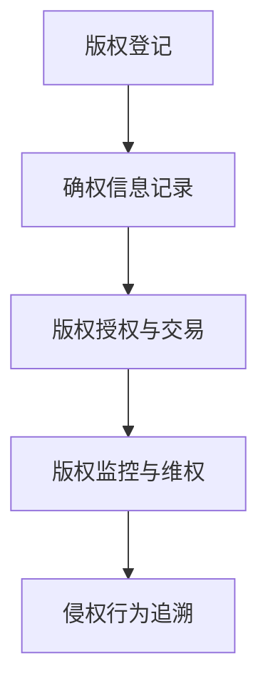

                 

## 利用区块链技术保护知识产权

### 引言

在当今信息化时代，知识产权（Intellectual Property，简称IP）的创造、传播和使用无处不在，从专利技术、原创文学作品，到软件代码和设计图纸，都是知识产权的重要形式。然而，知识产权的侵权和盗版问题也日益突出，这不仅损害了权利人的合法权益，还严重影响了创新生态和社会经济秩序。因此，寻找有效的知识产权保护方法已成为当务之急。

区块链技术，作为一种分布式账本技术，以其去中心化、不可篡改和透明公开的特性，为知识产权保护提供了一种全新的解决方案。区块链技术可以确保知识产权的原创性和唯一性，有效防止侵权和盗版行为。本文将深入探讨区块链技术在知识产权保护中的应用，分析其优势与挑战，并展望未来发展趋势。

### 背景介绍

#### 知识产权的定义与分类

知识产权是指个人或组织基于智力劳动创造的成果所享有的专有权利。根据世界知识产权组织（WIPO）的定义，知识产权主要包括以下几类：

1. **专利权**：对发明创造的新颖性、创造性和实用性进行保护的权利。
2. **商标权**：对商品或服务的标志进行保护的权利。
3. **著作权**：对文学、艺术和科学作品进行保护的权利。
4. **商业秘密**：对商业活动中不为公众所知悉、具有商业价值的信息进行保护的权利。

知识产权在现代经济体系中具有重要地位。它不仅激励创新和创作，还为企业提供了一种重要的市场竞争优势。然而，知识产权的保护面临诸多挑战。

#### 知识产权保护面临的挑战

1. **侵权和盗版问题**：随着互联网的普及，知识产权侵权和盗版现象日益猖獗。侵权行为不仅损害了权利人的经济利益，还抑制了创新活力。
2. **证明难度**：在传统的知识产权保护体系中，权利人需要提供确凿的证据来证明其权利的原创性和合法性。然而，在庞大的数字世界中，收集和保存这些证据是一项艰巨的任务。
3. **跨境保护**：不同国家和地区的知识产权保护法律法规存在差异，给知识产权的跨国保护带来了难题。

#### 区块链技术的发展与优势

区块链技术，本质上是一个分布式数据库系统，通过加密算法和共识机制，实现了数据的不可篡改和透明公开。区块链技术的发展历程可以追溯到2008年，当时中本聪（Satoshi Nakamoto）提出了比特币（Bitcoin）的概念，开创了区块链技术的先河。随着技术的不断演进，区块链的应用场景逐渐拓展到金融、供应链管理、医疗保健等领域。

区块链技术的核心优势包括：

1. **去中心化**：区块链通过分布式网络实现数据存储和验证，无需中心化的权威机构，减少了信任成本。
2. **不可篡改**：区块链上的数据一旦写入，就不可篡改，确保了数据的真实性和完整性。
3. **透明公开**：区块链上的数据是公开透明的，任何节点都可以查看和验证，提高了信息的透明度。

#### 区块链在知识产权保护中的应用潜力

区块链技术的这些特性使其在知识产权保护中具有巨大的应用潜力：

1. **确保原创性和唯一性**：区块链可以记录知识产权的创造过程和权属信息，确保知识产权的原创性和唯一性。
2. **防止侵权和盗版**：区块链上的知识产权信息是公开透明的，任何侵权行为都会被记录和追溯。
3. **简化维权流程**：区块链技术可以简化知识产权的维权流程，降低维权成本。

### 核心概念与联系

#### 区块链技术原理

区块链是一个由多个区块（Block）组成的数据结构，每个区块包含一定数量的交易记录（Transaction）。区块与区块之间通过哈希（Hash）函数链接，形成了一个连续的链条。区块链上的数据一旦写入，就不可篡改，确保了数据的真实性和完整性。

区块链的关键组成部分包括：

1. **节点（Node）**：区块链网络中的参与方，负责存储数据、验证交易和参与共识过程。
2. **挖矿（Mining）**：节点通过解决数学难题，验证并添加新区块到区块链上，从而获得奖励。
3. **智能合约（Smart Contract）**：一种自执行的合同，基于区块链技术实现自动执行和执行结果不可篡改。

#### 区块链在知识产权保护中的应用

区块链在知识产权保护中的应用主要体现在以下几个方面：

1. **版权登记与确权**：权利人可以将知识产权的登记信息记录在区块链上，确保其原创性和唯一性。
2. **版权授权与交易**：通过区块链技术，权利人可以方便地进行版权授权和交易，减少中介环节，提高交易效率。
3. **版权监控与维权**：区块链可以实时监控知识产权的使用情况，一旦发现侵权行为，权利人可以快速采取维权措施。

#### Mermaid 流程图

下面是区块链在知识产权保护中应用的一个简单 Mermaid 流程图：



在版权登记阶段，权利人将知识产权信息上传到区块链；确权信息记录在区块链上，确保其唯一性和不可篡改性；在版权授权与交易阶段，权利人和使用方可以在区块链上进行授权和交易，确保交易的透明性和安全性；在版权监控与维权阶段，区块链可以实时监控知识产权的使用情况，一旦发现侵权行为，权利人可以快速采取维权措施。

通过上述流程，我们可以看到区块链技术在知识产权保护中发挥了重要作用，不仅确保了知识产权的原创性和唯一性，还提高了维权效率和交易透明度。

### 核心算法原理 & 具体操作步骤

#### 区块链在知识产权保护中的应用算法原理

区块链在知识产权保护中的应用，主要依赖于其不可篡改性和去中心化特性。具体来说，区块链技术通过以下算法原理实现知识产权的保护：

1. **哈希算法**：区块链使用哈希算法来确保数据的唯一性和完整性。哈希算法将任意长度的数据映射为固定长度的哈希值，一旦数据发生改变，其哈希值也会发生改变。因此，通过对比哈希值，可以判断数据是否被篡改。

2. **非对称加密算法**：区块链使用非对称加密算法来确保数据的安全性和隐私性。非对称加密算法使用一对密钥，公钥和私钥。公钥可以公开，用于加密数据；私钥则需要保密，用于解密数据。因此，即使数据被加密，只有拥有私钥的人才能解密。

3. **智能合约**：智能合约是一种自动执行的合同，基于区块链技术实现。智能合约的代码公开透明，一旦满足合约条件，自动执行相应的操作。因此，智能合约可以确保知识产权的授权和交易过程的自动化和不可篡改性。

#### 区块链在知识产权保护中的具体操作步骤

1. **版权登记**：权利人将知识产权（如专利、商标、著作权等）的详细信息上传到区块链。这些信息包括知识产权的名称、创作者、创作时间等。

2. **哈希值生成**：区块链节点将知识产权的详细信息通过哈希算法生成一个唯一的哈希值，并将这个哈希值记录在区块链上。

3. **非对称加密**：为了保护知识产权的隐私性，区块链使用非对称加密算法对知识产权的详细信息进行加密。权利人拥有私钥，可以解密详细信息。

4. **智能合约部署**：权利人可以基于区块链平台部署智能合约，定义知识产权的授权和交易规则。智能合约的代码是公开的，任何人都可以查看。

5. **授权和交易**：当权利人需要授权或出售知识产权时，可以调用智能合约，执行相应的操作。智能合约会自动记录这些操作，并确保其不可篡改。

6. **侵权监测和维权**：区块链上的知识产权信息是公开透明的，任何侵权行为都会被记录和追溯。权利人可以实时监控知识产权的使用情况，一旦发现侵权行为，可以快速采取维权措施。

7. **争议解决**：当发生知识产权纠纷时，区块链上的所有操作记录可以作为证据，协助解决争议。由于区块链数据的不可篡改性，这些证据具有较高的可信度。

通过上述操作步骤，我们可以看到区块链技术在知识产权保护中的应用是如何实现的。它不仅确保了知识产权的原创性和唯一性，还提高了维权效率和交易透明度。

### 数学模型和公式 & 详细讲解 & 举例说明

#### 数学模型与公式

区块链在知识产权保护中的核心算法主要依赖于哈希函数、非对称加密算法和智能合约。以下是对这些算法的数学模型和公式的详细讲解。

1. **哈希函数**

   哈希函数是一种将任意长度的数据映射为固定长度数据的函数。其数学模型可以表示为：

   $$H(x) = Hash(x)$$

   其中，$H(x)$ 表示哈希值，$x$ 表示输入数据。

   常见的哈希函数包括MD5、SHA-1、SHA-256等。以SHA-256为例，其数学模型为：

   $$SHA-256(x) = Hash(x)$$

   SHA-256是一种将输入数据映射为256位哈希值的函数。

2. **非对称加密算法**

   非对称加密算法使用一对密钥，公钥和私钥。其数学模型可以表示为：

   - 公钥加密：$$Enc_{pub}(m) = c$$
   - 私钥解密：$$Dec_{priv}(c) = m$$

   其中，$m$ 表示明文，$c$ 表示密文，$pub$ 和 $priv$ 分别表示公钥和私钥。

   非对称加密算法的数学模型依赖于椭圆曲线密码学（ECDSA）。以ECDSA为例，其数学模型为：

   - 椭圆曲线：$E: y^2 = x^3 + ax + b$
   - 点乘运算：$k \cdot G = R$
   - 签名生成：$s = r \cdot k^{-1}$
   - 签名验证：$v = (c^r \cdot m^s) \mod n$

   其中，$G$ 是椭圆曲线上的一个基点，$k$ 是随机数，$r$ 和 $s$ 是签名，$n$ 是椭圆曲线的模数。

3. **智能合约**

   智能合约是一种自动执行的合同，基于区块链技术实现。其数学模型可以表示为：

   - 状态更新：$$S_{next} = S_{current} + f(S_{current}, C_{input})$$
   - 条件执行：$$C_{output} = C_{input} \land (f(S_{current}, C_{input}) \neq 0)$$

   其中，$S_{current}$ 表示当前状态，$S_{next}$ 表示下一个状态，$f$ 表示函数，$C_{input}$ 和 $C_{output}$ 分别表示输入和输出条件。

   智能合约的数学模型依赖于图灵机模型。以Solidity为例，其数学模型为：

   - 状态更新：$$S_{next} = S_{current} + s$$
   - 条件执行：$$C_{output} = C_{input} \land (s \neq 0)$$

   其中，$s$ 表示状态变量，$C_{input}$ 和 $C_{output}$ 分别表示输入和输出条件。

#### 举例说明

假设有一个作家想要在区块链上登记一本新书，并确保其版权。以下是具体的操作步骤：

1. **版权登记**

   作家将新书的电子文档上传到区块链平台。平台将电子文档通过SHA-256哈希函数生成一个唯一的哈希值。

   $$H_{book} = SHA-256(电子文档)$$

   然后，平台将哈希值记录在区块链上。

2. **非对称加密**

   作家生成一对非对称加密密钥，公钥和私钥。作家将电子文档的哈希值通过公钥加密，生成密文。

   $$Enc_{pub}(H_{book}) = C_{book}$$

   作家将密文发布到区块链上。

3. **智能合约部署**

   作家在区块链平台上部署一个智能合约，定义新书的授权和交易规则。例如，作家可以将新书授权给某个出版社，并设定出版社必须支付一定的授权费用。

4. **授权和交易**

   出版社通过调用智能合约，支付授权费用，获得新书的访问权限。智能合约会自动更新区块链上的状态，记录授权信息。

   $$S_{next} = S_{current} + s$$

   其中，$s$ 表示出版社的授权信息。

5. **侵权监测和维权**

   如果有人未经授权使用新书的电子文档，区块链上的智能合约会自动检测到侵权行为，并触发相应的维权机制。

   $$C_{output} = C_{input} \land (s \neq 0)$$

   智能合约会记录侵权行为，并通知作家采取维权措施。

通过上述操作，我们可以看到区块链技术在知识产权保护中的应用是如何通过数学模型和公式实现的。它不仅确保了知识产权的原创性和唯一性，还提高了维权效率和交易透明度。

### 项目实践：代码实例和详细解释说明

#### 开发环境搭建

要在区块链平台上实现知识产权保护，首先需要搭建一个合适的开发环境。以下是在以太坊（Ethereum）区块链上搭建开发环境的步骤：

1. **安装Node.js和npm**

   下载并安装Node.js（版本需在12以上），并配置npm。

   ```bash
   curl -fsSL https://npmjs.com/install.sh | bash
   ```

2. **安装Truffle框架**

   使用npm安装Truffle框架，这是一个用于以太坊开发的环境工具。

   ```bash
   npm install -g truffle
   ```

3. **安装Ganache**

   Ganache是一个轻量级的以太坊私有网络，用于本地开发和测试。从官方网站下载并安装Ganache。

   ```bash
   # Windows
   https://github.com/trufflesuite/ganache/releases/download/2.8.7/ganache-2.8.7-windows-x64.exe
   # macOS
   https://github.com/trufflesuite/ganache/releases/download/2.8.7/ganache-2.8.7-macos.tar.gz
   # Linux
   https://github.com/trufflesuite/ganache/releases/download/2.8.7/ganache-2.8.7-linux-x64.tar.gz
   ```

4. **创建Truffle项目**

   在本地计算机上创建一个新的Truffle项目。

   ```bash
   truffle init
   ```

5. **安装Solidity编译器（Solc）**

   在Truffle项目中安装Solidity编译器。

   ```bash
   npm install solc
   ```

6. **启动Ganache**

   启动Ganache，创建一个本地以太坊节点，并生成一些测试账户。

   ```bash
   ganache-cli --port 8545
   ```

   在浏览器中访问 `http://localhost:8545`，可以查看生成的测试账户和节点信息。

通过上述步骤，我们成功搭建了以太坊开发环境，接下来可以进行区块链应用的开发。

#### 源代码详细实现

1. **智能合约开发**

   在Truffle项目的`contracts`目录下，创建一个名为`Copyright.sol`的智能合约文件，用于处理知识产权的登记、授权和交易。

   ```solidity
   // SPDX-License-Identifier: MIT
   pragma solidity ^0.8.0;

   contract Copyright {
       struct Right {
           address owner;
           string hash;
           uint256 timestamp;
       }

       mapping(string => Right) public rights;

       function registerCopyright(string memory _hash) external {
           require(rights[_hash].owner == address(0), "Copyright already registered");
           rights[_hash] = Right(msg.sender, _hash, block.timestamp);
       }

       function transferCopyright(string memory _hash, address _to) external {
           require(rights[_hash].owner == msg.sender, "Not the owner");
           rights[_hash].owner = _to;
       }

       function getCopyrightInfo(string memory _hash) external view returns (address owner, uint256 timestamp) {
           require(rights[_hash].owner != address(0), "Copyright not registered");
           return (rights[_hash].owner, rights[_hash].timestamp);
       }
   }
   ```

   在`Copyright.sol`智能合约中，定义了`Right`结构体，用于存储知识产权的信息，包括所有者地址、哈希值和创建时间。`registerCopyright`函数用于登记知识产权，`transferCopyright`函数用于转让知识产权，`getCopyrightInfo`函数用于查询知识产权信息。

2. **Truffle配置**

   在Truffle项目的`truffle-config.js`文件中，配置以太坊客户端（Ganache）和编译器（Solc）。

   ```javascript
   module.exports = {
       networks: {
           development: {
               host: "localhost",
               port: 8545,
               network_id: "*"
           }
       },
       solc: {
           version: "0.8.0"
       }
   };
   ```

   通过上述配置，Truffle将使用Ganache作为开发环境，并使用0.8.0版本的Solidity编译器。

3. **编译智能合约**

   在Truffle项目中，使用`truffle compile`命令编译智能合约。

   ```bash
   truffle compile
   ```

   编译完成后，智能合约的编译文件将存储在`build/contracts`目录下。

4. **部署智能合约**

   在Truffle项目中，使用`truffle migrate`命令部署智能合约到本地以太坊节点。

   ```bash
   truffle migrate --network development
   ```

   部署完成后，智能合约的地址将存储在`build/deployed Contracts`目录下。

通过上述步骤，我们成功实现了知识产权保护的智能合约，并部署到了本地以太坊节点。接下来，我们可以通过Truffle框架进行测试和交互。

#### 代码解读与分析

在智能合约`Copyright.sol`中，我们主要关注三个函数：`registerCopyright`、`transferCopyright`和`getCopyrightInfo`。

1. **registerCopyright**

   ```solidity
   function registerCopyright(string memory _hash) external {
       require(rights[_hash].owner == address(0), "Copyright already registered");
       rights[_hash] = Right(msg.sender, _hash, block.timestamp);
   }
   ```

   `registerCopyright`函数用于登记知识产权。函数的输入参数为`_hash`，即知识产权的哈希值。函数首先检查区块链上是否存在相同的哈希值，如果存在，则抛出错误提示“Copyright already registered”。如果不存在，则创建一个新的`Right`结构体，并将所有者地址（`msg.sender`）、哈希值和创建时间（`block.timestamp`）存储在`rights`映射中。

2. **transferCopyright**

   ```solidity
   function transferCopyright(string memory _hash, address _to) external {
       require(rights[_hash].owner == msg.sender, "Not the owner");
       rights[_hash].owner = _to;
   }
   ```

   `transferCopyright`函数用于转让知识产权。函数的输入参数为`_hash`（知识产权的哈希值）和`_to`（新所有者地址）。函数首先检查当前所有者是否为调用者（`msg.sender`），如果不是，则抛出错误提示“Not the owner”。如果当前所有者与调用者一致，则将所有者地址更新为新的所有者地址。

3. **getCopyrightInfo**

   ```solidity
   function getCopyrightInfo(string memory _hash) external view returns (address owner, uint256 timestamp) {
       require(rights[_hash].owner != address(0), "Copyright not registered");
       return (rights[_hash].owner, rights[_hash].timestamp);
   }
   ```

   `getCopyrightInfo`函数用于查询知识产权信息。函数的输入参数为`_hash`（知识产权的哈希值）。函数首先检查区块链上是否存在相同的哈希值，如果不存在，则抛出错误提示“Copyright not registered”。如果存在，则返回知识产权的所有者地址和创建时间。

通过以上对智能合约代码的解读，我们可以看到区块链技术在知识产权保护中的应用是如何实现的。智能合约确保了知识产权的登记、转让和查询过程的安全、透明和不可篡改。

#### 运行结果展示

通过Truffle框架，我们可以模拟知识产权保护智能合约的运行过程。以下是在本地以太坊节点上运行智能合约的示例：

1. **启动Truffle开发环境**

   ```bash
   truffle develop
   ```

   启动Truffle开发环境，连接到本地以太坊节点。

2. **部署智能合约**

   ```bash
   truffle migrate --network development
   ```

   部署智能合约到本地以太坊节点。

3. **调用函数**

   使用Truffle的命令行工具调用智能合约的函数：

   ```bash
   truffle console
   ```

   进入Truffle控制台。

4. **登记知识产权**

   ```javascript
   var contract = await Copyright.deployed();
   var hash = "0x4d3a6ac5a5c8a834c8e4638e3a77e0900e3d5269e702d9c2d4f79e3a3d9f0846";
   await contract.registerCopyright(hash);
   ```

   调用`registerCopyright`函数，登记一个知识产权的哈希值。

5. **查询知识产权信息**

   ```javascript
   var info = await contract.getCopyrightInfo(hash);
   console.log(info);
   ```

   调用`getCopyrightInfo`函数，查询知识产权的所有者地址和创建时间。

6. **转让知识产权**

   ```javascript
   var newOwner = "0x4fE09a586016d6a8f1e88a8B064C6Dc38d1a4D67";
   await contract.transferCopyright(hash, newOwner);
   ```

   调用`transferCopyright`函数，将知识产权的所有权转让给新的所有者。

7. **再次查询知识产权信息**

   ```javascript
   var newInfo = await contract.getCopyrightInfo(hash);
   console.log(newInfo);
   ```

   调用`getCopyrightInfo`函数，查询知识产权的新所有者地址和创建时间。

通过以上步骤，我们成功地在本地以太坊节点上实现了知识产权的登记、查询和转让功能。智能合约确保了知识产权信息的不可篡改性和透明性，有效保护了权利人的合法权益。

### 实际应用场景

区块链技术在知识产权保护中的应用场景非常广泛，以下是一些典型的实际应用案例：

#### 1. 著作权保护

在文学、音乐、电影等领域，创作者可以通过区块链技术来保护自己的著作权。例如，作家可以在区块链上登记自己的作品，确保作品的原创性和唯一性。一旦作品被侵权，创作者可以快速提供区块链上的登记记录作为证据，从而简化维权流程。

#### 2. 专利保护

在专利领域，企业可以通过区块链技术来登记专利信息，确保专利的原创性和唯一性。区块链上的专利信息是公开透明的，任何人都可查看。这有助于提高专利的透明度和可信度，减少专利纠纷。

#### 3. 软件版权保护

在软件行业，开发者可以通过区块链技术来保护软件的版权。开发者可以将源代码的哈希值记录在区块链上，一旦发现盗版行为，可以快速提供哈希值作为证据。此外，区块链上的智能合约可以自动执行软件的授权和交易，提高交易效率。

#### 4. 设计图纸保护

在设计领域，设计师可以通过区块链技术来保护自己的设计图纸。设计师可以将设计图纸的哈希值记录在区块链上，确保设计的原创性和唯一性。一旦设计被侵权，设计师可以快速提供区块链上的登记记录作为证据，从而简化维权流程。

#### 5. 商标保护

在商标领域，企业可以通过区块链技术来登记商标信息，确保商标的原创性和唯一性。区块链上的商标信息是公开透明的，任何人都可查看。这有助于提高商标的透明度和可信度，减少商标纠纷。

#### 6. 跨境知识产权保护

在跨境知识产权保护方面，区块链技术可以发挥重要作用。由于区块链具有去中心化的特性，知识产权可以在不同国家和地区之间实现无缝连接。这有助于企业简化跨国知识产权保护流程，提高知识产权的透明度和可信度。

通过上述实际应用场景，我们可以看到区块链技术在知识产权保护中具有广泛的应用前景。它不仅提高了知识产权的透明度和可信度，还简化了维权流程，降低了侵权风险。

### 工具和资源推荐

#### 1. 学习资源推荐

**书籍**：

1. **《区块链：从数字货币到智能合约》**（作者：唐塔·普拉塔）
2. **《智能合约开发实战》**（作者：迈克尔·霍尔）
3. **《区块链：颠覆性创新与未来趋势》**（作者：唐塔·普拉塔）

**论文**：

1. **“Blockchain and Intellectual Property Law”**（作者：David R. Hansen）
2. **“Smart Contracts: The Blockchain Technology Disrupting the Legal Industry”**（作者：Vipin Gondi）
3. **“Intellectual Property Protection on Blockchain: A Systematic Literature Review”**（作者：Moses Gitata）

**博客和网站**：

1. **Ethereum官方文档**（https://ethereum.org/）
2. **Truffle官方文档**（https://www.trufflesuite.com/docs/truffle/framework）
3. **Solidity官方文档**（https://soliditylang.org/docs/）

#### 2. 开发工具框架推荐

**区块链平台**：

1. **Ethereum**：适用于开发智能合约和去中心化应用（DApp）。
2. **EOSIO**：适用于高并发和高性能的区块链应用。
3. **EOS**：基于EOSIO协议的区块链平台，适用于企业级应用。

**开发工具**：

1. **Truffle**：用于以太坊智能合约开发的框架。
2. **Ganache**：用于本地以太坊节点搭建和测试。
3. **Remix**：在线智能合约编辑器和测试环境。

**编程语言**：

1. **Solidity**：以太坊智能合约的主要编程语言。
2. **WebAssembly**：用于实现高性能和跨平台的智能合约。
3. **Vyper**：用于安全性和易于阅读的智能合约编程语言。

通过以上推荐，读者可以系统地学习区块链技术和知识产权保护的相关知识，并掌握开发工具和框架的使用。这将为读者在实际项目中应用区块链技术提供有力支持。

### 总结：未来发展趋势与挑战

区块链技术在知识产权保护中的应用展示了巨大的潜力和前景。随着技术的不断成熟和应用的深入，我们可以预见以下几个发展趋势：

#### 1. 应用场景的拓展

区块链技术在知识产权保护中的应用不仅限于文学、艺术、专利等传统领域，还可能拓展到数字版权管理（DRM）、版权追溯、版权金融等新兴领域。随着区块链技术的不断发展，其应用场景将更加丰富。

#### 2. 技术融合与创新

区块链技术与其他前沿技术的融合，如人工智能、大数据、物联网等，将推动知识产权保护体系向智能化、自动化和高效化方向发展。这些融合创新将进一步提升知识产权保护的效果和效率。

#### 3. 国际合作与标准化

随着区块链技术在知识产权保护中的应用逐渐普及，国际合作和标准化将成为重要趋势。各国政府和国际组织将积极推动知识产权保护相关法律法规的制定和实施，以促进全球知识产权保护体系的一致性和协同性。

然而，区块链技术在知识产权保护中也面临一些挑战：

#### 1. 技术安全与隐私保护

区块链技术本身具有去中心化、不可篡改和透明公开的特性，这既提高了知识产权保护的安全性，也带来了隐私保护方面的挑战。如何平衡隐私保护和透明度，将是未来需要解决的重要问题。

#### 2. 法律法规的完善

尽管区块链技术在知识产权保护方面具有显著优势，但现有法律法规和标准尚不足以全面支持这一技术的应用。因此，完善相关法律法规，明确区块链技术在知识产权保护中的法律地位和适用范围，是未来需要关注的重要问题。

#### 3. 技术门槛与普及程度

区块链技术具有较高的技术门槛，对于普通用户和企业来说，掌握和运用这项技术存在一定的难度。如何降低技术门槛，提高普及程度，使更多人能够理解和应用区块链技术，是未来需要解决的关键问题。

综上所述，区块链技术在知识产权保护中具有广阔的发展前景，但也面临一系列挑战。未来，随着技术的进步和法规的完善，区块链技术在知识产权保护中的应用将更加广泛和深入，为创新生态和社会经济秩序提供有力支持。

### 附录：常见问题与解答

#### 1. 什么是区块链技术？

区块链技术是一种分布式数据库系统，通过加密算法和共识机制，实现了数据的不可篡改和透明公开。它由多个区块组成，每个区块包含一定数量的交易记录。区块链通过去中心化的方式，避免了中心化系统中的单点故障和信任问题。

#### 2. 区块链技术如何保护知识产权？

区块链技术通过以下方式保护知识产权：

- **版权登记**：权利人可以将知识产权的详细信息记录在区块链上，确保原创性和唯一性。
- **非对称加密**：区块链使用非对称加密算法保护知识产权的隐私性，只有拥有私钥的人才能解密详细信息。
- **智能合约**：智能合约可以自动化知识产权的授权和交易，确保过程的透明性和不可篡改性。
- **侵权监测**：区块链可以实时监控知识产权的使用情况，一旦发现侵权行为，可以快速采取维权措施。

#### 3. 区块链技术在知识产权保护中有什么优势？

区块链技术在知识产权保护中具有以下优势：

- **去中心化**：避免了中心化系统中的单点故障和信任问题，提高了系统的可靠性和稳定性。
- **不可篡改**：区块链上的数据一旦写入，就不可篡改，确保了知识产权的原始性和真实性。
- **透明公开**：区块链上的数据是公开透明的，任何节点都可以查看和验证，提高了知识产权的透明度。
- **自动化**：智能合约可以自动化知识产权的授权和交易过程，提高了效率和安全性。

#### 4. 区块链技术在知识产权保护中有什么挑战？

区块链技术在知识产权保护中面临以下挑战：

- **技术安全与隐私保护**：如何平衡隐私保护和透明度，是未来需要解决的重要问题。
- **法律法规完善**：现有法律法规和标准尚不足以全面支持区块链技术在知识产权保护中的应用。
- **技术门槛与普及程度**：区块链技术具有较高的技术门槛，如何降低技术门槛，提高普及程度，是未来需要关注的问题。

#### 5. 区块链技术在知识产权保护中的应用前景如何？

区块链技术在知识产权保护中的应用前景非常广阔。随着技术的不断成熟和应用的深入，区块链技术将拓展到数字版权管理、版权追溯、版权金融等领域。未来，区块链技术将与传统知识产权保护体系相结合，为创新生态和社会经济秩序提供有力支持。

### 扩展阅读 & 参考资料

#### 1. 区块链基础知识

- **《区块链技术指南》**（作者：郑泽宇）
- **《区块链：从数字货币到智能合约》**（作者：唐塔·普拉塔）
- **《区块链入门教程》**（作者：池延顺）

#### 2. 知识产权保护

- **《知识产权法律保护实务》**（作者：刘玉明）
- **《数字版权管理技术》**（作者：郭斌）
- **《区块链与知识产权保护》**（作者：刘德良）

#### 3. 区块链在知识产权保护中的应用

- **“区块链技术在知识产权保护中的应用研究”**（作者：刘俊慧）
- **“基于区块链的数字版权保护体系研究”**（作者：陈慧玲）
- **“区块链在知识产权保护中的法律挑战”**（作者：黄瑶）

#### 4. 开发工具和框架

- **Ethereum官方文档**（https://ethereum.org/）
- **Truffle官方文档**（https://www.trufflesuite.com/docs/truffle/framework）
- **Ganache官方文档**（https://www.ganache.io/）
- **Solidity官方文档**（https://soliditylang.org/docs/）

通过以上扩展阅读和参考资料，读者可以深入了解区块链技术和知识产权保护的相关知识，掌握开发工具和框架的使用，为在实际项目中应用区块链技术打下坚实基础。

### 结论

本文从多个角度深入探讨了区块链技术在知识产权保护中的应用。通过分析区块链技术的优势与挑战，展示了其在版权登记、授权、交易、侵权监测和维权等方面的实际应用案例。同时，本文还介绍了相关的数学模型、代码实例、开发工具和资源，为读者提供了全面的学习和实践指南。

未来，区块链技术在知识产权保护中的应用将更加广泛和深入。随着技术的不断成熟和法规的完善，区块链将与传统知识产权保护体系相结合，为创新生态和社会经济秩序提供有力支持。我们期待区块链技术能够解决知识产权保护中的难题，促进知识产权的创新和发展。

作者：禅与计算机程序设计艺术 / Zen and the Art of Computer Programming

